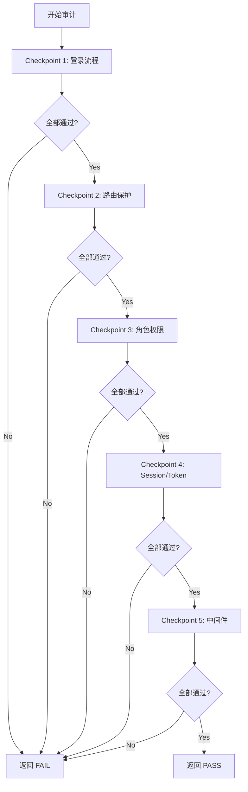

# Auth Security Audit: 认证与权限专项审计

## Overview

对 L2C 系统的认证流程和基于角色的访问控制 (RBAC) 进行专项验证。确保四角色体系运行正常，路由保护无漏洞，权限边界严格隔离。

**核心价值**：确保"该进的进得去，不该进的进不去，角色看到的都是自己该看的"。

> [!CAUTION]
> **铁律：Next.js 16 路由代理文件命名为 `proxy.ts`，不再是 `middleware.ts`**
>
> |    Next.js 版本    | 路由代理文件名  | 备注                                |
> | :----------------: | :-------------: | :---------------------------------- |
> |      14 / 15       | `middleware.ts` | 旧约定                              |
> | **16（当前项目）** | **`proxy.ts`**  | 官方更名，避免与 Express 中间件混淆 |
>
> 本项目 `src/proxy.ts` 完全符合 Next.js 16 的标准：
>
> - 文件名：`proxy.ts`（Next.js 16 官方标准）
> - 位置：`src/` 根目录（与 `app/` 同级）
> - 导出：`export default async function proxy(request: NextRequest)`
> - 配置：`export const config = { matcher: [...] }`
>
> **审计时严禁将 `proxy.ts` 误判为未激活的 middleware，这是 Next.js 16 的正式约定。**

## When to Use

- **发布门禁**：被 `version-release-protocol` Step 0 Gate 0.3 调用
- **认证重构后**：修改了 Auth.js / 中间件 / Session 逻辑后
- **角色变更后**：新增角色或修改权限配置后
- **安全事件后**：发现越权或认证漏洞后

## 通过标准 (Pass/Fail Criteria)

|  级别   | 条件                                           |        结果         |
| :-----: | :--------------------------------------------- | :-----------------: |
| 🚫 硬性 | 任何角色登录流程异常（无法获取 Session/Token） | **FAIL — 阻断发布** |
| 🚫 硬性 | 路由保护失效或出现重定向死循环                 | **FAIL — 阻断发布** |
| 🚫 硬性 | 越权访问返回 500 而非 401/403                  | **FAIL — 阻断发布** |
| 🚫 硬性 | 未登录状态可直接访问受保护的 API 并获取数据    | **FAIL — 阻断发布** |
| ⚠️ 软性 | 角色切换后页面闪烁或短暂显示错误内容           |    记录，不阻断     |
| ⚠️ 软性 | Session 过期后的重新登录引导不够友好           |    记录，不阻断     |

---

## 1. L2C 四角色体系

|   角色    | 英文标识      | 平台         | 核心功能                 |
| :-------: | :------------ | :----------- | :----------------------- |
| 🔵 管理者 | `manager`     | Web + 小程序 | 全局管理、数据统计、审批 |
|  🟢 销售  | `salesperson` | Web + 小程序 | 线索跟进、报价、客户管理 |
|  🟠 师傅  | `engineer`    | 小程序       | 接单、施工、进度上报     |
|  🟣 客户  | `customer`    | 小程序       | 查看进度、验收确认       |

---

## 2. 审计检查清单

### Checkpoint 1: 登录流程验证

| #   | 检查项       | 验证方式                                         | 通过标准                             |
| --- | ------------ | ------------------------------------------------ | ------------------------------------ |
| 1.1 | Web 端登录   | 使用管理者账号登录 Web                           | 成功获取 Session，重定向到 Dashboard |
| 1.2 | 小程序端登录 | 模拟四角色分别调用 `/api/miniprogram/auth/login` | 均返回有效 Token                     |
| 1.3 | 移动端登录   | 使用管理者/销售账号通过移动端 Auth 流程          | 成功获取 Session                     |
| 1.4 | 无效凭证     | 使用错误密码/无效 openId 登录                    | 返回明确错误信息，不暴露系统细节     |

### Checkpoint 2: 路由保护验证

| #   | 检查项         | 验证方式                                         | 通过标准                    |
| --- | -------------- | ------------------------------------------------ | --------------------------- |
| 2.1 | Web 未登录保护 | 未登录状态直接访问 `/dashboard`                  | 302 重定向到登录页          |
| 2.2 | API 未登录保护 | 未携带 Session/Token 访问 `/api/workbench/stats` | 返回 401                    |
| 2.3 | 重定向无死循环 | 未登录访问受保护路由后，观察是否无限重定向       | 最多 1 次重定向即到达登录页 |
| 2.4 | 登录后回跳     | 登录后是否正确回跳到之前被拦截的页面             | 回到原始目标页或默认首页    |
| 2.5 | 公开路由可达   | 未登录状态访问 Landing Page (`/`)                | 正常显示，不被重定向        |

### Checkpoint 3: 角色权限隔离

| #   | 检查项       | 验证方式                                                            | 通过标准             |
| --- | ------------ | ------------------------------------------------------------------- | -------------------- |
| 3.1 | 管理者可达性 | 管理者登录后访问管理功能模块                                        | 正常显示管理界面     |
| 3.2 | 销售可达性   | 销售登录后访问销售功能模块                                          | 正常显示销售界面     |
| 3.3 | 师傅可达性   | 师傅 Token 访问 `/api/miniprogram/engineer/tasks`                   | 200 + 返回任务列表   |
| 3.4 | 客户可达性   | 客户 Token 访问 `/api/miniprogram/crm/projects`                     | 200 + 返回项目列表   |
| 3.5 | 横向越权阻断 | 销售 Token 访问管理者专属 API（如 `/api/miniprogram/tenant/`）      | 返回 403 Forbidden   |
| 3.6 | 纵向越权阻断 | 客户 Token 访问师傅专属 API（如 `/api/miniprogram/engineer/tasks`） | 返回 403 Forbidden   |
| 3.7 | 数据租户隔离 | 检查 API 查询是否包含 `tenantId` 过滤                               | 代码审查确认，无遗漏 |

### Checkpoint 4: Session/Token 安全

| #   | 检查项           | 验证方式                | 通过标准                                       |
| --- | ---------------- | ----------------------- | ---------------------------------------------- |
| 4.1 | Token 过期处理   | 使用过期 Token 调用 API | 返回 401，不返回 500                           |
| 4.2 | Token 伪造防护   | 使用伪造 Token 调用 API | 返回 401，不返回 500                           |
| 4.3 | Session 安全属性 | 检查 Cookie 配置        | `httpOnly=true`、`secure=true`、`sameSite=lax` |
| 4.4 | 密码/密钥不泄露  | 检查 API 响应和前端代码 | 不含密码、密钥、内部 ID 等敏感信息             |

### Checkpoint 5: 路由代理层一致性（`src/proxy.ts`）

| #   | 检查项         | 验证方式                                              | 通过标准                              |
| --- | -------------- | ----------------------------------------------------- | ------------------------------------- |
| 5.1 | Proxy 路由匹配 | 审查 `src/proxy.ts` 的 `matcher` 配置                 | 所有受保护路由均被 matcher 覆盖       |
| 5.2 | 公开路由白名单 | 检查 `PUBLIC_PATH_PREFIXES` 是否明确列出              | 仅 Landing、登录页、公开 API 在白名单 |
| 5.3 | API 路由保护   | 检查 API 路由处理函数中的身份验证                     | 所有非公开 API 第一行即验证身份       |
| 5.4 | 文件命名确认   | 确认使用 `proxy.ts`（Next.js 16）而非 `middleware.ts` | 文件名和导出签名符合当前版本约定      |

---

## 3. 审计流程



> **执行规则**：按 Checkpoint 顺序执行，任一硬性条件失败即刻中止并返回 FAIL。

---

## 4. 报告模板

```markdown
# Auth Security Audit Report

> 审计时间：YYYY-MM-DD HH:mm
> 环境：开发 / 生产

## 结果摘要

| 检查点         | 总项 | 通过 | 失败 | 结果 |
| -------------- | :--: | :--: | :--: | :--: |
| CP1 登录流程   |  4   |  4   |  0   |  ✅  |
| CP2 路由保护   |  5   |  5   |  0   |  ✅  |
| CP3 角色权限   |  7   |  6   |  1   |  ❌  |
| CP4 Token 安全 |  4   |  4   |  0   |  ✅  |
| CP5 中间件     |  3   |  3   |  0   |  ✅  |

## 门禁判定

**FAIL** ❌

### 失败项详情

| #   | 检查项       | 预期 | 实际 |  严重级别   |
| --- | ------------ | ---- | ---- | :---------: |
| 3.5 | 横向越权阻断 | 403  | 500  | 🚫 Critical |

### 建议

- 3.5: 在 `/api/miniprogram/tenant/` 路由中添加角色权限检查
```

---

## 5. 与其他 Skill 的关系

| 场景                                               | 关系                                               |
| :------------------------------------------------- | :------------------------------------------------- |
| 被 `version-release-protocol` Step 0 Gate 0.3 调用 | 返回 PASS/FAIL                                     |
| 发现认证漏洞或越权                                 | 建议用户调用 `module-audit` 对 auth 模块做深度审计 |
| 登录重定向死循环                                   | 建议用户调用 `systematic-debugging` 排查中间件逻辑 |
| 权限配置需求不清晰                                 | 调用 `brainstorming` 技能协作明确 RBAC 架构        |
