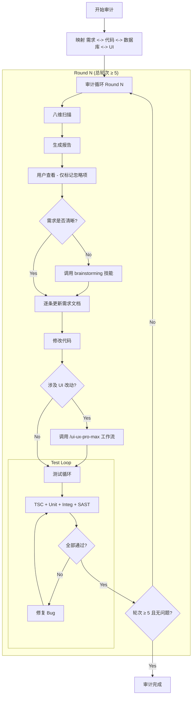

# Module Audit: Military-Grade Verification

## Overview

A rigorous, iterative process to audit project modules against eight critical dimensions:
1.  **Requirement-Code Consistency**: Does the code match the docs?
2.  **Business Logic & Code Quality**: Can the business process and code quality be improved?
3.  **Military-Grade Security**: Is the module secure against all known threats?
4.  **Database Audit**: Is the database schema robust, performant, and safe?
5.  **UI/UX Audit**: Is the user experience smooth and professional?
6.  **Test Coverage Audit**: Are tests comprehensive and covering critical paths?
7.  **Documentation Audit**: Are docs, comments, and API references complete?
8.  **Observability & Operations Audit**: Are logging, monitoring, and audit trails in place?

## When to Use

*   **Pre-Release**: Before a major module release.
*   **Refactoring**: When planning significant changes to a legacy module.
*   **Quality Assurance**: When system stability or security is in question.
*   **Documentation Gap**: When code exists but requirements are missing (reverse engineering).

## Default Remediation Pattern (默认全部整改 + 文档先行)

此技能采用 **默认全部整改** 模式，**文档先行是铁律**：

1.  **Audit**: Agent 扫描代码/文档/数据库/UI，生成审计报告。
2.  **Pause**: Agent 展示报告，**停下来等待用户确认**。
3.  **Default Action**: 除非用户**单独标记某项忽略**，否则全部整改。
4.  **Doc-First (文档先行铁律)**: 每一条整改项，在动任何代码之前，**必须先更新对应的需求文档**。确保需求文档时刻反映真实的系统行为。
5.  **Execute & Test**: 按照更新后的文档执行修改，并通过测试验证。

> **核心原则**:
> - 不逐条沟通，全部整改。
> - **文档先行是铁律**：每一条整改，先写文档，再改代码。时刻保持需求文档与代码的一致性。
> - **需求不清晰时**：立即调用 `brainstorming` 技能，通过协作对话明确需求后再继续。

## 1. The Audit Workflow (Nested Loop)

Follow this structure strictly:



## 2. Module Mapping

Automatically map the module to its resources. If docs are missing, trigger **Reverse Requirements Generation**.

| Module Name | Code Path (`src/features/`) | Requirements Path (`docs/02-requirements/modules/`) | DB Schema Path | Note |
| :--- | :--- | :--- | :--- | :--- |
| **leads** | `leads/` | `线索/` + `线索需求.md` | `leads/schemas.ts` | |
| **customers** | `customers/` | `客户&渠道/` | `customers/schemas.ts` | |
| **channels** | `channels/` | `客户&渠道/` | 共用 customers schema | |
| **quotes** | `quotes/` + `pricing/` | `报价单/` | `quotes/action-schemas.ts` + `quotes/schema/` | |
| **orders** | `orders/` | `订单/` + `order-management.md` | `orders/action-schemas.ts` | |
| **measure** | `service/` (measure) | `测量/` | `service/measurement/domain/schema.ts` | |
| **install** | `service/` (install) | `安装单/` | 同 service schema | |
| **after-sales** | `after-sales/` | `售后.md` | 按模块目录查找 | |
| **finance** | `finance/` | `财务模块/` | `finance/schemas.ts` | |
| **supply-chain** | `supply-chain/` | `供应链.md` + `采购单/` | `supply-chain/schemas.ts` | |
| **products** | `products/` | `商品.md` | `products/schema.ts` | |
| **approval** | `approval/` | `审批流程.md` | `approval/schema.ts` | |
| **notifications** | `notifications/` | `通知.md` | 按模块目录查找 | |
| **settings** | `settings/` | `系统设置.md` | `settings/schema.ts` | |
| **analytics** | `analytics/` + `dashboard/` | `数据报表.md` | 按模块目录查找 | |
| **showroom** | `showroom/` | **[AUTO-GEN]** Reverse from code | `showroom/actions/schema.ts` | |
| **upload** | `upload/` | **[AUTO-GEN]** Reverse from code | 按模块目录查找 | |
| **auth** | `auth/` | **[AUTO-GEN]** Reverse from code | 按模块目录查找 | |
| **search** | `search/` | **[AUTO-GEN]** Reverse from code | 按模块目录查找 | |
| **mobile** | `../app/api/mobile/` | `移动端.md` | 同主模块 schema | |

> **DB 基础设施**: `src/shared/api/db.ts` (连接)、`src/shared/lib/db-helpers.ts` (工具函数)、`drizzle/` (迁移文件)

## 3. Eight-Dimensional Audit Checklist

### Dimension 1: Requirement-Code Consistency (需求-代码一致性)
*   **Missing in Doc**: Code implements feature X, but doc is silent. -> *Action: Update Doc*.
*   **Missing in Code**: Doc requires feature Y, but code is missing. -> *Action: Plan Implementation*.
*   **Mismatch**: Doc says A, Code does B. -> *Action: Flag for Decision*.
*   **Permissions**: Verify against `src/shared/config/permissions.ts` & `roles.ts`.
*   **TODO/Placeholder 扫描**: 搜索 `TODO`、`FIXME`、`HACK`、`placeholder`、`mock` 等标记，量化未完成项。
*   **需求覆盖率**: 对照需求文档，逐条确认功能是否已实现。

### Dimension 2: Business Logic & Code Quality (业务逻辑与代码质量)
*   **Flow Efficiency**: Are there redundant steps?
*   **Data Value**: Are we capturing all valuable metrics?
*   **UX**: Is the process intuitive? (If unclear, use `brainstorming` skill)
*   **TypeScript 严格度检查**:
    *   是否存在 `any` 类型滥用?
    *   是否有 `@ts-ignore` / `@ts-expect-error` 压制?
    *   类型推断是否充分，有无不必要的 `as` 类型断言?
*   **代码重复度**:
    *   是否存在复制粘贴的重复逻辑?
    *   是否有可抽取为共享工具函数的模式?
*   **圈复杂度 (Cyclomatic Complexity)**:
    *   单个函数是否有过深的嵌套 (>3 层)?
    *   是否有过长的 if-else / switch 链?
    *   单个文件/函数是否超过 300 行?
*   **命名规范**:
    *   变量/函数/类命名是否语义清晰?
    *   是否遵循项目统一的命名约定 (camelCase, PascalCase)?
*   **架构分层**:
    *   是否遵循 actions → service → schema 的分层架构?
    *   UI 组件中是否混入了业务逻辑?
    *   数据获取层是否与展示层分离?

### Dimension 3: Military-Grade Security (军事级安全)
*   **Injection**: SQLi, NoSQLi, Command Injection.
*   **XSS/CSRF**: React escaping, CSRF tokens.
*   **AuthZ**: IDOR (Insecure Direct Object References), Horizontal/Vertical Escalation.
*   **Data Protection**: PII masking, encryption at rest/transit.
*   **Audit Logs**: Is every write operation logged?

### Dimension 4: Database Audit (数据库审计)
*   **表结构 (Schema)**:
    *   字段类型是否准确（如金额用 `decimal`，时间用 `timestamp`）?
    *   字段命名是否一致（`camelCase` vs `snake_case`）?
    *   是否缺少必要的索引 (Index)，特别是高频查询字段?
    *   外键 (Foreign Key) 约束是否完整?
*   **数据完整性 (Data Integrity)**:
    *   `NOT NULL` / `UNIQUE` / `DEFAULT` 约束是否合理?
    *   枚举 (Enum) 值是否与代码中的常量保持一致?
    *   级联删除/更新策略是否安全?
*   **查询性能 (Query Performance)**:
    *   是否存在 N+1 查询问题?
    *   是否存在缺失索引导致的全表扫描风险?
    *   复杂查询是否有分页 (Pagination) 和合理的 `LIMIT`?
    *   事务 (Transaction) 范围是否过大?
*   **前端性能 (Frontend Performance)**:
    *   组件是否有不必要的重渲染?
    *   是否使用了懒加载 (Lazy Loading) 和代码分割 (Code Splitting)?
    *   图片/资源是否经过优化?
    *   Bundle 大小是否合理?
*   **缓存策略 (Caching)**:
    *   高频读取数据是否有合理的缓存策略?
    *   缓存失效策略是否正确?
*   **迁移安全 (Migration Safety)**:
    *   迁移脚本是否可回滚 (Rollback)?
    *   是否存在破坏性变更 (Breaking Change) 风险，例如删列、改类型?
    *   `drizzle/` 目录下的迁移与 schema 是否同步?
*   **数据安全 (Data Security)**:
    *   敏感字段 (PII) 是否已加密或脱敏?
    *   软删除 (Soft Delete) 策略是否正确实施?
    *   多租户隔离 (Tenant Isolation)：所有查询是否都包含 `tenantId` 过滤?

### Dimension 5: UI/UX Audit (界面与体验审计)

**REQUIRED WORKFLOW:** 调用 `/ui-ux-pro-max` 工作流获取设计参考和最佳实践。

*   **交互流畅度 (Interaction Flow)**:
    *   操作路径是否最短? 有无冗余步骤?
    *   关键操作是否需要过多点击?
    *   表单流程是否直观、字段顺序是否合理?
*   **信息架构 (Information Architecture)**:
    *   页面信息层级是否清晰?
    *   重要信息是否一眼可见，次要信息是否合理折叠?
    *   列表/表格字段是否有助决策?
*   **反馈与状态 (Feedback & States)**:
    *   Loading / Empty / Error 状态是否都已处理?
    *   操作成功/失败是否有明确反馈 (Toast/Alert)?
    *   异步操作是否有进度指示?
*   **一致性 (Consistency)**:
    *   同类操作的交互模式是否一致 (如删除确认、编辑入口)?
    *   组件使用是否遵循设计系统规范?
    *   色彩、间距、字号是否统一?
*   **可访问性 (Accessibility)**:
    *   表单是否有 Label?
    *   颜色对比度是否达标 (4.5:1)?
    *   键盘导航是否可用?

### Dimension 6: Test Coverage Audit (测试覆盖审计)
*   **单元测试 (Unit Tests)**:
    *   核心业务逻辑 (Service 层) 是否有单元测试?
    *   边界条件和异常路径是否覆盖?
    *   工具函数/纯函数是否有测试?
    *   Mock 使用是否合理，有无过度 Mock?
*   **集成测试 (Integration Tests)**:
    *   API 路由边界测试是否覆盖?
    *   数据库交互层是否有集成测试?
    *   认证/授权流程是否有测试?
*   **E2E 测试 (End-to-End Tests)**:
    *   关键业务流程是否有 E2E 测试?
    *   用户核心操作路径是否覆盖?
*   **测试质量**:
    *   测试是否有意义（非仅为覆盖率而写）?
    *   测试描述是否清晰表达业务意图?
    *   测试是否稳定，有无 Flaky Test?

### Dimension 7: Documentation Audit (文档完整性审计)
*   **需求文档 (Requirements Docs)**:
    *   `docs/02-requirements/modules/` 下是否有对应的需求文档?
    *   需求文档是否与当前代码行为一致?
    *   新增功能是否已反映在文档中?
*   **API 文档**:
    *   Server Actions / API Routes 是否有入参/出参文档?
    *   错误码和异常情况是否有文档说明?
*   **代码注释 (Code Comments)**:
    *   复杂业务逻辑是否有注释说明?
    *   公共函数/工具函数是否有 JSDoc/TSDoc?
    *   注释是否与代码同步更新（无过时注释）?
*   **Schema 文档**:
    *   数据库表/字段是否有说明?
    *   枚举值含义是否有文档?

### Dimension 8: Observability & Operations Audit (可运维性审计)
*   **日志规范 (Logging)**:
    *   关键业务操作是否有日志记录?
    *   日志级别是否合理 (info/warn/error)?
    *   日志是否包含足够的上下文信息 (userId, tenantId, traceId)?
    *   是否有敏感信息泄露到日志中?
*   **审计追踪 (Audit Trail)**:
    *   所有写操作 (创建/更新/删除) 是否有审计日志?
    *   审计日志是否包含操作人、操作时间、变更前后的值?
    *   是否使用了统一的 `AuditService.log()` 方法?
*   **错误监控 (Error Monitoring)**:
    *   未捕获的异常是否有全局处理?
    *   错误信息是否对用户友好（不暴露技术细节）?
    *   是否有错误分类和严重程度标记?
*   **健康检查 (Health Checks)**:
    *   关键外部依赖是否有健康检查?
    *   服务降级策略是否明确?

## 4. Testing Strategy (High-Standard)

Implementation is NOT complete until **ALL** levels pass:

1.  **Level 1: Static** (`npx tsc --noEmit`) - Zero type errors.
2.  **Level 2: Unit** (`Vitest`) - Core logic coverage > 90%.
3.  **Level 3: Integration** - API route boundary tests.
4.  **Level 4: Security** - SAST scan for known patterns.

## 5. Report Template

Save to: `docs/03-audits/<module>/round-<n>.md`

```markdown
# [Module] Audit Report - Round <N>

## 1. Requirement Consistency (需求一致性)
| ID | Issue | Type (DocMissing/CodeMissing/Mismatch) | Location | Suggested Action |
|:---|:---|:---|:---|:---|
| 1.1 | ... | ... | ... | ... |

## 2. Business Logic & Code Quality (业务逻辑与代码质量)
| ID | Issue | Category (Flow/Quality/Complexity/Naming/Architecture) | Location | Suggested Action |
|:---|:---|:---|:---|:---|
| 2.1 | ... | ... | ... | ... |

## 3. Security (安全审计)
| ID | Vulnerability | Severity (Critical/High/Med) | Location | Fix |
|:---|:---|:---|:---|:---|
| 3.1 | ... | ... | ... | ... |

## 4. Database & Performance (数据库与性能审计)
| ID | Issue | Category (Schema/Integrity/Performance/Migration/Security/Frontend/Cache) | Location | Fix |
|:---|:---|:---|:---|:---|
| 4.1 | ... | ... | ... | ... |

## 5. UI/UX (界面与体验审计)
| ID | Issue | Category (Flow/InfoArch/Feedback/Consistency/A11y) | Location | Fix |
|:---|:---|:---|:---|:---|
| 5.1 | ... | ... | ... | ... |

## 6. Test Coverage (测试覆盖审计)
| ID | Issue | Category (Unit/Integration/E2E/Quality) | Location | Fix |
|:---|:---|:---|:---|:---|
| 6.1 | ... | ... | ... | ... |

## 7. Documentation (文档完整性审计)
| ID | Issue | Category (Requirements/API/Comments/Schema) | Location | Fix |
|:---|:---|:---|:---|:---|
| 7.1 | ... | ... | ... | ... |

## 8. Observability & Operations (可运维性审计)
| ID | Issue | Category (Logging/AuditTrail/ErrorMonitoring/HealthCheck) | Location | Fix |
|:---|:---|:---|:---|:---|
| 8.1 | ... | ... | ... | ... |

## Ignored Items (用户标记忽略)
| ID | Reason |
|:---|:---|
| ... | ... |
```

> **执行规则**:
> - 报告中除 "Ignored Items" 外，所有项目**默认全部整改**。
> - **文档先行铁律**：每一条整改，先更新需求文档 → 再修改代码 → 最后测试验证。
> - **需求不清晰**：调用 `brainstorming` 技能协作明确需求。
> - **涉及 UI 改动**：调用 `/ui-ux-pro-max` 工作流指导设计实施。
