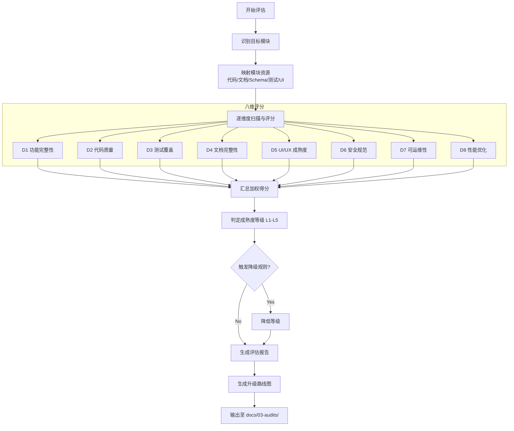

# Module Maturity Assessment: 模块成熟度评估

## Overview

一个独立的**顾问型**评估工具。不同于 `module-audit`（发现问题 → 修复问题），本技能站在更高的视角，对模块整体"建设程度"做体检，输出成熟度等级和战略性改进路线图。

**核心价值**：量化现状 → 识别短板 → 指引方向

## When to Use

*   **项目进度评估**：需要了解某个模块"做到了什么程度"
*   **资源规划**：需要决定接下来把开发资源投入到哪个方向
*   **风险识别**：需要快速识别模块的最薄弱环节
*   **演示/汇报**：需要向管理层/产品展示模块建设进度
*   **对比分析**：需要横向对比不同模块的成熟度差异

## When NOT to Use

*   需要逐行审查代码、修复具体 Bug → 使用 `module-audit`
*   需要实施具体的安全加固 → 使用 `module-audit`

---

## 1. Maturity Model (成熟度模型)

### 五级成熟度定义

| 等级 | 名称 | 综合得分 | 核心特征 |
|:---:|:---|:---:|:---|
| **L1** | 🔴 骨架期 (Skeleton) | 0-2 | 只有基础路由和页面框架，核心业务逻辑未实现 |
| **L2** | 🟠 可用期 (Functional) | 2-4 | 核心 CRUD 功能可用，但缺少边界处理、安全机制、测试 |
| **L3** | 🟡 完善期 (Robust) | 4-6 | 功能完整，有输入校验、错误处理、基本安全措施，但测试和文档不完整 |
| **L4** | 🟢 生产就绪 (Production-Ready) | 6-8 | 全面的安全、测试、文档、日志、监控，可直接上线 |
| **L5** | 🔵 持续优化 (Optimized) | **每项 ≥ 9** | 所有 8 个维度得分均 ≥ 9，代表全方位卓越：性能调优、高级分析、自动化运维、持续改进闭环 |

### 等级判定规则

综合得分 = 8 个维度得分的加权平均（默认等权重 12.5%）。

**降级规则**（任一条触发则降低一级）：
- 任何维度得分 ≤ 2 → 最高判定为 L2
- 安全维度 (D6) 得分 ≤ 4 → 最高判定为 L3
- 测试维度 (D3) 得分 ≤ 3 → 最高判定为 L3
- **任何维度得分 < 9 → 最高判定为 L4**（L5 要求所有维度均达到 9 分以上）

---

## 2. Eight Assessment Dimensions (八大评估维度)

### D1: 功能完整性 (Feature Completeness) — 权重 15%

**评估方法**：
1. 扫描需求文档，列出所有预期功能点
2. 逐条对照代码实现，标记：✅ 已实现 / ⚠️ 部分实现 / ❌ 未实现
3. 搜索 `TODO`、`FIXME`、`HACK`、`placeholder`、`mock` 等标记
4. 计算需求覆盖率 = 已实现数 / 总需求数

**评分标准**：
| 分数 | 标准 |
|:---:|:---|
| 9-10 | 需求覆盖率 ≥ 95%，无 TODO/placeholder |
| 7-8 | 需求覆盖率 ≥ 80%，少量非关键 TODO |
| 5-6 | 需求覆盖率 ≥ 60%，有部分功能缺失 |
| 3-4 | 需求覆盖率 ≥ 40%，核心功能存在缺失 |
| 1-2 | 需求覆盖率 < 40%，大量功能未实现 |

---

### D2: 代码质量 (Code Quality) — 权重 12.5%

**评估方法**：
1. 扫描 `any` 类型使用量、`@ts-ignore` 数量
2. 检查重复代码模式（复制粘贴痕迹）
3. 评估函数嵌套深度、单文件行数、单函数行数
4. 检查命名规范一致性
5. 验证架构分层（actions → service → schema）

**评分标准**：
| 分数 | 标准 |
|:---:|:---|
| 9-10 | 零 `any`/`ts-ignore`，无重复代码，严格分层，命名统一 |
| 7-8 | 少量 `any`（<5 处），轻微重复，分层基本正确 |
| 5-6 | 存在 `any` 滥用（5-15 处），有明显重复代码 |
| 3-4 | 大量 `any`，严重代码重复，分层混乱 |
| 1-2 | 无类型约束，代码无组织结构 |

---

### D3: 测试覆盖 (Test Coverage) — 权重 12.5%

**评估方法**：
1. 检查 `__tests__/` 目录是否存在
2. 统计测试文件数量和测试用例数量
3. 评估核心业务路径是否有测试
4. 检查测试质量（是否有断言、是否测试边界条件）

**评分标准**：
| 分数 | 标准 |
|:---:|:---|
| 9-10 | 单元 + 集成 + E2E 全覆盖，核心路径 100% 覆盖 |
| 7-8 | 单元 + 集成测试覆盖，核心路径 ≥ 80% 覆盖 |
| 5-6 | 有单元测试，覆盖主要业务逻辑 |
| 3-4 | 少量测试文件，覆盖不完整 |
| 1-2 | 无测试或仅有占位测试 |

---

### D4: 文档完整性 (Documentation) — 权重 10%

**评估方法**：
1. 检查 `docs/02-requirements/modules/` 下对应文档是否存在
2. 验证文档内容与代码行为是否一致
3. 检查关键函数/Actions 是否有 JSDoc/TSDoc
4. 检查 Schema 字段是否有注释

**评分标准**：
| 分数 | 标准 |
|:---:|:---|
| 9-10 | 需求文档完整且同步，API 全部有文档，Schema 有注释 |
| 7-8 | 需求文档基本完整，核心 API 有文档 |
| 5-6 | 有需求文档但部分过时，注释不完整 |
| 3-4 | 需求文档严重缺失或过时 |
| 1-2 | 无任何文档 |

---

### D5: UI/UX 成熟度 (UI/UX Maturity) — 权重 12.5%

**评估方法**：
1. 检查 Loading / Empty / Error 三态处理是否完整
2. 检查表单校验和用户反馈 (Toast/Alert)
3. 评估信息架构和交互一致性
4. 检查响应式设计和可访问性

**评分标准**：
| 分数 | 标准 |
|:---:|:---|
| 9-10 | 三态完整，交互一致，响应式完美，可访问性达标 |
| 7-8 | 三态基本处理，交互较一致，有基本响应式 |
| 5-6 | 部分状态缺失，交互有不一致 |
| 3-4 | 大量状态未处理，交互混乱 |
| 1-2 | 仅有基础页面骨架 |

---

### D6: 安全规范 (Security) — 权重 15%

**评估方法**：
1. 检查所有 API 路由的认证/授权机制
2. 验证输入校验 (Zod Schema Validation)
3. 检查多租户隔离 (`tenantId` 过滤)
4. 搜索 SQL 注入、XSS、IDOR 风险点

**评分标准**：
| 分数 | 标准 |
|:---:|:---|
| 9-10 | 全面的认证授权，严格输入校验，完整租户隔离，无已知漏洞 |
| 7-8 | 认证授权完整，大部分路由有输入校验 |
| 5-6 | 基本认证，部分路由缺少校验或租户隔离 |
| 3-4 | 认证不完整，存在明显安全漏洞 |
| 1-2 | 无安全机制或存在严重漏洞 |

---

### D7: 可运维性 (Observability & Operations) — 权重 10%

**评估方法**：
1. 检查关键操作是否有日志记录
2. 验证审计追踪 (AuditService) 的使用
3. 检查错误处理和用户友好的错误信息
4. 评估异常监控和降级策略

**评分标准**：
| 分数 | 标准 |
|:---:|:---|
| 9-10 | 完整日志、审计追踪、错误监控、健康检查、降级策略 |
| 7-8 | 关键操作有日志和审计，错误有分类处理 |
| 5-6 | 部分日志，基本审计追踪 |
| 3-4 | 日志零散，无审计追踪 |
| 1-2 | 无日志或监控 |

---

### D8: 性能优化 (Performance) — 权重 12.5%

**评估方法**：
1. 检查数据库查询是否有索引、分页、合理 LIMIT
2. 检查 N+1 查询问题
3. 评估前端渲染性能（懒加载、代码分割）
4. 检查缓存策略

**评分标准**：
| 分数 | 标准 |
|:---:|:---|
| 9-10 | 查询全部优化，有缓存策略，前端性能优秀 |
| 7-8 | 主要查询已优化，有基本分页 |
| 5-6 | 部分查询未优化，无缓存 |
| 3-4 | 存在性能瓶颈（N+1、全表扫描等） |
| 1-2 | 无任何性能考虑 |

---

## 3. Assessment Workflow (评估流程)



## 4. Report Template (报告模板)

保存至：`docs/03-audits/<module>/maturity-assessment.md`

```markdown
# [模块名] 成熟度评估报告

> 评估日期：YYYY-MM-DD
> 评估人：AI Agent
> 模块路径：`src/features/<module>/`

---

## 📊 管理摘要 (Executive Summary)

| 指标 | 结果 |
|:---|:---|
| **成熟度等级** | 🟡 L3 完善期 (Robust) |
| **综合得分** | 6.2 / 10 |
| **最强维度** | D1 功能完整性 (9/10) |
| **最薄弱维度** | D3 测试覆盖 (3/10) |
| **降级触发** | D3 ≤ 3 → 最高 L3 |
| **升级至 L4 预计工作量** | 约 5 人天 |

## 📈 维度打分卡 (Scorecard)

| 维度 | 得分 | 等级 | 核心发现 |
|:---:|:---:|:---:|:---|
| D1 功能完整性 | 9/10 | 🔵 | 需求覆盖率 95%，仅 2 个非关键 TODO |
| D2 代码质量 | 7/10 | 🟢 | 少量 `any`（3 处），架构分层清晰 |
| D3 测试覆盖 | 3/10 | 🔴 | 仅 2 个测试文件，无集成/E2E 测试 |
| D4 文档完整性 | 5/10 | 🟡 | 需求文档存在但部分过时 |
| D5 UI/UX 成熟度 | 7/10 | 🟢 | 三态基本处理，交互较一致 |
| D6 安全规范 | 6/10 | 🟡 | 认证完整，部分路由缺少输入校验 |
| D7 可运维性 | 5/10 | 🟡 | 部分日志，基本审计追踪 |
| D8 性能优化 | 6/10 | 🟡 | 主要查询有分页，缺少缓存策略 |

## 🔍 维度详细分析

### D1 功能完整性 — 9/10 🔵

**现状**：需求覆盖率 95%，仅 2 个非关键 TODO
**差距**：距 L5 需清理所有 TODO 并补充高级分析功能
**改进行动**：
1. 🟡 P2: 清理剩余 2 个 TODO
2. 🟡 P2: 评估是否需要高级数据分析功能

(... 其余维度同此格式 ...)

## 🗺️ 升级路线图：L3 → L4

> 预计总工作量：约 5 人天

### 阶段一：补齐安全短板（优先级最高，预计 1 天）
- [ ] 所有 API 路由添加 Zod 输入校验
- [ ] 补全多租户隔离检查

### 阶段二：补齐测试覆盖（预计 2 天）
- [ ] 为 Service 层核心逻辑编写单元测试（≥ 10 个用例）
- [ ] 为 API 路由编写集成测试（覆盖核心 CRUD）
- [ ] 确保关键业务路径测试覆盖率 ≥ 80%

### 阶段三：完善文档（预计 1 天）
- [ ] 更新需求文档，与当前代码行为同步
- [ ] 为核心 Actions/Service 方法补充 JSDoc
- [ ] 补充 Schema 字段注释

### 阶段四：增强可运维性（预计 1 天）
- [ ] 为所有写操作添加 AuditService.log() 调用
- [ ] 统一错误处理和日志格式
- [ ] 检查并补充错误分类

## 📝 附录：与 module-audit 的关系

本评估报告为**宏观体检**，如需对具体问题进行深入审查和修复，
请使用 `module-audit` 技能进行逐项审计整改。
```

## 5. 与 module-audit 的协作

| 场景 | 使用哪个 Skill |
|:---|:---|
| "这个模块做到什么程度了？" | ✅ `module-maturity-assessment` |
| "这个模块有什么 Bug / 安全漏洞？" | ✅ `module-audit` |
| "先体检再深度审计" | 先跑 `maturity-assessment` → 识别最薄弱维度 → 再用 `module-audit` 针对性审计 |
| "横向对比所有模块进度" | ✅ `module-maturity-assessment`（逐模块评估后汇总） |

## 6. Module Resource Mapping (模块资源映射)

复用 `module-audit` 中的模块映射表。评估时自动引用该表定位资源。

> **REQUIRED:** 评估前先查看 `module-audit` 技能中的 Module Mapping 表，定位模块的代码、文档、Schema 和 UI 资源。
