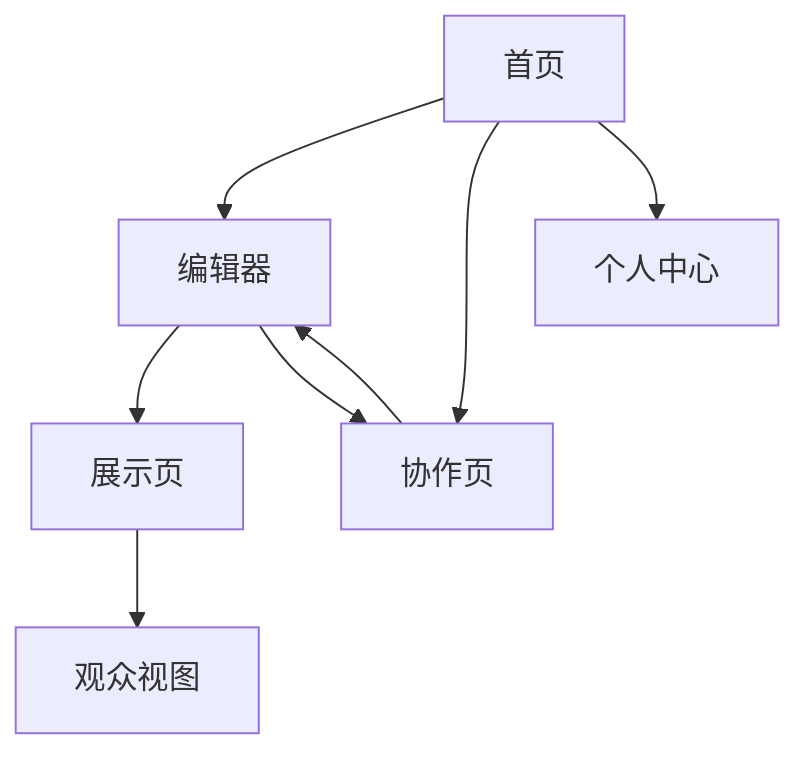

## 1. Product Overview
Slideboard是一个现代化的幻灯片展示和管理平台，专注于提供流畅的演示体验和协作功能。
- 解决传统PPT软件协作困难、版本管理混乱的问题
- 面向需要频繁制作和分享演示文稿的团队和个人用户
- 通过云端同步和实时协作提升工作效率

## 2. Core Features

### 2.1 User Roles
| Role | Registration Method | Core Permissions |
|------|---------------------|------------------|
| Normal User | 手机号注册 | 创建个人幻灯片、基础编辑功能 |
| Pro User | 付费升级 | 高级模板、团队协作、版本历史 |
| Admin | 系统管理员 | 用户管理、系统配置 |

### 2.2 Feature Module
我们的Slideboard需求包含以下主要页面：
1. **首页**: 幻灯片列表、快速创建、最近使用
2. **编辑器**: 幻灯片编辑、模板选择、预览模式
3. **展示页**: 全屏演示、演讲者模式、观众视图
4. **协作页**: 团队空间、权限管理、评论功能
5. **个人中心**: 个人资料、我的作品、设置选项

### 2.3 Page Details
| Page Name | Module Name | Feature description |
|-----------|-------------|---------------------|
| 首页 | 幻灯片列表 | 显示用户所有幻灯片，支持搜索和筛选 |
| 首页 | 快速创建 | 提供模板选择和空白创建选项 |
| 首页 | 最近使用 | 展示最近编辑的5个幻灯片 |
| 编辑器 | 幻灯片编辑 | 添加/删除幻灯片、文本编辑、图片插入、形状绘制 |
| 编辑器 | 模板选择 | 预设模板库、自定义模板保存 |
| 编辑器 | 预览模式 | 实时预览幻灯片播放效果 |
| 展示页 | 全屏演示 | 支持键盘导航、动画效果、自动播放 |
| 展示页 | 演讲者模式 | 显示演讲者备注、计时器、下一张预览 |
| 展示页 | 观众视图 | 生成分享链接、实时同步翻页 |
| 协作页 | 团队空间 | 创建团队、邀请成员、共享幻灯片 |
| 协作页 | 权限管理 | 设置编辑/查看权限、角色分配 |
| 协作页 | 评论功能 | 幻灯片内评论、回复通知 |
| 个人中心 | 个人资料 | 头像上传、昵称修改、个人简介 |
| 个人中心 | 我的作品 | 管理个人创建的幻灯片 |
| 个人中心 | 设置选项 | 账户设置、通知偏好、导出设置 |

## 3. Core Process
### 普通用户流程
1. 用户访问首页，查看已有幻灯片列表
2. 点击"新建幻灯片"进入编辑器
3. 选择模板或从空白开始创建
4. 编辑幻灯片内容，添加文本、图片等元素
5. 保存并预览幻灯片效果
6. 进入展示页进行全屏演示
7. 可选择分享链接给其他人观看

### 协作流程
1. 创建团队并邀请成员
2. 将幻灯片分享到团队空间
3. 成员可同时编辑同一份幻灯片
4. 通过评论功能进行讨论
5. 查看版本历史，可回滚到任意版本

## 4. User Interface Design
### 4.1 Design Style
- **主色调**: 深蓝色 (#1E3A8A) + 白色背景
- **辅助色**: 浅灰色 (#F3F4F6) + 橙色 (#F97316) 强调
- **按钮样式**: 圆角设计，主要按钮使用渐变色
- **字体**: Inter 字体家族，标题 24-32px，正文 14-16px
- **布局**: 卡片式布局，左侧导航栏 + 右侧内容区
- **图标**: 使用 Feather Icons 风格，线条简洁

### 4.2 Page Design Overview
| Page Name | Module Name | UI Elements |
|-----------|-------------|-------------|
| 首页 | 幻灯片列表 | 网格布局卡片，每张卡片显示缩略图、标题、修改时间，悬停显示操作按钮 |
| 编辑器 | 工具栏 | 顶部工具栏包含文本、形状、图片插入按钮，左侧幻灯片缩略图列表 |
| 编辑器 | 画布区域 | 中央编辑区域，支持拖拽元素，右侧属性面板 |
| 展示页 | 播放控制 | 底部控制栏，包含播放/暂停、上一张/下一张按钮 |
| 协作页 | 成员列表 | 右侧边栏显示在线成员头像和状态 |
| 个人中心 | 信息卡片 | 顶部个人信息卡片，下方标签页切换不同功能模块 |

### 4.3 Responsiveness
- 采用桌面优先设计策略
- 编辑器界面最小支持 1280px 宽度
- 展示页支持全屏自适应
- 移动端提供基础的查看和简单编辑功能