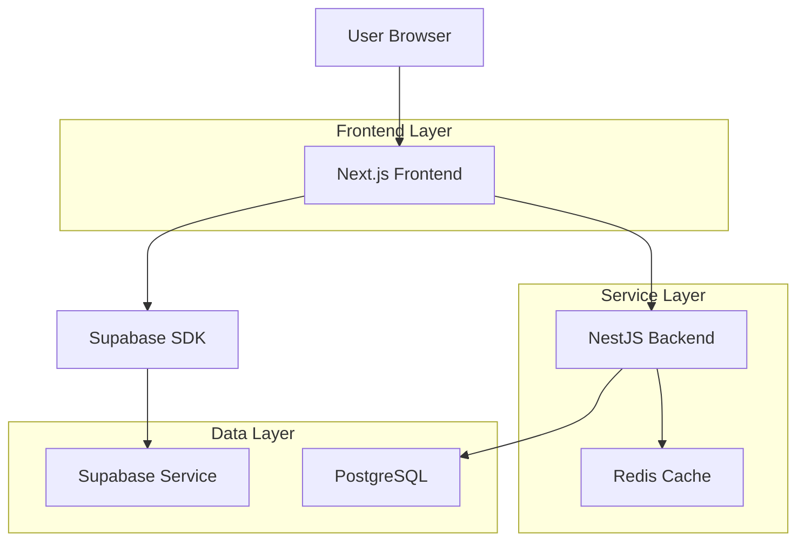
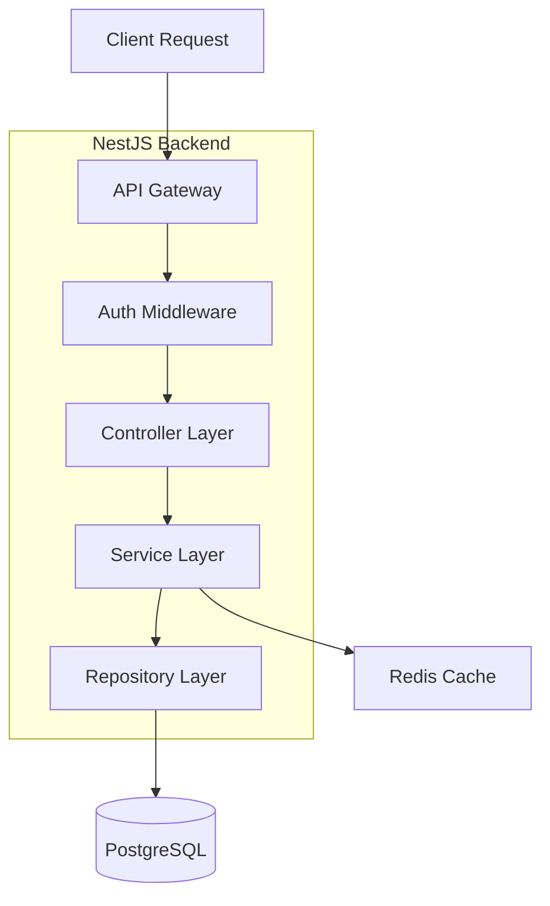
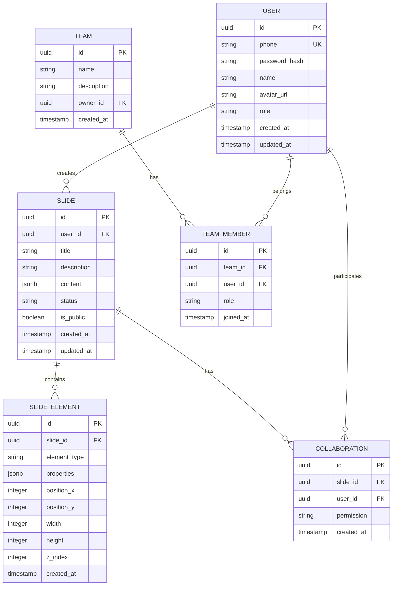

## 1. Architecture design



## 2. Technology Description
- Frontend: Next.js 14+ + React 18 + TypeScript + Tailwind CSS
- Backend: NestJS + TypeScript
- Database: PostgreSQL (via Supabase)
- Cache: Redis
- Storage: Supabase Storage
- Real-time: Supabase Realtime

## 3. Route definitions
| Route | Purpose |
|-------|---------|
| / | 首页，显示幻灯片列表 |
| /editor/[id] | 幻灯片编辑器页面 |
| /present/[id] | 幻灯片展示页面 |
| /collaborate/[id] | 协作编辑页面 |
| /profile | 个人中心页面 |
| /auth/login | 登录页面 |
| /auth/register | 注册页面 |
| /team/[id] | 团队空间页面 |

## 4. API definitions

### 4.1 Authentication API

```
POST /api/auth/login
```

Request:
| Param Name | Param Type | isRequired | Description |
|------------|------------|------------|-------------|
| phone | string | true | 手机号 |
| password | string | true | 密码 |

Response:
| Param Name | Param Type | Description |
|------------|------------|-------------|
| token | string | JWT token |
| user | object | 用户信息 |

### 4.2 Slide API

```
GET /api/slides
```

Response:
| Param Name | Param Type | Description |
|------------|------------|-------------|
| slides | array | 幻灯片列表 |
| total | number | 总数 |

```
POST /api/slides
```

Request:
| Param Name | Param Type | isRequired | Description |
|------------|------------|------------|-------------|
| title | string | true | 幻灯片标题 |
| template_id | string | false | 模板ID |

### 4.3 Collaboration API

```
POST /api/collaboration/invite
```

Request:
| Param Name | Param Type | isRequired | Description |
|------------|------------|------------|-------------|
| slide_id | string | true | 幻灯片ID |
| phone | string | true | 被邀请人手机号 |
| permission | string | true | 权限级别 |

## 5. Server architecture diagram



## 6. Data model

### 6.1 Data model definition



### 6.2 Data Definition Language

```sql
-- User table
CREATE TABLE users (
    id UUID PRIMARY KEY DEFAULT gen_random_uuid(),
    phone VARCHAR(20) UNIQUE NOT NULL,
    password_hash VARCHAR(255) NOT NULL,
    name VARCHAR(100) NOT NULL,
    avatar_url TEXT,
    role VARCHAR(20) DEFAULT 'user' CHECK (role IN ('user', 'pro', 'admin')),
    created_at TIMESTAMP WITH TIME ZONE DEFAULT NOW(),
    updated_at TIMESTAMP WITH TIME ZONE DEFAULT NOW()
);

-- Slide table
CREATE TABLE slides (
    id UUID PRIMARY KEY DEFAULT gen_random_uuid(),
    user_id UUID NOT NULL REFERENCES users(id) ON DELETE CASCADE,
    title VARCHAR(200) NOT NULL,
    description TEXT,
    content JSONB DEFAULT '{}',
    status VARCHAR(20) DEFAULT 'draft' CHECK (status IN ('draft', 'published', 'archived')),
    is_public BOOLEAN DEFAULT false,
    created_at TIMESTAMP WITH TIME ZONE DEFAULT NOW(),
    updated_at TIMESTAMP WITH TIME ZONE DEFAULT NOW()
);

-- Slide elements table
CREATE TABLE slide_elements (
    id UUID PRIMARY KEY DEFAULT gen_random_uuid(),
    slide_id UUID NOT NULL REFERENCES slides(id) ON DELETE CASCADE,
    element_type VARCHAR(50) NOT NULL,
    properties JSONB DEFAULT '{}',
    position_x INTEGER DEFAULT 0,
    position_y INTEGER DEFAULT 0,
    width INTEGER DEFAULT 100,
    height INTEGER DEFAULT 100,
    z_index INTEGER DEFAULT 0,
    created_at TIMESTAMP WITH TIME ZONE DEFAULT NOW()
);

-- Collaboration table
CREATE TABLE collaborations (
    id UUID PRIMARY KEY DEFAULT gen_random_uuid(),
    slide_id UUID NOT NULL REFERENCES slides(id) ON DELETE CASCADE,
    user_id UUID NOT NULL REFERENCES users(id) ON DELETE CASCADE,
    permission VARCHAR(20) NOT NULL CHECK (permission IN ('view', 'edit', 'admin')),
    created_at TIMESTAMP WITH TIME ZONE DEFAULT NOW(),
    UNIQUE(slide_id, user_id)
);

-- Team table
CREATE TABLE teams (
    id UUID PRIMARY KEY DEFAULT gen_random_uuid(),
    name VARCHAR(100) NOT NULL,
    description TEXT,
    owner_id UUID NOT NULL REFERENCES users(id) ON DELETE CASCADE,
    created_at TIMESTAMP WITH TIME ZONE DEFAULT NOW()
);

-- Team members table
CREATE TABLE team_members (
    id UUID PRIMARY KEY DEFAULT gen_random_uuid(),
    team_id UUID NOT NULL REFERENCES teams(id) ON DELETE CASCADE,
    user_id UUID NOT NULL REFERENCES users(id) ON DELETE CASCADE,
    role VARCHAR(20) NOT NULL CHECK (role IN ('member', 'admin')),
    joined_at TIMESTAMP WITH TIME ZONE DEFAULT NOW(),
    UNIQUE(team_id, user_id)
);

-- Indexes
CREATE INDEX idx_slides_user_id ON slides(user_id);
CREATE INDEX idx_slides_created_at ON slides(created_at DESC);
CREATE INDEX idx_slide_elements_slide_id ON slide_elements(slide_id);
CREATE INDEX idx_collaborations_slide_id ON collaborations(slide_id);
CREATE INDEX idx_collaborations_user_id ON collaborations(user_id);
CREATE INDEX idx_team_members_team_id ON team_members(team_id);
CREATE INDEX idx_team_members_user_id ON team_members(user_id);

-- Row Level Security (Supabase)
ALTER TABLE slides ENABLE ROW LEVEL SECURITY;
ALTER TABLE slide_elements ENABLE ROW LEVEL SECURITY;
ALTER TABLE collaborations ENABLE ROW LEVEL SECURITY;
ALTER TABLE teams ENABLE ROW LEVEL SECURITY;
ALTER TABLE team_members ENABLE ROW LEVEL SECURITY;

-- Policies
CREATE POLICY "Users can view own slides" ON slides FOR SELECT USING (auth.uid() = user_id);
CREATE POLICY "Users can create own slides" ON slides FOR INSERT WITH CHECK (auth.uid() = user_id);
CREATE POLICY "Users can update own slides" ON slides FOR UPDATE USING (auth.uid() = user_id);
CREATE POLICY "Users can delete own slides" ON slides FOR DELETE USING (auth.uid() = user_id);

CREATE POLICY "Collaborators can view slides" ON slides FOR SELECT USING (
    id IN (SELECT slide_id FROM collaborations WHERE user_id = auth.uid())
);
```