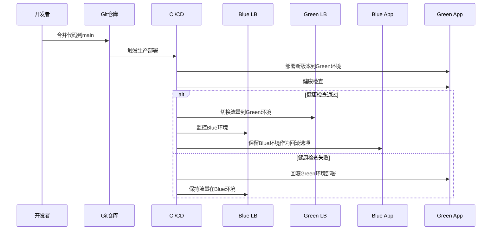

# 多环境与发布策略改进计划

## 问题分析

当前CI/CD流程存在以下问题：
1. 环境区分不严格，只有生产环境部署流水线
2. 发布流程存在风险，使用`docker-compose down/up`导致服务中断
3. 构建产物与配置未完全分离，每次构建生成新镜像
4. 回滚机制不完善，缺乏Blue/Green或Canary发布策略

## 改进目标

1. 建立明确的`dev/stg/prod`三段流水线
2. 实现构建产物与配置分离
3. 采用Blue/Green发布策略，确保零停机切换
4. 完善回滚机制，遇到异常可快速回滚
5. 严格环境隔离，确保各环境稳定性

## 实施步骤

### 1. 环境配置改进

#### 1.1 分支策略优化
- **dev分支**：开发环境，自动部署
- **stg分支**：测试环境，自动部署
- **main分支**：生产环境，手动或定时部署

#### 1.2 环境变量管理
- 创建`.env.dev`、`.env.stg`、`.env.prod`环境变量模板文件
- 使用GitHub Secrets管理敏感信息
- 实现运行时环境变量注入，而非构建时

### 2. CI/CD流水线改进

#### 2.1 创建多环境部署配置
- 修改`ci-cd.yml`，添加dev和stg环境的部署阶段
- 为每个环境创建独立的部署脚本
- 实现环境间的部署审批流程

#### 2.2 构建产物与配置分离
- 修改Dockerfile，移除构建时环境变量
- 实现基于同一镜像的多环境部署
- 使用Kubernetes ConfigMap或Docker环境变量实现配置注入

### 3. Blue/Green发布实现

#### 3.1 基础设施准备
- 为生产环境配置两套相同的基础设施（Blue和Green）
- 配置负载均衡器，支持流量切换
- 实现健康检查机制

#### 3.2 发布流程优化

#### 3.3 回滚机制实现
- 实现一键回滚功能
- 保持旧版本环境一段时间，便于快速回滚
- 记录每次部署的版本信息，支持精确回滚

### 4. 监控与告警

#### 4.1 部署监控
- 监控各环境的部署状态
- 记录部署时间、版本、部署者等信息
- 实现部署失败告警

#### 4.2 应用监控
- 监控应用的健康状态
- 实现性能指标监控
- 配置异常告警机制

## 关键文件修改

1. **`.github/workflows/ci-cd.yml`**：添加dev/stg环境部署，优化生产部署流程
2. **`slideboard-frontend/Dockerfile`**：实现构建产物与配置分离
3. **`docker/production/docker-compose.prod.yml`**：配置Blue/Green部署
4. **`scripts/deploy/`**：创建多环境部署脚本
5. **`docs/04-运维部署/`**：更新部署文档

## 验收标准

1. 发布过程平滑，无服务中断
2. 环境隔离严格，各环境配置独立
3. 支持一键回滚，回滚时间<1分钟
4. 实现构建产物与配置分离，同一镜像可部署到多环境
5. 建立完善的监控与告警机制

## 预期效果

1. 提高开发效率，各环境自动部署
2. 增强系统稳定性，零停机发布
3. 降低发布风险，完善回滚机制
4. 便于测试和验证，严格环境隔离
5. 提高运维效率，自动化部署流程