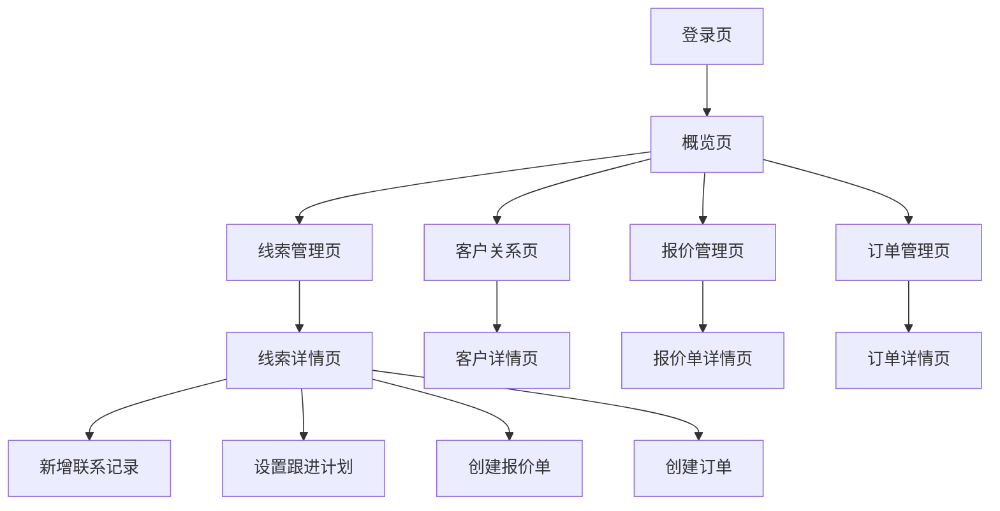

## 1. 产品概述
线索管理系统是一个面向销售团队的客户关系管理工具，专注于销售线索的收集、跟踪和转化。系统帮助销售人员高效管理潜在客户信息，追踪销售进度，提升转化率。

目标用户为销售经理和销售代表，通过系统化的线索管理提高销售效率和业绩。

## 2. 核心功能

### 2.1 用户角色
| 角色 | 注册方式 | 核心权限 |
|------|----------|----------|
| 销售经理 | 管理员创建 | 查看所有线索、分配线索、查看团队报表 |
| 销售代表 | 管理员创建 | 管理个人线索、更新线索状态、添加跟进记录 |
| 系统管理员 | 初始账号 | 用户管理、系统配置、数据导出 |

### 2.2 功能模块
系统包含以下核心页面：
1. **概览页面**：数据仪表板、关键指标展示、快捷操作。
2. **线索管理页面**：线索列表、搜索筛选、新增线索、线索详情。
3. **客户关系页面**：客户信息管理、联系记录、跟进计划。
4. **报价管理页面**：报价单创建、审批流程、历史记录。
5. **订单管理页面**：订单跟踪、状态更新、交付管理。

### 2.3 页面详情
| 页面名称 | 模块名称 | 功能描述 |
|----------|----------|----------|
| 概览页面 | 数据仪表板 | 显示线索总量、转化率、本月新增等关键指标 |
| 概览页面 | 快捷操作 | 快速新增线索、查看待跟进线索、最近活动 |
| 线索管理页面 | 搜索筛选 | 按名称、邮箱、公司搜索，按状态、日期、负责人筛选 |
| 线索管理页面 | 线索列表 | 展示线索名称、公司、联系信息、创建日期、负责人、状态 |
| 线索管理页面 | 新增线索 | 填写客户信息、联系方式、需求描述等创建新线索 |
| 线索管理页面 | 批量操作 | 批量分配、批量更新状态、批量导出 |
| 客户关系页面 | 客户详情 | 显示客户基本信息、联系方式、公司信息 |
| 客户关系页面 | 联系记录 | 记录每次沟通内容、时间、方式、结果 |
| 客户关系页面 | 跟进计划 | 设置下次跟进时间、提醒方式、跟进内容 |
| 报价管理页面 | 报价单列表 | 显示所有报价单、状态、金额、创建时间 |
| 报价管理页面 | 创建报价 | 选择产品、设置价格、添加折扣、生成报价单 |
| 报价管理页面 | 审批流程 | 提交审批、查看审批状态、审批历史 |
| 订单管理页面 | 订单列表 | 显示所有订单、状态、金额、交付时间 |
| 订单管理页面 | 订单跟踪 | 更新订单状态、记录交付进度、上传相关文件 |

## 3. 核心流程

### 销售代表流程
1. 登录系统进入概览页面查看关键指标
2. 在线索管理页面查看分配给自己的线索
3. 点击线索进入详情页面，更新联系记录
4. 设置跟进计划，系统到期提醒
5. 线索转化后创建报价单或订单
6. 在客户关系页面维护长期客户关系

### 销售经理流程
1. 在概览页面查看团队整体业绩
2. 在线索管理页面分配新线索给团队成员
3. 查看团队成员的线索跟进情况
4. 审批团队成员提交的报价单
5. 分析转化率数据，优化销售策略

## 4. 用户界面设计

### 4.1 设计风格
- **主色调**：暖沙色、米色调（#FBF8EE主背景，#F1EEDE侧边栏）
- **文字颜色**：深炭灰（#3B3A35主文字，#757365次要文字）
- **边框颜色**：柔和灰褐（#E3DFCD）
- **状态色彩**：
  - 成功：#C2E5D2背景，#2A5F42文字
  - 警告：#F4E8B6背景，#6B5D21文字
  - 错误：#F4C7C7背景，#8C3A3A文字
  - 信息：#E3D0EB背景，#5C3C6B文字
- **按钮样式**：圆角设计，与整体温和风格保持一致
- **字体**：现代无衬线字体，确保长时间阅读的舒适性
- **布局风格**：左侧导航栏+右侧内容区的经典布局
- **材质肌理**：叠加微妙的宣纸纹理，增加纸张质感和高级感

### 4.2 页面设计概述
| 页面名称 | 模块名称 | UI元素 |
|----------|----------|--------|
| 概览页面 | 数据仪表板 | 卡片式布局展示关键指标，使用温和的背景色区分不同数据模块 |
| 概览页面 | 快捷操作 | 圆角按钮设计，采用主文字色，悬停时有微妙的背景变化 |
| 线索管理页面 | 搜索筛选 | 圆角搜索框配放大镜图标，筛选按钮采用浅米色背景 |
| 线索管理页面 | 线索列表 | 表格采用柔和的边框色，行悬停时显示温暖的米灰色背景 |
| 线索管理页面 | 新增线索 | 弹窗表单，输入框圆角设计，按钮采用温和的强调色 |
| 客户关系页面 | 客户详情 | 信息分组卡片展示，使用温和的阴影效果 |
| 客户关系页面 | 联系记录 | 时间轴形式展示，每个记录用卡片包裹，背景色温和 |
| 报价管理页面 | 报价单列表 | 状态标签使用柔和的色彩方案，避免刺眼的高对比度 |
| 订单管理页面 | 订单列表 | 进度条使用温和的色调，符合整体纸张主题 |

### 4.3 响应式设计
- **桌面优先**：主要针对桌面端使用场景优化
- **响应式适配**：支持平板设备的基本操作
- **交互设计**：
  - 侧边栏选中状态：左侧4px深色指示条，背景变暖变亮
  - 表格行选中：背景变为淡淡的暖米灰色
  - 按钮悬停：微妙的背景色加深，保持低对比度
  - 状态切换：使用温和的动画过渡效果