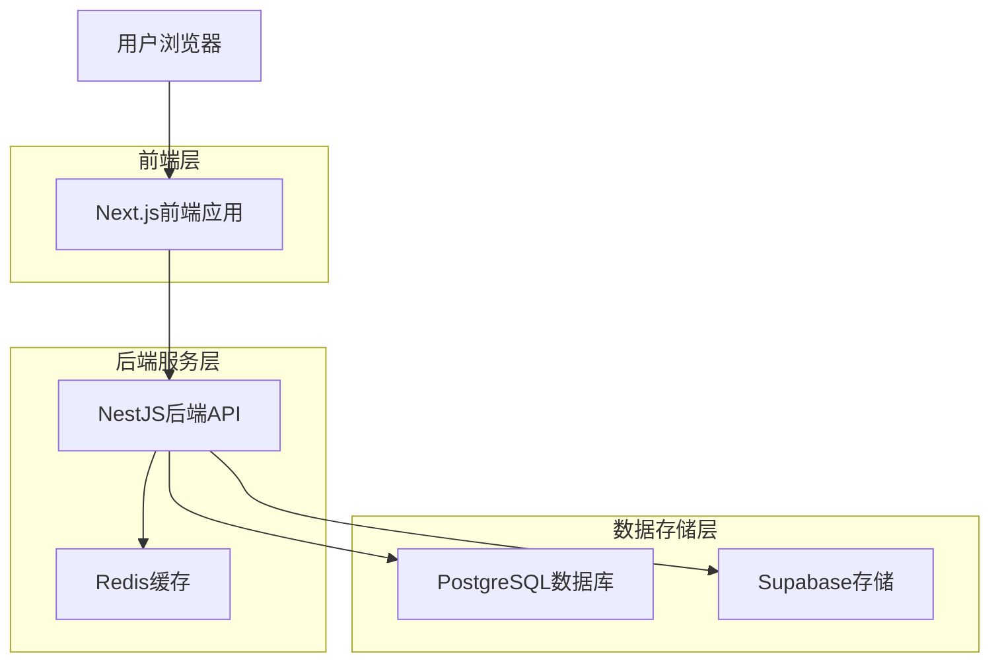
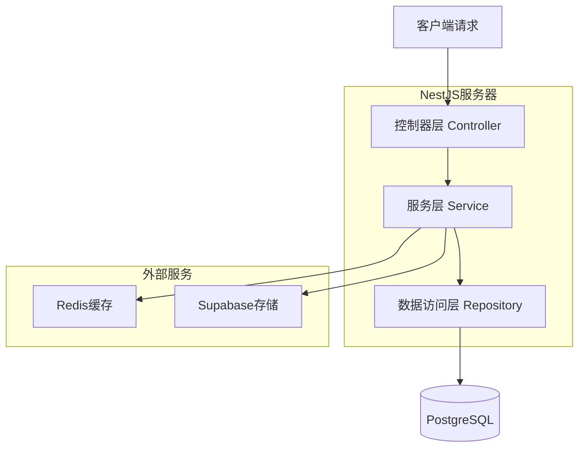
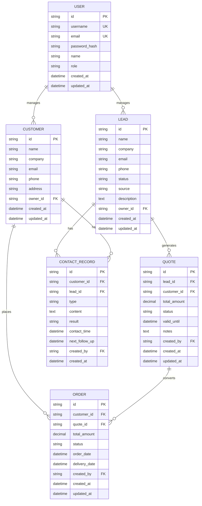

## 1. 架构设计



## 2. 技术描述

- **前端**: Next.js 14+ + React 18 + TypeScript + Tailwind CSS
- **小程序端**: Taro 3.x + React + TypeScript
- **后端**: NestJS + TypeScript + PostgreSQL + Redis
- **数据库**: PostgreSQL (主数据库) + Redis (缓存)
- **文件存储**: Supabase对象存储
- **身份认证**: NextAuth.js (前端) + JWT (后端)

## 3. 路由定义

| 路由 | 用途 |
|------|------|
| / | 概览页面，显示数据仪表板 |
| /leads | 线索管理页面，显示线索列表 |
| /leads/[id] | 线索详情页面，显示单个线索详细信息 |
| /leads/new | 新增线索页面，创建新线索 |
| /customers | 客户关系页面，显示客户列表 |
| /customers/[id] | 客户详情页面，显示客户详细信息和联系记录 |
| /quotes | 报价管理页面，显示报价单列表 |
| /quotes/[id] | 报价单详情页面，显示报价单详细信息 |
| /orders | 订单管理页面，显示订单列表 |
| /orders/[id] | 订单详情页面，显示订单详细信息和跟踪状态 |
| /auth/signin | 登录页面 |
| /auth/signup | 注册页面 |
| /profile | 用户个人资料页面 |

## 4. API定义

### 4.1 认证相关API

**用户登录**
```
POST /api/auth/login
```

请求参数：
| 参数名 | 参数类型 | 是否必需 | 描述 |
|--------|----------|----------|------|
| username | string | 是 | 用户名 |
| password | string | 是 | 密码 |

响应参数：
| 参数名 | 参数类型 | 描述 |
|--------|----------|------|
| access_token | string | JWT访问令牌 |
| refresh_token | string | JWT刷新令牌 |
| user | object | 用户信息 |

**用户登出**
```
POST /api/auth/logout
```

### 4.2 线索管理API

**获取线索列表**
```
GET /api/leads
```

查询参数：
| 参数名 | 参数类型 | 是否必需 | 描述 |
|--------|----------|----------|------|
| page | number | 否 | 页码，默认1 |
| limit | number | 否 | 每页数量，默认20 |
| search | string | 否 | 搜索关键词 |
| status | string | 否 | 线索状态筛选 |
| owner_id | string | 否 | 负责人ID筛选 |
| start_date | string | 否 | 创建日期开始 |
| end_date | string | 否 | 创建日期结束 |

**创建新线索**
```
POST /api/leads
```

请求体：
| 参数名 | 参数类型 | 是否必需 | 描述 |
|--------|----------|----------|------|
| name | string | 是 | 线索名称 |
| company | string | 是 | 公司名称 |
| email | string | 是 | 联系邮箱 |
| phone | string | 否 | 联系电话 |
| source | string | 否 | 线索来源 |
| description | string | 否 | 需求描述 |

**更新线索状态**
```
PATCH /api/leads/:id/status
```

请求体：
| 参数名 | 参数类型 | 是否必需 | 描述 |
|--------|----------|----------|------|
| status | string | 是 | 新状态 |
| note | string | 否 | 状态变更备注 |

### 4.3 客户管理API

**获取客户列表**
```
GET /api/customers
```

**添加联系记录**
```
POST /api/customers/:id/contacts
```

请求体：
| 参数名 | 参数类型 | 是否必需 | 描述 |
|--------|----------|----------|------|
| type | string | 是 | 联系方式 |
| content | string | 是 | 沟通内容 |
| result | string | 否 | 沟通结果 |
| next_follow_up | string | 否 | 下次跟进时间 |

### 4.4 报价管理API

**创建报价单**
```
POST /api/quotes
```

**提交报价审批**
```
POST /api/quotes/:id/submit
```

### 4.5 订单管理API

**创建订单**
```
POST /api/orders
```

**更新订单状态**
```
PATCH /api/orders/:id/status
```

## 5. 服务器架构图



## 6. 数据模型

### 6.1 数据模型定义



### 6.2 数据定义语言

**用户表 (users)**
```sql
CREATE TABLE users (
    id UUID PRIMARY KEY DEFAULT gen_random_uuid(),
    username VARCHAR(50) UNIQUE NOT NULL,
    email VARCHAR(255) UNIQUE NOT NULL,
    password_hash VARCHAR(255) NOT NULL,
    name VARCHAR(100) NOT NULL,
    role VARCHAR(20) NOT NULL CHECK (role IN ('admin', 'manager', 'sales')),
    created_at TIMESTAMP WITH TIME ZONE DEFAULT NOW(),
    updated_at TIMESTAMP WITH TIME ZONE DEFAULT NOW()
);

CREATE INDEX idx_users_username ON users(username);
CREATE INDEX idx_users_email ON users(email);
CREATE INDEX idx_users_role ON users(role);
```

**线索表 (leads)**
```sql
CREATE TABLE leads (
    id UUID PRIMARY KEY DEFAULT gen_random_uuid(),
    name VARCHAR(100) NOT NULL,
    company VARCHAR(200) NOT NULL,
    email VARCHAR(255) NOT NULL,
    phone VARCHAR(20),
    status VARCHAR(20) NOT NULL DEFAULT 'new' CHECK (status IN ('new', 'contacted', 'qualified', 'proposal', 'negotiation', 'closed_won', 'closed_lost')),
    source VARCHAR(50),
    description TEXT,
    owner_id UUID REFERENCES users(id),
    created_at TIMESTAMP WITH TIME ZONE DEFAULT NOW(),
    updated_at TIMESTAMP WITH TIME ZONE DEFAULT NOW()
);

CREATE INDEX idx_leads_owner ON leads(owner_id);
CREATE INDEX idx_leads_status ON leads(status);
CREATE INDEX idx_leads_created_at ON leads(created_at DESC);
CREATE INDEX idx_leads_company ON leads(company);
```

**客户表 (customers)**
```sql
CREATE TABLE customers (
    id UUID PRIMARY KEY DEFAULT gen_random_uuid(),
    name VARCHAR(100) NOT NULL,
    company VARCHAR(200) NOT NULL,
    email VARCHAR(255) NOT NULL,
    phone VARCHAR(20),
    address TEXT,
    owner_id UUID REFERENCES users(id),
    created_at TIMESTAMP WITH TIME ZONE DEFAULT NOW(),
    updated_at TIMESTAMP WITH TIME ZONE DEFAULT NOW()
);

CREATE INDEX idx_customers_owner ON customers(owner_id);
CREATE INDEX idx_customers_company ON customers(company);
```

**联系记录表 (contact_records)**
```sql
CREATE TABLE contact_records (
    id UUID PRIMARY KEY DEFAULT gen_random_uuid(),
    customer_id UUID REFERENCES customers(id),
    lead_id UUID REFERENCES leads(id),
    type VARCHAR(20) NOT NULL CHECK (type IN ('phone', 'email', 'meeting', 'wechat', 'other')),
    content TEXT NOT NULL,
    result VARCHAR(50),
    contact_time TIMESTAMP WITH TIME ZONE DEFAULT NOW(),
    next_follow_up TIMESTAMP WITH TIME ZONE,
    created_by UUID REFERENCES users(id),
    created_at TIMESTAMP WITH TIME ZONE DEFAULT NOW()
);

CREATE INDEX idx_contact_records_customer ON contact_records(customer_id);
CREATE INDEX idx_contact_records_lead ON contact_records(lead_id);
CREATE INDEX idx_contact_records_created_by ON contact_records(created_by);
CREATE INDEX idx_contact_records_contact_time ON contact_records(contact_time DESC);
```

**报价单表 (quotes)**
```sql
CREATE TABLE quotes (
    id UUID PRIMARY KEY DEFAULT gen_random_uuid(),
    lead_id UUID REFERENCES leads(id),
    customer_id UUID REFERENCES customers(id),
    total_amount DECIMAL(12,2) NOT NULL,
    status VARCHAR(20) NOT NULL DEFAULT 'draft' CHECK (status IN ('draft', 'pending', 'approved', 'rejected', 'expired')),
    valid_until DATE,
    notes TEXT,
    created_by UUID REFERENCES users(id),
    created_at TIMESTAMP WITH TIME ZONE DEFAULT NOW(),
    updated_at TIMESTAMP WITH TIME ZONE DEFAULT NOW()
);

CREATE INDEX idx_quotes_lead ON quotes(lead_id);
CREATE INDEX idx_quotes_customer ON quotes(customer_id);
CREATE INDEX idx_quotes_status ON quotes(status);
CREATE INDEX idx_quotes_created_by ON quotes(created_by);
```

**订单表 (orders)**
```sql
CREATE TABLE orders (
    id UUID PRIMARY KEY DEFAULT gen_random_uuid(),
    customer_id UUID REFERENCES customers(id) NOT NULL,
    quote_id UUID REFERENCES quotes(id),
    total_amount DECIMAL(12,2) NOT NULL,
    status VARCHAR(20) NOT NULL DEFAULT 'pending' CHECK (status IN ('pending', 'confirmed', 'processing', 'shipped', 'delivered', 'cancelled')),
    order_date DATE NOT NULL DEFAULT CURRENT_DATE,
    delivery_date DATE,
    created_by UUID REFERENCES users(id),
    created_at TIMESTAMP WITH TIME ZONE DEFAULT NOW(),
    updated_at TIMESTAMP WITH TIME ZONE DEFAULT NOW()
);

CREATE INDEX idx_orders_customer ON orders(customer_id);
CREATE INDEX idx_orders_quote ON orders(quote_id);
CREATE INDEX idx_orders_status ON orders(status);
CREATE INDEX idx_orders_created_by ON orders(created_by);
CREATE INDEX idx_orders_order_date ON orders(order_date DESC);
```