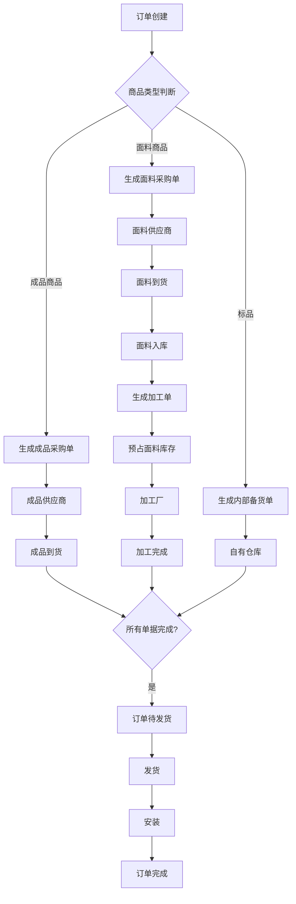
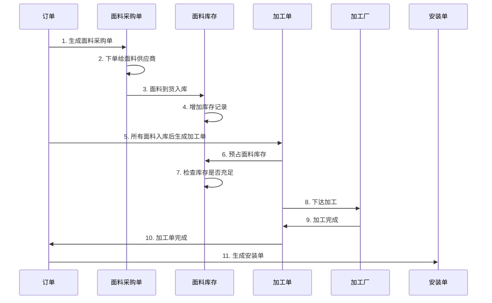
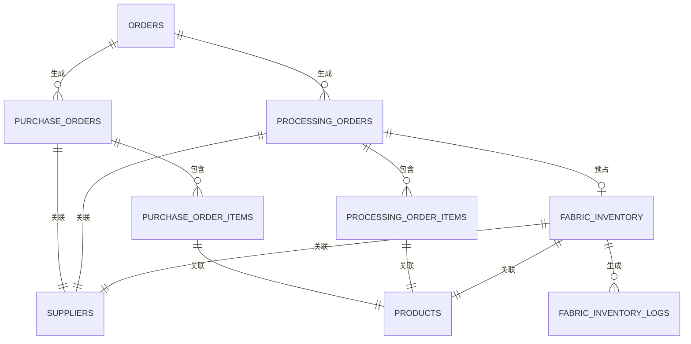

# 架构重新设计总结 - 面料+加工路线支持

## 1. 需求背景

### 1.1 原有架构
系统原有架构仅支持**成品采买**路线：
```
订单 → 采购单 → 供应商（工厂）→ 成品 → 发货 → 安装
```

### 1.2 新增需求
需要支持**面料采购→加工厂加工**路线：
```
订单 → 面料采购单 → 面料供应商 → 面料入库 → 加工单 → 加工厂 → 成品 → 发货 → 安装
```

### 1.3 业务价值
*   **降低成本**: 自行采购面料，控制面料成本
*   **灵活加工**: 根据客户需求定制加工
*   **库存管理**: 面料库存可复用，减少浪费
*   **质量把控**: 自主选择加工厂，把控加工质量

## 2. 架构设计原则

### 2.1 双路线并存
系统同时支持两种采购路线，根据商品类型自动选择：
*   **成品商品**: 成品采买路线
*   **面料商品**: 面料+加工路线

### 2.2 自动路由
根据商品类型和默认供应商，自动拆单：
*   成品商品 → 成品采购单
*   面料商品 → 面料采购单
*   标品 → 内部备货单

### 2.3 状态联动
订单状态由子单据状态聚合驱动（木桶效应）：
*   所有采购单/加工单都完成，订单才能流转
*   任一单据阻塞，整个订单阻塞

## 3. 核心架构变更

### 3.1 新增模块

| 模块名称 | 说明 | 关联文档 |
|:---|:---|:---|
| **加工单模块** | 管理面料加工流程 | [加工单.md](./modules/加工单.md) |
| **面料库存管理** | 管理面料库存和流水 | [供应链.md](./modules/供应链.md#45-面料库存管理-fabric-inventory) |

### 3.2 扩展现有模块

#### 3.2.1 供应链模块
**新增内容**:
*   供应商类型扩展：面料供应商、成品供应商、加工厂
*   商品类型扩展：成品商品、面料商品
*   面料库存管理：面料库存表、面料库存流水表

**关联文档**: [供应链.md](./modules/供应链.md)

#### 3.2.2 订单模块
**新增内容**:
*   订单状态扩展：面料采购中、面料入库、加工中
*   拆单逻辑扩展：支持面料采购单和成品采购单
*   状态联动扩展：面料+加工路线的状态流转

**关联文档**: [订单.md](./modules/订单/订单.md)

#### 3.2.3 采购单模块
**新增内容**:
*   采购单类型扩展：面料采购单、成品采购单、内部备货单
*   状态流转扩展：面料采购单支持入库状态
*   状态联动扩展：面料采购单驱动订单状态

**关联文档**: [采购单.md](./modules/采购单.md)

## 4. 业务流程设计

### 4.1 完整业务流程图



### 4.2 面料+加工路线详细流程



### 4.3 状态流转矩阵

#### 订单状态流转

| 当前状态 | 触发条件 | 下一状态 |
|:---|:---|:---|
| PENDING_PO | 订单创建 | PENDING_PO |
| PENDING_PO | 生成面料采购单 | FABRIC_PURCHASING |
| PENDING_PO | 生成成品采购单 | IN_PRODUCTION |
| FABRIC_PURCHASING | 所有面料采购单到货 | FABRIC_RECEIVED |
| FABRIC_RECEIVED | 生成加工单 | PROCESSING |
| PROCESSING | 所有加工单完成 | PENDING_DELIVERY |
| IN_PRODUCTION | 所有成品采购单备货完成 | PENDING_DELIVERY |
| PENDING_DELIVERY | 所有单据完成 | DISPATCHING |
| DISPATCHING | 填写物流单号 | SHIPPED |
| SHIPPED | 货物签收 | PENDING_INSTALL |
| PENDING_INSTALL | 所有安装单完成 | COMPLETED |
| COMPLETED | 财务结清 | CLOSED |

#### 面料采购单状态流转

| 当前状态 | 触发条件 | 下一状态 |
|:---|:---|:---|
| DRAFT | 订单拆单 | DRAFT |
| DRAFT | 确认下单 | IN_PRODUCTION |
| IN_PRODUCTION | 面料到货 | DELIVERED |
| DELIVERED | 确认入库 | STOCKED |

#### 成品采购单状态流转

| 当前状态 | 触发条件 | 下一状态 |
|:---|:---|:---|
| DRAFT | 订单拆单 | DRAFT |
| DRAFT | 确认下单 | IN_PRODUCTION |
| IN_PRODUCTION | 备货完成 | READY |
| READY | 填写物流单号 | SHIPPED |
| SHIPPED | 货物签收 | DELIVERED |

#### 加工单状态流转

| 当前状态 | 触发条件 | 下一状态 |
|:---|:---|:---|
| PENDING | 订单状态变为PROCESSING | PENDING |
| PENDING | 下达加工 | PROCESSING |
| PROCESSING | 确认完成 | COMPLETED |

## 5. 数据模型设计

### 5.1 核心数据表

| 表名 | 说明 | 关键字段 |
|:---|:---|:---|
| `products` | 商品表 | `product_type` (FINISHED/FABRIC) |
| `suppliers` | 供应商表 | `supplier_type` (FABRIC_SUPPLIER/FINISHED_SUPPLIER/PROCESSOR) |
| `orders` | 订单表 | 状态扩展 |
| `purchase_orders` | 采购单表 | `po_type` (FABRIC/FINISHED/STOCK) |
| `processing_orders` | 加工单表 | 新增表 |
| `fabric_inventory` | 面料库存表 | 新增表 |
| `fabric_inventory_logs` | 面料库存流水表 | 新增表 |

### 5.2 数据关系图



### 5.3 关键字段说明

#### 商品表 (products) 新增字段

| 字段名 | 类型 | 说明 |
|:---|:---|:---|
| `product_type` | Enum | 商品类型 (FINISHED/FABRIC) |

#### 供应商表 (suppliers) 新增字段

| 字段名 | 类型 | 说明 |
|:---|:---|:---|
| `supplier_type` | Enum | 供应商类型 (FABRIC_SUPPLIER/FINISHED_SUPPLIER/PROCESSOR) |

#### 采购单表 (purchase_orders) 新增字段

| 字段名 | 类型 | 说明 |
|:---|:---|:---|
| `po_type` | Enum | 采购单类型 (FABRIC/FINISHED/STOCK) |

#### 面料库存表 (fabric_inventory) 新增表

| 字段名 | 类型 | 说明 |
|:---|:---|:---|
| `fabric_product_id` | UUID | 关联面料商品 |
| `available_quantity` | Decimal | 可用数量 |
| `reserved_quantity` | Decimal | 已预占数量 |
| `total_quantity` | Decimal | 总库存 |
| `batch_no` | String | 批次号 |

#### 面料库存流水表 (fabric_inventory_logs) 新增表

| 字段名 | 类型 | 说明 |
|:---|:---|:---|
| `fabric_inventory_id` | UUID | 关联面料库存 |
| `log_type` | Enum | 流水类型 (PURCHASE_IN/PROCESSING_OUT/ADJUSTMENT/RETURN) |
| `quantity` | Decimal | 数量变化 |
| `before_quantity` | Decimal | 变化前数量 |
| `after_quantity` | Decimal | 变化后数量 |

#### 加工单表 (processing_orders) 新增表

| 字段名 | 类型 | 说明 |
|:---|:---|:---|
| `processing_no` | String | 加工单号 |
| `order_id` | UUID | 关联订单 |
| `processor_id` | UUID | 关联加工厂 |
| `status` | Enum | 状态 (PENDING/PROCESSING/COMPLETED/CANCELLED) |
| `processing_cost` | Decimal | 加工费 |
| `material_cost` | Decimal | 面料成本 |

## 6. 界面设计变更

### 6.1 订单模块

**新增功能**:
*   拆单页面支持面料采购单和成品采购单分组
*   订单详情页新增"加工单"Tab
*   订单明细表新增"商品类型"列

**界面变更**:
```
┌─────────────────────────────────────────────────────┐
│ 采购单拆分                           [确认拆单]     │
├─────────────────────────────────────────────────────┤
│ 【面料采购单】                                        │
│ 面料供应商A (3件面料商品)                            │
│   ├─ 面料1    ¥1000  50米                       │
│   ├─ 面料2    ¥2000  80米                       │
│   └─ 面料3    ¥1500  60米   [移动至其他供应商 ▼]   │
├─────────────────────────────────────────────────────┤
│ 【成品采购单】                                        │
│ 成品供应商B (2件成品商品)                            │
│   ├─ 电机      ¥800   2台                        │
│   └─ 轨道      ¥1200  10米                       │
└─────────────────────────────────────────────────────┘
```

### 6.2 供应链模块

**新增功能**:
*   供应商列表页支持供应商类型筛选
*   商品列表页支持商品类型筛选
*   新增"面料库存"菜单入口

**界面变更**:
```
┌─────────────────────────────────────────────────────┐
│ 面料库存列表                                       │
├─────────────────────────────────────────────────────┤
│ 面料SKU | 名称 | 颜色 | 可用 | 已预占 | 总库存 | 操作  │
│ F001   | 纯色布 | 白色 | 100  | 50    | 150    | 查看   │
│ F002   | 印花布 | 红色 | 80   | 30    | 110    | 查看   │
└─────────────────────────────────────────────────────┘
```

### 6.3 采购单模块

**新增功能**:
*   采购单列表页支持采购单类型筛选
*   面料采购单详情页新增"入库"按钮
*   成品采购单详情页保持原有流程

**界面变更**:
```
┌─────────────────────────────────────────────────────┐
│ 采购单列表                                         │
├─────────────────────────────────────────────────────┤
│ 筛选: [类型: 面料/成品/内部] [状态: 全部]        │
├─────────────────────────────────────────────────────┤
│ 采购单号 | 类型 | 供应商 | 金额 | 状态 | 操作      │
│ PO001    | 面料 | 供应商A | ¥5000 | 已入库 | 查看详情 │
│ PO002    | 成品 | 供应商B | ¥3000 | 已发货 | 查看详情 │
└─────────────────────────────────────────────────────┘
```

### 6.4 加工单模块（新增）

**新增功能**:
*   加工单列表页
*   加工单详情页
*   加工单状态管理

**界面设计**:
```
┌─────────────────────────────────────────────────────┐
│ 加工单列表                                         │
├─────────────────────────────────────────────────────┤
│ 加工单号 | 订单 | 加工厂 | 面料 | 状态 | 操作      │
│ PR001    | OD001 | 加工厂A | 纯色布 | 加工中 | 查看详情 │
│ PR002    | OD002 | 加工厂B | 印花布 | 已完成 | 查看详情 │
└─────────────────────────────────────────────────────┘
```

## 7. 业务规则变更

### 7.1 拆单规则

**原有规则**:
*   根据商品 `default_supplier_id` 自动拆分采购单

**新增规则**:
*   根据商品 `product_type` 判断采购路线
    *   FINISHED → 生成成品采购单
    *   FABRIC → 生成面料采购单
    *   is_stockable=true → 生成内部备货单
*   按供应商类型分组展示（面料供应商/成品供应商/内部备货）

### 7.2 状态联动规则

**原有规则**:
*   订单状态由采购单状态聚合驱动

**新增规则**:
*   订单状态由采购单和加工单状态聚合驱动
*   面料采购单到货并入库后，自动生成加工单
*   加工单完成后，订单进入待发货状态

### 7.3 库存管理规则

**原有规则**:
*   标品库存管理（预占/扣减）

**新增规则**:
*   面料库存管理（入库/预占/出库/调整/退库）
*   生成加工单时自动预占面料库存
*   面料库存不足时提示无法生成加工单

## 8. 权限控制变更

### 8.1 新增权限

| 角色 | 新增权限 |
|:---|:---|
| 采购员 | 面料库存管理、加工单管理 |
| 客服 | 面料库存查看、加工单查看 |
| 店长 | 面料库存审批、加工单审批 |

### 8.2 数据范围权限

| 角色 | 面料库存可见范围 | 加工单可见范围 |
|:---|:---|:---|
| 采购员 | 全部 | 全部 |
| 客服 | 全部 | 全部 |
| 店长 | 本店 | 本店 |

## 9. 通知与提醒变更

### 9.1 新增通知

| 触发事件 | 通知对象 | 渠道 | 内容 |
|:---|:---|:---|:---|
| 面料入库 | 采购员 | 系统 | 面料已入库，可生成加工单 |
| 加工单生成 | 采购员 | 系统+飞书 | 有新加工单待处理 |
| 加工完成 | 销售+客服 | 系统 | XXX订单加工完成 |
| 面料库存不足 | 采购员 | 系统 | 面料库存不足，无法生成加工单 |
| 加工超时 (>7天) | 采购员+店长 | 系统 | 加工单加工超时预警 |

## 10. 实施建议

### 10.1 分阶段实施

**第一阶段**（P0 - 核心功能）:
1. 供应商类型扩展
2. 商品类型扩展
3. 面料采购单流程
4. 面料库存管理（入库/预占）
5. 订单状态扩展

**第二阶段**（P1 - 加工流程）:
1. 加工单模块
2. 加工单状态管理
3. 加工单与面料库存联动
4. 订单状态联动（加工完成）

**第三阶段**（P2 - 优化功能）:
1. 面料库存流水
2. 面料库存盘点
3. 面料库存预警
4. 加工单异常处理

### 10.2 数据迁移

**需要迁移的数据**:
1. 现有供应商：补充 `supplier_type` 字段
2. 现有商品：补充 `product_type` 字段
3. 现有采购单：补充 `po_type` 字段

**迁移脚本**:
```sql
-- 迁移供应商类型
UPDATE suppliers 
SET supplier_type = 'FINISHED_SUPPLIER'
WHERE supplier_type IS NULL;

-- 迁移商品类型
UPDATE products 
SET product_type = 'FINISHED'
WHERE product_type IS NULL;

-- 迁移采购单类型
UPDATE purchase_orders 
SET po_type = 'FINISHED'
WHERE po_type IS NULL;
```

### 10.3 测试要点

**功能测试**:
1. 面料采购单创建和状态流转
2. 面料入库和库存增加
3. 加工单自动生成
4. 面料预占和库存扣减
5. 订单状态联动

**异常测试**:
1. 面料库存不足时的处理
2. 加工超时的预警
3. 订单撤单时的回滚
4. 并发预占库存的处理

**性能测试**:
1. 大批量面料入库的性能
2. 面料库存查询的性能
3. 加工单生成的性能

## 11. 风险与应对

### 11.1 技术风险

| 风险 | 影响 | 应对措施 |
|:---|:---|:---|
| 面料库存并发预占 | 数据不一致 | 使用数据库事务和乐观锁 |
| 加工单生成性能 | 系统响应慢 | 异步生成加工单 |
| 状态联动复杂度 | 状态机错误 | 完善单元测试和集成测试 |

### 11.2 业务风险

| 风险 | 影响 | 应对措施 |
|:---|:---|:---|
| 面料库存管理复杂 | 操作失误 | 完善操作培训和文档 |
| 加工单流程变更 | 用户不适应 | 分阶段上线，收集反馈 |
| 成本核算不准确 | 利润计算错误 | 完善成本核算逻辑 |

## 12. 总结

### 12.1 核心变更

1. **新增模块**: 加工单模块、面料库存管理
2. **扩展模块**: 供应链、订单、采购单
3. **新增流程**: 面料采购→面料入库→加工单→加工完成
4. **新增状态**: 订单、采购单、加工单的状态扩展

### 12.2 业务价值

1. **降低成本**: 自行采购面料，控制面料成本
2. **灵活加工**: 根据客户需求定制加工
3. **库存管理**: 面料库存可复用，减少浪费
4. **质量把控**: 自主选择加工厂，把控加工质量

### 12.3 技术亮点

1. **双路线并存**: 成品采买和面料+加工路线并存
2. **自动路由**: 根据商品类型自动拆单
3. **状态联动**: 木桶效应，确保流程完整
4. **库存管理**: 面料库存预占和流水记录

## 13. 相关文档

| 文档名称 | 路径 |
|:---|:---|
| 供应链模块需求 | [供应链.md](./modules/供应链.md) |
| 订单模块需求 | [订单.md](./modules/订单/订单.md) |
| 采购单模块需求 | [采购单.md](./modules/采购单.md) |
| 加工单模块需求 | [加工单.md](./modules/加工单.md) |

---

**文档版本**: v1.0  
**创建日期**: 2026-01-14  
**最后更新**: 2026-01-14
