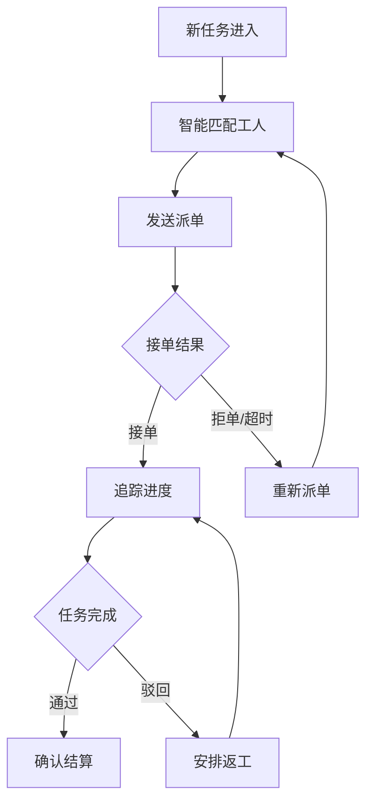

# 派单员角色用户旅程图

> **角色定义**: 派单员负责测量单和安装单的派发、进度追踪和异常协调，是销售与工人之间的桥梁。

---

## 1. 核心业务流程



## 2. 关键阶段

### 2.1 接收任务
- 新任务实时推送
- 查看详情（客户/时间/地址）
- 评估难度并排序

### 2.2 匹配工人
**智能推荐算法**：
- 距离评分 (30%)
- 技能匹配 (25%)
- 历史评价 (20%)
- 档期空闲 (15%)
- 价格匹配 (10%)

### 2.3 派单执行
- 填写工费/时间
- 一键发送通知
- 等待工人响应
- 处理拒单/超时

### 2.4 进度追踪
- 任务看板视图
- SLA 预警提醒
- 异常处理流程
- 批量催单

### 2.5 结算确认
- 验收结果审核
- 工费自动计算
- 批量结算
- 争议仲裁

## 3. 关键指标

| 指标 | 目标值 |
|:---|:---|
| 派单响应时效 | ≤ 30 分钟 |
| 首次接单成功率 | ≥ 80% |
| 任务准时完成率 | ≥ 95% |
| 异常处理时效 | ≤ 2 小时 |

## 4. 工作台设计

```
派单中心看板
├─ 今日概览（待派单/进行中/已完成）
├─ 预警任务（逾期/拒单）
├─ 待派单队列
│  └─ AI 推荐工人 Top 3
└─ 进行中任务（实时状态）
```

## 5. 核心痛点与优化

| 痛点 | 优化方案 |
|:---|:---|
| 手动挑选工人费时 | AI 智能推荐 Top 3 |
| 高峰期应接不暇 | 自动匹配并派单 |
| 不知道谁会接单 | 接单率预测模型 |
| 异常发现太晚 | 提前 1 小时 SLA 预警 |
| 工费定价凭经验 | AI 动态建议工费 |

## 6. 异常处理 SOP

| 异常类型 | 响应时效 | 处理流程 |
|:---|:---|:---|
| 工人拒单 | 10 分钟 | 调整条件 → 重新匹配 |
| 客户改约 | 30 分钟 | 联系工人 → 协商时间 |
| 工人请假 | 1 小时 | 紧急重新派单 |
| SLA 超时 | 立即 | 上报主管 → 应急派单 |

---

> **文档版本**: v1.0  
> **更新日期**: 2026-01-03
