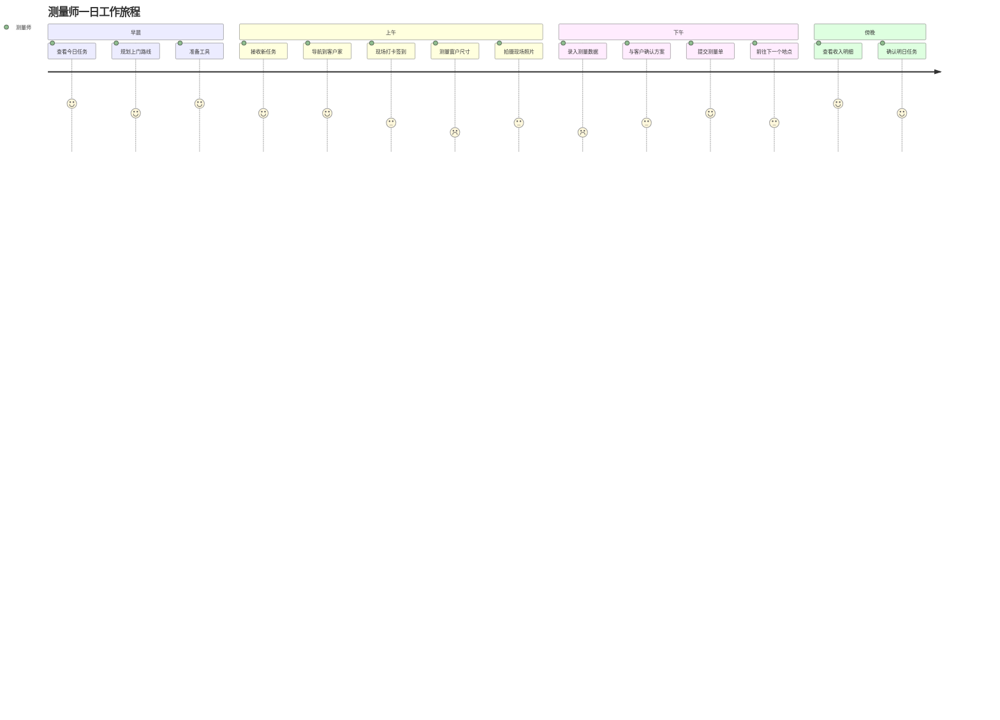
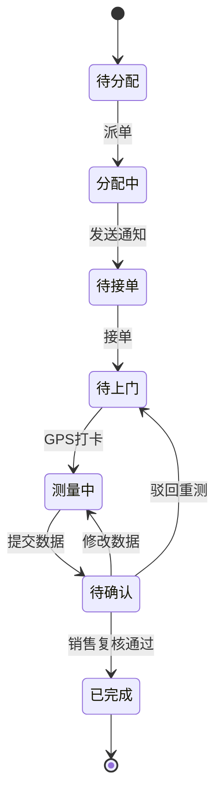
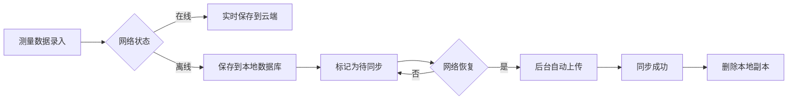

# 测量师角色用户旅程图

> **角色定义**: 测量师是 L2C 系统的关键现场执行人员，负责上门测量、数据采集和现场反馈。工作场景多为移动端，需要支持离线操作和快速录入。

---

## 1. 旅程总览



---

## 2. 核心业务流程图

```mermaid
flowchart TB
    subgraph RECEIVE["📱 接单阶段"]
        A1[收到新任务通知] --> A2{查看任务详情}
        A2 --> A3[检查时间/位置]
        A3 --> A4{是否接单}
        A4 -->|接受| A5[确认接单]
        A4 -->|拒绝| A6[拒绝并说明原因]
        A5 --> A7[任务进入待办]
    end

    subgraph PREPARE["🎒 准备阶段"]
        A7 --> B1[查看客户信息]
        B1 --> B2[规划上门路线]
        B2 --> B3[准备测量工具]
        B3 --> B4[联系客户确认]
        B4 --> B5{客户是否在家}
        B5 -->|是| B6[出发前往]
        B5 -->|否| B7[改约时间]
        B7 --> B1
    end

    subgraph ONSITE["🏠 现场阶段"]
        B6 --> C1[到达客户家]
        C1 --> C2[GPS打卡签到]
        C2 --> C3[与客户沟通需求]
        C3 --> C4[开始测量]
        C4 --> C5[测量每个窗户]
        C5 --> C6[记录尺寸数据]
        C6 --> C7[拍摄现场照片]
        C7 --> C8{是否有特殊情况}
        C8 -->|是| C9[标注异常备注]
        C8 -->|否| C10[继续下一个]
        C9 --> C10
        C10 --> C11{全部测完}
        C11 -->|否| C5
        C11 -->|是| C12[与客户确认]
    end

    subgraph SUBMIT["📝 提交阶段"]
        C12 --> D1[录入系统]
        D1 --> D2[检查数据完整性]
        D2 --> D3{是否有遗漏}
        D3 -->|是| D4[补充缺失数据]
        D4 --> D2
        D3 -->|否| D5[上传照片]
        D5 --> D6{网络状态}
        D6 -->|在线| D7[实时上传]
        D6 -->|离线| D8[本地缓存]
        D8 --> D9[等待网络恢复]
        D9 --> D7
        D7 --> D10[提交测量单]
        D10 --> D11[等待销售复核]
    end

    subgraph FEEDBACK["✅ 反馈阶段"]
        D11 --> E1{复核结果}
        E1 -->|通过| E2[确认完成]
        E1 -->|驳回| E3[查看驳回原因]
        E3 --> E4{是否需要重测}
        E4 -->|是| E5[预约重新上门]
        E4 -->|否| E6[修改数据]
        E5 --> B6
        E6 --> D2
        E2 --> E7[结算工费]
        E7 --> E8[任务完成]
    end

    style RECEIVE fill:#e8f5e9
    style PREPARE fill:#fff3e0
    style ONSITE fill:#e3f2fd
    style SUBMIT fill:#fce4ec
    style FEEDBACK fill:#f3e5f5
```



---

## 3. 阶段详解

### 3.1 接单阶段 (Task Receiving)

| 触点 | 用户行为 | 系统功能 | 情绪 | 痛点 |
|:---|:---|:---|:---|:---|
| 任务通知 | 查看推送消息 | 新任务推送 | 😊 期待 | 信息不够详细需要点进去看 |
| 查看详情 | 了解客户位置/时间 | 任务详情页 | 😐 评估 | 地图不准确/客户备注太少 |
| 接单决策 | 判断是否能完成 | 一键接单/拒单 | 😟 纠结 | 不知道当天还有多少单 |
| 确认接单 | 点击确认 | 状态变更 | 😊 确定 | 误点没有撤销机会 |

**关键功能需求：**
- ✅ 新任务实时推送（App + 短信）
- ✅ 任务详情展示地址/时间/客户需求
- ✅ 一键接单/拒单
- ⭐ **建议新增：** 任务日历视图（查看当日/本周任务）
- ⭐ **建议新增：** 导航预估时间（自动计算路程）
- ⭐ **建议新增：** 接单后 5 分钟内可撤销

---

### 3.2 准备阶段 (Preparation)

| 触点 | 用户行为 | 系统功能 | 情绪 | 痛点 |
|:---|:---|:---|:---|:---|
| 查看客户信息 | 了解客户需求 | 客户档案 | 😐 中性 | 销售备注太简略 |
| 规划路线 | 安排多个任务顺序 | 智能路线规划 | 😟 费时 | 手动规划容易绕路 |
| 联系客户 | 电话确认时间 | 一键拨号 | 😐 例行 | 客户不接电话 |
| 准备工具 | 检查测量工具 | 工具清单 | 😊 安心 | 容易忘带某个工具 |

**关键功能需求：**
- ✅ 客户信息完整展示（历史订单/特殊要求）
- ✅ 一键拨号联系客户
- ⭐ **建议新增：** 智能路线优化（按距离排序任务）
- ⭐ **建议新增：** 出发前工具清单提醒
- ⭐ **建议新增：** 天气预报（影响上门时间）

---

### 3.3 现场阶段 (On-site Measurement)

| 触点 | 用户行为 | 系统功能 | 情绪 | 痛点 |
|:---|:---|:---|:---|:---|
| GPS 打卡 | 到达后签到 | 定位打卡 | 😐 常规 | GPS 不准确/室内无信号 |
| 与客户沟通 | 了解具体需求 | 语音备注 | 😊 专业 | 打字太慢 |
| 测量窗户 | 拿尺子测量 | 数据录入 | 😟 繁琐 | 边测边输入容易出错 |
| 拍摄照片 | 拍现场照片 | 拍照上传 | 😐 常规 | 光线不好/角度不对 |
| 异常标注 | 遇到特殊情况 | 备注字段 | 😟 担心 | 不知道怎么描述清楚 |

**关键功能需求：**
- ✅ GPS 打卡自动记录时间/位置
- ✅ 大按钮数字键盘（适合手套操作）
- ✅ 拍照自动压缩（加快上传）
- ⭐ **建议新增：** 语音输入尺寸（说话自动识别数字）
- ⭐ **建议新增：** 拍照参考线（辅助拍摄标准角度）
- ⭐ **建议新增：** 快捷异常标签（预设常见问题）



---

### 3.4 提交阶段 (Data Submission)

| 触点 | 用户行为 | 系统功能 | 情绪 | 痛点 |
|:---|:---|:---|:---|:---|
| 录入数据 | 填写测量结果 | 表单录入 | 😟 紧张 | 字段太多/容易漏 |
| 上传照片 | 选择照片上传 | 批量上传 | 😟 焦虑 | 网络差上传失败 |
| 检查完整性 | 确认无遗漏 | 校验提示 | 😊 安心 | 系统不提示哪里没填 |
| 提交审核 | 提交给销售 | 一键提交 | 😊 如释重负 | 提交后不能修改 |

**关键功能需求：**
- ✅ 必填字段自动校验
- ✅ 离线模式本地缓存
- ✅ 照片压缩加速上传
- ⭐ **建议新增：** 提交前预览（二次确认）
- ⭐ **建议新增：** 保存草稿（随时中断）
- ⭐ **建议新增：** 上传进度条（实时反馈）

---

### 3.5 反馈阶段 (Review & Settlement)

| 触点 | 用户行为 | 系统功能 | 情绪 | 痛点 |
|:---|:---|:---|:---|:---|
| 等待复核 | 查看审核状态 | 进度追踪 | 😟 被动 | 不知道什么时候通过 |
| 查看驳回原因 | 了解问题所在 | 驳回通知 | 😟 沮丧 | 原因描述不清楚 |
| 修改数据 | 按要求修改 | 编辑功能 | 😐 配合 | 重新填写太麻烦 |
| 重新上门 | 需要重测 | 预约改期 | 😟 无奈 | 影响当天其他任务 |
| 查看收入 | 确认工费 | 收入明细 | 😊 满意 | 金额计算不透明 |

**关键功能需求：**
- ✅ 复核状态实时推送
- ✅ 驳回原因详细说明
- ✅ 修改后直接提交（无需重填全部）
- ⭐ **建议新增：** 预估收入实时计算
- ⭐ **建议新增：** 历史任务统计（完成率/好评率）
- ⭐ **建议新增：** 驳回申诉通道

---

## 4. 关键指标 (KPIs)

| 指标名称 | 计算公式 | 目标值 | 当前状态 |
|:---|:---|:---|:---|
| **接单率** | 接单数 / 收到任务数 | ≥ 80% | 🔴 待监测 |
| **准时率** | 按约定时间到达次数 / 总任务数 | ≥ 95% | 🔴 待监测 |
| **首次通过率** | 一次复核通过数 / 总提交数 | ≥ 90% | 🔴 待监测 |
| **平均测量时长** | 打卡到提交的平均时间 | ≤ 45 分钟 | 🔴 待监测 |
| **客户满意度** | 客户评分 ≥ 4星 占比 | ≥ 95% | 🔴 待监测 |
| **日均完成量** | 每日完成任务数 | ≥ 5 单 | 🔴 待监测 |

---

## 5. 移动端设计要点

### 5.1 界面设计原则

| 原则 | 说明 | 案例 |
|:---|:---|:---|
| **大按钮** | 最小44x44px | 接单/拒单按钮 |
| **粗体字** | 16px+ 字体 | 客户地址/联系方式 |
| **高对比度** | 深色文字/浅色背景 | 数据录入表单 |
| **单手操作** | 常用功能底部 | 提交/保存按钮 |
| **离线优先** | 本地存储+同步 | 草稿自动保存 |

### 5.2 关键界面 Wireframe

```
┌──────────────────────────────────┐
│  今日任务 (3)           📍🔔 ⚙️  │
├──────────────────────────────────┤
│                                  │
│  🟢 待上门 (09:30-10:00)         │
│  ┌────────────────────────────┐ │
│  │ 王女士 - 海淀区            │ │
│  │ 📍 中关村大街1号3单元501   │ │
│  │ 📞 138-0000-0000          │ │
│  │ 🪟 客厅3窗 + 卧室2窗       │ │
│  │                            │ │
│  │   [导航]    [联系客户]     │ │
│  └────────────────────────────┘ │
│                                  │
│  🟡 待接单 (14:00-15:00)         │
│  ┌────────────────────────────┐ │
│  │ 李先生 - 朝阳区            │ │
│  │ 📍 望京SOHO T1 15层        │ │
│  │ 💰 预估工费: ¥120          │ │
│  │                            │ │
│  │   [接单]    [拒绝]         │ │
│  └────────────────────────────┘ │
│                                  │
│  ⚪ 已完成 (昨日)                │
│  ┌────────────────────────────┐ │
│  │ 张女士 - 西城区            │ │
│  │ ✅ 已通过复核              │ │
│  │ 💰 工费: ¥100 (已结算)     │ │
│  └────────────────────────────┘ │
│                                  │
└──────────────────────────────────┘

┌──────────────────────────────────┐
│  ← 测量录入                  保存│
├──────────────────────────────────┤
│                                  │
│  📍 GPS打卡: 已签到 10:05        │
│                                  │
│  客厅 - 窗户1                     │
│  ┌────────────────────────────┐ │
│  │ 宽度 (cm)  [    250    ] ✓│ │
│  │ 高度 (cm)  [    180    ] ✓│ │
│  │ 安装方式   [ 顶装 ▼ ]     │ │
│  │                            │ │
│  │ 📷 拍照 (2/4)              │ │
│  │  [+]  [照片]  [照片]       │ │
│  │                            │ │
│  │ 📝 备注                     │ │
│  │  [语音输入]  [打字]        │ │
│  └────────────────────────────┘ │
│                                  │
│  [+ 添加窗户]                    │
│                                  │
│                                  │
│                                  │
│          [提交测量单]            │
│                                  │
└──────────────────────────────────┘
```

---

## 6. 离线能力设计

### 6.1 离线操作范围

| 功能 | 离线支持 | 说明 |
|:---|:---|:---|
| 查看任务列表 | ✅ 支持 | 本地缓存 |
| 接单/拒单 | ❌ 不支持 | 需实时同步 |
| 测量数据录入 | ✅ 支持 | 本地存储 |
| 拍照 | ✅ 支持 | 本地存储 |
| 提交测量单 | ⚠️ 半支持 | 离线提交，网络恢复后上传 |
| 查看历史记录 | ✅ 支持 | 缓存最近 30 天 |

### 6.2 同步策略



### 6.3 冲突解决

| 冲突场景 | 解决方案 |
|:---|:---|
| 本地修改 vs 服务端修改 | 以服务端为准，本地修改另存为草稿 |
| 重复提交 | 以第一次提交为准，忽略后续提交 |
| 照片上传失败 | 最多重试 3 次，失败后手动触发 |

---

## 7. 收入与激励机制

### 7.1 工费计算规则

```
基础工费 = ¥80/单
距离补贴 = 超过5km, 每km +¥5
难度系数 = 高层/复杂户型 +¥20
返工惩罚 = -¥30/次
好评奖励 = +¥10 (客户5星好评)
```

### 7.2 收入明细展示

```
本月收入汇总
━━━━━━━━━━━━━━━━━━━━━━
完成任务:     45 单
基础工费:   ¥3,600
距离补贴:     ¥320
难度补贴:     ¥180
好评奖励:     ¥450
返工扣款:    -¥60
━━━━━━━━━━━━━━━━━━━━━━
合计:       ¥4,490
```

---

## 8. 体验优化建议

### 8.1 即时改进 (Quick Wins)

| 优化点 | 当前问题 | 改进方案 | 预期收益 |
|:---|:---|:---|:---|
| **语音输入** | 测量时打字慢 | 支持语音输入尺寸 | 节省60%录入时间 |
| **拍照参考线** | 照片角度不标准 | 相机内置参考线 | 减少30%重拍 |
| **离线草稿** | 网络差时容易丢数据 | 自动保存草稿 | 零数据丢失 |

### 8.2 中期优化 (2-4周)

| 优化点 | 当前问题 | 改进方案 | 预期收益 |
|:---|:---|:---|:---|
| **智能路线** | 手动规划路线费时 | AI优化任务顺序 | 减少20%路程时间 |
| **预估收入** | 不知道能赚多少 | 实时计算工费 | 提升接单意愿 |
| **工具清单** | 经常忘带工具 | 出发前智能提醒 | 减少返程次数 |

### 8.3 长期规划 (1-3月)

| 优化点 | 当前问题 | 改进方案 | 预期收益 |
|:---|:---|:---|:---|
| **AR测量** | 尺子测量不够准 | AR辅助测量 | 提升测量精度 |
| **智能质检** | 照片质量不可控 | AI自动检测模糊照片 | 减少驳回率 |
| **技能培训** | 新手上手慢 | 内置培训视频 | 缩短培训周期 |

---

## 9. 相关文档

- [测量单模块需求](../requirements/modules/测量单.md)
- [安装单模块需求](../requirements/modules/安装单.md)
- [销售角色旅程](./销售角色旅程.md)
- [状态码速查表](../requirements/状态码速查表.md)

---

> **文档版本**: v1.0  
> **更新日期**: 2026-01-03  
> **维护者**: 产品团队
