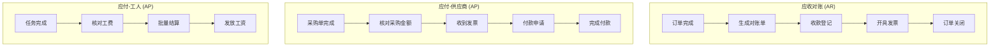

# 财务角色用户旅程图

> **角色定义**: 财务人员负责应收应付对账、发票管理和回款追踪，确保财务闭环和资金安全。

---

## 1. 核心业务流程



## 2. 关键阶段

### 2.1 应收对账 (Customer AR)

**流程**：

1. 订单完成触发对账
2. 汇总客户所有订单
3. 核对收款记录
4. 发票开具
5. 催收逾期款项

**痛点**：

- 客户拖延付款
- 收款凭证缺失
- 发票审批慢
- 账期计算复杂

### 2.2 应付-供应商 (Supplier AP)

**流程**：

1. 采购单到货完成
2. 核对采购金额
3. 供应商开票
4. 财务审批
5. 银行转账

**痛点**：

- 供应商催款频繁
- 发票信息错误
- 审批流程长
- 账期管理混乱

### 2.3 应付-工人 (Worker AP)

**流程**：

1. 测量/安装任务完成
2. 工费自动计算
3. 批量生成结算单
4. 周结/月结发放
5. 异议处理

**痛点**：

- 工费计算复杂（基础+补贴-惩罚）
- 工人催收频繁
- 批量结算耗时
- 争议仲裁困难

## 3. 关键指标 (KPIs)

| 指标名称           | 计算公式                | 目标值    |
| :----------------- | :---------------------- | :-------- |
| **应收账款周转率** | 销售收入 / 平均应收账款 | ≥ 6 次/年 |
| **逾期应收占比**   | 逾期金额 / 总应收       | ≤ 5%      |
| **平均回款周期**   | 订单完成到全款到账      | ≤ 30 天   |
| **应付账款周转率** | 采购成本 / 平均应付账款 | ≥ 8 次/年 |
| **发票开具时效**   | 申请到开票完成          | ≤ 3 天    |
| **工费结算时效**   | 任务完成到发放          | ≤ 7 天    |

## 4. 工作台设计

```
财务中心
├─ 今日概览
│  ├─ 待收款: ¥125,000 (15单)
│  ├─ 待付款: ¥68,000 (8单)
│  └─ 逾期预警: ¥32,000 (3单)
│
├─ 应收对账 (AR)
│  ├─ 待开票
│  ├─ 待回款
│  ├─ 逾期催收
│  └─ 已完成
│
├─ 应付对账 (AP-供应商)
│  ├─ 待开票
│  ├─ 待付款
│  └─ 已完成
│
└─ 应付对账 (AP-工人)
   ├─ 待结算
   ├─ 待发放
   └─ 已完成
```

## 5. 典型用户场景

### 场景 1：催收逾期款项

```
1. 系统自动预警：订单 #12345，客户王女士，尾款 ¥8,000，逾期 7 天
2. 查看历史沟通记录
3. 一键发送催款提醒（短信/微信）
4. 电话沟通并记录
5. 协商分期付款方案
6. 更新回款计划
```

### 场景 2：批量结算工人工费

```
1. 筛选本周已完成任务
2. 系统自动计算工费（含补贴/扣款）
3. 导出结算明细给工人确认
4. 处理异议（工费争议、任务确认）
5. 批量生成付款单
6. 提交银行转账
```

### 场景 3：月度对账

```
1. 生成月度财务报表
2. 应收账龄分析（0-30天/31-60天/60天+）
3. 应付账龄分析
4. 现金流预测
5. 利润分析
6. 导出给管理层
```

## 6. 核心痛点与优化

| 痛点         | 当前影响            | 优化方案              | 预期收益          |
| :----------- | :------------------ | :-------------------- | :---------------- |
| 手动催收费时 | 每天花 2 小时打电话 | 自动催收提醒 + 模板   | 节省 50% 时间     |
| 收款凭证缺失 | 账目核对困难        | OCR 识别 + 自动匹配   | 减少 80% 人工核对 |
| 发票开具慢   | 客户催促频繁        | 在线开票申请 + 审批流 | 缩短至 1 天       |
| 工费计算复杂 | 容易算错引发争议    | 自动计算 + 规则引擎   | 零计算错误        |
| 账期分析困难 | 不知道资金风险      | 应收账龄自动分析      | 实时掌握风险      |

## 7. 智能功能建议

### 7.1 自动催收提醒

```
规则引擎：
- 定金未付：下单后 24 小时
- 尾款到期前 3 天：友好提醒
- 尾款逾期 1-7 天：温和催收
- 逾期 7-15 天：加强催收
- 逾期 15 天+：上报主管
```

### 7.2 收款计划管理

```
支持多节点收款：
- 定金：30%（下单时）
- 进度款：40%（发货时）
- 尾款：30%（安装完成）

自动生成时间轴：
[已收] 定金 ¥3,000 (2026-01-01)
[待收] 进度款 ¥4,000 (2026-01-10)
[待收] 尾款 ¥3,000 (2026-01-20)
```

### 7.3 应收账龄分析

```
账龄分布：
0-30天:   ¥85,000 (68%)  🟢
31-60天:  ¥28,000 (22%)  🟡
61-90天:  ¥10,000 (8%)   🟠
90天+:    ¥2,000 (2%)    🔴

预警：超过 60 天的占比达 10%，需加强催收
```

## 8. 报表需求

### 8.1 日报

- 今日新增应收/应付
- 今日收款/付款
- 逾期预警

### 8.2 周报

- 本周回款统计
- 本周付款统计
- 工人结算汇总

### 8.3 月报

- 应收账龄分析
- 应付账龄分析
- 现金流分析
- 利润分析

## 9. 体验优化建议

| 优先级 | 优化点       | 改进方案               |
| :----- | :----------- | :--------------------- |
| P0     | 自动催收提醒 | 规则引擎 + 短信/微信   |
| P0     | 收款凭证 OCR | 自动识别金额并匹配订单 |
| P0     | 批量结算     | 一键生成付款单         |
| P1     | 账龄分析     | 自动生成图表和预警     |
| P1     | 发票管理     | 在线申请 + 电子发票    |
| P2     | AI 预测      | 回款概率预测           |

---

> **文档版本**: v1.0  
> **更新日期**: 2026-01-03
