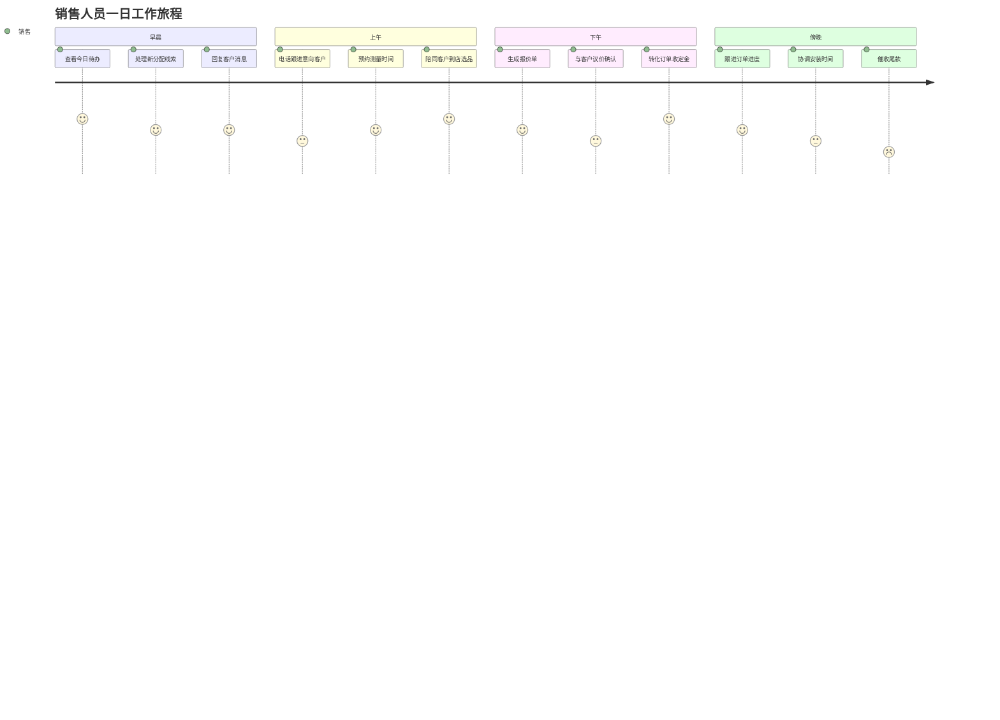
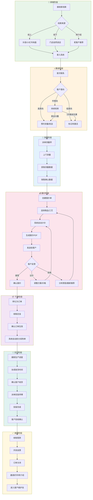
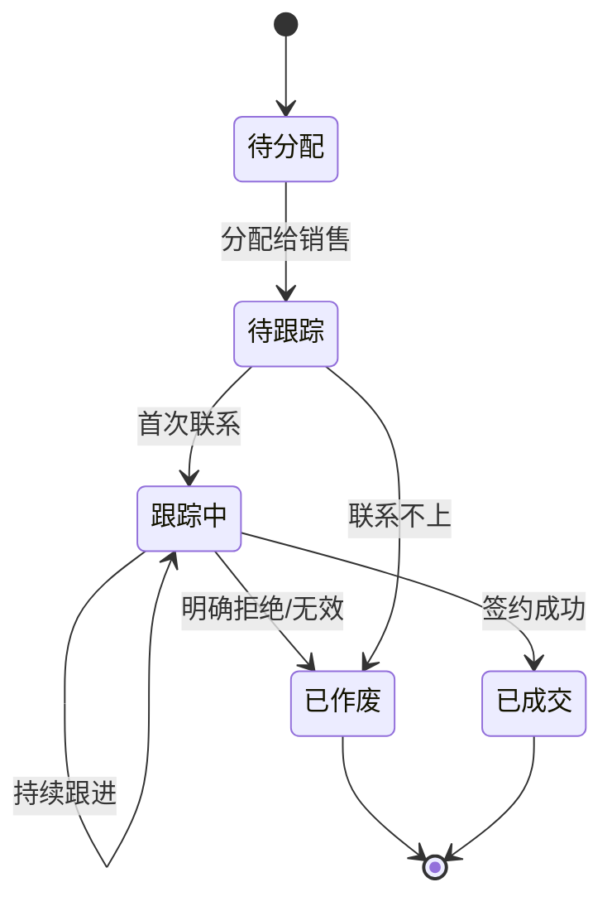
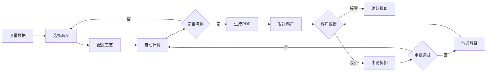

# 销售角色用户旅程图

> **角色定义**: 销售人员是 L2C 系统的核心用户，负责从获取线索到最终成交回款的全流程跟进。

---

## 1. 旅程总览



---

## 2. 核心业务流程图



---

## 3. 阶段详解

### 3.1 获客阶段 (Lead Acquisition)

| 触点         | 用户行为       | 系统功能   | 情绪    | 痛点                    |
| :----------- | :------------- | :--------- | :------ | :---------------------- |
| 接收线索通知 | 查看推送/短信  | 新线索提醒 | 😊 期待 | 信息不完整需要反复确认  |
| 录入线索     | 填写客户信息   | 线索表单   | 😐 中性 | 字段太多/不知道哪些必填 |
| 查看线索列表 | 筛选今日待跟进 | 智能筛选器 | 😊 高效 | 列表信息密度不够        |

**关键功能需求：**

- ✅ 新线索实时推送（App/短信/企微）
- ✅ 一键创建线索（最少必填字段）
- ✅ 线索智能评分（根据来源/预算自动标注优先级）
- ⭐ **建议新增：** 线索去重检测（手机号/地址）

---

### 3.2 跟进阶段 (Lead Nurturing)

| 触点     | 用户行为     | 系统功能 | 情绪    | 痛点                |
| :------- | :----------- | :------- | :------ | :------------------ |
| 首次联系 | 电话沟通     | 一键拨号 | 😊 积极 | 通话后需手动记录    |
| 记录跟进 | 填写跟进内容 | 跟进日志 | 😐 繁琐 | 打字太慢/格式不统一 |
| 设置提醒 | 安排下次跟进 | 日程提醒 | 😊 安心 | 多个客户容易忘记    |
| 判断意向 | 更新状态     | 状态流转 | 😐 纠结 | 不确定何时该放弃    |

**关键功能需求：**

- ✅ 跟进日志支持语音输入
- ✅ 自动提醒下次跟进时间
- ✅ 跟进模板（预设常用话术）
- ⭐ **建议新增：** AI 总结历史跟进记录（一键了解客户背景）



---

### 3.3 测量阶段 (Measurement)

| 触点       | 用户行为       | 系统功能 | 情绪    | 痛点                   |
| :--------- | :------------- | :------- | :------ | :--------------------- |
| 预约测量   | 与客户确认时间 | 预约日历 | 😊 顺利 | 客户临时改时间         |
| 派单测量师 | 选择合适的人   | 派单系统 | 😐 费时 | 不清楚谁有空/擅长什么  |
| 等待测量   | 查看进度       | 进度追踪 | 😟 焦虑 | 不知道测量师是否已上门 |
| 确认数据   | 审核测量结果   | 数据复核 | 😊 放心 | 测量数据有误需返工     |

**关键功能需求：**

- ✅ 测量师实时位置/打卡状态
- ✅ 测量数据自动同步到报价单
- ✅ 异常尺寸自动预警（超大/异形）
- ⭐ **建议新增：** 智能测量师推荐（根据位置/工种/空闲时间）

---

### 3.4 报价阶段 (Quotation)

| 触点     | 用户行为      | 系统功能 | 情绪    | 痛点                 |
| :------- | :------------ | :------- | :------ | :------------------- |
| 创建报价 | 选择商品/工艺 | 报价引擎 | 😐 复杂 | 商品太多不知道选什么 |
| 计算价格 | 确认自动计价  | 策略引擎 | 😊 省心 | 公式错误导致亏本     |
| 调整方案 | 尝试不同配置  | 方案对比 | 😊 灵活 | 来回切换很麻烦       |
| 发送报价 | 生成PDF分享   | 导出分享 | 😊 专业 | 格式不够美观         |
| 议价     | 申请折扣      | 审批流程 | 😟 等待 | 领导审批太慢         |

**关键功能需求：**

- ✅ 一键生成多方案对比（经济/标准/豪华）
- ✅ 实时价格计算（改一处全局联动）
- ✅ 历史报价参考（同小区/同户型）
- ⭐ **建议新增：** AI 推荐最优方案（根据客户预算和偏好）



---

### 3.5 下单阶段 (Order Conversion)

| 触点     | 用户行为       | 系统功能   | 情绪    | 痛点               |
| :------- | :------------- | :--------- | :------ | :----------------- |
| 确认下单 | 客户同意签约   | 报价转订单 | 😊 兴奋 | 担心客户反悔       |
| 收取定金 | 收款并上传凭证 | 收款登记   | 😊 踏实 | 线下收款需手动录入 |
| 确认订单 | 检查订单信息   | 订单详情   | 😐 谨慎 | 生怕下错单         |

**关键功能需求：**

- ✅ 一键从报价转订单（数据自动带入）
- ✅ 收款凭证OCR识别（自动匹配金额）
- ✅ 订单确认二次校验（与客户核对）
- ⭐ **建议新增：** 电子签约（无需线下签字）

---

### 3.6 交付阶段 (Delivery & Installation)

| 触点     | 用户行为       | 系统功能 | 情绪        | 痛点                |
| :------- | :------------- | :------- | :---------- | :------------------ |
| 跟踪生产 | 查看采购单状态 | 进度看板 | 😟 被动     | 工厂延期无法预知    |
| 协调安装 | 与客户确认时间 | 预约系统 | 😐 繁琐     | 客户/师傅时间难协调 |
| 安装现场 | 处理突发问题   | 即时沟通 | 😟 紧张     | 尺寸不对/货不对板   |
| 客户验收 | 确认安装完成   | 验收确认 | 😊 如释重负 | 客户挑刺返工        |

**关键功能需求：**

- ✅ 生产进度实时同步（与供应商对接）
- ✅ 安装前自动提醒客户
- ✅ 安装异常快速上报通道
- ⭐ **建议新增：** 安装直播/照片实时共享给客户

---

### 3.7 收尾阶段 (Closure & Retention)

| 触点     | 用户行为     | 系统功能   | 情绪    | 痛点           |
| :------- | :----------- | :--------- | :------ | :------------- |
| 收取尾款 | 催收剩余货款 | 收款提醒   | 😟 压力 | 客户拖延付款   |
| 开具发票 | 提交开票申请 | 发票管理   | 😐 等待 | 财务审批慢     |
| 邀请好评 | 请求客户评价 | 满意度调查 | 😊 成就 | 客户不愿配合   |
| 转介绍   | 请求客户推荐 | 转介绍追踪 | 😊 期待 | 不知道如何开口 |

**关键功能需求：**

- ✅ 自动尾款到期提醒
- ✅ 在线开票申请
- ✅ 一键生成好评邀请（带二维码）
- ⭐ **建议新增：** 转介绍激励机制（老带新返现）

---

## 4. 关键指标 (KPIs)

| 指标名称         | 计算公式               | 目标值    | 当前状态  |
| :--------------- | :--------------------- | :-------- | :-------- |
| **线索转化率**   | 成交数 / 新增线索数    | ≥ 15%     | 🔴 待监测 |
| **平均成交周期** | 从首次联系到下单的天数 | ≤ 14 天   | 🔴 待监测 |
| **客单价**       | 订单总额 / 订单数      | ≥ ¥8,000  | 🔴 待监测 |
| **首次跟进时效** | 线索分配到首次联系     | ≤ 30 分钟 | 🔴 待监测 |
| **报价发送时效** | 测量完成到报价发送     | ≤ 2 小时  | 🔴 待监测 |
| **回款周期**     | 签约到全款到账         | ≤ 30 天   | 🔴 待监测 |

---

## 5. 系统功能覆盖矩阵

```
✅ = 已实现   🔨 = 开发中   📋 = 规划中   ❌ = 暂不支持

┌──────────────────────────────────────────────────────────────────┐
│                    销售旅程功能覆盖情况                           │
├─────────────────┬─────┬─────┬─────┬─────┬─────┬─────┬─────┬─────┤
│ 功能            │获客 │跟进 │测量 │报价 │下单 │生产 │安装 │收尾 │
├─────────────────┼─────┼─────┼─────┼─────┼─────┼─────┼─────┼─────┤
│ 线索创建/录入   │ ✅  │     │     │     │     │     │     │     │
│ 线索分配        │ ✅  │     │     │     │     │     │     │     │
│ 跟进记录        │     │ ✅  │     │     │     │     │     │     │
│ 跟进提醒        │     │ 📋  │     │     │     │     │     │     │
│ 测量派单        │     │     │ ✅  │     │     │     │     │     │
│ 测量数据同步    │     │     │ ✅  │     │     │     │     │     │
│ 报价创建        │     │     │     │ ✅  │     │     │     │     │
│ 多方案对比      │     │     │     │ 📋  │     │     │     │     │
│ 报价转订单      │     │     │     │     │ ✅  │     │     │     │
│ 收款登记        │     │     │     │     │ 🔨  │     │     │     │
│ 采购单追踪      │     │     │     │     │     │ ✅  │     │     │
│ 安装派单        │     │     │     │     │     │     │ ✅  │     │
│ 验收确认        │     │     │     │     │     │     │ ✅  │     │
│ 尾款催收        │     │     │     │     │     │     │     │ 📋  │
│ 好评邀请        │     │     │     │     │     │     │     │ 📋  │
└─────────────────┴─────┴─────┴─────┴─────┴─────┴─────┴─────┴─────┘
```

---

## 6. 体验优化建议

### 6.1 即时改进 (Quick Wins)

| 优化点       | 当前问题           | 改进方案         | 预期收益        |
| :----------- | :----------------- | :--------------- | :-------------- |
| **快捷录入** | 新建线索步骤多     | 支持语音创建线索 | 节省50%录入时间 |
| **智能筛选** | 每天手动筛选待跟进 | 默认显示今日待办 | 减少3次点击     |
| **一键拨号** | 需复制手机号再拨打 | 集成系统拨号     | 提升跟进效率    |

### 6.2 中期优化 (2-4周)

| 优化点       | 当前问题           | 改进方案            | 预期收益           |
| :----------- | :----------------- | :------------------ | :----------------- |
| **客户画像** | 每次沟通需翻阅历史 | AI 自动生成客户摘要 | 沟通前30秒了解背景 |
| **报价推荐** | 不知道推荐什么方案 | 根据预算智能推荐    | 提升成交率         |
| **进度可视** | 不清楚订单到哪一步 | 时间轴进度条        | 减少客户询问       |

### 6.3 长期规划 (1-3月)

| 优化点         | 当前问题         | 改进方案        | 预期收益         |
| :------------- | :--------------- | :-------------- | :--------------- |
| **AI 助手**    | 报价计算复杂     | 智能报价Copilot | 大幅降低学习成本 |
| **客户小程序** | 客户频繁询问进度 | 客户自助查询    | 减少80%进度咨询  |
| **预测分析**   | 不知道该优先跟谁 | 成交概率预测    | 聚焦高价值线索   |

---

## 7. 相关文档

- [线索模块需求](../requirements/modules/线索.md)
- [报价单模块需求](../requirements/modules/报价单.md)
- [订单模块需求](../requirements/modules/订单.md)
- [状态码速查表](../requirements/状态码速查表.md)

---

> **文档版本**: v1.0  
> **更新日期**: 2026-01-03  
> **维护者**: 产品团队
