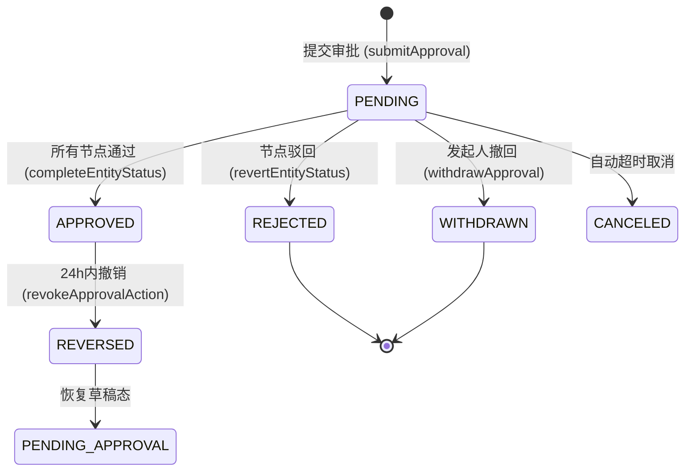

# 审批中心 (Approval Center) 模块需求文档

## 1. 模块概述
审批中心是 L2C (Lead to Cash) 系统的核心组件，负责处理所有需要多级审核的业务流程。它提供了一个灵活、可扩展的引擎，支持基于金额、角色和逻辑条件的审批流转。

## 2. 核心功能
- **审批提交**：业务实体（报价单、订单、付款单等）发起审核请求。
- **条件路由**：支持基于金额区间和自定义表达式的节点过滤逻辑。
- **审批处理**：审批人执行通过、驳回操作，支持添加评论。
- **会签模式**
  - `ANY` (或签)：任一审批人通过即进入下一节点。
  - `ALL` (并签)：所有审批人必须全部通过。
  - `MAJORITY` (半数签)：超过半数通过即通过。
- **超时机制**：支持自动通过、自动驳回、提醒或升级。
- **动态功能**：支持动态加签、审批撤回和 24 小时内撤销。
- **可视化设计**：集成 ReactFlow，支持拖拽式流程建模。

## 3. 审批流转状态机

## 4. 业务实体映射 (Status Rollback)
当审批被驳回、撤回或撤销时，模块会自动更新关联业务实体的状态：

| 实体类型 (EntityType) | 对应数据表 | 默认回退状态 | 完成状态 |
|:---:|:---:|:---:|:---:|
| QUOTE | quotes | DRAFT | APPROVED |
| ORDER | orders | DRAFT | APPROVED |
| PAYMENT_BILL | payment_bills | DRAFT | APPROVED |
| RECEIPT_BILL | receipt_bills | DRAFT | APPROVED |
| MEASURE_TASK | measure_tasks | PENDING | COMPLETED |
| ORDER_CHANGE | order_changes | DRAFT | APPROVED |
| LEAD_RESTORE | leads | INVALID | (恢复前序状态) |

## 5. 技术架构
- **Actions 层**：封装了 10+ 个 Server Actions（提交、处理、查询等）。
- **Schema 层**：使用 Zod 进行输入校验，Drizzle ORM 定义数据结构。
- **Service 层**：通知服务 (`ApprovalNotificationService`) 和 委托服务 (`ApprovalDelegationService`)。
- **算法层**：`graph-utils` 负责将 ReactFlow 的有向无环图 (DAG) 扁平化为线性审批步骤。
