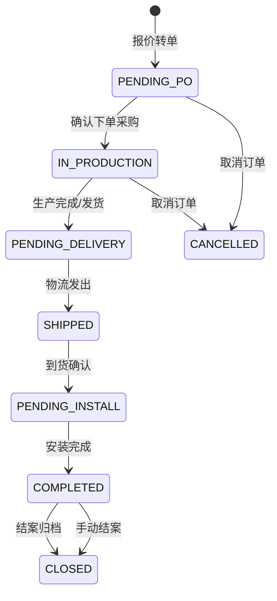
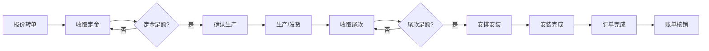
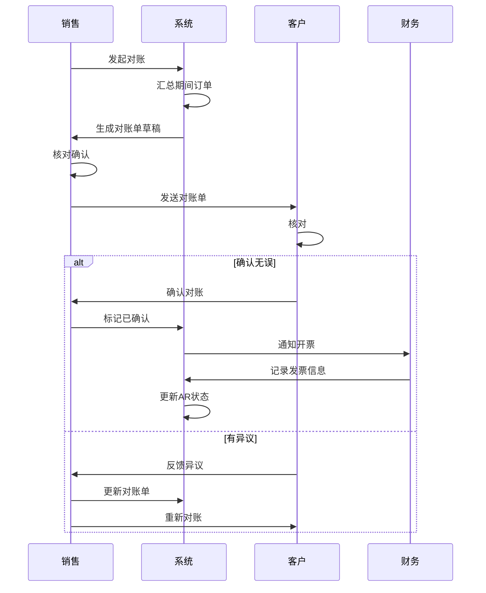
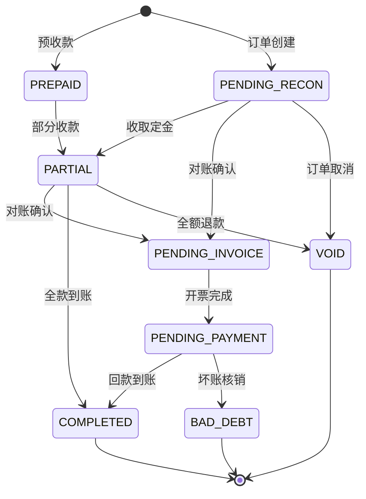

# L2C SaaS 核心模块需求文档：订单与财务闭环系统 (V1.0)

## 1. 模块概述

本模块负责 L2C（从线索到现金）全链路中的**订单履约与资金回款**环节。系统需具备从报价单平滑转换订单、驱动采购/安装等下游工单、以及完整的财务对账与收款能力。

### 1.1 核心目标

1. **单据闭环**：报价单 → 订单 → 采购单 → 安装单 → 完工确认
2. **资金闭环**：订金 → 尾款 → 对账 → 开票 → 回款核销
3. **数据一致性**：转单时锁定商品快照，防止价格抖动

### 1.2 相关模块

| 模块         | 关系           | 数据流向                                   |
| :----------- | :------------- | :----------------------------------------- |
| **报价单**   | 上游           | QuoteBundle → Order (转单)                 |
| **采购单**   | 下游           | Order → PurchaseOrder (下单生产)           |
| **安装单**   | 下游           | Order → InstallTask (安排安装)             |
| **应收账款** | 财务关联       | Order → ARStatement (应收账单)             |
| **应付账款** | 财务关联       | PurchaseOrder → APStatement (应付账单)     |
| **收款单**   | 财务关联       | Receipt → ARStatement (收款核销)           |

---

## 2. 订单状态机 (Order State Machine)

### 2.1 状态定义



| 状态               | 中文名       | 描述                                         | 可执行操作                   |
| :----------------- | :----------- | :------------------------------------------- | :--------------------------- |
| `PENDING_PO`       | 待下单       | 订单已创建，等待确认采购                     | 确认生产、取消订单           |
| `IN_PRODUCTION`    | 生产中       | 已下单至供应商，生产进行中                   | 发货确认、取消订单           |
| `PENDING_DELIVERY` | 待发货       | 生产完成，准备发货                           | 发货、安排安装               |
| `SHIPPED`          | 已发货       | 物流运输中                                   | 到货确认                     |
| `PENDING_INSTALL`  | 待安装       | 货物到达，等待安装                           | 安排安装、开始安装           |
| `COMPLETED`        | 已完成       | 安装完成，客户验收                           | 结案、售后                   |
| `CLOSED`           | 已结案       | 订单归档，不可变更                           | 查看                         |
| `CANCELLED`        | 已取消       | 订单作废                                     | 查看                         |

### 2.2 状态流转规则

| 当前状态         | 目标状态           | 触发条件                     | 准入条件                     |
| :--------------- | :----------------- | :--------------------------- | :--------------------------- |
| `PENDING_PO`     | `IN_PRODUCTION`    | 点击"确认生产"               | 已收定金 ≥ 定金比例          |
| `IN_PRODUCTION`  | `PENDING_DELIVERY` | 供应商反馈生产完成           | 采购单状态为已完成           |
| `PENDING_DELIVERY`| `SHIPPED`         | 点击"发货"                   | 填写物流单号                 |
| `SHIPPED`        | `PENDING_INSTALL`  | 点击"到货"                   | 无                           |
| `PENDING_INSTALL`| `COMPLETED`        | 安装单完成                   | 所有安装单状态为 COMPLETED   |
| `COMPLETED`      | `CLOSED`           | 点击"结案" 或 自动结案       | 已全款 且 无未处理售后       |
| 任意             | `CANCELLED`        | 点击"取消订单"               | 未发货 且 无已付款项         |

### 2.3 自动状态流转

系统支持以下自动状态变更：

1. **采购单完成 → 订单待发货**：当订单关联的所有采购单状态变为 `COMPLETED` 时，自动将订单状态从 `IN_PRODUCTION` 变更为 `PENDING_DELIVERY`。
2. **安装单完成 → 订单已完成**：当订单关联的所有安装单状态变为 `COMPLETED` 时，自动将订单状态从 `PENDING_INSTALL` 变更为 `COMPLETED`。
3. **全款到账 + 无售后 → 自动结案**：订单 `COMPLETED` 后，若已全款且 30 天内无新增售后，系统自动变更为 `CLOSED`。

---

## 3. 订单与下游模块联动

### 3.1 订单 → 采购单 (Purchase Order)

#### 3.1.1 创建规则

当订单状态从 `PENDING_PO` 变更为 `IN_PRODUCTION` 时，系统自动：

1. **按供应商分组**：将订单商品按 `defaultSupplierId` 分组，每个供应商生成一张采购单
2. **填充采购明细**：商品名称、规格、数量、成本价从报价单商品快照读取
3. **计算采购总额**：$TotalCost = \sum(quantity \times unitCost)$

#### 3.1.2 采购单状态同步

| 采购单状态   | 触发动作                         |
| :----------- | :------------------------------- |
| `ORDERED`    | 供应商确认接单                   |
| `SHIPPED`    | 供应商发货，填写物流信息         |
| `RECEIVED`   | 仓库签收入库                     |
| `COMPLETED`  | 验收通过，触发订单状态检查       |
| `CANCELLED`  | 采购取消，需重新评估订单         |

#### 3.1.3 数据结构（已存在）

```typescript
// purchaseOrders 表已存在于 schema.ts
{
    orderId: uuid,         // 关联订单
    supplierId: uuid,      // 供应商
    status: poStatusEnum,  // DRAFT → ORDERED → SHIPPED → RECEIVED → COMPLETED
    totalCost: decimal,
    externalPoNo: string,  // 外部采购单号
    logisticsCompany: string,
    logisticsNo: string,
}
```

### 3.2 订单 → 安装单 (Install Task)

#### 3.2.1 创建规则

以下场景可触发安装单创建：

1. **手动创建**：销售在订单详情页点击"安排安装"
2. **发货触发**：订单状态变为 `SHIPPED` 时，系统提示创建安装单
3. **到货触发**：订单状态变为 `PENDING_INSTALL` 时，自动创建安装单

#### 3.2.2 安装单与订单的关联

- 一个订单可对应多个安装单（分品类、分批次安装）
- 安装单按 `category` (品类) 区分：窗帘、墙布等
- 安装单完成后，检查订单下所有安装单，若全部完成则更新订单状态

#### 3.2.3 安装单状态同步

| 安装单状态       | 描述                           | 反馈至订单                 |
| :--------------- | :----------------------------- | :------------------------- |
| `PENDING_DISPATCH` | 待派单                       | -                          |
| `DISPATCHING`    | 派单中                         | -                          |
| `PENDING_VISIT`  | 待上门                         | -                          |
| `PENDING_CONFIRM`| 待确认（工人已提交）           | -                          |
| `COMPLETED`      | 已完成                         | 检查是否触发订单完成       |
| `CANCELLED`      | 已取消                         | -                          |

### 3.3 订单 → 应收账单 (AR Statement)

#### 3.3.1 创建规则

订单创建时，系统自动生成对应的应收账单：

```typescript
// 创建订单时同步创建应收账单
await tx.insert(arStatements).values({
    orderId: newOrder.id,
    customerId: order.customerId,
    salesId: order.salesId,
    totalAmount: order.totalAmount,
    receivedAmount: '0',
    pendingAmount: order.totalAmount,
    status: 'PENDING_RECON',
});
```

#### 3.3.2 收款计划 (Payment Schedules)

系统根据客户结算方式自动生成收款计划：

**现结客户 (CASH)**：
- 定金：下单时收取（默认 30%，可配置）
- 尾款：安装前收取（剩余 70%）

**月结客户 (MONTHLY)**：
- 全款挂账：订单金额全部挂账
- 月底对账：生成对账单
- 次月回款：按约定账期回款

```typescript
// paymentSchedules 表结构
{
    statementId: uuid,
    orderId: uuid,
    name: '定金' | '尾款' | '全款',
    amount: decimal,
    expectedDate: timestamp,
    status: 'PENDING' | 'PAID' | 'OVERDUE',
}
```

---

## 4. 财务流程详细设计

### 4.1 结算方式 (Settlement Type)

客户可设置默认结算方式：

| 结算方式 | 代码       | 描述                                     |
| :------- | :--------- | :--------------------------------------- |
| 现结     | `CASH`     | 下单付定金，安装前付尾款                 |
| 月结     | `MONTHLY`  | 按月对账，次月付款                       |

### 4.2 收款类型 (Receipt Type)

| 收款类型   | 代码           | 使用场景                     |
| :--------- | :------------- | :--------------------------- |
| 订金       | `DEPOSIT`      | 下单时收取，锁定生产         |
| 预付款     | `PREPAYMENT`   | 部分预付，加速采购           |
| 尾款       | `FINAL_PAYMENT`| 安装前/后收取                |
| 其他       | `OTHER`        | 补差价、杂费等               |

### 4.3 现结流程 (Cash Settlement)



#### 4.3.1 定金收取

**触发时机**：报价单转订单时，或 转单后至确认生产前

**业务逻辑**：
1. 计算定金金额：$Deposit = TotalAmount \times DepositRatio$（默认 30%）
2. 生成收款计划：定金 + 尾款
3. 订单状态为 `PENDING_PO`，等待定金确认

**UI 交互**：
- 转单弹窗显示"定金金额"输入框，默认填充计算值
- **支持多次收款**：允许客户分多次支付定金，系统累计 `depositPaidAmount`
- 进度条显示：定金支付进度 (已付/应付)
- 勾选"已收定金"或定金足额后方可提交（视配置而定）

**准入条件**（见 9.1 订单配置）：
- `PRODUCTION_TRIGGER` = `DEPOSIT_REQUIRED`: 已收定金 ≥ 最低定金比例
- `PRODUCTION_TRIGGER` = `FULL_PAYMENT`: 已收金额 = 订单总额
- `PRODUCTION_TRIGGER` = `NONE`: 无需资金门槛（如内部订单）

#### 4.3.2 尾款收取

**触发时机**：安装前

**业务逻辑**：
1. 计算尾款金额：$FinalPayment = TotalAmount - ReceivedAmount$
2. 更新应收账单状态

**准入条件**（可配置）：
- 默认：收取尾款后方可安排安装
- 可选：安装后 N 天内收取尾款

### 4.4 月结流程 (Monthly Settlement)


#### 4.4.1 挂账逻辑

**准入条件**：
- 客户 `settlementType = 'MONTHLY'`

**信用管控**：
- **额度内**：(当前欠款 + 本单金额) ≤ 信用额度 -> 自动通过
- **超限**：(当前欠款 + 本单金额) > 信用额度 -> **触发审批流**
  - 订单状态标记为 `PENDING_APPROVAL` (待审批)
  - 销售主管/财务审批通过后，方可进入 `PENDING_PO` 或直接 `IN_PRODUCTION`

**业务逻辑**：
1. 订单创建时，应收账单状态为 `PENDING_RECON`
2. 审批通过后，订单金额累加至客户欠款

#### 4.4.2 月度对账

**触发时机**：每月最后一个工作日 或 手动触发

**对账范围**：
- 指定客户 + 指定时间段内的所有 `COMPLETED` 订单
- 排除已对账订单

**对账单内容**：
- 对账单编号
- 对账期间
- 订单明细列表
- 汇总金额
- 上期余额
- 本期应付

**交互流程**：
1. 系统生成对账单草稿
2. 销售导出发送给客户
3. 客户确认后，更新应收账单状态为 `PENDING_INVOICE`
4. 财务开票后，更新状态为 `PENDING_PAYMENT`
5. 客户付款后，核销账单

### 4.5 全款支付流程

**使用场景**：客户一次性支付全部款项

**业务逻辑**：
1. 收款金额 = 订单总额
2. 应收账单状态直接变更为 `COMPLETED`
3. 订单可直接确认生产

### 4.6 退款流程 (Refund)

**触发场景**：
- 订单取消退款
- 售后退款
- 多收款项退还

**业务逻辑**：
1. 创建负数金额的收款记录
2. 更新应收账单 `receivedAmount` 和 `pendingAmount`
3. 更新应收账单状态

**准入条件**：
- 退款金额 ≤ 已收款金额
- 需要填写退款原因
- **审批流程**：根据系统设置的审批流配置（如 `RefundApprovalWorkflow`）执行
  - 角色配置：可在"审批设置"中指定审批人（如：金额 < 1000 店长审批，>= 1000 财务+总经理审批）
  - 支付方式：建议原则上"原路退回"，但也支持协商后变更方式退款（需备注原因）

---

## 5. 对账单设计 (Reconciliation Statement)

### 5.1 对账单类型

| 类型       | 使用场景                     | 周期               |
| :--------- | :--------------------------- | :----------------- |
| 月度对账单 | 月结客户定期对账             | 每月               |
| 即时对账单 | 单笔订单核对                 | 按需               |
| 年度汇总   | 年终结算                     | 每年               |

### 5.2 月度对账单字段

```typescript
interface ReconciliationStatement {
    id: string;
    statementNo: string;           // 对账单编号
    tenantId: string;
    customerId: string;
    
    periodStart: Date;             // 对账开始日期
    periodEnd: Date;               // 对账结束日期
    
    previousBalance: number;       // 上期余额
    currentOrders: OrderItem[];    // 本期订单明细
    currentAmount: number;         // 本期发生额
    currentReceipts: Receipt[];    // 本期收款明细
    currentReceived: number;       // 本期收款额
    endingBalance: number;         // 期末余额
    
    status: 'DRAFT' | 'SENT' | 'CONFIRMED' | 'DISPUTED';
    confirmedAt: Date | null;
    confirmedBy: string | null;
    
    attachmentUrls: string[];      // 对账单附件
    remark: string;
    
    createdBy: string;
    createdAt: Date;
    updatedAt: Date;
}
```

### 5.3 对账流程



---

## 6. 应收账款管理 (AR Management)

### 6.1 AR 状态流转



### 6.2 状态说明

| 状态               | 中文名     | 描述                                   |
| :----------------- | :--------- | :------------------------------------- |
| `PREPAID`          | 预收款     | 收款先于订单（少见）                   |
| `PENDING_RECON`    | 待对账     | 月结客户挂账中                         |
| `PARTIAL`          | 部分收款   | 已收部分款项                           |
| `PENDING_INVOICE`  | 待开票     | 对账确认，等待开票                     |
| `PENDING_PAYMENT`  | 待回款     | 已开票，等待付款                       |
| `COMPLETED`        | 已完成     | 全款核销                               |
| `BAD_DEBT`         | 坏账       | 无法回收的应收款                       |
| `VOID`             | 作废       | 订单取消或退款                         |

---

## 7. 数据库设计建议

### 7.1 新增表：对账单 (reconciliation_statements)

```typescript
export const reconciliationStatements = pgTable('reconciliation_statements', {
    id: uuid('id').primaryKey().defaultRandom(),
    tenantId: uuid('tenant_id').references(() => tenants.id).notNull(),
    statementNo: varchar('statement_no', { length: 50 }).unique().notNull(),
    
    customerId: uuid('customer_id').references(() => customers.id).notNull(),
    salesId: uuid('sales_id').references(() => users.id),
    
    periodStart: timestamp('period_start', { withTimezone: true }).notNull(),
    periodEnd: timestamp('period_end', { withTimezone: true }).notNull(),
    
    previousBalance: decimal('previous_balance', { precision: 12, scale: 2 }).default('0'),
    currentAmount: decimal('current_amount', { precision: 12, scale: 2 }).default('0'),
    currentReceived: decimal('current_received', { precision: 12, scale: 2 }).default('0'),
    endingBalance: decimal('ending_balance', { precision: 12, scale: 2 }).default('0'),
    
    orderIds: jsonb('order_ids').$type<string[]>().default([]),
    
    status: reconciliationStatusEnum('status').default('DRAFT'),
    confirmedAt: timestamp('confirmed_at', { withTimezone: true }),
    confirmedBy: uuid('confirmed_by').references(() => users.id),
    
    attachmentUrls: jsonb('attachment_urls').default([]),
    remark: text('remark'),
    
    createdBy: uuid('created_by').references(() => users.id).notNull(),
    createdAt: timestamp('created_at', { withTimezone: true }).defaultNow(),
    updatedAt: timestamp('updated_at', { withTimezone: true }).defaultNow(),
});

export const reconciliationStatusEnum = pgEnum('reconciliation_status', [
    'DRAFT',      // 草稿
    'SENT',       // 已发送
    'CONFIRMED',  // 已确认
    'DISPUTED',   // 有异议
]);
```

### 7.2 新增表：收款单 (receipts)

```typescript
export const receipts = pgTable('receipts', {
    id: uuid('id').primaryKey().defaultRandom(),
    tenantId: uuid('tenant_id').references(() => tenants.id).notNull(),
    receiptNo: varchar('receipt_no', { length: 50 }).unique().notNull(),
    
    // 关联
    customerId: uuid('customer_id').references(() => customers.id).notNull(),
    orderId: uuid('order_id').references(() => orders.id),
    statementId: uuid('statement_id').references(() => arStatements.id),
    scheduleId: uuid('schedule_id').references(() => paymentSchedules.id),
    
    // 金额
    amount: decimal('amount', { precision: 12, scale: 2 }).notNull(),
    type: receiptTypeEnum('type').notNull(), // DEPOSIT, FINAL_PAYMENT, etc.
    method: paymentMethodEnum('method').notNull(),
    
    // 凭证
    transactionId: varchar('transaction_id', { length: 100 }),
    proofUrl: text('proof_url'),
    
    // 状态
    status: receiptStatusEnum('status').default('PENDING'),
    
    remark: text('remark'),
    
    recordedBy: uuid('recorded_by').references(() => users.id).notNull(),
    confirmedBy: uuid('confirmed_by').references(() => users.id),
    
    recordedAt: timestamp('recorded_at', { withTimezone: true }).defaultNow(),
    confirmedAt: timestamp('confirmed_at', { withTimezone: true }),
});
```

### 7.3 orders 表扩展字段

```typescript
// 建议在 orders 表添加以下字段
{
    // 结算相关
    settlementType: settlementTypeEnum('settlement_type'), // 继承客户默认或手动指定
    depositRatio: decimal('deposit_ratio', { precision: 5, scale: 2 }), // 定金比例
    depositAmount: decimal('deposit_amount', { precision: 12, scale: 2 }), // 定金金额
    depositPaidAt: timestamp('deposit_paid_at', { withTimezone: true }), // 定金收取时间
    
    // 发货相关
    shippedAt: timestamp('shipped_at', { withTimezone: true }),
    deliveredAt: timestamp('delivered_at', { withTimezone: true }),
    
    // 安装相关
    installScheduledAt: timestamp('install_scheduled_at', { withTimezone: true }),
    installCompletedAt: timestamp('install_completed_at', { withTimezone: true }),
    
    // 快照
    quoteSnapshot: jsonb('quote_snapshot'), // 报价单完整快照
}
```

---

## 8. API 接口设计

### 8.1 订单核心接口

| 接口                       | 方法   | 描述                     |
| :------------------------- | :----- | :----------------------- |
| `createOrderFromQuote`     | POST   | 报价转订单               |
| `confirmOrderProduction`   | POST   | 确认生产                 |
| `shipOrder`                | POST   | 确认发货                 |
| `confirmOrderDelivery`     | POST   | 确认到货                 |
| `completeOrder`            | POST   | 完成订单                 |
| `closeOrder`               | POST   | 结案订单                 |
| `cancelOrder`              | POST   | 取消订单                 |

### 8.2 收款接口

| 接口                       | 方法   | 描述                     |
| :------------------------- | :----- | :----------------------- |
| `createReceipt`            | POST   | 创建收款单               |
| `confirmReceipt`           | POST   | 确认收款                 |
| `createRefund`             | POST   | 创建退款                 |
| `getReceiptsByOrder`       | GET    | 获取订单收款记录         |

### 8.3 对账接口

| 接口                           | 方法   | 描述                     |
| :----------------------------- | :----- | :----------------------- |
| `generateReconciliation`       | POST   | 生成对账单               |
| `sendReconciliation`           | POST   | 发送对账单               |
| `confirmReconciliation`        | POST   | 确认对账                 |
| `disputeReconciliation`        | POST   | 标记异议                 |

---

## 9. 租户级配置项

### 9.1 订单配置

| 配置项                 | 默认值   | 描述                           |
| :--------------------- | :------- | :----------------------------- |
| `productionTrigger`    | `DEPOSIT`| 生产触发条件 (`DEPOSIT` 定金 / `FULL` 全款 / `NONE` 无需) |
| `defaultDepositRatio`  | 0.3      | 默认定金比例                   |
| `minDepositRatio`      | 0.2      | 最低定金比例                   |
| `allowInstallWithoutFinalPayment` | false | 是否允许未付尾款安装 |
| `autoCloseAfterDays`   | 30       | 完成后自动结案天数             |

### 9.2 财务配置

| 配置项                     | 默认值   | 描述                       |
| :------------------------- | :------- | :------------------------- |
| `monthlySettlementDay`     | -1       | 月结日（-1 表示月末）      |
| `defaultPaymentTermDays`   | 30       | 默认账期天数               |
| `requireApprovalForRefund` | true     | 退款是否需要审批           |
| `creditLimitEnabled`       | true     | 是否启用信用额度管控       |

---

## 10. 权限设计

### 10.1 订单权限

| 权限代码                   | 描述                 |
| :------------------------- | :------------------- |
| `order:view`               | 查看订单             |
| `order:create`             | 创建订单             |
| `order:confirm_production` | 确认生产             |
| `order:ship`               | 确认发货             |
| `order:complete`           | 完成订单             |
| `order:close`              | 结案订单             |
| `order:cancel`             | 取消订单             |

### 10.2 财务权限

| 权限代码                   | 描述                 |
| :------------------------- | :------------------- |
| `finance:ar_view`          | 查看应收             |
| `finance:record_payment`   | 记录收款             |
| `finance:refund`           | 退款                 |
| `finance:reconcile`        | 对账                 |
| `finance:invoice`          | 开票                 |

---

## 11. 待讨论事项

> [!IMPORTANT]
> 以下问题需要与用户确认后再做最终设计决策。

### 11.1 定金规则
- 是否允许分多次收取定金？
- 定金不足时，是否允许由高级管理员强制确认生产？

### 11.2 月结客户
- 信用额度超限时，是否完全禁止下单，还是允许审批后下单？
- 对账单是否需要客户电子签名确认？

### 11.3 退款流程
- 退款审批人角色限定（财务？店长？）
- 退款与原收款方式是否需要一致？（如微信收款是否必须微信退款）

### 11.4 与现有代码的整合 (最佳实践建议)

**关于 `paymentRecords` vs `receipts`**:
- **建议**：**重构 (Refactor)** 而非 并存。
- **方案**：将现有的 `paymentRecords` 表重命名并升级为 `receipts`。
  - 原因：`paymentRecords` 目前仅作为记录，而 `receipts` (收款单) 是更正式的财务单据概念，包含单号、状态流转等。
  - 操作：保留所有现有字段，新增 `receiptNo`, `status`, `type` 等字段。所有引用 `paymentRecords` 的代码改为引用 `receipts`。

**关于 `arStatements` 状态**:
- **建议**：状态枚举保持不变，足以覆盖业务场景。
  - `PARTIAL` 状态完美支持用户的"多次收款"需求。
  - `VOID` 状态支持订单取消场景。
  - 若需支持"超额收款"（罕见），可依赖 `amount` 数值判断，无需独立状态。

---

## 12. 附录

### 12.1 术语表

| 术语           | 英文                 | 定义                             |
| :------------- | :------------------- | :------------------------------- |
| 订金/定金      | Deposit              | 下单时预收款项                   |
| 尾款           | Final Payment        | 完款时收取的剩余款项             |
| 应收账款       | Accounts Receivable  | 客户欠公司的款项                 |
| 应付账款       | Accounts Payable     | 公司欠供应商的款项               |
| 对账单         | Reconciliation       | 双方确认的账务明细               |
| 核销           | Write-off            | 确认收款与应收的匹配             |
| 坏账           | Bad Debt             | 无法收回的应收款                 |

### 12.2 相关文档

- [报价单需求文档](./报价单需求.md)
- [数量计算逻辑](./数量计算逻辑.md)
- [数据库 Schema](../src/shared/api/schema.ts)
