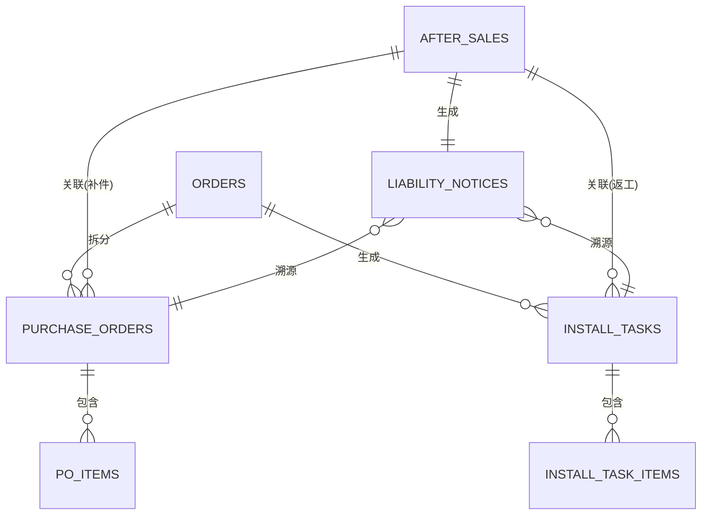

# 全链路溯源

## 1. 模块概述

### 1.1 业务价值
全链路溯源模块旨在实现从售后问题到源头的完整追溯，帮助系统自动识别问题根源，提升售后处理效率和责任认定准确性。

### 1.2 核心目标
- **自动溯源**: 售后问题发生后，系统能自动追溯到具体的采购批次或安装师傅
- **责任认定**: 基于溯源数据，自动判定责任方（供应商/安装师傅/其他）
- **质量分析**: 通过溯源数据分析供应商和安装师傅的质量表现
- **风险预警**: 识别问题批次，提前预警潜在风险

### 1.3 适用场景
1. **产品质量问题**: 面料色差、尺寸偏差、工艺缺陷等
2. **安装质量问题**: 安装不规范、位置错误、配件缺失等
3. **批次质量问题**: 同一批次产品出现多起售后问题

## 2. 溯源数据模型

### 2.1 核心关联关系



### 2.2 溯源字段定义

#### 2.2.1 售后工单溯源字段
| 字段名 | 类型 | 说明 |
|:---|:---|:---|
| source_purchase_order_id | UUID | 关联导致故障的原始采购单 |
| source_install_task_id | UUID | 关联导致故障的原始安装单 |

#### 2.2.2 责任认定单溯源字段
| 字段名 | 类型 | 说明 |
|:---|:---|:---|
| linked_evidence | JSONB | 自动关联的证据链 (量尺图、生产单、安装前后对比图) |
| liable_party_credit | JSONB | 责任方近90天售后率等信用记录 |

#### 2.2.3 采购单溯源字段
| 字段名 | 类型 | 说明 |
|:---|:---|:---|
| after_sales_id | UUID | 关联售后工单 (用于售后补件) |

#### 2.2.4 采购单明细溯源字段
| 字段名 | 类型 | 说明 |
|:---|:---|:---|
| (无批次追溯字段) | - | - |

#### 2.2.5 安装单溯源字段
| 字段名 | 类型 | 说明 |
|:---|:---|:---|
| after_sales_id | UUID | 关联售后工单 (用于售后返工) |

## 3. 溯源流程

### 3.1 溯源触发时机
1. **售后工单创建**: 售后工单创建时，系统自动关联原始订单
2. **责任认定**: 责任认定单创建时，系统自动追溯源头
3. **批量分析**: 定期分析同一批次产品的售后率

### 3.2 溯源逻辑

#### 3.2.1 按问题类型溯源
```typescript
interface TraceabilityRule {
  issue_type: string;
  trace_to: 'purchase' | 'install' | 'both';
  condition: (issue: AfterSalesIssue) => boolean;
}

const rules: TraceabilityRule[] = [
  {
    issue_type: 'QUALITY_DEFECT',
    trace_to: 'purchase',
    condition: (issue) => issue.category === 'PRODUCT'
  },
  {
    issue_type: 'INSTALL_ERROR',
    trace_to: 'install',
    condition: (issue) => issue.category === 'SERVICE'
  },
  {
    issue_type: 'BATCH_ISSUE',
    trace_to: 'both',
    condition: (issue) => issue.description.includes('色差') || issue.description.includes('批次')
  }
];
```

#### 3.2.2 溯源查询逻辑
```sql
-- 查询同一采购单的所有售后记录
SELECT 
  po.id as purchase_order_id,
  po.po_no,
  po.supplier_id,
  po.supplier_name,
  COUNT(DISTINCT aso.id) as after_sales_count,
  COUNT(DISTINCT o.id) as total_orders,
  ROUND(COUNT(DISTINCT aso.id)::numeric / COUNT(DISTINCT o.id) * 100, 2) as after_sales_rate
FROM purchase_orders po
JOIN po_items poi ON po.id = poi.po_id
JOIN orders o ON po.order_id = o.id
LEFT JOIN after_sales aso ON o.id = aso.order_id AND aso.issue_type = 'QUALITY_DEFECT'
WHERE po.id = :purchase_order_id
GROUP BY po.id, po.po_no, po.supplier_id, po.supplier_name;

-- 查询同一安装师傅的售后率
SELECT 
  it.id as install_task_id,
  it.task_no,
  it.installer_id,
  it.installer_name,
  COUNT(DISTINCT aso.id) as after_sales_count,
  COUNT(DISTINCT o.id) as total_orders,
  ROUND(COUNT(DISTINCT aso.id)::numeric / COUNT(DISTINCT o.id) * 100, 2) as after_sales_rate
FROM install_tasks it
JOIN orders o ON it.order_id = o.id
LEFT JOIN after_sales aso ON o.id = aso.order_id AND aso.issue_type = 'INSTALL_ERROR'
WHERE it.installer_id = :installer_id
  AND it.actual_end_at >= CURRENT_DATE - INTERVAL '90 days'
GROUP BY it.id, it.task_no, it.installer_id, it.installer_name;
```

### 3.3 溯源结果应用
1. **自动定责**: 根据溯源结果，自动推荐责任方
2. **成本分摊**: 根据责任方，自动计算成本分摊比例
3. **信用评分**: 更新责任方的信用评分
4. **风险预警**: 对高风险批次或师傅进行预警

## 4. 溯源看板

### 4.1 看板概述
溯源看板为售后人员提供可视化的溯源信息，帮助快速定位问题根源。

### 4.2 看板布局

```
┌─────────────────────────────────────────────────────────────────────┐
│                          全链路溯源看板                              │
├─────────────────────────────────────────────────────────────────────┤
│  售后工单: AS20260114001  |  问题类型: 质量缺陷  |  状态: 待定责      │
├─────────────────────────────────────────────────────────────────────┤
│  问题摘要: 窗帘色差明显，与样品不符                                │
├─────────────────────────────────────────────────────────────────────┤
│  溯源路径: 订单 → 采购单 → 供应商                           │
├─────────────────────────────────────────────────────────────────────┤
│  ┌─────────────────────────┐  ┌─────────────────────────┐          │
│  │   采购溯源信息          │  │   安装溯源信息          │          │
│  ├─────────────────────────┤  ├─────────────────────────┤          │
│  │ 采购单号: PO20260101001 │  │ 安装单号: IT20260101001 │          │
│  │ 供应商: XX纺织厂        │  │ 安装师傅: 张师傅        │          │
│  │ 采购日期: 2026-01-01    │  │ 安装日期: 2026-01-05    │          │
│  │ 采购数量: 100米         │  │ 售后率: 2.3%            │          │
│  │ 售后单数: 5单           │  │ 近90天售后单: 3单       │          │
│  │ 售后率: 5.0%            │  │ 评分: 4.5/5.0           │          │
│  └─────────────────────────┘  └─────────────────────────┘          │
├─────────────────────────────────────────────────────────────────────┤
│  证据链                                                          │
│  ┌─────────────┐  ┌─────────────┐  ┌─────────────┐  ┌─────────────┐│
│  │ 量尺图      │  │ 生产单      │  │ 安装前照片  │  │ 安装后照片  ││
│  │ [查看]      │  │ [查看]      │  │ [查看]      │  │ [查看]      ││
│  └─────────────┘  └─────────────┘  └─────────────┘  └─────────────┘│
├─────────────────────────────────────────────────────────────────────┤
│  批次问题统计                                                    │
│  该采购单共涉及 20 个订单，其中 5 个订单出现售后问题，售后率 25%     │
│  ┌─────────────────────────────────────────────────────────────┐   │
│  │ 推荐处理方式:                                                 │   │
│  │ 1. 联系供应商确认该采购单的质量问题                          │   │
│  │ 2. 对该供应商的其他订单进行主动回访                          │   │
│  │ 3. 暂停该供应商的后续采购，等待质量确认                      │   │
│  └─────────────────────────────────────────────────────────────┘   │
├─────────────────────────────────────────────────────────────────────┤
│  [查看供应商历史记录]  [生成责任认定单]      │
└─────────────────────────────────────────────────────────────────────┘
```

### 4.3 数据结构
```typescript
interface TraceabilityDashboard {
  after_sales_id: string;
  issue_summary: {
    description: string;
    type: string;
    liable_party: string;
  };
  traceability_path: string[];
  purchase_traceability: {
    purchase_order_id: string;
    purchase_order_no: string;
    supplier_id: string;
    supplier_name: string;
    purchase_date: Date;
    quantity: number;
    after_sales_count: number;
    after_sales_rate: number;
  };
  install_traceability: {
    install_task_id: string;
    install_task_no: string;
    installer_id: string;
    installer_name: string;
    install_date: Date;
    after_sales_rate: number;
    after_sales_count: number;
    rating: number;
  };
  evidence_chain: {
    measurement_photos: string[];
    production_order: string;
    before_install_photos: string[];
    after_install_photos: string[];
    issue_photos: string[];
  };
  batch_issue_stats: {
    total_orders: number;
    after_sales_orders: number;
    after_sales_rate: number;
    recommendations: string[];
  };
}
```

### 4.4 查询接口
```typescript
interface GetTraceabilityRequest {
  after_sales_id: string;
}

interface GetTraceabilityResponse {
  data: TraceabilityDashboard;
}
```

## 5. 数据统计和分析

### 5.1 批次问题分析
- **采购单售后率**: 统计每个采购单的售后率
- **批次问题预警**: 对售后率超过阈值的采购单进行预警
- **批次影响范围**: 统计问题采购单涉及的订单数量

### 5.2 供应商质量分析
- **供应商售后率**: 统计每个供应商的售后率
- **供应商信用评分**: 基于售后率、响应时间等指标计算信用评分
- **供应商黑名单**: 对质量不达标的供应商进行限制

### 5.3 安装师傅质量分析
- **师傅售后率**: 统计每个师傅的售后率
- **师傅评分**: 基于客户评分和售后率计算综合评分
- **师傅黑名单**: 对质量不达标的师傅进行限制

### 5.4 统计报表
```sql
-- 供应商质量统计报表
SELECT 
  s.id as supplier_id,
  s.name as supplier_name,
  COUNT(DISTINCT po.id) as total_purchase_orders,
  COUNT(DISTINCT aso.id) as after_sales_count,
  ROUND(COUNT(DISTINCT aso.id)::numeric / NULLIF(COUNT(DISTINCT po.id), 0) * 100, 2) as after_sales_rate,
  AVG(s.rating) as avg_rating,
  s.credit_score
FROM suppliers s
LEFT JOIN purchase_orders po ON s.id = po.supplier_id
LEFT JOIN orders o ON po.order_id = o.id
LEFT JOIN after_sales aso ON o.id = aso.order_id
WHERE po.created_at >= CURRENT_DATE - INTERVAL '90 days'
GROUP BY s.id, s.name, s.rating, s.credit_score
ORDER BY after_sales_rate DESC;

-- 安装师傅质量统计报表
SELECT 
  u.id as installer_id,
  u.name as installer_name,
  COUNT(DISTINCT it.id) as total_install_tasks,
  COUNT(DISTINCT aso.id) as after_sales_count,
  ROUND(COUNT(DISTINCT aso.id)::numeric / NULLIF(COUNT(DISTINCT it.id), 0) * 100, 2) as after_sales_rate,
  AVG(it.rating) as avg_rating,
  u.credit_score
FROM users u
LEFT JOIN install_tasks it ON u.id = it.installer_id
LEFT JOIN orders o ON it.order_id = o.id
LEFT JOIN after_sales aso ON o.id = aso.order_id
WHERE it.actual_end_at >= CURRENT_DATE - INTERVAL '90 days'
GROUP BY u.id, u.name, u.credit_score
ORDER BY after_sales_rate DESC;
```

## 6. 风险预警

### 6.1 预警规则
1. **供应商预警**: 供应商售后率超过 5%
2. **师傅预警**: 安装师傅售后率超过 3%
3. **批量预警**: 同一供应商的多个采购单出现质量问题

### 6.2 预警处理
1. **自动预警**: 系统自动发送预警通知
2. **人工审核**: 质检人员审核预警信息
3. **措施执行**: 根据预警级别执行相应措施
4. **效果跟踪**: 跟踪预警处理效果

### 6.3 预警级别
| 级别 | 条件 | 处理措施 |
|:---|:---|:---|
| 低 | 售后率 5%-10% | 提醒注意 |
| 中 | 售后率 10%-20% | 暂停新订单 |
| 高 | 售后率 >20% | 列入黑名单 |

## 7. 系统集成

### 7.1 与售后模块集成
- 售后工单创建时自动关联原始订单
- 责任认定时自动追溯源头
- 溯源看板嵌入售后详情页

### 7.2 与采购模块集成
- 采购单记录缸号信息
- 售后补件时自动关联售后工单
- 供应商质量分析数据来源

### 7.3 与安装模块集成
- 安装单记录师傅信息
- 售后返工时自动关联售后工单
- 师傅质量分析数据来源

## 8. 权限控制

### 8.1 角色权限
| 角色 | 查看溯源 | 编辑溯源 | 查看预警 | 处理预警 |
|:---|:---:|:---:|:---:|:---:|
| 售后专员 | ✓ | ✗ | ✓ | ✗ |
| 质检员 | ✓ | ✓ | ✓ | ✓ |
| 采购员 | ✓ | ✓ | ✓ | ✓ |
| 管理员 | ✓ | ✓ | ✓ | ✓ |

### 8.2 数据权限
- **溯源数据**: 所有相关人员可查看
- **预警数据**: 仅质检员、采购员、管理员可查看
- **处理记录**: 仅质检员、管理员可编辑

## 9. 性能优化

### 9.1 索引优化
```sql
CREATE INDEX idx_after_sales_order_id ON after_sales(order_id);
CREATE INDEX idx_install_tasks_installer_id ON install_tasks(installer_id);
CREATE INDEX idx_liability_notices_source_po ON liability_notices(source_purchase_order_id);
CREATE INDEX idx_liability_notices_source_it ON liability_notices(source_install_task_id);
```

### 9.2 缓存策略
- 溯源数据缓存 1 小时
- 统计报表缓存 1 天
- 预警数据实时更新

### 9.3 分页查询
- 批次问题列表分页查询
- 供应商质量报表分页查询
- 师傅质量报表分页查询

## 10. 未来扩展

### 10.1 智能溯源
- 基于机器学习的自动溯源
- 图像识别辅助问题判定
- 自然语言处理分析问题描述

### 10.2 区块链溯源
- 关键数据上链存证
- 不可篡改的溯源记录
- 多方协作的溯源体系

### 10.3 实时预警
- 基于流数据的实时预警
- 预警消息推送
- 自动化处理流程
