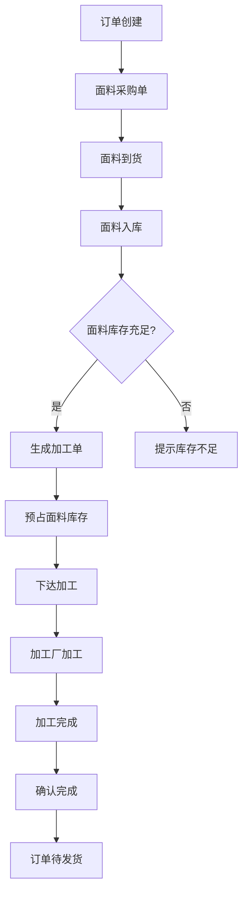

# 加工单模块需求 (Processing Order)

## 1. 模块概述 (Module Overview)

| 属性 | 说明 |
|:---|:---|
| **模块名称** | 加工单 (Processing Order) |
| **核心价值** | 管理面料加工流程，连接面料库存与成品交付 |
| **目标用户** | 采购员、加工厂、店长 |
| **上游模块** | 订单、面料采购单 |
| **下游模块** | 对账单 (AP) |

## 2. 业务场景 (Business Scenario)

### 2.1 典型场景
1. **面料入库**: 面料采购单到货后，采购员确认入库，增加面料库存
2. **生成加工单**: 订单中的面料商品全部入库后，系统自动生成加工单
3. **面料预占**: 生成加工单时，系统自动预占面料库存
4. **加工下单**: 采购员将加工单下达给加工厂
5. **加工跟进**: 跟踪加工厂生产进度，确认加工完成
6. **成品入库**: 加工完成后的成品入库，等待发货
7. **加工对账**: 定期与加工厂核对加工费

### 2.2 创建规则
*   **禁止直接创建**: 加工单模块不提供"新建"按钮
*   **唯一来源**: 由订单自动生成
*   **触发条件**: 订单中所有面料采购单都已完成入库（状态为 `STOCKED`）
*   **生成时机**: 订单状态从 `FABRIC_RECEIVED` 变为 `PROCESSING` 时

### 2.3 与面料库存的关系

*   **预占库存**: 生成加工单时，系统自动预占面料库存
    *   预占数量从 `available_quantity` 中扣除
    *   预占数量增加到 `reserved_quantity`
    *   生成库存流水记录（类型：`PROCESSING_OUT`）
*   **库存检查**: 生成加工单前，检查面料库存是否充足
    *   如果库存不足，提示库存不足，需要先采购面料
    *   如果库存充足，允许生成加工单
*   **库存扣减**: 加工厂领取面料时，确认出库
    *   出库数量从 `reserved_quantity` 中扣除
    *   生成库存流水记录（类型：`PROCESSING_OUT`）

## 3. 状态流转 (State Machine)


| 状态 | 状态码 | 说明 | 触发条件 (Proof of Work) |
|:---|:---|:---|:---|
| **待处理** | `PENDING` | 待下达给加工厂 | 订单状态变为 `PROCESSING` 时自动生成 |
| **加工中** | `PROCESSING` | 加工厂正在加工 | 采购员点击"下达加工" 或 上传加工确认截图 |
| **已完成** | `COMPLETED` | 加工完成 | 采购员点击"确认完成" 或 上传成品照片 |
| **已取消** | `CANCELLED` | 加工取消 | 关联订单撤单 |

### 3.1 状态联动 (向上驱动订单)

| 加工单状态 | 订单状态变化条件 |
|:---|:---|
| 任一加工单 → `PROCESSING` | 订单保持 `PROCESSING` |
| **所有** 加工单 → `COMPLETED` | 订单进入 `PENDING_DELIVERY`（等待成品采购单也完成） |

## 4. 核心字段定义 (Field Definitions)

### 4.1 加工单主表 (processing_orders)

| 字段名 | 类型 | 必填 | 说明 |
|:---|:---|:---|:---|
| id | UUID | ✓ | 主键 |
| processing_no | String | ✓ | 加工单号 (PR20260101001) |
| order_id | UUID | ✓ | 关联订单 |
| order_item_id | UUID | ✓ | 关联订单明细 |
| processor_id | UUID | ✓ | 关联加工厂（供应商表中类型为PROCESSOR） |
| processor_name | String | ✓ | 加工厂名称（冗余） |
| status | Enum | ✓ | 状态 (PENDING/PROCESSING/COMPLETED/CANCELLED) |
| total_cost | Decimal | ✓ | 加工成本总额 |
| processing_cost | Decimal | ✓ | 加工费总额 |
| material_cost | Decimal | ✓ | 面料成本总额 |
| external_po_no | String | - | 外部单号（加工厂方） |
| processor_confirm_img | String | - | 加工厂确认截图（OSS URL） |
| sent_method | Enum | - | 发送方式（WECHAT/EMAIL/SYSTEM） |
| sent_at | DateTime | - | 发送时间 |
| started_at | DateTime | - | 开始加工时间 |
| completed_at | DateTime | - | 加工完成时间 |
| expected_completion_date | Date | - | 预计完成日期 |
| finished_product_img | String | - | 成品照片（OSS URL） |
| design_img | String | - | 加工图纸（OSS URL） |
| specifications | JSONB | - | 加工规格（尺寸、工艺等） |
| remark | Text | - | 备注 |
| created_by | UUID | ✓ | 创建人 |
| created_at | DateTime | ✓ | 创建时间 |

### 4.2 加工单明细表 (processing_order_items)

| 字段名 | 类型 | 必填 | 说明 |
|:---|:---|:---|:---|
| id | UUID | ✓ | 主键 |
| processing_order_id | UUID | ✓ | 关联加工单 |
| order_item_id | UUID | ✓ | 关联订单明细 |
| fabric_product_id | UUID | ✓ | 关联面料商品 |
| fabric_sku | String | ✓ | 面料SKU |
| fabric_name | String | ✓ | 面料名称 |
| fabric_color | String | - | 面料颜色/花色 |
| fabric_width | Decimal | - | 面料幅宽（米） |
| fabric_quantity | Decimal | ✓ | 面料用量（米/卷） |
| fabric_batch_no | String | - | 面料批次号 |
| fabric_unit_cost | Decimal | ✓ | 面料成本单价 |
| fabric_cost | Decimal | ✓ | 面料成本小计 |
| finished_product_id | UUID | ✓ | 关联成品商品 |
| finished_sku | String | ✓ | 成品SKU |
| finished_name | String | ✓ | 成品名称 |
| finished_quantity | Decimal | ✓ | 成品数量（件/套） |
| processing_cost | Decimal | ✓ | 加工费单价 |
| processing_cost_total | Decimal | ✓ | 加工费小计 |
| specifications | JSONB | - | 加工规格（尺寸、工艺等） |
| remark | String | - | 行备注 |

## 5. 界面设计 (UI Design)

### 5.1 列表页 (Processing Order List)

#### 展示字段
| 字段 | 宽度 | 说明 |
|:---|:---|:---|
| 加工单号 | 150px | 可点击跳转 |
| 关联订单 | 130px | 可点击跳转 |
| 加工厂 | 120px | - |
| 面料名称 | 150px | - |
| 面料用量 | 80px | 米/卷 |
| 加工费 | 100px | 右对齐 |
| 状态 | 80px | 状态标签 |
| 预计完成日期 | 100px | - |
| 创建时间 | 130px | - |
| 操作 | 150px | - |

#### 状态标签颜色
| 状态 | 颜色 |
|:---|:---|
| 待处理 | 灰色 |
| 加工中 | 蓝色 |
| 已完成 | 绿色 |
| 已取消 | 红色 |

#### 筛选条件
| 筛选项 | 组件 | 说明 |
|:---|:---|:---|
| 时间范围 | `DateRangePicker` | 默认近 30 天 |
| 状态 | `Select` (多选) | 全部状态 |
| 加工厂 | `Select` (支持搜索) | 加工厂列表 |
| 订单号/加工单号 | `Input.Search` | 模糊搜索 |

#### 操作按钮
| 按钮 | 条件 | 说明 |
|:---|:---|:---|
| **下达加工** | 状态=待处理 | 进入加工中 |
| **确认完成** | 状态=加工中 | 进入已完成 |
| **查看详情** | 所有状态 | 跳转详情页 |

### 5.2 详情页 (Processing Order Detail)

#### 页面布局
```
┌─────────────────────────────────────────────────────┐
│ 加工单详情 #PR20260101001    [下达加工] [确认完成] │
├──────────────────────┬──────────────────────────────┤
│ 基础信息             │ 状态进度条                   │
│ 加工厂/订单/成本     │ [待处理→加工中→已完成]        │
├──────────────────────┴──────────────────────────────┤
│ 面料明细表格                                        │
├─────────────────────────────────────────────────────┤
│ 成品明细表格                                        │
├─────────────────────────────────────────────────────┤
│ 加工规格 (JSONB展示)                                │
├─────────────────────────────────────────────────────┤
│ 附件信息                                            │
├─────────────────────────────────────────────────────┤
│ 操作日志                                            │
└─────────────────────────────────────────────────────┘
```

#### 基础信息字段
| 字段 | 组件 | 说明 |
|:---|:---|:---|
| 加工单号 | `Text` | 只读 |
| 关联订单 | `Link` | 可点击跳转 |
| 加工厂 | `Text` | 只读 |
| 加工费总额 | `Text` | 汇总金额 |
| 面料成本总额 | `Text` | 汇总金额 |
| 总成本 | `Text` | 加工费 + 面料成本 |
| 外部单号 | `Input` | 可编辑（加工厂方单号） |
| 加工厂确认截图 | `Upload` | 图片上传 |
| 成品照片 | `Upload` | 图片上传 |
| 加工图纸 | `Upload` | 图片上传 |
| 预计完成日期 | `DatePicker` | 可编辑 |
| 备注 | `TextArea` | 可编辑 |

#### 面料明细表格
| 列 | 宽度 | 说明 |
|:---|:---|:---|
| 面料名称 | 150px | - |
| SKU | 100px | - |
| 颜色/花色 | 80px | - |
| 幅宽 | 60px | 米 |
| 用量 | 80px | 米/卷 |
| 批次号 | 100px | - |
| 成本单价 | 80px | - |
| 成本小计 | 100px | - |

#### 成品明细表格
| 列 | 宽度 | 说明 |
|:---|:---|:---|
| 成品名称 | 150px | - |
| SKU | 100px | - |
| 数量 | 60px | 件/套 |
| 加工费单价 | 80px | - |
| 加工费小计 | 100px | - |

#### 加工规格展示
使用 `Descriptions` 组件展示 JSONB 格式的加工规格：

| 规格项 | 说明 |
|:---|:---|
| 宽度 | 窗帘宽度（米） |
| 高度 | 窗帘高度（米） |
| 褶皱倍率 | 2.0 / 2.5 / 3.0 |
| 安装方式 | 顶装 / 侧装 |
| 工艺 | 打褶 / 穿杆 / 波浪帘 |
| 备注 | 其他特殊要求 |

#### 附件信息卡片
| 字段 | 组件 | 说明 |
|:---|:---|:---|
| 加工图纸 | `Upload` | 上传加工图纸 |
| 成品照片 | `Upload` | 上传成品照片 |
| 加工厂确认截图 | `Upload` | 上传确认截图 |

## 6. 业务规则 (Business Rules)

### 6.1 创建规则
*   仅由订单自动生成
*   触发条件：订单中所有面料采购单都已完成入库（状态为 `STOCKED`）
*   生成时机：订单状态从 `FABRIC_RECEIVED` 变为 `PROCESSING` 时

### 6.2 面料预占规则
*   生成加工单时，系统自动预占面料库存
*   预占数量从 `available_quantity` 中扣除，增加到 `reserved_quantity`
*   预占时检查库存是否充足，不足则提示库存不足
*   生成库存流水记录（类型：`PROCESSING_OUT`）

### 6.3 下达加工规则
*   从待处理到加工中，需满足以下条件之一：
    *   上传加工厂确认截图
    *   或点击"下达加工"按钮
*   下达后加工单明细不可修改

### 6.4 完成规则
*   从加工中到已完成，需满足以下条件：
    *   上传成品照片
    *   或点击"确认完成"按钮
*   完成后生成成品，等待发货

### 6.5 付款联动
*   加工单进入"加工中"后，自动生成 AP 对账记录
*   付款状态由财务模块更新

### 6.6 库存联动
*   生成加工单时：预占面料库存
*   加工厂领取面料时：扣减面料库存
*   加工完成时：生成成品库存（可选）

## 7. 权限控制 (Permission Matrix)

### 7.1 页面级权限

| 页面 | 销售 | 客服 | 采购员 | 财务 | 店长 |
|:---|:---|:---|:---|:---|:---|
| 加工单列表 | ✗ | ✓ | ✓ | ✓ | ✓ |
| 加工单详情 | ✗ | ✓ | ✓ | ✓ | ✓ |

### 7.2 按钮级权限

| 操作 | 客服 | 采购员 | 财务 | 店长 |
|:---|:---|:---|:---|:---|
| 下达加工 | ✓ | ✓ | ✗ | ✓ |
| 确认完成 | ✓ | ✓ | ✗ | ✓ |
| 修改加工费 | ✗ | ✓ (需审批) | ✗ | ✓ |
| 查看面料库存 | ✓ | ✓ | ✗ | ✓ |

### 7.3 数据范围权限

| 角色 | 可见范围 |
|:---|:---|
| 采购员/客服/财务 | 全部加工单 |
| 店长 | 本店所有加工单 |

## 8. 通知与提醒 (Notifications)

| 触发事件 | 通知对象 | 渠道 | 内容 |
|:---|:---|:---|:---|
| 加工单生成 | 采购员 | 系统+飞书 | 有新加工单待处理 |
| 下达加工成功 | 采购员 | 系统 | 加工单已下达给加工厂 |
| 加工完成 | 销售+客服 | 系统 | XXX订单加工完成 |
| 加工超时 (>7天) | 采购员+店长 | 系统 | 加工单加工超时预警 |
| 面料库存不足 | 采购员 | 系统 | 面料库存不足，无法生成加工单 |

## 9. 与其他模块的关联 (Module Relations)

| 模块 | 关联方式 | 数据流向 |
|:---|:---|:---|
| **订单** | ProcessingOrder.order_id → Order.id | 订单 → 加工单 |
| **订单明细** | ProcessingOrderItem.order_item_id → OrderItem.id | - |
| **面料商品** | ProcessingOrderItem.fabric_product_id → Product.id | - |
| **成品商品** | ProcessingOrderItem.finished_product_id → Product.id | - |
| **加工厂** | ProcessingOrder.processor_id → Supplier.id | - |
| **面料库存** | 生成加工单时预占库存 | 加工单 → 面料库存 |
| **对账单-AP** | 加工中时生成 AP 记录 | 加工单 → 对账 |

## 10. 数据流转图



## 11. 加工规格 JSONB 示例

```json
{
  "width": 2.8,
  "height": 2.5,
  "fold_ratio": 2.0,
  "install_type": "TOP",
  "pleat_style": "打褶",
  "header_process": "挂钩",
  "lining": "无衬布",
  "accessories": ["罗马环", "绑带"],
  "special_requirements": "需要加长绑带30cm"
}
```

## 12. 异常处理

### 12.1 面料库存不足
*   **场景**: 生成加工单时，面料库存不足
*   **处理**: 提示库存不足，显示可用库存和所需库存
*   **解决方案**: 
    1. 先采购面料，等待面料入库后再生成加工单
    2. 调整加工单中的面料用量
    3. 从其他批次调拨面料

### 12.2 加工超时
*   **场景**: 加工单在"加工中"状态超过7天
*   **处理**: 自动发送预警通知给采购员和店长
*   **解决方案**: 
    1. 联系加工厂了解进度
    2. 调整预计完成日期
    3. 必要时更换加工厂

### 12.3 加工质量问题
*   **场景**: 加工完成后的成品存在质量问题
*   **处理**: 走售后流程，生成售后工单
*   **解决方案**: 
    1. 定责为加工厂责任
    2. 要求加工厂重新加工
    3. 从加工费中扣除损失
