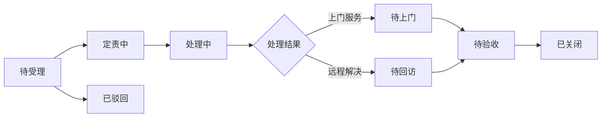
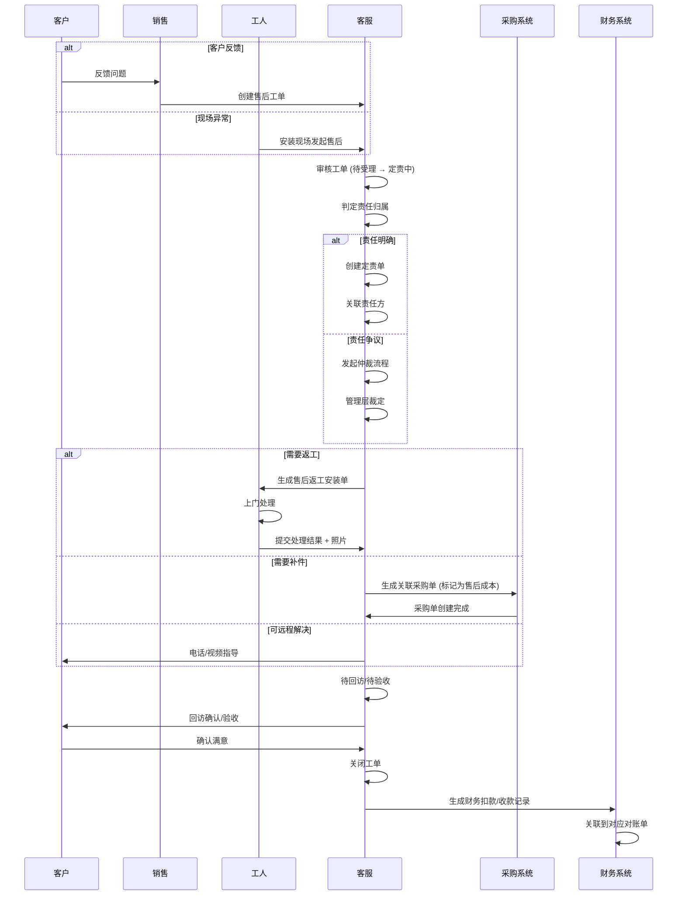

# 售后管理模块需求 (After-Sales / Ticket)

## 1. 模块概述 (Module Overview)

| 属性 | 说明 |
|:---|:---|
| **模块名称** | 售后管理 (After-Sales / Ticket) |
| **核心价值** | 记录售后诉求，判定责任归属，执行补件/返工，核算损益，追溯责任并结算成本 |
| **目标用户** | 客服、销售、工人、店长、派单员、财务 |
| **上游模块** | 订单、安装单 |
| **下游模块** | 对账单 (AR/AP 扣款)、采购单 (PO)、安装单 |

## 2. 业务场景 (Business Scenario)

订单交付完成 (COMPLETED) 后，客户可能遇到产品问题或需要后续服务。售后模块负责处理这些需求，确保服务闭环。

### 2.1 典型场景

1. **安装现场异常**：师傅安装时发现尺寸不对或产品瑕疵，现场发起售后。
2. **客户质保报修**：客户在使用过程中发现轨道卡顿、面料抽丝。
3. **物流损毁**：货物到达后包装破损导致产品受损。
4. **补件处理**：漏发配件或需要增加辅料。
5. **轨道/配件维修更换**
6. **窗帘布料清洗/更换**
7. **安装问题返工**
8. **客户投诉处理**

### 2.2 售后类型 (Type Enum)
| 类型 | 说明 | 典型处理方式 |
|:---|:---|:---|
| **REWORK** | 返工 | 需要师傅再次上门处理 |
| **REPLACEMENT** | 补件/换货 | 需要工厂重新生产并快递 |
| **REPAIR** | 维修 | 现场可修复 |
| **REFUND** | 退款 | 无法修复，协商退款 |
| **CLEAN** | 清洗 | 上门拆洗/自取送洗 |
| **COMPLAINT** | 投诉 | 沟通协调/赔偿 |
| **CONSULT** | 咨询 | 远程解答 |

## 3. 状态流转 (State Machine)



| 状态名 | 状态码 | 说明 | 触发动作 |
|:---|:---|:---|:---|
| **待受理** | `PENDING` | 工单刚创建，等待客服介入 | 客户/销售/师傅提交售后申请 |
| **定责中** | `INVESTIGATING` | 正在判定责任归属 | 客服点击"开始定责" |
| **处理中** | `PROCESSING` | 已下发补件采购单或返工安装单 | 定责完成后自动进入 |
| **待上门** | `PENDING_VISIT` | 需要安排工人上门 | 客服创建上门任务 |
| **待回访** | `PENDING_CALLBACK` | 问题已处理，等待确认满意度 | 处理完成 / 工人完成上门 |
| **待验收** | `PENDING_VERIFY` | 补件已发出或返工已完成，等待客户确认 | 上门完成或补件发出后自动进入 |
| **已关闭** | `CLOSED` | 售后流程结束 | 验收通过或协商一致后关闭 |
| **已驳回** | `REJECTED` | 非售后范围 (人为损坏/超保修期) | 客服驳回 (需填写原因) |

## 4. 核心字段 (Core Fields)

| 字段名 | 类型 | 说明 |
|:---|:---|:---|
| id | UUID | 主键 |
| ticket_no | String | 工单号 (SH2026xxxx / AS20260101001) |
| customer_id | UUID | 关联客户 |
| order_id | UUID | 关联原订单 |
| install_task_id | UUID | 关联触发售后的安装单 |
| type | Enum | 类型 (见 2.2) |
| priority | Enum | 优先级 (紧急/普通/低) |
| status | Enum | 状态 (见上表) |
| responsibility | Enum | 责任归属 (FACTORY/MEASURER/INSTALLER/LOGISTICS/CUSTOMER) |
| responsibility_subtype | Enum | 责任二级分类 (见 5.3.1) |
| description | Text | 问题描述 |
| photos | JSONB | 问题照片 |
| assigned_to | UUID | 处理人 (客服/工人) |
| solution | Text | 解决方案 |
| estimated_cost | Decimal | 预估售后成本 (材料+工费) |
| cost | Decimal | 实际售后成本 (材料费/人工费) |
| actual_deduction | Decimal | 最终扣款金额 (用于财务对账) |
| internal_loss | Decimal | 公司内部损失金额 (材料成本价+内勤人工费) |
| is_warranty | Boolean | 是否保修期内 |
| satisfaction | Integer | 客户满意度 (1-5 星) |
| channel_satisfaction | Integer | 渠道满意度 (1-5 星) |
| created_at | DateTime | 创建时间 |
| created_by | UUID | 发起人 (销售/师傅/客服) |
| closed_at | DateTime | 关闭时间 |
| sla_response_deadline | DateTime | 响应截止时间 |
| sla_visit_deadline | DateTime | 上门截止时间 |
| sla_closure_deadline | DateTime | 闭环截止时间 |

## 5. 业务规则 (Business Rules)

### 5.1 保修期判定
*   **默认保修**: 安装完成后 **12 个月** (可配置)
*   **判定依据**: `order.install_completed_at` + 保修期
*   **过保处理**: 过保售后需明确告知客户将产生费用

### 5.2 精准定责逻辑 (Responsibility Logic)

这是售后单最核心的部分，直接关联到财务结算：

#### 责任方类型
| 责任方 | 责任码 | 说明 | 示例 | 结算方式 |
|:---|:---|:---|:---|:---|
| **公司** | `COMPANY` | 销售/设计失误、承诺兑现 | 客户投诉、超出保修范围的善意补偿 | 内部成本核算 |
| **供应商/工厂** | `FACTORY` | 面料色差、尺寸做错、生产质量问题 | 布料瑕疵、电机故障 | 从供应商 `AP` 对账单扣款 |
| **安装师** | `INSTALLER` | 安装过程中损坏墙体或产品 | 打孔歪斜、轨道脱落 | 从安装师傅 `AP-Labor` 结算单扣除 |
| **测量师** | `MEASURER` | 由于测量数据错误导致的无法安装 | 尺寸偏差、遗漏窗户 | 扣除测量师对应的劳务费 |
| **物流** | `LOGISTICS` | 运输损坏 | 包装破损、产品变形 | 联系物流公司理赔 |
| **客户** | `CUSTOMER` | 客户自身原因 (需付费) | 人为损坏、改变主意 | 向客户收取费用，计入 `AR` 对账单 |

### 5.3 责任追溯与定责单 (Liability & Accountability)

售后问题需明确责任归属，并发送**定责单**给相关责任方确认，确保责任清晰、成本分摊有据可依。

#### 5.3.1 售后单与定责单的深度联动关系

定责单是售后模块的核心，它不仅记录责任判定结果，更是财务结算的依据。售后单与定责单之间存在严格的因果关系和执行逻辑：

##### 定责单的核心地位
*   **唯一性**：每个售后工单必须关联至少一张定责单，才能进入财务结算流程
*   **强制性**：售后工单关闭前，必须完成定责单的确认（CONFIRMED 或 ARBITRATED）
*   **可追溯**：定责单记录完整的责任判定过程，包括证据、异议、仲裁等

##### 售后单与定责单的因果关系
*   **售后单触发定责单**：当售后工单状态从"待受理"变为"定责中"时，客服必须创建定责单
*   **定责单驱动售后单**：定责单确认后，系统自动根据责任类型生成对应的处理单据（返工单/采购单）
*   **定责单锁定售后单**：定责单处于"待确认"状态时，售后工单无法关闭，必须等待定责单确认

##### 定责单的状态流转与自动确认逻辑
*   **待发送 (DRAFT)**：客服创建定责单，填写责任方、原因、成本明细等
*   **待确认 (PENDING_CONFIRM)**：客服点击"发送确认"，系统将定责单发送给责任方
*   **已确认 (CONFIRMED)**：
  - 责任方在24小时内主动确认
  - 或责任方在24小时内未响应，系统自动确认（Cron Job执行）
*   **有异议 (DISPUTED)**：责任方在24小时内提出异议，上传反驳证据
*   **已仲裁 (ARBITRATED)**：店长/管理员介入裁定，最终确定责任归属

##### 定责单确认后的自动扣款机制
*   **自动生成扣款记录**：定责单确认后，系统自动在 `AfterSalesCost` 表中生成扣款记录
*   **关联对账单**：扣款记录自动关联到责任方下一期的对账单中
*   **扣款金额锁定**：对账单生成时，自动扣除售后责任金额，显示"售后扣款"明细
*   **财务严谨性**：对账单导出时，售后扣款记录必须包含跳转回对应售后照片的超链接

##### 定责单的自动确认逻辑（Cron Job）
*   **触发条件**：定责单处于"待确认"状态超过24小时
*   **执行频率**：每小时执行一次
*   **执行逻辑**：
  ```typescript
  // 伪代码示例
  cron.schedule('0 * * * *', async () => {
    const pendingNotices = await db.liabilityNotices.findMany({
      where: {
        status: 'PENDING_CONFIRM',
        created_at: {
          lt: new Date(Date.now() - 24 * 60 * 60 * 1000) // 24小时前
        }
      }
    });
    
    for (const notice of pendingNotices) {
      await db.liabilityNotices.update({
        where: { id: notice.id },
        data: {
          status: 'CONFIRMED',
          confirmed_at: new Date(),
          confirmed_by: 'SYSTEM_AUTO',
          arbitration_result: '责任方逾期未确认，系统自动确认'
        }
      });
      
      // 自动生成扣款记录
      await financeService.createDeductionRecord(notice);
    }
  });
  ```

##### 异议处理机制
*   **线上举证**：责任方提出异议时，必须强制上传"反驳照片"和填写异议理由
*   **店长仲裁视图**：店长可在一个界面看到：`客服判责理由` vs `责任方申诉理由` + `原始订单全过程照片`
*   **证据链支持**：系统自动关联该订单的"量尺图、生产单、安装前/后对比图"作为仲裁参考
*   **信用参考**：在定责界面展示该供应商/师傅的"近90天售后率"，增强判定责任时的底气

##### 证据链支持
*   **环节溯源**：自动关联该订单的"量尺图、生产单、安装前/后对比图"
*   **环境记录**：记录师傅签到时的 GPS 位置和时间，证明其确实在现场发现了问题
*   **历史信用**：在定责界面展示该供应商/师傅的"近 90 天售后率"，增强客服判定责任时的底气

##### 信用记录展示
*   **近90天售后率**：在定责界面展示该供应商/师傅的"近90天售后率"
*   **历史定责记录**：展示该责任方近期的定责单记录，包括定责原因、金额、状态
*   **信用评分**：根据售后率、定责金额、异议率等指标计算信用评分

##### 定责后联动
*   **自动生成扣款记录**：定责单确认后，除了生成 `AfterSalesCost` 记录，自动在关联供应商的"质量评分"中减分
*   **供应商质量预警**：当某个供应商的售后定责金额占其供货额比例超过 X% 时，在采购模块自动将其标记为"慎用"，并触发供应链总监重新审厂
*   **工人质量预警**：当某个安装师/测量师的售后率超过10%时，自动触发预警，提醒店长关注

##### 成本分摊
*   **多方担责**：一个售后工单可关联 **多张定责单** (多方共同担责)
*   **分摊比例**：如 "供应商 70% + 安装师 30%"
*   **汇总校验**：工单关闭前系统校验 "各方分摊比例之和 = 100%"

##### 财务结算自动化联动
*   **自动锁定机制**：当一张定责单处于 `PENDING_CONFIRM`（待确认）时，对应供应商或师傅的下一次对账单应显示"有一笔售后处理中"，暂时冻结对应金额的结算
*   **自动抵扣机制**：一旦定责单状态变为 `CONFIRMED` 或 `ARBITRATED`，金额自动写入 `AP-对账单` 的"扣款项"
*   **财务钩子**：当定责单确认后，调用 `financeService` 自动在对应的 `ap_statements` 中生成 `DEDUCTION` 记录

#### 5.3.2 定责原因标准化库 (Standardized Reason Library)

定责单采用结构化标签，提高效率并支撑后期质量大数据分析：

| 责任方 | 一级分类 | 二级原因 | 判定依据建议 |
|:---|:---|:---|:---|
| **供应商/工厂** | 生产质量 | 面料抽丝、污渍、色差、织造瑕疵、工艺缺陷 | 完工照片对比原始样册 |
| | 尺寸偏差 | 宽度/高度不符、做错款式 | 安装单明细 vs 生产指令单 |
| | 物流损坏 | 包装破损、运输损坏、丢失配件 | 物流记录+现场照片 |
| **安装师** | 施工失误 | 打孔移位、轨道挂错、划伤墙面、安装损坏、遗漏配件 | 完工照片中的细节图 |
| | 交付态度 | 现场未打扫、客户投诉态度差 | 客户回访满意度 |
| **测量师** | 数据错误 | 漏测窗户、未考虑窗帘盒宽度、尺寸错误、测量遗漏、数据录入错误 | 原始量尺单 vs 现场安装反馈 |
| **公司** | 销售失误 | 承诺赠品未发、款式推荐错误、销售承诺、设计失误、服务流程 | 订单备注与客户沟通记录 |
| **客户** | 人为损坏 | 猫抓、洗涤不当、自行拆卸、使用不当、需求变更 | 师傅现场鉴定照片 |

#### 5.3.3 售后成本精算矩阵 (Cost Breakdown)

定责单需拆解成本，确保责任方对"赔多少"心服口服：

* **材料损耗费**：按商品的"标准采购价"计算，不含销售溢价
* **二次物流费**：补件产生的顺丰/物流费用
* **二次劳务费**：返工时需支付给师傅的额外上门补贴
* **渠道违约金**：如因质量问题导致装企对公司的罚款，需转嫁至责任方

#### 定责单 (Liability Notice)

##### 核心字段
| 字段名 | 类型 | 说明 |
|:---|:---|:---|
| id | UUID | 主键 |
| notice_no | String | 定责单号 (LN20260101001) |
| after_sales_id | UUID | 关联售后工单 |
| order_id | UUID | 关联原订单 |
| liable_party_type | Enum | 责任方类型 (company/factory/installer/measurer/logistics/customer) |
| liable_party_id | UUID | 责任方ID (供应商/工人ID) |
| liability_reason | Text | 定责原因描述 |
| liability_reason_category | Enum | 责任一级分类 (见 5.3.2) |
| liability_reason_subtype | Enum | 责任二级分类 (见 5.3.2) |
| cost_items | JSONB | 成本明细 (材料损耗费/二次物流费/二次劳务费/渠道违约金) |
| cost_amount | Decimal | 应承担总成本金额 |
| evidence_photos | JSONB | 证据照片 |
| linked_evidence | JSONB | 自动关联的证据链 (量尺图、生产单、安装前后对比图) |
| liable_party_credit | JSONB | 责任方近90天售后率等信用记录 |
| source_purchase_order_id | UUID | 关联导致故障的原始采购单 (溯源字段) |
| source_install_task_id | UUID | 关联导致故障的原始安装单 (溯源字段) |
| status | Enum | 状态 (DRAFT/PENDING_CONFIRM/CONFIRMED/DISPUTED/ARBITRATED) |
| created_at | DateTime | 创建时间 |
| confirmed_at | DateTime | 确认时间 |
| confirmed_by | UUID | 确认人 |
| dispute_reason | Text | 异议理由 (仅当状态为DISPUTED时填写) |
| dispute_evidence | JSONB | 异议证据照片 (仅当状态为DISPUTED时填写) |
| arbitration_result | Text | 仲裁结果 (仅当状态为ARBITRATED时填写) |
| arbitrated_by | UUID | 仲裁人 (仅当状态为ARBITRATED时填写) |
| arbitrated_at | DateTime | 仲裁时间 (仅当状态为ARBITRATED时填写)

#### 成本分摊 (Cost Allocation)
*   一个售后工单可关联 **多张定责单** (多方共同担责)
*   **分摊比例**: 如 "供应商 70% + 安装师 30%"
*   **汇总**: 工单关闭前系统校验 "各方分摊比例之和 = 100%"

### 5.4 联动处理机制

*   **自动派单**：若定责为"返工"，系统应能一键生成新的"安装单（类型：售后返工）"，并关联原安装师傅或指派新师傅。
*   **自动补单**：若定责为"补件"，系统应能生成关联的"采购单"，且该采购单的成本应标记为"售后成本"。

### 5.5 上门任务联动
*   售后工单可创建关联的 **上门服务任务**
*   复用安装单的派单逻辑 (派单员调度 / 工人接单)
*   工人完成后上传处理照片，驱动工单状态

### 5.6 财务结算自动化联动

#### 5.6.1 自动锁定机制
*   当一张定责单处于 `PENDING_CONFIRM`（待确认）时，对应供应商或师傅的下一次对账单应显示"有一笔售后处理中"，暂时冻结对应金额的结算
*   冻结金额随定责单状态变化自动调整

#### 5.6.2 自动抵扣机制
*   一旦定责单状态变为 `CONFIRMED` 或 `ARBITRATED`，金额自动写入 `AP-对账单` 的"扣款项"
*   售后单确认 `CLOSED` 后，系统必须在对应的对账模块生成 **Deduction (扣款)** 记录
*   **公式**：`最终发放金额 = 原应付金额 - 售后扣款金额`
*   当售后单状态变为 `CLOSED` 且 `actual_deduction > 0` 时，自动在 `ap_statement_items` 中增加一条 `is_deduction = true` 的记录
*   财务钩子：当定责单确认后，调用 `financeService` 自动在对应的 `ap_statements` 中生成 `DEDUCTION` 记录

#### 5.6.3 扣款风控规则 (Deduction Safety)

自动扣款逻辑需考虑"扣款金额 > 待结算金额"的极端情况，避免负数结算单引发财务系统异常。

##### 5.6.3.1 风控场景

当定责单确认后，系统需要从责任方的待结算金额中扣除售后责任金额。但在某些极端情况下，可能出现：

- **场景一**：责任方（供应商/师傅）的待结算金额不足以覆盖售后扣款金额
- **场景二**：同一责任方在同一结算周期内有多笔售后扣款，累计超过待结算金额
- **场景三**：责任方已离职或终止合作，待结算金额为0，但仍有售后责任未结算

##### 5.6.3.2 风控处理逻辑

当 `Deduction > PendingPayment` 时，系统执行以下风控逻辑：

**动作 1：扣光当前待结算金额**
- 将当前对账单的待结算金额全部扣除
- 对账单金额置为 0
- 生成扣款记录，标记为"部分扣款"

**动作 2：生成欠款记录**
- 剩余欠款生成一笔 `DEBT` (欠款) 类型的负向单据
- 记入该供应商/师傅的**欠款账本**
- 在未来结算中优先抵扣

##### 5.6.3.3 欠款账本设计

**欠款账本数据结构**：
```typescript
interface DebtLedger {
  id: string;
  debt_no: string;                    // 欠款单号 (DT20260101001)
  liable_party_type: string;          // 责任方类型 (supplier/installer/measurer)
  liable_party_id: string;             // 责任方ID
  original_after_sales_id: string;     // 原始售后工单ID
  original_liability_notice_id: string; // 原始定责单ID
  original_deduction_amount: number;   // 原始扣款金额
  actual_deducted_amount: number;      // 实际扣款金额
  remaining_debt: number;              // 剩余欠款金额
  debt_status: 'ACTIVE' | 'PARTIALLY_SETTLED' | 'FULLY_SETTLED'; // 欠款状态
  created_at: Date;
  settled_at?: Date;
}
```

**欠款账本字段说明**：
| 字段名 | 类型 | 说明 |
|:---|:---|:---|
| debt_no | String | 欠款单号，唯一标识 |
| liable_party_type | Enum | 责任方类型 (supplier/installer/measurer) |
| liable_party_id | UUID | 责任方ID (供应商/工人ID) |
| original_after_sales_id | UUID | 原始售后工单ID，用于溯源 |
| original_liability_notice_id | UUID | 原始定责单ID，用于溯源 |
| original_deduction_amount | Decimal | 原始扣款金额 |
| actual_deducted_amount | Decimal | 实际扣款金额 |
| remaining_debt | Decimal | 剩余欠款金额 = original_deduction_amount - actual_deducted_amount |
| debt_status | Enum | 欠款状态 (ACTIVE/PARTIALLY_SETTLED/FULLY_SETTLED) |
| created_at | DateTime | 欠款创建时间 |
| settled_at | DateTime | 欠款结清时间 |

##### 5.6.3.4 欠款抵扣逻辑

当责任方有新的待结算金额时，系统自动优先抵扣欠款：

**抵扣规则**：
1. **优先级**：欠款抵扣 > 正常结算
2. **抵扣顺序**：按欠款创建时间，先抵扣最早的欠款
3. **部分抵扣**：如果待结算金额不足以抵扣所有欠款，按比例抵扣
4. **结清标记**：当某笔欠款的 remaining_debt = 0 时，标记为 `FULLY_SETTLED`

**伪代码示例**：
```typescript
async function processSettlementWithDebt(
  liablePartyId: string,
  settlementAmount: number
): Promise<SettlementResult> {
  // 1. 查询该责任方的所有未结清欠款
  const activeDebts = await db.debtLedger.findMany({
    where: {
      liable_party_id: liablePartyId,
      debt_status: 'ACTIVE'
    },
    orderBy: {
      created_at: 'asc' // 按创建时间升序，优先抵扣最早的欠款
    }
  });
  
  let remainingAmount = settlementAmount;
  const deductionRecords = [];
  
  // 2. 逐笔抵扣欠款
  for (const debt of activeDebts) {
    if (remainingAmount <= 0) break;
    
    const deductionAmount = Math.min(remainingAmount, debt.remaining_debt);
    
    // 3. 更新欠款账本
    await db.debtLedger.update({
      where: { id: debt.id },
      data: {
        actual_deducted_amount: debt.actual_deducted_amount + deductionAmount,
        remaining_debt: debt.remaining_debt - deductionAmount,
        debt_status: (debt.remaining_debt - deductionAmount) === 0 
          ? 'FULLY_SETTLED' 
          : 'PARTIALLY_SETTLED',
        settled_at: (debt.remaining_debt - deductionAmount) === 0 
          ? new Date() 
          : debt.settled_at
      }
    });
    
    // 4. 生成扣款记录
    deductionRecords.push({
      debt_id: debt.id,
      amount: deductionAmount,
      type: 'DEBT_DEDUCTION'
    });
    
    remainingAmount -= deductionAmount;
  }
  
  // 5. 剩余金额用于正常结算
  const normalSettlementAmount = Math.max(0, remainingAmount);
  
  return {
    deductionRecords,
    normalSettlementAmount,
    totalDebtDeducted: settlementAmount - normalSettlementAmount
  };
}
```

##### 5.6.3.5 欠款账本展示

在供应商/师傅的对账单详情页，展示欠款账本信息：

**欠款账本卡片**：
```
┌─────────────────────────────────────────────────────────────┐
│ 欠款账本                                                      │
├─────────────────────────────────────────────────────────────┤
│ 总欠款金额：¥ 5,000.00                                       │
│ 已抵扣金额：¥ 2,000.00                                       │
│ 剩余欠款：¥ 3,000.00                                         │
├─────────────────────────────────────────────────────────────┤
│ 欠款明细：                                                    │
│ ┌─────────────────────────────────────────────────────────┐ │
│ │ 欠款单号：DT20260101001                                   │ │
│ │ 原始售后工单：SH20260101001                              │ │
│ │ 原始扣款金额：¥ 3,000.00                                 │ │
│ │ 已抵扣金额：¥ 2,000.00                                   │ │
│ │ 剩余欠款：¥ 1,000.00                                     │ │
│ │ 欠款状态：部分已结清                                      │ │
│ │ 创建时间：2026-01-01                                     │ │
│ └─────────────────────────────────────────────────────────┘ │
│ ┌─────────────────────────────────────────────────────────┐ │
│ │ 欠款单号：DT20260101002                                   │ │
│ │ 原始售后工单：SH20260101005                              │ │
│ │ 原始扣款金额：¥ 2,000.00                                 │ │
│ │ 已抵扣金额：¥ 0.00                                       │ │
│ │ 剩余欠款：¥ 2,000.00                                     │ │
│ │ 欠款状态：未结清                                          │ │
│ │ 创建时间：2026-01-05                                     │ │
│ └─────────────────────────────────────────────────────────┘ │
└─────────────────────────────────────────────────────────────┘
```

##### 5.6.3.6 欠款预警机制

当责任方的欠款金额超过阈值时，系统自动预警：

**预警规则**：
- **一级预警**：欠款金额 > ¥ 1,000
- **二级预警**：欠款金额 > ¥ 5,000
- **三级预警**：欠款金额 > ¥ 10,000

**预警通知**：
- **通知对象**：店长、财务、采购（针对供应商）
- **通知渠道**：系统通知 + 飞书/企业微信
- **通知内容**：
  ```
  【欠款预警】责任方：XXX供应商
  欠款金额：¥ 5,000.00
  欠款笔数：2笔
  请关注该责任方的合作状态和结算情况
  ```

##### 5.6.3.7 欠款处理建议

针对不同欠款情况，系统提供处理建议：

| 欠款情况 | 建议措施 |
|:---|:---|
| 欠款金额 < ¥ 1,000 | 继续合作，在下一次结算中优先抵扣 |
| 欠款金额 ¥ 1,000 - ¥ 5,000 | 暂停新订单，待欠款结清后恢复 |
| 欠款金额 > ¥ 5,000 | 暂停合作，启动法律追偿程序 |
| 欠款时间 > 90 天 | 列入黑名单，永久终止合作 |

### 5.7 SLA 监控与预警机制

#### 5.7.1 SLA 计时器
*   在工单详情页增加"时效倒计时"，显示距离响应、上门、闭环截止时间的剩余时间
*   SLA 规则可配置，例如：圣都要求售后 24 小时响应，48 小时上门
*   在 `AfterSalesList` 界面，根据 `priority` 和 `created_at` 实时计算距离超时还有多久，并用不同颜色的进度条展示

#### 5.7.2 红黄牌预警
*   若工单在 `PENDING` 状态超过 4 小时未受理，自动给店长发微信小程序提醒
*   根据不同优先级和状态，设置不同的预警阈值
*   预警信息同步到系统通知和飞书/企业微信

### 5.8 售后成本池与利润修正

#### 5.8.1 售后成本池与会计科目映射

##### 5.8.1.1 售后成本池定义

售后成本池用于记录所有售后相关支出，即使责任方为"公司"，也应虚拟化一个金额（如材料成本价+内勤人工费），记入"售后损耗科目"。

**成本池构成**：
- **材料损耗费**：按商品的"标准采购价"计算，不含销售溢价
- **二次物流费**：补件产生的顺丰/物流费用
- **二次劳务费**：返工时需支付给师傅的额外上门补贴
- **内勤人工费**：客服、店长处理售后的人工成本
- **渠道违约金**：如因质量问题导致装企对公司的罚款

##### 5.8.1.2 公司责任成本的会计科目映射

"公司责任"的售后成本，不产生实际资金流出（不付给供应商），但在 **损益表 (P&L)** 中应记入 `Cost of Goods Sold (COGS) - After Sales Loss` 科目，从而真实降低"销售毛利"。

**会计科目映射表**：

| 成本类型 | 责任方 | 会计科目 | 科目代码 | 说明 |
|:---|:---|:---|:---|:---|
| **材料损耗费** | 公司 | COGS - After Sales Loss - Material | 6001.01 | 公司承担的材料成本 |
| **二次物流费** | 公司 | COGS - After Sales Loss - Logistics | 6001.02 | 公司承担的物流费用 |
| **二次劳务费** | 公司 | COGS - After Sales Loss - Labor | 6001.03 | 公司承担的人工费用 |
| **内勤人工费** | 公司 | COGS - After Sales Loss - Admin | 6001.04 | 客服、店长处理售后的成本 |
| **渠道违约金** | 公司 | COGS - After Sales Loss - Penalty | 6001.05 | 公司承担的违约金 |
| **材料损耗费** | 供应商 | COGS - Material | 6002 | 从供应商扣款，不计入公司成本 |
| **二次劳务费** | 安装师 | COGS - Labor | 6003 | 从师傅扣款，不计入公司成本 |

##### 5.8.1.3 虚拟成本核算逻辑

当售后责任方为"公司"时，系统执行以下虚拟成本核算逻辑：

**核算步骤**：
1. **成本计算**：根据售后类型和解决方案，计算各项成本
   - 材料损耗费 = 商品标准采购价 × 数量
   - 二次物流费 = 实际物流费用
   - 二次劳务费 = 师傅上门补贴标准
   - 内勤人工费 = 处理工时 × 内勤时薪

2. **虚拟记账**：在财务系统中生成虚拟凭证
   - 借：COGS - After Sales Loss (6001)
   - 贷：Inventory (原材料) / Wages Payable (应付工资)
   - 备注：售后工单 #SH20260101001，责任方：公司

3. **利润修正**：在订单利润报表中，自动扣除该虚拟成本
   - 原订单毛利 = 销售收入 - 销售成本
   - 修正后毛利 = 原订单毛利 - 售后虚拟成本

**伪代码示例**：
```typescript
async function calculateVirtualCompanyCost(afterSalesId: string): Promise<VirtualCost> {
  const afterSales = await getAfterSales(afterSalesId);
  
  // 1. 计算各项成本
  const materialCost = await calculateMaterialCost(afterSales);
  const logisticsCost = await calculateLogisticsCost(afterSales);
  const laborCost = await calculateLaborCost(afterSales);
  const adminCost = await calculateAdminCost(afterSales);
  
  const totalVirtualCost = materialCost + logisticsCost + laborCost + adminCost;
  
  // 2. 生成虚拟凭证
  const voucher = await financeService.createVirtualVoucher({
    date: new Date(),
    description: `售后工单 #${afterSales.ticketNo}，责任方：公司`,
    items: [
      {
        account_code: '6001.01',
        account_name: 'COGS - After Sales Loss - Material',
        debit_amount: materialCost,
        credit_amount: 0
      },
      {
        account_code: '6001.02',
        account_name: 'COGS - After Sales Loss - Logistics',
        debit_amount: logisticsCost,
        credit_amount: 0
      },
      {
        account_code: '6001.03',
        account_name: 'COGS - After Sales Loss - Labor',
        debit_amount: laborCost,
        credit_amount: 0
      },
      {
        account_code: '6001.04',
        account_name: 'COGS - After Sales Loss - Admin',
        debit_amount: adminCost,
        credit_amount: 0
      },
      {
        account_code: '1401',
        account_name: 'Inventory',
        debit_amount: 0,
        credit_amount: materialCost
      },
      {
        account_code: '2201',
        account_name: 'Wages Payable',
        debit_amount: 0,
        credit_amount: laborCost + adminCost
      }
    ]
  });
  
  // 3. 更新售后工单
  await updateAfterSales(afterSalesId, {
    internal_loss: totalVirtualCost,
    virtual_voucher_id: voucher.id
  });
  
  // 4. 修正订单利润
  await adjustOrderProfit(afterSales.order_id, totalVirtualCost);
  
  return {
    materialCost,
    logisticsCost,
    laborCost,
    adminCost,
    totalVirtualCost,
    voucherId: voucher.id
  };
}
```

##### 5.8.1.4 损益表影响分析

公司责任的售后成本对损益表的影响：

**损益表结构**：
```
┌─────────────────────────────────────────────────────────────┐
│ 损益表 (Profit & Loss Statement)                             │
├─────────────────────────────────────────────────────────────┤
│ 销售收入 (Revenue)                        ¥ 100,000.00      │
│ 减：销售成本 (COGS)                      ¥ 60,000.00       │
│   - 材料成本 (Material)                  ¥ 50,000.00       │
│   - 人工成本 (Labor)                      ¥ 10,000.00       │
│ 减：售后损耗 (After Sales Loss)           ¥ 5,000.00        │
│   - 材料损耗 (Material)                   ¥ 2,000.00        │
│   - 物流损耗 (Logistics)                  ¥ 500.00          │
│   - 人工损耗 (Labor)                      ¥ 1,500.00        │
│   - 内勤损耗 (Admin)                      ¥ 1,000.00        │
│ ─────────────────────────────────────────────────────────── │
│ 销售毛利 (Gross Profit)                   ¥ 35,000.00       │
├─────────────────────────────────────────────────────────────┤
│ 减：运营费用 (Operating Expenses)          ¥ 20,000.00       │
│ ─────────────────────────────────────────────────────────── │
│ 营业利润 (Operating Profit)               ¥ 15,000.00       │
└─────────────────────────────────────────────────────────────┘
```

**影响分析**：
- **销售毛利降低**：售后损耗直接从销售毛利中扣除，真实反映订单盈利能力
- **成本透明化**：将售后成本单独列示，便于管理层分析售后损耗占比
- **决策支持**：通过售后损耗数据，优化产品质量和服务流程

##### 5.8.1.5 售后成本分析报表

系统提供多维度的售后成本分析报表：

**报表维度**：
- **按责任方**：公司 vs 供应商 vs 安装师 vs 测量师
- **按成本类型**：材料损耗 vs 物流损耗 vs 人工损耗 vs 内勤损耗
- **按售后类型**：返工 vs 补件 vs 维修 vs 投诉
- **按时间周期**：日/周/月/季/年
- **按订单/客户/销售/供应商**：多维度交叉分析

**报表指标**：
- **售后成本总额**：指定周期内的售后成本总和
- **售后成本率**：售后成本 / 销售收入
- **售后损耗占比**：公司责任售后成本 / 总售后成本
- **单均售后成本**：售后成本 / 售后工单数
- **售后成本趋势**：按时间周期展示售后成本变化趋势

**报表展示**：
```
┌─────────────────────────────────────────────────────────────┐
│ 售后成本分析报表 (2026年1月)                                  │
├─────────────────────────────────────────────────────────────┤
│ 总售后成本：¥ 50,000.00                                      │
│ 售后成本率：5.00%                                             │
│ 售后工单数：100单                                             │
│ 单均售后成本：¥ 500.00                                        │
├─────────────────────────────────────────────────────────────┤
│ 按责任方分析：                                                 │
│ ┌─────────────────────────────────────────────────────────┐ │
│ │ 责任方     │ 成本金额   │ 占比     │ 工单数  │ 单均成本  │ │
│ ├─────────────────────────────────────────────────────────┤ │
│ │ 公司       │ ¥ 20,000.00│ 40.00%   │ 30      │ ¥ 666.67 │ │
│ │ 供应商     │ ¥ 15,000.00│ 30.00%   │ 40      │ ¥ 375.00 │ │
│ │ 安装师     │ ¥ 10,000.00│ 20.00%   │ 20      │ ¥ 500.00 │ │
│ │ 测量师     │ ¥ 5,000.00 │ 10.00%   │ 10      │ ¥ 500.00 │ │
│ └─────────────────────────────────────────────────────────┘ │
├─────────────────────────────────────────────────────────────┤
│ 按成本类型分析：                                               │
│ ┌─────────────────────────────────────────────────────────┐ │
│ │ 成本类型   │ 成本金额   │ 占比     │                           │ │
│ ├─────────────────────────────────────────────────────────┤ │
│ │ 材料损耗   │ ¥ 25,000.00│ 50.00%   │                           │ │
│ │ 人工损耗   │ ¥ 15,000.00│ 30.00%   │                           │ │
│ │ 物流损耗   │ ¥ 5,000.00 │ 10.00%   │                           │ │
│ │ 内勤损耗   │ ¥ 5,000.00 │ 10.00%   │                           │ │
│ └─────────────────────────────────────────────────────────┘ │
├─────────────────────────────────────────────────────────────┤
│ 按售后类型分析：                                               │
│ ┌─────────────────────────────────────────────────────────┐ │
│ │ 售后类型   │ 成本金额   │ 占比     │ 工单数  │ 单均成本  │ │ │
│ ├─────────────────────────────────────────────────────────┤ │
│ │ 返工       │ ¥ 20,000.00│ 40.00%   │ 20      │ ¥ 1,000.00│ │
│ │ 补件       │ ¥ 15,000.00│ 30.00%   │ 50      │ ¥ 300.00 │ │
│ │ 维修       │ ¥ 10,000.00│ 20.00%   │ 20      │ ¥ 500.00 │ │
│ │ 投诉       │ ¥ 5,000.00 │ 10.00%   │ 10      │ ¥ 500.00 │ │
│ └─────────────────────────────────────────────────────────┘ │
└─────────────────────────────────────────────────────────────┘
```

##### 5.8.1.6 售后成本预警

当售后成本超过阈值时，系统自动预警：

**预警规则**：
- **月度预警**：月度售后成本 > 月度销售收入的 5%
- **供应商预警**：某供应商的售后成本 > 其供货额的 3%
- **师傅预警**：某师傅的售后成本 > 其劳务收入的 10%

**预警通知**：
- **通知对象**：店长、财务、采购（针对供应商）
- **通知渠道**：系统通知 + 飞书/企业微信
- **通知内容**：
  ```
  【售后成本预警】2026年1月
  月度售后成本：¥ 50,000.00
  月度销售收入：¥ 1,000,000.00
  售后成本率：5.00%
  预警阈值：5.00%
  请关注售后成本控制
  ```

#### 5.8.2 利润修正
*   在数据报表中，原订单的"实际毛利"应自动扣除该关联售后单的实际支出成本
*   让管理者看清：某些订单虽然成交金额大，但因为频繁售后，实际是亏损的
*   支持按订单、客户、销售、供应商等维度分析售后成本对利润的影响

### 5.9 关联查询
*   在安装单详情页，需要能展示该单据关联的所有售后记录，方便销售进行验收判断

### 5.10 渠道满意度管理
*   在回访环节，除了客户评价，增加"渠道评价"维度
*   支持通过小程序分发渠道满意度调研
*   渠道满意度数据纳入售后数据分析

## 6. 处理流程 (Workflow)



### 6.1 评价通知机制 (Feedback Notification)

售后工单关闭后，系统自动触发客户满意度评价流程，形成服务闭环，持续提升服务质量。

#### 6.1.1 评价触发时机

- **触发条件**：售后工单状态从 `PENDING_VERIFY` 变为 `CLOSED`
- **触发方式**：系统自动发送评价邀请
- **触发延迟**：工单关闭后 1 小时内发送（避免打扰客户）

#### 6.1.2 评价通知渠道

系统支持多种通知渠道，确保客户能够方便地完成评价：

| 渠道 | 适用场景 | 说明 |
|:---|:---|:---|
| **短信** | 所有客户 | 发送评价链接，无需登录 |
| **微信模板消息** | 已关注公众号的客户 | 直接在微信内完成评价 |
| **小程序通知** | 已授权小程序的客户 | 跳转至小程序评价页面 |
| **系统通知** | 内部客户 | 系统内弹窗提示评价 |

#### 6.1.3 H5 评价页面设计

评价页面采用极简设计，无需登录，客户可直接完成评价：

**页面布局**：
```
┌─────────────────────────────────────────────────────────────┐
│ 售后服务评价                                                  │
├─────────────────────────────────────────────────────────────┤
│ 工单号：SH20260101001                                        │
│ 服务类型：上门维修                                            │
├─────────────────────────────────────────────────────────────┤
│ 1. 服务态度评分                                               │
│ ★★★★★ (1-5星)                                               │
│ [☆] [☆] [☆] [☆] [☆]                                         │
├─────────────────────────────────────────────────────────────┤
│ 2. 解决速度评分                                               │
│ ★★★★★ (1-5星)                                               │
│ [☆] [☆] [☆] [☆] [☆]                                         │
├─────────────────────────────────────────────────────────────┤
│ 3. 您对我们的服务满意吗？                                     │
│ ○ 非常满意  ○ 满意  ○ 一般  ○ 不满意  ○ 非常不满意            │
├─────────────────────────────────────────────────────────────┤
│ 4. 您的建议或意见（选填）                                     │
│ [文本框：请输入您的建议或意见]                                 │
├─────────────────────────────────────────────────────────────┤
│ [提交评价]                                                    │
└─────────────────────────────────────────────────────────────┘
```

**评价字段**：
- **服务态度评分**：1-5 星，必填
- **解决速度评分**：1-5 星，必填
- **整体满意度**：非常满意/满意/一般/不满意/非常不满意，必填
- **文字建议**：客户填写，选填

#### 6.1.4 评价链接生成

评价链接采用一次性 Token 机制，确保安全性：

**链接格式**：
```
https://your-domain.com/after-sales/feedback/{after_sales_id}/{token}
```

**Token 生成规则**：
- Token 有效期：7 天
- Token 使用限制：每个工单的 Token 只能使用一次
- Token 生成方式：使用工单 ID + 时间戳 + 密钥生成 MD5 哈希

**伪代码示例**：
```typescript
function generateFeedbackToken(afterSalesId: string): string {
  const timestamp = Date.now();
  const secret = process.env.FEEDBACK_TOKEN_SECRET;
  const data = `${afterSalesId}:${timestamp}`;
  const token = crypto.createHash('md5').update(data + secret).digest('hex');
  return `${token}:${timestamp}`;
}

function validateFeedbackToken(afterSalesId: string, tokenWithTimestamp: string): boolean {
  const [token, timestamp] = tokenWithTimestamp.split(':');
  const secret = process.env.FEEDBACK_TOKEN_SECRET;
  const data = `${afterSalesId}:${timestamp}`;
  const expectedToken = crypto.createHash('md5').update(data + secret).digest('hex');
  
  // 验证 Token 是否正确
  if (token !== expectedToken) {
    return false;
  }
  
  // 验证 Token 是否过期（7天）
  const tokenAge = Date.now() - parseInt(timestamp);
  if (tokenAge > 7 * 24 * 60 * 60 * 1000) {
    return false;
  }
  
  return true;
}
```

#### 6.1.5 评价数据存储

评价数据存储在售后工单表中：

| 字段名 | 类型 | 说明 |
|:---|:---|:---|
| satisfaction | Integer | 客户满意度 (1-5 星) |
| service_attitude_score | Integer | 服务态度评分 (1-5 星) |
| solution_speed_score | Integer | 解决速度评分 (1-5 星) |
| overall_satisfaction | Enum | 整体满意度 (VERY_SATISFIED/SATISFIED/AVERAGE/DISSATISFIED/VERY_DISSATISFIED) |
| feedback_text | Text | 客户文字建议 |
| feedback_submitted_at | DateTime | 评价提交时间 |
| feedback_channel | Enum | 评价渠道 (SMS/WECHAT/MINIPROGRAM/SYSTEM) |

#### 6.1.6 评价提醒机制

如果客户在收到评价邀请后 3 天内未完成评价，系统发送提醒：

**提醒规则**：
- **第一次提醒**：评价邀请发送后 3 天未评价
- **第二次提醒**：第一次提醒后 3 天仍未评价
- **放弃提醒**：第二次提醒后 7 天仍未评价，系统自动标记为"未评价"

**提醒内容**：
```
【XX窗帘】尊敬的客户，您之前的售后服务工单 #SH20260101001 已完成，
我们非常重视您的意见，请您花 1 分钟时间完成服务评价：
https://your-domain.com/after-sales/feedback/xxx/xxx
```

#### 6.1.7 评价数据分析

系统自动统计和分析评价数据，为管理层提供决策支持：

**统计维度**：
- **整体满意度**：统计各满意度等级的占比
- **平均评分**：计算服务态度和解决速度的平均评分
- **评价完成率**：已评价工单 / 总关闭工单
- **文字建议汇总**：汇总客户的文字建议，便于改进服务

**报表展示**：
- **满意度趋势图**：按月展示满意度变化趋势
- **责任方满意度对比**：对比不同责任方的满意度
- **低分预警**：当满意度低于 3 星时，自动预警提醒店长关注

#### 6.1.8 评价闭环管理

当客户提交低分评价（1-2 星）时，系统自动触发闭环管理：

**闭环流程**：
1. **自动预警**：系统自动给店长发送低分评价预警
2. **回访跟进**：店长安排客服回访客户，了解具体问题
3. **问题整改**：根据客户反馈，制定整改措施
4. **再次评价**：整改完成后，邀请客户再次评价
5. **闭环记录**：记录整个闭环过程，便于后续分析

**闭环数据结构**：
```typescript
interface FeedbackLoop {
  id: string;
  after_sales_id: string;
  original_feedback_id: string;
  original_score: number;
  loop_status: 'PENDING' | 'IN_PROGRESS' | 'COMPLETED';
  follow_up_action: string;
  follow_up_by: string;
  follow_up_at: Date;
  improvement_measures: string;
  re_evaluation_score?: number;
  re_evaluation_at?: Date;
}
```

#### 6.1.9 评价通知配置

管理员可在系统配置中自定义评价通知规则：

**配置项**：
- **评价触发延迟**：工单关闭后多久发送评价邀请（默认 1 小时）
- **评价有效期**：评价链接的有效期（默认 7 天）
- **提醒次数**：最多发送几次提醒（默认 2 次）
- **提醒间隔**：提醒之间的间隔时间（默认 3 天）
- **低分预警阈值**：低于多少分触发低分预警（默认 3 星）

**配置界面**：
```
┌─────────────────────────────────────────────────────────────┐
│ 评价通知配置                                                  │
├─────────────────────────────────────────────────────────────┤
│ 评价触发延迟：[1] 小时                                        │
│ 评价有效期：[7] 天                                           │
│ 提醒次数：[2] 次                                             │
│ 提醒间隔：[3] 天                                             │
│ 低分预警阈值：[3] 星                                         │
├─────────────────────────────────────────────────────────────┤
│ [保存配置]                                                    │
└─────────────────────────────────────────────────────────────┘
```

## 7. 财务联动 (Finance Integration)

售后成本需计入对账单，支持多方结算。

### 7.1 结算规则

| 责任方类型 | 责任码 | 结算方式 | 对账单类型 |
|:---|:---|:---|:---|
| **公司** | `COMPANY` | 内部成本核算 | 不计入对账，计入售后成本报表 |
| **供应商/工厂** | `FACTORY` | 从应付款中扣减 | AP-供应商对账单 (扣款项) |
| **安装师** | `INSTALLER` | 从劳务结算中扣减 | AP-劳务结算单 (扣款项) |
| **测量师** | `MEASURER` | 从劳务结算中扣减 | AP-劳务结算单 (扣款项) |
| **物流** | `LOGISTICS` | 联系物流公司理赔 | 外部理赔流程 |
| **客户** | `CUSTOMER` | 向客户收取费用 | AR-客户对账单 (应收售后费) |

### 7.2 触发时机
*   售后工单 **已关闭 (CLOSED)** 且 定责单 **已确认 (CONFIRMED)** 后
*   系统自动生成对应的财务扣款/收款记录
*   当售后单状态变为 `CLOSED` 且 `actual_deduction > 0` 时，自动在 `ap_statement_items` 中增加一条 `is_deduction = true` 的记录
*   关联到责任方下一期的对账单中

### 7.3 数据结构 (Schema)
```typescript
// 售后成本结算记录
interface AfterSalesCost {
  id: string;
  after_sales_id: string;           // 关联售后工单
  liability_notice_id: string;      // 关联定责单
  liable_party_type: LiablePartyType;
  liable_party_id: string;
  cost_amount: number;              // 应承担金额
  actual_deduction: number;         // 最终扣款金额
  settlement_type: 'deduct' | 'charge';  // 扣款 / 收款
  target_statement_id?: string;     // 关联对账单 (结算后填入)
  settled_at?: DateTime;
}
```

### 7.4 对账单展示
*   **供应商对账单**: 新增"售后扣款"项，明细可点击查看关联的定责单
*   **劳务结算单**: 工人提成中扣除售后责任金额，显示"售后扣款"明细
*   **客户对账单**: 若客户责任，新增"售后服务费"应收项
*   **财务严谨性**: 售后扣款记录 (`is_deduction = true`) 在对账单导出时，必须有跳转回对应售后照片的超链接，方便责任方核实

## 8. 数据报表支撑

### 8.1 售后仪表盘指标
*   **工单量**: 按日/周/月统计新建工单数
*   **解决率**: 已关闭工单 / 总工单
*   **平均处理时长**: AVG(closed_at - created_at)
*   **满意度**: AVG(satisfaction)
*   **重复工单率**: 同一订单多次售后的比例
*   **售后率**: 各安装师/测量师的售后率，超过10%进行预警

### 8.2 质量分析
*   **按类型分布**: 返工/补件/维修/退款/投诉占比
*   **按供应商**: 各供应商关联的售后工单数及成本
*   **按工人**: 各安装师关联的售后工单数 (质量排名)及扣款金额
*   **按责任方**: 各责任方承担的售后成本金额排序

### 8.3 定责分析
*   **责任归属分布**: 公司/供应商/工人/测量师/物流/客户占比
*   **责任成本排名**: 各供应商/工人/测量师承担的售后成本金额排序
*   **异议率**: 定责单异议比例，识别争议频发的责任方
*   **仲裁率**: 需要管理层仲裁的定责单比例

### 8.4 财务分析
*   **售后成本汇总**: 按时间/类型/责任方统计售后成本
*   **扣款明细**: 各责任方的扣款记录及金额
*   **损益分析**: 售后成本对利润的影响


## 9. 界面设计 (UI Design)

### 9.1 列表页 (After-Sales List)

#### 展示字段
| 字段 | 宽度 | 说明 |
|:---|:---|:---|
| 工单号 | 130px | 可点击跳转 |
| 客户 | 100px | 姓名+电话 |
| 类型 | 80px | 返工/补件/维修/退款/投诉等 |
| 责任方 | 80px | 工厂/安装师/测量师/物流/客户等 |
| 优先级 | 60px | 标签 (红/橙/灰) |
| 状态 | 80px | 状态标签 |
| 处理人 | 80px | - |
| 创建时间 | 130px | - |
| 操作 | 150px | 按钮组 |

#### 筛选条件
| 筛选项 | 组件 | 说明 |
|:---|:---|:---|
| 时间范围 | `DateRangePicker` | 创建时间 |
| 状态 | `Select` | 全部状态 |
| 类型 | `Select` | 返工/补件/维修/退款/投诉等 |
| 责任方 | `Select` | 工厂/安装师/测量师/物流/客户等 |
| 优先级 | `Select` | 紧急/普通/低 |
| 处理人 | `Select` | - |

#### 操作按钮
| 按钮 | 条件 | 说明 |
|:---|:---|:---|
| **新建工单** | 顶部主按钮 | - |
| **开始处理** | 待受理 | 开始处理 |
| **创建定责单** | 定责中 | 创建定责单 |
| **创建上门** | 处理中 | 创建上门任务 |
| **生成采购单** | 处理中 | 生成售后补件采购单 |
| **生成返工单** | 处理中 | 生成售后返工安装单 |
| **回访确认** | 待回访 | 确认客户满意 |
| **验收确认** | 待验收 | 确认客户验收通过 |
| **驳回** | 待受理 | 驳回工单 |

### 9.2 详情页 (After-Sales Detail)

#### 页面布局
```
┌─────────────────────────────────────────────────────────────────┐
│ 售后工单 #SH2026xxxx        [创建上门] [创建定责] [生成采购单]│
├──────────────────────┬──────────────────────────────────────────┤
│ 客户信息             │ 状态进度条 + SLA 计时器                │
│ 姓名/电话/地址       │ [待受理→定责中→处理中→待上门/待回访→待验收→已关闭] │
│                      │ 响应剩余: XX:XX:XX / 上门剩余: XX:XX:XX │
├──────────────────────┼──────────────────────────────────────────┤
│ 工单信息             │ 关联订单/安装单信息                     │
│ 类型/优先级/责任方   │ 订单号/安装时间/安装师                  │
├──────────────────────┴──────────────────────────────────────────┤
│ 问题照片                                                        │
├─────────────────────────────────────────────────────────────────┤
│ Tab: [定责单] [上门任务] [采购单] [返工单] [处理记录] [操作日志] │
└─────────────────────────────────────────────────────────────────┘
```

#### SLA 计时器组件
*   显示距离响应、上门、闭环截止时间的剩余时间
*   不同阶段显示不同的倒计时（如当前处于处理中，显示上门和闭环倒计时）
*   剩余时间不足20%时，计时器显示红色并闪烁
*   超时后显示"已超时"并标记为红色

#### 回访与满意度评价
*   支持客户满意度和渠道满意度双维度评价
*   满意度评价支持1-5星评分和文字评价
*   渠道满意度可通过小程序二维码分发调研

#### 定责单 Tab
| 列 | 说明 |
|:---|:---|
| 定责单号 | 可点击查看 |
| 责任方 | 工厂/安装师/测量师/物流/客户等 |
| 金额 | 应承担金额 |
| 状态 | 待确认/已确认/有异议/已仲裁 |
| 操作 | 发送确认/查看/仲裁 |

#### 上门任务 Tab
| 列 | 说明 |
|:---|:---|
| 任务号 | 可点击跳转 |
| 工人 | 指派工人 |
| 预约时间 | - |
| 状态 | 待上门/已完成 |

#### 采购单 Tab
| 列 | 说明 |
|:---|:---|
| 采购单号 | 可点击跳转 |
| 状态 | 待审核/已审核/已完成 |
| 成本类型 | 售后成本 |

#### 返工单 Tab
| 列 | 说明 |
|:---|:---|
| 安装单号 | 可点击跳转 |
| 类型 | 售后返工 |
| 工人 | 指派工人 |
| 状态 | 待上门/已完成 |

### 9.3 定责单详情弹窗

使用 `Drawer` 组件：

| 字段 | 组件 | 说明 |
|:---|:---|:---|
| 责任方类型 | `Select` | 公司/工厂/安装师/测量师/物流/客户 |
| 责任方 | `Select` | 联动显示 |
| 定责原因 | `TextArea` | 必填 |
| 应承担金额 | `InputNumber` | 必填 |
| 证据照片 | `Upload` | 支持多张 |

### 9.4 溯源看板界面设计

#### 9.4.1 溯源看板概述

溯源看板是售后模块的核心功能，用于快速定位售后问题的根本原因，支持从售后工单反向追溯到具体的采购批次和安装任务。

#### 9.4.2 溯源看板页面布局

```
┌─────────────────────────────────────────────────────────────────┐
│ 售后溯源看板 #SH2026xxxx                                        │
├─────────────────────────────────────────────────────────────────┤
│ 问题概述                                                        │
│ 问题描述: 客户反馈窗帘面料有色差                                 │
│ 问题类型: 质量问题                                              │
│ 责任方: 工厂                                                    │
├─────────────────────────────────────────────────────────────────┤
│ 溯源路径                                                        │
│ [售后工单] → [定责单] → [采购单] → [供应商]        │
│           → [安装单] → [安装师傅]                              │
├─────────────────────────────────────────────────────────────────┤
│ 采购溯源                                                        │
│ 采购单号: PO20260101001 [查看详情]                              │
│ 供应商: XX纺织厂 [查看供应商信息]                               │
│ 采购日期: 2026-01-01                                            │
│ 该采购单售后次数: 3次 [查看详情]                                  │
├─────────────────────────────────────────────────────────────────┤
│ 安装溯源                                                        │
│ 安装单号: IT20260101002 [查看详情]                              │
│ 安装师傅: 张师傅 [查看师傅信息]                                 │
│ 安装日期: 2026-01-05                                            │
│ 该师傅售后率: 8% [查看详情]                                     │
├─────────────────────────────────────────────────────────────────┤
│ 证据链                                                          │
│ [量尺图] [生产单] [安装前照片] [安装后照片] [问题照片]          │
├─────────────────────────────────────────────────────────────────┤
│ 同批次问题统计                                                  │
│ 该采购单已用于 5 个订单，其中 3 个订单出现售后问题            │
│ 建议措施: 联系供应商确认质量问题，对已安装客户进行回访          │
└─────────────────────────────────────────────────────────────────┘
```

#### 9.4.3 采购溯源详情

**采购溯源卡片**:
| 字段 | 说明 | 操作 |
|:---|:---|:---|
| 采购单号 | PO20260101001 | [查看详情] |
| 供应商 | XX纺织厂 | [查看供应商信息] |
| 采购日期 | 2026-01-01 | - |
| 采购数量 | 500米 | - |
| 该采购单售后次数 | 3次 | [查看详情] |

#### 9.4.4 安装溯源详情

**安装溯源卡片**:
| 字段 | 说明 | 操作 |
|:---|:---|:---|
| 安装单号 | IT20260101002 | [查看详情] |
| 安装师傅 | 张师傅 | [查看师傅信息] |
| 安装日期 | 2026-01-05 | - |
| 该师傅售后率 | 8% | [查看详情] |

**师傅售后记录**:
| 工单号 | 客户 | 问题类型 | 责任方 | 日期 |
|:---|:---|:---|:---|:---|
| SH20260101001 | 张三 | 安装问题 | 安装师 | 2026-01-10 |
| SH20260101002 | 李四 | 安装问题 | 安装师 | 2026-01-12 |

#### 9.4.5 证据链展示

**证据链卡片**:
| 证据类型 | 数量 | 操作 |
|:---|:---|:---|
| 量尺图 | 3张 | [查看] |
| 生产单 | 1张 | [查看] |
| 安装前照片 | 5张 | [查看] |
| 安装后照片 | 5张 | [查看] |
| 问题照片 | 3张 | [查看] |

**照片预览**:
使用 `Image.PreviewGroup` 组件，支持放大查看和对比。

#### 9.4.6 同批次问题统计

**问题统计卡片**:
| 统计项 | 数值 |
|:---|:---|
| 该采购单已用于订单数 | 5个 |
| 出现售后问题的订单数 | 3个 |
| 售后率 | 60% |

**建议措施**:
*   联系供应商确认质量问题
*   对已安装客户进行回访
*   对未安装的订单暂停发货，等待确认

#### 9.4.7 溯源看板数据结构

**溯源看板数据结构**:
```typescript
interface TraceabilityDashboard {
  after_sales_id: string;
  issue_summary: {
    description: string;
    type: string;
    liable_party: string;
  };
  traceability_path: string[];
  purchase_traceability: {
    purchase_order_id: string;
    purchase_order_no: string;
    supplier_id: string;
    supplier_name: string;
    purchase_date: Date;
    quantity: number;
    after_sales_count: number;
  };
  install_traceability: {
    install_task_id: string;
    install_task_no: string;
    installer_id: string;
    installer_name: string;
    install_date: Date;
    after_sales_rate: number;
  };
  evidence_chain: {
    measurement_photos: string[];
    production_order: string;
    before_install_photos: string[];
    after_install_photos: string[];
    issue_photos: string[];
  };
  batch_issue_stats: {
    total_orders: number;
    after_sales_orders: number;
    after_sales_rate: number;
    recommendations: string[];
  };
}
```

#### 9.4.8 溯源看板查询逻辑

**溯源查询流程**:
1. 根据售后工单ID查询定责单
2. 根据定责单的溯源字段查询原始采购单和安装单
3. 根据采购单查询该采购单的所有订单
4. 根据安装师傅ID查询该师傅的所有售后记录
5. 根据订单ID查询所有相关证据（量尺图、生产单、安装照片）
6. 统计该采购单的售后率和问题分布

**伪代码示例**:
```typescript
async function getTraceabilityDashboard(afterSalesId: string): Promise<TraceabilityDashboard> {
  const afterSales = await getAfterSales(afterSalesId);
  const liabilityNotice = await getLiabilityNoticeByAfterSalesId(afterSalesId);
  
  const purchaseTraceability = await getPurchaseTraceability(liabilityNotice.source_purchase_order_id);
  const installTraceability = await getInstallTraceability(liabilityNotice.source_install_task_id);
  
  const samePurchaseOrders = await getOrdersByPurchaseOrderId(purchaseTraceability.purchase_order_id);
  const installerAfterSalesRecords = await getAfterSalesByInstallerId(installTraceability.installer_id);
  
  const evidenceChain = await getEvidenceChain(afterSales.order_id);
  
  const batchIssueStats = {
    total_orders: samePurchaseOrders.length,
    after_sales_orders: samePurchaseOrders.filter(order => order.has_after_sales).length,
    after_sales_rate: samePurchaseOrders.filter(order => order.has_after_sales).length / samePurchaseOrders.length,
    recommendations: generateRecommendations(purchaseTraceability, installTraceability, batchIssueStats)
  };
  
  return {
    after_sales_id: afterSalesId,
    issue_summary: {
      description: afterSales.description,
      type: afterSales.type,
      liable_party: liabilityNotice.liable_party_type
    },
    traceability_path: ['售后工单', '定责单', '采购单', '供应商', '安装单', '安装师傅'],
    purchase_traceability,
    install_traceability,
    evidence_chain,
    batch_issue_stats
  };
}
```

### 9.5 安装单详情页关联售后记录

在安装单详情页新增"关联售后" Tab，展示该安装单关联的所有售后记录：

| 列 | 说明 |
|:---|:---|
| 工单号 | 可点击跳转 |
| 类型 | 返工/补件/维修等 |
| 责任方 | 工厂/安装师/测量师等 |
| 状态 | 待处理/已关闭等 |
| 创建时间 | - |

### 9.5.1 安装师/测量师售后率预警

在指派安装单界面，对售后率超过10%的师傅显示红名预警：

*   显示格式：姓名（售后率：X%）
*   颜色标识：超过10%显示红色
*   鼠标悬停：显示详细售后记录统计

### 9.5.2 财务对账单关联

在供应商/劳务对账单详情页，对售后扣款项增加关联售后单和定责单的查看入口：

*   显示格式：售后扣款 - 工单号
*   点击跳转：可跳转到对应的售后单详情页

### 9.6 仲裁/定责工作台设计 (Arbitration UI)

当责任方对定责单提出异议时，系统进入仲裁流程。仲裁工作台为店长/管理员提供高效的裁决界面，帮助在海量信息中快速判断责任归属。

#### 9.6.1 工作台页面布局

仲裁工作台采用左右分屏设计，最大化信息对比效率：

```
┌─────────────────────────────────────────────────────────────────────────┐
│ 仲裁工作台 #LN20260101001                                  [维持原判] [改判] [各打五十大板] │
├─────────────────────────────────────┬───────────────────────────────────┤
│ 左侧：客诉证据                       │ 右侧：责任方申诉                  │
├─────────────────────────────────────┼───────────────────────────────────┤
│ 客户问题描述：                        │ 责任方申诉理由：                    │
│ [问题描述文本框]                      │ [申诉理由文本框]                    │
├─────────────────────────────────────┼───────────────────────────────────┤
│ 客诉照片（3张）：                     │ 申诉证据照片（2张）：                │
│ [照片1] [照片2] [照片3]              │ [照片1] [照片2]                    │
├─────────────────────────────────────┼───────────────────────────────────┤
│ 客服定责理由：                        │ 责任方近90天售后率：8%              │
│ [客服定责理由文本框]                  │ 历史定责记录：3次                  │
├─────────────────────────────────────┴───────────────────────────────────┤
│ 时间轴比对                                                         │
├─────────────────────────────────────────────────────────────────────────┤
│ [量尺节点] → [生产节点] → [安装节点] → [报修节点]                   │
│ 2026-01-01  2026-01-03  2026-01-05  2026-01-10                     │
│ [查看量尺图] [查看生产单] [查看安装照片] [查看报修照片]              │
├─────────────────────────────────────────────────────────────────────────┤
│ 仲裁结果：                                                        │
│ [文本框：填写仲裁理由]                                              │
│ 仲裁金额：[输入框] 元                                               │
│ [提交仲裁] [取消]                                                   │
└─────────────────────────────────────────────────────────────────────────┘
```

#### 9.6.2 左右分屏对比

**左侧 - 客诉证据区**：
- **客户问题描述**：展示客户提交的原始问题描述
- **客诉照片**：展示客户上传的问题照片，支持点击放大查看
- **客服定责理由**：展示客服创建定责单时填写的定责理由
- **原始订单信息**：展示订单号、客户信息、产品信息等基础信息

**右侧 - 责任方申诉区**：
- **责任方申诉理由**：展示责任方提交的异议理由
- **申诉证据照片**：展示责任方上传的反驳证据照片，支持点击放大查看
- **责任方信用记录**：
  - 近90天售后率：X%
  - 历史定责记录：X次
  - 历史异议记录：X次
  - 信用评分：X分

#### 9.6.3 时间轴比对

时间轴将量尺、生产、安装、报修四个关键节点的时间线并列展示，辅助判断问题性质：

**时间轴展示内容**：
- **量尺节点**：显示量尺日期、量尺师姓名、量尺图链接
- **生产节点**：显示生产日期、供应商名称、生产单链接
- **安装节点**：显示安装日期、安装师姓名、安装前后照片链接
- **报修节点**：显示报修日期、报修类型、问题描述

**时间轴辅助判断**：
- **原发性问题**：问题出现在量尺/生产阶段，责任方为供应商/测量师
- **继发性问题**：问题出现在安装阶段，责任方为安装师
- **时间间隔分析**：安装完成到报修的时间间隔，判断是否属于使用不当

#### 9.6.4 一键裁决功能

提供三个快捷裁决按钮，提高仲裁效率：

**维持原判**：
- 操作：保持原定责单的责任归属和金额不变
- 适用场景：责任方申诉理由不充分，证据不足
- 系统动作：定责单状态从 `DISPUTED` 变为 `ARBITRATED`，仲裁结果为"维持原判"

**改判**：
- 操作：修改责任归属或金额
- 适用场景：责任方申诉理由充分，证据确凿
- 系统动作：
  - 修改定责单的责任方或金额
  - 定责单状态从 `DISPUTED` 变为 `ARBITRATED`
  - 仲裁结果为"改判：责任方从XXX改为XXX"或"改判：金额从XXX改为XXX"

**各打五十大板**：
- 操作：修改责任分摊比例
- 适用场景：多方共同担责，但原定责比例不合理
- 系统动作：
  - 修改定责单的分摊比例
  - 定责单状态从 `DISPUTED` 变为 `ARBITRATED`
  - 仲裁结果为"各打五十大板：责任方A 50% + 责任方B 50%"

#### 9.6.5 仲裁结果记录

**仲裁结果字段**：
- 仲裁人：记录执行仲裁操作的管理员/店长
- 仲裁时间：记录仲裁操作的时间戳
- 仲裁结果：记录仲裁结论（维持原判/改判/各打五十大板）
- 仲裁理由：记录仲裁的详细理由，供后续查询和分析
- 仲裁后金额：记录仲裁后的最终金额
- 仲裁后责任方：记录仲裁后的最终责任方（如有变更）

#### 9.6.6 仲裁历史查询

在定责单详情页，展示仲裁历史记录：

| 字段 | 说明 |
|:---|:---|
| 仲裁人 | 执行仲裁操作的管理员/店长 |
| 仲裁时间 | 仲裁操作的时间戳 |
| 仲裁结果 | 维持原判/改判/各打五十大板 |
| 仲裁理由 | 仲裁的详细理由 |
| 仲裁前金额 | 仲裁前的定责金额 |
| 仲裁后金额 | 仲裁后的定责金额 |
| 仲裁前责任方 | 仲裁前的责任方 |
| 仲裁后责任方 | 仲裁后的责任方（如有变更） |

#### 9.6.7 仲裁数据结构

```typescript
interface ArbitrationRecord {
  id: string;
  liability_notice_id: string;
  arbitrator_id: string;
  arbitrator_name: string;
  arbitrated_at: Date;
  arbitration_result: 'MAINTAIN' | 'MODIFY' | 'SHARED';
  arbitration_reason: string;
  before_amount: number;
  after_amount: number;
  before_liable_party_type: string;
  after_liable_party_type: string;
  cost_allocation: {
    [party_type: string]: number; // 责任分摊比例
  };
}
```

#### 9.6.8 仲裁工作台权限控制

| 操作 | 店长 | 管理员 | 客服 | 财务 |
|:---|:---|:---|:---|:---|
| 查看仲裁工作台 | ✓ | ✓ | ✗ | ✗ |
| 执行仲裁操作 | ✓ | ✓ | ✗ | ✗ |
| 查看仲裁历史 | ✓ | ✓ | ✓ | ✓ |

#### 9.6.9 仲裁通知机制

当定责单状态变为 `ARBITRATED` 时，系统自动发送通知：

- **通知对象**：责任方、客服、店长
- **通知渠道**：系统通知 + 短信/微信
- **通知内容**：
  - 责任方：您的定责单 #LN20260101001 已完成仲裁，仲裁结果为XXX，请查看详情
  - 客服：定责单 #LN20260101001 已完成仲裁，请继续处理售后工单
  - 店长：定责单 #LN20260101001 已完成仲裁，仲裁结果为XXX

## 10. 权限控制 (Permission Matrix)

### 10.1 页面级权限

| 页面 | 销售 | 客服 | 工人 | 店长 | 派单员 | 财务 |
|:---|:---|:---|:---|:---|:---|:---|
| 工单列表 | ✓ (本人) | ✓ | ✓ (本人) | ✓ | ✓ | ✓ |
| 工单详情 | ✓ (本人) | ✓ | ✓ (本人) | ✓ | ✓ | ✓ |
| 新建工单 | ✓ | ✓ | ✓ (现场) | ✓ | ✗ | ✗ |
| 定责管理 | ✗ | ✓ | ✗ | ✓ | ✗ | ✓ |
| 财务关联 | ✗ | ✓ | ✗ | ✓ | ✗ | ✓ |

### 10.2 按钮级权限

| 操作 | 销售 | 客服 | 工人 | 店长 | 派单员 | 财务 |
|:---|:---|:---|:---|:---|:---|:---|
| 新建工单 | ✓ | ✓ | ✓ (现场) | ✓ | ✗ | ✗ |
| 开始处理 | ✗ | ✓ | ✗ | ✓ | ✗ | ✗ |
| 创建定责单 | ✗ | ✓ | ✗ | ✓ | ✗ | ✗ |
| 仲裁定责 | ✗ | ✗ | ✗ | ✓ | ✗ | ✗ |
| 回访确认 | ✗ | ✓ | ✗ | ✓ | ✗ | ✗ |
| 验收确认 | ✗ | ✓ | ✗ | ✓ | ✗ | ✗ |
| 驳回 | ✗ | ✓ | ✗ | ✓ | ✗ | ✗ |
| 创建上门 | ✗ | ✓ | ✗ | ✓ | ✓ | ✗ |
| 生成采购单 | ✗ | ✓ | ✗ | ✓ | ✗ | ✗ |
| 生成返工单 | ✗ | ✓ | ✗ | ✓ | ✓ | ✗ |
| 财务关联查看 | ✗ | ✓ | ✗ | ✓ | ✗ | ✓ |

### 10.3 数据范围权限

| 角色 | 可见范围 |
|:---|:---|
| 销售 | 自己客户的售后工单 |
| 客服 | 全部工单 |
| 工人 | 分配给自己的上门任务和售后工单 |
| 店长 | 本店全部工单 |
| 派单员 | 所有需要派工的售后工单 |
| 财务 | 所有涉及财务结算的售后工单 |

## 11. 通知与提醒 (Notifications)

| 触发事件 | 通知对象 | 渠道 | 内容 |
|:---|:---|:---|:---|
| 工单创建 | 客服 | 系统+飞书 | 有新售后工单待处理 |
| 上门任务指派 | 工人 | 小程序 | 有售后上门任务 |
| 定责单发送 | 责任方 | 系统/短信 | 有定责单待确认 |
| 定责异议 | 客服+店长 | 系统 | 定责单有异议待处理 |
| 工单超时 | 客服+店长 | 系统 | 工单处理超时预警 |
| 工单关闭 | 销售 | 系统 | 售后工单已关闭 |
| 采购单生成 | 采购部门 | 系统 | 有售后补件采购单待处理 |
| 返工单生成 | 派单员+工人 | 系统+小程序 | 有售后返工安装单待处理 |
| 财务记录生成 | 财务 | 系统 | 有新的售后财务记录待处理 |
| 售后率预警 | 店长+派单员 | 系统 | 某安装师/测量师售后率超过10% |

## 12. 与其他模块的关联 (Module Relations)

| 模块 | 关联方式 | 数据流向 |
|:---|:---|:---|
| **客户** | AfterSales.customer_id → Customer.id | - |
| **订单** | AfterSales.order_id → Order.id | 订单 → 售后 |
| **安装单** | AfterSales.install_task_id → Installation.id | 安装 → 售后；售后 → 安装（返工单） |
| **采购单** | AfterSales.id → PurchaseOrder.after_sales_id | 售后 → 采购（补件） |
| **对账单-AP** | AfterSalesCost.target_statement_id → APStatement.id | 售后 → 对账 |
| **对账单-AR** | AfterSalesCost.target_statement_id → ARStatement.id | 售后 → 对账 |
| **数据报表** | 售后分析、质量分析、定责分析、财务分析 | 售后 → 报表 |
| **工人管理** | AfterSales.assigned_to → Worker.id | 工人 → 售后；售后 → 工人（售后率统计） |

## 13. 实施建议 (Implementation Suggestions)

### 13.1 核心功能实现

#### 13.1.1 定责原因标准化库
*   实现结构化标签系统，包含责任方、一级分类、二级原因和判定依据
*   提供可视化界面供管理员维护定责原因库

#### 13.1.2 售后成本精算矩阵
*   为 `liability_notices` 增加 `cost_items` (JSONB) 字段，存储材料、人工、物流的成本明细
*   实现成本自动计算逻辑，根据不同责任类型和场景计算各项成本

#### 13.1.3 数字化证据链
*   在定责单 UI 中，通过 `order_id` 自动拉取该订单的所有 `install_photos` 和 `measurement_files` 进行侧边栏展示
*   关联展示责任方近90天售后率等信用记录

#### 13.1.4 异议仲裁逻辑
*   实现自动限时确认：编写一个 Cron Job（定时任务），检查状态为 `PENDING_CONFIRM` 且超过 24 小时的定责单，自动将其更新为 `CONFIRMED`
*   实现责任方异议提交功能，强制要求上传反驳证据
*   实现店长仲裁视图，整合展示客服判责理由、责任方申诉理由和原始订单全过程照片

#### 13.1.5 财务结算自动化联动
*   实现定责单待确认状态下的自动锁定机制
*   实现定责单确认后的自动抵扣机制
*   财务钩子：当定责单确认后，调用 `financeService` 自动在对应的 `ap_statements` 中生成 `DEDUCTION` 记录

#### 13.1.6 SLA 监控与预警
*   在 `AfterSalesList` 界面，根据 `priority` 和 `created_at` 实时计算距离超时还有多久，并用不同颜色的进度条展示
*   实现工单状态超过阈值时的自动预警机制

#### 13.1.7 其他功能
*   实现安装单详情页关联售后记录查询
*   实现师傅售后率超过10%的红名预警
*   实现售后扣款记录对账单导出时的照片超链接
*   实现供应商分级联动机制
*   实现利润修正功能
*   实现渠道满意度管理

### 13.2 给 Vibe Coding 的进阶指令 (Skill Prompt)

**任务：深化定责单逻辑并增强财务联动**

1. **Schema 扩展**：为 `liability_notices` 增加 `cost_items` (JSONB) 字段，存储材料、人工、物流的成本明细
2. **实现自动限时确认**：编写一个 Cron Job（定时任务），检查状态为 `PENDING_CONFIRM` 且超过 24 小时的定责单，自动将其更新为 `CONFIRMED`
3. **关联证据展示**：在定责单 UI 中，通过 `order_id` 自动拉取该订单的所有 `install_photos` 和 `measurement_files` 进行侧边栏展示
4. **财务钩子**：当定责单确认后，调用 `financeService` 自动在对应的 `ap_statements` 中生成 `DEDUCTION` 记录
5. **成本拆解**：实现定责单成本的自动拆解功能，包含材料损耗费、二次物流费、二次劳务费和渠道违约金
6. **证据链整合**：自动关联订单的量尺图、生产单、安装前后对比图作为定责证据
7. **异议仲裁 UI**：实现店长仲裁视图，整合展示客服判责理由、责任方申诉理由和原始订单全过程照片

#### 13.2.1 数据库架构实现 (Drizzle ORM Schema)

根据以下 Drizzle ORM Schema 初始化售后和定责模块：

```typescript
import { pgTable, uuid, varchar, text, decimal, boolean, timestamp, pgEnum, integer } from 'drizzle-orm/pg-core';
import { relations } from 'drizzle-orm';

// 1. 定义相关的枚举类型
export const afterSalesStatusEnum = pgEnum('after_sales_status', ['PENDING', 'INVESTIGATING', 'PROCESSING', 'PENDING_VISIT', 'PENDING_CALLBACK', 'PENDING_VERIFY', 'CLOSED', 'REJECTED']);
export const liabilityPartyTypeEnum = pgEnum('liable_party_type', ['company', 'supplier', 'installer', 'measurer', 'logistics', 'customer']);
export const liabilityStatusEnum = pgEnum('liability_status', ['DRAFT', 'PENDING_CONFIRM', 'CONFIRMED', 'DISPUTED', 'ARBITRATED']);

// 2. 售后工单主表
export const afterSalesTickets = pgTable('after_sales_tickets', {
  id: uuid('id').defaultRandom().primaryKey(),
  ticketNo: varchar('ticket_no', { length: 32 }).unique().notNull(), // AS2026xxxx
  orderId: uuid('order_id').notNull(), // 关联原订单
  customerId: uuid('customer_id').notNull(), // 关联客户
  type: varchar('type', { length: 32 }).notNull(), // REPAIR, REPLACE, etc.
  status: afterSalesStatusEnum('status').default('PENDING').notNull(),
  description: text('description').notNull(),
  photos: text('photos').array(), // 存储 OSS URL 数组
  totalActualCost: decimal('total_actual_cost', { precision: 12, scale: 2 }).default('0.00'), // 实际总成本
  createdAt: timestamp('created_at').defaultNow().notNull(),
  closedAt: timestamp('closed_at'),
});

// 3. 定责单从表
export const liabilityNotices = pgTable('liability_notices', {
  id: uuid('id').defaultRandom().primaryKey(),
  noticeNo: varchar('notice_no', { length: 32 }).unique().notNull(), // LN2026xxxx
  afterSalesId: uuid('after_sales_id').notNull().references(() => afterSalesTickets.id, { onDelete: 'cascade', onUpdate: 'cascade' }), // 级联关联
  liablePartyType: liabilityPartyTypeEnum('liable_party_type').notNull(),
  liablePartyId: uuid('liable_party_id'), // 对应的供应商或工人ID
  reason: text('reason').notNull(),
  amount: decimal('amount', { precision: 12, scale: 2 }).notNull(), // 定责金额
  status: liabilityStatusEnum('status').default('DRAFT').notNull(),
  evidencePhotos: text('evidence_photos').array(),
  confirmedAt: timestamp('confirmed_at'),
  createdAt: timestamp('created_at').defaultNow().notNull(),
});

// 4. 定义两表之间的关联关系
export const afterSalesRelations = relations(afterSalesTickets, ({ many }) => ({
  notices: many(liabilityNotices),
}));

export const liabilityNoticeRelations = relations(liabilityNotices, ({ one }) => ({
  ticket: one(afterSalesTickets, {
    fields: [liabilityNotices.afterSalesId],
    references: [afterSalesTickets.id],
  }),
}));
```

**实现要点：**

1. **级联关系实现**：`afterSalesTickets` 与 `liabilityNotices` 是 1对多 关系，使用 `onDelete: 'cascade', onUpdate: 'cascade'` 确保数据一致性
2. **Server Action 实现**：当定责单被确认后，自动更新主工单的成本汇总，并确保财务模块能实时抓取该扣款项
3. **数据类型约束**：严格执行 Schema 中的数据类型约束，特别是金额字段使用 `decimal({ precision: 12, scale: 2 })` 确保财务精度
4. **枚举类型使用**：使用 `pgEnum` 定义状态和责任方类型，确保数据一致性
5. **关联查询优化**：利用 Drizzle ORM 的 `relations` API 实现高效的关联查询

### 13.3 系统集成要点

*   确保与现有订单、安装单系统的无缝集成
*   实现与采购系统的自动联动
*   建立完善的财务扣款机制
*   实现实时的售后率统计和预警
*   确保Drizzle ORM与现有数据库的兼容性

### 13.4 数据迁移考虑

*   对于历史数据，需要制定合理的数据迁移方案
*   确保责任方数据的准确性和完整性
*   建立数据校验机制，确保迁移数据的质量
*   迁移过程中确保不影响现有系统的正常运行

### 13.5 测试重点

*   状态流转测试：确保各个状态之间的转换符合业务规则，特别是自动确认机制
*   定责逻辑测试：验证不同责任方的扣款规则正确性和成本拆解准确性
*   证据链测试：验证系统自动关联订单相关证据的准确性
*   异议处理测试：验证责任方异议提交和店长仲裁流程的正确性
*   财务集成测试：验证自动锁定、自动抵扣和财务记录生成的正确性
*   SLA监控测试：验证SLA计时器和预警机制的准确性
*   权限控制测试：确保不同角色只能访问和操作相应的数据

### 13.6 上线策略

*   建议采用分阶段上线策略
*   第一阶段：核心售后单管理功能、定责原因标准化库
*   第二阶段：成本精算矩阵、数字化证据链、异议仲裁逻辑
*   第三阶段：财务结算自动化联动、SLA监控与预警
*   第四阶段：数据分析和报表功能
*   上线前进行充分的测试和培训
*   上线后持续监控系统运行情况，及时调整优化

### 13.7 预期收益

*   **对老板**：能清晰看到利润是被哪类供应商或师傅"吃掉"的，了解哪些订单实际亏损
*   **对销售**：能够快速协调补件，提升客户满意度，减少渠道投诉
*   **对财务**：扣款有据可查，避免人工核算遗漏，实现财务自动化
*   **对管理层**：实时掌握售后质量和成本情况，便于决策，倒逼供应链进化
*   **对工人/供应商**：明确责任归属，减少扯皮，促进服务质量提升
*   **对供应链**：通过数据驱动优化供应商管理，淘汰不合格供应商，提升整体质量

### 13.8 装企联动建议

针对用户提出的"是否需要给圣都等装企的项目经理自动发送一份'售后处理报告'"的问题，建议：

*   实现售后处理完成后，自动生成"售后处理报告"并发送给对应的装企项目经理
*   报告内容包括：售后问题描述、责任判定结果、处理措施、完成时间、满意度评价等
*   发送渠道可选择邮件、小程序通知或系统内消息
*   报告格式应简洁明了，突出关键信息，便于装企项目经理了解情况
*   这有助于提升装企对公司的信任度，增强合作关系，同时也能作为公司服务质量的证明
