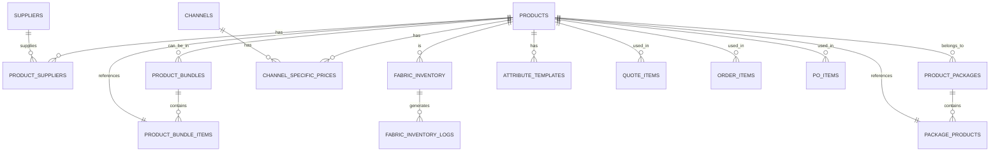

# 商品模块需求 (Product)

## 1. 模块概述 (Module Overview)

| 属性 | 说明 |
|:---|:---|
| **模块名称** | 商品 (Product) |
| **核心价值** | 管理商品基础数据、定价、供应商关联，支撑报价、订单、采购全流程 |
| **目标用户** | 采购员、管理员、店长、销售 |
| **上游模块** | 无 (基础数据) |
| **下游模块** | 报价单、订单、采购单、对账单 |

## 2. 商品类型 (Product Types)

### 2.1 商品类型说明

| 商品类型 | 英文代码 | 说明 | 采购流程 |
|:---|:---|:---|---|
| 成品商品 | `FINISHED` | 电机、轨道、配件、成品窗帘等直接采购的成品 | 订单 → 成品采购单 → 成品供应商 → 发货 |
| 定制商品 | `CUSTOM` | 窗帘布料、窗帘纱、墙布等需要二次加工的商品 | 订单 → 面料采购单 → 面料入库 → 加工单 → 加工厂 → 发货 |

### 2.2 商品类型对比

| 维度 | 成品商品 (FINISHED) | 定制商品 (CUSTOM) |
|:---|:---|---|
| **适用商品** | 电机、轨道、配件、成品窗帘等 | 窗帘布料、窗帘纱、墙布等需要二次加工的面料 |
| **采购对象** | 成品供应商 | 面料供应商 |
| **履约流程** | 订单 → 成品采购单 → 成品供应商 → 成品 → 发货 | 订单 → 面料采购单 → 面料入库 → 加工单 → 加工厂 → 成品 → 发货 |
| **采购单类型** | 成品采购单 (FINISHED) | 面料采购单 (FABRIC) |
| **中间环节** | 无 | 需要加工环节 |
| **库存影响** | 不涉及面料库存 | 增加面料库存 |
| **加工单** | 无 | 需要生成加工单 |
| **辅料需求** | 无 | 部分品类需要辅料（如墙布需要基膜、胶水） |

## 3. 商品品类 (Product Categories)

### 3.1 品类枚举

| 品类 | 代码 | 计价方式 | 商品类型 |
|:---|:---|:---|---|
| 窗帘布料 | `CURTAIN_FABRIC` | 按米/按平米 | CUSTOM |
| 窗帘纱 | `CURTAIN_SHEER` | 按米/按平米 | CUSTOM |
| 窗帘轨道 | `CURTAIN_TRACK` | 按米 | FINISHED |
| 窗帘配件 | `CURTAIN_ACCESSORY` | 按个/按套 | FINISHED |
| 墙布 | `WALLCLOTH` | 按卷/按平米 | CUSTOM |
| 墙布辅料 | `WALLCLOTH_ACCESSORY` | 按个/按桶 | FINISHED |
| 墙咔 | `WALLPANEL` | 按平米/按块 | FINISHED |
| 飘窗垫 | `WINDOWPAD` | 按件 (定制尺寸) | FINISHED |
| 标品 | `STANDARD` | 按个 | FINISHED |
| 电机 | `MOTOR` | 按台 | FINISHED |

## 4. 商品属性模板 (Product Attribute Templates)

商品使用 **JSONB** 存储动态属性，不同品类有不同的属性结构。系统需提供**可配置的属性模板**，管理员可在后台定义每个品类的属性字段。

### 4.1 基础字段 (所有商品通用)

| 字段名 | 类型 | 必填 | 说明 |
|:---|:---|:---|---|
| id | UUID | ✓ | 主键 |
| tenant_id | UUID | ✓ | 租户ID |
| sku | String | ✓ | 商品编码 |
| name | String | ✓ | 商品名称 |
| category | Enum | ✓ | 品类 (见 3.1) |
| product_type | Enum | ✓ | 商品类型 (FINISHED/FABRIC) |
| unit | String | ✓ | 计量单位 (米/平米/个/套) |
| default_supplier_id | UUID | - | 默认供应商（从商品供应商关联表中选择） |
| is_stockable | Boolean | - | 是否为库存品 |
| is_active | Boolean | - | 是否上架 |
| is_tob_enabled | Boolean | - | 是否在 ToB 渠道上架 |
| is_toc_enabled | Boolean | - | 是否在 ToC 零售上架 |
| images | JSONB | - | 商品图片URL数组 |
| attributes | JSONB | - | 品类特有属性 (见下) |
| created_at | DateTime | ✓ | 创建时间 |
| updated_at | DateTime | ✓ | 更新时间 |
| deleted_at | DateTime | - | 删除时间 (软删除) |

### 4.2 成本维度（内部可见，核心利润计算依据）

| 字段名 | 类型 | 必填 | 说明 |
|:---|:---|:---|---|
| purchase_price | Decimal | - | 标准采购价：与供应商约定的原始单价 |
| logistics_cost | Decimal | - | 物流成本：从工厂到仓库或加工厂的平摊运费 |
| processing_cost | Decimal | - | 加工成本：每米或每扇窗帘的缝制、制作费用 |
| loss_rate | Decimal | - | 损耗系数：默认 0.05 (5%) |
| internal_cost | Decimal | - | 真实成本：purchase_price + logistics_cost + processing_cost × (1 + loss_rate) |

### 4.3 销售维度（针对不同客户类型）

| 字段名 | 类型 | 必填 | 说明 |
|:---|:---|:---|---|
| retail_price | Decimal | - | 零售价：面向 ToC 散客的标价，也是计算折扣的基准 |
| channel_price | Decimal | - | 标准渠道结算价：面向装企、设计师等合作伙伴的标准渠道结算价（底价供货模式） |
| channel_price_mode | Enum | - | 渠道价策略：FIXED（固定单价）或 DISCOUNT（零售价打折） |
| channel_discount_rate | Decimal | - | 渠道价折扣率：如 0.6 表示零售价的 6 折（仅当 mode=DISCOUNT 时有效） |
| floor_price | Decimal | - | 最低售价：给销售人员的权限底线，防止低价乱单 |

**渠道定价说明**：
* **底价供货模式**：同一商品同时存在对客价（retail_price）和渠道结算价（channel_price）
* **渠道等级折扣**：根据渠道等级（S/A/B/C）应用不同的折扣率，折扣率在租户级别配置
* **最终结算价计算**：`最终结算价 = 标准渠道结算价 × 渠道等级折扣率`
* **示例**：
  * 商品A对客价：100元
  * 标准渠道结算价：80元
  * 某租户配置：S级95折，B级无折扣
  * S级渠道结算价：80 × 0.95 = 76元
  * B级渠道结算价：80 × 1.00 = 80元

### 4.4 品类属性模板 (Category Attribute Schema)

#### A. 窗帘布料 (CURTAIN_FABRIC)

```typescript
interface CurtainFabricAttributes {
  // 基础属性
  fabric_type: '布帘' | '绒布' | '棉麻' | '涤纶';
  pattern: '纯色' | '印花' | '提花' | '刺绣';
  width_standard: number;        // 门幅宽度 (cm)，如 280/310
  
  // 工艺属性
  pleat_styles: ('打褶' | '穿杆' | '波浪帘' | 'S帘')[];  // 支持的褶皱工艺
  shrinkage_rate: number;        // 缩水率 (%)
  
  // 计价参数
  price_mode: 'by_meter' | 'by_sqm';  // 按米/按平米
  fold_ratio_default: number;    // 默认倍率 (如 2.0)
  process_fee: number;           // 加工费 (元/米)
  
  // 安装约束
  min_width: number;             // 最小宽度 (cm)
  max_width: number;             // 最大宽度 (cm)
  is_washable: boolean;          // 是否可水洗
  sketch_image?: string;         // 示意图URL
}
```

#### B. 窗帘轨道 (CURTAIN_TRACK)

```typescript
interface CurtainTrackAttributes {
  track_type: '铝合金' | '罗马杆' | '电动轨道';
  material: '铝' | '木' | '不锈钢';
  color_options: string[];       // 可选颜色
  max_length: number;            // 单根最大长度 (cm)
  load_capacity: number;         // 承重 (kg/米)
  
  // 电动轨道专属
  motor_required?: boolean;
  compatible_motors?: string[];  // 兼容电机型号
  
  // 安装约束
  bracket_spacing: number;       // 建议支架间距 (cm)
  min_box_depth?: number;        // 最小窗帘盒深度 (cm)
  sketch_image?: string;         // 示意图URL
}
```

#### C. 墙布 (WALLCLOTH)

```typescript
interface WallclothAttributes {
  material: '无纺布' | '丝绸' | 'PVC';
  roll_width: number;            // 卷宽 (cm)，如 53/70/106
  roll_length: number;           // 卷长 (米)，如 10/15
  pattern_repeat: number;        // 花纹循环 (cm)
  
  // 计价参数
  price_mode: 'by_roll' | 'by_sqm';
  loss_rate: number;             // 损耗率 (%)
  
  // 施工属性
  glue_type: '湿胶' | '热熔胶' | '自粘';
  is_moisture_proof: boolean;    // 防潮
  
  // 辅料配置
  required_accessories: {        // 必需辅料
    base_film: {               // 基膜
      required: boolean;        // 是否必需
      coverage_per_unit: number; // 单位覆盖面积（平米/个）
      default_product_id: UUID; // 默认基膜商品ID
    };
    glue: {                   // 胶水
      required: boolean;        // 是否必需
      coverage_per_unit: number; // 单位覆盖面积（平米/桶）
      default_product_id: UUID; // 默认胶水商品ID
    };
  };
}
```

#### D. 墙布辅料 (WALLCLOTH_ACCESSORY)

```typescript
interface WallclothAccessoryAttributes {
  accessory_type: '基膜' | '胶水' | '其他';
  coverage_area: number;       // 覆盖面积（平米）
  unit: '个' | '桶' | '包';  // 单位
  
  // 施工属性
  application_method: string;   // 施工方法说明
  drying_time: number;        // 干燥时间（小时）
  
  // 兼容性
  compatible_wallcloth_types: string[]; // 兼容的墙布类型
}
```

#### E. 标品 (STANDARD)

```typescript
interface StandardProductAttributes {
  product_type: '抱枕' | '挂画' | '窗帘扣' | '流苏';
  size: string;                  // 规格描述
  color_options: string[];
  
  // 库存相关
  safety_stock: number;          // 安全库存
  lead_time_days: number;        // 采购周期 (天)
}
```

### 4.5 属性模板配置 (Admin Configuration)

管理员可在后台自定义品类属性：
*   **新增字段**: 定义字段名、类型 (String/Number/Boolean/Enum/Array)、是否必填
*   **编辑约束**: 设置数值范围、下拉选项列表
*   **字段排序**: 调整在录入界面的显示顺序
*   **关联报价公式**: 将属性字段绑定到报价计算规则中

### 4.6 报价公式关联 (Pricing Formula)

商品属性直接影响报价计算，系统需支持**可配置的计价公式**：

| 品类 | 公式示例 |
|:---|:---|
| 窗帘布料 | `单价 × 宽度(米) × 高度(米) × 褶皱倍率 + 加工费` |
| 窗帘轨道 | `单价 × 长度(米) + 切割费` |
| 墙布 | `单价 × (面积 × (1 + 损耗率))` |
| 电机 | `固定单价 × 数量` |

**可视化配置**: 管理员可通过公式编辑器组合字段，生成计价规则，无需修改代码。

## 5. 商品供应商关联 (Product Suppliers)

同一个商品可以关联多个供应商，每个供应商可以设置不同的采购价和供货周期。

### 5.1 商品供应商关联表 (product_suppliers)

| 字段名 | 类型 | 必填 | 说明 |
|:---|:---|:---|---|
| id | UUID | ✓ | 主键 |
| tenant_id | UUID | ✓ | 租户ID |
| product_id | UUID | ✓ | 关联商品 |
| supplier_id | UUID | ✓ | 关联供应商 |
| is_default | Boolean | - | 是否为默认供应商 |
| purchase_price | Decimal | - | 该供应商的采购价（可覆盖商品标准采购价） |
| logistics_cost | Decimal | - | 该供应商的物流成本（可覆盖商品标准物流成本） |
| processing_cost | Decimal | - | 该供应商的加工成本（可覆盖商品标准加工成本） |
| lead_time_days | Integer | - | 供货周期（天） |
| min_order_quantity | Decimal | - | 最小起订量 |
| is_active | Boolean | - | 是否启用 |
| created_at | DateTime | ✓ | 创建时间 |
| updated_at | DateTime | ✓ | 更新时间 |

### 5.2 业务规则

* 同一个商品可以关联多个供应商，每个供应商可以设置不同的采购价和供货周期。
* 系统自动计算每个供应商的真实成本：`purchase_price + logistics_cost + processing_cost × (1 + loss_rate)`
* 在创建采购单时，优先使用默认供应商，但可以选择其他供应商。
* 如果某个供应商的采购价更低，系统可以提示采购员考虑更换供应商。

### 5.3 默认供应商与自动拆单

每个商品可绑定一个 `default_supplier_id`：

*   **作用**: 在订单转采购单时，系统根据此字段自动将 Items 分组。
*   **示例**:
    *   Item A (布料) -> Default Supplier: 面料供应商 A
    *   Item B (电机) -> Default Supplier: 成品供应商 B
    *   -> 自动生成 PO-001 (面料采购单) 和 PO-002 (成品采购单)
*   **人工干预 (Manual Override)**:
    *   系统预生成的采购单仅为 **建议方案 (Draft)**。
    *   客服在确认下单前，**可以手动调整**商品的供应商（例如：面料供应商A缺货，临时改为面料供应商C），系统需支持将 Order Item 移动至另一张采购单。

## 6. 特定渠道定价 (Specific Pricing)

由于存在渠道管理模块（圣都、设计师等），简单的"一个渠道价"可能不够。有些大渠道（如圣都武汉大区）可能有特殊的协议价。

### 6.1 渠道专属价表 (channel_specific_prices)

| 字段名 | 类型 | 必填 | 说明 |
|:---|:---|:---|---|
| id | UUID | ✓ | 主键 |
| tenant_id | UUID | ✓ | 租户ID |
| product_id | UUID | ✓ | 关联商品 |
| channel_id | UUID | ✓ | 关联特定渠道（如：圣都组） |
| special_price | Decimal | - | 该渠道的专属结算价（覆盖标准渠道结算价） |
| is_active | Boolean | - | 是否启用 |
| created_at | DateTime | ✓ | 创建时间 |
| updated_at | DateTime | ✓ | 更新时间 |

### 6.2 价格查询逻辑

当销售在录入线索/订单时，系统自动识别客户来源：

1. **若是特定渠道客户**（如圣都客户）：
   *   优先查找 `channel_specific_prices` 表
   *   如果存在专属价，使用专属价
   *   如果不存在专属价，使用标准 `channel_price`（标准渠道结算价）

2. **若是设计师推荐**：
   *   使用标准 `channel_price`（标准渠道结算价）

3. **若是直接客户**：
   *   默认使用 `retail_price`（对客价）

### 6.3 渠道等级折扣应用

对于采用底价供货模式的渠道，最终结算价需要根据渠道等级应用折扣：

**最终结算价计算公式**：
```
最终结算价 = 标准渠道结算价 × 渠道等级折扣率
```

**折扣率配置**：
- 折扣率在租户级别配置，不同租户可设置不同的折扣策略
- 示例配置：
  * S级渠道：折扣率 0.95（95折）
  * A级渠道：折扣率 0.98（98折）
  * B级渠道：折扣率 1.00（无折扣）
  * C级渠道：折扣率 1.02（上浮2%）

### 6.4 价格计算函数

```typescript
function calculateProductPrice(productId: UUID, channelId?: UUID): Decimal {
  const product = getProduct(productId);
  const channel = channelId ? getChannel(channelId) : null;
  
  // 1. 如果传入了 channelId，优先查找渠道协议价
  if (channelId && channel) {
    // 1.1 优先查找专属价
    const specificPrice = getChannelSpecificPrice(productId, channelId);
    if (specificPrice) {
      return specificPrice.special_price;
    }
    
    // 1.2 如果没有专属价，使用标准渠道结算价
    let baseChannelPrice: Decimal;
    if (product.channel_price_mode === 'FIXED') {
      baseChannelPrice = product.channel_price;
    } else {
      baseChannelPrice = product.retail_price * product.channel_discount_rate;
    }
    
    // 1.3 应用渠道等级折扣（仅底价供货模式）
    if (channel.cooperation_mode === 'BASE_PRICE') {
      const discountRate = getChannelLevelDiscountRate(channel.level);
      return baseChannelPrice * discountRate;
    }
    
    return baseChannelPrice;
  }
  
  // 2. 否则使用零售价（对客价）
  return product.retail_price;
}

function getChannelLevelDiscountRate(level: string): Decimal {
  // 从租户级别配置获取渠道等级折扣率
  const config = getTenantConfig('channel_level_discounts');
  return config[level] || 1.0;
}
```

## 7. 组合商品 (BOM/Bundle)

由于窗帘是组合品，系统支持"组合 SKU"。

### 7.1 组合商品表 (product_bundles)

| 字段名 | 类型 | 必填 | 说明 |
|:---|:---|:---|---|
| id | UUID | ✓ | 主键 |
| tenant_id | UUID | ✓ | 租户ID |
| bundle_sku | String | ✓ | 组合商品 SKU |
| bundle_name | String | ✓ | 组合商品名称 |
| category | Enum | ✓ | 品类 |
| retail_price | Decimal | - | 组合零售价（对客价，可手动设置或自动计算） |
| channel_price | Decimal | - | 组合渠道结算价（可手动设置或自动计算） |
| is_active | Boolean | - | 是否启用 |
| created_at | DateTime | ✓ | 创建时间 |
| updated_at | DateTime | ✓ | 更新时间 |

### 7.2 组合商品明细表 (product_bundle_items)

| 字段名 | 类型 | 必填 | 说明 |
|:---|:---|:---|---|
| id | UUID | ✓ | 主键 |
| bundle_id | UUID | ✓ | 关联组合商品 |
| product_id | UUID | ✓ | 关联子商品 |
| quantity | Decimal | ✓ | 子商品数量 |
| unit | String | - | 单位 |

### 7.3 组合商品定价策略

| 策略 | 说明 |
|:---|:---|
| **自动计算** | 系统自动汇总各子项的成本，得出该组合商品的真实成本，然后根据毛利率计算 ToB/ToC 总价 |
| **手动设置** | 管理员手动设置组合商品的零售价（对客价）和渠道结算价 |

**自动计算示例**：
* 子商品 A（面料）：成本 50 元，数量 5 米 → 小计 250 元
* 子商品 B（轨道）：成本 30 元，数量 3 米 → 小计 90 元
* 子商品 C（加工费）：成本 20 元，数量 1 项 → 小计 20 元
* 组合商品真实成本：250 + 90 + 20 = 360 元
* ToC 零售价（毛利率 50%）：360 / (1 - 0.5) = 720 元
* ToB 渠道结算价（毛利率 30%）：360 / (1 - 0.3) = 514 元

## 8. 商品套餐 (Product Packages)

商品套餐是一种特殊的定价策略，允许对特定商品或商品组合设置固定价格，忽略原有的审批制度或折扣管控。

### 8.1 套餐概念

| 概念 | 说明 |
|:---|:---|
| **套餐号码** | 套餐的唯一标识，如 TC001 |
| **套餐名称** | 套餐的显示名称，如 "18米布套餐" |
| **套餐价格** | 套餐的固定价格，如 1999 元 |
| **套餐规则** | 套餐的适用条件和计算规则 |
| **套餐标签** | 标记哪些商品属于该套餐 |

### 8.2 套餐类型

| 套餐类型 | 说明 | 示例 |
|:---|:---|---|
| **数量套餐** | 基于商品数量的套餐 | 18米布销售1999元 |
| **组合套餐** | 基于商品组合的套餐 | 窗帘布料+轨道+配件套餐价 |
| **品类套餐** | 基于品类的套餐 | 所有墙布品类享受套餐价 |
| **限时套餐** | 有时间限制的套餐 | 活动期间套餐价 |

### 8.3 套餐表 (product_packages)

| 字段名 | 类型 | 必填 | 说明 |
|:---|:---|:---|---|
| id | UUID | ✓ | 主键 |
| tenant_id | UUID | ✓ | 租户ID |
| package_no | String | ✓ | 套餐号码（如 TC001） |
| package_name | String | ✓ | 套餐名称 |
| package_type | Enum | ✓ | 套餐类型 (QUANTITY/COMBO/CATEGORY/TIME_LIMITED) |
| package_price | Decimal | ✓ | 套餐固定价格 |
| original_price | Decimal | - | 原价（用于展示折扣） |
| description | Text | - | 套餐描述 |
| rules | JSONB | ✓ | 套餐规则（见下） |
| is_active | Boolean | - | 是否启用 |
| start_date | DateTime | - | 开始时间（限时套餐） |
| end_date | DateTime | - | 结束时间（限时套餐） |
| created_at | DateTime | ✓ | 创建时间 |
| updated_at | DateTime | ✓ | 更新时间 |

### 8.4 套餐规则 (Package Rules)

套餐规则使用 JSONB 存储，支持灵活配置：

```typescript
interface PackageRules {
  // 数量套餐规则
  quantity_rules?: {
    product_id: UUID;           // 商品ID
    min_quantity: Decimal;      // 最小数量
    max_quantity?: Decimal;     // 最大数量（可选）
    unit: String;              // 单位（米/平米/个）
  };
  
  // 组合套餐规则
  combo_rules?: {
    required_products: {        // 必需商品
      product_id: UUID;
      min_quantity: Decimal;
    }[];
    optional_products?: {       // 可选商品
      product_id: UUID;
      max_quantity: Decimal;
    }[];
  };
  
  // 品类套餐规则
  category_rules?: {
    category: ProductCategory;   // 品类
    min_quantity: Decimal;      // 最小数量
    max_quantity?: Decimal;     // 最大数量（可选）
  };
  
  // 超出套餐处理
  overflow_handling?: {
    mode: 'FIXED' | 'DISCOUNT' | 'ORIGINAL'; // 固定价/折扣/原价
    discount_rate?: Decimal;    // 折扣率（mode=DISCOUNT时）
  };
}
```

### 8.5 套餐商品关联表 (package_products)

| 字段名 | 类型 | 必填 | 说明 |
|:---|:---|:---|---|
| id | UUID | ✓ | 主键 |
| package_id | UUID | ✓ | 关联套餐 |
| product_id | UUID | ✓ | 关联商品 |
| is_required | Boolean | - | 是否必需（组合套餐） |
| min_quantity | Decimal | - | 最小数量 |
| max_quantity | Decimal | - | 最大数量 |
| created_at | DateTime | ✓ | 创建时间 |

### 8.6 套餐计算逻辑

#### 8.6.1 数量套餐示例

**套餐配置**：
* 套餐号码：TC001
* 套餐名称：18米布套餐
* 套餐价格：1999 元
* 套餐规则：
  ```json
  {
    "quantity_rules": {
      "product_id": "uuid",
      "min_quantity": 18,
      "max_quantity": 18,
      "unit": "米"
    },
    "overflow_handling": {
      "mode": "DISCOUNT",
      "discount_rate": 0.8
    }
  }
  ```

**计算场景**：

| 场景 | 数量 | 计算方式 | 最终价格 |
|:---|:---|:---|---|
| 刚好18米 | 18米 | 套餐价 | 1999 元 |
| 少于18米 | 15米 | 原价计算 | 按原价计算 |
| 超过18米 | 20米 | 套餐价 + 超出部分×折扣率 | 1999 + (2 × 单价 × 0.8) |

#### 8.6.2 组合套餐示例

**套餐配置**：
* 套餐号码：TC002
* 套餐名称：窗帘全包套餐
* 套餐价格：2999 元
* 套餐规则：
  ```json
  {
    "combo_rules": {
      "required_products": [
        { "product_id": "uuid_1", "min_quantity": 18 },  // 布料18米
        { "product_id": "uuid_2", "min_quantity": 3 }    // 轨道3米
      ],
      "optional_products": [
        { "product_id": "uuid_3", "max_quantity": 2 }    // 配件最多2个
      ]
    },
    "overflow_handling": {
      "mode": "ORIGINAL"
    }
  }
  ```

**计算场景**：

| 场景 | 商品组合 | 计算方式 | 最终价格 |
|:---|:---|:---|---|
| 标准套餐 | 布料18米+轨道3米 | 套餐价 | 2999 元 |
| 增加配件 | 布料18米+轨道3米+配件1个 | 套餐价 + 配件原价 | 2999 + 配件原价 |
| 超出数量 | 布料20米+轨道3米 | 套餐价 + 超出布料原价 | 2999 + (2 × 布料单价) |

### 8.7 套餐与审批制度的关系

| 场景 | 审批要求 |
|:---|:---|
| **套餐内商品** | **忽略审批制度**，直接使用套餐价 |
| **套餐外商品** | 按原有审批制度执行 |
| **超出套餐部分** | 根据套餐规则处理（固定价/折扣/原价），超出部分按原有审批制度执行 |

**示例**：
* 套餐 TC001：18米布套餐价 1999 元
* 客户购买 18 米布料 → 使用套餐价 1999 元，无需审批
* 客户购买 20 米布料 → 套餐价 1999 元 + 超出 2 米按折扣价计算，无需审批
* 客户购买 18 米布料 + 其他商品 → 套餐价 1999 元 + 其他商品按原价计算，其他商品可能需要审批

### 8.8 套餐标签系统

商品可以被标记为属于某个套餐：

| 字段名 | 类型 | 说明 |
|:---|:---|---|
| package_id | UUID | 关联套餐 |
| product_id | UUID | 关联商品 |
| is_eligible | Boolean | 是否符合套餐条件 |

**标签用途**：
* 在报价单中自动识别套餐商品
* 提示销售当前商品可使用套餐价
* 自动计算套餐价格

### 8.9 套餐优先级

当多个套餐同时适用时，按以下优先级选择：

1. **限时套餐** > 常规套餐
2. **组合套餐** > 数量套餐 > 品类套餐
3. **价格最优**：选择价格最低的套餐

### 8.10 套餐管理功能

| 功能 | 说明 |
|:---|:---|
| 创建套餐 | 管理员创建新套餐，设置套餐规则 |
| 编辑套餐 | 修改套餐价格、规则、时间等 |
| 启用/禁用套餐 | 控制套餐是否生效 |
| 套餐预览 | 预览套餐价格和适用场景 |
| 套餐统计 | 统计套餐使用次数、销售额等 |
| 套餐分析 | 分析套餐效果，优化套餐策略 |

## 9. 库存管理 (Inventory)

针对 **标品 (Standard Products)**（如：罗马杆、成品轨道、抱枕），系统需支持库存管理。

### 8.1 库存字段

| 字段名 | 类型 | 说明 |
|:---|:---|---|
| is_stockable | Boolean | 是否为库存商品 |
| stock_quantity | Decimal | 当前库存数量 |
| safety_stock | Decimal | 安全库存 |

### 8.2 出库逻辑

*   当订单包含标品时，拆单逻辑会将这些商品指向 **"本地仓库"** (Internal Warehouse)。
*   生成 **"领料单/备货单"** (Stock Pick List)，而非外部采购单。

### 8.3 库存扣减

*   **预占**: 订单生成/拆单时，预占库存。
*   **扣减**: 确认发货时，实扣库存。

## 9. 面料库存管理 (Fabric Inventory)

针对 **面料商品**（如窗帘布料、窗帘纱、墙布），系统需支持面料库存管理。

### 9.1 业务场景

1. **面料采购入库**: 面料采购单到货后，面料入库，增加库存
2. **面料预占**: 生成加工单时，预占面料库存
3. **面料出库**: 加工厂领取面料时，扣减库存
4. **面料盘点**: 定期盘点面料库存，调整账面数量
5. **面料退库**: 加工剩余面料退回仓库

### 9.2 面料库存表 (fabric_inventory)

| 字段名 | 类型 | 必填 | 说明 |
|:---|:---|:---|---|
| id | UUID | ✓ | 主键 |
| tenant_id | UUID | ✓ | 租户ID |
| fabric_product_id | UUID | ✓ | 关联面料商品 |
| fabric_sku | String | ✓ | 面料SKU |
| fabric_name | String | ✓ | 面料名称（冗余） |
| fabric_color | String | - | 颜色/花色 |
| fabric_width | Decimal | - | 幅宽（米） |
| fabric_roll_length | Decimal | - | 卷长（米） |
| batch_no | String | - | 批次号 |
| purchase_order_id | UUID | - | 来源采购单 |
| supplier_id | UUID | - | 供应商ID |
| available_quantity | Decimal | ✓ | 可用数量（米/卷） |
| reserved_quantity | Decimal | ✓ | 已预占数量（米/卷） |
| total_quantity | Decimal | ✓ | 总库存（米/卷） |
| purchase_date | Date | - | 采购日期 |
| expiry_date | Date | - | 有效期（如有） |
| warehouse_location | String | - | 仓库位置 |
| is_active | Boolean | - | 是否启用 |
| created_at | DateTime | ✓ | 创建时间 |
| updated_at | DateTime | ✓ | 更新时间 |

### 9.3 面料库存流水表 (fabric_inventory_logs)

| 字段名 | 类型 | 必填 | 说明 |
|:---|:---|:---|---|
| id | UUID | ✓ | 主键 |
| tenant_id | UUID | ✓ | 租户ID |
| fabric_inventory_id | UUID | ✓ | 关联面料库存 |
| log_type | Enum | ✓ | 流水类型 (PURCHASE_IN/PROCESSING_OUT/ADJUSTMENT/RETURN) |
| quantity | Decimal | ✓ | 数量变化 |
| before_quantity | Decimal | ✓ | 变化前数量 |
| after_quantity | Decimal | ✓ | 变化后数量 |
| reference_id | UUID | - | 关联单据ID（采购单/加工单） |
| reference_type | String | - | 单据类型 |
| remark | Text | - | 备注 |
| created_at | DateTime | ✓ | 创建时间 |
| created_by | UUID | - | 创建人 |

### 9.4 流水类型说明

| 流水类型 | 代码 | 说明 | 触发场景 |
|:---|:---|:---|---|
| 面料入库 | `PURCHASE_IN` | 面料采购入库 | 面料采购单到货 |
| 面料出库 | `PROCESSING_OUT` | 面料加工出库 | 生成加工单 |
| 库存调整 | `ADJUSTMENT` | 手动调整库存 | 盘点调整 |
| 面料退库 | `RETURN` | 面料退回仓库 | 加工剩余面料退库 |

### 9.5 面料库存业务规则

**入库规则**:
*   面料采购单到货后，采购员确认入库
*   系统自动生成批次号（格式：BATCH+YYYYMMDD+序号）
*   入库时记录面料批次、幅宽、卷长等信息
*   库存流水记录入库操作

**预占规则**:
*   生成加工单时，系统自动预占面料库存
*   预占数量从 `available_quantity` 中扣除，增加到 `reserved_quantity`
*   预占时检查库存是否充足，不足则提示库存不足

**出库规则**:
*   加工厂领取面料时，确认出库
*   出库数量从 `reserved_quantity` 中扣除
*   库存流水记录出库操作

**盘点规则**:
*   支持定期盘点面料库存
*   盘点差异自动生成调整流水
*   盘点需店长审批

**库存预警**:
*   当面料库存低于安全库存时，自动预警
*   预警通知采购员和店长
*   支持设置每个面料的安全库存

## 10. 属性模板表 (attribute_templates)

| 字段名 | 类型 | 必填 | 说明 |
|:---|:---|:---|---|
| id | UUID | ✓ | 主键 |
| tenant_id | UUID | ✓ | 租户ID |
| category | Enum | ✓ | 品类 |
| field_name | String | ✓ | 字段显示名称 |
| field_key | String | ✓ | 字段键名 |
| field_type | Enum | ✓ | 字段类型 (string/number/boolean/enum/array) |
| is_required | Boolean | - | 是否必填 |
| options | JSONB | - | 枚举选项 |
| validation | JSONB | - | 校验规则 |
| sort_order | Integer | - | 排序 |
| created_at | DateTime | ✓ | 创建时间 |
| updated_at | DateTime | ✓ | 更新时间 |

## 11. 权限控制 (Permission Control)

### 11.1 操作权限

| 操作 | 销售 | 采购员 | 管理员 | 店长 |
|:---|:---|:---|:---|:---|
| 查看商品列表 | ✓ | ✓ | ✓ | ✓ |
| 查看商品详情 | ✓ | ✓ | ✓ | ✓ |
| 创建商品 | ✗ | ✓ | ✓ | ✓ |
| 编辑商品 | ✗ | ✓ | ✓ | ✓ |
| 删除商品 | ✗ | ✗ | ✓ | ✗ |
| 上架商品 | ✗ | ✓ | ✓ | ✓ |
| 下架商品 | ✗ | ✓ | ✓ | ✓ |
| 修改成本价 | ✗ | ✓ | ✓ | ✓ |
| 修改零售价 | ✓ | ✓ | ✓ | ✓ |
| 修改渠道价 | ✓ | ✓ | ✓ | ✓ |
| 配置特定渠道价 | ✓ | ✓ | ✓ | ✓ |
| 创建组合商品 | ✓ | ✓ | ✓ | ✓ |
| 配置属性模板 | ✗ | ✓ | ✗ |

### 11.2 数据范围权限

| 角色 | 可见范围 |
|:---|:---|
| 采购员 | 全部供应商和商品，可查看成本维度 |
| 管理员 | 全部（成本维度查看权限需在权限矩阵表中单独配置） |
| 店长 | 本店关联的供应商和商品（成本维度查看权限需在权限矩阵表中单独配置） |
| 销售 | 仅查看商品的销售维度（零售价、渠道价），不可查看成本维度 |

**成本维度权限说明**：
* 成本维度（标准采购价、物流成本、加工成本、损耗系数、真实成本）默认仅采购员可查看。
* 管理员和店长是否可以查看成本维度，需在系统权限矩阵表中单独配置。
* 成本维度的编辑权限仅管理员拥有。

## 12. 通知与提醒 (Notifications)

| 触发事件 | 通知对象 | 渠道 | 内容 |
|:---|:---|:---|---|
| 商品下架 | 采购员 | 系统 | 商品 XXX 已下架 |
| 库存不足 | 采购员+店长 | 系统 | 商品 XXX 库存不足 |
| 供应商停用 | 采购员 | 系统 | 供应商 XXX 已停用 |

## 13. 与其他模块的关联 (Module Relations)

| 模块 | 关联方式 | 数据流向 |
|:---|:---|:---|
| **报价单** | QuoteItem.product_id → Product.id | 商品 → 报价 |
| **订单** | OrderItem.product_id → Product.id | 商品 → 订单 |
| **采购单** | PO.supplier_id → Supplier.id | 供应商 → 采购 |
| **对账单** | AP.supplier_id → Supplier.id | 供应商 → 对账 |
| **渠道** | ChannelSpecificPrice.channel_id → Channel.id | 渠道 → 特定渠道定价 |
| **渠道** | ChannelSpecificPrice.product_id → Product.id | 商品 → 特定渠道定价 |
| **组合商品** | ProductBundleItem.bundle_id → ProductBundle.id | 组合商品 → 明细 |
| **组合商品** | ProductBundleItem.product_id → Product.id | 商品 → 组合商品 |

### 13.1 价格计算流程

```
销售录入线索/订单
    ↓
识别客户来源（渠道/设计师/直接客户）
    ↓
查询价格：
    ├─ 特定渠道客户 → 查找 channel_specific_prices → 使用专属价
    ├─ 渠道客户（底价供货模式） → 使用 channel_price（标准渠道结算价）× 渠道等级折扣率
    ├─ 渠道客户（返佣模式） → 使用 channel_price（标准渠道结算价）
    └─ 直接客户 → 使用 retail_price（对客价）
    ↓
计算毛利率（后台管理可见）
    ├─ ToC 毛利率 = (零售价 - 真实成本) / 零售价
    └─ ToB 毛利率 = (渠道结算价 - 真实成本) / 渠道结算价
```

### 13.2 成本计算流程

```
商品基础成本
    ↓
purchase_price（标准采购价）
+ logistics_cost（物流成本）
+ processing_cost（加工成本）
× (1 + loss_rate)（损耗系数）
    ↓
= internal_cost（真实成本）
```

### 13.3 拆单流程

```
订单创建
    ↓
遍历订单明细
    ↓
根据商品类型判断：
    ├─ 成品商品 (FINISHED) → 生成成品采购单
    ├─ 面料商品 (FABRIC) → 生成面料采购单
    └─ 标品 (is_stockable=true) → 生成内部备货单
    ↓
根据 default_supplier_id 分组
    ↓
生成多个采购单
    ↓
客服可手动调整商品归属
    ↓
确认拆单
```

## 14. UI组件 (UI Components)

### 14.1 产品管理

| 组件名称 | 功能描述 |
|:---|:---|
| product-table.tsx | 产品表格，展示产品列表数据 |
| product-form.tsx | 产品表单 |
| product-dialog.tsx | 产品对话框 |
| product-form-dialog.tsx | 产品表单对话框 |
| product-selector.tsx | 产品选择器 |
| product-import-dialog.tsx | 产品导入对话框 |

### 14.2 产品配置

| 组件名称 | 功能描述 |
|:---|:---|
| product-supplier-manager.tsx | 产品供应商管理器 |
| attribute-template-manager.tsx | 属性模板管理器 |

### 14.3 报价单商品管理

| 组件名称 | 功能描述 |
|:---|:---|
| quote-item-dialog.tsx | 商品编辑对话框 |
| quote-item-config-dialog.tsx | 商品配置对话框 |
| quote-item-row.tsx | 商品行组件 |
| quote-item-table-row.tsx | 商品表格行组件 |
| product-search-combobox.tsx | 商品搜索下拉框 |

## 15. 数据模型总结 (Data Model Summary)

### 15.1 核心表

| 表名 | 说明 | 关键字段 |
|:---|:---|:---|
| `products` | 商品表 | `product_type`, `category`, `default_supplier_id` |
| `product_suppliers` | 商品供应商关联表 | `product_id`, `supplier_id`, `is_default` |
| `product_bundles` | 组合商品表 | `bundle_sku`, `retail_price`, `channel_price` |
| `product_bundle_items` | 组合商品明细表 | `bundle_id`, `product_id`, `quantity` |
| `product_packages` | 套餐表 | `package_no`, `package_type`, `package_price` |
| `package_products` | 套餐商品关联表 | `package_id`, `product_id`, `is_required` |
| `channel_specific_prices` | 渠道专属价表 | `product_id`, `channel_id`, `special_price` |
| `fabric_inventory` | 面料库存表 | `fabric_product_id`, `available_quantity`, `reserved_quantity` |
| `fabric_inventory_logs` | 面料库存流水表 | `fabric_inventory_id`, `log_type`, `quantity` |
| `attribute_templates` | 属性模板表 | `category`, `field_key`, `field_type` |
| `product_price_history` | 价格历史审计表 | `product_id`, `supplier_id`, `price_type`, `old_price`, `new_price` |

### 15.2 ER关系图



## 16. 业务流程 (Business Flows)

### 16.1 商品创建流程

```
管理员/采购员创建商品
    ↓
填写基础信息（SKU、名称、品类、类型）
    ↓
填写成本维度（采购价、物流成本、加工成本、损耗率）
    ↓
填写销售维度（零售价、渠道价、最低售价）
    ↓
关联供应商（可关联多个供应商，设置默认供应商）
    ↓
配置品类属性（根据品类自动加载属性模板）
    ↓
保存商品
```

### 16.2 商品定价流程

```
管理员/采购员设置商品价格
    ↓
设置成本维度
    ↓
系统自动计算真实成本
    ↓
设置销售维度
    ↓
设置特定渠道价（可选）
    ↓
保存价格
    ↓
系统自动计算毛利率
```

### 16.3 商品与供应商关联流程

```
管理员/采购员关联供应商
    ↓
选择商品
    ↓
添加供应商
    ↓
设置该供应商的采购价、物流成本、加工成本
    ↓
设置供货周期、最小起订量
    ↓
设置是否为默认供应商
    ↓
保存关联
    ↓
系统自动计算该供应商的真实成本
```

### 16.4 商品库存管理流程

```
标品库存管理
    ↓
订单创建
    ↓
系统预占库存
    ↓
确认发货
    ↓
系统扣减库存
    ↓
库存不足预警
    ↓
采购员补货
```

### 16.5 面料库存管理流程

```
面料采购入库
    ↓
面料采购单到货
    ↓
采购员确认入库
    ↓
系统生成批次号
    ↓
增加面料库存
    ↓
生成库存流水
    ↓
面料预占
    ↓
生成加工单
    ↓
系统预占面料库存
    ↓
面料出库
    ↓
加工厂领取面料
    ↓
确认出库
    ↓
扣减面料库存
    ↓
生成库存流水
```

## 17. API接口 (API Endpoints)

### 17.1 商品管理

| 方法 | 路径 | 说明 |
|:---|:---|:---|
| GET | `/api/v1/products` | 获取商品列表 |
| GET | `/api/v1/products/:id` | 获取商品详情 |
| POST | `/api/v1/products` | 创建商品 |
| PUT | `/api/v1/products/:id` | 更新商品 |
| DELETE | `/api/v1/products/:id` | 删除商品（软删除） |

### 17.2 商品供应商关联

| 方法 | 路径 | 说明 |
|:---|:---|:---|
| GET | `/api/v1/products/:id/suppliers` | 获取商品的供应商列表 |
| POST | `/api/v1/products/:id/suppliers` | 添加商品供应商关联 |
| PUT | `/api/v1/products/:id/suppliers/:supplierId` | 更新商品供应商关联 |
| DELETE | `/api/v1/products/:id/suppliers/:supplierId` | 删除商品供应商关联 |

### 17.3 组合商品

| 方法 | 路径 | 说明 |
|:---|:---|:---|
| GET | `/api/v1/product-bundles` | 获取组合商品列表 |
| GET | `/api/v1/product-bundles/:id` | 获取组合商品详情 |
| POST | `/api/v1/product-bundles` | 创建组合商品 |
| PUT | `/api/v1/product-bundles/:id` | 更新组合商品 |
| DELETE | `/api/v1/product-bundles/:id` | 删除组合商品 |

### 17.4 渠道专属价

| 方法 | 路径 | 说明 |
|:---|:---|:---|
| GET | `/api/v1/products/:id/channel-prices` | 获取商品的渠道专属价列表 |
| POST | `/api/v1/products/:id/channel-prices` | 添加渠道专属价 |
| PUT | `/api/v1/products/:id/channel-prices/:channelId` | 更新渠道专属价 |
| DELETE | `/api/v1/products/:id/channel-prices/:channelId` | 删除渠道专属价 |

### 17.5 面料库存

| 方法 | 路径 | 说明 |
|:---|:---|:---|
| GET | `/api/v1/fabric-inventory` | 获取面料库存列表 |
| GET | `/api/v1/fabric-inventory/:id` | 获取面料库存详情 |
| GET | `/api/v1/fabric-inventory/:id/logs` | 获取面料库存流水 |
| POST | `/api/v1/fabric-inventory/:id/adjust` | 调整面料库存 |
| POST | `/api/v1/fabric-inventory/:id/return` | 面料退库 |

### 17.6 套餐管理

| 方法 | 路径 | 说明 |
|:---|:---|:---|
| GET | `/api/v1/product-packages` | 获取套餐列表 |
| GET | `/api/v1/product-packages/:id` | 获取套餐详情 |
| POST | `/api/v1/product-packages` | 创建套餐 |
| PUT | `/api/v1/product-packages/:id` | 更新套餐 |
| DELETE | `/api/v1/product-packages/:id` | 删除套餐 |
| POST | `/api/v1/product-packages/:id/activate` | 启用套餐 |
| POST | `/api/v1/product-packages/:id/deactivate` | 禁用套餐 |
| POST | `/api/v1/product-packages/:id/preview` | 预览套餐价格 |

### 17.7 套餐商品关联

| 方法 | 路径 | 说明 |
|:---|:---|:---|
| GET | `/api/v1/product-packages/:id/products` | 获取套餐的商品列表 |
| POST | `/api/v1/product-packages/:id/products` | 添加套餐商品 |
| PUT | `/api/v1/product-packages/:id/products/:productId` | 更新套餐商品 |
| DELETE | `/api/v1/product-packages/:id/products/:productId` | 删除套餐商品 |

### 17.8 套餐价格计算

| 方法 | 路径 | 说明 |
|:---|:---|:---|
| POST | `/api/v1/product-packages/calculate` | 计算套餐价格 |
| GET | `/api/v1/products/:id/applicable-packages` | 获取商品适用的套餐列表 |

### 17.9 属性模板

| 方法 | 路径 | 说明 |
|:---|:---|:---|
| GET | `/api/v1/attribute-templates` | 获取属性模板列表 |
| GET | `/api/v1/attribute-templates/:id` | 获取属性模板详情 |
| POST | `/api/v1/attribute-templates` | 创建属性模板 |
| PUT | `/api/v1/attribute-templates/:id` | 更新属性模板 |
| DELETE | `/api/v1/attribute-templates/:id` | 删除属性模板 |

## 18. 数据统计 (Data Statistics)

### 18.1 商品统计

| 指标 | 说明 |
|:---|:---|
| 商品总数 | 当前租户的商品总数 |
| 成品商品数 | 成品商品的数量 |
| 面料商品数 | 面料商品的数量 |
| 上架商品数 | 已上架的商品数量 |
| 下架商品数 | 已下架的商品数量 |

### 18.2 库存统计

| 指标 | 说明 |
|:---|:---|
| 库存商品数 | 有库存的商品数量 |
| 库存不足商品数 | 库存低于安全库存的商品数量 |
| 面料库存总数 | 面料库存总数量 |
| 面料预占数量 | 已预占的面料数量 |

### 18.3 价格统计

| 指标 | 说明 |
|:---|:---|
| 平均毛利率 | 所有商品的平均毛利率 |
| ToC平均毛利率 | ToC商品的平均毛利率 |
| ToB平均毛利率 | ToB商品的平均毛利率 |
| 最低毛利率商品 | 毛利率最低的商品 |
| 最高毛利率商品 | 毛利率最高的商品 |

## 19. 系统配置 (System Configuration)

### 19.1 租户级配置

| 配置项 | 说明 | 默认值 |
|:---|:---|:---|
| 默认损耗率 | 商品默认损耗系数 | 0.05 (5%) |
| 默认渠道价策略 | 默认渠道价策略 | FIXED |
| 默认渠道价折扣率 | 默认渠道价折扣率 | 0.6 (6折) |
| 渠道等级折扣率 | 各等级渠道的折扣率 | S:0.95, A:0.98, B:1.00, C:1.02 |
| 库存预警阈值 | 库存预警阈值 | 安全库存的80% |

### 19.2 品类配置

| 配置项 | 说明 |
|:---|:---|
| 品类属性模板 | 每个品类的属性模板 |
| 品类计价公式 | 每个品类的计价公式 |
| 品类默认值 | 每个品类的默认值 |

## 20. SKU生成策略 (SKU Generation Strategy)

### 20.1 策略概述

系统采用**"品类前缀 + 属性特征码 + 流水号"**的混合编码策略，确保SKU的唯一性和可读性。

| 组成部分 | 长度 | 说明 | 示例 |
|:---|:---|:---|:---|
| **品类代码** | 2-3位 | 商品品类的缩写 | CUR (Curtain), TRK (Track), WCL (Wallcloth) |
| **属性特征码** | 0-6位 | 关键属性的编码组合 | 根据品类定义，如材质、颜色 |
| **流水号** | 6位 | 自增数字 | 000001 |

**示例 SKU**: `CUR-POLY-000001` (窗帘-涤纶-000001)

### 20.2 自动生成规则

1.  **品类映射**:
    *   `CURTAIN_FABRIC` -> `CUR`
    *   `CURTAIN_TRACK` -> `TRK`
    *   `WALLCLOTH` -> `WCL`
    *   `STANDARD` -> `STD`
2.  **特征提取**:
    *   从 `attributes` JSON字段中提取关键属性（如颜色、材质）。
    *   若未配置特征提取规则，则省略中间段。
3.  **防重机制**:
    *   生成SKU前检查数据库是否存在。
    *   若存在，流水号+1重试。

### 20.3 手动覆盖

*   允许管理员在创建商品时**手动输入SKU**（如沿用供应商编码）。
*   手动输入的SKU必须通过全局唯一性校验。

## 21. 单位换算 (Unit Conversion)

### 21.1 业务背景

商品在采购、库存和销售环节可能使用不同的计量单位。例如：
*   **采购**: 按"卷"采购墙布。
*   **库存**: 按"卷"管理。
*   **销售**: 按"平米"计价。
*   **加工**: 按"米"制作。

### 21.2 换算逻辑

系统需在 `products` 表或 `attribute_templates` 中维护换算系数。

| 源单位 | 目标单位 | 换算公式 | 配置位置 |
|:---|:---|:---|:---|
| **卷 (Roll)** | **米 (Meter)** | `1 卷 = roll_length 米` | 商品属性 `roll_length` |
| **卷 (Roll)** | **平米 (Sqm)** | `1 卷 = roll_length × roll_width 平米` | 商品属性 `roll_length`, `roll_width` |
| **个 (Piece)** | **米 (Meter)** | 不可换算 | - |

### 21.3 应用场景

1.  **报价计算**:
    *   用户输入"3面墙，共45平米"。
    *   系统根据 `1卷 = 15平米` 自动计算需采购 `3卷`。
2.  **库存扣减**:
    *   销售主要单位为"平米"，确认发货时扣减库存的"卷"。
    *   如果库存单位是"米"，则扣减 `平米数 / 幅宽`。

## 22. 价格历史审计 (Price History Audit)

为了追踪商品成本和售价的变动情况，系统需记录每一次价格调整。

### 22.1 价格历史表 (product_price_history)

| 字段名 | 类型 | 说明 |
|:---|:---|:---|
| id | UUID | 主键 |
| tenant_id | UUID | 租户ID |
| product_id | UUID | 关联商品 |
| supplier_id | UUID | 关联供应商（仅采购价调整时有值） |
| channel_id | UUID | 关联渠道（仅渠道价调整时有值） |
| price_type | Enum | 价格类型 (PURCHASE/RETAIL/CHANNEL/SPECIAL) |
| old_price | Decimal | 原价格 |
| new_price | Decimal | 新价格 |
| reason | String | 调整原因 |
| effective_date | Date | 生效日期 |
| created_by | UUID | 操作人 |
| created_at | DateTime | 操作时间 |

### 22.2 审计日志展示

*   在商品详情页的"价格"Tab页，展示该商品的价格变动曲线和详细日志。
*   支持按时间范围筛选历史价格。

## 23. 附录 (Appendix)

### 20.1 商品类型枚举

```typescript
enum ProductType {
  FINISHED = 'FINISHED',  // 成品商品
  CUSTOM = 'CUSTOM'      // 定制商品（需要二次加工）
}
```

### 20.2 商品品类枚举

```typescript
enum ProductCategory {
  CURTAIN_FABRIC = 'CURTAIN_FABRIC',    // 窗帘布料
  CURTAIN_SHEER = 'CURTAIN_SHEER',      // 窗帘纱
  CURTAIN_TRACK = 'CURTAIN_TRACK',      // 窗帘轨道
  CURTAIN_ACCESSORY = 'CURTAIN_ACCESSORY', // 窗帘配件
  WALLCLOTH = 'WALLCLOTH',              // 墙布
  WALLCLOTH_ACCESSORY = 'WALLCLOTH_ACCESSORY', // 墙布辅料
  WALLPANEL = 'WALLPANEL',              // 墙咔
  WINDOWPAD = 'WINDOWPAD',              // 飘窗垫
  STANDARD = 'STANDARD',                // 标品
  MOTOR = 'MOTOR'                       // 电机
}
```

### 20.3 渠道价策略枚举

```typescript
enum ChannelPriceMode {
  FIXED = 'FIXED',        // 固定单价
  DISCOUNT = 'DISCOUNT'   // 零售价打折
}
```

### 20.4 套餐类型枚举

```typescript
enum PackageType {
  QUANTITY = 'QUANTITY',           // 数量套餐
  COMBO = 'COMBO',               // 组合套餐
  CATEGORY = 'CATEGORY',         // 品类套餐
  TIME_LIMITED = 'TIME_LIMITED'   // 限时套餐
}
```

### 20.5 套餐超出处理模式枚举

```typescript
enum PackageOverflowMode {
  FIXED = 'FIXED',       // 固定价（超出部分不计费）
  DISCOUNT = 'DISCOUNT', // 折扣（超出部分按折扣价）
  ORIGINAL = 'ORIGINAL'   // 原价（超出部分按原价）
}
```

### 20.6 面料库存流水类型枚举

```typescript
enum FabricInventoryLogType {
  PURCHASE_IN = 'PURCHASE_IN',       // 面料入库
  PROCESSING_OUT = 'PROCESSING_OUT', // 面料出库
  ADJUSTMENT = 'ADJUSTMENT',         // 库存调整
  RETURN = 'RETURN'                  // 面料退库
}
```

### 20.5 术语表

| 术语 | 说明 |
|:---|:---|
| 成品商品 | 直接从成品供应商采购，无需加工的商品 |
| 面料商品 | 从面料供应商采购面料，需要送加工厂加工的商品 |
| 组合商品 | 由多个子商品组合而成的商品 |
| 默认供应商 | 商品在订单转采购单时默认使用的供应商 |
| 真实成本 | 商品的实际成本，包括采购价、物流成本、加工成本和损耗 |
| 渠道专属价 | 特定渠道的专属结算价，覆盖标准渠道结算价 |
| 面料库存 | 面料商品的库存管理，包括可用数量和预占数量 |
| 属性模板 | 品类的属性配置模板，管理员可自定义 |
