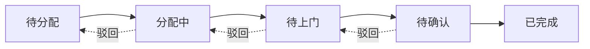

# 安装单模块需求 (Installation)

## 1. 模块概述 (Module Overview)

| 属性 | 说明 |
|:---|:---|
| **模块名称** | 安装单 (Install Task) |
| **核心价值** | 管理上门安装交付，确保订单履约闭环 |
| **目标用户** | 派单员、安装师傅、销售人员、店长 |
| **上游模块** | 订单、采购单 |
| **下游模块** | 对账单 (AP-劳务) |

## 2. 业务场景 (Business Scenario)

### 2.0 术语定义 (Terminology)

**驳回返工 (Immediate Rework)**:
*   **定义**: 现场验收不通过 → 状态回退至 `PENDING_VISIT` → 师傅当场或次日整改 → 使用**同一张**安装单
*   **触发场景**: 客户现场验收时发现问题，要求立即整改
*   **单据处理**: 不创建新安装单，在原单上进行状态回滚和重新提交
*   **结算处理**: 不产生新的工费结算，在原单的结算中体现

**售后返工 (After-Sales Rework)**:
*   **定义**: 交付 N 天后发现问题 → 创建**新**安装单 (Type=REWORK) → 关联原单 → 走独立结算流程
*   **触发场景**: 客户使用一段时间后发现质量问题，需要重新上门处理
*   **单据处理**: 创建新的安装单，`source_type` 为 `REWORK`，通过 `after_sales_id` 关联售后工单
*   **结算处理**: 产生独立的工费结算，与原单结算分离

**补装 (Supplement Installation)**:
*   **定义**: 因缺件、破损等原因导致部分未完成，后续补齐货物后进行补充安装
*   **触发场景**: 现场发现货物缺失或损坏，需要后续补货后再次上门
*   **单据处理**: 可选择创建新的补装单或在原单上进行部分安装标记
*   **结算处理**: 根据业务规则决定是否产生额外工费

### 2.1 典型场景
1. **单次安装**: 所有货物同时到达，一次性安装
2. **分批安装**: 到货批次不同，分多次安装
3. **部分安装**: 现场因缺件、破损等原因导致部分未完成，需触发补装或售后
4. **分类安装**: 窗帘/墙布等不同品类由不同师傅安装
5. **验收返工**: 客户验收不通过，需要返工
6. **售后返工**: 售后问题需要重新上门处理 (关联售后工单)
7. **安装评价**: 客户对安装服务进行评价

### 2.2 创建规则
*   **自动创建**: 订单进入 `PENDING_INSTALL` 状态时自动创建
*   **驳回返工**: 现场验收不通过时，状态回退至 `PENDING_VISIT`，不创建新安装单
*   **售后返工创建**: 售后工单定责为"返工"时，系统自动生成售后返工安装单（`source_type=REWORK`），并关联售后工单ID
*   **补装单创建**: 确认"部分安装"且有剩余未安装项时，自动触发补装单或关联售后
*   **拆分规则**:
    - 按品类拆分 (窗帘/墙布分开)
    - 按到货批次拆分

## 3. 状态流转 (State Machine)



| 状态 | 状态码 | 说明 | 触发动作 |
|:---|:---|:---|:---|
| **待分配** | `PENDING_DISPATCH` | 等待派单员调度 | 货物到达时自动生成 |
| **分配中** | `DISPATCHING` | 已指派师傅，待接单 (含金额确认) | 派单员点击"指派" |
| **待上门** | `PENDING_VISIT` | 师傅已接单 (确认金额) | 师傅点击"接单" |
| **待确认** | `PENDING_CONFIRM` | 安装完成待验收 | 师傅上传完工照片 |
| **已完成** | `COMPLETED` | 验收通过 | 销售点击"确认验收" |

### 3.1 状态回滚/驳回机制

| 当前状态 | 可驳回至 | 触发场景 | 操作人 | 单据处理 |
|:---|:---|:---|:---|:---|
| **待确认** | 待上门 | 验收不通过，要求驳回返工 | 销售 | 使用同一张安装单，不创建新单 |
| **待上门** | 分配中 | 师傅临时无法上门 | 师傅/派单员 | 使用同一张安装单 |
| **分配中** | 待分配 | 师傅拒绝接单 | 师傅/派单员 | 使用同一张安装单 |

**驳回规范**:
*   必须填写驳回原因
*   从"待确认"驳回时，完工照片保留但标记为"待返工"
*   驳回次数 ≥ 3 次自动升级预警给店长
*   **驳回返工**与**售后返工**的区别：
    - **驳回返工**: 现场验收不通过，状态回退，使用同一张安装单
    - **售后返工**: 交付后发现问题，创建新安装单（`source_type=REWORK`）

### 3.2 状态联动 (驱动订单)

| 安装单状态 | 订单状态变化条件 |
|:---|:---|
| 任一安装单创建 | 订单进入 `PENDING_INSTALL` |
| **所有**安装单 `COMPLETED` | 订单 → `COMPLETED` |

## 4. 核心字段定义 (Field Definitions)

### 4.1 安装单主表 (install_tasks)

| 字段名 | 类型 | 必填 | 说明 |
|:---|:---|:---|:---|
| id | UUID | ✓ | 主键 |
| task_no | String | ✓ | 安装单号 (IT20260101001) |
| source_type | Enum | ✓ | 来源 (ORDER/AFTER_SALES/REWORK) |
| **ORDER**: 订单自动创建的安装单
| **AFTER_SALES**: 售后工单创建的安装单
| **REWORK**: 售后返工创建的安装单（关联原安装单）
| order_id | UUID | ✓ | 关联订单 |
| after_sales_id | UUID | - | 关联售后工单 (溯源字段，用于售后返工) |
| customer_id | UUID | ✓ | 关联客户 |
| customer_name | String | ✓ | 客户姓名 (冗余) |
| customer_phone | String | ✓ | 客户电话 (冗余) |
| address | String | ✓ | 安装地址 |
| category | Enum | ✓ | 品类 (CURTAIN/WALLCLOTH/...) |
| status | Enum | ✓ | 状态 |
| sales_id | UUID | ✓ | 归属销售 (验收人) |
| dispatcher_id | UUID | - | 派单员 |
| installer_id | UUID | - | 安装师傅 |
| installer_name | String | - | 师傅姓名 (冗余) |
| scheduled_date | Date | - | 预约日期 |
| scheduled_time_slot | String | - | 时段 (上午/下午/晚间) |
| actual_start_at | DateTime | - | 实际开始时间 |
| actual_end_at | DateTime | - | 实际结束时间 |
| check_in_location | Point | - | 签到 GPS |
| check_in_at | DateTime | - | 签到时间 |
| check_out_location | Point | - | 签退 GPS |
| check_out_at | DateTime | - | 签退时间 |
| customer_signature_url | String | - | 客户电子签名 URL |
| signed_at | DateTime | - | 客户签名时间 |
| logistics_ready_status | Boolean | ✓ | 货齐状态 (是否允许派单) |
| labor_fee | Decimal | - | 预估工费 |
| actual_labor_fee | Decimal | - | 实际工费 |
| fee_breakdown | JSONB | - | 工费明细 (基础费+加项费) |
| rating | Integer | - | 客户评分 (1-5) |
| rating_comment | Text | - | 评价内容 |
| remark | Text | - | 备注 |
| reject_count | Integer | ✓ | 驳回次数 |
| created_at | DateTime | ✓ | 创建时间 |
| completed_at | DateTime | - | 完成时间 |

### 4.2 安装明细表 (install_items)

| 字段名 | 类型 | 必填 | 说明 |
|:---|:---|:---|:---|
| id | UUID | ✓ | 主键 |
| install_task_id | UUID | ✓ | 关联安装单 |
| order_item_id | UUID | ✓ | 关联订单明细 |
| product_name | String | ✓ | 商品名称 |
| room_name | String | ✓ | 空间名称 |
| quantity | Decimal | ✓ | 应装数量 |
| actual_installed_quantity | Decimal | - | 实际安装数量 |
| issue_category | Enum | - | 异常分类 (NONE/MISSING/DAMAGED/WRONG_SIZE) |
| is_installed | Boolean | ✓ | 是否已安装 |

### 4.3 完工照片表 (install_photos)

| 字段名 | 类型 | 必填 | 说明 |
|:---|:---|:---|:---|
| id | UUID | ✓ | 主键 |
| install_task_id | UUID | ✓ | 关联安装单 |
| photo_type | Enum | ✓ | 类型 (BEFORE/AFTER/DETAIL) |
| photo_url | String | ✓ | 图片 URL |
| room_name | String | - | 关联空间 |
| remark | String | - | 图片说明 |
| created_at | DateTime | ✓ | 上传时间 |

## 5. 界面设计 (UI Design)

### 5.1 列表页 (Install Task List)

#### 展示字段
| 字段 | 宽度 | 说明 |
|:---|:---|:---|
| 安装单号 | 130px | 可点击跳转 |
| 客户 | 100px | 姓名+电话 |
| 地址 | 150px | 截断显示 |
| 品类 | 80px | 窗帘/墙布等 |
| 状态 | 80px | 状态标签 |
| 师傅 | 80px | - |
| 预约日期 | 100px | - |
| 操作 | 150px | 按钮组 |

#### Tab 分组
| Tab | 说明 |
|:---|:---|
| 待分配 | 需要派单 |
| 待上门 | 今日/明日待上门 |
| 待确认 | 待验收 |
| 已完成 | 历史记录 |

#### 筛选条件
| 筛选项 | 组件 | 说明 |
|:---|:---|:---|
| 日期范围 | `DateRangePicker` | 预约日期 |
| 状态 | `Select` | 全部状态 |
| 品类 | `Select` | 窗帘/墙布等 |
| 师傅 | `Select` | 派单员可见全部 |
| 销售 | `Select` | 店长可见 |

#### 高级筛选模式

点击"高级筛选"按钮展开更多筛选条件：
| 筛选项 | 组件 | 说明 |
|:---|:---|:---|
| 货齐状态 | `Switch` | 仅显示货齐可派单 |
| 驳回次数 | `Select` | ≥1次 / ≥2次 / ≥3次 |
| 评分区间 | `Slider` | 1-5星筛选 |
| 创建时间 | `DateRangePicker` | 安装单创建日期 |

#### 操作按钮
| 按钮 | 条件 | 说明 |
|:---|:---|:---|
| **指派** | 待分配 | 选择师傅、预约时间 |
| **重新指派** | 分配中/待上门 | 更换师傅 |
| **确认验收** | 待确认 | 销售确认 |
| **驳回返工** | 待确认 | 销售驳回 |

### 5.1.1 日历调度视图

**目的**: 派单员可视化查看师傅排期，优化调度效率

**视图布局**:
```
┌────────────────────────────────────────────────────────────┐
│  ← 2026年1月 →                                  [周视图]   │
├────────────────────────────────────────────────────────────┤
│        │ 周一   │ 周二   │ 周三   │ 周四   │ 周五   │       │
│ 师傅   │ 1/13   │ 1/14   │ 1/15   │ 1/16   │ 1/17   │       │
├────────┼────────┼────────┼────────┼────────┼────────┤       │
│ 张师傅 │ ■■     │ ■      │        │ ■■■    │ ■      │       │
│ 李师傅 │ ■      │ ■■     │ ■      │        │ ■■     │       │
│ 王师傅 │        │ ■      │ ■■     │ ■      │        │       │
└────────────────────────────────────────────────────────────┘
  ■ 表示该时段已有任务（颜色区分状态）
```

**功能特性**:
*   **视图切换**: 支持日/周/月视图
*   **颜色编码**: 不同状态用不同颜色标识（待上门=蓝色，已完成=绿色，驳回=红色）
*   **快速派单**: 点击空白时段可直接派单
*   **任务详情**: 悬浮显示任务概要信息
*   **拖拽调整**: 支持拖拽任务调整时间

**数据结构**:
```typescript
interface CalendarTask {
  id: string;
  taskNo: string;
  customerName: string;
  address: string;
  scheduledDate: Date;
  scheduledTimeSlot: string;
  status: InstallTaskStatus;
  installerId: string;
}
```

### 5.1.2 智能师傅推荐

**目的**: 在派单时智能推荐最合适的师傅，减少派单员决策负担

**推荐因素** (按权重排序):
| 因素 | 权重 | 说明 |
|:---|:---|:---|
| 地理距离 | 30% | 师傅当前/上一个任务地址与目标地址的距离 |
| 时段可用性 | 25% | 目标时段是否空闲 |
| 品类匹配 | 20% | 师傅擅长的品类（窗帘/墙布/综合） |
| 历史评分 | 15% | 师傅的客户评分平均值 |
| 当日负载 | 10% | 当日已分配任务数量 |

**推荐算法**:
```typescript
interface WorkerRecommendation {
  workerId: string;
  workerName: string;
  score: number;          // 综合评分 0-100
  distance?: number;      // 预估距离 (km)
  availableSlots: string[]; // 可用时段
  todayTaskCount: number; // 当日任务数
  avgRating: number;      // 历史平均评分
  matchReasons: string[]; // 推荐理由
}

async function getRecommendedWorkers(
  taskId: string,
  targetDate: Date
): Promise<WorkerRecommendation[]>;
```

**UI 展示**:
*   指派对话框中，师傅下拉框优先显示推荐人选
*   显示推荐理由标签（如："距离最近"、"当日空闲"、"好评率高"）
*   支持切换"全部师傅"查看完整列表


### 5.2 详情页 (Install Task Detail)

#### 页面布局
```
┌─────────────────────────────────────────────────────┐
│ 安装单详情 #IT20260101001         [确认验收] [驳回] │
├──────────────────────┬──────────────────────────────┤
│ 客户信息             │ 状态进度条                   │
│ 姓名/电话/地址       │ [分配→上门→确认→完成]       │
├──────────────────────┼──────────────────────────────┤
│ 派单信息             │ 完工照片                     │
│ 师傅/预约时间/工费   │ (Before/After 对比)          │
├──────────────────────┴──────────────────────────────┤
│ 安装明细 (商品列表)                                  │
├─────────────────────────────────────────────────────┤
│ 操作日志 / 驳回记录                                  │
└─────────────────────────────────────────────────────┘
```

#### 派单信息卡片
| 字段 | 组件 | 说明 |
|:---|:---|:---|
| 指派师傅 | `Select` (支持搜索) | 师傅列表 |
| 预约日期 | `DatePicker` | - |
| 时段 | `Select` | 上午/下午/晚间 |
| 预估工费 | `InputNumber` | - |
| 备注 | `TextArea` | 给师傅的备注 |

#### 完工照片区
使用 `Image.PreviewGroup` 组件：
*   分组显示：安装前 / 安装后 / 细节图
*   支持放大查看
*   显示拍摄时间和位置

#### 验收/驳回弹窗

**确认验收**
| 字段 | 组件 | 说明 |
|:---|:---|:---|
| 验收结果 | `Radio` | 通过/不通过 |
| 实际工费 | `InputNumber` | 可调整 |
| 客户评分 | `Rate` | 1-5星 |
| 评价内容 | `TextArea` | 可选 |

**驳回返工**
| 字段 | 组件 | 必填 | 说明 |
|:---|:---|:---|:---|
| 驳回原因 | `Select` | ✓ | 预设原因 |
| 详细说明 | `TextArea` | - | 补充描述 |
| 预约返工日期 | `DatePicker` | - | 可选 |

### 5.3 小程序端 (师傅作业端)

#### 任务列表
*   显示今日/明日待办任务
*   可按时间/距离排序
*   支持一键导航

#### 任务详情
*   客户信息 + 一键拨打
*   安装明细 (空间/商品)
*   签到功能 (获取 GPS)

#### 完工上传
| 操作 | 说明 |
|:---|:---|
| 拍照 | 调用相机，支持多张 |
| 选择类型 | 安装前/安装后/细节 |
| 关联空间 | 选择空间标注 |
| 签退 | 签退功能，记录离场时间和位置 |
| 客户签名 | 电子签名板，客户确认 |
| 提交 | 压缩后上传 |

#### 5.3.4 签名交互

**流程说明**:
1. 师傅在小程序展示"验收单预览"
2. 客户使用手指/触控笔在屏幕签字
3. 生成带水印的签名图片并上传

**签名界面布局**:
```
┌─────────────────────────────────────┐
│ 验收单预览                           │
│ 安装单号: IT20260101001              │
│ 客户: 张三                           │
│ 地址: xxx                           │
├─────────────────────────────────────┤
│                                     │
│   [签名画布区域]                     │
│                                     │
│   请在此区域签字                     │
│                                     │
├─────────────────────────────────────┤
│ [清除] [确认签名]                   │
└─────────────────────────────────────┘
```

**签名功能要求**:
*   支持手指/触控笔手写签名
*   支持清除重签
*   签名图片自动添加水印（包含安装单号、时间戳）
*   签名完成后自动上传并保存 `customer_signature_url`
*   记录签名时间到 `signed_at` 字段

**技术实现**:
*   使用微信小程序 Canvas 2D API 实现签名画布
*   签名图片格式：PNG（支持透明背景）
*   图片尺寸：建议 800x400 像素
*   水印内容：安装单号、签名时间（格式：YYYY-MM-DD HH:mm）

**小程序水印签名实现示例**:

```javascript
// pages/signature/signature.js
Page({
  data: {
    taskNo: 'IT20260101001',
    canvasWidth: 750,
    canvasHeight: 400
  },

  onReady() {
    // 初始化 Canvas 2D 上下文
    const query = wx.createSelectorQuery();
    query.select('#signatureCanvas')
      .fields({ node: true, size: true })
      .exec((res) => {
        const canvas = res[0].node;
        const ctx = canvas.getContext('2d');
        
        // 设置画布尺寸
        const dpr = wx.getSystemInfoSync().pixelRatio;
        canvas.width = this.data.canvasWidth * dpr;
        canvas.height = this.data.canvasHeight * dpr;
        ctx.scale(dpr, dpr);
        
        // 设置签名笔触样式
        ctx.strokeStyle = '#000000';
        ctx.lineWidth = 3;
        ctx.lineCap = 'round';
        ctx.lineJoin = 'round';
        
        this.canvas = canvas;
        this.ctx = ctx;
      });
  },

  // 添加水印并导出图片
  async exportWithWatermark() {
    const { ctx, canvas } = this;
    const { taskNo, canvasWidth, canvasHeight } = this.data;
    
    // 绘制水印
    ctx.save();
    ctx.font = '14px sans-serif';
    ctx.fillStyle = 'rgba(0, 0, 0, 0.3)';
    
    // 水印内容：安装单号 + 时间戳
    const timestamp = this.formatDate(new Date());
    const watermarkText = `${taskNo} | ${timestamp}`;
    
    // 右下角水印位置
    const textWidth = ctx.measureText(watermarkText).width;
    ctx.fillText(watermarkText, canvasWidth - textWidth - 10, canvasHeight - 15);
    ctx.restore();
    
    // 导出为临时文件
    return new Promise((resolve, reject) => {
      wx.canvasToTempFilePath({
        canvas: canvas,
        fileType: 'png',
        quality: 1,
        success: (res) => resolve(res.tempFilePath),
        fail: reject
      });
    });
  },

  formatDate(date) {
    const pad = n => n.toString().padStart(2, '0');
    return `${date.getFullYear()}-${pad(date.getMonth() + 1)}-${pad(date.getDate())} ${pad(date.getHours())}:${pad(date.getMinutes())}`;
  },

  // 清除画布
  clearCanvas() {
    this.ctx.clearRect(0, 0, this.data.canvasWidth, this.data.canvasHeight);
  }
});
```

**WXML 模板**:
```xml
<!-- pages/signature/signature.wxml -->
<view class="signature-container">
  <view class="header">
    <text>验收单预览</text>
    <text>安装单号: {{taskNo}}</text>
  </view>
  
  <canvas 
    type="2d" 
    id="signatureCanvas" 
    class="signature-canvas"
    bindtouchstart="onTouchStart"
    bindtouchmove="onTouchMove"
    bindtouchend="onTouchEnd"
  />
  
  <view class="actions">
    <button bindtap="clearCanvas">清除重签</button>
    <button type="primary" bindtap="confirmSignature">确认签名</button>
  </view>
</view>
```

**水印样式建议**:
*   字体：14px sans-serif，半透明黑色 (rgba 0.3)
*   位置：右下角，边距 10-15px
*   内容格式：`安装单号 | YYYY-MM-DD HH:mm`


#### 离线模式 (Offline Mode)
*   **场景**: 地下室/新楼盘无信号
*   **机制**:
    *   数据本地缓存 (IndexedDB)
    *   无网状态下允许签到、拍照、保存草稿
    *   恢复网络后自动同步上传
    *   冲突处理：以最后修改时间为准

## 6. 业务规则 (Business Rules)

### 6.1 自动创建规则
*   订单状态 → `PENDING_INSTALL` 时触发
*   按品类自动拆分
*   继承订单的客户信息和地址

### 6.2 派单与价格确认规则
*   派单员指派时需确认预估工费
*   师傅接单即视为**确认接受该工费金额**
*   后续无变更项不得随意调整工费

### 6.2.1 强制派单规则

**目的**: 允许管理员在特殊情况下跳过系统校验，强制完成派单

**触发场景**:
*   货齐状态未满足但业务需要紧急安装
*   师傅调度存在软冲突但已确认可以执行
*   其他需要人工判断覆盖系统规则的场景

**实现方式**:
*   派单接口增加 `force: boolean` 参数
*   `force=true` 时跳过物流校验和软冲突检测
*   硬冲突（同一时段同一师傅已有任务）仍不可跳过

**审计要求**:
*   强制派单操作需记录操作日志
*   记录操作人、时间、跳过的校验项

**权限控制**:
*   仅派单员和店长可使用强制派单
*   系统可配置是否启用强制派单功能

### 6.7 调度防撞规则

**目的**: 防止师傅在同一时段被指派多个任务，避免调度冲突

**强冲突检测**:
*   **定义**: 同一师傅在同一时段（如 14:00-16:00）已存在 `PENDING_VISIT` 状态的任务
*   **处理**: 禁止指派，系统弹出强冲突提示
*   **提示内容**: "该师傅在 14:00-16:00 已有安装任务 IT20260101002，请调整时间或更换师傅"

**软冲突检测**:
*   **定义**: 前后任务地理位置相距超过 50km，且间隔时间 < 2小时
*   **处理**: 触发"赶场风险"警告，但仍允许强制指派
*   **提示内容**: "警告：该师傅上一个任务距离 60km，间隔仅 1.5 小时，可能存在赶场风险，是否继续？"
*   **强制指派**: 派单员点击"继续指派"后，系统记录警告日志

**检测时机**:
*   派单员点击"指派"按钮时实时检测
*   派单员修改预约时间时重新检测

**检测算法**:
```typescript
async function checkSchedulingConflict(
  installerId: string,
  scheduledDate: Date,
  timeSlot: string,
  address: string
): Promise<{ hasConflict: boolean; conflictType: 'HARD' | 'SOFT' | 'NONE'; message?: string }> {
  // 1. 检查强冲突（同一时段）
  const existingTasks = await getInstallTasksByInstaller(installerId, scheduledDate);
  const timeSlotRange = parseTimeSlot(timeSlot); // { start: '14:00', end: '16:00' }
  
  for (const task of existingTasks) {
    if (task.status === 'PENDING_VISIT') {
      const taskTimeSlot = parseTimeSlot(task.scheduled_time_slot);
      if (isTimeOverlap(timeSlotRange, taskTimeSlot)) {
        return {
          hasConflict: true,
          conflictType: 'HARD',
          message: `该师傅在 ${timeSlot} 已有安装任务 ${task.task_no}`
        };
      }
    }
  }
  
  // 2. 检查软冲突（地理位置和时间间隔）
  const previousTask = await getPreviousTask(installerId, scheduledDate, timeSlotRange.start);
  if (previousTask) {
    const distance = await calculateDistance(address, previousTask.address);
    const timeInterval = calculateTimeInterval(previousTask.scheduled_time_slot, timeSlotRange.start);
    
    if (distance > 50 && timeInterval < 2) {
      return {
        hasConflict: true,
        conflictType: 'SOFT',
        message: `警告：该师傅上一个任务距离 ${distance}km，间隔仅 ${timeInterval} 小时，可能存在赶场风险`
      };
    }
  }
  
  return { hasConflict: false, conflictType: 'NONE' };
}
```

### 6.3 签到签退规则
*   **签到**: 师傅到达现场需签到，记录 GPS 和时间，保存到 `check_in_location` 和 `check_in_at`
*   **签退**: 师傅完成安装后需签退，记录离场 GPS 和时间，保存到 `check_out_location` 和 `check_out_at`
*   **签退时机**:
    - 方式一：师傅在完工提交前手动点击"签退"按钮
    - 方式二：将签退动作与完工提交合并，点击"完工提交"时自动捕获当前位置和时间作为签退数据
*   **实际工时计算**: `actual_end_at - actual_start_at`，用于绩效分析和争议处理
*   **争议证明**: 签退记录可用于证明师傅的离场时间，在客户投诉时提供证据

### 6.4 完工与部分安装规则
*   **正常完工**: 所有明细安装完成，上传照片，客户签名
*   **部分安装**:
    *   标记未安装项及原因 (缺件/破损/尺寸不对)
    *   填写实际安装数量
    *   系统自动触发补装单或关联售后工单
*   **照片要求**: 必须上传至少 1 张"安装后"照片
*   **自动流转**: 上传完成后自动流转到"待确认"

### 6.5 工费计算
*   预估工费：派单时填写
*   实际工费：验收时可调整
*   差额需填写原因

### 6.6 评价规则
*   验收时可填写评价
*   评分影响师傅排名
*   评分 ≤ 2 自动触发店长关注

## 7. 权限控制 (Permission Matrix)

### 7.1 页面级权限

| 页面 | 销售 | 派单员 | 师傅 | 店长 |
|:---|:---|:---|:---|:---|
| 安装单列表 | ✓ (本人) | ✓ (全部) | ✓ (本人) | ✓ |
| 安装单详情 | ✓ (本人) | ✓ | ✓ (本人) | ✓ |
| 指派师傅 | ✗ | ✓ | ✗ | ✓ |

### 7.2 按钮级权限

| 操作 | 销售 | 派单员 | 师傅 | 店长 |
|:---|:---|:---|:---|:---|
| 指派 | ✗ | ✓ | ✗ | ✓ |
| 接单 | ✗ | ✗ | ✓ | ✗ |
| 签到 | ✗ | ✗ | ✓ | ✗ |
| 上传照片 | ✗ | ✗ | ✓ | ✗ |
| 确认验收 | ✓ | ✗ | ✗ | ✓ |
| 驳回 | ✓ | ✓ | ✗ | ✓ |
| 调整工费 | ✗ | ✓ | ✗ | ✓ |

### 7.3 数据范围权限

| 角色 | 可见范围 |
|:---|:---|
| 销售 | 自己负责的订单关联的安装单 |
| 派单员 | 全部待派/已派安装单 |
| 师傅 | 分配给自己的安装单 |
| 店长 | 本店全部安装单 |

## 8. 通知与提醒 (Notifications)

| 触发事件 | 通知对象 | 渠道 | 内容 |
|:---|:---|:---|:---|
| 安装单创建 | 派单员 | 系统+飞书 | 有新安装单待派单 |
| 指派成功 | 师傅 | 小程序+短信 | 有新安装任务 |
| 师傅接单 | 销售+派单员 | 系统 | 师傅已接单 |
| 师傅签到 | 销售 | 系统 | 师傅已到达现场 |
| 完工待验收 | 销售 | 系统+飞书 | 安装完成待验收 |
| 验收驳回 | 师傅+派单员 | 系统 | 验收不通过需返工 |
| 验收通过 | 师傅 | 系统 | 安装验收通过 |
| 今日任务提醒 | 师傅 | 小程序 | 今日有 N 个安装任务 |

## 9. 与其他模块的关联 (Module Relations)

| 模块 | 关联方式 | 数据流向 |
|:---|:---|:---|
| **订单** | InstallTask.order_id → Order.id | 订单 → 安装单 |
| **客户** | InstallTask.customer_id → Customer.id | - |
| **对账单-劳务** | 完成后生成工费结算 | 安装单 → 对账 |
| **售后** | 追溯原安装任务 | 安装单 → 售后 |
| **数据报表** | 效率分析、评价排名 | 安装单 → 报表 |

## 10. 物流与库存状态联动

### 10.1 货齐状态校验

**目的**: 防止"货没到齐，师傅到了"的空跑情况

**业务规则**:
*   安装单在 `PENDING_INSTALL` 阶段与物流单状态挂钩
*   只有当所有关联的采购单（面料、轨道、辅料）满足货齐条件，系统才允许派单员执行"指派"动作
*   `logistics_ready_status` 字段实时更新，反映货齐状态

**货齐状态判定**:

采购单状态满足以下任一条件即视为"货齐"：
| 状态码 | 说明 |
|:---|:---|
| `RECEIVED` | 已签收 |
| `ARRIVED` | 已到货 |
| `COMPLETED` | 已完成（全部入库） |
| `PARTIAL_RECEIVED` | 部分到货（业务评估后可派单） |

> **注意**: `PARTIAL_RECEIVED` 状态允许货齐检测通过，但派单员应确认缺失货物不影响本次安装。

**校验逻辑**:
```typescript
const READY_STATUSES = ['RECEIVED', 'ARRIVED', 'COMPLETED', 'PARTIAL_RECEIVED'];

async function checkLogisticsReady(orderId: string): Promise<{ ready: boolean; message?: string }> {
  // 获取订单关联的所有采购单
  const purchaseOrders = await getPurchaseOrdersByOrderId(orderId);
  
  if (purchaseOrders.length === 0) {
    // 无采购单（库存发货或无需采购），允许派单
    return { ready: true };
  }
  
  // 检查所有采购单的物流状态
  const unreadyPos = purchaseOrders.filter(po => {
    const status = po.status?.toUpperCase() || '';
    return !READY_STATUSES.includes(status);
  });
  
  if (unreadyPos.length > 0) {
    const names = unreadyPos.map(p => `${p.poNo} (${p.status})`).join(', ');
    return {
      ready: false,
      message: `关联采购单尚未全部到货: ${names}`
    };
  }
  
  return { ready: true };
}
```

**UI 提示**:
*   在安装单列表页，货齐状态用图标标识
*   派单时，如果货齐状态为 false，弹出警告提示
*   支持查看各采购单的物流进度

### 10.2 物流状态同步

**触发时机**:
*   采购单物流状态更新时
*   安装单创建时

**同步逻辑**:
*   实时更新 `logistics_ready_status`
*   状态变化时发送通知给派单员

## 11. 工费精算模型

### 11.1 工费构成

**工费 = 基础费 + 加项费**

| 费用类型 | 说明 | 计算方式 |
|:---|:---|:---|
| **基础费** | 按轨道长度/窗户数量 | 轨道长度 × 单价 或 窗户数量 × 单价 |
| **高空作业费** | 挑空客厅，需自带脚手架 | 固定金额 |
| **超远路费** | 超出服务范围的里程费 | (实际里程 - 服务半径) × 单价 |
| **特种墙体打孔费** | 水泥/特种墙体额外收费 | 固定金额 × 打孔数量 |

### 11.2 工费明细数据结构

**fee_breakdown 字段结构**:
```json
{
  "base_fee": {
    "amount": 100.00,
    "description": "基础安装费",
    "calculation": "轨道长度 5米 × 20元/米"
  },
  "additional_fees": [
    {
      "type": "HIGH_ALTITUDE",
      "amount": 50.00,
      "description": "高空作业费",
      "quantity": 1
    },
    {
      "type": "LONG_DISTANCE",
      "amount": 30.00,
      "description": "超远路费",
      "quantity": 3,
      "unit": "公里"
    },
    {
      "type": "SPECIAL_WALL",
      "amount": 20.00,
      "description": "特种墙体打孔费",
      "quantity": 2
    }
  ],
  "total_amount": 200.00
}
```

### 11.3 工费计算界面

**派单时填写**:
| 字段 | 组件 | 说明 |
|:---|:---|:---|
| 基础费 | `InputNumber` | 自动计算或手动输入 |
| 高空作业费 | `Switch` + `InputNumber` | 开启后输入金额 |
| 超远路费 | `Switch` + `InputNumber` | 开启后输入里程 |
| 特种墙体打孔费 | `Switch` + `InputNumber` | 开启后输入数量 |
| 预估工费 | `InputNumber` | 自动汇总 (只读) |

**验收时调整**:
*   可调整各项费用
*   差额需填写原因
*   调整记录保存到操作日志

### 11.4 工费结算联动

**与对账单模块联动**:
*   安装单状态 → `COMPLETED` 时，自动在 `ap_statements` (类型为 LABOR) 中插入记录
*   `fee_breakdown` 同步至结算明细
*   关联 `worker_id` (installer_id)

**异常处理**:
*   如果安装单被"驳回返工"，暂停该笔费用的结算生成
*   直到下一次完成才生成结算

## 12. 现场标准化作业

### 12.1 标准化操作清单 (Checklist)

**目的**: 强制师傅进行标准化交付，确保销售在"确认验收"时看到的照片是具备营销价值的

**Checklist 内容**:
| 检查项 | 说明 | 照片要求 |
|:---|:---|:---|
| 轨道滑轮运行是否顺滑 | 测试滑轮滑动 | 细节图 |
| 窗帘是否已用蒸汽挂烫机进行垂直熨烫 | 蒸汽熨烫定型 | 安装后图 |
| 褶皱是否已按工艺要求进行手工调整 | 记忆定型 | 细节图 |
| 现场垃圾是否已清理并带走 | 现场清洁 | 安装后图 |

### 12.2 小程序端 Checklist 界面

**完工上传步骤**:
1. **完成 Checklist**
   *   逐项勾选检查项
   *   未完成项无法提交

2. **上传照片**
   *   按检查项分类上传
   *   每项至少 1 张照片

3. **提交完工**
   *   所有检查项完成才允许提交
   *   提交后状态流转到"待确认"

**UI 示例**:
```
┌─────────────────────────────────────┐
│ 标准化作业清单                       │
├─────────────────────────────────────┤
│ ✓ 轨道滑轮运行是否顺滑 [查看照片]    │
│ ✓ 窗帘是否已用蒸汽挂烫机进行垂直熨烫 [查看照片] │
│ ✓ 褶皱是否已按工艺要求进行手工调整 [查看照片]  │
│ ✓ 现场垃圾是否已清理并带走 [查看照片] │
├─────────────────────────────────────┤
│ [上传照片] [提交完工]                │
└─────────────────────────────────────┘
```

### 12.3 Checklist 数据结构

**新增字段**:
在 `install_tasks` 表中增加 `checklist_status` 字段

| 字段名 | 类型 | 说明 |
|:---|:---|:---|
| checklist_status | JSONB | Checklist 完成状态 |

**数据结构**:
```json
{
  "items": [
    {
      "id": "track_smooth",
      "name": "轨道滑轮运行是否顺滑",
      "completed": true,
      "completed_at": "2026-01-15T10:30:00Z",
      "photo_ids": ["photo_1", "photo_2"]
    },
    {
      "id": "steam_ironing",
      "name": "窗帘是否已用蒸汽挂烫机进行垂直熨烫",
      "completed": true,
      "completed_at": "2026-01-15T10:35:00Z",
      "photo_ids": ["photo_3"]
    }
  ],
  "all_completed": true,
  "completed_at": "2026-01-15T10:40:00Z"
}
```

## 13. 客户自助约时功能

### 13.1 功能概述

**目的**: 减轻派单员的电话沟通压力

**流程**:
1. 派单员指派师傅后
2. 系统发送飞书/短信给客户
3. 客户点击链接在师傅的"空闲时段"中选择时间
4. 选择后自动更新安装单的 `scheduled_date`

### 13.2 约时链接生成

**触发时机**: 派单员点击"指派"按钮后

**链接内容**:
```
https://your-domain.com/appointment/{install_task_id}
```

**链接有效期**: 24 小时

### 13.3 客户端界面

**页面布局**:
```
┌─────────────────────────────────────┐
│ 预约安装时间                         │
├─────────────────────────────────────┤
│ 师傅: 张师傅                        │
│ 安装地址: xxx                       │
├─────────────────────────────────────┤
│ 请选择预约时间:                     │
│                                     │
│ 2026-01-16 (明天)                   │
│ ○ 上午 09:00-12:00                 │
│ ○ 下午 14:00-17:00                 │
│ ○ 晚间 18:00-20:00                 │
│                                     │
│ 2026-01-17 (后天)                   │
│ ○ 上午 09:00-12:00                 │
│ ○ 下午 14:00-17:00                 │
│ ○ 晚间 18:00-20:00                 │
├─────────────────────────────────────┤
│ [确认预约]                          │
└─────────────────────────────────────┘
```

### 13.4 师傅空闲时段计算

**计算逻辑**:
```typescript
async function getInstallerAvailableSlots(
  installerId: string,
  date: Date
): Promise<string[]> {
  // 获取师傅当日所有任务
  const tasks = await getInstallerTasks(installerId, date);
  
  // 计算空闲时段
  const availableSlots = calculateAvailableSlots(tasks);
  
  return availableSlots;
}
```

**时段规则**:
*   上午: 09:00-12:00
*   下午: 14:00-17:00
*   晚间: 18:00-20:00

### 13.5 预约确认通知

**触发时机**: 客户确认预约后

**通知对象**:
*   师傅: 小程序推送
*   派单员: 系统通知
*   销售: 系统通知

**通知内容**:
```
客户已预约安装时间
时间: 2026-01-16 上午 09:00-12:00
地址: xxx
```

## 14. 现场发现与二次营销

### 14.1 功能概述

**目的**: 安装师傅是唯一能进入客户私密空间的环节，发现营销机会

**场景**: 师傅发现客户卧室的旧窗帘已损坏或不匹配，可在系统中标记"卧室窗帘待换新"

### 14.2 现场发现记录

**新增字段**:
在 `install_tasks` 表中增加 `field_discovery` 字段

| 字段名 | 类型 | 说明 |
|:---|:---|:---|
| field_discovery | JSONB | 现场发现记录 |

**数据结构**:
```json
{
  "discoveries": [
    {
      "id": "discovery_1",
      "type": "OLD_CURTAIN",
      "location": "卧室",
      "description": "旧窗帘已损坏，需要更换",
      "priority": "HIGH",
      "photos": ["photo_1", "photo_2"],
      "created_at": "2026-01-15T11:00:00Z"
    }
  ]
}
```

### 14.3 小程序端界面

**发现记录入口**:
*   在任务详情页增加"现场发现"按钮
*   点击后进入发现记录页面

**发现记录页面**:
```
┌─────────────────────────────────────┐
│ 现场发现                             │
├─────────────────────────────────────┤
│ + 添加发现                          │
├─────────────────────────────────────┤
│ [卧室] 旧窗帘已损坏，需要更换 [查看] │
│ 优先级: 高                          │
│ 2026-01-15 11:00                   │
└─────────────────────────────────────┘
```

### 14.4 与线索模块联动

**数据流向**:
1. 师傅记录现场发现
2. 系统自动在"线索模块"中创建线索
3. 销售跟进，实现 L2C 的二次循环

**线索创建逻辑**:
```typescript
async function createLeadFromDiscovery(
  installTaskId: string,
  discovery: FieldDiscovery
): Promise<void> {
  const installTask = await getInstallTask(installTaskId);
  
  // 创建线索
  await createLead({
    customerId: installTask.customer_id,
    type: 'REPEAT_PURCHASE',
    source: 'INSTALLATION',
    description: discovery.description,
    priority: discovery.priority,
    relatedOrderId: installTask.order_id,
    relatedInstallTaskId: installTaskId,
    photos: discovery.photos,
  });
}
```

### 14.5 销售端界面

**线索列表**:
*   标记来源为"安装现场发现"
*   显示优先级
*   可查看现场照片

**跟进记录**:
*   记录销售跟进情况
*   转化为订单后关联原安装单

## 15. 技术实施建议

### 15.1 数据库层 (Drizzle Schema)

```typescript
// 安装单主表
export const installTasks = pgTable('install_tasks', {
  id: uuid('id').defaultRandom().primaryKey(),
  taskNo: varchar('task_no', { length: 50 }).notNull().unique(),
  sourceType: varchar('source_type', { length: 20 }).notNull().default('ORDER'),
  orderId: uuid('order_id').notNull(),
  customerId: uuid('customer_id').notNull(),
  customerName: varchar('customer_name', { length: 100 }).notNull(),
  customerPhone: varchar('customer_phone', { length: 20 }).notNull(),
  address: text('address').notNull(),
  category: varchar('category', { length: 20 }).notNull(),
  status: varchar('status', { length: 20 }).notNull(),
  salesId: uuid('sales_id').notNull(),
  dispatcherId: uuid('dispatcher_id'),
  installerId: uuid('installer_id'),
  installerName: varchar('installer_name', { length: 100 }),
  scheduledDate: date('scheduled_date'),
  scheduledTimeSlot: varchar('scheduled_time_slot', { length: 20 }),
  actualStartAt: timestamp('actual_start_at'),
  actualEndAt: timestamp('actual_end_at'),
  checkInLocation: point('check_in_location'),
  checkInAt: timestamp('check_in_at'),
  logisticsReadyStatus: boolean('logistics_ready_status').notNull().default(false),
  laborFee: decimal('labor_fee', { precision: 10, scale: 2 }),
  actualLaborFee: decimal('actual_labor_fee', { precision: 10, scale: 2 }),
  feeBreakdown: jsonb('fee_breakdown'),
  checklistStatus: jsonb('checklist_status'),
  fieldDiscovery: jsonb('field_discovery'),
  rating: integer('rating'),
  ratingComment: text('rating_comment'),
  remark: text('remark'),
  rejectCount: integer('reject_count').notNull().default(0),
  createdAt: timestamp('created_at').defaultNow(),
  completedAt: timestamp('completed_at'),
});

// 安装明细表
export const installItems = pgTable('install_items', {
  id: uuid('id').defaultRandom().primaryKey(),
  installTaskId: uuid('install_task_id').notNull(),
  orderItemId: uuid('order_item_id').notNull(),
  productName: varchar('product_name', { length: 200 }).notNull(),
  roomName: varchar('room_name', { length: 100 }).notNull(),
  quantity: decimal('quantity', { precision: 10, scale: 2 }).notNull(),
  actualInstalledQuantity: decimal('actual_installed_quantity', { precision: 10, scale: 2 }),
  issueCategory: varchar('issue_category', { length: 20 }),
  isInstalled: boolean('is_installed').notNull().default(false),
  createdAt: timestamp('created_at').defaultNow(),
});

// 完工照片表
export const installPhotos = pgTable('install_photos', {
  id: uuid('id').defaultRandom().primaryKey(),
  installTaskId: uuid('install_task_id').notNull(),
  photoType: varchar('photo_type', { length: 20 }).notNull(),
  photoUrl: varchar('photo_url', { length: 500 }).notNull(),
  roomName: varchar('room_name', { length: 100 }),
  remark: text('remark'),
  createdAt: timestamp('created_at').defaultNow(),
});
```

### 15.2 业务逻辑层 (Server Actions)

```typescript
// 检查货齐状态
export async function checkLogisticsReady(
  installTaskId: string
): Promise<boolean> {
  const installTask = await getInstallTask(installTaskId);
  const order = await getOrder(installTask.orderId);
  
  const purchaseOrders = await getPurchaseOrdersByOrderId(order.id);
  
  for (const po of purchaseOrders) {
    const logistics = await getLogisticsByPurchaseOrderId(po.id);
    if (logistics.status !== 'RECEIVED' && logistics.status !== 'ARRIVED') {
      return false;
    }
  }
  
  await updateInstallTask(installTaskId, {
    logisticsReadyStatus: true,
  });
  
  return true;
}

// 计算工费
export async function calculateLaborFee(
  installTaskId: string,
  breakdown: FeeBreakdown
): Promise<number> {
  const baseFee = breakdown.base_fee.amount;
  const additionalFees = breakdown.additional_fees.reduce(
    (sum, fee) => sum + fee.amount,
    0
  );
  
  const totalAmount = baseFee + additionalFees;
  
  await updateInstallTask(installTaskId, {
    feeBreakdown: breakdown,
    laborFee: totalAmount,
  });
  
  return totalAmount;
}

// 完成 Checklist
export async function completeChecklist(
  installTaskId: string,
  checklistStatus: ChecklistStatus
): Promise<void> {
  const allCompleted = checklistStatus.items.every(
    item => item.completed
  );
  
  if (!allCompleted) {
    throw new Error('请完成所有检查项');
  }
  
  await updateInstallTask(installTaskId, {
    checklistStatus: {
      ...checklistStatus,
      all_completed: true,
      completed_at: new Date().toISOString(),
    },
  });
}

// 记录现场发现
export async function recordFieldDiscovery(
  installTaskId: string,
  discovery: FieldDiscovery
): Promise<void> {
  const installTask = await getInstallTask(installTaskId);
  const currentDiscovery = installTask.fieldDiscovery || { discoveries: [] };
  
  currentDiscovery.discoveries.push({
    ...discovery,
    id: `discovery_${Date.now()}`,
    created_at: new Date().toISOString(),
  });
  
  await updateInstallTask(installTaskId, {
    fieldDiscovery: currentDiscovery,
  });
  
  // 创建线索
  await createLeadFromDiscovery(installTaskId, discovery);
}

// 客户预约时间
export async function customerScheduleAppointment(
  installTaskId: string,
  scheduledDate: Date,
  scheduledTimeSlot: string
): Promise<void> {
  await updateInstallTask(installTaskId, {
    scheduledDate,
    scheduledTimeSlot,
  });
  
  // 发送通知
  await sendAppointmentNotification(installTaskId);
}

// 生成约时链接
export async function generateAppointmentLink(
  installTaskId: string
): Promise<string> {
  const token = generateSecureToken(installTaskId);
  return `https://your-domain.com/appointment/${token}`;
}

// 安装单完成，生成劳务结算
export async function completeInstallTask(
  installTaskId: string
): Promise<void> {
  const installTask = await getInstallTask(installTaskId);
  
  // 更新安装单状态
  await updateInstallTask(installTaskId, {
    status: 'COMPLETED',
    completedAt: new Date(),
  });
  
  // 生成劳务结算
  await createLaborSettlement(installTask);
}

// 创建劳务结算
async function createLaborSettlement(
  installTask: InstallTask
): Promise<void> {
  await createApStatement({
    statementNo: generateStatementNo(),
    statementType: 'LABOR',
    targetType: 'INSTALLER',
    targetId: installTask.installerId,
    targetName: installTask.installerName,
    installTaskId: installTask.id,
    installTaskNo: installTask.taskNo,
    totalAmount: installTask.actualLaborFee,
    feeBreakdown: installTask.feeBreakdown,
    status: 'PENDING',
  });
}
```

### 15.3 UI 组件层

```typescript
// 派单对话框 - 工费计算
export function DispatchDialog({ installTask }: { installTask: InstallTask }) {
  const [feeBreakdown, setFeeBreakdown] = useState<FeeBreakdown>({
    base_fee: { amount: 0, description: '', calculation: '' },
    additional_fees: [],
    total_amount: 0,
  });

  const handleCalculateFee = () => {
    const totalAmount = calculateTotalFee(feeBreakdown);
    setFeeBreakdown({
      ...feeBreakdown,
      total_amount: totalAmount,
    });
  };

  return (
    <Dialog>
      <DialogContent>
        <DialogHeader>
          <DialogTitle>指派师傅</DialogTitle>
        </DialogHeader>
        
        <div className="space-y-4">
          {/* 基础费 */}
          <div className="space-y-2">
            <Label>基础费</Label>
            <InputNumber
              value={feeBreakdown.base_fee.amount}
              onChange={(value) =>
                setFeeBreakdown({
                  ...feeBreakdown,
                  base_fee: {
                    ...feeBreakdown.base_fee,
                    amount: value,
                  },
                })
              }
            />
          </div>

          {/* 加项费 */}
          <div className="space-y-2">
            <Label>加项费</Label>
            {feeBreakdown.additional_fees.map((fee, index) => (
              <div key={index} className="flex gap-2">
                <Select
                  value={fee.type}
                  onChange={(value) => {
                    const newFees = [...feeBreakdown.additional_fees];
                    newFees[index].type = value;
                    setFeeBreakdown({
                      ...feeBreakdown,
                      additional_fees: newFees,
                    });
                  }}
                >
                  <SelectTrigger>
                    <SelectValue />
                  </SelectTrigger>
                  <SelectContent>
                    <SelectItem value="HIGH_ALTITUDE">高空作业费</SelectItem>
                    <SelectItem value="LONG_DISTANCE">超远路费</SelectItem>
                    <SelectItem value="SPECIAL_WALL">特种墙体打孔费</SelectItem>
                  </SelectContent>
                </Select>
                <InputNumber
                  value={fee.amount}
                  onChange={(value) => {
                    const newFees = [...feeBreakdown.additional_fees];
                    newFees[index].amount = value;
                    setFeeBreakdown({
                      ...feeBreakdown,
                      additional_fees: newFees,
                    });
                  }}
                />
              </div>
            ))}
            <Button onClick={() => {}}>添加加项费</Button>
          </div>

          {/* 总金额 */}
          <div className="space-y-2">
            <Label>预估工费</Label>
            <InputNumber
              value={feeBreakdown.total_amount}
              readOnly
            />
          </div>
        </div>

        <DialogFooter>
          <Button onClick={handleCalculateFee}>计算工费</Button>
          <Button onClick={() => {}}>确认指派</Button>
        </DialogFooter>
      </DialogContent>
    </Dialog>
  );
}

// Checklist 组件
export function ChecklistComponent({
  installTask,
  onComplete,
}: {
  installTask: InstallTask;
  onComplete: (checklistStatus: ChecklistStatus) => void;
}) {
  const [checklistItems, setChecklistItems] = useState<ChecklistItem[]>([
    {
      id: 'track_smooth',
      name: '轨道滑轮运行是否顺滑',
      completed: false,
      photo_ids: [],
    },
    {
      id: 'steam_ironing',
      name: '窗帘是否已用蒸汽挂烫机进行垂直熨烫',
      completed: false,
      photo_ids: [],
    },
    {
      id: 'memory_shaping',
      name: '褶皱是否已按工艺要求进行手工调整',
      completed: false,
      photo_ids: [],
    },
    {
      id: 'site_cleanup',
      name: '现场垃圾是否已清理并带走',
      completed: false,
      photo_ids: [],
    },
  ]);

  const handleToggleItem = (itemId: string) => {
    setChecklistItems(
      checklistItems.map((item) =>
        item.id === itemId
          ? { ...item, completed: !item.completed }
          : item
      )
    );
  };

  const handleComplete = () => {
    const allCompleted = checklistItems.every((item) => item.completed);
    if (!allCompleted) {
      alert('请完成所有检查项');
      return;
    }

    onComplete({
      items: checklistItems,
      all_completed: true,
      completed_at: new Date().toISOString(),
    });
  };

  return (
    <div className="space-y-4">
      <h3 className="text-lg font-bold">标准化作业清单</h3>
      {checklistItems.map((item) => (
        <div key={item.id} className="flex items-center gap-2">
          <Checkbox
            checked={item.completed}
            onChange={() => handleToggleItem(item.id)}
          />
          <span className={item.completed ? 'line-through' : ''}>
            {item.name}
          </span>
          {item.completed && (
            <Button variant="ghost" size="sm">
              查看照片
            </Button>
          )}
        </div>
      ))}
      <Button onClick={handleComplete}>提交完工</Button>
    </div>
  );
}

// 现场发现组件
export function FieldDiscoveryComponent({
  installTask,
  onRecord,
}: {
  installTask: InstallTask;
  onRecord: (discovery: FieldDiscovery) => void;
}) {
  const [discovery, setDiscovery] = useState<FieldDiscovery>({
    type: 'OLD_CURTAIN',
    location: '',
    description: '',
    priority: 'MEDIUM',
    photos: [],
  });

  const handleSubmit = () => {
    onRecord(discovery);
    setDiscovery({
      type: 'OLD_CURTAIN',
      location: '',
      description: '',
      priority: 'MEDIUM',
      photos: [],
    });
  };

  return (
    <div className="space-y-4">
      <h3 className="text-lg font-bold">现场发现</h3>
      <div className="space-y-2">
        <Label>发现类型</Label>
        <Select
          value={discovery.type}
          onChange={(value) =>
            setDiscovery({ ...discovery, type: value })
          }
        >
          <SelectTrigger>
            <SelectValue />
          </SelectTrigger>
          <SelectContent>
            <SelectItem value="OLD_CURTAIN">旧窗帘</SelectItem>
            <SelectItem value="WALL_DAMAGE">墙面损坏</SelectItem>
            <SelectItem value="OTHER">其他</SelectItem>
          </SelectContent>
        </Select>
      </div>
      <div className="space-y-2">
        <Label>位置</Label>
        <Input
          value={discovery.location}
          onChange={(e) =>
            setDiscovery({ ...discovery, location: e.target.value })
          }
        />
      </div>
      <div className="space-y-2">
        <Label>描述</Label>
        <TextArea
          value={discovery.description}
          onChange={(e) =>
            setDiscovery({ ...discovery, description: e.target.value })
          }
        />
      </div>
      <div className="space-y-2">
        <Label>优先级</Label>
        <Select
          value={discovery.priority}
          onChange={(value) =>
            setDiscovery({ ...discovery, priority: value })
          }
        >
          <SelectTrigger>
            <SelectValue />
          </SelectTrigger>
          <SelectContent>
            <SelectItem value="HIGH">高</SelectItem>
            <SelectItem value="MEDIUM">中</SelectItem>
            <SelectItem value="LOW">低</SelectItem>
          </SelectContent>
        </Select>
      </div>
      <div className="space-y-2">
        <Label>照片</Label>
        <Upload multiple onChange={(files) => {}} />
      </div>
      <Button onClick={handleSubmit}>记录发现</Button>
    </div>
  );
}
```

### 15.4 离线作业与电子签名实现

**电子签名组件 (React Signature Pad)**:
```typescript
import SignaturePad from 'react-signature-pad-wrapper';

export function CustomerSignature({ onConfirm }: { onConfirm: (blob: Blob) => void }) {
  const signatureRef = useRef<SignaturePad>(null);

  const handleClear = () => {
    signatureRef.current?.clear();
  };

  const handleConfirm = () => {
    if (signatureRef.current?.isEmpty()) {
      alert('请客户签名');
      return;
    }
    const dataUrl = signatureRef.current?.toDataURL();
    fetch(dataUrl!)
      .then(res => res.blob())
      .then(blob => onConfirm(blob));
  };

  return (
    <div className="border p-4 rounded">
      <h3 className="mb-2">客户确认签名</h3>
      <div className="border border-gray-300 h-40 mb-4">
        <SignaturePad ref={signatureRef} options={{ penColor: 'black' }} />
      </div>
      <div className="flex gap-2">
        <Button variant="outline" onClick={handleClear}>重写</Button>
        <Button onClick={handleConfirm}>确认签名</Button>
      </div>
    </div>
  );
}
```

**离线同步逻辑 (Service Worker + IndexedDB)**:
```typescript
import Dexie from 'dexie';

class InstallDatabase extends Dexie {
  tasks: Dexie.Table<InstallTask, string>;
  photos: Dexie.Table<OfflinePhoto, string>;

  constructor() {
    super('InstallDB');
    this.version(1).stores({
      tasks: 'id, status, syncStatus',
      photos: 'id, taskId, syncStatus'
    });
  }
}

const db = new InstallDatabase();

async function saveOfflineTask(task: InstallTask) {
  await db.tasks.put({
    ...task,
    syncStatus: 'PENDING',
    lastModified: new Date()
  });
  if ('serviceWorker' in navigator && 'SyncManager' in window) {
    const registration = await navigator.serviceWorker.ready;
    await registration.sync.register('sync-tasks');
  }
}

self.addEventListener('sync', (event) => {
  if (event.tag === 'sync-tasks') {
    event.waitUntil(syncPendingTasks());
  }
});
```

## 16. 多人协作 (TODO)

**背景**: 全屋定制或大型装企项目，往往需要两名师傅配合（如超大窗帘、高空作业）

**方案**: 增加 `install_team` 关联表，或将 `installer_id` 扩展为支持主/副手的结构

**字段设计**:
```typescript
// 安装团队表
export const installTeams = pgTable('install_teams', {
  id: uuid('id').defaultRandom().primaryKey(),
  installTaskId: uuid('install_task_id').notNull(),
  installerId: uuid('installer_id').notNull(),
  role: varchar('role', { length: 20 }).notNull(), // PRIMARY/ASSISTANT
  shareRatio: decimal('share_ratio', { precision: 5, scale: 2 }), // 工费分成比例
  createdAt: timestamp('created_at').defaultNow(),
});
```

**说明**: 此功能标记为 TODO，后续有需要时再开发
