# 审批流程需求 (Approval Workflow)

## 1. 模块概述 (Module Overview)

| 属性         | 说明                                                                     |
| :----------- | :----------------------------------------------------------------------- |
| **模块名称** | 审批流程 (Approval Workflow)                                             |
| **核心价值** | 为关键业务节点提供可视化配置的审批流能力，确保敏感操作有据可查、按规执行 |
| **目标用户** | 所有用户、管理员、超级管理员                                             |
| **上游模块** | 所有业务模块                                                             |
| **下游模块** | 所有业务模块                                                             |

## 2. 核心理念

### 2.1 设计原则

- **规则驱动**: 审批流由"触发条件 + 审批人 + 超时策略"构成，管理员可自由配置
- **可视化编排**: 提供拖拽式流程设计器，直观展示审批节点与流转路径
- **灵活扩展**: 支持串行审批、并行会签、条件分支等多种模式
- **自动化处理**: 支持超时自动升级、自动确认、自动驳回等机制

### 2.2 审批类型分类

系统中的审批可分为以下几类：

| 审批类型     | 说明               | 典型场景                             |
| :----------- | :----------------- | :----------------------------------- |
| **财务审批** | 涉及资金收付的审批 | 收款审批、付款审批、退款审批         |
| **业务审批** | 涉及业务流程的审批 | 撤单审批、免费测量审批、报价折扣审批 |
| **成本审批** | 涉及成本调整的审批 | 修改成本价审批、调整工费审批         |
| **定责审批** | 涉及责任判定的审批 | 售后定责审批、异议仲裁               |
| **特殊审批** | 特殊场景的审批     | 坏账核销审批、特殊工费核准           |

## 3. 可视化设计器 (Visual Designer)

### 3.1 设计器概述

审批流程设计器是管理员配置审批流的核心工具，支持拖拽式操作。

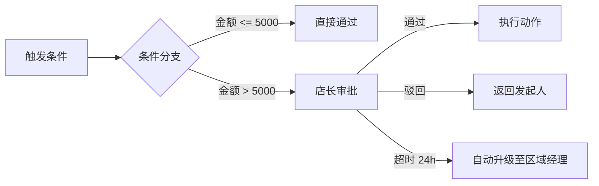

### 3.2 设计器界面

**界面布局**：

```
┌─────────────────────────────────────────────────────┐
│ 审批流程设计器                         [保存] [预览] │
├──────────────────────┬──────────────────────────────┤
│ 节点库               │ 画布区域                     │
│ ├─ 审批人节点         │                              │
│ ├─ 条件判断节点       │   [触发条件] → [审批节点]    │
│ ├─ 动作节点           │                              │
│ └─ 连线工具           │                              │
├──────────────────────┴──────────────────────────────┤
│ 属性面板                                           │
│ 节点类型: 审批人节点                                │
│ 审批人角色: 店长                                    │
│ 超时时长: 24小时                                    │
│ 超时动作: 自动升级                                  │
│ 通知方式: 系统+微信小程序+短信                                 │
└─────────────────────────────────────────────────────┘
```

### 3.3 节点类型

| 节点类型         | 说明               | 配置项                                            |
| :--------------- | :----------------- | :------------------------------------------------ |
| **审批人节点**   | 需要人工审批的节点 | 审批人角色/具体人员、超时时长、超时动作、通知方式 |
| **条件判断节点** | 根据条件进行分支   | 条件表达式（金额、角色、时间等）                  |
| **动作节点**     | 执行具体操作       | 通过动作、驳回动作、自动通过条件                  |

### 3.4 配置项说明

**审批人节点配置**：
| 配置项 | 说明 | 可选值 |
|:---|:---|:---|
| 审批人类型 | 审批人的确定方式 | role（角色）、user（具体人员）、dynamic（动态） |
| 审批人ID | 角色ID或用户ID | - |
| 超时时长 | 审批超时时间（小时） | 2、4、8、12、24、48等 |
| 超时动作 | 超时后的处理方式 | escalate（自动升级）、auto_approve（自动通过）、auto_reject（自动拒绝） |
| 通知方式 | 审批通知的发送渠道 | SYSTEM、FEISHU、SMS、WECHAT_OFFICIAL、WECHAT_MINI |

**条件判断节点配置**：
| 配置项 | 说明 | 示例 |
|:---|:---|:---|
| 条件字段 | 判断依据的字段 | amount（金额）、discount_rate（折扣率）等 |
| 条件操作符 | 比较方式 | >、>=、<、<=、==、!= |
| 条件值 | 比较的值 | 5000、0.1等 |
| 逻辑关系 | 多条件的组合关系 | AND、OR |

## 4. 预置审批场景

### 4.1 收款审批

**场景说明**：销售提交收款单后，需要审核通过才能生效。

#### 4.1.1 触发场景

| 场景                 | 触发条件                       | 收款单类型         |
| :------------------- | :----------------------------- | :----------------- |
| **线索阶段收定金**   | 线索未转报价，销售创建预收款   | 预收款（PREPAID）  |
| **报价单阶段收定金** | 报价单未转订单，销售创建预收款 | 预收款（PREPAID）  |
| **订单转化收款**     | 报价单转订单时，上传收款凭证   | 普通收款（NORMAL） |

#### 4.1.2 审批流程

根据**租户规模**和**收款金额**分级审批：

**小规模租户（店长=老板）**：

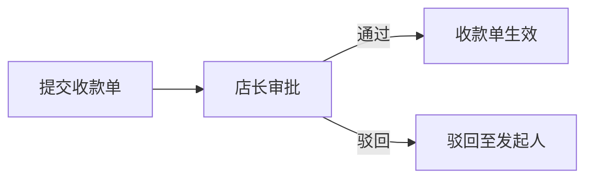

**大规模租户（店长≠老板）**：

小额收款（< 1万元）：

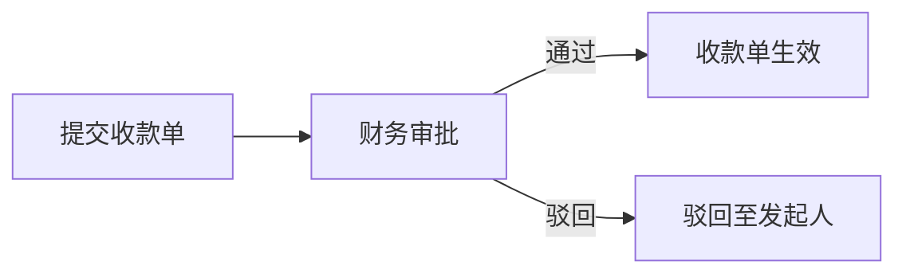

大额收款（≥ 1万元）：

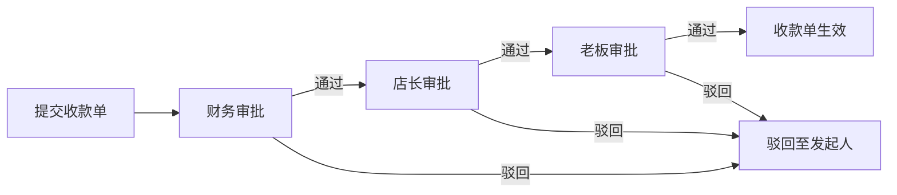

#### 4.1.3 审批人配置

| 租户规模 | 收款金额 | 审批流程 | 审批人             |
| :------- | :------- | :------- | :----------------- |
| 小规模   | 任意金额 | 一级审批 | 店长               |
| 大规模   | < 1万元  | 一级审批 | 财务               |
| 大规模   | ≥ 1万元  | 三级审批 | 财务 → 店长 → 老板 |

**去重规则**：

- 如果店长和老板是同一个用户（不同角色），只审批一次
- 系统自动检测并跳过重复审批人

#### 4.1.4 审核内容

审批人需要审核以下内容：

| 审核项       | 说明               | 审核方式                   |
| :----------- | :----------------- | :------------------------- |
| **收款金额** | 金额是否正确       | 对比订单金额或预收款金额   |
| **收款凭证** | 凭证是否清晰、真实 | 查看上传的图片             |
| **客户信息** | 关联的客户是否正确 | 对比客户姓名、电话         |
| **收款账户** | 收款账户是否正确   | 对比收款账户信息           |
| **财务确认** | 财务是否真的收到钱 | 核对银行流水或支付平台记录 |

#### 4.1.5 驳回后处理

驳回后，销售可以修改以下内容：

| 可修改项     | 说明                 |
| :----------- | :------------------- |
| **收款金额** | 金额填写错误         |
| **关联客户** | 客户选择错误         |
| **收款账户** | 收款账户登记错误     |
| **收款凭证** | 凭证不清晰，重新上传 |

**驳回原因选项**：

- 收款金额不正确
- 收款凭证不清晰
- 客户信息不正确
- 收款账户不正确
- 财务未收到款项
- 其他（需填写原因）

#### 4.1.6 超时策略

| 超时时长 | 超时动作 | 说明             |
| :------- | :------- | :--------------- |
| 24小时   | 自动提醒 | 不自动通过或拒绝 |

#### 4.1.7 提醒方式

**普通提醒**（审批待处理、审批超时提醒）：
| 渠道 | 说明 |
|:---|:---|
| **系统内通知** | 系统内的消息中心 |
| **微信小程序** | 微信小程序推送 |

**升级提醒**（审批超时自动升级）：
| 渠道 | 说明 |
|:---|:---|
| **短信** | 短信通知 |

**提醒时机**：

| 事件          | 通知对象      | 提醒方式                   | 内容         |
| :------------ | :------------ | :------------------------- | :----------- |
| 提交审批      | 审批人        | 系统内 + 微信小程序        | 有审批待处理 |
| 审批通过/驳回 | 发起人        | 系统内 + 微信小程序        | 审批结果通知 |
| 审批超时提醒  | 审批人        | 系统内 + 微信小程序        | 审批即将超时 |
| 审批超时      | 审批人 + 上级 | 系统内 + 微信小程序 + 短信 | 审批已超时   |
| 自动升级      | 新审批人      | 系统内 + 微信小程序 + 短信 | 审批已升级   |

#### 4.1.8 数据结构

**审批流程配置**（预设，不支持租户自定义）：

```typescript
// 收款审批流程配置
const paymentApprovalConfig = {
  // 小规模租户
  smallTenant: {
    levels: [
      {
        approverRole: 'STORE_MANAGER',
        approverType: 'role',
        timeoutHours: 24,
        timeoutAction: 'remind',
      },
    ],
  },

  // 大规模租户 - 小额
  largeTenantSmallAmount: {
    levels: [
      {
        approverRole: 'FINANCE',
        approverType: 'role',
        timeoutHours: 24,
        timeoutAction: 'remind',
      },
    ],
  },

  // 大规模租户 - 大额
  largeTenantLargeAmount: {
    levels: [
      {
        approverRole: 'FINANCE',
        approverType: 'role',
        timeoutHours: 24,
        timeoutAction: 'remind',
      },
      {
        approverRole: 'STORE_MANAGER',
        approverType: 'role',
        timeoutHours: 24,
        timeoutAction: 'remind',
      },
      {
        approverRole: 'ADMIN',
        approverType: 'role',
        timeoutHours: 24,
        timeoutAction: 'remind',
      },
    ],
  },

  // 大额阈值
  largeAmountThreshold: 10000,

  // 提醒方式配置
  notificationConfig: {
    // 普通提醒
    normal: ['SYSTEM', 'WECHAT_MINI'],
    // 升级提醒
    escalation: ['SYSTEM', 'WECHAT_MINI', 'SMS'],
  },
};
```

### 4.2 免费测量审批

**场景说明**：销售发起免费测量时，需要审批通过才能跳过费用检查。

#### 4.2.1 触发场景

| 场景             | 触发条件                                   | 说明               |
| :--------------- | :----------------------------------------- | :----------------- |
| **首次免费测量** | 线索未支付定金，同一客户免费测量次数 < 2次 | 自动通过，无需审批 |
| **超次免费测量** | 线索未支付定金，同一客户免费测量次数 ≥ 2次 | 需要审批           |
| **销售超配额**   | 销售本月免费测量次数 ≥ 3次（默认）         | 需要审批           |

#### 4.2.2 审批流程

**首次免费测量**（同一客户 < 2次）：


**超次免费测量**（同一客户 ≥ 2次）：

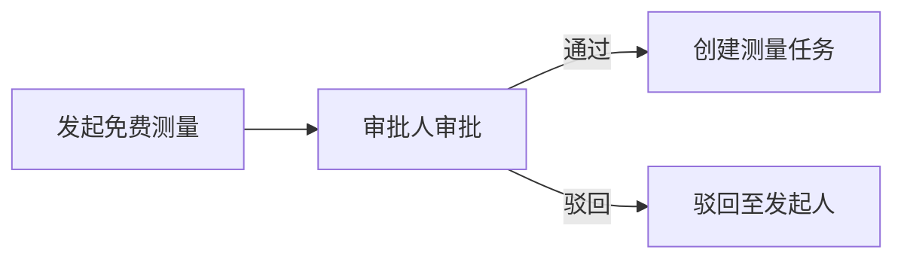

#### 4.2.3 审批人配置

| 配置项             | 默认值 | 说明                   |
| :----------------- | :----- | :--------------------- |
| **审批人角色**     | 店长   | 可切换为派单员         |
| **审批人切换开关** | 关闭   | 开启后审批人变为派单员 |

**审批人角色枚举值**：
| 值 | 说明 |
|:---|:---|
| `STORE_MANAGER` | 店长（默认） |
| `DISPATCHER` | 派单员（可切换） |

#### 4.2.4 限制规则

| 限制类型                 | 默认值 | 说明                                |
| :----------------------- | :----- | :---------------------------------- |
| **同一客户免费测量次数** | 2次    | 累计次数，超过需要审批              |
| **销售每月免费测量次数** | 3次    | 自然月（1月、2月...），超过需要审批 |

**系统设置**：
| 配置项 | 配置键 | 类型 | 默认值 | 说明 |
|:---|:---|:---|:---|:---|
| **启用免费测量审批** | `ENABLE_FREE_MEASURE_APPROVAL` | Boolean | true | 是否启用免费测量审批 |
| **审批人角色** | `FREE_MEASURE_APPROVER_ROLE` | Enum | STORE_MANAGER | 审批人角色（店长/派单员） |
| **审批人切换开关** | `FREE_MEASURE_APPROVER_SWITCH` | Boolean | false | 是否允许切换审批人 |
| **同一客户免费测量次数限制** | `FREE_MEASURE_CUSTOMER_LIMIT` | Integer | 2 | 同一客户免费测量次数（累计） |
| **销售每月免费测量次数限制** | `FREE_MEASURE_SALES_LIMIT` | Integer | 3 | 销售每月免费测量次数（自然月） |

#### 4.2.5 审核内容

审批人需要综合判断以下内容：

| 审核项           | 说明                                 | 审核方式           |
| :--------------- | :----------------------------------- | :----------------- |
| **客户购买意向** | 客户是否有真实购买意向               | 查看线索跟进记录   |
| **客户重要性**   | 客户是否是重要客户（如：设计师推荐） | 查看客户来源、渠道 |
| **特殊情况**     | 是否有特殊情况需要免费测量           | 查看销售备注       |
| **销售判断**     | 主要相信销售判断，但不能太自由       | 综合评估           |

#### 4.2.6 驳回后处理

驳回后，销售可以选择以下操作：

| 操作                     | 说明                               | 是否记录原因 |
| :----------------------- | :--------------------------------- | :----------- |
| **算了**                 | 取消测量，不再继续                 | 是           |
| **问客户收款**           | 引导客户支付定金，然后重新发起测量 | 否           |
| **更改资料继续上传审批** | 修改资料后重新提交审批             | 否           |

**驳回原因选项**：

- 客户购买意向不明确
- 客户重要性不够
- 销售免费测量次数已用完
- 其他（需填写原因）

#### 4.2.7 审批通过后处理

审批通过后，系统自动执行以下操作：

| 操作                 | 说明                                           |
| :------------------- | :--------------------------------------------- |
| **创建测量任务**     | 自动创建测量任务，状态为待分配                 |
| **通知销售**         | 通过系统内 + 微信小程序通知销售                |
| **通知派单员**       | 通过系统内 + 微信小程序通知派单员              |
| **更新免费测量次数** | 更新同一客户免费测量次数、销售本月免费测量次数 |

#### 4.2.8 超时策略

| 超时时长 | 超时动作 | 说明             |
| :------- | :------- | :--------------- |
| 24小时   | 自动提醒 | 不自动通过或拒绝 |

#### 4.2.9 提醒方式

**普通提醒**（审批待处理、审批超时提醒）：
| 渠道 | 说明 |
|:---|:---|
| **系统内通知** | 系统内的消息中心 |
| **微信小程序** | 微信小程序推送 |

**升级提醒**（审批超时自动升级）：
| 渠道 | 说明 |
|:---|:---|
| **短信** | 短信通知 |

**提醒时机**：

| 事件         | 通知对象      | 提醒方式                   | 内容           |
| :----------- | :------------ | :------------------------- | :------------- |
| 提交审批     | 审批人        | 系统内 + 微信小程序        | 有审批待处理   |
| 审批通过     | 销售          | 系统内 + 微信小程序        | 免费测量已通过 |
| 审批驳回     | 销售          | 系统内 + 微信小程序        | 免费测量已驳回 |
| 审批超时提醒 | 审批人        | 系统内 + 微信小程序        | 审批即将超时   |
| 审批超时     | 审批人 + 上级 | 系统内 + 微信小程序 + 短信 | 审批已超时     |

#### 4.2.10 数据结构

**审批流程配置**（预设，不支持租户自定义）：

```typescript
// 免费测量审批流程配置
const freeMeasureApprovalConfig = {
  // 审批人配置
  approverConfig: {
    defaultRole: 'STORE_MANAGER',
    switchable: true,
    alternativeRole: 'DISPATCHER',
  },

  // 限制规则
  limits: {
    customerFreeMeasureLimit: 2, // 同一客户免费测量次数（累计）
    salesMonthlyFreeMeasureLimit: 3, // 销售每月免费测量次数（自然月）
  },

  // 超时配置
  timeoutConfig: {
    hours: 24,
    action: 'remind',
  },

  // 提醒方式配置
  notificationConfig: {
    // 普通提醒
    normal: ['SYSTEM', 'WECHAT_MINI'],
    // 升级提醒
    escalation: ['SYSTEM', 'WECHAT_MINI', 'SMS'],
  },
};
```

**免费测量次数记录**：

```typescript
// 客户免费测量次数记录
interface CustomerFreeMeasureRecord {
  customerId: string;
  freeMeasureCount: number; // 累计次数
  lastFreeMeasureDate: Date;
}

// 销售每月免费测量次数记录
interface SalesMonthlyFreeMeasureRecord {
  salesId: string;
  year: number; // 自然年
  month: number; // 自然月（1-12）
  freeMeasureCount: number;
}
```

### 4.3 撤单审批

**场景说明**：订单在生产中状态需要撤单时，需要多级审批通过。

#### 4.3.1 触发场景

| 场景                 | 触发条件                             | 说明               |
| :------------------- | :----------------------------------- | :----------------- |
| **待下单撤单**       | 订单状态为 `PENDING_ORDER`           | 直接撤单，无需审批 |
| **生产中撤单**       | 订单状态为 `IN_PRODUCTION`           | 需要多级审批       |
| **待发货及以后撤单** | 订单状态为 `PENDING_SHIPMENT` 及以后 | 不可撤单           |

#### 4.3.2 审批流程

**待下单撤单**：


**生产中撤单**（多级审批）：

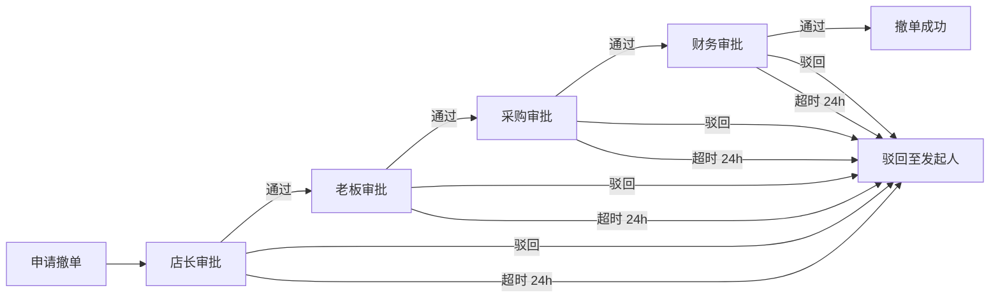

#### 4.3.3 审批人职责

| 审批人   | 审核内容                         |
| -------- | -------------------------------- |
| **店长** | 撤单原因是否合理、客户关系影响   |
| **老板** | 重大订单的战略影响、客户价值     |
| **采购** | 已采购材料的处理、供应商退货成本 |
| **财务** | 已产生费用、退款处理、财务影响   |

#### 4.3.4 审核内容

审批人需要审核以下内容：

| 审核项                   | 说明               | 审核方式                           |
| :----------------------- | :----------------- | :--------------------------------- |
| **撤单原因**             | 撤单原因是否合理   | 查看销售填写的撤单原因（自由填写） |
| **订单实际生产进度**     | 订单生产到哪个阶段 | 查看生产进度、加工单、安装单状态   |
| **是否已产生费用或成本** | 已产生的费用和成本 | 查看采购单、加工单、安装单的费用   |
| **已采购材料清单**       | 已采购的材料       | 查看采购单详情                     |
| **已付款项**             | 客户已支付的款项   | 查看收款单记录                     |

#### 4.3.5 驳回后处理

驳回后，销售可以选择以下操作：

| 操作                 | 说明                           |
| :------------------- | :----------------------------- |
| **劝说客户继续购买** | 销售继续劝说客户，订单继续生产 |
| **重新提交审批**     | 修改资料后重新提交审批         |

#### 4.3.6 审批通过后处理

审批通过后，系统自动执行以下操作：

| 操作             | 说明                                    |
| :--------------- | :-------------------------------------- |
| **通知采购**     | 通过系统内 + 微信小程序通知采购处理退货 |
| **通知财务**     | 通过系统内 + 微信小程序通知财务处理退款 |
| **订单状态变更** | 订单状态变更为 `CANCELLED`（已撤单）    |

#### 4.3.7 超时策略

| 超时时长 | 超时动作 | 说明                         |
| :------- | :------- | :--------------------------- |
| 24小时   | 自动拒绝 | 每级审批超时24小时后自动拒绝 |

#### 4.3.8 系统设置

| 配置项           | 配置键                         | 类型    | 默认值 | 说明             |
| :--------------- | :----------------------------- | :------ | :----- | :--------------- |
| **启用撤单审批** | `ENABLE_ORDER_CANCEL_APPROVAL` | Boolean | true   | 是否启用撤单审批 |

#### 4.3.9 数据结构

**审批流程配置**（预设，不支持租户自定义）：

```typescript
// 撤单审批流程配置
const orderCancelApprovalConfig = {
  // 审批流程
  levels: [
    {
      approverRole: 'STORE_MANAGER',
      approverType: 'role',
      timeoutHours: 24,
      timeoutAction: 'auto_reject',
    },
    {
      approverRole: 'ADMIN',
      approverType: 'role',
      timeoutHours: 24,
      timeoutAction: 'auto_reject',
    },
    {
      approverRole: 'PURCHASING',
      approverType: 'role',
      timeoutHours: 24,
      timeoutAction: 'auto_reject',
    },
    {
      approverRole: 'FINANCE',
      approverType: 'role',
      timeoutHours: 24,
      timeoutAction: 'auto_reject',
    },
  ],

  // 提醒方式配置
  notificationConfig: {
    normal: ['SYSTEM', 'WECHAT_MINI'],
    escalation: ['SYSTEM', 'WECHAT_MINI', 'SMS'],
  },
};
```

### 4.4 叫停功能

**场景说明**：订单需要暂时停止生产时，可以申请叫停。

#### 4.4.1 叫停类型

| 类型           | 说明                   |
| -------------- | ---------------------- |
| **整单叫停**   | 暂停整个订单的生产     |
| **商品行叫停** | 只暂停某个商品行的生产 |

#### 4.4.2 叫停审批流程

**叫停审批**：

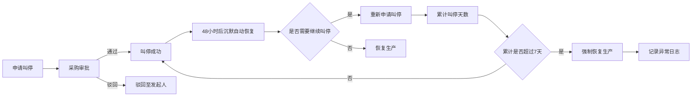

#### 4.4.3 叫停规则

| 规则             | 说明                                                                               |
| ---------------- | ---------------------------------------------------------------------------------- |
| **沉默自动恢复** | 停产48小时后，如无人工干预（手动恢复或重新申请叫停），系统发送强提醒并自动恢复生产 |
| **强制恢复时限** | 叫停最长不超过7天。第7天结束时，系统强制变更状态为"生产中"，并记录异常日志         |
| **继续叫停**     | 如需继续叫停，需在48小时内重新申请叫停                                             |
| **累计叫停天数** | 同一订单累计叫停天数不超过7天，超过则强制恢复                                      |

#### 4.4.4 叫停期间

| 项目     | 说明             |
| -------- | ---------------- |
| **费用** | 暂不产生额外费用 |

#### 4.4.5 叫停后处理

**审批通过**：
| 操作 | 说明 |
|:---|:---|
| **通知生产部门** | 通过系统内 + 微信小程序通知生产部门暂停生产 |
| **订单状态变更** | 订单状态变更为 `PAUSED`（已叫停） |
| **自动恢复** | 48小时后自动恢复生产 |

**审批驳回**：
| 操作 | 说明 |
|:---|:---|
| **继续生产** | 订单继续生产 |

**恢复生产**：
| 方式 | 说明 |
|:---|:---|
| **自动恢复** | 超过48小时自动恢复 |
| **手动恢复** | 销售可以手动恢复生产 |

#### 4.4.6 叫停场景

| 场景                     | 说明                     |
| :----------------------- | :----------------------- |
| **客户暂时资金不足**     | 客户想等一段时间再付款   |
| **客户需要调整订单内容** | 客户需要修改订单         |
| **生产资源紧张**         | 需要优先处理其他订单     |
| **客户需要重新确认设计** | 客户需要重新确认设计方案 |

#### 4.4.7 系统设置

| 配置项             | 配置键                           | 类型    | 默认值 | 说明                 |
| :----------------- | :------------------------------- | :------ | :----- | :------------------- |
| **启用叫停功能**   | `ENABLE_ORDER_PAUSE`             | Boolean | true   | 是否启用叫停功能     |
| **叫停最大天数**   | `ORDER_PAUSE_MAX_DAYS`           | Integer | 7      | 一次叫停最多天数     |
| **自动恢复小时数** | `ORDER_PAUSE_AUTO_RESTORE_HOURS` | Integer | 48     | 自动恢复生产的小时数 |

#### 4.4.8 数据结构

**叫停审批流程配置**（预设，不支持租户自定义）：

```typescript
// 叫停审批流程配置
const orderPauseApprovalConfig = {
  // 审批流程
  levels: [
    {
      approverRole: 'PURCHASING',
      approverType: 'role',
      timeoutHours: 24,
      timeoutAction: 'remind',
    },
  ],

  // 叫停规则
  pauseRules: {
    silentAutoRestoreHours: 48, // 沉默自动恢复生产的小时数
    maxCumulativeDays: 7, // 累计叫停最多天数，超过强制恢复
  },

  // 提醒方式配置
  notificationConfig: {
    normal: ['SYSTEM', 'WECHAT_MINI'],
    escalation: ['SYSTEM', 'WECHAT_MINI', 'SMS'],
  },
};
```

#### 4.4.9 撤单与叫停对比

| 对比项     | 撤单                        | 叫停                            |
| ---------- | --------------------------- | ------------------------------- |
| 目的       | 完全取消订单                | 暂时停止生产                    |
| 审批流程   | 多级（店长→老板→采购→财务） | 单级（采购）                    |
| 审批人     | 店长、老板、采购、财务      | 采购                            |
| 是否退款   | 是                          | 否                              |
| 是否可恢复 | 否                          | 是                              |
| 影响范围   | 整单                        | 整单或商品行                    |
| 超时策略   | 24小时自动拒绝              | 48小时沉默自动恢复，7天强制恢复 |
| 费用       | 可能产生退货、退款成本      | 暂不产生费用                    |

### 4.5 报价折扣审批

**场景说明**：报价折扣率超过阈值时，需要审批通过。

#### 4.5.1 折扣类型

| 折扣类型     | 说明                   | 计算方式     |
| :----------- | :--------------------- | :----------- |
| **品类折扣** | 对单个商品品类设置折扣 | 基于商品单价 |
| **整单折扣** | 对整个订单设置折扣     | 基于订单总价 |

#### 4.5.2 触发场景

| 场景         | 触发条件                   | 说明                     |
| :----------- | :------------------------- | :----------------------- |
| **品类折扣** | 品类折扣率 > 10%（可配置） | 单个商品品类折扣超过阈值 |
| **整单折扣** | 整单折扣率 > 10%（可配置） | 整个订单折扣超过阈值     |

#### 4.5.3 审批流程

**品类折扣审批**：


**整单折扣审批**：

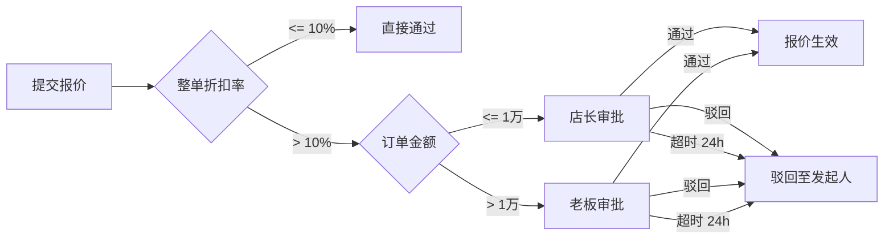

#### 4.5.4 审批人配置

| 订单金额  | 审批人 |
| :-------- | :----- |
| **≤ 1万** | 店长   |
| **> 1万** | 老板   |

#### 4.5.5 审核内容

审批人需要审核以下内容：

| 审核项           | 说明               | 审核方式                           |
| :--------------- | :----------------- | :--------------------------------- |
| **折扣原因**     | 折扣原因是否合理   | 查看销售填写的折扣原因（自由填写） |
| **客户重要性**   | 客户是否是重要客户 | 查看客户来源、渠道                 |
| **竞争对手价格** | 竞争对手价格如何   | 查看市场行情                       |
| **订单金额**     | 订单金额大小       | 查看订单总价                       |

#### 4.5.6 驳回后处理

驳回后，销售可以选择以下操作：

| 操作             | 说明                   |
| :--------------- | :--------------------- |
| **调整折扣率**   | 降低折扣率后重新提交   |
| **修改折扣原因** | 修改折扣原因后重新提交 |

#### 4.5.7 超时策略

| 超时时长 | 超时动作 | 说明                     |
| :------- | :------- | :----------------------- |
| 24小时   | 自动拒绝 | 审批超时24小时后自动拒绝 |

#### 4.5.8 系统设置

| 配置项           | 配置键                     | 类型    | 默认值 | 说明                |
| :--------------- | :------------------------- | :------ | :----- | :------------------ |
| **启用折扣审批** | `ENABLE_DISCOUNT_APPROVAL` | Boolean | true   | 是否启用折扣审批    |
| **折扣阈值**     | `DISCOUNT_THRESHOLD`       | Decimal | 0.1    | 折扣阈值（10%）     |
| **订单金额阈值** | `ORDER_AMOUNT_THRESHOLD`   | Decimal | 10000  | 订单金额阈值（1万） |

#### 4.5.9 数据结构

**审批流程配置**（预设，不支持租户自定义）：

```typescript
// 报价折扣审批流程配置
const discountApprovalConfig = {
  // 折扣阈值
  discountThreshold: 0.1, // 10%

  // 订单金额阈值
  orderAmountThreshold: 10000, // 1万

  // 审批流程
  levels: [
    {
      condition: {
        field: 'orderAmount',
        operator: '<=',
        value: 10000,
      },
      approverRole: 'STORE_MANAGER',
      approverType: 'role',
      timeoutHours: 24,
      timeoutAction: 'auto_reject',
    },
    {
      condition: {
        field: 'orderAmount',
        operator: '>',
        value: 10000,
      },
      approverRole: 'ADMIN',
      approverType: 'role',
      timeoutHours: 24,
      timeoutAction: 'auto_reject',
    },
  ],

  // 提醒方式配置
  notificationConfig: {
    normal: ['SYSTEM', 'WECHAT_MINI'],
    escalation: ['SYSTEM', 'WECHAT_MINI', 'SMS'],
  },
};
```

### 4.6 特殊工费核准

**场景说明**：安装工费超过标准单价120%时，需要审批通过。

#### 4.6.1 触发场景

| 场景         | 触发条件                         | 说明             |
| :----------- | :------------------------------- | :--------------- |
| **特殊工费** | 工费 > 标准单价 × 120%（可配置） | 安装工费超过阈值 |

#### 4.6.2 审批流程

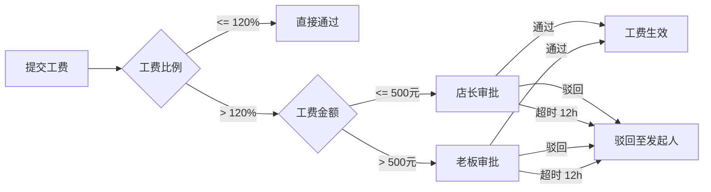

#### 4.6.3 审批人配置

| 工费金额    | 审批人 |
| :---------- | :----- |
| **≤ 500元** | 店长   |
| **> 500元** | 老板   |

#### 4.6.4 审核内容

| 审核项           | 说明         | 审核方式 |
| :--------------- | :----------- | :------- |
| **工费是否合理** | 工费是否合理 | 综合评估 |

#### 4.6.5 工费原因

| 项目         | 说明                           |
| :----------- | :----------------------------- |
| **记录原因** | 需要记录工费原因，方便后期统计 |
| **填写方式** | 自由填写                       |

#### 4.6.6 驳回后处理

驳回后，发起人可以选择以下操作：

| 操作             | 说明                   |
| :--------------- | :--------------------- |
| **调整工费**     | 降低工费后重新提交     |
| **修改工费原因** | 修改工费原因后重新提交 |

#### 4.6.7 超时策略

| 超时时长 | 超时动作 | 说明                     |
| :------- | :------- | :----------------------- |
| 12小时   | 自动拒绝 | 审批超时12小时后自动拒绝 |

#### 4.6.8 系统设置

| 配置项               | 配置键                              | 类型    | 默认值 | 说明                 |
| :------------------- | :---------------------------------- | :------ | :----- | :------------------- |
| **启用特殊工费审批** | `ENABLE_SPECIAL_LABOR_FEE_APPROVAL` | Boolean | true   | 是否启用特殊工费审批 |
| **工费比例阈值**     | `LABOR_FEE_RATIO_THRESHOLD`         | Decimal | 1.2    | 工费比例阈值（120%） |
| **工费金额阈值**     | `LABOR_FEE_AMOUNT_THRESHOLD`        | Decimal | 500    | 工费金额阈值（元）   |

#### 4.6.9 数据结构

**审批流程配置**（预设，不支持租户自定义）：

```typescript
// 特殊工费核准审批流程配置
const specialLaborFeeApprovalConfig = {
  // 工费比例阈值
  laborFeeRatioThreshold: 1.2, // 120%

  // 工费金额阈值
  laborFeeAmountThreshold: 500, // 500元

  // 审批流程
  levels: [
    {
      condition: {
        field: 'laborFeeAmount',
        operator: '<=',
        value: 500,
      },
      approverRole: 'STORE_MANAGER',
      approverType: 'role',
      timeoutHours: 12,
      timeoutAction: 'auto_reject',
    },
    {
      condition: {
        field: 'laborFeeAmount',
        operator: '>',
        value: 500,
      },
      approverRole: 'ADMIN',
      approverType: 'role',
      timeoutHours: 12,
      timeoutAction: 'auto_reject',
    },
  ],

  // 提醒方式配置
  notificationConfig: {
    normal: ['SYSTEM', 'WECHAT_MINI'],
    escalation: ['SYSTEM', 'WECHAT_MINI', 'SMS'],
  },
};
```

### 4.7 坏账核销审批

**场景说明**：账龄超过90天的坏账需要核销时，需要多级审批通过。

#### 4.7.1 触发场景

| 场景         | 触发条件    | 说明               |
| :----------- | :---------- | :----------------- |
| **坏账核销** | 账龄 > 90天 | 账款超过90天未收回 |

#### 4.7.2 审批流程

**串行审批**（默认）：

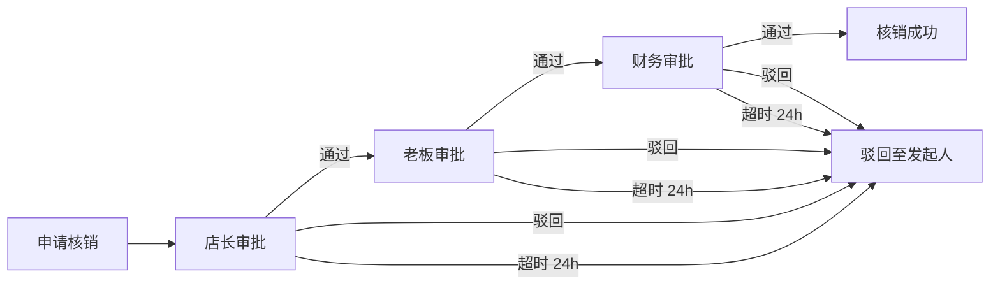

**并行会签**（可选）：


#### 4.7.3 审批人

| 审批人   | 职责             |
| :------- | :--------------- |
| **店长** | 审核坏账核销申请 |
| **老板** | 审核坏账核销申请 |
| **财务** | 审核坏账核销申请 |

#### 4.7.4 审核内容

| 审核项       | 说明             | 审核方式                           |
| :----------- | :--------------- | :--------------------------------- |
| **坏账原因** | 坏账原因是否合理 | 查看财务填写的坏账原因（自由填写） |
| **催收情况** | 是否已经催收     | 查看催收记录                       |

#### 4.7.5 坏账原因

| 项目         | 说明                             |
| :----------- | :------------------------------- |
| **记录原因** | 一定要记录坏账原因，审批中要写好 |
| **填写方式** | 自由填写                         |

#### 4.7.6 驳回后处理

驳回后，发起人可以选择以下操作：

| 操作             | 说明                       |
| :--------------- | :------------------------- |
| **继续催收**     | 继续催收，不核销           |
| **修改坏账原因** | 修改坏账原因后重新提交审批 |

#### 4.7.7 超时策略

| 超时时长 | 超时动作 | 说明                         |
| :------- | :------- | :--------------------------- |
| 24小时   | 自动拒绝 | 每级审批超时24小时后自动拒绝 |

#### 4.7.8 核销后处理

| 操作             | 说明               |
| :--------------- | :----------------- |
| **不通知客户**   | 不通知客户         |
| **记录信用档案** | 记录到客户信用档案 |

#### 4.7.9 系统设置

| 配置项               | 配置键                               | 类型    | 默认值 | 说明                 |
| :------------------- | :----------------------------------- | :------ | :----- | :------------------- |
| **启用坏账核销审批** | `ENABLE_BAD_DEBT_WRITE_OFF_APPROVAL` | Boolean | true   | 是否启用坏账核销审批 |
| **账龄阈值**         | `BAD_DEBT_AGE_THRESHOLD`             | Integer | 90     | 账龄阈值（天）       |

#### 4.7.10 数据结构

**审批流程配置**（预设，不支持租户自定义）：

```typescript
// 坏账核销审批流程配置
const badDebtWriteOffApprovalConfig = {
  // 账龄阈值
  badDebtAgeThreshold: 90, // 90天

  // 审批流程
  levels: [
    {
      approverRole: 'STORE_MANAGER',
      approverType: 'role',
      timeoutHours: 24,
      timeoutAction: 'auto_reject',
    },
    {
      approverRole: 'ADMIN',
      approverType: 'role',
      timeoutHours: 24,
      timeoutAction: 'auto_reject',
    },
    {
      approverRole: 'FINANCE',
      approverType: 'role',
      timeoutHours: 24,
      timeoutAction: 'auto_reject',
    },
  ],

  // 提醒方式配置
  notificationConfig: {
    normal: ['SYSTEM', 'WECHAT_MINI'],
    escalation: ['SYSTEM', 'WECHAT_MINI', 'SMS'],
  },
};
```

### 4.8 成本调整审批

**场景说明**：修改采购单成本价或加工单加工费时，需要审批通过。

#### 4.8.1 触发场景

| 场景           | 触发条件               | 说明       |
| :------------- | :--------------------- | :--------- |
| **修改成本价** | 采购员修改采购单成本价 | 供应商涨价 |
| **修改加工费** | 采购员修改加工单加工费 | 供应商涨价 |

#### 4.8.2 审批流程

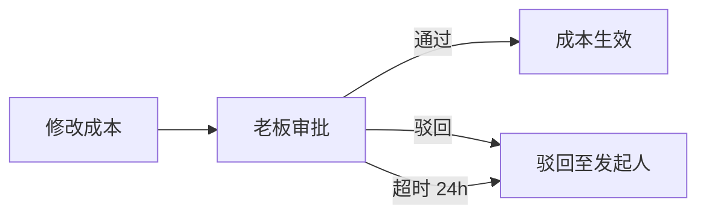

#### 4.8.3 审批人

| 审批人   | 职责             |
| :------- | :--------------- |
| **老板** | 审核成本调整申请 |

#### 4.8.4 审核内容

| 审核项             | 说明                 | 审核方式                                 |
| :----------------- | :------------------- | :--------------------------------------- |
| **供应商报价截图** | 供应商的报价截图     | 查看上传的报价截图                       |
| **成本调整原因**   | 成本调整原因是否合理 | 查看采购员填写的成本调整原因（自由填写） |

#### 4.8.5 成本调整原因

| 项目         | 说明                 |
| :----------- | :------------------- |
| **记录原因** | 需要记录成本调整原因 |
| **填写方式** | 自由填写             |
| **调整场景** | 涨价                 |

#### 4.8.6 驳回后处理

驳回后，发起人可以选择以下操作：

| 操作                 | 说明                           |
| :------------------- | :----------------------------- |
| **不调整成本**       | 不调整成本，保持原价           |
| **修改成本调整原因** | 修改成本调整原因后重新提交审批 |

#### 4.8.7 超时策略

| 超时时长 | 超时动作 | 说明                     |
| :------- | :------- | :----------------------- |
| 24小时   | 自动拒绝 | 审批超时24小时后自动拒绝 |

#### 4.8.8 系统设置

| 配置项               | 配置键                            | 类型    | 默认值 | 说明                 |
| :------------------- | :-------------------------------- | :------ | :----- | :------------------- |
| **启用成本调整审批** | `ENABLE_COST_ADJUSTMENT_APPROVAL` | Boolean | true   | 是否启用成本调整审批 |

#### 4.8.9 数据结构

**审批流程配置**（预设，不支持租户自定义）：

```typescript
// 成本调整审批流程配置
const costAdjustmentApprovalConfig = {
  // 审批流程
  levels: [
    {
      approverRole: 'ADMIN',
      approverType: 'role',
      timeoutHours: 24,
      timeoutAction: 'auto_reject',
    },
  ],

  // 提醒方式配置
  notificationConfig: {
    normal: ['SYSTEM', 'WECHAT_MINI'],
    escalation: ['SYSTEM', 'WECHAT_MINI', 'SMS'],
  },
};
```

### 4.9 工费调整审批

**场景说明**：验收时调整工费，需要审批通过。

#### 4.9.1 触发场景

| 场景         | 触发条件                  | 说明               |
| :----------- | :------------------------ | :----------------- |
| **工费调整** | 验收时实际工费 ≠ 预估工费 | 安装完成后调整工费 |

#### 4.9.2 审批流程

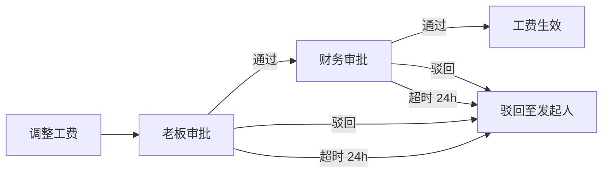

#### 4.9.3 审批人

| 审批人   | 职责             |
| :------- | :--------------- |
| **老板** | 审核工费调整申请 |
| **财务** | 审核工费调整申请 |

#### 4.9.4 审核内容

| 审核项           | 说明                 | 审核方式                               |
| :--------------- | :------------------- | :------------------------------------- |
| **工费调整原因** | 工费调整原因是否合理 | 查看师傅填写的工费调整原因（自由填写） |

#### 4.9.5 工费调整原因

| 项目         | 说明                     |
| :----------- | :----------------------- |
| **记录原因** | 需要记录工费调整原因     |
| **填写方式** | 自由填写                 |
| **调整场景** | 距离远、难度大、多项目等 |

#### 4.9.6 驳回后处理

驳回后，发起人可以选择以下操作：

| 操作                 | 说明                           |
| :------------------- | :----------------------------- |
| **不调整工费**       | 不调整工费，保持预估工费       |
| **修改工费调整原因** | 修改工费调整原因后重新提交审批 |

#### 4.9.7 超时策略

| 超时时长 | 超时动作 | 说明                         |
| :------- | :------- | :--------------------------- |
| 24小时   | 自动拒绝 | 每级审批超时24小时后自动拒绝 |

#### 4.9.8 系统设置

| 配置项               | 配置键                                 | 类型    | 默认值 | 说明                 |
| :------------------- | :------------------------------------- | :------ | :----- | :------------------- |
| **启用工费调整审批** | `ENABLE_LABOR_FEE_ADJUSTMENT_APPROVAL` | Boolean | true   | 是否启用工费调整审批 |

#### 4.9.9 数据结构

**审批流程配置**（预设，不支持租户自定义）：

```typescript
// 工费调整审批流程配置
const laborFeeAdjustmentApprovalConfig = {
  // 审批流程
  levels: [
    {
      approverRole: 'ADMIN',
      approverType: 'role',
      timeoutHours: 24,
      timeoutAction: 'auto_reject',
    },
    {
      approverRole: 'FINANCE',
      approverType: 'role',
      timeoutHours: 24,
      timeoutAction: 'auto_reject',
    },
  ],

  // 提醒方式配置
  notificationConfig: {
    normal: ['SYSTEM', 'WECHAT_MINI'],
    escalation: ['SYSTEM', 'WECHAT_MINI', 'SMS'],
  },
};
```

### 4.10 售后定责审批

**场景说明**：售后工单定责后，需要责任方确认或仲裁。

#### 4.10.1 触发场景

| 场景         | 触发条件                           | 说明           |
| :----------- | :--------------------------------- | :------------- |
| **售后定责** | 售后工单状态从"待受理"变为"定责中" | 客服创建定责单 |

#### 4.10.2 审批流程

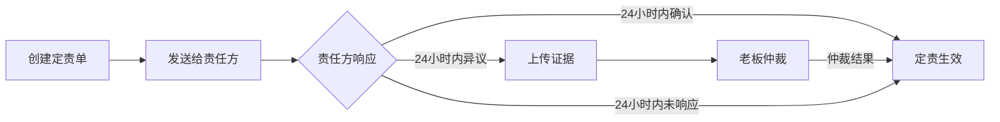

#### 4.10.3 责任方响应

| 响应类型 | 说明                               |
| :------- | :--------------------------------- |
| **确认** | 责任方确认定责结果                 |
| **异议** | 责任方不认可定责结果，需要上传证据 |

#### 4.10.4 异议类型

| 异议类型           | 说明                 |
| :----------------- | :------------------- |
| **不认可这件事**   | 责任方不认可这件事   |
| **不认可这个比例** | 责任方不认可定责比例 |

#### 4.10.5 异议处理

| 项目         | 说明                           |
| :----------- | :----------------------------- |
| **上传证据** | 责任方提出异议时，必须上传证据 |
| **老板仲裁** | 老板根据证据进行仲裁           |

#### 4.10.6 定责原因

| 项目         | 说明                                               |
| :----------- | :------------------------------------------------- |
| **记录原因** | 要记录定责原因，方便后面统计，以便不再产生这类售后 |
| **填写方式** | 自由填写                                           |

#### 4.10.7 超时策略

| 超时时长 | 超时动作 | 说明                             |
| :------- | :------- | :------------------------------- |
| 24小时   | 自动确认 | 24小时内未响应，系统自动确认定责 |

#### 4.10.8 定责后处理

| 操作             | 说明               |
| :--------------- | :----------------- |
| **通知责任方**   | 通知责任方定责结果 |
| **生成扣款记录** | 自动生成扣款记录   |

#### 4.10.9 自动确认逻辑

```typescript
// 伪代码示例
cron.schedule('0 * * * *', async () => {
  const pendingNotices = await db.liabilityNotices.findMany({
    where: {
      status: 'PENDING_CONFIRM',
      created_at: {
        lt: new Date(Date.now() - 24 * 60 * 60 * 1000), // 24小时前
      },
    },
  });

  for (const notice of pendingNotices) {
    await db.liabilityNotices.update({
      where: { id: notice.id },
      data: {
        status: 'CONFIRMED',
        confirmed_at: new Date(),
        confirmed_by: 'SYSTEM_AUTO',
        arbitration_result: '责任方逾期未确认，系统自动确认',
      },
    });

    // 自动生成扣款记录
    await financeService.createDeductionRecord(notice);

    // 通知责任方
    await notificationService.sendToResponsibleParty(notice);
  }
});
```

#### 4.10.10 系统设置

| 配置项               | 配置键                                  | 类型    | 默认值 | 说明                     |
| :------------------- | :-------------------------------------- | :------ | :----- | :----------------------- |
| **启用售后定责审批** | `ENABLE_AFTER_SALES_LIABILITY_APPROVAL` | Boolean | true   | 是否启用售后定责审批     |
| **定责响应超时时长** | `LIABILITY_RESPONSE_TIMEOUT_HOURS`      | Integer | 24     | 定责响应超时时长（小时） |

#### 4.10.11 数据结构

**审批流程配置**（预设，不支持租户自定义）：

```typescript
// 售后定责审批流程配置
const afterSalesLiabilityApprovalConfig = {
  // 定责响应超时时长
  liabilityResponseTimeoutHours: 24, // 24小时

  // 提醒方式配置
  notificationConfig: {
    normal: ['SYSTEM', 'WECHAT_MINI'],
    escalation: ['SYSTEM', 'WECHAT_MINI', 'SMS'],
  },
};
```

### 4.11 付款审批

**场景说明**：向供应商支付货款或向工人结算劳务费时，需要审批通过。

#### 4.11.1 触发场景

| 场景           | 触发条件                          | 说明             |
| :------------- | :-------------------------------- | :--------------- |
| **供应商付款** | 采购单生成付款申请                | 向供应商支付货款 |
| **劳务费结算** | 安装/加工完成验收后生成劳务费账单 | 向工人支付劳务费 |

#### 4.11.2 审批流程

**供应商付款**：

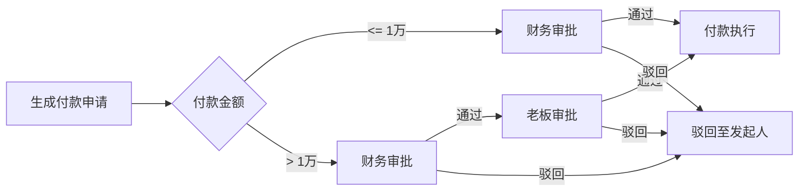

**劳务费结算**：

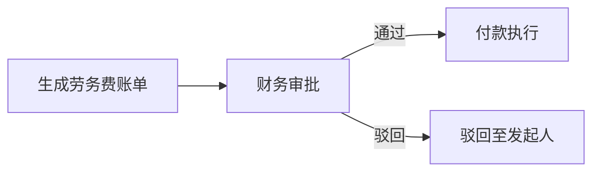

#### 4.11.3 审批人配置

| 付款类型   | 付款金额 | 审批流程 | 审批人      |
| :--------- | :------- | :------- | :---------- |
| 供应商付款 | ≤ 1万    | 一级审批 | 财务        |
| 供应商付款 | > 1万    | 二级审批 | 财务 → 老板 |
| 劳务费结算 | 任意金额 | 一级审批 | 财务        |

#### 4.11.4 审核内容

**供应商付款**：
| 审核项 | 说明 | 审核方式 |
|:---|:---|:---|
| **付款金额** | 金额是否正确 | 对比采购单金额 |
| **发票信息** | 发票是否齐全、正确 | 查看上传的发票 |
| **供应商信息** | 供应商是否正确 | 对比供应商信息 |
| **付款账户** | 付款账户是否正确 | 对比付款账户信息 |

**劳务费结算**：
| 审核项 | 说明 | 审核方式 |
|:---|:---|:---|
| **工费金额** | 工费是否正确 | 对比验收单工费 |
| **验收结果** | 验收是否通过 | 查看验收单 |
| **工人信息** | 工人是否正确 | 对比工人信息 |

#### 4.11.5 驳回后处理

驳回后，发起人可以选择以下操作：

| 操作         | 说明                   |
| :----------- | :--------------------- |
| **修改金额** | 修改付款金额后重新提交 |
| **补充发票** | 补充发票后重新提交     |
| **修改账户** | 修改付款账户后重新提交 |

**驳回原因选项**：

- 付款金额不正确
- 发票信息不完整
- 供应商信息不正确
- 付款账户不正确
- 其他（需填写原因）

#### 4.11.6 超时策略

| 超时时长 | 超时动作 | 说明             |
| :------- | :------- | :--------------- |
| 24小时   | 自动提醒 | 不自动通过或拒绝 |

#### 4.11.7 提醒方式

**普通提醒**（审批待处理、审批超时提醒）：
| 渠道 | 说明 |
|:---|:---|
| **系统内通知** | 系统内的消息中心 |
| **微信小程序** | 微信小程序推送 |

**升级提醒**（审批超时自动升级）：
| 渠道 | 说明 |
|:---|:---|
| **短信** | 短信通知 |

#### 4.11.8 系统设置

| 配置项                 | 配置键                              | 类型    | 默认值 | 说明                     |
| :--------------------- | :---------------------------------- | :------ | :----- | :----------------------- |
| **启用付款审批**       | `ENABLE_PAYMENT_APPROVAL`           | Boolean | true   | 是否启用付款审批         |
| **供应商付款金额阈值** | `SUPPLIER_PAYMENT_AMOUNT_THRESHOLD` | Decimal | 10000  | 供应商付款金额阈值（元） |

#### 4.11.9 数据结构

**审批流程配置**（预设，不支持租户自定义）：

```typescript
// 付款审批流程配置
const paymentApprovalConfig = {
  // 供应商付款
  supplierPayment: {
    amountThreshold: 10000, // 1万

    // 小额付款
    smallAmount: {
      levels: [
        {
          approverRole: 'FINANCE',
          approverType: 'role',
          timeoutHours: 24,
          timeoutAction: 'remind',
        },
      ],
    },

    // 大额付款
    largeAmount: {
      levels: [
        {
          approverRole: 'FINANCE',
          approverType: 'role',
          timeoutHours: 24,
          timeoutAction: 'remind',
        },
        {
          approverRole: 'ADMIN',
          approverType: 'role',
          timeoutHours: 24,
          timeoutAction: 'remind',
        },
      ],
    },
  },

  // 劳务费结算
  laborFeePayment: {
    levels: [
      {
        approverRole: 'FINANCE',
        approverType: 'role',
        timeoutHours: 24,
        timeoutAction: 'remind',
      },
    ],
  },

  // 提醒方式配置
  notificationConfig: {
    normal: ['SYSTEM', 'WECHAT_MINI'],
    escalation: ['SYSTEM', 'WECHAT_MINI', 'SMS'],
  },
};
```

### 4.12 退款审批

**场景说明**：涉及资金流出的高风险操作需要审批通过。

#### 4.12.1 触发场景

| 场景             | 触发条件             | 说明                               |
| :--------------- | :------------------- | :--------------------------------- |
| **订单撤销退款** | 订单撤销后需要退款   | 订单已收款，需要退款给客户         |
| **多收退款**     | 收款金额多于订单金额 | 客户多付了钱，需要退款             |
| **售后赔付**     | 售后定责后需要赔付   | 公司承担责任的售后，需要赔付给客户 |

#### 4.12.2 审批流程

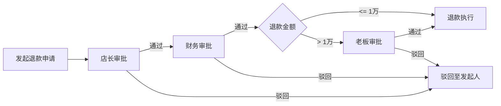

#### 4.12.3 审批人配置

| 退款金额 | 审批流程 | 审批人             |
| :------- | :------- | :----------------- |
| ≤ 1万    | 二级审批 | 店长 → 财务        |
| > 1万    | 三级审批 | 店长 → 财务 → 老板 |

#### 4.12.4 审核内容

| 审核项         | 说明               | 审核方式                 |
| :------------- | :----------------- | :----------------------- |
| **退款原因**   | 退款原因是否合理   | 查看发起人填写的退款原因 |
| **退款金额**   | 金额是否正确       | 对比原收款金额           |
| **原支付渠道** | 原支付渠道是否正确 | 查看原收款单支付方式     |
| **客户信息**   | 客户信息是否正确   | 对比客户信息             |

#### 4.12.5 风险控制

| 风险控制项       | 说明                                 |
| :--------------- | :----------------------------------- |
| **原路退回原则** | 退款必须退回原支付渠道，避免洗钱风险 |
| **金额核对**     | 退款金额不能超过原收款金额           |
| **权限控制**     | 只有财务和老板可以审批退款           |

#### 4.12.6 驳回后处理

驳回后，发起人可以选择以下操作：

| 操作         | 说明                   |
| :----------- | :--------------------- |
| **修改金额** | 修改退款金额后重新提交 |
| **修改原因** | 修改退款原因后重新提交 |

**驳回原因选项**：

- 退款原因不正确
- 退款金额不正确
- 原支付渠道不正确
- 其他（需填写原因）

#### 4.12.7 超时策略

| 超时时长 | 超时动作 | 说明             |
| :------- | :------- | :--------------- |
| 24小时   | 自动提醒 | 不自动通过或拒绝 |

#### 4.12.8 提醒方式

**普通提醒**（审批待处理、审批超时提醒）：
| 渠道 | 说明 |
|:---|:---|
| **系统内通知** | 系统内的消息中心 |
| **微信小程序** | 微信小程序推送 |

**升级提醒**（审批超时自动升级）：
| 渠道 | 说明 |
|:---|:---|
| **短信** | 短信通知 |

#### 4.12.9 系统设置

| 配置项           | 配置键                    | 类型    | 默认值 | 说明               |
| :--------------- | :------------------------ | :------ | :----- | :----------------- |
| **启用退款审批** | `ENABLE_REFUND_APPROVAL`  | Boolean | true   | 是否启用退款审批   |
| **退款金额阈值** | `REFUND_AMOUNT_THRESHOLD` | Decimal | 10000  | 退款金额阈值（元） |

#### 4.12.10 数据结构

**审批流程配置**（预设，不支持租户自定义）：

```typescript
// 退款审批流程配置
const refundApprovalConfig = {
  // 退款金额阈值
  amountThreshold: 10000, // 1万

  // 小额退款
  smallAmount: {
    levels: [
      {
        approverRole: 'STORE_MANAGER',
        approverType: 'role',
        timeoutHours: 24,
        timeoutAction: 'remind',
      },
      {
        approverRole: 'FINANCE',
        approverType: 'role',
        timeoutHours: 24,
        timeoutAction: 'remind',
      },
    ],
  },

  // 大额退款
  largeAmount: {
    levels: [
      {
        approverRole: 'STORE_MANAGER',
        approverType: 'role',
        timeoutHours: 24,
        timeoutAction: 'remind',
      },
      {
        approverRole: 'FINANCE',
        approverType: 'role',
        timeoutHours: 24,
        timeoutAction: 'remind',
      },
      {
        approverRole: 'ADMIN',
        approverType: 'role',
        timeoutHours: 24,
        timeoutAction: 'remind',
      },
    ],
  },

  // 提醒方式配置
  notificationConfig: {
    normal: ['SYSTEM', 'WECHAT_MINI'],
    escalation: ['SYSTEM', 'WECHAT_MINI', 'SMS'],
  },
};
```

## 5. 数据结构 (Schema Design)

### 5.1 审批流模板表 (approval_templates)

| 字段名            | 类型     | 必填 | 说明                                                            |
| :---------------- | :------- | :--- | :-------------------------------------------------------------- |
| id                | UUID     | ✓    | 主键                                                            |
| template_no       | String   | ✓    | 模板编号 (AT20260101001)                                        |
| name              | String   | ✓    | 模板名称（如：报价折扣审批）                                    |
| description       | Text     | -    | 模板描述                                                        |
| trigger_module    | String   | ✓    | 触发模块 (quote, order, install, payment, measure, after_sales) |
| trigger_condition | JSONB    | ✓    | 触发条件表达式                                                  |
| nodes             | JSONB    | ✓    | 审批节点数组                                                    |
| is_active         | Boolean  | ✓    | 是否启用                                                        |
| tenant_id         | UUID     | ✓    | 租户ID                                                          |
| created_by        | UUID     | ✓    | 创建人                                                          |
| created_at        | DateTime | ✓    | 创建时间                                                        |
| updated_at        | DateTime | -    | 更新时间                                                        |

**nodes 字段结构示例**：

```json
{
  "nodes": [
    {
      "id": "node_1",
      "type": "condition",
      "condition": {
        "field": "amount",
        "operator": ">",
        "value": 5000
      },
      "true_next": "node_2",
      "false_next": "node_3"
    },
    {
      "id": "node_2",
      "type": "approver",
      "approver_type": "role",
      "approver_id": "STORE_MANAGER",
      "approver_mode": "ALL",
      "timeout_hours": 24,
      "timeout_action": "escalate",
      "next_node_id": "node_4"
    },
    {
      "id": "node_3",
      "type": "action",
      "action": "auto_approve",
      "next_node_id": null
    },
    {
      "id": "node_4",
      "type": "action",
      "action": "execute",
      "next_node_id": null
    }
  ]
}
```

**approver_mode 枚举值**：
| 值 | 说明 |
|:---|:---|
| `ALL` | 并行会签，所有审批人都需要通过 |
| `ANY` | 并行会签，任意一个审批人通过即可 |

### 5.2 审批实例表 (approval_instances)

| 字段名          | 类型     | 必填 | 说明                                                            |
| :-------------- | :------- | :--- | :-------------------------------------------------------------- |
| id              | UUID     | ✓    | 主键                                                            |
| instance_no     | String   | ✓    | 实例编号 (AI20260101001)                                        |
| template_id     | UUID     | ✓    | 关联模板                                                        |
| source_module   | String   | ✓    | 来源模块 (quote, order, install, payment, measure, after_sales) |
| source_id       | UUID     | ✓    | 来源单据ID                                                      |
| status          | Enum     | ✓    | 状态 (pending/approved/rejected/escalated/cancelled)            |
| current_node_id | String   | ✓    | 当前节点ID                                                      |
| submitted_by    | UUID     | ✓    | 发起人                                                          |
| submitted_at    | DateTime | ✓    | 提交时间                                                        |
| completed_at    | DateTime | -    | 完成时间                                                        |
| tenant_id       | UUID     | ✓    | 租户ID                                                          |
| created_at      | DateTime | ✓    | 创建时间                                                        |

**status 枚举值**：
| 值 | 说明 |
|:---|:---|
| `pending` | 待审批 |
| `approved` | 已通过 |
| `rejected` | 已驳回 |
| `escalated` | 已升级 |
| `cancelled` | 已取消 |

### 5.3 审批记录表 (approval_logs)

| 字段名      | 类型     | 必填 | 说明                                         |
| :---------- | :------- | :--- | :------------------------------------------- |
| id          | UUID     | ✓    | 主键                                         |
| instance_id | UUID     | ✓    | 关联实例                                     |
| node_id     | String   | ✓    | 节点ID                                       |
| action      | Enum     | ✓    | 操作 (submit/approve/reject/escalate/cancel) |
| actor_id    | UUID     | ✓    | 操作人ID                                     |
| actor_name  | String   | ✓    | 操作人姓名（冗余）                           |
| comment     | Text     | -    | 审批意见                                     |
| attachments | JSONB    | -    | 附件（图片、文档等）                         |
| created_at  | DateTime | ✓    | 创建时间                                     |

**action 枚举值**：
| 值 | 说明 |
|:---|:---|
| `submit` | 提交审批 |
| `approve` | 通过 |
| `reject` | 驳回 |
| `escalate` | 升级 |
| `cancel` | 取消 |

### 5.4 定责单表 (liability_notices)

| 字段名                    | 类型     | 必填 | 说明                                                               |
| :------------------------ | :------- | :--- | :----------------------------------------------------------------- |
| id                        | UUID     | ✓    | 主键                                                               |
| notice_no                 | String   | ✓    | 定责单号 (LN20260101001)                                           |
| after_sales_id            | UUID     | ✓    | 关联售后工单                                                       |
| order_id                  | UUID     | ✓    | 关联原订单                                                         |
| liable_party_type         | Enum     | ✓    | 责任方类型 (company/factory/installer/measurer/logistics/customer) |
| liable_party_id           | UUID     | ✓    | 责任方ID (供应商/工人ID)                                           |
| liability_reason          | Text     | ✓    | 定责原因描述                                                       |
| liability_reason_category | Enum     | ✓    | 责任一级分类                                                       |
| liability_reason_subtype  | Enum     | ✓    | 责任二级分类                                                       |
| cost_items                | JSONB    | ✓    | 成本明细 (材料损耗费/二次物流费/二次劳务费/渠道违约金)             |
| cost_amount               | Decimal  | ✓    | 应承担总成本金额                                                   |
| evidence_photos           | JSONB    | -    | 证据照片                                                           |
| linked_evidence           | JSONB    | -    | 自动关联的证据链 (量尺图、生产单、安装前后对比图)                  |
| liable_party_credit       | JSONB    | -    | 责任方近90天售后率等信用记录                                       |
| source_purchase_order_id  | UUID     | -    | 关联导致故障的原始采购单 (溯源字段)                                |
| source_install_task_id    | UUID     | -    | 关联导致故障的原始安装单 (溯源字段)                                |
| status                    | Enum     | ✓    | 状态 (DRAFT/PENDING_CONFIRM/CONFIRMED/DISPUTED/ARBITRATED)         |
| created_at                | DateTime | ✓    | 创建时间                                                           |
| confirmed_at              | DateTime | -    | 确认时间                                                           |
| confirmed_by              | UUID     | -    | 确认人                                                             |
| dispute_reason            | Text     | -    | 异议理由 (仅当状态为DISPUTED时填写)                                |
| dispute_evidence          | JSONB    | -    | 异议证据照片 (仅当状态为DISPUTED时填写)                            |
| arbitration_result        | Text     | -    | 仲裁结果 (仅当状态为ARBITRATED时填写)                              |
| arbitrated_by             | UUID     | -    | 仲裁人 (仅当状态为ARBITRATED时填写)                                |
| arbitrated_at             | DateTime | -    | 仲裁时间 (仅当状态为ARBITRATED时填写)                              |

**liable_party_type 枚举值**：
| 值 | 说明 |
|:---|:---|
| `COMPANY` | 公司 |
| `FACTORY` | 供应商/工厂 |
| `INSTALLER` | 安装师 |
| `MEASURER` | 测量师 |
| `LOGISTICS` | 物流 |
| `CUSTOMER` | 客户 |

**status 枚举值**：
| 值 | 说明 |
|:---|:---|
| `DRAFT` | 待发送 |
| `PENDING_CONFIRM` | 待确认 |
| `CONFIRMED` | 已确认 |
| `DISPUTED` | 有异议 |
| `ARBITRATED` | 已仲裁 |

### 5.5 审批人角色枚举

本表作为系统的 Single Source of Truth，定义所有审批人角色。

| 角色代码        | 角色名称    | 职责说明                           |
| :-------------- | :---------- | :--------------------------------- |
| `STORE_MANAGER` | 店长        | 门店业务管理，负责一级审批         |
| `ADMIN`         | 管理员/老板 | 公司决策，负责大额/异常审批        |
| `FINANCE`       | 财务        | 资金往来审核，负责收付款审批       |
| `PURCHASING`    | 采购        | 供应链管理，负责成本/叫停审批      |
| `DISPATCHER`    | 派单员      | 任务调度，负责免费测量审批（可选） |

## 6. 业务规则 (Business Rules)

### 6.1 审批触发规则

| 触发场景         | 触发条件                             | 审批类型 |
| :--------------- | :----------------------------------- | :------- |
| **收款审批**     | 收款单状态从 DRAFT 变为 PENDING      | 财务审批 |
| **免费测量审批** | 线索未支付定金，点击"预约测量"       | 业务审批 |
| **撤单审批**     | 订单状态为 IN_PRODUCTION，点击"撤单" | 业务审批 |
| **报价折扣审批** | 折扣率 > 10%                         | 业务审批 |
| **特殊工费核准** | 工费 > 标准单价 × 1.2                | 成本审批 |
| **坏账核销审批** | 账龄 > 90天，申请核销                | 特殊审批 |
| **成本调整审批** | 修改成本价或加工费                   | 成本审批 |
| **工费调整审批** | 验收时调整工费                       | 成本审批 |
| **售后定责审批** | 售后工单定责后                       | 定责审批 |

### 6.2 审批流转规则

**串行审批**：

- 节点按顺序依次审批
- 前一个节点通过后，才能进入下一个节点
- 任一节点驳回，整个流程终止

**并行会签**：

- 多个审批人同时审批
- 所有审批人都通过，流程继续
- 任一审批人驳回，整个流程终止

**条件分支**：

- 根据条件表达式选择不同的审批路径
- 支持多级条件嵌套

**自动升级**：

- 审批超时后，自动升级到上级审批人
- 可配置升级次数和升级路径

### 6.3 超时处理规则

| 超时时长 | 超时动作          | 适用场景 |
| :------- | :---------------- | :------- |
| 2小时    | 自动提醒          | 紧急审批 |
| 12小时   | 自动提醒          | 一般审批 |
| 24小时   | 自动升级/自动确认 | 重要审批 |
| 48小时   | 自动拒绝          | 特殊审批 |

**系统设置**：
| 配置项 | 配置键 | 类型 | 默认值 | 说明 |
|:---|:---|:---|:---|:---|
| **审批超时提醒时间** | `APPROVAL_TIMEOUT_REMINDER` | Integer | 2 | 审批超时前多少小时提醒（小时） |
| **启用审批超时自动升级** | `ENABLE_APPROVAL_AUTO_ESCALATE` | Boolean | true | 是否启用审批超时自动升级 |
| **审批超时自动升级时间** | `APPROVAL_AUTO_ESCALATE_TIMEOUT` | Integer | 24 | 审批超时多少小时后自动升级（小时） |

### 6.4 驳回处理规则

**驳回操作**：

- 必须填写驳回原因
- 可选择驳回至发起人或驳回至上一节点
- 驳回后发起人可修改后重新提交，或取消审批

**驳回次数限制**：

- 同一审批实例累计驳回次数 ≥ 3 次时，自动升级预警给店长
- 驳回次数记录在审批实例中

### 6.5 通知规则

**通知时机**：
| 通知时机 | 通知对象 | 通知内容 |
|:---|:---|:---|
| 提交审批 | 审批人 | 有审批待处理 |
| 审批通过/驳回 | 发起人 | 审批结果通知 |
| 审批超时 | 审批人+上级 | 审批超时提醒 |
| 自动升级 | 新审批人 | 审批已升级 |

**通知渠道**：
| 渠道 | 说明 |
|:---|:---|
| **SYSTEM** | 系统内通知 |
| **FEISHU** | 飞书通知 |
| **SMS** | 短信通知 |
| **WECHAT** | 微信通知 |

**系统设置**：
| 配置项 | 配置键 | 类型 | 默认值 | 说明 |
|:---|:---|:---|:---|:---|
| **启用系统内通知** | `ENABLE_SYSTEM_NOTIFICATION` | Boolean | true | 是否启用系统内通知 |
| **启用飞书通知** | `ENABLE_FEISHU_NOTIFICATION` | Boolean | true | 是否启用飞书通知 |
| **启用短信通知** | `ENABLE_SMS_NOTIFICATION` | Boolean | false | 是否启用短信通知 |
| **启用微信通知** | `ENABLE_WECHAT_NOTIFICATION` | Boolean | true | 是否启用微信通知 |

**通知类型配置**：

```json
{
  "APPROVAL_PENDING": {
    "name": "审批待处理",
    "channels": ["SYSTEM", "FEISHU"],
    "priority": "HIGH"
  },
  "APPROVAL_TIMEOUT": {
    "name": "审批超时",
    "channels": ["SYSTEM", "FEISHU", "SMS"],
    "priority": "URGENT"
  }
}
```

### 6.6 撤回规则

**发起人撤回**：

- **适用条件**：审批状态为 `pending` 且未被审批人查看/处理时
- **撤回限制**：发起人可以随时撤回自己的审批申请
- **撤回后状态**：审批实例状态变更为 `cancelled`
- **撤回记录**：审批记录中记录撤回操作

**审批人撤回**：

- **适用条件**：已通过但下一节点尚未处理时
- **时间限制**：审批通过后30分钟内允许撤回
- **撤回限制**：仅当前审批人可以撤回自己的审批
- **撤回后状态**：审批实例状态回退至上一节点，状态为 `pending`
- **撤回记录**：审批记录中记录撤回操作，并标注撤回原因

**系统设置**：
| 配置项 | 配置键 | 类型 | 默认值 | 说明 |
|:---|:---|:---|:---|:---|
| **启用发起人撤回** | `ENABLE_INITIATOR_WITHDRAW` | Boolean | true | 是否允许发起人撤回 |
| **启用审批人撤回** | `ENABLE_APPROVER_WITHDRAW` | Boolean | true | 是否允许审批人撤回 |
| **审批人撤回时限（分钟）** | `APPROVER_WITHDRAW_TIMEOUT_MINUTES` | Integer | 30 | 审批人撤回时限（分钟） |

### 6.7 审批委托

**场景说明**：当审批人因缺勤、休假等原因无法处理审批时，可以设置委托人代为审批。

**委托表结构** (approval_delegations)：
| 字段名 | 类型 | 必填 | 说明 |
|:---|:---|:---|:---|
| id | UUID | ✓ | 主键 |
| delegator_id | UUID | ✓ | 委托人ID（原审批人） |
| delegate_id | UUID | ✓ | 被委托人ID（代审批人） |
| start_time | DateTime | ✓ | 委托开始时间 |
| end_time | DateTime | ✓ | 委托结束时间 |
| reason | Text | - | 委托原因 |
| status | Enum | ✓ | 状态 (active/expired/cancelled) |
| tenant_id | UUID | ✓ | 租户ID |
| created_at | DateTime | ✓ | 创建时间 |

**status 枚举值**：
| 值 | 说明 |
|:---|:---|
| `active` | 生效中 |
| `expired` | 已过期 |
| `cancelled` | 已取消 |

**委托规则**：

- **委托人**：必须是具有审批权限的用户
- **被委托人**：必须具有相同或更高审批权限的用户
- **有效期**：委托必须有明确的开始和结束时间
- **委托范围**：委托人对所有审批流程生效
- **委托优先级**：委托优先于默认审批人

**审批记录**：

- **代审标识**：审批记录中需注明 "由 XXX 代审"
- **原审批人**：审批记录中保留原审批人信息
- **代审人**：审批记录中记录实际审批人信息

**系统设置**：
| 配置项 | 配置键 | 类型 | 默认值 | 说明 |
|:---|:---|:---|:---|:---|
| **启用审批委托** | `ENABLE_APPROVAL_DELEGATION` | Boolean | true | 是否启用审批委托 |
| **委托最长时间（天）** | `DELEGATION_MAX_DAYS` | Integer | 30 | 委托最长时间（天） |

**数据结构示例**：

```typescript
// 审批委托配置
const approvalDelegationConfig = {
  // 委托最长时间
  maxDelegationDays: 30, // 30天

  // 审批记录示例
  approvalLog: {
    actor_id: 'delegate_user_id', // 实际审批人ID
    actor_name: '张三（代审）', // 实际审批人姓名
    original_approver_id: 'original_user_id', // 原审批人ID
    original_approver_name: '李四', // 原审批人姓名
    delegation_id: 'delegation_uuid', // 关联的委托ID
    comment: '同意',
    created_at: new Date(),
  },
};
```

## 7. 界面设计 (UI Design)

### 7.1 审批流模板列表

**页面布局**：

```
┌─────────────────────────────────────────────────────┐
│ 审批流模板管理                         [新建模板]   │
├─────────────────────────────────────────────────────┤
│ [搜索框] [筛选器]                                   │
├─────────────────────────────────────────────────────┤
│ 模板名称    │ 触发模块  │ 触发条件  │ 状态  │ 操作  │
│ 报价折扣审批 │ 报价单    │ 折扣>10%   │ 启用  │ 编辑  │
│ 撤单审批     │ 订单      │ 生产中     │ 启用  │ 编辑  │
│ 收款审批     │ 收款单    │ -          │ 启用  │ 编辑  │
└─────────────────────────────────────────────────────┘
```

**展示字段**：
| 字段 | 宽度 | 说明 |
|:---|:---|:---|
| 模板名称 | 150px | - |
| 触发模块 | 100px | 报价单/订单/收款单等 |
| 触发条件 | 200px | 条件描述 |
| 状态 | 80px | 启用/停用 |
| 创建时间 | 130px | - |
| 操作 | 150px | 编辑/停用/删除 |

**操作按钮**：
| 按钮 | 说明 |
|:---|:---|
| **新建模板** | 创建新的审批流模板 |
| **编辑** | 编辑审批流模板 |
| **停用/启用** | 切换模板状态 |
| **删除** | 删除模板（仅未使用过的模板） |

### 7.2 审批流设计器

**页面布局**：

```
┌─────────────────────────────────────────────────────┐
│ 审批流程设计器 - 报价折扣审批        [保存] [预览]   │
├──────────────────────┬──────────────────────────────┤
│ 节点库               │ 画布区域                     │
│ ┌──────────────┐    │                              │
│ │ 审批人节点    │    │   [开始] → [条件判断]        │
│ └──────────────┘    │       ↓                      │
│ ┌──────────────┐    │   [店长审批] → [结束]        │
│ │ 条件判断节点  │    │                              │
│ └──────────────┘    │                              │
│ ┌──────────────┐    │                              │
│ │ 动作节点      │    │                              │
│ └──────────────┘    │                              │
├──────────────────────┴──────────────────────────────┤
│ 属性面板                                           │
│ 节点类型: 审批人节点                                │
│ 审批人类型: 角色                                    │
│ 审批人角色: 店长                                    │
│ 超时时长: 24小时                                    │
│ 超时动作: 自动升级                                  │
│ 通知方式: ☑ 系统 ☑ 飞书 ☐ 短信                      │
└─────────────────────────────────────────────────────┘
```

**节点库**：

- 审批人节点：拖拽到画布后，配置审批人
- 条件判断节点：拖拽到画布后，配置条件表达式
- 动作节点：拖拽到画布后，配置执行动作

**画布操作**：

- 拖拽节点：从节点库拖拽节点到画布
- 连线：点击节点后，拖拽连线到另一个节点
- 删除：选中节点或连线后，按 Delete 键删除
- 缩放：支持画布缩放和平移

**属性面板**：

- 选中节点后，右侧显示节点属性
- 根据节点类型显示不同的配置项
- 实时保存配置

### 7.3 我的待审批

**页面布局**：

```
┌─────────────────────────────────────────────────────┐
│ 我的待审批                                           │
├─────────────────────────────────────────────────────┤
│ [搜索框] [筛选器]                                   │
├─────────────────────────────────────────────────────┤
│ 审批单号    │ 来源单据  │ 提交人  │ 提交时间  │ 操作  │
│ AI20260101  │ 收款单PY1 │ 张三    │ 2026-01-15│ 审批  │
│ AI20260102  │ 订单OD1   │ 李四    │ 2026-01-15│ 审批  │
└─────────────────────────────────────────────────────┘
```

**展示字段**：
| 字段 | 宽度 | 说明 |
|:---|:---|:---|
| 审批单号 | 130px | 可点击跳转 |
| 来源单据 | 150px | 可点击跳转 |
| 来源模块 | 80px | 报价单/订单/收款单等 |
| 提交人 | 80px | - |
| 提交时间 | 130px | - |
| 剩余时间 | 80px | 距离超时还有多久 |
| 操作 | 150px | 通过/驳回/查看详情 |

**操作按钮**：
| 按钮 | 说明 |
|:---|:---|
| **通过** | 审批通过 |
| **驳回** | 审批驳回 |
| **查看详情** | 查看审批详情 |

### 7.4 审批详情

**页面布局**：

```
┌─────────────────────────────────────────────────────┐
│ 审批详情 #AI20260101001                               │
├─────────────────────────────────────────────────────┤
│ 基本信息                                             │
│ 审批单号: AI20260101001                              │
│ 来源单据: 收款单 PY20260101001                       │
│ 提交人: 张三                                         │
│ 提交时间: 2026-01-15 10:00:00                       │
│ 当前状态: 待审批                                     │
├─────────────────────────────────────────────────────┤
│ 来源单据详情                                         │
│ 客户: 王五                                           │
│ 收款金额: ¥10,000.00                                 │
│ 收款方式: 微信                                       │
│ 收款凭证: [查看图片]                                 │
├─────────────────────────────────────────────────────┤
│ 审批流程                                             │
│ [开始] → [店长审批] → [结束]                        │
│           ↑                                          │
│           当前节点                                   │
├─────────────────────────────────────────────────────┤
│ 审批操作                                             │
│ [通过] [驳回] [转交]                                 │
├─────────────────────────────────────────────────────┤
│ 审批历史                                             │
│ 2026-01-15 10:00:00 张三 提交审批                    │
└─────────────────────────────────────────────────────┘
```

**基本信息**：
| 字段 | 说明 |
|:---|:---|
| 审批单号 | - |
| 来源单据 | 可点击跳转 |
| 来源模块 | - |
| 提交人 | - |
| 提交时间 | - |
| 当前状态 | - |
| 剩余时间 | 距离超时还有多久 |

**审批流程**：

- 使用 `Steps` 组件展示审批流程
- 高亮当前节点
- 显示每个节点的处理人、处理时间、处理结果

**审批操作**：
| 操作 | 说明 |
|:---|:---|
| **通过** | 审批通过，流程继续 |
| **驳回** | 审批驳回，填写驳回原因 |
| **转交** | 转交给其他审批人 |

**审批历史**：

- 使用 `Timeline` 组件展示审批历史
- 显示每个节点的操作人、操作时间、操作内容、附件

### 7.5 我发起的审批

**页面布局**：

```
┌─────────────────────────────────────────────────────┐
│ 我发起的审批                                         │
├─────────────────────────────────────────────────────┤
│ [搜索框] [筛选器]                                   │
├─────────────────────────────────────────────────────┤
│ 审批单号    │ 来源单据  │ 当前状态  │ 提交时间  │ 操作  │
│ AI20260101  │ 收款单PY1 │ 待审批    │ 2026-01-15│ 查看  │
│ AI20260102  │ 订单OD1   │ 已通过    │ 2026-01-14│ 查看  │
│ AI20260103  │ 报价单QT1 │ 已驳回    │ 2026-01-13│ 查看  │
└─────────────────────────────────────────────────────┘
```

**展示字段**：
| 字段 | 宽度 | 说明 |
|:---|:---|:---|
| 审批单号 | 130px | 可点击跳转 |
| 来源单据 | 150px | 可点击跳转 |
| 来源模块 | 80px | 报价单/订单/收款单等 |
| 当前状态 | 80px | 待审批/已通过/已驳回 |
| 提交时间 | 130px | - |
| 操作 | 150px | 查看详情/重新提交（仅已驳回） |

**操作按钮**：
| 按钮 | 条件 | 说明 |
|:---|:---|:---|
| **查看详情** | 所有状态 | 查看审批详情 |
| **重新提交** | 已驳回 | 修改后重新提交 |
| **取消审批** | 待审批 | 取消审批 |

### 7.6 移动端界面原型描述

**审批卡片**：

- **关键信息摘要**：在列表页直接展示审批的关键信息
  - 金额（如：收款金额、退款金额）
  - 原因（如：收款原因、退款原因）
  - 发起人（如：张三）
- **状态标识**：使用颜色区分状态
  - 待审批：蓝色
  - 已通过：绿色
  - 已驳回：红色
- **时间信息**：显示提交时间或超时倒计时

**快捷操作**：

- **左滑通过/驳回**：在列表页左滑即可快速操作
  - 左滑显示"通过"和"驳回"按钮
  - 点击按钮直接执行操作，无需进入详情页
- **批量操作**：支持批量通过或驳回（仅限同一类型的审批）
- **一键提醒**：对超时的审批可以一键提醒审批人

**附件预览**：

- **图片预览**：支持在移动端直接预览图片附件
  - 点击缩略图放大查看
  - 支持手势缩放、滑动切换
- **PDF预览**：支持在移动端直接预览PDF文档
  - 支持翻页、缩放
  - 支持下载到本地
- **附件下载**：支持下载附件到本地保存

**移动端页面布局示例**：

```
┌─────────────────────────────────────────────────────┐
│ 我的待审批                            [筛选] [搜索]  │
├─────────────────────────────────────────────────────┤
│ ┌─────────────────────────────────────────────────┐ │
│ │ 收款审批                    待审批  [2小时前]  │ │
│ │ 金额: ¥5,000  发起人: 张三                     │ │
│ │ 原因: 订单OD1收款                              │ │
│ │ ← 左滑操作                                    │ │
│ └─────────────────────────────────────────────────┘ │
│ ┌─────────────────────────────────────────────────┐ │
│ │ 退款审批                    待审批  [5小时前]  │ │
│ │ 金额: ¥2,000  发起人: 李四                     │ │
│ │ 原因: 订单撤销退款                              │ │
│ │ ← 左滑操作                                    │ │
│ └─────────────────────────────────────────────────┘ │
└─────────────────────────────────────────────────────┘

┌─────────────────────────────────────────────────────┐
│ ← 审批详情                                          │
├─────────────────────────────────────────────────────┤
│ 收款审批 - AI20260101                              │
│                                                     │
│ 金额: ¥5,000                                       │
│ 发起人: 张三                                        │
│ 提交时间: 2026-01-15 10:00                         │
│                                                     │
│ 收款凭证: [图片] [图片]                             │
│                                                     │
│ [查看大图]                                          │
│                                                     │
│ ┌─────────────────────────────────────────────────┐ │
│ │ 驳回                                          │ │
│ └─────────────────────────────────────────────────┘ │
│ ┌─────────────────────────────────────────────────┐ │
│ │ 通过                                          │ │
│ └─────────────────────────────────────────────────┘ │
└─────────────────────────────────────────────────────┘
```

## 8. 权限控制 (Permission Matrix)

### 8.1 页面级权限

| 页面           | 普通用户 | 管理员 | 超级管理员 |
| :------------- | :------- | :----- | :--------- |
| 审批流模板列表 | ✗        | ✓      | ✓          |
| 审批流设计器   | ✗        | ✓      | ✓          |
| 我的待审批     | ✓        | ✓      | ✓          |
| 我发起的审批   | ✓        | ✓      | ✓          |

### 8.2 操作级权限

| 操作                | 普通用户        | 管理员 | 超级管理员 |
| :------------------ | :-------------- | :----- | :--------- |
| 创建审批流模板      | ✗               | ✓      | ✓          |
| 编辑审批流模板      | ✗               | ✓      | ✓          |
| 删除审批流模板      | ✗               | ✗      | ✓          |
| 启用/停用审批流模板 | ✗               | ✓      | ✓          |
| 提交审批            | ✓               | ✓      | ✓          |
| 审批通过/驳回       | ✓（作为审批人） | ✓      | ✓          |
| 查看审批详情        | ✓（相关人）     | ✓      | ✓          |
| 取消审批            | ✓（发起人）     | ✓      | ✓          |

### 8.3 数据范围权限

| 角色       | 可见范围                          |
| :--------- | :-------------------------------- |
| 普通用户   | 自己发起的审批 + 待自己审批的审批 |
| 管理员     | 全部审批                          |
| 超级管理员 | 全部审批                          |

## 9. 通知与提醒 (Notifications)

### 9.1 通知时机

| 触发事件     | 通知对象    | 渠道           | 内容         |
| :----------- | :---------- | :------------- | :----------- |
| 提交审批     | 审批人      | 系统+飞书      | 有审批待处理 |
| 审批通过     | 发起人      | 系统           | 审批已通过   |
| 审批驳回     | 发起人      | 系统           | 审批已驳回   |
| 审批转交     | 新审批人    | 系统+飞书      | 审批已转交   |
| 审批超时提醒 | 审批人      | 系统+飞书      | 审批即将超时 |
| 审批超时     | 审批人+上级 | 系统+飞书+短信 | 审批已超时   |
| 自动升级     | 新审批人    | 系统+飞书      | 审批已升级   |

### 9.2 通知内容模板

**提交审批**：

```
您有一条新的审批待处理

审批单号: AI20260101001
来源单据: 收款单 PY20260101001
提交人: 张三
提交时间: 2026-01-15 10:00:00

点击查看详情
```

**审批通过**：

```
您的审批已通过

审批单号: AI20260101001
审批人: 李四
审批时间: 2026-01-15 11:00:00
审批意见: 同意

点击查看详情
```

**审批驳回**：

```
您的审批已驳回

审批单号: AI20260101001
审批人: 李四
审批时间: 2026-01-15 11:00:00
驳回原因: 收款凭证不清晰

点击查看详情
```

**审批超时提醒**：

```
您的审批即将超时

审批单号: AI20260101001
剩余时间: 2小时

请尽快处理
```

**审批超时**：

```
您的审批已超时

审批单号: AI20260101001
超时时长: 24小时

系统已自动升级至上级审批人
```

## 10. 与其他模块的关联 (Module Relations)

| 模块       | 关联方式       | 数据流向      |
| :--------- | :------------- | :------------ |
| **报价单** | 折扣审批       | 报价单 → 审批 |
| **订单**   | 撤单审批       | 订单 → 审批   |
| **收款单** | 收款审批       | 收款单 → 审批 |
| **测量单** | 免费测量审批   | 测量单 → 审批 |
| **采购单** | 成本调整审批   | 采购单 → 审批 |
| **加工单** | 加工费调整审批 | 加工单 → 审批 |
| **安装单** | 工费调整审批   | 安装单 → 审批 |
| **售后单** | 定责审批       | 售后单 → 审批 |
| **对账单** | 坏账核销审批   | 对账单 → 审批 |

## 11. 技术实施建议

### 11.1 数据库层 (Drizzle Schema)

```typescript
// 审批流模板表
export const approvalTemplates = pgTable('approval_templates', {
  id: uuid('id').defaultRandom().primaryKey(),
  templateNo: varchar('template_no', { length: 50 }).notNull().unique(),
  name: varchar('name', { length: 100 }).notNull(),
  description: text('description'),
  triggerModule: varchar('trigger_module', { length: 50 }).notNull(),
  triggerCondition: jsonb('trigger_condition').notNull(),
  nodes: jsonb('nodes').notNull(),
  isActive: boolean('is_active').default(true),
  tenantId: uuid('tenant_id').notNull(),
  createdBy: uuid('created_by').notNull(),
  createdAt: timestamp('created_at').defaultNow(),
  updatedAt: timestamp('updated_at').defaultNow(),
});

// 审批实例表
export const approvalInstances = pgTable('approval_instances', {
  id: uuid('id').defaultRandom().primaryKey(),
  instanceNo: varchar('instance_no', { length: 50 }).notNull().unique(),
  templateId: uuid('template_id').notNull(),
  sourceModule: varchar('source_module', { length: 50 }).notNull(),
  sourceId: uuid('source_id').notNull(),
  status: varchar('status', { length: 20 }).notNull(),
  currentNodeId: varchar('current_node_id', { length: 50 }),
  submittedBy: uuid('submitted_by').notNull(),
  submittedAt: timestamp('submitted_at').defaultNow(),
  completedAt: timestamp('completed_at'),
  tenantId: uuid('tenant_id').notNull(),
  createdAt: timestamp('created_at').defaultNow(),
});

// 审批记录表
export const approvalLogs = pgTable('approval_logs', {
  id: uuid('id').defaultRandom().primaryKey(),
  instanceId: uuid('instance_id').notNull(),
  nodeId: varchar('node_id', { length: 50 }).notNull(),
  action: varchar('action', { length: 20 }).notNull(),
  actorId: uuid('actor_id').notNull(),
  actorName: varchar('actor_name', { length: 100 }).notNull(),
  comment: text('comment'),
  attachments: jsonb('attachments'),
  createdAt: timestamp('created_at').defaultNow(),
});

// 定责单表
export const liabilityNotices = pgTable('liability_notices', {
  id: uuid('id').defaultRandom().primaryKey(),
  noticeNo: varchar('notice_no', { length: 50 }).notNull().unique(),
  afterSalesId: uuid('after_sales_id').notNull(),
  orderId: uuid('order_id').notNull(),
  liablePartyType: varchar('liable_party_type', { length: 20 }).notNull(),
  liablePartyId: uuid('liable_party_id').notNull(),
  liabilityReason: text('liability_reason').notNull(),
  liabilityReasonCategory: varchar('liability_reason_category', { length: 50 }).notNull(),
  liabilityReasonSubtype: varchar('liability_reason_subtype', { length: 50 }).notNull(),
  costItems: jsonb('cost_items').notNull(),
  costAmount: decimal('cost_amount', { precision: 12, scale: 2 }).notNull(),
  evidencePhotos: jsonb('evidence_photos'),
  linkedEvidence: jsonb('linked_evidence'),
  liablePartyCredit: jsonb('liable_party_credit'),
  sourcePurchaseOrderId: uuid('source_purchase_order_id'),
  sourceInstallTaskId: uuid('source_install_task_id'),
  status: varchar('status', { length: 20 }).notNull(),
  createdAt: timestamp('created_at').defaultNow(),
  confirmedAt: timestamp('confirmed_at'),
  confirmedBy: uuid('confirmed_by'),
  disputeReason: text('dispute_reason'),
  disputeEvidence: jsonb('dispute_evidence'),
  arbitrationResult: text('arbitration_result'),
  arbitratedBy: uuid('arbitrated_by'),
  arbitratedAt: timestamp('arbitrated_at'),
});
```

### 11.2 业务逻辑层 (Server Actions)

```typescript
// 提交审批
export async function submitApproval(
  templateId: string,
  sourceModule: string,
  sourceId: string,
  submittedBy: string
): Promise<ApprovalInstance> {
  const template = await getApprovalTemplate(templateId);

  // 创建审批实例
  const instance = await createApprovalInstance({
    templateId,
    sourceModule,
    sourceId,
    status: 'pending',
    currentNodeId: template.nodes[0].id,
    submittedBy,
  });

  // 获取第一个审批节点
  const firstNode = template.nodes[0];

  // 通知审批人
  await notifyApprover(firstNode, instance);

  return instance;
}

// 审批通过
export async function approveApproval(
  instanceId: string,
  nodeId: string,
  actorId: string,
  comment?: string
): Promise<void> {
  const instance = await getApprovalInstance(instanceId);
  const template = await getApprovalTemplate(instance.templateId);

  // 记录审批日志
  await createApprovalLog({
    instanceId,
    nodeId,
    action: 'approve',
    actorId,
    comment,
  });

  // 获取当前节点
  const currentNode = template.nodes.find((n) => n.id === nodeId);

  // 获取下一个节点
  const nextNodeId = currentNode.next_node_id;

  if (nextNodeId) {
    // 流转到下一个节点
    await updateApprovalInstance(instanceId, {
      currentNodeId: nextNodeId,
    });

    // 通知下一个审批人
    const nextNode = template.nodes.find((n) => n.id === nextNodeId);
    await notifyApprover(nextNode, instance);
  } else {
    // 审批完成
    await updateApprovalInstance(instanceId, {
      status: 'approved',
      currentNodeId: null,
      completedAt: new Date(),
    });

    // 执行审批通过后的动作
    await executePostApprovalActions(instance);
  }
}

// 审批驳回
export async function rejectApproval(
  instanceId: string,
  nodeId: string,
  actorId: string,
  comment: string
): Promise<void> {
  const instance = await getApprovalInstance(instanceId);

  // 记录审批日志
  await createApprovalLog({
    instanceId,
    nodeId,
    action: 'reject',
    actorId,
    comment,
  });

  // 更新审批实例状态
  await updateApprovalInstance(instanceId, {
    status: 'rejected',
    currentNodeId: null,
    completedAt: new Date(),
  });

  // 通知发起人
  await notifyInitiator(instance, 'rejected');
}

// 超时自动升级
export async function autoEscalateApproval(instanceId: string): Promise<void> {
  const instance = await getApprovalInstance(instanceId);
  const template = await getApprovalTemplate(instance.templateId);

  // 获取当前节点
  const currentNode = template.nodes.find((n) => n.id === instance.currentNodeId);

  // 检查是否支持自动升级
  if (currentNode.timeout_action !== 'escalate') {
    return;
  }

  // 记录审批日志
  await createApprovalLog({
    instanceId,
    nodeId: currentNode.id,
    action: 'escalate',
    actorId: 'SYSTEM_AUTO',
    comment: '审批超时，系统自动升级',
  });

  // 升级到上级审批人
  const escalatedNodeId = escalateToNextLevel(currentNode);

  // 更新审批实例
  await updateApprovalInstance(instanceId, {
    currentNodeId: escalatedNodeId,
  });

  // 通知新的审批人
  const escalatedNode = template.nodes.find((n) => n.id === escalatedNodeId);
  await notifyApprover(escalatedNode, instance);

  // 通知原审批人
  await notifyApprover(currentNode, instance, 'escalated');
}

// 定责单自动确认
export async function autoConfirmLiabilityNotice(noticeId: string): Promise<void> {
  const notice = await getLiabilityNotice(noticeId);

  // 更新定责单状态
  await updateLiabilityNotice(noticeId, {
    status: 'CONFIRMED',
    confirmedAt: new Date(),
    confirmedBy: 'SYSTEM_AUTO',
    arbitrationResult: '责任方逾期未确认，系统自动确认',
  });

  // 自动生成扣款记录
  await financeService.createDeductionRecord(notice);
}
```

### 11.3 Cron Job 配置

```typescript
// 审批超时检查
cron.schedule('0 * * * *', async () => {
  const pendingInstances = await db.approvalInstances.findMany({
    where: {
      status: 'pending',
      submittedAt: {
        lt: new Date(Date.now() - 24 * 60 * 60 * 1000), // 24小时前
      },
    },
  });

  for (const instance of pendingInstances) {
    await autoEscalateApproval(instance.id);
  }
});

// 定责单超时自动确认
cron.schedule('0 * * * *', async () => {
  const pendingNotices = await db.liabilityNotices.findMany({
    where: {
      status: 'PENDING_CONFIRM',
      createdAt: {
        lt: new Date(Date.now() - 24 * 60 * 60 * 1000), // 24小时前
      },
    },
  });

  for (const notice of pendingNotices) {
    await autoConfirmLiabilityNotice(notice.id);
  }
});
```

## 12. 异常处理

### 12.1 审批人离职/调岗

**场景**：审批人离职或调岗，待审批的审批实例如何处理？

**处理方案**：

- 系统检测到审批人离职/调岗时，自动将该审批人的待审批实例转交给上级审批人
- 通知新的审批人
- 记录转交日志

### 12.2 审批流模板修改

**场景**：审批流模板修改后，已发起的审批实例如何处理？

**处理方案**：

- 已发起的审批实例继续使用旧模板
- 新发起的审批实例使用新模板
- 支持批量迁移已发起的审批实例到新模板

### 12.3 审批超时自动升级失败

**场景**：审批超时后，自动升级到上级审批人失败（上级审批人也离职/调岗）

**处理方案**：

- 继续升级到更上级审批人
- 如果所有上级审批人都无法升级，则发送紧急通知给超级管理员
- 记录升级失败日志

### 12.4 定责单异议处理

**场景**：责任方提出异议，店长仲裁结果不满意

**处理方案**：

- 支持再次仲裁
- 记录每次仲裁的结果和理由
- 最终仲裁结果为最后一次仲裁结果

## 13. 数据报表

### 13.1 审批效率报表

| 指标             | 说明                       | 推荐图表类型         | 钻取定义                               |
| :--------------- | :------------------------- | :------------------- | :------------------------------------- |
| 审批平均时长     | 所有审批实例的平均审批时长 | Trend Line（趋势线） | 点击数据点可跳转至该时间段的审批单列表 |
| 审批超时率       | 超时的审批实例占比         | Trend Line（趋势线） | 点击数据点可跳转至超时的审批单列表     |
| 审批通过率       | 通过的审批实例占比         | Pie Chart（饼图）    | 点击扇区可跳转至通过/驳回的审批单列表  |
| 审批驳回率       | 驳回的审批实例占比         | Pie Chart（饼图）    | 点击扇区可跳转至驳回的审批单列表       |
| 各审批人处理效率 | 每个审批人的平均审批时长   | Bar Chart（柱状图）  | 点击柱状可跳转至该审批人的审批单列表   |

### 13.2 定责分析报表

| 指标             | 说明                       | 推荐图表类型         | 钻取定义                                   |
| :--------------- | :------------------------- | :------------------- | :----------------------------------------- |
| 各责任方定责率   | 各责任方被定责的次数占比   | Pie Chart（饼图）    | 点击扇区可跳转至该责任方的定责单列表       |
| 各责任方定责金额 | 各责任方被定责的总金额     | Bar Chart（柱状图）  | 点击柱状可跳转至该责任方的定责单列表       |
| 各责任方异议率   | 各责任方提出异议的次数占比 | Bar Chart（柱状图）  | 点击柱状可跳转至该责任方有异议的定责单列表 |
| 各责任方仲裁率   | 各责任方被仲裁的次数占比   | Bar Chart（柱状图）  | 点击柱状可跳转至该责任方被仲裁的定责单列表 |
| 近90天售后率     | 各责任方近90天的售后率     | Trend Line（趋势线） | 点击数据点可跳转至该时间段的售后工单列表   |

### 13.3 审批流使用情况报表

| 指标                 | 说明                         | 推荐图表类型        | 钻取定义                                 |
| :------------------- | :--------------------------- | :------------------ | :--------------------------------------- |
| 各审批流模板使用次数 | 每个审批流模板被使用的次数   | Bar Chart（柱状图） | 点击柱状可跳转至该模板的审批实例列表     |
| 各审批流模板平均时长 | 每个审批流模板的平均审批时长 | Bar Chart（柱状图） | 点击柱状可跳转至该模板的审批实例列表     |
| 各审批流模板超时率   | 每个审批流模板的超时率       | Bar Chart（柱状图） | 点击柱状可跳转至该模板超时的审批实例列表 |
| 各审批流模板通过率   | 每个审批流模板的通过率       | Bar Chart（柱状图） | 点击柱状可跳转至该模板的审批实例列表     |

**钻取（Drill-down）功能说明**：

- **定义**：从报表点击可跳转至审批单列表
- **跳转目标**：根据点击的指标，跳转至对应的审批单列表页面
- **筛选条件**：跳转后自动应用筛选条件，只显示相关的审批单
- **返回机制**：支持返回上一级报表页面

## 14. 总结

审批流程模块是 L2C 系统的重要组成部分，为关键业务节点提供可视化配置的审批流能力。通过本模块，系统可以实现：

1. **规范化审批流程**：确保敏感操作有据可查、按规执行
2. **提高审批效率**：通过可视化设计器和自动化处理，提高审批效率
3. **降低审批风险**：通过超时提醒、自动升级等机制，降低审批风险
4. **提供审批数据**：通过审批记录和报表，提供审批数据分析

本模块支持多种审批场景，包括财务审批、业务审批、成本审批、定责审批、特殊审批等，满足不同业务场景的需求。同时，本模块提供灵活的配置能力，管理员可以根据业务需求自定义审批流程。
