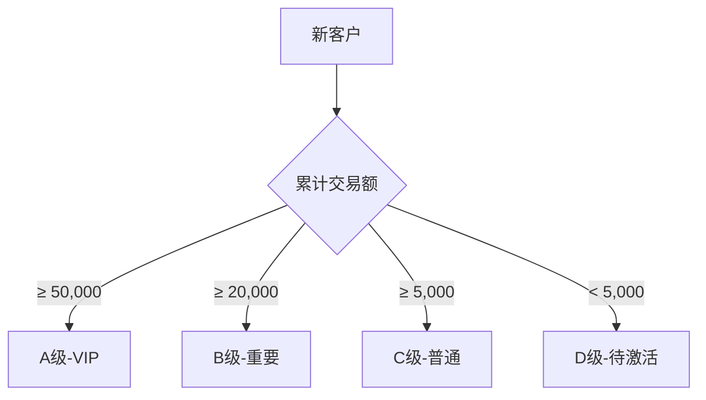

# 客户档案模块需求 (Customer)

## 协作上下文
- **上游来源**：数据主要由 Lead 转化而来。
- **关键约束**：电话号码与线索模块共用唯一性检查逻辑。

## 1. 模块概述 (Module Overview)

| 属性 | 说明 |
|:---|:---|
| **模块名称** | 客户档案 (Customer) |
| **核心价值** | 管理已成交客户，支撑复购、转介绍、售后服务 |
| **目标用户** | 销售人员、客服、店长 |
| **上游模块** | 线索 (成交自动转化) |
| **下游模块** | 订单、报价单、售后单 |

## 2. 业务场景 (Business Scenario)

### 2.1 典型场景
1. **复购下单**: 老客户再次购买，直接关联客户档案
2. **转介绍追踪**: 记录介绍人关系，统计转介绍业绩
3. **售后服务**: 客户查询历史订单和售后记录
4. **客户回访**: 基于客户分层进行定期回访
5. **客户合并**: 同一客户多个电话号码的档案合并

### 2.2 客户来源
| 来源 | 说明 |
|:---|:---|
| **线索成交** | 线索首次成交自动创建 |
| **手动创建** | 店长/客服手动创建老客户档案 |
| **数据导入** | 批量导入历史客户数据 |

## 3. 核心字段定义 (Field Definitions)

### 3.1 客户主表 (customers)

| 字段名 | 类型 | 必填 | 说明 |
|:---|:---|:---|:---|
| id | UUID | ✓ | 主键 |
| customer_no | String | ✓ | 客户编号 (CU20260101001) |
| name | String | ✓ | 客户姓名 |
| phone | String | ✓ | 主联系电话 (唯一索引) |
| phone_secondary | String | - | 备用电话 |
| wechat | String | - | 微信号 |
| gender | Enum | - | 性别 (MALE/FEMALE/UNKNOWN) |
| birthday | Date | - | 生日 (用于节日关怀) |
| source_lead_id | UUID | - | 首次来源线索ID |
| referrer_customer_id | UUID | - | 转介绍人客户ID |
| default_address | String | - | 默认地址 |
| addresses | JSONB | - | 多地址列表 |
| loyalty_points | Integer | - | 积分余额 (转介绍奖励) |
| referral_code | String | - | 专属推荐码/二维码 |
| tags | String[] | - | 标签数组 |
| level | Enum | ✓ | 价值等级 (A/B/C/D) |
| total_orders | Integer | ✓ | 累计订单数 |
| total_amount | Decimal | ✓ | 累计交易额 |
| avg_order_amount | Decimal | ✓ | 平均客单价 |
| first_order_at | DateTime | - | 首次下单时间 |
| last_order_at | DateTime | - | 最近下单时间 |
| preferences | JSONB | - | 偏好记录 (风格/颜色等) |
| notes | Text | - | 备注 |
| is_merged | Boolean | ✓ | 是否为合并档案 |
| merged_from | UUID[] | - | 合并来源客户ID |
| assigned_sales_id | UUID | - | 归属销售 (主要服务人) |
| created_by | UUID | ✓ | 创建人 |
| created_at | DateTime | ✓ | 创建时间 |
| updated_at | DateTime | ✓ | 更新时间 |

### 3.2 客户地址表 (customer_addresses)

| 字段名 | 类型 | 必填 | 说明 |
|:---|:---|:---|:---|
| id | UUID | ✓ | 主键 |
| customer_id | UUID | ✓ | 关联客户 |
| label | String | - | 地址标签 (家/公司/别墅) |
| province | String | ✓ | 省份 |
| city | String | ✓ | 城市 |
| district | String | ✓ | 区县 |
| community | String | - | 小区/楼盘 |
| detail | String | ✓ | 详细地址 |
| is_default | Boolean | ✓ | 是否默认 |
| created_at | DateTime | ✓ | 创建时间 |

### 3.3 客户偏好 JSON 结构

```typescript
interface CustomerPreferences {
  style?: string[];        // 风格偏好: 现代简约/新中式/轻奢
  color_preference?: string[];  // 颜色偏好
  budget_level?: 'high' | 'medium' | 'low';  // 预算级别
  decision_maker?: string;  // 决策人
  special_notes?: string;   // 特殊备注
}
```

## 4. 客户画像 (Customer Profile)

### 4.1 自动计算指标

| 指标 | 计算逻辑 | 更新时机 |
|:---|:---|:---|
| 累计订单数 | COUNT(orders) | 订单创建/取消 |
| 累计交易额 | SUM(orders.total_amount) | 订单完成 |
| 平均客单价 | 累计交易额 / 累计订单数 | 订单完成 |
| 首次下单 | MIN(orders.created_at) | 首单创建 |
| 最近下单 | MAX(orders.created_at) | 每次下单 |

### 4.2 价值分层规则 (可配置)



| 等级 | 条件 | 服务策略 |
|:---|:---|:---|
| **A (VIP)** | 交易额 ≥ 50,000 或 订单数 ≥ 5 | 专属客服、优先派单、节日礼品 |
| **B (重要)** | 交易额 ≥ 20,000 | 季度回访、生日祝福 |
| **C (普通)** | 交易额 ≥ 5,000 | 常规服务 |
| **D (待激活)** | 仅 1 单且 < 5,000 | 复购优惠推送 |

### 4.3 RFM 分析 (扩展)

| 维度 | 说明 | 字段 |
|:---|:---|:---|
| **R (Recency)** | 最近一次消费距今天数 | last_order_at |
| **F (Frequency)** | 消费频率 | total_orders |
| **M (Monetary)** | 消费金额 | total_amount |

## 5. 界面设计 (UI Design)

### 5.1 列表页 (Customer List)

#### 展示字段
| 字段 | 宽度 | 说明 |
|:---|:---|:---|
| 客户编号 | 130px | 可点击跳转 |
| 客户姓名 | 100px | - |
| 电话 | 120px | 可点击拨打 |
| 等级 | 60px | A/B/C/D 标签 |
| 累计交易 | 100px | 右对齐 |
| 订单数 | 60px | - |
| 最近下单 | 100px | 距今天数 |
| 归属销售 | 80px | - |
| 操作 | 150px | 按钮组 |

#### 筛选条件
| 筛选项 | 组件 | 说明 |
|:---|:---|:---|
| 等级 | `Select` (多选) | A/B/C/D |
| 归属销售 | `Select` | 店长可见全部 |
| 标签 | `Select` (多选) | 客户标签 |
| 最近下单 | `Select` | 30天内/90天内/长期未购 |
| 客户/电话/地址 | `Input.Search` | 模糊搜索 |

#### 操作按钮
| 按钮 | 说明 |
|:---|:---|
| **新建线索** | 基于客户创建新线索 |
| **新建报价** | 基于客户创建报价 |
| **查看详情** | 跳转详情页 |
| **编辑** | 编辑客户信息 |

### 5.2 详情页 (Customer Detail)

#### 页面布局
```
┌─────────────────────────────────────────────────────┐
│ 客户详情 张先生              [新建线索] [新建报价]  │
├──────────────────────┬──────────────────────────────┤
│ 基础信息卡片         │ 客户画像卡片                 │
│ 姓名/电话/微信       │ 等级/累计交易/订单数         │
├──────────────────────┼──────────────────────────────┤
│ 地址列表             │ 转介绍关系图                 │
│ (支持多地址)         │ 介绍人/被介绍人              │
├──────────────────────┴──────────────────────────────┤
│ Tab: [订单记录] [线索记录] [售后记录] [操作日志]     │
├─────────────────────────────────────────────────────┤
│                   当前 Tab 内容                      │
└─────────────────────────────────────────────────────┘
```

#### 基础信息卡片
| 字段 | 组件 | 说明 |
|:---|:---|:---|
| 姓名 | `Input` | 可编辑 |
| 电话 | `Input` + 拨打/复制 | 可编辑 |
| 备用电话 | `Input` | - |
| 微信 | `Input` | - |
| 性别 | `Radio` | 男/女 |
| 生日 | `DatePicker` | 可选 |
| 归属销售 | `Select` | 店长可修改 |
| 标签 | `Tag` + 编辑 | 可增删 |
| 备注 | `TextArea` | - |

#### 客户画像卡片
| 指标 | 展示 |
|:---|:---|
| 价值等级 | 大号 Tag (不同颜色) |
| 累计交易 | 金额 + 排名 |
| 订单数 | 数量 |
| 首次下单 | 日期 |
| 最近下单 | 距今天数 |

#### 地址管理
使用 `List` 组件：
*   每行显示一个地址
*   可标记默认地址
*   可新增/编辑/删除

#### 转介绍关系
使用简化图或列表：
*   **介绍人**: 若有，显示链接可跳转
*   **被介绍人**: 列表展示，可点击跳转

#### Tab 内容

**订单记录**
| 列 | 说明 |
|:---|:---|
| 订单号 | 可点击 |
| 金额 | - |
| 状态 | - |
| 创建时间 | - |

**线索记录**
| 列 | 说明 |
|:---|:---|
| 线索编号 | 可点击 |
| 状态 | - |
| 创建时间 | - |

**售后记录**
| 列 | 说明 |
|:---|:---|
| 工单号 | 可点击 |
| 类型 | - |
| 状态 | - |
| 创建时间 | - |

### 5.3 客户合并弹窗

使用 `Modal` 组件：

| 步骤 | 说明 |
|:---|:---|
| 1. 选择目标 | 搜索并选择要合并的另一客户 |
| 2. 数据预览 | 对比两个客户的信息 |
| 3. 选择保留 | 选择每个字段保留哪个值 |
| 4. 确认合并 | 提示不可撤销，二次确认 |

## 6. 业务规则 (Business Rules)

### 6.1 自动建档规则
*   线索成交时自动创建客户档案
*   以 `phone` 为唯一标识查重
*   若已存在，则关联而非新建

### 6.2 等级自动计算
*   订单完成时触发等级重算
*   等级只升不降 (除非手动调整)

### 6.3 合并规则
*   合并后保留主档案ID
*   被合并档案标记 `is_merged=true`
*   历史订单自动迁移到主档案
*   合并操作记录日志

### 6.4 转介绍规则
*   新线索创建时可选择介绍人
*   介绍人必须是已有客户
*   **关联方式**:
    *   **扫码关联**: 新客户扫描老客户的专属二维码填单，自动绑定 `referrer_customer_id`。
    *   **人工补录**: 销售手动选择介绍人。
*   **激励机制 (Loyalty Points)**:
    *   被介绍人成交后，系统自动发放积分给介绍人。
    *   积分可用于抵扣尾款或兑换礼品 (Phase 2)。

## 7. 权限控制 (Permission Matrix)

### 7.1 页面级权限

| 页面 | 销售 | 客服 | 财务 | 店长 |
|:---|:---|:---|:---|:---|
| 客户列表 | ✓ (本人) | ✓ | ✗ | ✓ |
| 客户详情 | ✓ (本人) | ✓ | ✗ | ✓ |
| 新建客户 | ✗ | ✓ | ✗ | ✓ |
| 合并客户 | ✗ | ✗ | ✗ | ✓ |

### 7.2 按钮级权限

| 操作 | 销售 | 客服 | 店长 |
|:---|:---|:---|:---|
| 编辑基本信息 | ✓ (本人) | ✓ | ✓ |
| 修改等级 | ✗ | ✗ | ✓ |
| 修改归属 | ✗ | ✗ | ✓ |
| 合并档案 | ✗ | ✗ | ✓ |
| 新建线索 | ✓ | ✓ | ✓ |
| 新建报价 | ✓ | ✗ | ✓ |

### 7.3 数据范围权限

| 角色 | 可见范围 |
|:---|:---|
| 销售 | 自己归属的客户 |
| 客服 | 全部客户 |
| 店长 | 本店全部客户 |

## 8. 通知与提醒 (Notifications)

| 触发事件 | 通知对象 | 渠道 | 内容 |
|:---|:---|:---|:---|
| 客户等级升级 | 销售 | 系统 | 恭喜！客户 XXX 升级为 VIP |
| 客户生日 | 归属销售 | 系统 | 客户 XXX 今天生日 |
| 长期未购提醒 | 销售 | 系统 | 客户 XXX 已 90 天未购买 |
| 转介绍成交 | 介绍人归属销售 | 系统 | 转介绍客户成交 |

## 9. 与其他模块的关联 (Module Relations)

| 模块 | 关联方式 | 数据流向 |
|:---|:---|:---|
| **线索** | Customer.source_lead_id → Lead.id | 线索 → 客户 |
| **订单** | Order.customer_id → Customer.id | 客户 → 订单 |
| **报价单** | Quote.customer_id → Customer.id | 客户 → 报价 |
| **售后单** | AfterSales.customer_id → Customer.id | 客户 → 售后 |
| **数据报表** | 客户分析、RFM 报表 | 客户 → 报表 |
