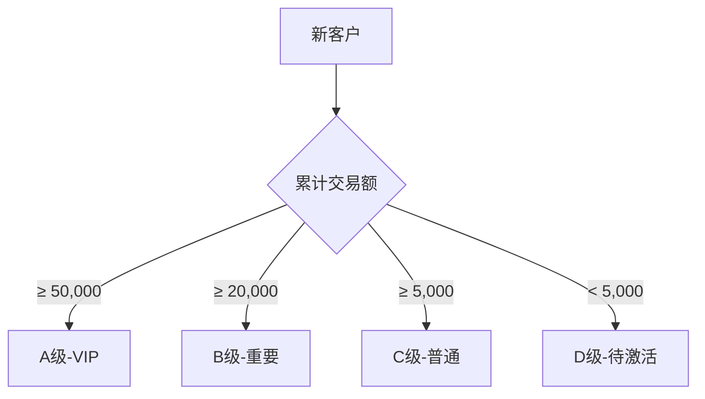

# 客户档案模块需求 (Customer)

## 协作上下文

- **上游来源**：数据主要由 Lead 转化而来。
- **关键约束**：电话号码与线索模块共用唯一性检查逻辑。

## 1. 模块概述 (Module Overview)

| 属性         | 说明                                       |
| :----------- | :----------------------------------------- |
| **模块名称** | 客户档案 (Customer)                        |
| **核心价值** | 管理已成交客户，支撑复购、转介绍、售后服务 |
| **目标用户** | 销售人员、客服、店长                       |
| **上游模块** | 线索 (成交自动转化)                        |
| **下游模块** | 订单、报价单、售后单                       |

## 2. 业务场景 (Business Scenario)

### 2.1 典型场景

1. **复购下单**: 老客户再次购买，直接关联客户档案
2. **转介绍追踪**: 记录介绍人关系，统计转介绍业绩
3. **售后服务**: 客户查询历史订单和售后记录
4. **客户回访**: 基于客户分层进行定期回访
5. **客户合并**: 同一客户多个电话号码的档案合并

### 2.2 客户来源

| 来源         | 说明                        |
| :----------- | :-------------------------- |
| **线索成交** | 线索首次成交自动创建        |
| **手动创建** | 店长/客服手动创建老客户档案 |
| **数据导入** | 批量导入历史客户数据        |

### 2.3 状态管理 (Lifecycle & Status)

采用 **"生命周期 (Lifecycle) + 关键焦点 (Pipeline Status)"** 双层状态设计，以解决多单并行时的状态展示问题。

#### 2.3.1 生命周期阶段 (Lifecycle Stage)

描述客户的成熟度，体现客户关系的深度。

| 阶段                      | 说明                             |
| :------------------------ | :------------------------------- |
| **LEAD (线索/潜在)**      | 从线索转换而来，尚未成交         |
| **OPPORTUNITY (商机)**    | 正在跟进中，有活跃的测量或报价   |
| **SIGNED (已成交)**       | 已支付定金或全款，成为正式客户   |
| **DELIVERED (交付/售后)** | 所有订单已交付，进入售后或静默期 |
| **LOST (流失/搁置)**      | 明确表示暂无需求或已流失         |

#### 2.3.2 当前焦点状态 (Pipeline Status)

描述客户当前**即时**且**最高优先级**的业务动作。取客户当前**最活跃、最晚期**的单据状态。

| 状态       | 说明                       | 触发源           |
| :--------- | :------------------------- | :--------------- |
| **待分配** | 线索刚转客户，未指派销售   | Lead转换         |
| **待跟进** | 已分配，尚未进行实质性业务 | Assign           |
| **待测量** | 已创建测量单，等待测量     | Measurement      |
| **待报价** | 测量完成，等待出报价       | Measurement      |
| **待确认** | 报价单已发送，等待客户确认 | Quote            |
| **生产中** | 订单已支付，工厂生产中     | Order            |
| **待发货** | 生产完成，等待发货         | Order            |
| **待安装** | 货物已发出，等待上门安装   | Order            |
| **已完成** | 所有活跃单据均已闭环       | Order/AfterSales |

> **优先级规则**：当客户存在多单并行时（如：衣柜订单在“生产中”，橱柜新单“待测量”），优先展示**最活跃、最需要销售介入**的状态（即“待测量”），或展示**最新**活跃单据的状态。**约定：** 显示**最新活跃**单据的状态。

## 3. 核心字段定义 (Field Definitions)

### 3.1 客户主表 (customers)

| 字段名               | 类型     | 必填 | 说明                                                 |
| :------------------- | :------- | :--- | :--------------------------------------------------- |
| id                   | UUID     | ✓    | 主键                                                 |
| customer_no          | String   | ✓    | 客户编号 (CU20260101001)                             |
| name                 | String   | ✓    | 客户姓名                                             |
| phone                | String   | ✓    | 主联系电话 (唯一索引)                                |
| phone_secondary      | String   | -    | 备用电话                                             |
| wechat               | String   | -    | 微信号                                               |
| gender               | Enum     | -    | 性别 (MALE/FEMALE/UNKNOWN)                           |
| birthday             | Date     | -    | 生日 (用于节日关怀)                                  |
| source_lead_id       | UUID     | -    | 首次来源线索ID                                       |
| referrer_customer_id | UUID     | -    | 转介绍人客户ID                                       |
| default_address      | String   | -    | 默认地址                                             |
| addresses            | JSONB    | -    | 多地址列表                                           |
| loyalty_points       | Integer  | -    | 积分余额 (转介绍奖励)                                |
| referral_code        | String   | -    | 专属推荐码/二维码                                    |
| tags                 | String[] | -    | 标签数组                                             |
| level                | Enum     | ✓    | 价值等级 (A/B/C/D)                                   |
| total_orders         | Integer  | ✓    | 累计订单数                                           |
| total_amount         | Decimal  | ✓    | 累计交易额                                           |
| avg_order_amount     | Decimal  | ✓    | 平均客单价                                           |
| first_order_at       | DateTime | -    | 首次下单时间                                         |
| last_order_at        | DateTime | -    | 最近下单时间                                         |
| preferences          | JSONB    | -    | 偏好记录 (风格/颜色等)                               |
| notes                | Text     | -    | 备注                                                 |
| lifecycle_stage      | Enum     | ✓    | 生命周期: LEAD, OPPORTUNITY, SIGNED, DELIVERED, LOST |
| pipeline_status      | Enum     | ✓    | 当前焦点: 待分配, 待跟进, 待测量...                  |

| is_merged | Boolean | ✓ | 是否为合并档案 |
| merged_from | UUID[] | - | 合并来源客户ID |
| assigned_sales_id | UUID | - | 归属销售 (主要服务人) |
| created_by | UUID | ✓ | 创建人 |
| created_at | DateTime | ✓ | 创建时间 |
| updated_at | DateTime | ✓ | 更新时间 |

### 3.2 客户地址表 (customer_addresses)

| 字段名      | 类型     | 必填 | 说明                    |
| :---------- | :------- | :--- | :---------------------- |
| id          | UUID     | ✓    | 主键                    |
| customer_id | UUID     | ✓    | 关联客户                |
| label       | String   | -    | 地址标签 (家/公司/别墅) |
| province    | String   | ✓    | 省份                    |
| city        | String   | ✓    | 城市                    |
| district    | String   | ✓    | 区县                    |
| community   | String   | -    | 小区/楼盘               |
| detail      | String   | ✓    | 详细地址                |
| is_default  | Boolean  | ✓    | 是否默认                |
| created_at  | DateTime | ✓    | 创建时间                |

### 3.3 客户偏好 JSON 结构

```typescript
interface CustomerPreferences {
  style?: string[]; // 风格偏好: 现代简约/新中式/轻奢
  color_preference?: string[]; // 颜色偏好
  budget_level?: 'high' | 'medium' | 'low'; // 预算级别
  decision_maker?: string; // 决策人
  special_notes?: string; // 特殊备注
}
```

## 4. 客户画像 (Customer Profile)

### 4.1 自动计算指标

| 指标       | 计算逻辑                 | 更新时机      |
| :--------- | :----------------------- | :------------ |
| 累计订单数 | COUNT(orders)            | 订单创建/取消 |
| 累计交易额 | SUM(orders.total_amount) | 订单完成      |
| 平均客单价 | 累计交易额 / 累计订单数  | 订单完成      |
| 首次下单   | MIN(orders.created_at)   | 首单创建      |
| 最近下单   | MAX(orders.created_at)   | 每次下单      |

### 4.2 价值分层规则 (可配置)



| 等级           | 条件                          | 服务策略                     |
| :------------- | :---------------------------- | :--------------------------- |
| **A (VIP)**    | 交易额 ≥ 50,000 或 订单数 ≥ 5 | 专属客服、优先派单、节日礼品 |
| **B (重要)**   | 交易额 ≥ 20,000               | 季度回访、生日祝福           |
| **C (普通)**   | 交易额 ≥ 5,000                | 常规服务                     |
| **D (待激活)** | 仅 1 单且 < 5,000             | 复购优惠推送                 |

### 4.3 RFM 分析 (扩展)

| 维度              | 说明                 | 字段          |
| :---------------- | :------------------- | :------------ |
| **R (Recency)**   | 最近一次消费距今天数 | last_order_at |
| **F (Frequency)** | 消费频率             | total_orders  |
| **M (Monetary)**  | 消费金额             | total_amount  |

## 5. 界面设计 (UI Design)

### 5.1 列表页 (Customer List)

#### 展示字段

| 字段     | 宽度  | 说明         |
| :------- | :---- | :----------- |
| 客户编号 | 130px | 可点击跳转   |
| 客户姓名 | 100px | -            |
| 电话     | 120px | 可点击拨打   |
| 等级     | 60px  | A/B/C/D 标签 |
| 累计交易 | 100px | 右对齐       |
| 订单数   | 60px  | -            |
| 最近下单 | 100px | 距今天数     |
| 归属销售 | 80px  | -            |
| 操作     | 150px | 按钮组       |

#### 筛选条件

| 筛选项         | 组件            | 说明                   |
| :------------- | :-------------- | :--------------------- |
| 等级           | `Select` (多选) | A/B/C/D                |
| 归属销售       | `Select`        | 店长可见全部           |
| 标签           | `Select` (多选) | 客户标签               |
| 最近下单       | `Select`        | 30天内/90天内/长期未购 |
| 客户/电话/地址 | `Input.Search`  | 模糊搜索               |

#### 操作按钮

| 按钮         | 说明               |
| :----------- | :----------------- |
| **新建线索** | 基于客户创建新线索 |
| **新建报价** | 基于客户创建报价   |
| **查看详情** | 跳转详情页         |
| **编辑**     | 编辑客户信息       |

### 5.2 详情页 (Customer Detail)

#### 页面布局

```
┌─────────────────────────────────────────────────────┐
│ 客户详情 张先生              [新建线索] [新建报价]  │
├──────────────────────┬──────────────────────────────┤
│ 基础信息卡片         │ 客户画像卡片                 │
│ 姓名/电话/微信       │ 等级/累计交易/订单数         │
├──────────────────────┼──────────────────────────────┤
│ 地址列表             │ 转介绍关系图                 │
│ (支持多地址)         │ 介绍人/被介绍人              │
├──────────────────────┴──────────────────────────────┤
│ Tab: [订单记录] [线索记录] [售后记录] [操作日志]     │
├─────────────────────────────────────────────────────┤
│                   当前 Tab 内容                      │
└─────────────────────────────────────────────────────┘
```

#### 基础信息卡片

| 字段     | 组件                | 说明       |
| :------- | :------------------ | :--------- |
| 姓名     | `Input`             | 可编辑     |
| 电话     | `Input` + 拨打/复制 | 可编辑     |
| 备用电话 | `Input`             | -          |
| 微信     | `Input`             | -          |
| 性别     | `Radio`             | 男/女      |
| 生日     | `DatePicker`        | 可选       |
| 归属销售 | `Select`            | 店长可修改 |
| 标签     | `Tag` + 编辑        | 可增删     |
| 备注     | `TextArea`          | -          |

#### 客户画像卡片

| 指标     | 展示                |
| :------- | :------------------ |
| 价值等级 | 大号 Tag (不同颜色) |
| 累计交易 | 金额 + 排名         |
| 订单数   | 数量                |
| 首次下单 | 日期                |
| 最近下单 | 距今天数            |

#### 地址管理

使用 `List` 组件：

- 每行显示一个地址
- 可标记默认地址
- 可新增/编辑/删除

#### 转介绍关系

使用简化图或列表：

- **介绍人**: 若有，显示链接可跳转
- **被介绍人**: 列表展示，可点击跳转

#### Tab 内容

**订单记录**
| 列 | 说明 |
|:---|:---|
| 订单号 | 可点击 |
| 金额 | - |
| 状态 | - |
| 创建时间 | - |

**线索记录**
| 列 | 说明 |
|:---|:---|
| 线索编号 | 可点击 |
| 状态 | - |
| 创建时间 | - |

**售后记录**
| 列 | 说明 |
|:---|:---|
| 工单号 | 可点击 |
| 类型 | - |
| 状态 | - |
| 创建时间 | - |

### 5.3 客户合并弹窗

使用 `Modal` 组件：

| 步骤        | 说明                       |
| :---------- | :------------------------- |
| 1. 选择目标 | 搜索并选择要合并的另一客户 |
| 2. 数据预览 | 对比两个客户的信息         |
| 3. 选择保留 | 选择每个字段保留哪个值     |
| 4. 确认合并 | 提示不可撤销，二次确认     |

## 6. 业务规则 (Business Rules)

### 6.1 自动建档规则

- 线索成交时自动创建客户档案
- 以 `phone` 为唯一标识查重
- 若已存在，则关联而非新建

### 6.2 等级自动计算

- 订单完成时触发等级重算
- 等级只升不降 (除非手动调整)

### 6.3 合并规则 (Merge Rules)

#### 6.3.1 合并操作流程

1. **选择目标档案**：用户选择要合并的两个或多个客户档案
2. **数据预览与对比**：系统展示所有字段的差异，用户选择保留值
3. **二次确认**：系统提示"合并操作不可撤销"，需用户再次确认
4. **执行合并**：系统执行数据库级合并操作
5. **记录日志**：记录合并操作详情，便于审计和追溯

#### 6.3.2 字段优先级规则

当两个客户档案存在字段冲突时，系统按以下优先级规则处理：

| 字段类型     | 优先规则     | 说明                                           |
| :----------- | :----------- | :--------------------------------------------- |
| **主键ID**   | 保留主档案ID | 用户选择的主档案ID作为合并后的ID               |
| **非空字段** | 非空优先     | 若主档案某字段为空，自动使用被合并档案的非空值 |
| **冲突字段** | 最新更新优先 | 若两档案该字段均有值，保留最新更新时间的值     |
| **累计指标** | 累加计算     | total_orders、total_amount等指标累加           |
| **时间字段** | 最早/最新    | first_order_at取最早，last_order_at取最新      |

**示例**：

```typescript
// 主档案 (Customer A)
{
  name: "张三",
  phone: "138****0001",
  phone_secondary: null,
  total_orders: 2,
  total_amount: 10000,
  updated_at: "2026-01-10"
}

// 被合并档案 (Customer B)
{
  name: "张三",
  phone: "138****0002",
  phone_secondary: "139****9999",
  total_orders: 1,
  total_amount: 5000,
  updated_at: "2026-01-15"
}

// 合并后结果
{
  name: "张三",                    // 保留主档案
  phone: "138****0001",           // 保留主档案
  phone_secondary: "139****9999",  // 从B档案补充（主档案为空）
  total_orders: 3,                // 累加: 2 + 1
  total_amount: 15000,            // 累加: 10000 + 5000
  updated_at: "2026-01-15"        // 取最新更新时间
}
```

#### 6.3.3 关联数据迁移

合并客户档案时，所有关联子表的外键必须全部更新指向新的主档案ID。

| 关联表                 | 外键字段    | 迁移动作                                                                                  |
| :--------------------- | :---------- | :---------------------------------------------------------------------------------------- |
| **orders**             | customer_id | UPDATE orders SET customer_id = 主档案ID WHERE customer_id IN (被合并档案IDs)             |
| **quotes**             | customer_id | UPDATE quotes SET customer_id = 主档案ID WHERE customer_id IN (被合并档案IDs)             |
| **leads**              | customer_id | UPDATE leads SET customer_id = 主档案ID WHERE customer_id IN (被合并档案IDs)              |
| **after_sales**        | customer_id | UPDATE after_sales SET customer_id = 主档案ID WHERE customer_id IN (被合并档案IDs)        |
| **customer_addresses** | customer_id | UPDATE customer_addresses SET customer_id = 主档案ID WHERE customer_id IN (被合并档案IDs) |
| **measurements**       | customer_id | UPDATE measurements SET customer_id = 主档案ID WHERE customer_id IN (被合并档案IDs)       |

**重要提示**：

- 所有关联数据迁移必须在同一事务中执行，确保数据一致性
- 迁移前需进行数据完整性校验
- 迁移后需触发相关统计指标的重新计算

#### 6.3.4 合并后处理

1. **标记被合并档案**：将被合并档案的 `is_merged` 字段设置为 `true`
2. **记录合并来源**：在主档案的 `merged_from` 数组中记录被合并档案的ID
3. **软删除被合并档案**：将被合并档案标记为已删除，保留历史记录
4. **触发审计日志**：记录合并操作的详细信息

```typescript
interface CustomerMergeLog {
  id: UUID;
  primary_customer_id: UUID; // 主档案ID
  merged_customer_ids: UUID[]; // 被合并档案ID列表
  operator_id: UUID; // 操作人ID
  merge_time: DateTime; // 合并时间
  field_conflicts: JSONB; // 字段冲突记录
  affected_tables: String[]; // 受影响的关联表
}
```

#### 6.3.5 不可逆警告

**重要提示**：客户合并操作为**不可逆操作**，一旦执行无法撤销（除非DBA直接操作数据库）。

**系统提示文案**：

```
⚠️ 警告：此操作不可撤销！

合并后：
• 被合并的客户档案将被标记为已合并，无法恢复
• 所有历史订单、报价单、线索记录将关联到主档案
• 被合并档案的ID将不再可用

请确认您已核对所有字段信息，确保合并无误后再继续。

[取消]  [我已确认，执行合并]
```

**回滚方案**（仅限DBA）：

- 若必须回滚，需DBA手动执行数据库回滚脚本
- 回滚需恢复所有关联表的外键关系
- 建议在合并前进行数据库备份

### 6.4 转介绍规则

- 新线索创建时可选择介绍人
- 介绍人必须是已有客户
- **关联方式**:
  - **扫码关联**: 新客户扫描老客户的专属二维码填单，自动绑定 `referrer_customer_id`。
  - **人工补录**: 销售手动选择介绍人。
- **激励机制 (Loyalty Points)**:
  - 被介绍人成交后，系统自动发放积分给介绍人。
  - 积分可用于抵扣尾款或兑换礼品 (Phase 2)。

### 6.5 状态自动流转规则

系统需监听各业务模块的事件，自动更新客户的双层状态。

| 触发事件              | 变更 Lifecycle Stage            | 变更 Pipeline Status | 说明                                                   |
| :-------------------- | :------------------------------ | :------------------- | :----------------------------------------------------- |
| **Lead 转客户**       | -> LEAD                         | -> 待分配/待跟进     | 线索首次成交自动创建客户档案                           |
| **测量单创建**        | LEAT -> OPPORTUNITY             | -> 待测量            | 客户开始进入商机阶段                                   |
| **测量完成**          | -                               | -> 待报价            | 测量数据已收集完成                                     |
| **报价单发送**        | -                               | -> 待确认            | 报价单已发送给客户                                     |
| **订单支付(签约)**    | -> SIGNED                       | -> 生产中            | 订单已支付，进入生产阶段                               |
| **订单发货**          | -                               | -> 待安装            | 货物已发出，等待安装                                   |
| **订单安装完成**      | -> DELIVERED (若无其他活跃单)   | -> 已完成            | 所有订单已完成交付                                     |
| **订单取消/全额退款** | SIGNED -> OPPORTUNITY 或 SIGNED | 根据剩余订单状态调整 | 若无其他活跃订单，状态回退；若有未付款订单，保持SIGNED |
| **标记流失**          | -> LOST                         | -                    | 客户明确表示暂无需求或已流失                           |

#### 6.5.1 订单取消/全额退款的状态回退逻辑

当客户订单发生取消或全额退款时，系统需根据客户剩余订单情况调整状态：

| 场景      | 剩余订单情况   | Lifecycle Stage       | Pipeline Status | 说明                                  |
| :-------- | :------------- | :-------------------- | :-------------- | :------------------------------------ |
| **场景1** | 无任何活跃订单 | SIGNED -> OPPORTUNITY | -> 待跟进       | 客户所有订单已取消，回退至商机阶段    |
| **场景2** | 有未付款订单   | 保持 SIGNED           | -> 待确认       | 客户仍有未付款订单，保持已成交状态    |
| **场景3** | 有生产中订单   | 保持 SIGNED           | -> 生产中       | 客户仍有活跃订单，保持当前状态        |
| **场景4** | 有已完成订单   | SIGNED -> DELIVERED   | -> 已完成       | 客户有历史完成订单，进入交付/售后阶段 |

**判断逻辑**：

```typescript
function handleOrderCancellation(customerId: UUID, cancelledOrderId: UUID) {
  // 1. 查询客户所有活跃订单（排除已取消订单）
  const activeOrders = getActiveOrders(customerId, [cancelledOrderId]);

  if (activeOrders.length === 0) {
    // 场景1：无活跃订单，回退至OPPORTUNITY
    updateLifecycleStage(customerId, 'OPPORTUNITY');
    updatePipelineStatus(customerId, '待跟进');
  } else {
    // 场景2-4：有活跃订单，根据最新订单状态调整
    const latestOrder = getLatestOrder(activeOrders);
    updateLifecycleStage(customerId, 'SIGNED');
    updatePipelineStatus(customerId, latestOrder.status);
  }
}
```

**重要提示**：

- 订单取消/退款后，需重新计算客户的累计交易额和订单数
- 若客户等级因取消而下降，需触发等级变更通知
- 状态回退需记录操作日志，便于追溯

## 7. 权限控制 (Permission Matrix)

### 7.1 页面级权限

| 页面     | 销售     | 客服 | 财务 | 店长 |
| :------- | :------- | :--- | :--- | :--- |
| 客户列表 | ✓ (本人) | ✓    | ✗    | ✓    |
| 客户详情 | ✓ (本人) | ✓    | ✗    | ✓    |
| 新建客户 | ✗        | ✓    | ✗    | ✓    |
| 合并客户 | ✗        | ✗    | ✗    | ✓    |

### 7.2 按钮级权限

| 操作         | 销售     | 客服 | 店长 |
| :----------- | :------- | :--- | :--- |
| 编辑基本信息 | ✓ (本人) | ✓    | ✓    |
| 修改等级     | ✗        | ✗    | ✓    |
| 修改归属     | ✗        | ✗    | ✓    |
| 合并档案     | ✗        | ✗    | ✓    |
| 新建线索     | ✓        | ✓    | ✓    |
| 新建报价     | ✓        | ✗    | ✓    |

### 7.3 数据范围权限

| 角色 | 可见范围       |
| :--- | :------------- |
| 销售 | 自己归属的客户 |
| 客服 | 全部客户       |
| 店长 | 本店全部客户   |

### 7.4 数据安全与隐私 (Data Security & Privacy)

#### 7.4.1 手机号脱敏展示

系统默认对客户手机号进行脱敏处理，保护客户隐私。

| 场景     | 展示格式      | 说明           |
| :------- | :------------ | :------------- |
| 列表页   | `138****1234` | 默认脱敏展示   |
| 详情页   | `138****1234` | 默认脱敏展示   |
| 报表导出 | `138****1234` | 导出时默认脱敏 |

#### 7.4.2 完整号码查看权限

仅特定角色可查看完整手机号，并记录操作日志。

| 角色     | 查看权限 | 操作方式                       |
| :------- | :------- | :----------------------------- |
| 归属销售 | ✓        | 点击脱敏号码，弹窗显示完整号码 |
| 店长     | ✓        | 点击脱敏号码，弹窗显示完整号码 |
| 客服     | ✗        | 仅能查看脱敏号码               |
| 财务     | ✗        | 仅能查看脱敏号码               |

**操作日志记录**：

```typescript
interface PhoneViewLog {
  id: UUID;
  customer_id: UUID;
  viewer_id: UUID; // 查看人ID
  viewer_name: String; // 查看人姓名
  viewer_role: String; // 查看人角色
  view_time: DateTime; // 查看时间
  ip_address: String; // IP地址
}
```

#### 7.4.3 导出控制

为防止敏感数据泄露，导出功能需进行严格控制。

| 导出类型     | 控制方式     | 说明                               |
| :----------- | :----------- | :--------------------------------- |
| 完整数据导出 | 二次密码确认 | 需输入登录密码验证身份             |
| 脱敏数据导出 | 无需确认     | 默认导出脱敏数据（手机号、地址等） |
| 批量导出     | 权限审批     | 超过100条需店长审批                |

**导出日志记录**：

```typescript
interface ExportLog {
  id: UUID;
  operator_id: UUID;
  export_type: 'FULL' | 'MASKED';
  record_count: Integer;
  file_path: String;
  created_at: DateTime;
}
```

## 8. 通知与提醒 (Notifications)

| 触发事件     | 通知对象       | 渠道 | 内容                      |
| :----------- | :------------- | :--- | :------------------------ |
| 客户等级升级 | 销售           | 系统 | 恭喜！客户 XXX 升级为 VIP |
| 客户生日     | 归属销售       | 系统 | 客户 XXX 今天生日         |
| 长期未购提醒 | 销售           | 系统 | 客户 XXX 已 90 天未购买   |
| 转介绍成交   | 介绍人归属销售 | 系统 | 转介绍客户成交            |

## 9. 与其他模块的关联 (Module Relations)

| 模块         | 关联方式                             | 数据流向    |
| :----------- | :----------------------------------- | :---------- |
| **线索**     | Customer.source_lead_id → Lead.id    | 线索 → 客户 |
| **订单**     | Order.customer_id → Customer.id      | 客户 → 订单 |
| **报价单**   | Quote.customer_id → Customer.id      | 客户 → 报价 |
| **售后单**   | AfterSales.customer_id → Customer.id | 客户 → 售后 |
| **数据报表** | 客户分析、RFM 报表                   | 客户 → 报表 |
