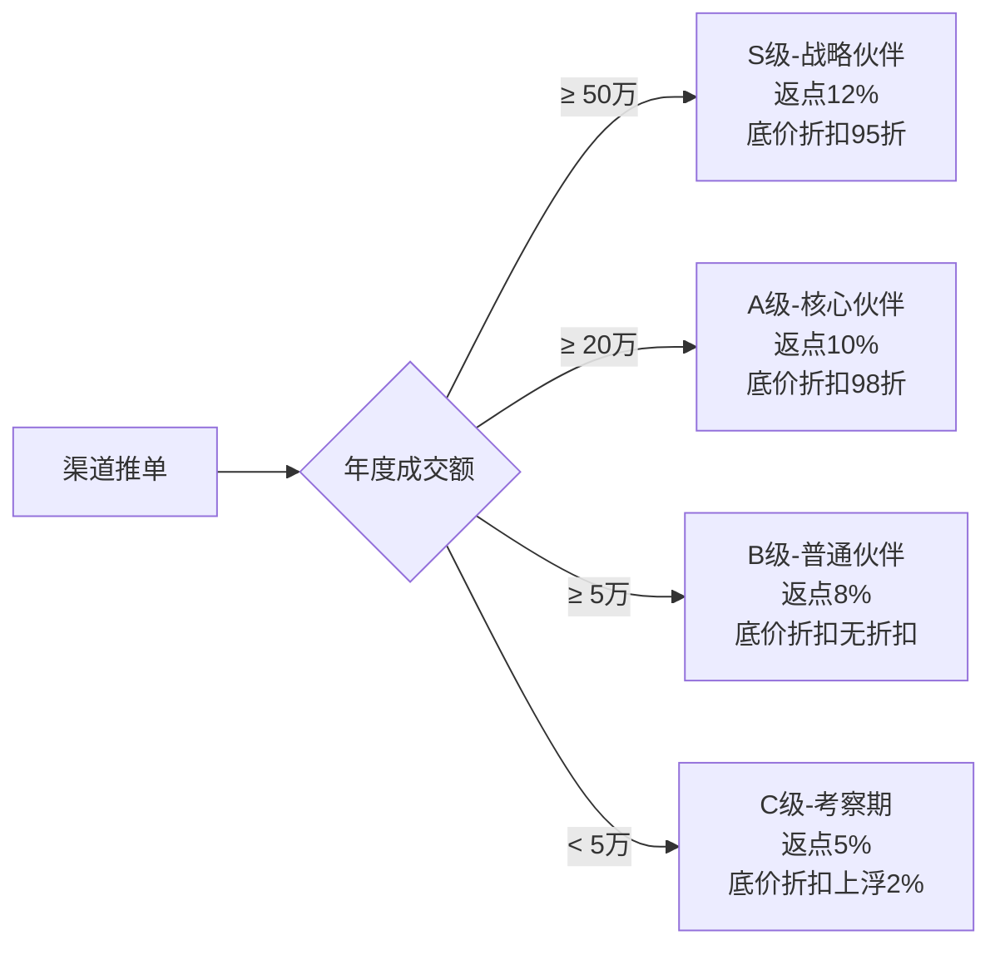

# 渠道合作伙伴模块需求 (Channel/Partner)

> **设计增强 (2026-01-21)**
> 
> 基于业务讨论，对原始需求进行了以下增强：
> 
> | 增强项 | 说明 |
> |--------|------|
> | **多层级结构** | 支持三级：一级渠道 → 二级部门 → 三级成员 |
> | **可配置类型** | 渠道类型支持租户自定义添加 |
> | **混合结算** | 可按公司或个人级别结算 |
> | **结算周期** | 支持月结和单结两种模式 |
> | **等级评定** | 系统自动建议 + 手动确认调整 |
> 
> 详细设计方案见：[2026-01-21-channel-module-design.md](../plans/2026-01-21-channel-module-design.md)

## 协作上下文
- **业务驱动**：
    - 通过 Lead 状态变化来累加业绩。
    - 通过 Finance 状态变化来触发返佣。

## 1. 模块概述 (Module Overview)

| 属性 | 说明 |
| --- | --- |
| **模块名称** | 渠道管理 (Channel) |
| **核心价值** | 管理引流源头（装企、设计师等），监控引流效率，支撑结算返点 |
| **渠道类型** | 装修公司 (Company)、设计师 (Designer)、异业合作伙伴 (Partner)，支持租户自定义 |
| **层级结构** | 三级：一级渠道 → 二级部门 → 三级成员 |
| **核心流程** | 渠道签约 -> 线索报备 -> 成交统计 -> 佣金结算 |

### 1.1 系统边界说明 (System Scope)

#### Phase 1 阶段范围
当前版本（Phase 1）的渠道管理模块**仅供内部使用**，暂不提供渠道方独立访问权限。

| 功能特性 | Phase 1 实现状态 | 说明 |
|:---|:---|:---|
| **渠道档案管理** | ✓ | 内部人员可维护渠道信息 |
| **线索报备** | ✓ | 销售人员代录渠道线索 |
| **业绩统计** | ✓ | 内部报表查看渠道业绩 |
| **佣金结算** | ✓ | 内部人员处理结算流程 |
| **渠道方Portal** | ✗ | 暂不提供渠道方独立登录后台 |
| **渠道方自主报备** | ✗ | 暂不支持渠道方直接录入线索 |

#### 渠道方通知机制
Phase 1 阶段，渠道方通过以下方式接收业绩通报：

| 通知类型 | 通知方式 | 说明 |
|:---|:---|:---|
| **成交通知** | 微信通知 / 短信 | 客户成交后自动发送通知 |
| **业绩报表** | 微信推送 / 邮件 | 定期推送月度/季度业绩报表 |
| **结算通知** | 短信 / 邮件 | 佣金结算完成后发送通知 |

#### Phase 2 规划（未来版本）
未来版本将考虑提供以下功能：
- 渠道方独立Portal登录
- 渠道方自主报备线索
- 渠道方实时查看业绩数据
- 渠道方在线申请结算

## 2. 业务场景 (Business Scenario)

### 2.1 典型场景

1. **设计师推单**：某设计师推荐客户，录入时关联该设计师，成交后自动计算佣金。
2. **装企集采/派单**：圣都等装修公司批量派单，统一对账。
3. **异业互带**：与地板、家具店互带客户。
4. **渠道等级评定**：根据年度推单金额，提供评级参考和数据分析报表，支持手动调整等级和返点比例。
5. **底价供货模式**：为装修公司设置渠道结算价（如商品对客价100元，渠道结算价80元），根据渠道等级可调整结算价折扣（如S级渠道结算价75元）。

## 3. 核心字段定义 (Field Definitions)

### 3.1 渠道主表 (channels)

| 字段名 | 类型 | 必填 | 说明 |
| --- | --- | --- | --- |
| id | UUID | ✓ | 主键 |
| channel_type | Enum | ✓ | DECORATION_CO (装企) / DESIGNER (设计师) / CROSS_INDUSTRY (异业) |
| name | String | ✓ | 渠道名称 (公司名或个人名) |
| code | String | ✓ | 渠道编号 (QD2026xxxx) |
| level | Enum | ✓ | 等级 (S/A/B/C) |
| contact_name | String | ✓ | 核心联系人 |
| phone | String | ✓ | 联系电话 |
| commission_rate | Decimal | ✓ | **约定返点比例 (如 10%)** |
| commission_type | Enum | - | 返点类型 (FIXED-固定点位 / TIERED-阶梯点位) |
| tiered_rates | JSONB | - | 阶梯返点配置 (如: [{"min": 0, "rate": 10}, {"min": 200000, "rate": 12}]) |
| cooperation_mode | Enum | ✓ | 合作模式 (BASE_PRICE-底价供货 / COMMISSION-返佣) |
| price_discount_rate | Decimal | - | 底价供货模式的等级折扣率 (如 0.95 表示95折) |
| settlement_type | Enum | ✓ | 结算方式 (PREPAY-先付 / MONTHLY-月结) |
| bank_info | JSONB | - | 结算银行账户信息 |
| contract_files | JSONB | - | 合作协议附件 (OSS Key) |
| total_leads | Integer | ✓ | 累计提供线索数 |
| total_deal_amount | Decimal | ✓ | 累计成交总额 |
| status | Enum | ✓ | 合作中 / 暂停合作 / 已解约 |
| assigned_manager_id | UUID | ✓ | 维护该渠道的内部负责人 |

### 3.2 渠道联系人表 (channel_contacts)

*注：针对装修公司，可能需要对接多个设计师或项目经理。*

| 字段名 | 类型 | 必填 | 说明 |
| --- | --- | --- | --- |
| id | UUID | ✓ | 主键 |
| channel_id | UUID | ✓ | 关联渠道 |
| name | String | ✓ | 姓名 |
| position | String | - | 职务 (设计师/项目经理/老板) |
| phone | String | ✓ | 电话 |
| is_main | Boolean | ✓ | 是否主对接人 |

## 4. 渠道价值分层 (Channel Profiling)

### 4.1 租户级别等级规则配置 (可配置)

系统支持在租户级别配置渠道等级评定规则，各租户可根据自身业务特点设置不同的等级标准和返点策略。

**配置项**：
- 等级名称（S/A/B/C）
- 年度成交额阈值
- 对应的返点比例或阶梯返点配置
- 底价供货模式的等级折扣率（如S级0.95、A级0.98、B级1.00、C级1.02）

**示例配置**：


**功能说明**：
- 系统根据配置的规则自动计算渠道当前等级
- 提供等级分布报表和趋势分析
- 支持手动调整渠道等级（需记录调整原因）
- 支持设置阶梯返点：当年度成交额达到特定阈值时，自动提高返点比例
- 支持配置底价供货模式的等级折扣率，不同租户可设置不同的折扣策略

### 4.2 不同渠道类型的返点逻辑差异

**设计师渠道**：
- **返点类型**：通常采用固定点位（FIXED），如固定10%返点
- **结算方式**：偏向先付（PREPAY），现金流敏感
- **合作模式**：主要采用返佣（COMMISSION）模式
- **特点**：推单量相对较小，但单笔金额可能较大，需要快速结算

**装修公司渠道**：
- **返点类型**：可采用阶梯点位（TIERED），如：
  - 0-20万：8%
  - 20-50万：10%
  - 50万以上：12%
- **结算方式**：偏向月结（MONTHLY），符合企业财务流程
- **合作模式**：可采用底价供货（BASE_PRICE）或返佣（COMMISSION）
- **特点**：推单量大且稳定，适合批量合作，可灵活调整返点策略

### 4.3 底价供货模式说明

**底价供货模式**：为渠道设置专属的结算价格，同一商品同时存在对客价和渠道结算价。

**价格体系**：
- **对客价**：面向终端客户的销售价格
- **渠道结算价**：面向渠道的结算价格（通常低于对客价）
- **等级折扣**：根据渠道等级调整结算价，支持在租户级别配置，如：
  - S级渠道：结算价 = 标准渠道价 × 租户配置折扣率（如 0.95）
  - A级渠道：结算价 = 标准渠道价 × 租户配置折扣率（如 0.98）
  - B级渠道：结算价 = 标准渠道价 × 租户配置折扣率（如 1.00）
  - C级渠道：结算价 = 标准渠道价 × 租户配置折扣率（如 1.02）

**配置说明**：
- 各租户可根据自身业务特点，在租户级别配置不同等级的折扣率
- 支持灵活调整折扣策略，如对S级渠道给予更大折扣激励
- 配置变更后，新订单自动应用新的折扣率

**示例**：
- 商品A对客价：100元
- 标准渠道结算价：80元
- 某租户配置：S级95折，B级无折扣
- S级渠道结算价：80 × 0.95 = 76元
- B级渠道结算价：80 × 1.00 = 80元

**适用场景**：
- 适合装修公司等批量采购场景
- 价格透明，便于渠道计算利润空间
- 可通过等级折扣激励渠道提升业绩
- 租户可自主配置折扣策略，灵活适应不同市场

## 5. 界面设计 (UI Design)

### 5.1 渠道列表页 (Channel List)

* **核心展示**：渠道名称、类型、当前等级、**本月推单数**、**待结算佣金**、负责人。
* **快捷操作**：一键报备线索、生成对账单。

### 5.2 渠道详情页 (Channel Detail)

* **看板区**：展示该渠道的"转化率漏斗"（推单数 -> 成交数 -> 成交额）。
* **带单人/设计师维度**：
  - 对于装修公司：展示各设计师/项目经理的推单数、成交数、成交额、转化率排行
  - 对于设计师：展示个人详细业绩数据
  - 支持按带单人筛选和对比分析
* **关联列表**：展示所有由该渠道引入的"客户档案"和"订单记录"，支持按带单人维度查看。
* **结算页签**：展示历史结算记录、待结算金额，支持按带单人维度拆分结算。

## 6. 核心业务规则 (Business Rules)

### 6.1 线索关联规则 (Lead Attribution)

* 创建线索时，必须选择 `channel_id`。
* **唯一性校验**：若 A 渠道已报备某客户，B 渠道在 30 天内不得重复报备（保护先行报备者）。

### 6.2 佣金结算逻辑

#### 6.2.1 结算时机
订单完成（全额回款）后，自动生成一条待结算佣金记录。

#### 6.2.2 佣金计算公式

**返佣模式**：
```
结算金额 = 订单实付金额 × 渠道约定返点比例
```

**底价供货模式**：
```
结算金额 = Σ(商品结算价 × 数量)
其中商品结算价根据渠道等级有不同折扣
```

#### 6.2.3 结算单据链路 (Settlement Document Flow)

渠道佣金结算需与财务模块进行完整的单据流转，确保财务数据的准确性和可追溯性。

**完整链路**：
```
订单完成
  ↓
生成待结算佣金记录 (channel_commissions)
  ↓
生成佣金结算单 (channel_settlements)
  ↓
生成付款申请单 (payment_requests)
  ↓
流转至财务模块审批
  ↓
财务审批通过
  ↓
出纳打款
  ↓
更新佣金状态为已支付
```

#### 6.2.4 单据详细说明

**1. 渠道佣金记录表 (channel_commissions)**

| 字段名 | 类型 | 说明 |
|:---|:---|:---|
| id | UUID | 主键 |
| channel_id | UUID | 渠道ID |
| order_id | UUID | 关联订单ID |
| commission_type | Enum | 佣金类型: COMMISSION(返佣) / BASE_PRICE(底价供货) |
| order_amount | Decimal | 订单实付金额 |
| commission_rate | Decimal | 返点比例 |
| commission_amount | Decimal | 佣金金额 |
| status | Enum | 状态: PENDING(待结算) / SETTLED(已结算) / PAID(已支付) / VOID(作废) |
| settlement_id | UUID | 关联结算单ID |
| created_at | DateTime | 创建时间 |

**2. 渠道结算单表 (channel_settlements)**

| 字段名 | 类型 | 说明 |
|:---|:---|:---|
| id | UUID | 主键 |
| settlement_no | String | 结算单号 (STL2026010001) |
| channel_id | UUID | 渠道ID |
| settlement_period_start | Date | 结算周期开始日期 |
| settlement_period_end | Date | 结算周期结束日期 |
| total_commission_amount | Decimal | 总佣金金额 |
| adjustment_amount | Decimal | 调整金额（负数表示扣减） |
| final_amount | Decimal | 最终结算金额 |
| status | Enum | 状态: DRAFT(草稿) / PENDING(待审批) / APPROVED(已审批) / PAID(已支付) |
| payment_request_id | UUID | 关联付款申请单ID |
| created_by | UUID | 创建人 |
| created_at | DateTime | 创建时间 |
| approved_by | UUID | 审批人 |
| approved_at | DateTime | 审批时间 |

**3. 付款申请单表 (payment_requests)**

| 字段名 | 类型 | 说明 |
|:---|:---|:---|
| id | UUID | 主键 |
| request_no | String | 申请单号 (PAY2026010001) |
| payment_type | Enum | 付款类型: COMMISSION_PAYOUT(佣金支付) / SUPPLIER_PAYMENT(供应商付款) / REFUND(退款) |
| related_id | UUID | 关联单据ID (结算单ID) |
| payee_name | String | 收款人名称 |
| payee_account | String | 收款账号 |
| payee_bank | String | 收款银行 |
| amount | Decimal | 付款金额 |
| status | Enum | 状态: PENDING(待审批) / APPROVED(已审批) / PAID(已支付) / REJECTED(已拒绝) |
| created_by | UUID | 创建人 |
| created_at | DateTime | 创建时间 |
| approved_by | UUID | 审批人 |
| approved_at | DateTime | 审批时间 |
| paid_at | DateTime | 支付时间 |

#### 6.2.5 财务模块集成

**财务模块需增加的款项类型**：

| 款项类型 | 代码 | 说明 |
|:---|:---|:---|
| **佣金支付** | COMMISSION_PAYOUT | 渠道佣金结算支付 |
| **供应商付款** | SUPPLIER_PAYMENT | 供应商货款支付 |
| **退款** | REFUND | 客户退款 |
| **其他支出** | OTHER_EXPENSE | 其他费用支出 |

**财务审批流程**：

```
付款申请单创建
  ↓
店长审批 (金额 < 10,000)
  ↓
财务经理审批 (金额 ≥ 10,000)
  ↓
出纳打款
  ↓
更新付款状态
```

#### 6.2.6 结算流程示例

**场景**：2026年1月，渠道"圣都装修"有3笔订单完成，需要进行佣金结算。

**步骤1：生成佣金记录**
```sql
-- 订单ORD2026010001完成，生成佣金记录
INSERT INTO channel_commissions (channel_id, order_id, commission_type, order_amount, commission_rate, commission_amount, status)
VALUES ('圣都装修ID', 'ORD2026010001', 'COMMISSION', 10000, 0.10, 1000, 'PENDING');

-- 订单ORD2026010002完成，生成佣金记录
INSERT INTO channel_commissions (channel_id, order_id, commission_type, order_amount, commission_rate, commission_amount, status)
VALUES ('圣都装修ID', 'ORD2026010002', 'COMMISSION', 20000, 0.10, 2000, 'PENDING');

-- 订单ORD2026010003完成，生成佣金记录
INSERT INTO channel_commissions (channel_id, order_id, commission_type, order_amount, commission_rate, commission_amount, status)
VALUES ('圣都装修ID', 'ORD2026010003', 'COMMISSION', 15000, 0.10, 1500, 'PENDING');
```

**步骤2：生成结算单**
```sql
-- 生成结算单
INSERT INTO channel_settlements (settlement_no, channel_id, settlement_period_start, settlement_period_end, total_commission_amount, adjustment_amount, final_amount, status)
VALUES ('STL2026010001', '圣都装修ID', '2026-01-01', '2026-01-31', 4500, 0, 4500, 'PENDING');

-- 更新佣金记录的结算单ID
UPDATE channel_commissions SET settlement_id = 'STL2026010001' WHERE channel_id = '圣都装修ID' AND status = 'PENDING';
```

**步骤3：生成付款申请单**
```sql
-- 生成付款申请单
INSERT INTO payment_requests (request_no, payment_type, related_id, payee_name, payee_account, payee_bank, amount, status)
VALUES ('PAY2026010001', 'COMMISSION_PAYOUT', 'STL2026010001', '圣都装修', '6222********1234', '中国工商银行', 4500, 'PENDING');

-- 更新结算单的付款申请单ID
UPDATE channel_settlements SET payment_request_id = 'PAY2026010001' WHERE id = 'STL2026010001';
```

**步骤4：财务审批**
```sql
-- 店长审批
UPDATE payment_requests SET status = 'APPROVED', approved_by = '店长ID', approved_at = NOW() WHERE id = 'PAY2026010001';

-- 更新结算单状态
UPDATE channel_settlements SET status = 'APPROVED' WHERE id = 'STL2026010001';
```

**步骤5：出纳打款**
```sql
-- 出纳打款
UPDATE payment_requests SET status = 'PAID', paid_at = NOW() WHERE id = 'PAY2026010001';

-- 更新结算单状态
UPDATE channel_settlements SET status = 'PAID' WHERE id = 'STL2026010001';

-- 更新佣金记录状态
UPDATE channel_commissions SET status = 'PAID' WHERE settlement_id = 'STL2026010001';
```

#### 6.2.7 审批流配置

系统支持灵活配置审批流程，可根据金额大小设置不同的审批层级。

**审批规则配置**：
```typescript
interface ApprovalRule {
  payment_type: Enum;           // 付款类型
  min_amount: Decimal;          // 最小金额
  max_amount: Decimal;          // 最大金额
  approval_level: Integer;       // 审批层级
  approver_role: Enum;          // 审批人角色
}

// 示例配置
const approvalRules = [
  {
    payment_type: 'COMMISSION_PAYOUT',
    min_amount: 0,
    max_amount: 10000,
    approval_level: 1,
    approver_role: 'STORE_MANAGER'
  },
  {
    payment_type: 'COMMISSION_PAYOUT',
    min_amount: 10000,
    max_amount: null,
    approval_level: 2,
    approver_role: 'FINANCE_MANAGER'
  }
];
```

#### 6.2.8 审批流

*   **佣金结算需经由店长或财务审核。**

### 6.3 冲突处理
若客户是"老客户转介绍"同时又是"设计师推荐"，系统默认以**首个录入来源**为准，或支持手动拆分奖励（加分项）。

### 6.4 退单佣金处理 (Commission Clawback)

当订单发生退款时，系统需对已生成的佣金进行相应的处理，确保佣金结算的准确性。

#### 6.4.1 全额退款处理
当订单发生全额退款时，按以下规则处理佣金：

| 佣金状态 | 处理方式 | 说明 |
|:---|:---|:---|
| **待结算** | 标记为 "Void" (作废) | 佣金记录保留，但状态标记为已作废，不参与结算 |
| **已结算** | 生成负向扣减记录 | 在下期结算单中生成负向扣减记录，抵扣已结算金额 |
| **已支付** | 生成负向扣减记录 | 在下期结算单中生成负向扣减记录，需渠道方退回 |

**处理流程**：
```typescript
function handleFullRefund(orderId: UUID) {
  // 1. 查询该订单对应的佣金记录
  const commission = getCommissionByOrderId(orderId);
  
  if (commission.status === 'PENDING') {
    // 待结算：直接标记为作废
    updateCommissionStatus(commission.id, 'VOID');
  } else if (commission.status === 'SETTLED' || commission.status === 'PAID') {
    // 已结算或已支付：生成负向扣减记录
    createClawbackRecord({
      channel_id: commission.channel_id,
      original_commission_id: commission.id,
      amount: -commission.amount,
      reason: '订单全额退款',
      order_id: orderId
    });
    
    // 更新渠道累计成交额
    updateChannelTotalDealAmount(commission.channel_id, -commission.order_amount);
  }
}
```

#### 6.4.2 部分退款处理
当订单发生部分退款时，按比例重新计算佣金，并在下期结算中进行差额调整。

**计算公式**：
```
原佣金 = 订单实付金额 × 渠道返点比例
退款佣金 = 退款金额 × 渠道返点比例
调整后佣金 = 原佣金 - 退款佣金
```

**处理流程**：
```typescript
function handlePartialRefund(orderId: UUID, refundAmount: Decimal) {
  // 1. 查询该订单对应的佣金记录
  const commission = getCommissionByOrderId(orderId);
  
  // 2. 计算退款对应的佣金
  const refundCommission = refundAmount * commission.commission_rate;
  
  // 3. 生成佣金调整记录
  createCommissionAdjustment({
    channel_id: commission.channel_id,
    original_commission_id: commission.id,
    adjustment_amount: -refundCommission,
    reason: '订单部分退款',
    order_id: orderId,
    refund_amount: refundAmount
  });
  
  // 4. 更新渠道累计成交额
  updateChannelTotalDealAmount(commission.channel_id, -refundAmount);
}
```

#### 6.4.3 佣金调整记录表结构

```typescript
interface CommissionAdjustment {
  id: UUID;
  channel_id: UUID;              // 渠道ID
  original_commission_id: UUID;  // 原佣金记录ID
  adjustment_type: Enum;         // 调整类型: FULL_REFUND, PARTIAL_REFUND
  adjustment_amount: Decimal;    // 调整金额（负数表示扣减）
  reason: String;                // 调整原因
  order_id: UUID;                // 关联订单ID
  refund_amount: Decimal;        // 退款金额
  created_at: DateTime;          // 创建时间
  created_by: UUID;              // 操作人
}
```

#### 6.4.4 结算单据处理

当佣金发生调整时，系统需在结算单中体现：

| 调整类型 | 结算单展示 | 说明 |
|:---|:---|:---|
| **全额退款** | 显示 "佣金作废" | 原佣金记录标记为作废，不参与结算 |
| **部分退款** | 显示 "佣金调整" | 在结算单中显示调整后的佣金金额 |
| **负向扣减** | 显示 "佣金扣减" | 在结算单中显示负向扣减金额，需渠道方退回 |

**结算单示例**：
```
渠道名称：圣都装修
结算周期：2026年1月
--------------------------------------------------
订单号         | 订单金额 | 佣金比例 | 佣金金额
--------------------------------------------------
ORD2026010001  | 10,000   | 10%     | 1,000
ORD2026010002  | 20,000   | 10%     | 2,000
--------------------------------------------------
小计：                    | 3,000

佣金调整：
- 订单ORD2026010001全额退款 | -1,000
- 订单ORD2026010002部分退款 | -500
--------------------------------------------------
调整后小计：               | 1,500

历史负向扣减：
- 2025年12月佣金扣减      | -200
--------------------------------------------------
本期应结算：               | 1,300
```

#### 6.4.5 通知机制

当佣金发生调整时，系统需通知相关方：

| 调整类型 | 通知对象 | 通知方式 | 通知内容 |
|:---|:---|:---|:---|
| **全额退款** | 渠道负责人 | 短信/邮件 | "订单XXX已全额退款，对应佣金已作废" |
| **部分退款** | 渠道负责人 | 短信/邮件 | "订单XXX发生部分退款，佣金已调整" |
| **负向扣减** | 渠道负责人 | 短信/邮件 | "本期结算包含负向扣减XXX元" |

---

### 三、 给 Vibe Coding 的整合建议（重点）

当你让 AI 实现这两个模块时，请强调以下 **“全闭环”** 逻辑：

1. **数据流向指令**：
> "当一个 Lead (线索) 的状态变为 '已成交' 时，系统应自动执行以下动作：


> 1. 在 `customers` 表创建/更新档案。
> 2. 检查该线索是否有 `channel_id`，若有，在 `channel_commissions` 表生成待结算记录。
> 3. 更新对应渠道的 `total_deal_amount` 指标。"
> 
> 


2. **通用组件复用**：
> "请利用之前设计的 **Excel 交换组件**。我需要能批量导入历史渠道数据，并能导出每个渠道的月度对账报表。"


3. **关系图谱（加分项）**：
> "在客户详情页，如果该客户是由渠道推荐的，请清晰展示渠道来源（如：来源圣都装修-张设计师）。"


