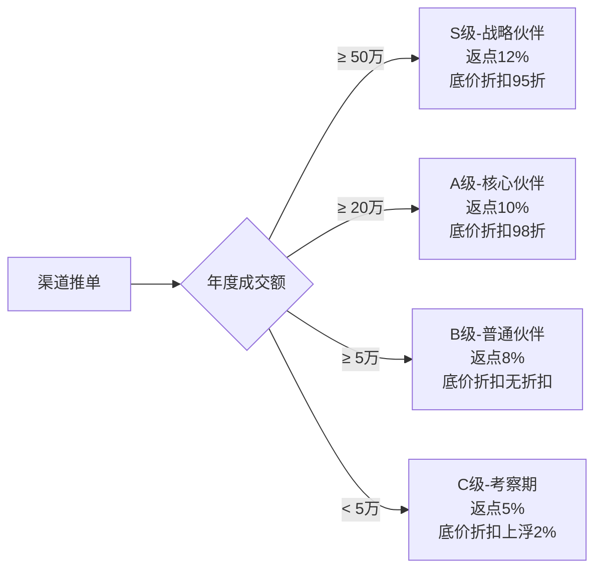

# 渠道合作伙伴模块需求 (Channel/Partner)

## 协作上下文
- **业务驱动**：
    - 通过 Lead 状态变化来累加业绩。
    - 通过 Finance 状态变化来触发返佣。

## 1. 模块概述 (Module Overview)

| 属性 | 说明 |
| --- | --- |
| **模块名称** | 渠道管理 (Channel) |
| **核心价值** | 管理引流源头（装企、设计师等），监控引流效率，支撑结算返点 |
| **渠道类型** | 装修公司 (Company)、设计师 (Designer)、异业合作伙伴 (Partner) |
| **核心流程** | 渠道签约 -> 线索报备 -> 成交统计 -> 佣金结算 |

## 2. 业务场景 (Business Scenario)

### 2.1 典型场景

1. **设计师推单**：某设计师推荐客户，录入时关联该设计师，成交后自动计算佣金。
2. **装企集采/派单**：圣都等装修公司批量派单，统一对账。
3. **异业互带**：与地板、家具店互带客户。
4. **渠道等级评定**：根据年度推单金额，提供评级参考和数据分析报表，支持手动调整等级和返点比例。
5. **底价供货模式**：为装修公司设置渠道结算价（如商品对客价100元，渠道结算价80元），根据渠道等级可调整结算价折扣（如S级渠道结算价75元）。

## 3. 核心字段定义 (Field Definitions)

### 3.1 渠道主表 (channels)

| 字段名 | 类型 | 必填 | 说明 |
| --- | --- | --- | --- |
| id | UUID | ✓ | 主键 |
| channel_type | Enum | ✓ | DECORATION_CO (装企) / DESIGNER (设计师) / CROSS_INDUSTRY (异业) |
| name | String | ✓ | 渠道名称 (公司名或个人名) |
| code | String | ✓ | 渠道编号 (QD2026xxxx) |
| level | Enum | ✓ | 等级 (S/A/B/C) |
| contact_name | String | ✓ | 核心联系人 |
| phone | String | ✓ | 联系电话 |
| commission_rate | Decimal | ✓ | **约定返点比例 (如 10%)** |
| commission_type | Enum | - | 返点类型 (FIXED-固定点位 / TIERED-阶梯点位) |
| tiered_rates | JSONB | - | 阶梯返点配置 (如: [{"min": 0, "rate": 10}, {"min": 200000, "rate": 12}]) |
| cooperation_mode | Enum | ✓ | 合作模式 (BASE_PRICE-底价供货 / COMMISSION-返佣) |
| price_discount_rate | Decimal | - | 底价供货模式的等级折扣率 (如 0.95 表示95折) |
| settlement_type | Enum | ✓ | 结算方式 (PREPAY-先付 / MONTHLY-月结) |
| bank_info | JSONB | - | 结算银行账户信息 |
| contract_files | JSONB | - | 合作协议附件 (OSS Key) |
| total_leads | Integer | ✓ | 累计提供线索数 |
| total_deal_amount | Decimal | ✓ | 累计成交总额 |
| status | Enum | ✓ | 合作中 / 暂停合作 / 已解约 |
| assigned_manager_id | UUID | ✓ | 维护该渠道的内部负责人 |

### 3.2 渠道联系人表 (channel_contacts)

*注：针对装修公司，可能需要对接多个设计师或项目经理。*

| 字段名 | 类型 | 必填 | 说明 |
| --- | --- | --- | --- |
| id | UUID | ✓ | 主键 |
| channel_id | UUID | ✓ | 关联渠道 |
| name | String | ✓ | 姓名 |
| position | String | - | 职务 (设计师/项目经理/老板) |
| phone | String | ✓ | 电话 |
| is_main | Boolean | ✓ | 是否主对接人 |

## 4. 渠道价值分层 (Channel Profiling)

### 4.1 租户级别等级规则配置 (可配置)

系统支持在租户级别配置渠道等级评定规则，各租户可根据自身业务特点设置不同的等级标准和返点策略。

**配置项**：
- 等级名称（S/A/B/C）
- 年度成交额阈值
- 对应的返点比例或阶梯返点配置
- 底价供货模式的等级折扣率（如S级0.95、A级0.98、B级1.00、C级1.02）

**示例配置**：

**功能说明**：
- 系统根据配置的规则自动计算渠道当前等级
- 提供等级分布报表和趋势分析
- 支持手动调整渠道等级（需记录调整原因）
- 支持设置阶梯返点：当年度成交额达到特定阈值时，自动提高返点比例
- 支持配置底价供货模式的等级折扣率，不同租户可设置不同的折扣策略

### 4.2 不同渠道类型的返点逻辑差异

**设计师渠道**：
- **返点类型**：通常采用固定点位（FIXED），如固定10%返点
- **结算方式**：偏向先付（PREPAY），现金流敏感
- **合作模式**：主要采用返佣（COMMISSION）模式
- **特点**：推单量相对较小，但单笔金额可能较大，需要快速结算

**装修公司渠道**：
- **返点类型**：可采用阶梯点位（TIERED），如：
  - 0-20万：8%
  - 20-50万：10%
  - 50万以上：12%
- **结算方式**：偏向月结（MONTHLY），符合企业财务流程
- **合作模式**：可采用底价供货（BASE_PRICE）或返佣（COMMISSION）
- **特点**：推单量大且稳定，适合批量合作，可灵活调整返点策略

### 4.3 底价供货模式说明

**底价供货模式**：为渠道设置专属的结算价格，同一商品同时存在对客价和渠道结算价。

**价格体系**：
- **对客价**：面向终端客户的销售价格
- **渠道结算价**：面向渠道的结算价格（通常低于对客价）
- **等级折扣**：根据渠道等级调整结算价，支持在租户级别配置，如：
  - S级渠道：结算价 = 标准渠道价 × 租户配置折扣率（如 0.95）
  - A级渠道：结算价 = 标准渠道价 × 租户配置折扣率（如 0.98）
  - B级渠道：结算价 = 标准渠道价 × 租户配置折扣率（如 1.00）
  - C级渠道：结算价 = 标准渠道价 × 租户配置折扣率（如 1.02）

**配置说明**：
- 各租户可根据自身业务特点，在租户级别配置不同等级的折扣率
- 支持灵活调整折扣策略，如对S级渠道给予更大折扣激励
- 配置变更后，新订单自动应用新的折扣率

**示例**：
- 商品A对客价：100元
- 标准渠道结算价：80元
- 某租户配置：S级95折，B级无折扣
- S级渠道结算价：80 × 0.95 = 76元
- B级渠道结算价：80 × 1.00 = 80元

**适用场景**：
- 适合装修公司等批量采购场景
- 价格透明，便于渠道计算利润空间
- 可通过等级折扣激励渠道提升业绩
- 租户可自主配置折扣策略，灵活适应不同市场

## 5. 界面设计 (UI Design)

### 5.1 渠道列表页 (Channel List)

* **核心展示**：渠道名称、类型、当前等级、**本月推单数**、**待结算佣金**、负责人。
* **快捷操作**：一键报备线索、生成对账单。

### 5.2 渠道详情页 (Channel Detail)

* **看板区**：展示该渠道的"转化率漏斗"（推单数 -> 成交数 -> 成交额）。
* **带单人/设计师维度**：
  - 对于装修公司：展示各设计师/项目经理的推单数、成交数、成交额、转化率排行
  - 对于设计师：展示个人详细业绩数据
  - 支持按带单人筛选和对比分析
* **关联列表**：展示所有由该渠道引入的"客户档案"和"订单记录"，支持按带单人维度查看。
* **结算页签**：展示历史结算记录、待结算金额，支持按带单人维度拆分结算。

## 6. 核心业务规则 (Business Rules)

### 6.1 线索关联规则 (Lead Attribution)

* 创建线索时，必须选择 `channel_id`。
* **唯一性校验**：若 A 渠道已报备某客户，B 渠道在 30 天内不得重复报备（保护先行报备者）。

### 6.2 佣金结算逻辑

* **结算时机**：订单完成（全额回款）后，自动生成一条待结算佣金记录。
* **返佣模式计算公式**：`结算金额 = 订单实付金额 * 渠道约定返点比例`。
* **底价供货模式计算公式**：`结算金额 = Σ(商品结算价 × 数量)`，其中商品结算价根据渠道等级有不同折扣。
* **审批流**：佣金结算需经由店长或财务审核。

### 6.3 冲突处理

* 若客户是“老客户转介绍”同时又是“设计师推荐”，系统默认以**首个录入来源**为准，或支持手动拆分奖励（加分项）。

---

### 三、 给 Vibe Coding 的整合建议（重点）

当你让 AI 实现这两个模块时，请强调以下 **“全闭环”** 逻辑：

1. **数据流向指令**：
> "当一个 Lead (线索) 的状态变为 '已成交' 时，系统应自动执行以下动作：

> 1. 在 `customers` 表创建/更新档案。
> 2. 检查该线索是否有 `channel_id`，若有，在 `channel_commissions` 表生成待结算记录。
> 3. 更新对应渠道的 `total_deal_amount` 指标。"
> 
> 

2. **通用组件复用**：
> "请利用之前设计的 **Excel 交换组件**。我需要能批量导入历史渠道数据，并能导出每个渠道的月度对账报表。"

3. **关系图谱（加分项）**：
> "在客户详情页，如果该客户是由渠道推荐的，请清晰展示渠道来源（如：来源圣都装修-张设计师）。"

