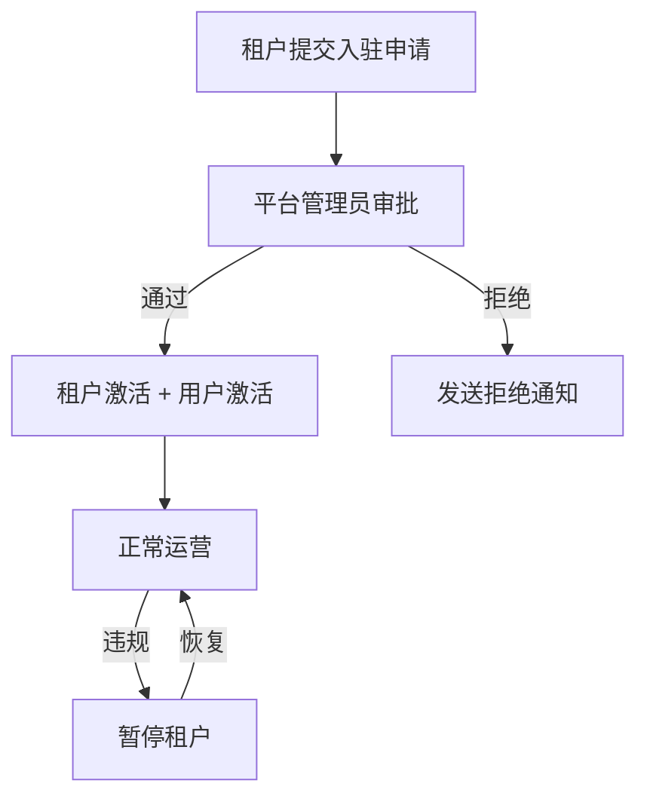

# 平台管理模块需求文档

> 模块路径：`src/features/platform/`
> 当前版本：L4（升级自 L2）
> 最后更新：2026-02-21

---

## 1. 功能概述

平台管理模块为 L2C SaaS 平台的**超级管理层**，管理租户入驻和平台级配置。与 Admin（租户内部管理）层级不同，本模块面向**平台运营团队**。



---

## 2. 核心功能

### 2.1 租户自助注册（`tenant-registration.ts`）

| 功能 | 说明 |
|---|---|
| 表单校验 | Zod Schema 校验：企业名称 2-100 字、手机号正则、邮箱格式、密码 ≥8 位含字母数字 |
| 重复检测 | 手机号/邮箱不允许重复注册 |
| 频率限制 | 同一手机号 24 小时内最多提交 3 次申请 |
| 注册流程 | 事务中同时创建 `tenants`（待审批态）和 `users`（BOSS 角色，待激活） |
| 管理员通知 | 异步邮件通知所有平台管理员（带 3 次重试机制） |

### 2.2 租户审批管理（`admin-actions.ts`）

| 操作 | 入口函数 | 前置条件 | 后置动作 |
|---|---|---|---|
| 获取待审批列表 | `getPendingTenants` | isPlatformAdmin | - |
| 获取所有租户 | `getAllTenants` | isPlatformAdmin | 支持分页 |
| 审批通过 | `approveTenant` | isPlatformAdmin + status=pending_approval | 激活租户+用户 + 审计日志 + 微信通知 |
| 拒绝申请 | `rejectTenant` | isPlatformAdmin + status=pending_approval + 需填拒绝原因 | 审计日志 + 微信通知 |
| 暂停租户 | `suspendTenant` | isPlatformAdmin | 同步停用租户和所有用户 + 审计日志 |
| 恢复租户 | `activateTenant` | isPlatformAdmin + status=suspended | 同步恢复租户和用户 + 审计日志 |

### 2.3 企业认证审核

| 操作 | 入口函数 | 说明 |
|---|---|---|
| 待认证列表 | `getVerificationPendingTenants` | 查询 verificationStatus=pending 的租户 |
| 通过认证 | `approveVerification` | 更新状态为 verified + 审计日志 |
| 驳回认证 | `rejectVerification` | 需填驳回原因 + 审计日志 |

---

## 3. 安全措施

### 3.1 权限模型

| 层级 | 检查方式 | 说明 |
|---|---|---|
| 平台级 | `requirePlatformAdmin()` | 查询 `users.isPlatformAdmin` 字段 |
| 认证 | `auth()` Session | 所有操作需先验证登录状态 |

> [!IMPORTANT]
> 平台级操作**不使用** RBAC（`checkPermission`），而是独立的 `isPlatformAdmin` 字段，因为平台管理员跨越租户边界。

### 3.2 注册安全

| 措施 | 说明 |
|---|---|
| 输入校验 | Zod Schema 严格校验所有字段 |
| 密码安全 | bcryptjs 12 轮哈希 |
| 重复检测 | 手机号/邮箱全局唯一 |
| 频率限制 | 同一手机号 24 小时最多 3 次 |

### 3.3 审计日志

所有写操作均使用 `AuditService.record()` 记录，包括操作类型、操作人、变更字段等。

---

## 4. 数据模型

### 4.1 租户状态流转

```
pending_approval → active（审批通过）
pending_approval → rejected（审批拒绝）
active → suspended（暂停）
suspended → active（恢复）
```

### 4.2 认证状态流转

```
unverified → pending（提交认证）
pending → verified（认证通过）
pending → rejected（认证驳回）
```

---

## 5. 技术实现说明

| 依赖 | 用途 |
|---|---|
| `drizzle-orm` | 数据库查询和事务 |
| `bcryptjs` | 密码哈希 |
| `nanoid` | 生成唯一租户代码 |
| `zod` | 输入校验 |
| `@/shared/lib/email` | 管理员邮件通知 |
| `@/services/wechat-subscribe-message.service` | 微信订阅消息通知 |
