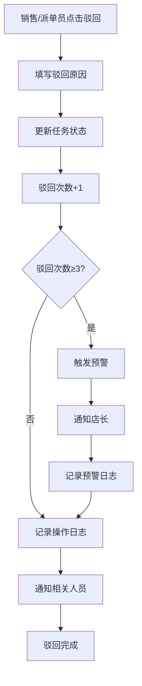
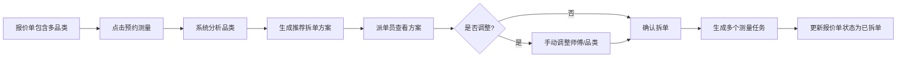
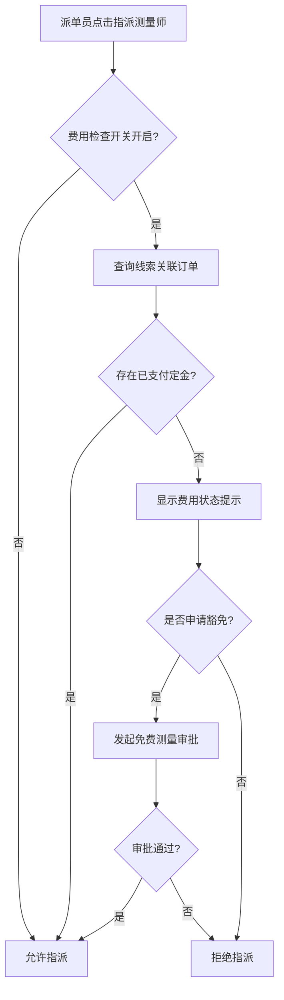
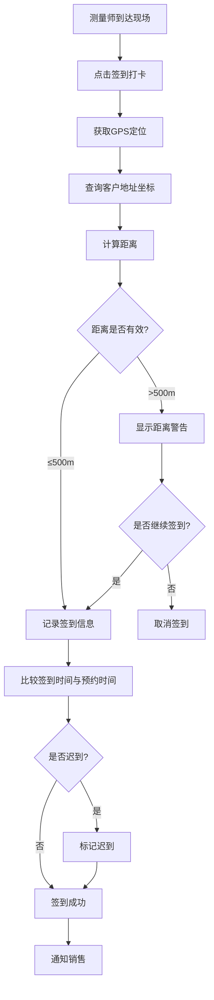
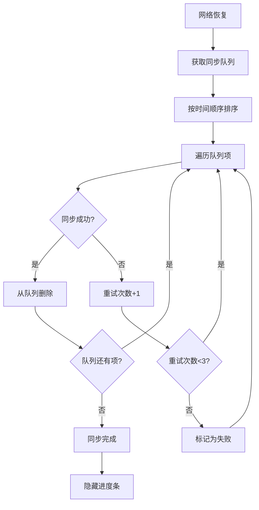

# 测量单模块需求 (Measurement)

## 1. 模块概述 (Module Overview)

| 属性         | 说明                                               |
| :----------- | :------------------------------------------------- |
| **模块名称** | 测量单 (Measure Task / Measure Sheet)              |
| **核心价值** | L2C 链路中真实数据的源头，决定报价准确性和生产规格 |
| **目标用户** | 测量师傅、派单员、销售人员、店长                   |
| **上游模块** | 线索、报价单                                       |
| **下游模块** | 报价单 (尺寸数据)                                  |

## 2. 业务场景 (Business Scenario)

测量单是整个 L2C 链路中真实数据的源头。测量师傅手持卷尺或激光测距仪，在客户装修现场对每一个窗户进行实地测量。这些数据直接决定了后续报价的准确性和工厂生产的规格。

## 2. 核心字段定义 (Field Definitions)

### 2.1 基础信息

| 字段名 (DB/TS)    | 类型     | 说明                                                                   |
| :---------------- | :------- | :--------------------------------------------------------------------- |
| lead_id           | UUID     | 关联线索 ID (Source)                                                   |
| measure_no        | String   | 测量单号 (例: MS20251230001)                                           |
| measured_by       | UUID     | 执行测量的师傅 ID                                                      |
| status            | Enum     | 状态: DRAFT (草稿), PENDING_REVIEW (待审), CONFIRMED (已确认)          |
| check_in_time     | DateTime | 测量师现场打卡时间 (用于考核履约准时率)                                |
| check_in_location | JSON     | 打卡位置坐标 (Lat/Long/Address)                                        |
| round             | Integer  | 测量轮次 (1=首次, 2=二次上门...)                                       |
| variant           | String   | 方案分支 (A, B, C...)                                                  |
| version_display   | String   | 版本展示号 (例: V1.A, V2.B)，由系统自动生成，格式为 V{round}.{variant} |
| parent_id         | UUID     | 若为新版本，关联上一个版本的 ID，用于版本追溯；首次测量时为 null       |

## 3. 状态流转 (State Machine)

测量模块涉及"任务 (Task)"和"数据 (Sheet)"两个维度的状态。

### 3.1 测量任务 (Measure Task)

负责人员调度与进度履约。

| 状态名                       | 说明                                     | 触发动作                                               |
| :--------------------------- | :--------------------------------------- | :----------------------------------------------------- |
| **待分配 (PENDING)**         | 初始状态，等待派单。                     | 线索转化/手动创建                                      |
| **分配中 (DISPATCHING)**     | 已指派具体测量师，等待接单。             | 派单员选择测量师并点击"指派"                           |
| **待上门 (PENDING_VISIT)**   | 测量师已接单，等待上门。                 | 测量师点击"接单"                                       |
| **待确认 (PENDING_CONFIRM)** | 测量已完成（数据已提交），等待销售确认。 | **数据驱动**: 测量师提交了 Measure Sheet (Confirmed)。 |
| **已完成 (COMPLETED)**       | 销售确认数据无误，流程结束。             | 销售点击"确认"                                         |
| **已取消 (CANCELLED)**       | 任务终止。                               | 销售取消预约                                           |

#### 状态回滚/驳回机制 (Rollback / Reject)

系统支持在特定状态下将任务驳回至上一状态，便于处理异常情况。


##### 驳回规则

| 当前状态   | 可驳回至 | 触发场景                      | 操作人      |
| :--------- | :------- | :---------------------------- | :---------- |
| **待确认** | 待上门   | 销售发现数据有误，要求重测    | 销售        |
| **待上门** | 分配中   | 工人临时有事无法上门          | 工人/派单员 |
| **分配中** | 待分配   | 工人拒绝接单 / 派单员取消指派 | 工人/派单员 |

##### 驳回操作规范

- **必填驳回原因**: 每次驳回必须填写原因，记录到操作日志
- **关联数据处理**:
  - 从"待确认"驳回到"待上门"时，关联的 Measure Sheet 状态重置为 `DRAFT`
- **通知机制**: 驳回后自动通知相关人员（销售/工人/派单员）
- **驳回次数限制**: 同一任务累计驳回次数 ≥ 3 次时，自动升级预警给店长

#### 3.1.5 驳回预警机制 (Reject Warning Mechanism)

驳回预警机制用于监控高频驳回任务，及时发现问题并升级处理，防止质量问题持续发生。

##### 3.1.5.1 驳回次数统计

**统计规则**:

- **累计计数**: 从任务创建开始，累计所有驳回操作次数
- **计数范围**: 包含所有状态的驳回（待确认→待上门、待上门→分配中等）
- **重置条件**: 任务完成（COMPLETED）或取消（CANCELLED）后，驳回次数不再增加

**数据存储**:

```json
{
  "rejectCount": 2,
  "rejectReason": "测量数据与实际不符",
  "lastRejectedAt": "2026-01-16T14:30:00Z",
  "rejectHistory": [
    {
      "fromStatus": "PENDING_CONFIRM",
      "toStatus": "PENDING_VISIT",
      "reason": "宽度数据有误",
      "rejectedBy": "user-uuid",
      "rejectedAt": "2026-01-15T10:00:00Z"
    },
    {
      "fromStatus": "PENDING_CONFIRM",
      "toStatus": "PENDING_VISIT",
      "reason": "高度数据有误",
      "rejectedBy": "user-uuid",
      "rejectedAt": "2026-01-16T14:30:00Z"
    }
  ]
}
```

##### 3.1.5.2 驳回预警等级

| 驳回次数 | 预警等级 | 处理方式                           |
| :------- | :------- | :--------------------------------- |
| 0-1次    | 正常     | 无预警                             |
| 2次      | 黄色预警 | 记录日志，提示测量师注意           |
| 3次      | 橙色预警 | 自动通知店长，要求介入             |
| ≥4次     | 红色预警 | 通知店长和区域经理，可能更换测量师 |

##### 3.1.5.3 驳回预警触发逻辑

**函数**: `checkRejectWarning(taskId)`

```typescript
async function checkRejectWarning(taskId: string): Promise<void> {
  const task = await getMeasureTaskById(taskId);

  if (task.rejectCount >= 3) {
    // 查找店长
    const storeManager = await getStoreManager(task.storeId);

    // 创建通知
    await createNotification({
      recipientId: storeManager.id,
      type: 'MEASURE_REJECT_WARNING',
      title: `测量任务 ${task.measureNo} 驳回次数预警`,
      content: `任务已累计驳回 ${task.rejectCount} 次，请及时介入处理`,
      priority: task.rejectCount >= 4 ? 'HIGH' : 'MEDIUM',
      metadata: {
        taskId: task.id,
        measureNo: task.measureNo,
        rejectCount: task.rejectCount,
        rejectReason: task.rejectReason,
      },
    });

    // 记录预警日志
    await createAuditLog({
      entityType: 'measure_task',
      entityId: task.id,
      action: 'REJECT_WARNING',
      details: {
        rejectCount: task.rejectCount,
        notifiedUserId: storeManager.id,
      },
    });
  }
}
```

##### 3.1.5.4 驳回操作流程



##### 3.1.5.5 驳回预警通知内容

**通知模板**: `MEASURE_REJECT_WARNING`

**通知内容**:

```
【测量任务驳回预警】

任务编号: MS20260116001
客户姓名: 张三
客户地址: 上海市黄浦区南京东路123号
测量师: 李师傅
驳回次数: 3次

最新驳回原因: 测量数据与实际不符

请及时介入处理，避免影响客户体验。

点击查看详情: [任务链接]
```

##### 3.1.5.6 UI展示规范

**任务列表页**:

- 驳回次数徽章：
  - 0-1次: 不显示
  - 2次: 黄色徽章 "驳回×2"
  - 3次: 橙色徽章 "驳回×3"
  - ≥4次: 红色徽章 "驳回×4"

**任务详情页**:

- 驳回次数区域：
  ```
  ┌─────────────────────────────────┐
  │ 驳回记录                        │
  ├─────────────────────────────────┤
  │ 累计驳回: 3次 ⚠️               │
  │                                 │
  │ 驳回历史:                        │
  │ 2026-01-16 14:30 高度数据有误    │
  │ 2026-01-15 10:00 宽度数据有误    │
  │ 2026-01-14 16:20 照片不清晰      │
  └─────────────────────────────────┘
  ```

**驳回对话框**:

- 驳回前提示：
  ```
  ⚠️ 当前任务已驳回 2 次
  本次驳回后将触发店长预警
  是否继续驳回？
  ```
- 驳回原因输入：
  - 必填字段
  - 提供常用原因快捷选择
  - 支持自定义输入

##### 3.1.5.7 驳回预警处理

**店长处理流程**:

1. 查看驳回历史和原因
2. 联系测量师了解情况
3. 判断是否需要：
   - 更换测量师
   - 提供培训
   - 调整测量标准
4. 记录处理结果

**处理结果记录**:

```json
{
  "warningId": "uuid",
  "taskId": "uuid",
  "rejectCount": 3,
  "handledBy": "store-manager-uuid",
  "handledAt": "2026-01-16T15:00:00Z",
  "action": "RETRAIN_WORKER",
  "remarks": "已与测量师沟通，提供培训"
}
```

##### 3.1.5.8 驳回数据统计

**统计维度**:

- 按测量师统计驳回率
- 按时间段统计驳回次数
- 按驳回原因分类统计

**报表展示**:

- 驳回率排行榜
- 驳回原因分布（饼图）
- 高频驳回任务列表
- 驳回趋势图（按周/月）

**驳回率计算**:

```
驳回率 = (驳回任务数 / 总任务数) × 100%
```

##### 3.1.5.9 驳回预警配置

**租户配置项**:

```json
{
  "REJECT_WARNING_THRESHOLD": 3,
  "REJECT_CRITICAL_THRESHOLD": 4,
  "REJECT_WARNING_NOTIFIER_ROLE": "STORE_MANAGER",
  "REJECT_CRITICAL_NOTIFIER_ROLE": ["STORE_MANAGER", "REGIONAL_MANAGER"]
}
```

**配置说明**:

- `REJECT_WARNING_THRESHOLD`: 驳回预警阈值（默认3次）
- `REJECT_CRITICAL_THRESHOLD`: 驳回严重阈值（默认4次）
- `REJECT_WARNING_NOTIFIER_ROLE`: 预警通知人角色
- `REJECT_CRITICAL_NOTIFIER_ROLE`: 严重预警通知人角色列表

### 3.2 测量数据 (Measure Sheet)

负责数据的录入与版本控制。

| 状态名                 | 说明                             | 触发动作                                        |
| :--------------------- | :------------------------------- | :---------------------------------------------- |
| **草稿 (DRAFT)**       | 测量师现场录入中，可反复修改。   | 测量师开始录入                                  |
| **已确认 (CONFIRMED)** | 测量师提交数据，**不可再修改**。 | **数据驱动**: 必填字段校验通过 + 上传现场照片。 |
| **已归档 (ARCHIVED)**  | 因重测产生的历史旧版本。         | 新版本 (Round + 1) 生效时自动归档。             |

## 4. 窗户测量明细 (Measurement Items)

存储在独立关联表或主表的 items (JSONB) 中：

| 字段名        | 类型    | 说明                                                            |
| :------------ | :------ | :-------------------------------------------------------------- |
| room_name     | String  | 空间名称 (例: 主卧、次卧、客厅)                                 |
| window_type   | Enum    | 窗型: STRAIGHT (直窗), L_SHAPE (L型), U_SHAPE (U型), ARC (弧形) |
| width         | Decimal | 窗洞宽度 (mm)                                                   |
| height        | Decimal | 窗洞高度 (mm)                                                   |
| install_type  | Enum    | 安装方式: TOP (顶装), SIDE (侧装)                               |
| bracket_dist  | Decimal | 支架离地高度 (mm)                                               |
| wall_material | Enum    | 墙体材质: CONCRETE, WOOD, GYPSUM (影响安装打孔工艺)             |
| has_box       | Boolean | 是否有窗帘盒                                                    |
| box_depth     | Decimal | 窗帘盒深度 (mm)                                                 |
| is_electric   | Boolean | 是否预留电机电源                                                |

### 2.3 附件与多媒体

| 字段名      | 类型   | 说明                          |
| :---------- | :----- | :---------------------------- |
| site_photos | JSONB  | 包含多个 OSS URL 的数组       |
| sketch_map  | String | 师傅手绘草图的 OSS URL (可选) |

## 3. 业务规则 (Business Rules)

- **创建规则 (Creation Rules)**:
  - **多任务支持**: 一个线索可关联 **多个** 测量任务 (1:N)。
    - **场景**: 窗帘和墙布由不同师傅测量；或分批次已测量。
  - **直接创建**: 允许直接填写信息建立测量预约。
  - **报价单转化**: 必须从"报价单 (Quote)"点击"预约测量"生成，保持上下文关联。

### 3.1 拆单机制 (Split Mechanism)

拆单机制用于处理一个报价单包含多个品类（如窗帘、墙布、墙纸）的场景，将一个测量任务拆分为多个独立的测量任务，每个任务由不同专业师傅完成。

#### 3.1.1 拆单触发条件

- **自动触发**: 派单员在报价单详情页点击"预约测量"时，系统自动检测报价单中是否包含多个品类
- **品类定义**: 基于商品分类（Product Category），如：
  - `CURTAIN` - 窗帘类
  - `WALLPAPER` - 墙布类
  - `WALL_PAPER` - 墙纸类
  - `FLOORING` - 地板类
- **拆单阈值**: 当报价单中商品品类数量 ≥ 2 时，系统建议拆单

#### 3.1.2 系统推荐拆单方案

- **品类分析**: 系统自动分析报价单中每个品类包含的商品数量和测量复杂度
- **师傅推荐**: 基于以下维度推荐测量师：
  - **技能匹配**: 师傅的 `skills` 字段包含对应品类（如 `["CURTAIN", "WALLPAPER"]`）
  - **地理位置**: 优先推荐距离客户地址较近的师傅（< 10km）
  - **工作负载**: 优先推荐当日任务较少的师傅（< 3个任务）
  - **历史评价**: 优先推荐评分较高的师傅（> 4.5星）
- **成本优化**: 系统自动计算不同拆单方案的总成本，优先推荐成本最低的方案
  - 成本 = 测量费 × 数量 + 交通补贴

#### 3.1.3 拆单执行流程



#### 3.1.4 拆单数据结构

**measure_task_splits 表**:
| 字段名 | 类型 | 说明 |
|:---|:---|:---|
| id | UUID | 主键 |
| quote_id | UUID | 关联的报价单ID |
| parent_task_id | UUID | 原始测量任务ID（如有） |
| category | VARCHAR(50) | 品类代码（CURTAIN, WALLPAPER等） |
| recommended_worker_id | UUID | 系统推荐的师傅ID |
| assigned_worker_id | UUID | 实际指派的师傅ID |
| split_status | Enum | 拆单状态：PENDING, CONFIRMED, CANCELLED |
| created_at | TIMESTAMPTZ | 创建时间 |
| created_by | UUID | 创建人ID |

#### 3.1.5 拆单唯一性约束

- **一单一拆**: 一个报价单只能拆单一次
- **状态标记**: 拆单后，报价单添加 `is_split: true` 标记
- **重复拆单拦截**: 若尝试对已拆单的报价单再次拆单，系统抛出错误：
  ```json
  {
    "error": "QUOTE_ALREADY_SPLIT",
    "message": "该报价单已拆单，无法再次拆分"
  }
  ```

#### 3.1.6 拆单后任务管理

- **任务独立性**: 拆单后生成的每个测量任务完全独立，可单独：
  - 指派不同测量师
  - 设置不同预约时间
  - 独立完成测量和审核
- **数据关联**: 所有拆分任务通过 `quote_id` 关联到原始报价单
- **状态同步**: 当所有拆分任务都完成时，系统可自动触发报价单的后续流程

#### 3.1.7 拆单取消与合并

- **取消拆单**: 在任务未指派前，派单员可取消拆单，恢复为单一测量任务
- **合并场景**: 若某个品类测量任务取消，其他任务继续独立执行
- **异常处理**: 若某个测量师无法完成，可重新指派其他师傅，不影响其他任务

### 3.2 费用准入机制 (Fee Gatekeeping)

费用准入机制用于确保测量服务的合理收费，防止免费测量滥用，同时支持特殊情况下的豁免审批。

#### 3.2.1 准入规则

- **默认规则**: 线索必须包含 "已支付" 的定金订单（类型=EARNEST_MONEY）才能发起测量
- **定金金额要求**: 定金金额 ≥ 测量费标准价格（可配置，默认 200 元）
- **开关控制**: 租户配置 `ENABLE_MEASURE_FEE_CHECK`，关闭后跳过所有费用检查

#### 3.2.2 费用检查流程



#### 3.2.3 定金检查逻辑

**函数**: `checkEarnestMoney(leadId)`

**检查步骤**:

1. 查询线索关联的所有订单（`orders` 表，`lead_id = leadId`）
2. 筛选订单类型为 `EARNEST_MONEY` 的订单
3. 检查订单支付状态为 `PAID`（已支付）
4. 验证定金金额 ≥ 配置的测量费标准
5. 返回检查结果：
   ```json
   {
     "eligible": true,
     "earnestMoneyAmount": 500.0,
     "measureFee": 200.0,
     "message": "定金充足，可发起测量"
   }
   ```

**异常情况**:

- 无定金订单：
  ```json
  {
    "eligible": false,
    "reason": "NO_EARNEST_MONEY",
    "message": "该线索未支付定金，无法发起测量"
  }
  ```
- 定金未支付：
  ```json
  {
    "eligible": false,
    "reason": "EARNEST_MONEY_UNPAID",
    "message": "定金订单未支付，请先完成支付"
  }
  ```
- 定金金额不足：
  ```json
  {
    "eligible": false,
    "reason": "INSUFFICIENT_AMOUNT",
    "message": "定金金额不足，需补足差额"
  }
  ```

#### 3.2.4 免费测量审批流程

**触发条件**:

- 线索未支付定金，但需要发起测量
- 特殊客户（如VIP客户、战略合作伙伴）需要免费测量
- 销售经理或店长批准的特例

**审批流程**:

1. 派单员在指派界面点击"申请免费测量"
2. 填写豁免原因（必填）：
   - VIP客户
   - 战略合作伙伴
   - 促销活动
   - 其他（需说明）
3. 选择审批人（默认：店长）
4. 提交审批申请

**审批数据结构**:

- 关联测量任务：`measure_task.fee_approval_id`
- 审批类型：`FREE_MEASURE_WAIVER`
- 审批状态：PENDING, APPROVED, REJECTED
- 审批记录：保存到 `approval_requests` 表

**审批结果处理**:

- **审批通过**:
  - 更新 `measure_task.is_fee_exempt = true`
  - 更新 `measure_task.fee_approval_id = approvalId`
  - 允许指派测量师
  - 记录操作日志
- **审批拒绝**:
  - 更新 `measure_task.fee_approval_id = null`
  - 拒绝指派，提示需支付定金
  - 通知申请人

#### 3.2.5 费用状态查询

**API**: `GET /tasks/{id}/fee-status`

**返回数据**:

```json
{
  "taskId": "uuid",
  "feeCheckEnabled": true,
  "feeStatus": "ELIGIBLE",
  "earnestMoney": {
    "hasEarnestMoney": true,
    "amount": 500.0,
    "paidAt": "2026-01-15T10:30:00Z"
  },
  "feeWaiver": {
    "isFeeExempt": false,
    "approvalId": null,
    "approvalStatus": null
  },
  "canDispatch": true,
  "message": "定金充足，可发起测量"
}
```

**费用状态枚举**:

- `ELIGIBLE`: 符合费用准入条件
- `NO_EARNEST_MONEY`: 无定金订单
- `EARNEST_MONEY_UNPAID`: 定金未支付
- `INSUFFICIENT_AMOUNT`: 定金金额不足
- `PENDING_WAIVER`: 等待豁免审批
- `WAIVER_APPROVED`: 豁免审批通过
- `WAIVER_REJECTED`: 豁免审批拒绝

#### 3.2.6 UI交互规范

**指派对话框**:

- 费用状态区域：
  - 显示当前费用状态（绿色/黄色/红色）
  - 显示定金金额和测量费标准
  - 显示豁免审批状态（如适用）
- 指派按钮状态：
  - 费用符合条件：按钮可用
  - 费用不符合条件：按钮禁用，显示提示
  - 等待审批：按钮禁用，显示"审批中"
- 豁免申请按钮：
  - 仅在费用不符合条件时显示
  - 点击后弹出豁免申请对话框

**豁免申请对话框**:

- 必填字段：
  - 豁免原因（下拉选择 + 文本输入）
  - 审批人（默认店长，可修改）
- 可选字段：
  - 备注
- 操作按钮：
  - 提交申请
  - 取消

#### 3.2.7 费用准入开关配置

**租户配置项**:

```json
{
  "ENABLE_MEASURE_FEE_CHECK": true,
  "MEASURE_FEE_STANDARD": 200.0,
  "FREE_MEASURE_APPROVER_ROLE": "STORE_MANAGER"
}
```

**配置说明**:

- `ENABLE_MEASURE_FEE_CHECK`: 是否启用费用检查
- `MEASURE_FEE_STANDARD`: 测量费标准价格
- `FREE_MEASURE_APPROVER_ROLE`: 免费测量审批人角色

* **数据完整性**:
  - 每个"空间"必须至少录入一组 width 和 height。
  - L型或U型窗必须录入转角分段尺寸。
* **图片约束**: 每一个窗户明细必须关联至少一张现场实景照片，以便后期复核安装环境（如是否有暖气片遮挡）。
* **状态流转**:
  - DRAFT 状态下师傅可以随时修改。
  - 提交至 CONFIRMED 后，师傅端不可修改，系统自动通知销售员进行"报价"。

### 3.3 现场考核机制 (On-site Check)

现场考核机制用于确保测量师按时到达客户现场，通过GPS定位和时间校验，提升服务质量和履约准时率。

#### 3.3.1 签到打卡流程



#### 3.3.2 GPS距离校验

**距离计算公式**: Haversine 公式

```typescript
function calculateDistance(lat1: number, lng1: number, lat2: number, lng2: number): number {
  const R = 6371e3; // 地球半径（米）
  const φ1 = (lat1 * Math.PI) / 180;
  const φ2 = (lat2 * Math.PI) / 180;
  const Δφ = ((lat2 - lat1) * Math.PI) / 180;
  const Δλ = ((lng2 - lng1) * Math.PI) / 180;

  const a =
    Math.sin(Δφ / 2) * Math.sin(Δφ / 2) +
    Math.cos(φ1) * Math.cos(φ2) * Math.sin(Δλ / 2) * Math.sin(Δλ / 2);
  const c = 2 * Math.atan2(Math.sqrt(a), Math.sqrt(1 - a));

  return R * c; // 返回距离（米）
}
```

**校验规则**:

- **有效范围**: 签到位置与客户地址距离 ≤ 500m
- **警告阈值**: 距离 > 500m 但 ≤ 1000m，显示黄色警告，允许签到
- **异常阈值**: 距离 > 1000m，显示红色警告，强烈建议重新定位
- **无坐标处理**: 若客户地址无坐标数据，跳过距离校验，仅记录签到位置

**距离数据存储**:

```json
{
  "checkInLocation": {
    "latitude": 31.230416,
    "longitude": 121.473701,
    "address": "上海市黄浦区南京东路123号",
    "distance": 150.5,
    "accuracy": 10.0,
    "timestamp": "2026-01-16T10:30:00Z"
  }
}
```

#### 3.3.3 迟到判定

**判定标准**:

- **准时**: 签到时间 ≤ 预约时间 + 15分钟
- **迟到**: 签到时间 > 预约时间 + 15分钟

**迟到计算**:

```typescript
function calculateLateMinutes(
  checkInAt: Date,
  scheduledAt: Date
): { isLate: boolean; lateMinutes: number } {
  const thresholdMinutes = 15;
  const lateMinutes = Math.floor((checkInAt.getTime() - scheduledAt.getTime()) / (1000 * 60));

  return {
    isLate: lateMinutes > thresholdMinutes,
    lateMinutes: Math.max(0, lateMinutes - thresholdMinutes),
  };
}
```

**迟到数据存储**:

```json
{
  "checkInAt": "2026-01-16T10:45:00Z",
  "scheduledAt": "2026-01-16T10:00:00Z",
  "isLate": true,
  "lateMinutes": 30
}
```

**迟到等级分类**:
| 迟到时长 | 等级 | 处理方式 |
|:---|:---|:---|
| 0-15分钟 | 正常 | 不标记为迟到 |
| 15-30分钟 | 轻微迟到 | 标记迟到，记录日志 |
| 30-60分钟 | 中度迟到 | 标记迟到，通知店长 |
| >60分钟 | 严重迟到 | 标记迟到，通知店长和销售，可能影响结算 |

#### 3.3.4 签到数据字段

**measure_tasks 表新增字段**:
| 字段名 | 类型 | 说明 |
|:---|:---|:---|
| check_in_at | TIMESTAMPTZ | 签到时间 |
| check_in_location | JSONB | 签到位置信息（包含经纬度、地址、距离等） |
| is_late | Boolean | 是否迟到 |
| late_minutes | Integer | 迟到分钟数 |

**check_in_location JSONB 结构**:

```typescript
interface CheckInLocation {
  latitude: number; // 纬度
  longitude: number; // 经度
  address?: string; // 地址（可选）
  distance?: number; // 与客户地址距离（米）
  accuracy?: number; // GPS精度（米）
  timestamp: string; // 定位时间（ISO 8601）
}
```

#### 3.3.5 签到UI交互

**小程序端签到界面**:

```
┌─────────────────────────────────┐
│  现场签到打卡                  │
├─────────────────────────────────┤
│  📍 客户地址                   │
│  上海市黄浦区南京东路123号      │
│                                 │
│  📱 当前位置                   │
│  正在获取定位...                │
│                                 │
│  📏 距离客户地址               │
│  150.5米 ✅                    │
│                                 │
│  ⏰ 预约时间                   │
│  2026-01-16 10:00              │
│                                 │
│  [重新定位]  [确认签到]         │
└─────────────────────────────────┘
```

**距离警告提示**:

- **黄色警告**（500m-1000m）:
  ```
  ⚠️ 距离客户地址较远（750米）
  请确认是否在正确位置
  ```
- **红色警告**（>1000m）:
  ```
  ❌ 距离客户地址过远（1200米）
  强烈建议重新定位后再签到
  ```

**迟到提示**:

- **轻微迟到**（15-30分钟）:
  ```
  ⏰ 您已迟到 20 分钟
  请尽快完成测量
  ```
- **中度迟到**（30-60分钟）:
  ```
  ⚠️ 您已迟到 45 分钟
  店长已收到通知
  ```
- **严重迟到**（>60分钟）:
  ```
  ❌ 您已严重迟到（90分钟）
  店长和销售已收到通知
  可能影响本次测量费用结算
  ```

#### 3.3.6 签到异常处理

**GPS定位失败**:

- 提示用户检查定位权限
- 提供手动输入地址选项（需店长审批）
- 记录异常日志

**客户地址无坐标**:

- 跳过距离校验
- 仅记录签到位置
- 提示店长补充客户地址坐标

**网络异常**:

- 允许离线签到
- 数据暂存本地
- 网络恢复后自动上传

#### 3.3.7 签到数据统计

**履约准时率计算**:

```
准时率 = (准时签到次数 / 总签到次数) × 100%
```

**统计维度**:

- 按测量师统计
- 按时间段统计（日/周/月）
- 按区域统计

**报表展示**:

- 准时率排行榜
- 迟到次数统计
- 平均迟到时长
- 距离异常统计

* **多版本体系 (Advanced Versioning)**: 系统支持 `Round (轮次)` + `Variant (方案)` 的双层版本控制。
  - **场景 1：多方案 (Alternative Options)**:
    - 同一个窗户，师傅可提交多种安装建议（例如：V1.A 建议顶装，V1.B 建议侧装）。
    - **报价策略**: 支持针对不同方案分别生成报价单。
      - **约束**: 一个报价单 (Quote) 只能关联一个测量方案 (Variant)。
      - **能力**: 一个测量任务可对应多个测量方案 (Variant A, B)。
      - **高阶比价**:
        - 针对同一个 **Variant A**，销售还可以创建 **多份报价单** (Quote A1-高配, Quote A2-低配)。
        - **关系**: `1 Measure Variant` -> `N Quotes`。
        - **场景**: 尺寸相同，但选品不同（进口布 vs 国产布）。
  - **场景 2：重测/迭代 (Re-measurement)**:
    - 若方案不满意或需二次上门，生成新轮次 (V2.A)。
  - **场景 2：重测/迭代 (Re-measurement)**:
    - 若方案不满意或需二次上门，生成新轮次 (V2.A)。
    - 历史轮次 (V1.x) 自动归档，仅作查看。
* **费用准入机制 (Fee Gatekeeping)**:
  - **默认**: 线索必须包含 "已支付" 的定金订单 (类型=EARNEST_MONEY) 才能发起测量。
  - **豁免**: 支持发起 "免费测量审批流"，Approved 后可跳过检查。
  - **开关**: 租户配置 `ENABLE_MEASURE_FEE_CHECK`。
* **数据引用**:
  - 测量单仅作为 "数据源"，报价单可选择性关联并导入。不强制绑定。

## 4. 多端表现规范 (Terminal Behavior)

### 4.1 小程序端 (核心作业端)

- **极简录入**: 采用大按钮设计，方便师傅在工地佩戴手套或单手操作。
- **拍照优化**: 调用微信相机权限，并在上传前自动压缩图片，减少流量消耗。

#### 4.1.1 任务列表页 (Task List)

**页面路径**: `src/app/(mobile)/measure/page.tsx`

**页面布局**:

```
┌─────────────────────────────────┐
│  📋 我的测量任务              │
├─────────────────────────────────┤
│  [待接单] [待上门] [已完成]   │
├─────────────────────────────────┤
│                                 │
│  ┌───────────────────────────┐  │
│  │ 张三                     │  │
│  │ 138****1234             │  │
│  │ 上海市黄浦区南京东路123号  │  │
│  │ 预约: 2026-01-16 10:00  │  │
│  │ [导航] [签到]           │  │
│  └───────────────────────────┘  │
│                                 │
│  ┌───────────────────────────┐  │
│  │ 李四                     │  │
│  │ 139****5678             │  │
│  │ 上海市浦东新区陆家嘴路456号│  │
│  │ 预约: 2026-01-16 14:00  │  │
│  │ [导航] [签到]           │  │
│  └───────────────────────────┘  │
│                                 │
└─────────────────────────────────┘
```

**Tab 筛选**:
| Tab | 状态过滤 | 默认显示 |
|:---|:---|:---|
| 待接单 | PENDING, DISPATCHING | - |
| 待上门 | PENDING_VISIT | ✓ 默认 |
| 已完成 | COMPLETED | - |

**卡片展示字段**:
| 字段 | 显示格式 | 说明 |
|:---|:---|:---|
| 客户姓名 | 张三 | 完整姓名 |
| 客户电话 | 138\*\*\*\*1234 | 脱敏显示，点击可查看完整号码 |
| 客户地址 | 上海市黄浦区南京东路123号 | 截断显示（最多20字） |
| 预约时间 | 2026-01-16 10:00 | 格式：YYYY-MM-DD HH:mm |
| 任务状态 | [徽章] | 待接单/待上门/已完成 |
| 驳回次数 | [驳回×2] | 仅驳回次数≥2时显示 |

**卡片操作按钮**:
| 按钮 | 条件 | 功能 |
|:---|:---|:---|
| **导航** | 所有状态 | 调用微信 `openLocation` API，打开地图导航 |
| **签到** | 待上门 | 跳转至签到打卡页面 |
| **录入** | 待上门且已签到 | 跳转至测量数据录入页面 |
| **查看** | 已完成 | 跳转至任务详情页（只读） |

**一键导航功能**:

```typescript
function openNavigation(task: MeasureTask): void {
  wx.openLocation({
    latitude: task.customerAddress.latitude,
    longitude: task.customerAddress.longitude,
    name: task.customerName,
    address: task.customerAddress.fullAddress,
    scale: 18,
  });
}
```

**数据加载**:

- **下拉刷新**: 下拉刷新任务列表
- **上拉加载**: 上拉加载更多任务（每页20条）
- **离线缓存**: 缓存最新10个任务，离线时可查看

**空状态处理**:

- **无任务**: 显示"暂无测量任务"提示
- **加载中**: 显示加载动画
- **加载失败**: 显示"加载失败，请重试"按钮

**任务排序**:

- 默认按预约时间升序排列
- 今日任务置顶
- 过期任务标红显示

**任务提醒**:

- 提前1小时：推送小程序消息提醒
- 提前30分钟：再次提醒
- 过期未签到：推送逾期提醒

#### 4.1.2 测量数据录入页 (Measurement Data Entry)

**页面路径**: `src/app/(mobile)/measure/[id]/submit/page.tsx`

**页面布局**:

```
┌─────────────────────────────────┐
│  ← 返回  测量数据录入          │
├─────────────────────────────────┤
│  步骤 3/5: 输入尺寸          │
│  ████████░░░░░░░░░░░░░░░     │
├─────────────────────────────────┤
│                                 │
│  空间: 主卧                    │
│  窗型: 直窗                    │
│                                 │
│  ┌───────────────────────────┐  │
│  │ 宽度                    │  │
│  │ [  2500  ] mm          │  │
│  └───────────────────────────┘  │
│                                 │
│  ┌───────────────────────────┐  │
│  │ 高度                    │  │
│  │ [  1800  ] mm          │  │
│  └───────────────────────────┘  │
│                                 │
│  ┌───────────────────────────┐  │
│  │ 安装方式                │  │
│  │ ○ 顶装  ● 侧装         │  │
│  └───────────────────────────┘  │
│                                 │
│  [上一步]  [下一步]            │
│                                 │
└─────────────────────────────────┘
```

**录入流程**:

**步骤1: 选择空间**

- 显示空间列表（主卧、次卧、客厅、书房等）
- 支持自定义空间名称
- 点击选择或添加新空间
- 大按钮设计（高度56px），方便手套操作

**步骤2: 选择窗型**

- 窗型选项：
  - 直窗 (STRAIGHT)
  - L型窗 (L_SHAPE)
  - U型窗 (U_SHAPE)
  - 弧形窗 (ARC)
- 图标 + 文字展示，直观易懂
- 单选按钮，大尺寸设计

**步骤3: 输入尺寸**

- 宽度输入（必填）
- 高度输入（必填）
- 单位：mm（毫米）
- 数字键盘，限制输入范围
  - 宽度：500-10000mm
  - 高度：500-6000mm
- 超出范围显示警告提示

**步骤4: 选填项**

- 安装方式：顶装/侧装（单选）
- 支架离地高度（数字输入，单位mm）
- 墙体材质：混凝土/木质/石膏（下拉选择）
- 是否有窗帘盒（开关）
- 窗帘盒深度（数字输入，单位mm）
- 是否预留电源（开关）

**步骤5: 上传照片**

- 必传≥1张现场照片
- 支持多张上传（最多10张）
- 调用微信 `chooseImage` API
- 前端压缩至500KB以下
- 显示上传进度
- 支持删除已上传照片

**添加多个空间**:

- 完成一个空间的录入后，点击"添加空间"
- 重复步骤1-5
- 支持删除已添加的空间

**实时保存草稿**:

```typescript
// 每次输入自动保存
function saveDraft(data: MeasureData): void {
  const draftKey = `measure_draft_${taskId}`;
  const draft = {
    taskId: taskId,
    data: data,
    timestamp: new Date().toISOString(),
  };
  wx.setStorageSync(draftKey, JSON.stringify(draft));
}

// 页面加载时恢复草稿
function loadDraft(taskId: string): MeasureData | null {
  const draftKey = `measure_draft_${taskId}`;
  const draftStr = wx.getStorageSync(draftKey);
  return draftStr ? JSON.parse(draftStr) : null;
}
```

**照片上传流程**:

```typescript
async function uploadPhotos(): Promise<void> {
  // 1. 调用微信相机
  const res = await wx.chooseImage({
    count: 10,
    sizeType: ['compressed'],
    sourceType: ['album', 'camera'],
  });

  // 2. 压缩图片
  const compressedImages = await Promise.all(res.tempFilePaths.map(compressImage));

  // 3. 上传到OSS
  const uploadPromises = compressedImages.map((img) =>
    uploadToOSS(img, {
      onProgress: (progress) => {
        updateProgress(progress);
      },
    })
  );

  await Promise.all(uploadPromises);
}
```

**图片压缩配置**:

- 目标大小：≤ 500KB
- 压缩质量：80%
- 最大尺寸：1920×1080
- 格式：JPEG

**表单校验**:

- 必填字段校验：
  - 空间名称
  - 窗型
  - 宽度
  - 高度
  - 照片（≥1张）
- 数据合理性校验：
  - 宽度 > 10000mm：提示"宽度超过10米，请确认"
  - 高度 > 6000mm：提示"高度超过6米，请确认"
  - L/U型窗：提示需录入转角分段尺寸

**提交确认**:

```
┌─────────────────────────────────┐
│  确认提交测量数据              │
├─────────────────────────────────┤
│  空间数量: 3个                │
│  窗户数量: 5个                │
│  照片数量: 8张                │
│                                 │
│  ⚠️ 提交后数据将不可修改      │
│  请确认数据无误                 │
│                                 │
│  [取消]  [确认提交]           │
└─────────────────────────────────┘
```

**提交成功提示**:

```
┌─────────────────────────────────┐
│  ✓ 提交成功                  │
├─────────────────────────────────┤
│  测量数据已提交               │
│  等待销售确认                 │
│                                 │
│  [返回任务列表]               │
└─────────────────────────────────┘
```

**异常处理**:

- **网络异常**: 提示"网络异常，数据已保存到草稿"
- **上传失败**: 显示失败项，提供"重试"按钮
- **校验失败**: 标红错误字段，提示错误信息
- **草稿冲突**: 弹窗提示"检测到草稿，是否恢复？"

**语音输入尺寸**（可选功能）:

- 点击麦克风图标
- 调用微信语音识别
- 自动填充到尺寸输入框
- 支持中文数字识别（"二千五百" → 2500）

#### 4.1.3 离线能力 (Offline Capability)

考虑工地网络环境复杂（地下室、偏远小区等），小程序需具备完整的离线作业能力。

##### 4.1.3.1 离线数据缓存策略

**使用 IndexedDB 存储离线数据**:

```typescript
// 初始化 IndexedDB
const db = await openDB('measure-offline', 1, {
  upgrade(db) {
    db.createObjectStore('tasks', { keyPath: 'id' });
    db.createObjectStore('drafts', { keyPath: 'taskId' });
    db.createObjectStore('syncQueue', { keyPath: 'id', autoIncrement: true });
  },
});
```

**可离线缓存的数据**:
| 数据类型 | 存储位置 | 缓存策略 | 说明 |
|:---|:---|:---|:---|
| **待办任务列表** | `tasks` store | 登录时同步，最多缓存10个 | 包含任务基本信息、客户地址、预约时间 |
| **客户基础信息** | `tasks` store | 随任务同步 | 姓名/电话/地址/坐标 |
| **测量草稿** | `drafts` store | 实时自动保存 | 每次输入自动暂存 |
| **拍摄照片** | `drafts` store | 本地暂存 | 原图暂存，待联网后压缩上传 |
| **同步队列** | `syncQueue` store | 按时间顺序 | 待同步的操作记录 |

**缓存更新策略**:

- **登录时**: 全量同步最新10个任务
- **定时刷新**: 每5分钟检查网络，有网则增量更新
- **手动刷新**: 下拉刷新任务列表
- **数据过期**: 超过24小时未更新的数据标记为过期

##### 4.1.3.2 离线操作限制

**可离线办理的操作**:

- ✓ 查看待办任务列表
- ✓ 查看任务详情
- ✓ 现场签到（缓存GPS）
- ✓ 新建测量草稿
- ✓ 录入测量数据
- ✓ 拍照并暂存
- ✓ 编辑草稿

**不可离线办理的操作**:

- ✗ 接收新任务
- ✗ 最终提交确认
- ✗ 查看历史订单
- ✗ 查看操作日志
- ✗ 下载附件

**离线状态提示**:

```
┌─────────────────────────────────┐
│  ⚠️ 当前处于离线状态          │
│  部分功能不可用              │
│                                 │
│  数据已保存到本地              │
│  网络恢复后将自动同步          │
│                                 │
│  [我知道了]                   │
└─────────────────────────────────┘
```

##### 4.1.3.3 网络状态监听

**监听网络变化**:

```typescript
// 监听微信网络状态变化
wx.onNetworkStatusChange((res) => {
  if (res.isConnected) {
    // 网络恢复
    handleNetworkRecovery();
  } else {
    // 网络断开
    handleNetworkDisconnect();
  }
});

// 网络恢复处理
async function handleNetworkRecovery(): Promise<void> {
  showSyncProgress();

  // 获取待同步队列
  const queue = await db.getAll('syncQueue');

  // 按时间顺序同步
  for (const item of queue) {
    try {
      await syncItem(item);
      await db.delete('syncQueue', item.id);
      updateSyncProgress();
    } catch (error) {
      markSyncFailed(item.id, error);
    }
  }

  hideSyncProgress();
}
```

**网络状态展示**:

- **在线**: 顶部不显示提示
- **离线**: 顶部显示"⚠️ 离线状态"横幅
- **同步中**: 顶部显示"🔄 正在同步 (2/5)"进度条
- **同步失败**: 顶部显示"❌ 同步失败，点击重试"

##### 4.1.3.4 离线数据同步机制

**同步队列数据结构**:

```typescript
interface SyncQueueItem {
  id: number;
  type: 'CHECK_IN' | 'SUBMIT_DATA' | 'UPLOAD_PHOTO';
  taskId: string;
  data: any;
  timestamp: string;
  retryCount: number;
  status: 'PENDING' | 'SYNCING' | 'FAILED';
  error?: string;
}
```

**同步流程**:



**同步进度展示**:

```
┌─────────────────────────────────┐
│  🔄 正在同步 (2/5)           │
│  ████████░░░░░░░░░░░░░░░     │
│  正在上传照片...              │
│                                 │
│  [取消同步]                   │
└─────────────────────────────────┘
```

**失败重试策略**:

- 单项上传失败自动重试3次
- 重试间隔：5秒、10秒、30秒
- 3次失败后标记为FAILED，标红显示
- 用户可手动点击"重试"按钮

##### 4.1.3.5 冲突解决策略

**冲突场景**:

- 本地草稿在离线期间被服务端修改
- 同一任务被其他设备修改
- 照片上传时服务端已存在同名文件

**冲突检测**:

```typescript
async function checkConflict(taskId: string): Promise<boolean> {
  const localDraft = await db.get('drafts', taskId);
  const serverData = await fetchTaskData(taskId);

  if (localDraft.timestamp < serverData.updatedAt) {
    return true; // 存在冲突
  }
  return false;
}
```

**冲突解决弹窗**:

```
┌─────────────────────────────────┐
│  ⚠️ 检测到数据冲突          │
├─────────────────────────────────┤
│  本地数据: 2026-01-16 10:00  │
│  服务端: 2026-01-16 10:30   │
│                                 │
│  服务端数据已被修改，请选择：  │
│                                 │
│  ● 保留本地数据               │
│  ○ 使用服务端数据             │
│  ○ 合并数据（手动选择）      │
│                                 │
│  [确认]  [取消]               │
└─────────────────────────────────┘
```

**冲突处理选项**:

1. **保留本地数据**: 覆盖服务端数据，记录冲突日志
2. **使用服务端数据**: 丢弃本地数据，重新加载服务端数据
3. **合并数据**: 显示差异，让用户手动选择保留哪些字段

##### 4.1.3.6 离线数据安全

**数据加密**:

- 敏感数据（客户电话、地址）使用AES加密存储
- 加密密钥存储在微信安全存储中

**数据备份**:

- 定期将离线数据备份到微信云存储
- 备份频率：每天一次
- 保留最近7天的备份

**数据清理**:

- 已完成任务的数据在7天后自动清理
- 已取消任务的数据立即清理
- 草稿数据保留30天，超期自动清理

##### 4.1.3.7 离线能力测试用例

**测试场景**:

1. **完全离线测试**:
   - 断网后打开小程序
   - 查看任务列表
   - 录入测量数据
   - 拍照并暂存
   - 恢复网络，验证自动同步

2. **网络切换测试**:
   - 在线→离线→在线
   - 验证数据一致性
   - 验证同步队列正确执行

3. **冲突处理测试**:
   - 离线修改数据
   - 服务端同时修改数据
   - 恢复网络，验证冲突弹窗
   - 测试各种冲突解决选项

4. **同步失败测试**:
   - 模拟上传失败
   - 验证重试机制
   - 验证失败标记和手动重试

5. **数据清理测试**:
   - 验证过期数据自动清理
   - 验证已取消任务数据清理

##### 4.1.3.8 离线能力配置

**租户配置项**:

```json
{
  "OFFLINE_CACHE_LIMIT": 10,
  "OFFLINE_DRAFT_RETENTION_DAYS": 30,
  "OFFLINE_SYNC_RETRY_COUNT": 3,
  "OFFLINE_SYNC_RETRY_INTERVALS": [5000, 10000, 30000],
  "OFFLINE_DATA_ENCRYPTION": true
}
```

**配置说明**:

- `OFFLINE_CACHE_LIMIT`: 离线缓存任务数量上限
- `OFFLINE_DRAFT_RETENTION_DAYS`: 草稿数据保留天数
- `OFFLINE_SYNC_RETRY_COUNT`: 同步失败重试次数
- `OFFLINE_SYNC_RETRY_INTERVALS`: 重试间隔（毫秒）
- `OFFLINE_DATA_ENCRYPTION`: 是否启用数据加密

### 4.2 Web 端 (后台管理端)

- **数据复核**: 店长可在 PC 端通过大图查看师傅上传的照片，比对录入尺寸是否合理。
- **一键转报价**: 提供按钮直接跳转至 `03_quote` 模块，并自动带入尺寸参数。

## 5. 异常场景处理 (Error Handling)

- **尺寸极端值**: 若输入的宽度 > 10,000mm 或高度 > 6,000mm，系统需弹出强提示询问"是否输入有误"。
- **上传失败**: 图片上传 OSS 失败时，必须在界面显示红色警告，并提供"重试"按钮，防止数据丢失。

## 6. 界面设计 (UI Design)

### 6.1 列表页 (Measure Task List)

#### 展示字段

| 字段     | 宽度  | 说明       |
| :------- | :---- | :--------- |
| 测量单号 | 130px | 可点击跳转 |
| 客户     | 100px | 姓名+电话  |
| 地址     | 150px | 截断显示   |
| 状态     | 80px  | 状态标签   |
| 测量师   | 80px  | -          |
| 预约时间 | 130px | -          |
| 操作     | 150px | 按钮组     |

#### Tab 分组

| Tab    | 说明          |
| :----- | :------------ |
| 待分配 | 需要派单      |
| 待上门 | 今日/明日待办 |
| 待确认 | 待销售复核    |
| 已完成 | 历史记录      |

#### 筛选条件

| 筛选项   | 组件              | 说明           |
| :------- | :---------------- | :------------- |
| 日期范围 | `DateRangePicker` | 预约日期       |
| 状态     | `Select`          | 全部状态       |
| 测量师   | `Select`          | 派单员可见全部 |
| 销售     | `Select`          | 店长可见       |

#### 操作按钮

| 按钮         | 条件   | 说明                 |
| :----------- | :----- | :------------------- |
| **指派**     | 待分配 | 选择测量师、预约时间 |
| **确认数据** | 待确认 | 销售确认             |
| **驳回重测** | 待确认 | 销售驳回             |
| **转报价**   | 已完成 | 生成报价单           |

### 6.2 详情页 (Measure Task Detail)

#### 页面布局

```
┌─────────────────────────────────────────────────────┐
│ 测量单详情 #MS20260101001         [确认] [转报价]   │
├──────────────────────┬──────────────────────────────┤
│ 客户信息             │ 状态进度条                   │
│ 姓名/电话/地址       │ [分配→上门→确认→完成]       │
├──────────────────────┼──────────────────────────────┤
│ 派单信息             │ 测量版本切换                 │
│ 师傅/预约时间        │ [V1.A] [V1.B] [V2.A]         │
├──────────────────────┴──────────────────────────────┤
│ 测量明细 (空间列表 + 窗户尺寸)                       │
├─────────────────────────────────────────────────────┤
│ 现场照片 (分组展示)                                  │
├─────────────────────────────────────────────────────┤
│ 操作日志 / 驳回记录                                  │
└─────────────────────────────────────────────────────┘
```

#### 测量明细区

使用 `Collapse` 组件按空间分组：

| 空间级字段   | 组件     | 说明           |
| :----------- | :------- | :------------- |
| 空间名称     | `Input`  | 客厅/主卧等    |
| 窗型         | `Select` | 直窗/L型/U型等 |
| 是否有窗帘盒 | `Switch` | -              |
| 是否预留电源 | `Switch` | -              |

| 窗户级字段 | 组件          | 说明             |
| :--------- | :------------ | :--------------- |
| 宽度       | `InputNumber` | mm               |
| 高度       | `InputNumber` | mm               |
| 安装方式   | `Radio`       | 顶装/侧装        |
| 支架离地   | `InputNumber` | mm               |
| 墙体材质   | `Select`      | 混凝土/木质/石膏 |

#### 现场照片区

使用 `Image.PreviewGroup` 组件：

- 按空间分组
- 支持放大查看
- 显示拍摄时间

### 6.3 小程序端界面

#### 任务列表

- 卡片式布局
- 显示客户/地址/预约时间
- 一键导航按钮

#### 测量录入

- 大按钮设计 (适配手套操作)
- 语音输入尺寸 (可选)
- 实时保存草稿

#### 签到打卡

- 获取 GPS
- 显示距离客户地址距离
- 超过 500m 提示异常

## 7. 权限控制 (Permission Matrix)

### 7.1 页面级权限

| 页面     | 测量师   | 派单员   | 销售     | 店长 |
| :------- | :------- | :------- | :------- | :--- |
| 任务列表 | ✓ (本人) | ✓ (全部) | ✓ (本人) | ✓    |
| 任务详情 | ✓ (本人) | ✓        | ✓ (本人) | ✓    |
| 数据录入 | ✓ (本人) | ✗        | ✗        | ✗    |

### 7.2 按钮级权限

| 操作     | 测量师 | 派单员 | 销售 | 店长 |
| :------- | :----- | :----- | :--- | :--- |
| 指派     | ✗      | ✓      | ✗    | ✓    |
| 接单     | ✓      | ✗      | ✗    | ✗    |
| 签到     | ✓      | ✗      | ✗    | ✗    |
| 录入数据 | ✓      | ✗      | ✗    | ✗    |
| 提交数据 | ✓      | ✗      | ✗    | ✗    |
| 确认数据 | ✗      | ✗      | ✓    | ✓    |
| 驳回重测 | ✗      | ✓      | ✓    | ✓    |
| 转报价   | ✗      | ✗      | ✓    | ✓    |

### 7.3 数据范围权限

| 角色   | 可见范围           |
| :----- | :----------------- |
| 测量师 | 分配给自己的任务   |
| 派单员 | 全部任务           |
| 销售   | 自己线索关联的任务 |
| 店长   | 本店全部任务       |

## 8. 通知与提醒 (Notifications)

| 触发事件     | 通知对象 | 渠道        | 内容                |
| :----------- | :------- | :---------- | :------------------ |
| 测量任务创建 | 派单员   | 系统+飞书   | 有新测量任务待派单  |
| 指派成功     | 测量师   | 小程序+短信 | 有新测量任务        |
| 测量师接单   | 销售     | 系统        | 测量师已接单        |
| 测量师签到   | 销售     | 系统        | 测量师已到达现场    |
| 数据提交     | 销售     | 系统+飞书   | 测量完成待确认      |
| 确认/驳回    | 测量师   | 系统        | 数据已确认/需重测   |
| 今日任务提醒 | 测量师   | 小程序      | 今日有 N 个测量任务 |

## 9. 与其他模块的关联 (Module Relations)

| 模块            | 关联方式                                     | 数据流向    |
| :-------------- | :------------------------------------------- | :---------- |
| **线索**        | MeasureTask.lead_id → Lead.id                | 线索 → 测量 |
| **报价单**      | Quote.measure_variant_id → MeasureVariant.id | 测量 → 报价 |
| **对账单-劳务** | 完成后生成测量费结算                         | 测量 → 对账 |
| **数据报表**    | 效率分析、准时率                             | 测量 → 报表 |
