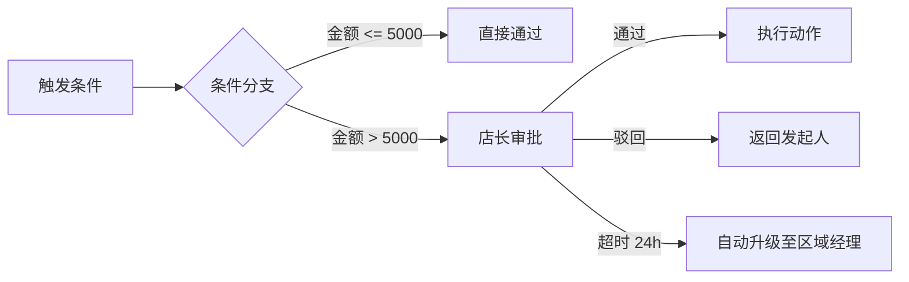

# 系统基础模块需求 (System Foundation)

## 1. 模块概述 (Module Overview)

| 属性 | 说明 |
|:---|:---|
| **模块名称** | 系统基础 (System Foundation) |
| **核心价值** | 提供认证、权限、工作台、审批流等基础能力 |
| **目标用户** | 所有用户、管理员 |
| **上游模块** | 无 (基础设施) |
| **下游模块** | 所有业务模块 |

## 2. 用户与权限管理 (RBAC)
为了满足精细化分工，系统需提供可视化的权限管理能力。

### 1.1 核心功能
*   **多因子登录 (Authentication)**:
    *   **技术之选**: 使用 **Auth.js (NextAuth v5)** 作为统一认证层。
    *   **渠道支持**:
        *   **飞书/微信扫码**: 利用 Auth.js 成熟的 OAuth Providers。
        *   **手机验证码**: 通过短信网关 (阿里云/腾讯云) + Auth.js Credentials Provider。
        *   **手机密码**: 标准账密登录。
*   **角色管理 (Role Management)**:
    *   **预置角色**: 销售 (Sales), 测量师 (Measurer), 采购员 (Purchaser), 派单员 (Dispatcher), 财务 (Finance), 店长/管理员 (Admin)。
    *   **自定义能力**: 管理员可创建新角色，并勾选“页面级”和“按钮级”权限。

### 1.2 界面与风格 (UI & Theming)
*   **多皮肤支持**:
    *   支持用户切换不同风格 (e.g. 默认商务蓝, 活力橙, 暗夜黑)。
    *   技术: `next-themes` + Tailwind CSS 变量。
*   **组件库**:
    *   采用 **Aceternity UI** (基于 Tailwind + Framer Motion) 构建高颜值、动态化的界面。
    *   核心组件: 玻璃拟态卡片, 动态梯度按钮, 流光边框等。
*   **可视化配置 (Visual UI)**:
    *   提供树状图展示菜单权限。
    *   提供复选框控制操作权限 (e.g. `order.approve`, `price.edit`).
*   **数据权限 (Row Level Security)**:
    *   **本人可见**: 销售只能看自己的线索/订单。
    *   **全店可见**: 店长/派单员可查看所有数据。

## 2. 工作台 (Workbench)
每个用户登录后的默认首页，聚合所有“待办事项”，实现“人找事”变为“事找人”。

### 2.1 待办聚合 (My Todos)
系统根据当前登录用户的 `Role` 和 `User ID`，自动拉取以下待办：

| 角色 | 待办内容 | 来源表/状态 |
| :--- | :--- | :--- |
| **销售** | 待跟进线索, 待确认测量, 待发货订单, 待验收安装 | `leads(FOLLOWING)`, `measure_tasks(PENDING_CONFIRM)`... |
| **测量师** | 待上门任务 | `measure_tasks(PENDING_VISIT)` |
| **采购员** | 待下单 PO, 待填单号 PO | `purchase_orders(DRAFT/IN_PRODUCTION)` |
| **派单员** | 待分配测量, 待分配安装 | `*_tasks(PENDING_DISPATCH)` |
| **财务** | 待付款 AP, 待收款 AR | `statements(PENDING)` |

### 2.2 消息通知 (Notifications)
*   **类型**: 系统通知, 预警通知, @提及。
*   **交互**: 点击消息直接跳转至具体单据详情页。

## 3. 时效管理 (SLA & Alerts)
为关键业务环节设定标准时长 (SLA)，超时自动预警。

### 3.1 预警规则 (Rules)
| 环节 | 标准时长 | 触发起点 | 预警对象 |
| :--- | :--- | :--- | :--- |
| **线索跟进** | 24小时 | 线索分配时间 | 归属销售 (提醒) -> 店长 (警告) |
| **测量上门** | 48小时 | 客户预约时间 | 测量师 (提醒) -> 派单员 (警告) |
| **采购发货** | 7天 | 订单进入生产中 | 采购员 (提醒) -> 供应链主管 (警告) |

### 3.2 预警机制
1.  **即将超时**: 截止前 2小时，发送“黄色预警”给执行人。
2.  **已超时**: 超时后，发送“红色预警”给执行人 + **上级管理者** (Escalation)。
3.  **UI 表现**: 在列表页和工作台通过 🔴 (超时) 🟡 (临期) 标签高亮显示。

## 4. 审批流引擎 (Approval Workflow Engine)
为关键业务节点提供**可视化配置**的审批流能力，确保敏感操作有据可查、按规执行。

### 4.1 核心理念
*   **规则驱动**: 审批流由"触发条件 + 审批人 + 超时策略"构成，管理员可自由配置。
*   **可视化编排**: 提供拖拽式流程设计器，直观展示审批节点与流转路径。
*   **灵活扩展**: 支持串行审批、并行会签、条件分支等多种模式。

### 4.2 可视化设计器 (Visual Designer)


*   **画布区域**: 管理员通过拖拽"节点"（审批人、条件判断、动作）搭建流程。
*   **属性面板**: 点击节点后，右侧弹出配置项（审批人角色/具体人员、超时时长、通知方式）。
*   **预览与测试**: 支持"模拟提交"，验证流程是否按预期流转。

### 4.3 预置审批场景

| 场景 | 触发条件 | 审批人 | 超时策略 |
|:---|:---|:---|:---|
| **报价折扣审批** | 折扣率 > 10% | 店长 | 24h 自动升级至区域经理 |
| **订单撤销审批** | 订单状态 = 生产中 | 店长 + 采购主管 (并行) | 48h 自动拒绝 |
| **特殊工费核准** | 工费 > 标准单价 150% | 派单主管 | 12h 超时提醒 |
| **坏账核销审批** | 账龄 > 180天 | 财务 → 店长 → 老板 (串行) | 每级 24h |

### 4.4 数据结构 (Schema Implication)

```typescript
// 审批流模板
interface ApprovalTemplate {
  id: string;
  name: string;               // 如: "报价折扣审批"
  trigger_module: string;     // 触发模块 (quote, order, install...)
  trigger_condition: JSON;    // 触发条件表达式
  nodes: ApprovalNode[];      // 审批节点数组
  is_active: boolean;
}

// 审批节点
interface ApprovalNode {
  id: string;
  type: 'approver' | 'condition' | 'action';
  approver_type: 'role' | 'user' | 'dynamic';
  approver_id: string;        // 角色ID 或 用户ID
  timeout_hours: number;
  timeout_action: 'escalate' | 'auto_approve' | 'auto_reject';
  next_node_id: string;
}

// 审批实例记录
interface ApprovalInstance {
  id: string;
  template_id: string;
  source_module: string;      // 来源模块
  source_id: string;          // 来源单据ID
  status: 'pending' | 'approved' | 'rejected' | 'escalated';
  current_node_id: string;
  submitted_by: string;
  submitted_at: DateTime;
  logs: ApprovalLog[];        // 操作日志
}
```

### 4.5 交互规范
*   **发起审批**: 触发条件满足时，系统自动创建审批实例，并通知第一个审批人。
*   **审批操作**: 审批人在工作台或对应单据详情页看到待审批项，可"通过/驳回/转交"。
*   **进度追踪**: 发起人可随时查看审批流转进度，每个节点的处理人和处理时间。
*   **驳回处理**: 驳回后，发起人可修改后重新提交，或取消审批。

## 5. 通用组件 (Common Components)

### 5.1 全局筛选器 (Global Filter)
位于每个模块列表页顶部的通用筛选组件。系统需根据当前模块上下文自动渲染不同筛选条件。

*   **交互**:
    *   **通用项**: 时间范围 (Time Range), 创建人 (Creator), 状态 (Status)。
    *   **特定项**:
        *   Lead: 渠道来源 (Source), 意向等级 (Grade)。
        *   Order: 供应商 (Supplier), 关联销售 (Sales)。
*   **持久化**: 记住用户上一次的筛选偏好 (Local Storage)。

### 5.2 全局搜索 (Global Search)
位于顶部导航栏的全局搜索入口。

*   **范围**: 支持跨模块搜索。
    *   搜人名/手机号 -> 匹配 `leads`, `orders`, `measure_tasks`。
    *   搜单号 -> 匹配 `order_no`, `measure_no`, `quote_no`。
*   **展示**:
    *   聚合结果页，按模块分组展示 (e.g. "找到 3 个线索", "找到 1 个订单")。
    *   支持键盘快捷键 (`Cmd+K` / `Ctrl+K`) 唤起。

## 6. 界面设计 (UI Design)

### 6.1 用户管理页

#### 展示字段
| 字段 | 宽度 | 说明 |
|:---|:---|:---|
| 用户名 | 120px | - |
| 手机号 | 130px | - |
| 角色 | 100px | 标签 |
| 状态 | 60px | 启用/停用 |
| 最后登录 | 130px | - |
| 操作 | 150px | 编辑/停用 |

#### 操作按钮
| 按钮 | 说明 |
|:---|:---|
| **新建用户** | 顶部主按钮 |
| **编辑** | 修改用户信息和角色 |
| **重置密码** | 发送重置链接 |
| **停用/启用** | 切换用户状态 |

### 6.2 角色管理页

#### 展示字段
| 字段 | 说明 |
|:---|:---|
| 角色名称 | - |
| 角色描述 | - |
| 用户数 | 关联的用户数量 |
| 权限数 | 已授权的权限数量 |
| 操作 | 编辑/删除 |

#### 权限配置
使用 `Tree` 组件展示菜单权限：
*   一级节点：模块 (线索/订单/报价等)
*   二级节点：页面 (列表/详情)
*   三级节点：按钮 (编辑/删除/审批)

### 6.3 工作台页面

#### 页面布局
```
┌─────────────────────────────────────────────────────┐
│ 工作台                          [全局搜索] [通知铃] │
├──────────────────────┬──────────────────────────────┤
│ 待办事项卡片         │ 快捷入口                     │
│ (按紧急程度排序)     │ 新建线索/新建报价/...        │
├──────────────────────┼──────────────────────────────┤
│ 今日统计             │ 消息通知列表                 │
│ 新线索/成交额/...    │ (最近 10 条)                 │
└──────────────────────┴──────────────────────────────┘
```

#### 待办事项卡片
使用 `Card` + `Badge` 组件：
*   显示待办类型、数量、最早截止时间
*   🔴 超时 🟡 临期 标签高亮
*   点击跳转对应列表页

### 6.4 审批流配置页 (管理员)

#### 模板列表
| 字段 | 说明 |
|:---|:---|
| 流程名称 | - |
| 触发模块 | 报价单/订单等 |
| 触发条件 | 条件描述 |
| 状态 | 启用/停用 |
| 操作 | 编辑/停用 |

#### 流程设计器
*   **画布区**: 拖拽节点、连线
*   **节点库**: 审批人/条件判断/动作
*   **属性面板**: 配置节点参数
*   **预览**: 模拟流程流转

## 7. 权限控制 (Permission Matrix)

### 7.1 页面级权限

| 页面 | 普通用户 | 管理员 | 超级管理员 |
|:---|:---|:---|:---|
| 工作台 | ✓ | ✓ | ✓ |
| 用户管理 | ✗ | ✓ | ✓ |
| 角色管理 | ✗ | ✓ | ✓ |
| 审批流配置 | ✗ | ✓ | ✓ |
| 系统设置 | ✗ | ✗ | ✓ |

### 7.2 操作级权限

| 操作 | 管理员 | 超级管理员 |
|:---|:---|:---|
| 创建用户 | ✓ | ✓ |
| 修改用户 | ✓ | ✓ |
| 删除用户 | ✗ | ✓ |
| 创建角色 | ✓ | ✓ |
| 删除角色 | ✗ | ✓ |
| 配置审批流 | ✓ | ✓ |
| 修改系统设置 | ✗ | ✓ |

## 8. 通知与提醒 (Notifications)

| 触发事件 | 通知对象 | 渠道 | 内容 |
|:---|:---|:---|:---|
| 待办超时 | 执行人+上级 | 系统+飞书 | XXX 任务已超时 |
| 审批待处理 | 审批人 | 系统+飞书 | 有审批待处理 |
| 审批通过/驳回 | 发起人 | 系统 | 审批结果通知 |
| 新消息 @ | 被@用户 | 系统 | 有人 @ 了你 |
| 每日待办汇总 | 所有用户 | 飞书 | 今日待办清单 |

## 9. 与其他模块的关联 (Module Relations)

| 模块 | 关联方式 | 数据流向 |
|:---|:---|:---|
| **全部业务模块** | 权限控制 | 系统基础 → 业务模块 |
| **全部业务模块** | 审批流触发 | 业务模块 → 审批流 |
| **全部业务模块** | SLA 监控 | 业务模块 → 预警 |
