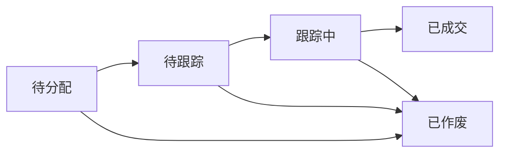

# 线索模块需求 (Lead)

## 协作上下文

- **下游依赖**：成交后触发 Customer 创建和 Order 初始化。
- **外部引用**：必须从 Channel 模块获取有效渠道 ID 并进行校验。

## 1. 模块概述 (Module Overview)

| 属性         | 说明                                                                                            |
| :----------- | :---------------------------------------------------------------------------------------------- |
| **模块名称** | 线索 (Lead)                                                                                     |
| **核心价值** | L2C 流程的起点，管理潜在客户的全生命周期                                                        |
| **目标用户** | 销售人员、店长、客服                                                                            |
| **上游模块** | 渠道投放、客服录入                                                                              |
| **核心定义** | **线索 = 销售机会 (Opportunity)**。无论是新客户还是老客户，每一次新的购买意向都应视为一条线索。 |
| **下游模块** | 测量单、报价单、客户档案                                                                        |

## 2. 业务场景 (Business Scenario)

### 2.1 典型场景

1. **线上获客**: 要填写二级渠道，抖音/小红书/美团等
2. **到店接待**: 客户自然进店，销售现场录入，不需要填写二级内容
3. **异业合作**: 装修公司/设计师推荐客户，要填写推荐人，为了方便统计，不可以已直接填写，而是采用下拉菜单点选的方式
4. **老客转介绍**: 老客户推荐新客户，填写时要备注老客户是谁，或者之前的销售是谁，方便做绩效统计。
5. **小区团购**: 在填写时要备注具体小区，为了方便统计，不可以已直接填写，而是采用下拉菜单点选的方式

### 2.2 线索来源

| 渠道大类     | 子渠道           | 具体来源     |
| :----------- | :--------------- | :----------- |
| **线上**     | 抖音/小红书/美团 | 具体账号     |
| **到店**     |
| **异业**     | 品牌名字         | 具体带单人员 |
| **小区团购** | 小区名字         | 介绍人       |
| **装企**     | 装修公司         | 设计师姓名   |
| **转介绍**   | 老客户           | 关联原客户ID |

## 3. 状态流转 (State Machine)



| 状态       | 状态码               | 说明               | 触发动作                       |
| :--------- | :------------------- | :----------------- | :----------------------------- |
| **待分配** | `PENDING_ASSIGNMENT` | 公海池，未指派销售 | 系老板导入/业务录入            |
| **待跟进** | `PENDING_FOLLOWUP`   | 已指派，待首次接触 | 店长/老板"指派"                |
| **跟进中** | `FOLLOWING_UP`       | 销售正在跟进       | 销售"开始跟进"                 |
| **已成交** | `WON`                | 已生成订单         | 报价单成功转为订单（严谨模式） |
| **已作废** | `VOID`               | 无效线索           | 标记作废 (填原因)              |

### 3.1 公海机制

#### 自动回收规则 (租户可配置)

| 规则           | 条件                    | 动作       |
| :------------- | :---------------------- | :--------- |
| **超时未联系** | 分配后 X 小时无跟进记录 | 回收至公海 |
| **超时未成交** | 跟进 Y 天未转报价       | 回收至公海 |
| **主动释放**   | 销售点击"释放"          | 回收至公海 |

**配置说明**：租户可在系统设置中自定义 X 和 Y 的值（默认为 24 小时和 30 天），支持根据渠道、销售级别等维度设置不同的回收规则。

#### 认领规则

- 公海线索对所有销售可见
- 点击"认领"后立即私有化
- 可设置每人每日认领上限

### 3.2 自动分配规则 (租户可配置)

#### Phase 1 范围（首期实现）

| 模式     | 说明                            |
| :------- | :------------------------------ |
| **轮转** | 按销售顺序依次分配              |
| **手动** | 默认进公海，由店长/客服手动分配 |

**Phase 1 配置说明**：租户可在系统设置模块中选择适合的分配策略，支持不同渠道使用不同策略。

#### Phase 2 范围（后续迭代）

| 模式         | 说明                               |
| :----------- | :--------------------------------- |
| **负载均衡** | 优先分配给当前线索数最少的销售     |
| **渠道指定** | 特定渠道的线索自动分配给指定销售   |
| **优秀奖励** | 转化率高或转化金额高的销售优先分配 |

**Phase 2 配置说明**：高级分配策略将在后续版本中实现，提供更智能的线索分配能力。

## 4. 核心字段定义 (Field Definitions)

### 4.1 线索主表 (leads)

| 字段名                       | 类型     | 必填 | 说明                                         |
| :--------------------------- | :------- | :--- | :------------------------------------------- |
| id                           | UUID     | ✓    | 主键                                         |
| lead_no                      | String   | ✓    | 线索编号 (LD20260101001)                     |
| source_category              | UUID     | ✓    | 渠道大类ID                                   |
| source_sub                   | UUID     | -    | 子渠道ID                                     |
| source_detail                | String   | -    | 具体来源描述                                 |
| referrer_name                | String   | -    | 带单人姓名（异业/团购/装企等）               |
| customer_name                | String   | ✓    | 客户姓名                                     |
| customer_phone               | String   | ✓    | 客户电话 (唯一索引)                          |
| customer_wechat              | String   | -    | 微信号                                       |
| community                    | String   | -    | 楼盘/小区                                    |
| address                      | String   | -    | 详细地址                                     |
| house_type                   | String   | -    | 户型 (几室几厅)                              |
| intention_level              | Enum     | -    | 意向等级 (HIGH/MEDIUM/LOW)                   |
| estimated_amount             | Decimal  | -    | 预估金额                                     |
| status                       | Enum     | ✓    | 状态                                         |
| assigned_sales_id            | UUID     | -    | 归属销售                                     |
| assigned_at                  | DateTime | -    | 分配时间                                     |
| tags                         | String[] | -    | 标签数组                                     |
| remark                       | Text     | -    | 备注                                         |
| referrer_customer_id         | UUID     | -    | 转介绍人客户ID                               |
| quoted_at                    | DateTime | -    | 首次报价时间                                 |
| visited_store_at             | DateTime | -    | 到店时间                                     |
| won_at                       | DateTime | -    | 成交时间                                     |
| decoration_progress          | Enum     | -    | 装修进度 (水电/泥木/安装) - 用于计算跟进间隔 |
| next_followup_at             | DateTime | -    | 销售手动设置的下次跟进时间                   |
| next_followup_recommendation | DateTime | -    | 系统根据装修进度推荐的跟进时间               |
| url_params                   | JSONB    | -    | URL 参数全量捕获 (用于 Webhook 渠道溯源)     |
| distribution_rule_id         | UUID     | -    | 关联分配策略ID                               |
| customer_id                  | UUID     | -    | 成交后关联的客户ID                           |
| created_by                   | UUID     | ✓    | 创建人                                       |
| created_at                   | DateTime | ✓    | 创建时间                                     |
| last_activity_at             | DateTime | ✓    | 最后活动时间                                 |
| updated_at                   | DateTime | ✓    | 更新时间 (自动维护)                          |

### 4.2 跟进记录表 (lead_activities)

| 字段名             | 类型 | 必填 | 说明                            |
| :----------------- | :--- | :--- | :------------------------------ |
| id                 | UUID | ✓    | 主键                            |
| lead_id            | UUID | ✓    | 关联线索                        |
| activity_type      | Enum | ✓    | 类型 (见下)                     |
| content            | Text | ✓    | 跟进内容                        |
| purchase_intention | Enum | -    | 购买意向 (HIGH/MEDIUM/LOW)      |
| customer_level     | Enum | -    | 客户级别 (A/B/C)                |
| quote_id           | UUID | -    | 关联报价单ID                    |
| linked_customer_id | UUID | -    | 关联的老客户ID (若为老客新线索) |
| next_follow_date   | Date | -    | 下次跟进日期                    |

| created_by | UUID | ✓ | 记录人 |
| created_at | DateTime | ✓ | 记录时间 |

#### 活动类型枚举

| 类型          | 说明     |
| :------------ | :------- |
| `PHONE_CALL`  | 电话沟通 |
| `WECHAT_CHAT` | 微信沟通 |
| `STORE_VISIT` | 客户到店 |
| `HOME_VISIT`  | 上门拜访 |
| `QUOTE_SENT`  | 发送报价 |
| `SYSTEM`      | 系统自动 |

### 4.3 状态变更历史表 (lead_status_history)

**目的**: 记录线索每次状态流转的详细信息，支持审计追溯。

| 字段名     | 类型     | 必填 | 说明     |
| :--------- | :------- | :--- | :------- |
| id         | UUID     | ✓    | 主键     |
| tenant_id  | UUID     | ✓    | 租户ID   |
| lead_id    | UUID     | ✓    | 关联线索 |
| old_status | String   | -    | 原状态   |
| new_status | String   | ✓    | 新状态   |
| changed_by | UUID     | -    | 操作人   |
| changed_at | DateTime | ✓    | 变更时间 |
| reason     | Text     | -    | 变更原因 |

### 4.4 渠道配置表 (channel_sources)

| 字段名                | 类型    | 必填 | 说明                                       |
| :-------------------- | :------ | :--- | :----------------------------------------- |
| id                    | UUID    | ✓    | 主键                                       |
| parent_id             | UUID    | -    | 父渠道ID（支持三级结构）                   |
| name                  | String  | ✓    | 渠道名称                                   |
| level                 | Integer | ✓    | 层级（1/2/3）                              |
| is_active             | Boolean | ✓    | 是否启用                                   |
| auto_assign_sales_id  | UUID    | -    | 自动分配给指定销售                         |
| distribution_rule_id  | UUID    | -    | 关联分配策略ID (预设策略)                  |
| allow_duplicate_leads | Boolean | -    | 是否允许重复线索 (覆盖全局设置)            |
| url_params_config     | JSONB   | -    | 需要捕获的 URL 参数白名单 (为空则全量捕获) |
| sort_order            | Integer | ✓    | 排序                                       |

**层级管理说明**：

- 系统提供三级渠道结构能力（大类 → 子渠道 → 具体来源）
- 租户可根据自己的管理颗粒度自由选择使用几级（1-3级）
- 不同渠道类型可以使用不同的层级深度（例如：线上渠道两级，装企渠道三级）

## 5. 界面设计 (UI Design)

### 5.1 列表页 (Lead List)

#### 展示字段

| 字段     | 宽度  | 说明                   |
| :------- | :---- | :--------------------- |
| 线索编号 | 130px | 可点击跳转             |
| 客户名称 | 100px | -                      |
| 电话     | 120px | 可点击拨打/复制        |
| 渠道     | 100px | 渠道大类               |
| 意向     | 60px  | 高/中/低标签           |
| 状态     | 80px  | 状态标签               |
| 标签     | 200px | 已报价/已邀约/已到店等 |
| 归属销售 | 80px  | -                      |
| 最后活动 | 130px | 距今时间               |
| 操作     | 150px | 按钮组                 |

#### Tab 分组

使用 `Tabs` 组件：
| Tab | 筛选条件 | 说明 |
|:---|:---|:---|
| 全部 | - | 默认 |
| 公海 | status=PENDING_DISPATCH | 待认领 |
| 我的跟进 | assigned_sales_id=当前用户 | 本人线索 |
| 已成交 | status=WON | 成交线索 |
| 已作废 | status=VOID | 无效线索 |

#### 筛选条件（高级筛选）

| 筛选项         | 组件               | 说明                  |
| :------------- | :----------------- | :-------------------- |
| 时间范围       | `DateRangePicker`  | 创建时间              |
| 状态           | `Select` (多选)    | 全部状态              |
| 意向等级       | `Select`           | 高/中/低              |
| 渠道           | `Cascader`         | 三级级联              |
| 归属销售       | `Select`           | 店长可见全部          |
| 客户/电话/楼盘 | `Input.Search`     | 模糊搜索              |
| 标签           | `Select` (多选)    | 系统标签 + 自定义标签 |
| 跟进记录       | `DateRangePicker`  | 最后跟进时间范围      |
| 报价金额       | `InputNumber` 区间 | 预估金额范围          |
| 跟进次数       | `InputNumber` 区间 | 跟进次数范围          |

**筛选说明**：

- 支持多条件组合筛选
- 筛选条件同步至 URL Query Parameters
- 支持保存常用筛选方案

#### 操作按钮

| 按钮         | 条件       | 说明   |
| :----------- | :--------- | :----- |
| **新建线索** | 顶部       | 主按钮 |
| **认领**     | 公海线索   | 行操作 |
| **分配**     | 店长角色   | 行操作 |
| **开始跟进** | 待跟踪状态 | 行操作 |
| **生成报价** | 跟踪中状态 | 行操作 |
| **释放**     | 本人线索   | 行操作 |
| **作废**     | 非成交状态 | 行操作 |

### 5.2 详情页 (Lead Detail)

#### 页面布局

```
┌─────────────────────────────────────────────────────┐
│ 线索详情 #LD20260101001       [生成报价] [预约测量] │
├──────────────────────┬──────────────────────────────┤
│ 客户信息卡片         │ 状态流转进度条               │
│ 姓名/电话/楼盘       │ [待分配→跟踪→成交]          │
├──────────────────────┼──────────────────────────────┤
│ 跟进记录时间线       │ 关联单据卡片                 │
│ (可添加新记录)       │ 测量单/报价单/订单           │
├──────────────────────┴──────────────────────────────┤
│ 操作日志                                            │
└─────────────────────────────────────────────────────┘
```

#### 客户信息卡片

| 字段     | 组件               | 说明     |
| :------- | :----------------- | :------- |
| 姓名     | `Input`            | 可编辑   |
| 电话     | `Input` + 拨打图标 | 可编辑   |
| 微信     | `Input`            | 可编辑   |
| 楼盘     | `Input`            | 支持联想 |
| 户型     | `Input`            | -        |
| 地址     | `TextArea`         | -        |
| 意向等级 | `Radio`            | 高/中/低 |
| 预估金额 | `InputNumber`      | 可选     |
| 渠道来源 | `Cascader`         | 三级级联 |
| 备注     | `TextArea`         | -        |

#### 跟进记录区

使用 `Timeline` 组件 + 顶部输入区：

**新增跟进表单**
| 字段 | 组件 | 说明 |
|:---|:---|:---|
| 跟进类型 | `Select` | 电话/微信/到店等 |
| 跟进内容 | `TextArea` | 必填 |
| 下次跟进 | `DatePicker` | 可选 |

#### 关联单据

| 单据类型 | 展示        | 操作      |
| :------- | :---------- | :-------- |
| 测量单   | 列表 + 状态 | 新建/查看 |
| 报价单   | 列表 + 金额 | 新建/查看 |

**说明**：

- 线索成交后自动转化为客户档案，订单信息在客户模块中查看
- 线索详情页只展示测量单和报价单
- 客户档案继承线索信息，并可进行修改

### 5.3 新建/编辑弹窗

使用 `Drawer` 组件：

| 字段     | 组件           | 必填 | 说明         |
| :------- | :------------- | :--- | :----------- |
| 客户姓名 | `Input`        | ✓    | -            |
| 客户电话 | `Input`        | ✓    | 自动查重     |
| 渠道来源 | `Cascader`     | ✓    | 三级级联     |
| 楼盘     | `AutoComplete` | -    | 联想已有楼盘 |
| 户型     | `Input`        | -    | -            |
| 意向等级 | `Radio`        | -    | 默认无       |
| 备注     | `TextArea`     | -    |

## 5.4 移动端支持

**功能范围**：

- 移动端提供与 PC 端相同的功能，包括：
  - 线索列表查看和筛选
  - 线索详情查看
  - 新建和编辑线索
  - 添加跟进记录
  - 线索分配和认领
  - 线索状态变更
  - 查看关联单据

**界面适配**：

- 采用响应式设计，适配不同屏幕尺寸
- 优化触摸操作体验
- 关键操作（如拨打电话、发送微信）提供快捷入口

**数据同步**：

- 移动端与 PC 端数据实时同步
- 支持离线缓存，网络恢复后自动同步

## 6. 业务规则 (Business Rules)

### 6.1 查重规则 (租户可配置)

**识别键优先级**：

1. **第一识别键**：`customer_phone`（手机号）- 最高权重
2. **第二识别键**：`community + address`（楼盘 + 详细地址）- 当手机号为空或不存在时使用

**活跃线索定义**：

- **活跃状态集合**：`PENDING_DISPATCH`（待分配）、`PENDING_FOLLOWUP`（待跟踪）、`FOLLOWING`（跟踪中）
- **非活跃状态**：`WON`（已成交）、`VOID`（已作废）
- **判定规则**：状态不等于 `WON` 且不等于 `VOID` 的线索均视为活跃线索

**处理策略**：

- **默认策略（机会主义）**：
  - **允许重复 (新机会)**：若客户已存在，但上一次线索已关闭（成交/作废），则允许创建新线索。
  - **自动关联**：新线索将自动关联到已有 `customer_id` (若有)。标记为 "老客新线索"。
  - **活跃校验**：若该客户名下仍有**活跃状态**（`PENDING_DISPATCH`、`PENDING_FOLLOWUP`、`FOLLOWING`）的线索，则拦截创建。
- **租户可选策略**：
  - **严格去重**：同一手机号只允许一条线索（适合低频交易行业）。

**API 返回规则**：

- **默认行为**：若同一手机号存在活跃线索，API 返回 `409 Conflict`，提示 "该客户已有进行中的线索"
- **强制创建**：若请求参数中包含 `force_create=true`，则忽略活跃线索检查，强制创建新线索
- **错误响应示例**：

```json
{
  "code": 409,
  "message": "Conflict: 该客户已有进行中的线索",
  "data": {
    "existing_lead_id": "uuid-xxx-xxx",
    "existing_lead_no": "LD20260101000",
    "existing_status": "FOLLOWING",
    "existing_assigned_sales": "张三"
  }
}
```

**配置说明**：租户可在系统设置中选择重复线索的处理策略，并设置是否启用第二识别键（项目地址）作为查重依据。

### 6.2 状态流转规则

- 只能按顺序流转，不可跳跃
- "已成交"和"已作废"为终态

### 6.3 自动标签规则 (系统标签)

**系统标签（自动生成，不可手动修改）**：
| 标签 | 触发条件 | 考核维度 |
|:---|:---|:---|
| 已邀约 | 在日历上填写邀约记录 | 销售工作饱和度 |
| 已报价 | 关联报价单创建成功 | 转化漏斗 |
| 已到店 | 点击"确认到店"按钮 | 客户到店率 |
| 已测量 | 关联测量单完成 | 服务跟进 |

**自定义标签（手动添加）**：

- 销售可以根据实际情况添加个性化标签（例如："高意向"、"VIP"、"装修中"等）
- 自定义标签不作为系统考核维度，仅用于销售个人管理
- 租户可以在系统设置中预定义常用自定义标签库，销售可从中选择

**标签分类展示**：

- 系统标签和自定义标签在界面上区分展示
- 系统标签显示为不可编辑状态，自定义标签可增删改

### 6.4 公海规则

- 未分配线索自动进入公海
- 超时未跟进自动回收公海
- 释放时可填写原因

### 6.5 作废与恢复机制

- **作废规则**：

* 销售可以作废自己名下的线索，必须填写作废原因
* 店长可以作废任何线索，必须填写作废原因
* 所有作废操作必须记录审计日志

- **恢复规则**：

* 作废后的线索可以恢复到作废前的状态
* 恢复操作需要审批流程（店长审批）
* 所有恢复操作必须记录审计日志，包括审批人、审批时间、审批意见

- **统计分析**：

* 系统自动统计作废原因分布，为优化线索质量提供数据支持
* 系统自动统计恢复率，评估作废决策的准确性

### 6.6 自动客户关联规则

**触发时机**: 创建线索时

**逻辑说明**:

- 创建线索时，系统自动通过手机号查找已有客户档案
- 若找到匹配客户，自动关联 `leads.customer_id = customers.id`
- 标记为"老客新线索"，便于销售识别
- 若未找到匹配客户，`customer_id` 保持为空

**业务价值**: 简化老客户复购流程，销售可直接查看客户历史交易记录。

### 6.7 渠道统计联动规则

**触发时机**: 创建线索、线索成交

**创建线索时**:

- 自动更新渠道表 `channels.total_leads += 1`

**线索成交时**:

- 自动更新渠道表 `channels.total_deal_amount += leads.estimated_amount`

**业务价值**: 实时跟踪渠道效果，无需手动统计。

### 6.8 转化与归集规则 (Conversion & Linking)

- **触发点**：发起测量 (Create Measurement)
- **新客户**：
  - 自动创建新客户档案。
  - 关联 `customers.source_lead_id` = 当前线索ID。
  - 线索状态 -> **已成交 (WON)** (或自定义状态 '已转化')。
- **老客户 (老客新线索)**：
  - 不创建新客户。
  - 线索关联至已有客户 (`leads.linked_customer_id` 或 `customers.leads` 关系)。
  - 线索状态 -> **已成交 (WON)**。
  - 触发更新客户的 `pipeline_status` 为 **待测量**。

### 6.7 批量操作规则

- **仅支持批量分配**：只允许对多条线索进行批量分配操作
- 其他操作（如批量释放、批量修改状态、批量添加标签等）必须逐个进行
- 批量分配操作需要店长权限
- 所有批量操作必须记录审计日志

## 7. 权限控制 (Permission Matrix)

### 7.1 页面级权限

| 页面     | 销售          | 客服 | 派单员 | 店长 |
| :------- | :------------ | :--- | :----- | :--- |
| 线索列表 | ✓             | ✓    | ✗      | ✓    |
| 线索详情 | ✓ (本人+公海) | ✓    | ✗      | ✓    |
| 新建线索 | ✓             | ✓    | ✗      | ✓    |
| 渠道配置 | ✗             | ✗    | ✗      | ✓    |

### 7.2 按钮级权限

| 操作           | 销售     | 客服 | 店长       |
| :------------- | :------- | :--- | :--------- |
| 新建           | ✓        | ✓    | ✓          |
| 认领           | ✓        | ✗    | ✓          |
| 分配           | ✗        | ✗    | ✓          |
| 编辑           | ✓ (本人) | ✓    | ✓          |
| 释放           | ✓ (本人) | ✗    | ✓          |
| 作废           | ✓ (本人) | ✗    | ✓          |
| 强制创建(重复) | ✗        | ✗    | ✓          |
| 导出           | ✗        | ✗    | ✓ (需脱敏) |

**导出权限说明**：

- 默认禁止导出线索数据
- 仅管理员可以导出，导出时必须对敏感字段（如电话、地址）进行脱敏处理
- 所有导出操作必须记录审计日志

### 7.3 数据范围权限

| 角色 | 可见范围          |
| :--- | :---------------- |
| 销售 | 公海 + 自己的线索 |
| 客服 | 全部线索 (仅查看) |
| 店长 | 本店全部线索      |

## 8. 通知与提醒 (Notifications)

### 8.1 跟进提醒机制

**自动推荐提醒（基于施工进度）**：
| 施工进度 | 默认跟进间隔 | 说明 |
|:---|:---|:---|
| 水电阶段 | 30 天 | 装修前期，跟进周期较长 |
| 泥木阶段 | 20 天 | 装修中期，跟进周期适中 |
| 安装阶段 | 7 天 | 装修后期，跟进周期较短 |

**手动覆盖机制**：

- 销售在跟进时可以手动填写下次跟进时间
- 销售手动设置的跟进时间优先级高于系统推荐时间
- 系统相信销售的专业判断，允许灵活调整

**配置说明**：

- 租户可在系统设置中调整不同施工进度的默认跟进间隔
- 支持根据渠道、线索等级等维度设置不同的跟进规则

**数据分析**：

- 系统自动统计不同销售的平均跟进频次和时间间隔
- 为绩效考核和销售能力评估提供数据支持

### 8.3 自动流转与提醒机制

**自动流转规则**：
| 场景 | 条件 | 自动动作 | 提醒通知 |
|:---|:---|:---|:---|
| 超时未联系 | 分配后 X 小时无跟进记录 | 回收至公海 | 销售收到超时预警 |
| 超时未成交 | 跟进 Y 天未转报价 | 回收至公海 | 销售收到即将回收提醒 |
| 即将回收 | 距离回收还有 24 小时 | - | 销售收到即将回收提醒 |

**提醒通知规则**：
| 触发事件 | 通知对象 | 渠道 | 内容 |
|:---|:---|:---|:---|
| 新线索分配 | 被分配销售 | 系统+飞书/微信小程序 | 有新线索待跟进 |
| 线索认领 | 店长 | 系统 | XXX 认领了线索 |
| 跟进提醒 | 销售 | 系统 | 今日有 N 个线索待跟进 |
| 超时预警 | 销售+店长 | 系统 | 线索 24h 未跟进 |
| 即将回收 | 销售 | 系统 | 线索即将回收公海 |
| 线索成交 | 店长 | 系统 | XXX 成交了线索 |

**配置说明**：

- 租户可在系统设置中配置自动流转的阈值（X 和 Y 的值）
- 所有自动流转和提醒操作必须记录审计日志

## 9. 与其他模块的关联 (Module Relations)

| 模块         | 关联方式                          | 数据流向    |
| :----------- | :-------------------------------- | :---------- |
| **渠道配置** | Lead.source_category → Channel.id | 渠道 → 线索 |
| **客户**     | Customer.source_lead_id → Lead.id | 线索 → 客户 |
| **测量单**   | Measure.lead_id → Lead.id         | 线索 → 测量 |
| **报价单**   | Quote.lead_id → Lead.id           | 线索 → 报价 |
| **数据报表** | 转化漏斗、渠道分析                | 线索 → 报表 |

## 10. 数据统计与报表 (Analytics)

### 10.1 实时仪表盘

**关键指标**：

- 今日新增线索数
- 本周新增线索数
- 线索转化率（跟踪中 → 已成交）
- 公海线索数
- 待跟进线索数
- 平均跟进时长

**数据更新策略**：

- 仪表盘数据定期更新，减轻服务器压力
- 租户可在系统设置中选择更新频率：每日更新 / 每 3 小时更新
- 支持手动刷新，获取最新数据

### 10.2 多维分析

**分析维度**：

- **时间维度**：按日/周/月/季度/年分析
- **渠道维度**：按渠道大类、子渠道、具体来源分析
- **销售维度**：按销售人员、销售团队分析
- **地区维度**：按楼盘、区域分析
- **状态维度**：按线索状态、意向等级分析

**交叉分析**：

- 支持多维度交叉分析（例如：某渠道在某时间段内的转化率）
- 支持对比分析（例如：不同销售的转化率对比）
- 支持趋势分析（例如：线索数量的月度趋势）

**报表类型**：

- 线索漏斗分析
- 渠道效果分析
- 销售绩效分析
- 跟进效率分析
- 作废原因分析

## 11. 数据导入 (Data Import)

### 11.1 Excel 批量导入

**适用场景**：上线初期批量导入历史线索数据、定期从外部系统导入线索。

**导入模板字段**：
| 字段名 | 必填 | 说明 | 示例 |
|:---|:---|:---|:---|
| 客户姓名 | ✓ | - | 张三 |
| 客户电话 | ✓ | 用于查重 | 13800138000 |
| 渠道大类 | ✓ | 支持模糊匹配 | 线上 |
| 子渠道 | - | 支持模糊匹配 | 抖音 |
| 具体来源 | - | - | 某某账号 |
| 楼盘 | - | - | 万科城 |
| 户型 | - | - | 3室2厅 |
| 意向等级 | - | 高/中/低 | 高 |
| 预估金额 | - | 数字 | 50000 |
| 备注 | - | - | 老客户推荐 |

### 11.2 查重策略

**导入时查重规则**：

1. **手机号查重**：导入时必须执行手机号查重
2. **重复处理选项**：若发现重复手机号，提供以下选项：
   - **覆盖**：用新数据覆盖旧线索（保留原线索ID）
   - **跳过**：跳过该行，不导入
   - **生成新线索**：强制创建新线索（需特殊权限）

**重复判定逻辑**：

- 检查数据库中是否存在相同 `customer_phone` 的线索
- 若存在，根据用户选择的重复处理策略执行相应操作
- 记录所有重复处理操作到审计日志

### 11.3 错误处理

**错误报告机制**：

- 导入失败的行生成错误报告 Excel 供下载
- 错误报告包含以下信息：
  - 原始行号
  - 错误原因（必填字段缺失、手机号格式错误、渠道不存在等）
  - 原始数据

**错误类型**：
| 错误类型 | 说明 | 处理方式 |
|:---|:---|:---|
| 必填字段缺失 | 客户姓名或电话为空 | 跳过该行，记录错误 |
| 手机号格式错误 | 不符合手机号正则 | 跳过该行，记录错误 |
| 渠道不存在 | 渠道大类或子渠道无法匹配 | 跳过该行，记录错误 |
| 数据格式错误 | 预估金额非数字 | 跳过该行，记录错误 |

**导入结果反馈**：

- 导入完成后显示统计信息：
  - 成功导入行数
  - 失败行数
  - 覆盖行数
  - 跳过行数
- 提供错误报告下载链接

### 11.4 渠道匹配

**模糊匹配规则**：

- 支持通过"渠道名称"模糊匹配 `source_category` 和 `source_sub`
- 匹配逻辑：
  - 先精确匹配渠道名称
  - 若精确匹配失败，执行模糊匹配（包含关系）
  - 若模糊匹配失败，标记为错误，需用户手动选择

**匹配优先级**：

1. 精确匹配渠道名称
2. 模糊匹配渠道名称（包含关系）
3. 失败，记录错误

**示例**：
| Excel中的渠道名称 | 系统匹配结果 |
|:---|:---|
| "线上" | 匹配到 `source_category` = "线上" |
| "抖音" | 匹配到 `source_sub` = "抖音" |
| "抖音-某某账号" | 匹配到 `source_sub` = "抖音"，`source_detail` = "某某账号" |
| "未知渠道" | 匹配失败，记录错误 |

### 11.5 导入权限

| 操作         | 销售 | 客服 | 店长 |
| :----------- | :--- | :--- | :--- |
| 下载导入模板 | ✓    | ✓    | ✓    |
| 导入线索     | ✗    | ✓    | ✓    |
| 查看导入结果 | ✗    | ✓    | ✓    |
| 下载错误报告 | ✗    | ✓    | ✓    |

**权限说明**：

- 销售人员无导入权限，只能手动创建线索
- 客服和店长可以批量导入线索
- 所有导入操作必须记录审计日志

## 12. 开放接口 (Open API)

### 12.1 Webhook 接口标准

**接口定义**：

```
POST /api/v1/leads/webhook
```

**请求头**：
| 参数 | 说明 | 示例 |
|:---|:---|:---|
| Content-Type | application/json | - |
| Access-Token | 访问令牌（签名验证） | abc123xyz |

**请求体**：

```json
{
  "external_id": "EXT20260101001",
  "customer_name": "张三",
  "customer_phone": "13800138000",
  "source_category": "线上",
  "source_sub": "抖音",
  "source_detail": "某某账号",
  "community": "万科城",
  "intention_level": "HIGH",
  "estimated_amount": 50000,
  "remark": "老客户推荐",
  "force_create": false
}
```

**字段映射规则**：
| 外部字段 | 内部字段 | 说明 |
|:---|:---|:---|
| external_id | - | 外部系统线索ID（用于幂等性校验） |
| customer_name | customer_name | 客户姓名 |
| customer_phone | customer_phone | 客户电话（查重字段） |
| source_category | source_category | 渠道大类（支持模糊匹配） |
| source_sub | source_sub | 子渠道（支持模糊匹配） |
| source_detail | source_detail | 具体来源 |
| community | community | 楼盘 |
| intention_level | intention_level | 意向等级（HIGH/MEDIUM/LOW） |
| estimated_amount | estimated_amount | 预估金额 |
| remark | remark | 备注 |
| force_create | - | 是否强制创建（忽略重复检查） |

**响应体**：

```json
{
  "code": 200,
  "message": "success",
  "data": {
    "lead_id": "uuid-xxx-xxx",
    "lead_no": "LD20260101001",
    "status": "PENDING_DISPATCH"
  }
}
```

**错误响应**：

```json
{
  "code": 409,
  "message": "Conflict: 该客户已有进行中的线索",
  "data": {
    "existing_lead_id": "uuid-xxx-xxx",
    "existing_lead_no": "LD20260101000",
    "existing_status": "FOLLOWING"
  }
}
```

### 12.2 签名验证

**Access-Token 机制**：

- 租户在系统设置中生成唯一的 Access-Token
- Webhook 请求必须在请求头中携带有效的 Access-Token
- 系统验证 Access-Token 的有效性，无效则返回 401 Unauthorized

**签名验证（可选）**：

- 支持更高级的签名验证机制（HMAC-SHA256）
- 签名算法：`signature = HMAC-SHA256(Access-Token, timestamp + body)`
- 请求头中携带：
  - `X-Timestamp`: 请求时间戳
  - `X-Signature`: 签名值
- 系统验证签名，防止请求被篡改

**签名验证示例**：

```python
import hmac
import hashlib
import json

def generate_signature(access_token, timestamp, body):
    message = f"{timestamp}{json.dumps(body)}"
    signature = hmac.new(
        access_token.encode('utf-8'),
        message.encode('utf-8'),
        hashlib.sha256
    ).hexdigest()
    return signature
```

### 12.3 幂等性保证

**幂等性机制**：

- 使用 `external_id` 字段保证幂等性
- 若相同 `external_id` 的请求重复发送，系统返回已创建的线索信息
- 幂等性校验逻辑：
  1. 检查数据库中是否存在相同 `external_id` 的线索
  2. 若存在，返回已创建的线索信息（不创建新线索）
  3. 若不存在，创建新线索

**幂等性响应示例**：

```json
{
  "code": 200,
  "message": "success (idempotent)",
  "data": {
    "lead_id": "uuid-xxx-xxx",
    "lead_no": "LD20260101001",
    "status": "PENDING_DISPATCH",
    "is_new": false
  }
}
```

### 12.4 外部字段映射

**抖音广告字段映射**：
| 抖音字段 | 内部字段 | 说明 |
|:---|:---|:---|
| douyin_id | external_id | 抖音线索ID |
| phone | customer_phone | 电话 |
| name | customer_name | 姓名 |
| ad_source | source_category | 广告来源 |
| campaign_name | source_detail | 广告计划名称 |

**美团字段映射**：
| 美团字段 | 内部字段 | 说明 |
|:---|:---|:---|
| order_id | external_id | 美团订单ID |
| phone | customer_phone | 电话 |
| name | customer_name | 姓名 |
| shop_name | source_detail | 店铺名称 |

**小红书字段映射**：
| 小红书字段 | 内部字段 | 说明 |
|:---|:---|:---|
| note_id | external_id | 笔记ID |
| phone | customer_phone | 电话 |
| name | customer_name | 姓名 |
| author_name | source_detail | 作者名称 |

### 12.5 接口限流

**限流策略**：

- 每个 Access-Token 每分钟最多调用 100 次
- 超过限流阈值返回 429 Too Many Requests
- 限流响应示例：

```json
{
  "code": 429,
  "message": "Too Many Requests",
  "data": {
    "limit": 100,
    "remaining": 0,
    "reset_at": "2026-01-15T10:00:00Z"
  }
}
```

**限流配置**：

- 租户可在系统设置中调整限流阈值
- 支持为不同 Access-Token 设置不同的限流策略
