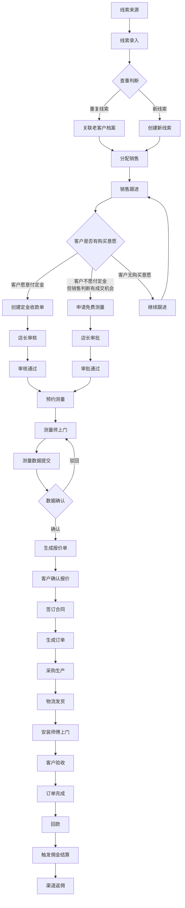
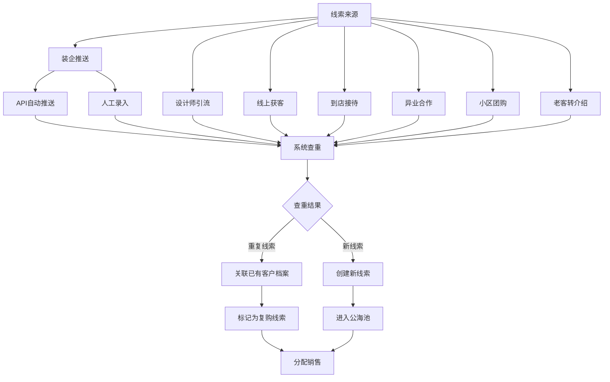

# 线索管理跨模块业务流程详解

## 1. 流程概述

本文档详细描述了线索管理模块与其他核心模块的交互流程，确保 L2C 全链路的数字化运作。

---

## 2. 核心业务流程图

### 2.1 线索全生命周期流程



### 2.2 线索来源与录入流程



---

## 3. 核心模块交互详解

### 3.1 线索模块 ↔ 渠道模块

#### 3.1.1 装企推送流程

**场景**：圣都等装企通过 API 批量推送潜在客户信息

**流程步骤**：

1. **装企端发起推送**
   - 装企系统调用 L2C 系统的 API 接口
   - 推送数据包含：客户姓名、电话、楼盘、设计师信息、装修进度等

2. **L2C 系统接收与验证**
   - API 验证：验证 API Key、签名、时间戳
   - 数据验证：验证必填字段、数据格式
   - 渠道验证：验证渠道 ID 是否有效、合作状态是否正常

3. **系统查重**
   - 基于 `customer_phone` 查重（第一识别键）
   - 基于 `community + address` 查重（第二识别键）
   - 检查 30 天保护期规则

4. **线索创建**
   - 创建线索记录，自动绑定 `channel_id`
   - 记录 `referrer_name`（设计师姓名）
   - 记录 `source_detail`（装企具体门店信息）

5. **自动分配**
   - 根据渠道配置的分配规则自动分配销售
   - 分配规则：轮转、负载均衡、渠道指定、优秀奖励

6. **通知机制**
   - 通知被分配的销售（系统 + 飞书/微信小程序）
   - 通知装企端推送结果（成功/失败及原因）

**API 接口定义**：

```
POST /api/v1/leads/push-from-channel

Request Headers:
- X-API-Key: {channel_api_key}
- X-Timestamp: {timestamp}
- X-Signature: {signature}

Request Body:
{
  "channel_id": "uuid",
  "channel_ref_no": "装企线索编号",
  "customer_name": "张三",
  "customer_phone": "13800138000",
  "community": "阳光小区",
  "address": "1栋2单元301",
  "house_type": "三室两厅",
  "referrer_name": "李设计师",
  "referrer_phone": "13900139000",
  "decoration_progress": "木工阶段",
  "estimated_amount": 50000,
  "remark": "客户意向较高"
}

Response:
{
  "success": true,
  "data": {
    "lead_id": "uuid",
    "lead_no": "LD20260101001",
    "status": "PENDING_FOLLOWUP",
    "assigned_sales_id": "uuid",
    "assigned_sales_name": "销售员A",
    "is_duplicate": false,
    "duplicate_reason": null
  }
}
```

**错误处理**：

| 错误码 | 说明 | 处理方式 |
|:---|:---|:---|
| `INVALID_API_KEY` | API Key 无效 | 拒绝推送，记录日志 |
| `DUPLICATE_LEAD` | 重复线索 | 返回已有线索信息，不创建新线索 |
| `PROTECTION_PERIOD` | 30 天保护期内 | 拒绝推送，返回保护期信息 |
| `INVALID_DATA` | 数据格式错误 | 返回具体错误字段 |
| `CHANNEL_INACTIVE` | 渠道已暂停合作 | 拒绝推送，通知渠道方 |

#### 3.1.2 设计师引流流程

**场景**：设计师在移动端直接报备客户

**流程步骤**：

1. **设计师登录**
   - 设计师使用手机号 + 验证码登录
   - 系统验证设计师身份和所属渠道

2. **报备客户**
   - 填写客户基本信息（姓名、电话、楼盘等）
   - 选择所属装企渠道（自动绑定）
   - 填写装修进度和客户意向

3. **系统查重**
   - 同装企推送流程的查重逻辑

4. **线索创建**
   - 创建线索记录，自动绑定 `channel_id` 和 `referrer_name`
   - 标记来源为"设计师引流"

5. **分配销售**
   - 根据渠道配置自动分配销售
   - 或进入公海池，由店长手动分配

6. **进度同步**
   - 设计师可在前端查看自己推荐客户的跟进进度
   - 包括：线索状态、跟进记录、报价情况、成交情况

**设计师权限**：

| 功能 | 权限 | 说明 |
|:---|:---|:---|
| 报备客户 | ✓ | 可以创建新线索 |
| 查看跟进进度 | ✓ | 只能查看自己报备的客户 |
| 查看客户详情 | ✓ | 只能查看基本信息和跟进状态 |
| 编辑客户信息 | ✗ | 不能修改客户信息 |
| 查看报价金额 | ✓ | 可以查看成交金额（用于计算佣金） |
| 查看佣金明细 | ✓ | 可以查看自己的佣金记录 |
| 导出数据 | ✗ | 不能导出任何数据 |

### 3.2 线索模块 ↔ 客户模块

#### 3.2.1 查重与关联机制

**识别键优先级**：

1. **第一识别键**：`customer_phone`（手机号）- 最高权重
2. **第二识别键**：`community + address`（楼盘 + 详细地址）- 当手机号为空或不存在时使用

**查重逻辑**：

```sql
-- 第一识别键查重（手机号）
SELECT * FROM customers WHERE phone = :customer_phone LIMIT 1;

-- 第二识别键查重（地址）
SELECT * FROM customers
WHERE community = :community AND address = :address
LIMIT 1;
```

**处理策略**：

| 策略 | 说明 | 适用场景 |
|:---|:---|:---|
| **自动归集** | 允许创建新线索，但自动关联至已存在的 `customer_id` | 默认策略 |
| **禁止重复** | 拒绝创建新线索，提示用户 | 严格模式 |
| **允许独立** | 允许创建重复线索，不强制关联 | 特殊场景 |

**自动归集策略详细流程**：

1. 查重发现已有客户档案
2. 创建新线索记录
3. 自动关联 `leads.customer_id = customers.id`
4. 在线索列表页标识为"老客新线索"
5. 销售跟进时直接跳转至客户档案
6. 客户档案显示所有关联的历史线索

**数据冲突处理**：

当线索信息与客户档案不一致时：

1. 弹出"数据冲突确认"弹窗
2. 显示冲突字段对比（旧值 vs 新值）
3. 默认勾选"使用新信息覆盖"
4. 允许销售手动取消勾选
5. 覆盖操作将更新客户档案
6. 旧数据存入系统日志

#### 3.2.2 线索转客户流程

**触发时机**：当 `Lead.status` 更新为 `WON（已成交）` 时

**核心动作**：

1. **自动建档**
   - 检查 `leads.customer_phone` 是否已存在于 `customers` 表中
   - 若不存在，创建新客户
   - 若存在，更新客户信息（根据冲突处理规则）

2. **数据继承**
   - 继承 Lead 中的姓名、电话、微信、地址、楼盘等关键信息
   - 继承渠道来源信息（`source_channel_id`、`source_lead_id`）

3. **溯源锁定**
   - 在 `customers` 表中永久记录 `source_lead_id` 和 `source_channel_id`
   - 即使线索结案，客户档案也永远知道自己是从哪个渠道、哪个设计师来的

4. **事务保护**
   - 使用数据库事务确保数据一致性
   - 要么全部成功（线索状态更新、客户档案创建、首个订单生成）
   - 要么全部失败

**代码示例**：

```typescript
// 线索转客户事务
await db.transaction(async (tx) => {
  // 1. 更新线索状态
  await tx.update(leads)
    .set({ status: 'WON', won_at: new Date() })
    .where(eq(leads.id, leadId));

  // 2. 创建或更新客户档案
  const customer = await createOrUpdateCustomer(tx, leadData);

  // 3. 创建首个订单
  const order = await createOrder(tx, {
    customerId: customer.id,
    leadId: leadId,
    // ... 其他订单信息
  });

  // 4. 记录审计日志
  await tx.insert(systemLogs).values({
    action: 'LEAD_TO_CUSTOMER',
    entityType: 'lead',
    entityId: leadId,
    operatorId: session.user.id,
    changes: {
      before: { status: 'FOLLOWING' },
      after: { status: 'WON', customerId: customer.id }
    }
  });

  return { customer, order };
});
```

### 3.3 线索模块 ↔ 收款模块（定金与免费测量）

#### 3.3.1 线索收定金流程

**业务场景**：

当客户有明确的购买意愿，愿意支付定金时，销售可以发起定金收款。收定金后即可预约上门测量、上门服务，这个流程非常顺畅。

**核心逻辑**：
- 不是基于"客户意向高"，而是基于"客户想要买"（客户有购买意愿，愿意付定金）
- 可以在有报价或没有报价的情况下收取定金
- 收定金后即可预约测量，无需等待报价单生成

**流程步骤**：

1. **销售发起定金收款**
   - 在线索详情页点击"收定金"
   - 填写定金金额、客户信息、支付方式

2. **创建定金收款单**
   - 创建收款单记录（`payment_orders` 表）
   - 类型为 `PREPAID`（预收款）
   - 关联线索 ID（`payment_orders.lead_id = leads.id`）
   - 初始状态为 `DRAFT`（草稿）

3. **上传收款凭证**
   - 销售上传收款凭证图片（转账截图、收款码截图、银行回单等）
   - 填写收款时间、支付方式、收款账户

4. **提交审核**
   - 销售提交定金收款单，状态变为 `PENDING`（待审核）
   - 通知店长审核

5. **店长审核**
   - 店长查看收款凭证和客户信息
   - 确认无误后点击"审核通过"
   - 收款单状态变为 `VERIFIED`（已审核）
   - 系统自动检查客户是否存在，若不存在则自动创建客户档案

6. **关联线索**
   - 收款单审核通过后，自动关联到线索
   - 线索增加系统标签"已收定金"
   - 销售可直接发起预约测量

**数据流转**：

```
线索 (Lead)
  ↓ 收定金
收款单 (PaymentOrder - PREPAID)
  ↓ 审核通过
客户档案 (Customer) [自动创建]
  ↓ 关联线索
线索状态更新（已收定金）
  ↓ 预约测量
测量任务 (MeasureTask)
```

**核心字段定义**：

| 字段名 | 类型 | 必填 | 说明 |
|:---|:---|:---|:---|
| id | UUID | ✓ | 主键 |
| payment_no | String | ✓ | 收款单号 (PY20260101001) |
| type | Enum | ✓ | 类型 (PREPAID) |
| lead_id | UUID | ✓ | 关联线索 |
| customer_id | UUID | - | 关联客户（审核通过后自动关联） |
| customer_name | String | ✓ | 客户姓名 |
| customer_phone | String | ✓ | 客户电话 |
| total_amount | Decimal | ✓ | 定金金额 |
| status | Enum | ✓ | 状态 (DRAFT/PENDING/VERIFIED/REJECTED/PARTIAL_USED/FULLY_USED) |
| payment_method | Enum | ✓ | 支付方式 (CASH/WECHAT/ALIPAY/BANK) |
| account_id | UUID | - | 关联收款账户 |
| proof_url | String | ✓ | 收款凭证（必填） |
| received_at | DateTime | ✓ | 到账时间 |
| remark | String | - | 备注 |
| created_by | UUID | ✓ | 创建人 |
| verified_by | UUID | - | 审核人 |
| verified_at | DateTime | - | 审核时间 |
| created_at | DateTime | ✓ | 创建时间 |

**业务规则**：

1. **定金金额限制**
   - 定金金额不能超过预估金额的 50%
   - 租户可在系统设置中调整此比例

2. **收款审批开关**
   - 租户可在系统设置中配置 `ENABLE_PAYMENT_APPROVAL`（是否启用收款审批）
   - 若设置为 `false`，则跳过店长审核，收款单提交后自动变为 `VERIFIED` 状态
   - 若设置为 `true`，则需要店长审核（默认值）
   - 若启用审批，租户可配置审批人角色（店长/财务/管理员）

3. **收款单状态流转**
   - `DRAFT`（草稿）→ `PENDING`（待审核）→ `VERIFIED`（已审核）或 `REJECTED`（已驳回）
   - 若未启用审批：`DRAFT`（草稿）→ `VERIFIED`（已审核）
   - 驳回后可修改重新提交

3. **客户档案创建**
   - 收款单审核通过后，系统自动检查客户是否存在
   - 若不存在，自动创建客户档案
   - 若存在，关联已有客户档案

4. **线索标签更新**
   - 收款单审核通过后，线索自动增加系统标签"已收定金"
   - 此标签不可手动删除

5. **定金使用**
   - 后续订单转化时，可关联此定金收款单
   - 定金金额可抵扣订单金额
   - 定金使用后，收款单状态变为 `PARTIAL_USED`（部分使用）或 `FULLY_USED`（已使用）

#### 3.3.2 免费测量审批流程

**业务场景**：

如果客户不愿付定金，但销售判断有成交机会，可以申请免费测量，不收款也去上门测量，回来报价。

**核心逻辑**：
- 不是基于"客户意向高"，而是基于"销售想要卖"（销售判断有成交机会，愿意免费上门服务）
- 销售需要说明为什么认为这个客户有成交机会
- 通过审批后可以免费上门测量，无需收取定金

**流程步骤**：

1. **销售发起免费测量申请**
   - 在线索详情页点击"申请免费测量"
   - 填写申请理由（必填）
   - 填写客户意向等级、装修进度等信息

2. **创建审批记录**
   - 创建审批记录（`approval_requests` 表）
   - 类型为 `FREE_MEASURE`（免费测量）
   - 关联线索 ID（`approval_requests.lead_id = leads.id`）
   - 初始状态为 `PENDING`（待审批）

3. **提交审批**
   - 销售提交免费测量申请
   - 通知店长审批

4. **店长审批**
   - 店长查看申请理由和客户信息
   - 判断客户意向是否足够高
   - 点击"审批通过"或"审批驳回"

5. **审批通过**
   - 审批状态变为 `APPROVED`（已通过）
   - 线索增加系统标签"免费测量"
   - 销售可直接发起预约测量

6. **审批驳回**
   - 审批状态变为 `REJECTED`（已驳回）
   - 填写驳回原因（必填）
   - 通知销售驳回原因
   - 销售需修改后重新提交

**数据流转**：

```
线索 (Lead)
  ↓ 申请免费测量
审批记录 (ApprovalRequest - FREE_MEASURE)
  ↓ 审批通过
线索状态更新（免费测量）
  ↓ 预约测量
测量任务 (MeasureTask)
```

**核心字段定义**：

| 字段名 | 类型 | 必填 | 说明 |
|:---|:---|:---|:---|
| id | UUID | ✓ | 主键 |
| approval_no | String | ✓ | 审批单号 (AP20260101001) |
| type | Enum | ✓ | 类型 (FREE_MEASURE) |
| lead_id | UUID | ✓ | 关联线索 |
| customer_name | String | ✓ | 客户姓名 |
| customer_phone | String | ✓ | 客户电话 |
| intention_level | Enum | ✓ | 客户意向等级 (HIGH/MEDIUM/LOW) |
| decoration_progress | Enum | - | 装修进度 |
| reason | Text | ✓ | 申请理由（必填） |
| status | Enum | ✓ | 状态 (PENDING/APPROVED/REJECTED) |
| rejection_reason | Text | - | 驳回原因 |
| created_by | UUID | ✓ | 创建人 |
| approved_by | UUID | - | 审批人 |
| approved_at | DateTime | - | 审批时间 |
| created_at | DateTime | ✓ | 创建时间 |

**业务规则**：

1. **申请理由要求**
   - 申请理由必须填写，至少 20 字
   - 需要说明客户意向高的具体原因

2. **审批权限**
   - 只有店长可以审批免费测量申请
   - 审批通过或驳回必须填写审批意见

3. **审批时效**
   - 申请提交后，店长需在 24 小时内审批
   - 超时未审批，系统自动提醒店长

4. **线索标签更新**
   - 审批通过后，线索自动增加系统标签"免费测量"
   - 此标签不可手动删除

5. **审批记录查询**
   - 销售可在线索详情页查看审批记录
   - 店长可在审批管理页面查看所有审批记录

6. **审批统计**
   - 系统自动统计各销售的免费测量申请通过率
   - 通过率过低的销售，系统自动预警

#### 3.3.3 预约测量的费用准入机制

**核心逻辑**：

预约测量需要满足以下条件之一：
1. **客户愿意付定金**：客户有明确的购买意愿，愿意支付定金
2. **销售愿意免费服务**：客户不愿付定金，但销售判断有成交机会，愿意免费上门服务

**费用准入规则**：

预约测量时，系统会检查以下条件：

1. **已支付定金**
   - 检查是否存在已审核通过的定金收款单
   - 收款单类型为 `PREPAID`，状态为 `VERIFIED`
   - 收款单关联到当前线索

2. **免费测量审批通过**
   - 检查是否存在已审批通过的免费测量申请
   - 审批记录类型为 `FREE_MEASURE`，状态为 `APPROVED`
   - 审批记录关联到当前线索

3. **豁免机制**
   - 租户可在系统设置中配置 `ENABLE_MEASURE_FEE_CHECK`
   - 若设置为 `false`，则跳过费用检查
   - 默认为 `true`，启用费用检查

**费用检查逻辑**：

```typescript
// 检查是否满足预约测量的费用准入条件
async function checkMeasureFeeEligibility(leadId: string): Promise<{
  eligible: boolean;
  reason: string;
}> {
  // 检查租户配置
  const tenantConfig = await getTenantConfig();
  if (!tenantConfig.enableMeasureFeeCheck) {
    return { eligible: true, reason: '租户未启用费用检查' };
  }

  // 检查是否已支付定金
  const prepaidPayment = await getPrepaidPaymentByLeadId(leadId);
  if (prepaidPayment && prepaidPayment.status === 'VERIFIED') {
    return { eligible: true, reason: '已支付定金' };
  }

  // 检查是否有免费测量审批通过
  const freeMeasureApproval = await getFreeMeasureApprovalByLeadId(leadId);
  if (freeMeasureApproval && freeMeasureApproval.status === 'APPROVED') {
    return { eligible: true, reason: '免费测量审批通过' };
  }

  // 都不满足
  return {
    eligible: false,
    reason: '需要先支付定金或申请免费测量审批'
  };
}
```

**预约测量时的费用检查流程**：

1. 销售点击"预约测量"
2. 系统自动调用 `checkMeasureFeeEligibility(leadId)`
3. 若 `eligible = true`，允许预约测量
4. 若 `eligible = false`，弹出提示：
   - "需要先支付定金或申请免费测量审批"
   - 提供"收定金"和"申请免费测量"两个快捷按钮

### 3.4 线索模块 ↔ 测量模块

#### 3.4.1 预约测量流程

**触发条件**：

- 线索状态为"跟踪中"（`FOLLOWING`）
- 客户意向较高（`intention_level = HIGH`）
- **已支付定金订单（类型=EARNEST_MONEY）或已通过免费测量审批**

**流程步骤**：

1. **销售发起预约**
   - 在线索详情页点击"预约测量"
   - 填写预约时间、测量需求、特殊要求

2. **费用检查**
   - 检查是否已支付定金订单
   - 若未支付，检查是否有免费测量审批记录
   - 若都不满足，提示需要先支付定金或申请免费测量

3. **创建测量任务**
   - 创建测量任务记录（`measure_tasks` 表）
   - 关联线索 ID（`measure_tasks.lead_id = leads.id`）
   - 初始状态为"待分配"（`PENDING`）

4. **派单员派单**
   - 派单员查看待分配任务
   - 根据师傅技能、地理位置、工作量选择合适的师傅
   - 设置预约时间，点击"指派"

5. **测量师接单**
   - 测量师在小程序端收到任务通知
   - 查看任务详情（客户信息、地址、预约时间）
   - 点击"接单"确认接受任务

6. **上门测量**
   - 测量师到达现场，点击"签到打卡"
   - 系统验证 GPS 位置（需在客户地址 500m 内）
   - 录入测量数据（窗户尺寸、现场照片等）
   - 提交测量数据

7. **销售确认**
   - 销售收到测量完成通知
   - 查看测量数据和现场照片
   - 确认数据无误，点击"确认"
   - 或发现数据有误，点击"驳回重测"

**数据流转**：

```
线索 (Lead)
  ↓ 预约测量
测量任务 (MeasureTask)
  ↓ 师傅接单
测量数据 (MeasureSheet)
  ↓ 销售确认
报价单 (Quote)
```

#### 3.4.2 施工进度与跟进关联

**问题**：如何获取和利用装修进度？

**解决方案**：

1. **装修进度字段**
   - 在线索表中增加 `decoration_progress` 字段
   - 枚举值：`WATER_ELECTRIC`（水电阶段）、`MUD_WOOD`（泥木阶段）、`INSTALLATION`（安装阶段）、`PAINTING`（油漆阶段）、`COMPLETED`（已完成）

2. **自动推荐跟进间隔**
   - 根据装修进度自动推荐下次跟进时间
   - 水电阶段：30 天（装修前期，跟进周期较长）
   - 泥木阶段：20 天（装修中期，跟进周期适中）
   - 安装阶段：7 天（装修后期，跟进周期较短）

3. **手动覆盖机制**
   - 销售在跟进时可以手动填写下次跟进时间
   - 销售手动设置的跟进时间优先级高于系统推荐时间
   - 系统相信销售的专业判断，允许灵活调整

4. **配置说明**
   - 租户可在系统设置中调整不同施工进度的默认跟进间隔
   - 支持根据渠道、线索等级等维度设置不同的跟进规则

**代码示例**：

```typescript
// 根据装修进度计算推荐跟进时间
function calculateNextFollowUpDate(decorationProgress: string): Date {
  const now = new Date();
  let daysToAdd = 30; // 默认30天

  switch (decorationProgress) {
    case 'WATER_ELECTRIC':
      daysToAdd = 30;
      break;
    case 'MUD_WOOD':
      daysToAdd = 20;
      break;
    case 'INSTALLATION':
      daysToAdd = 7;
      break;
    case 'PAINTING':
      daysToAdd = 10;
      break;
    default:
      daysToAdd = 30;
  }

  return addDays(now, daysToAdd);
}

// 创建跟进记录时自动填充推荐时间
const nextFollowUpDate = calculateNextFollowUpDate(lead.decoration_progress);
```

### 3.5 线索模块 ↔ 财务模块

#### 3.5.1 佣金结算触发流程

**联动链路**：**订单已回款** ➔ **AR 对账单完成** ➔ **触发佣金计算**

**流程步骤**：

1. **订单回款**
   - 客户支付订单款项
   - 财务确认收款，创建收款单（`receipts` 表）
   - 订单状态更新为"已回款"

2. **生成 AR 对账单**
   - 系统自动生成 AR 对账单（应收账款对账单）
   - 关联订单 ID 和收款单 ID
   - 对账单状态为"待审核"

3. **财务审核**
   - 财务审核对账单，确认无误后点击"确认"
   - 对账单状态更新为"已完成"

4. **触发佣金计算**
   - 对账单完成后，系统自动触发佣金计算
   - 根据 `Customer.source_channel_id` 找到对应渠道
   - 根据渠道的 `commission_rate`（返点比例）计算佣金金额

5. **生成佣金记录**
   - 在 `channel_commissions` 表中自动生成一条**待审核**的佣金记录
   - 记录渠道 ID、订单 ID、佣金金额、计算公式等

6. **佣金审核**
   - 店长或财务审核佣金记录
   - 确认无误后点击"确认"
   - 佣金状态更新为"待结算"

7. **佣金结算**
   - 根据渠道的 `settlement_type`（结算方式）进行结算
   - 先付（PREPAY）：立即结算
   - 月结（MONTHLY）：每月统一结算

**佣金计算公式**：

**返佣模式**：
```
佣金金额 = 订单实付金额 × 渠道约定返点比例
```

**底价供货模式**：
```
佣金金额 = Σ(商品结算价 × 数量)
其中商品结算价根据渠道等级有不同折扣
```

**阶梯返点模式**：
```
佣金金额 = 订单实付金额 × 对应区间的返点比例
例如：
- 0-20万：8%
- 20-50万：10%
- 50万以上：12%
```

**代码示例**：

```typescript
// 佣金计算函数
async function calculateCommission(order: Order): Promise<Commission> {
  // 1. 获取客户信息
  const customer = await getCustomer(order.customerId);

  // 2. 获取渠道信息
  const channel = await getChannel(customer.sourceChannelId);

  // 3. 根据合作模式计算佣金
  let commissionAmount: Decimal;

  if (channel.cooperationMode === 'COMMISSION') {
    // 返佣模式
    if (channel.commissionType === 'FIXED') {
      // 固定点位
      commissionAmount = order.paidAmount.mul(channel.commissionRate);
    } else if (channel.commissionType === 'TIERED') {
      // 阶梯点位
      const tier = channel.tieredRates.find(
        t => order.paidAmount.gte(t.min)
      );
      commissionAmount = order.paidAmount.mul(tier.rate);
    }
  } else if (channel.cooperationMode === 'BASE_PRICE') {
    // 底价供货模式
    const orderItems = await getOrderItems(order.id);
    commissionAmount = new Decimal(0);
    for (const item of orderItems) {
      const basePrice = item.basePrice.mul(channel.priceDiscountRate);
      commissionAmount = commissionAmount.add(basePrice.mul(item.quantity));
    }
  }

  // 4. 生成佣金记录
  const commission = await createCommission({
    channelId: channel.id,
    orderId: order.id,
    amount: commissionAmount,
    calculationFormula: `订单实付金额 ${order.paidAmount} × 返点比例 ${channel.commissionRate}`,
    status: 'PENDING_REVIEW'
  });

  return commission;
}
```

### 3.6 线索模块 ↔ 数据报表模块

#### 3.6.1 渠道贡献度统计

**统计维度**：

1. **线索维度**
   - 渠道提供的线索总数
   - 有效线索数（非作废）
   - 线索转化率（有效线索数 / 线索总数）

2. **成交维度**
   - 成交线索数
   - 成交线索转化率（成交线索数 / 有效线索数）
   - 成交金额
   - 平均客单价（成交金额 / 成交线索数）

3. **时间维度**
   - 按日/周/月/季度/年统计
   - 支持趋势分析

4. **带单人维度**（针对装企渠道）
   - 各设计师/项目经理的推单数
   - 各设计师/项目经理的成交数
   - 各设计师/项目经理的成交金额
   - 各设计师/项目经理的转化率

**报表类型**：

1. **渠道效果分析报表**
   - 展示各渠道的线索数、成交数、成交金额、转化率
   - 支持按时间、渠道类型、渠道等级筛选
   - 支持对比分析（不同渠道的转化率对比）

2. **设计师业绩排行榜**
   - 展示各设计师的推单数、成交数、成交金额、转化率
   - 支持按时间、装企渠道筛选
   - 支持排序（按推单数、成交数、成交金额、转化率）

3. **渠道贡献度趋势图**
   - 展示各渠道在不同时间段的贡献度变化
   - 支持折线图、柱状图等多种图表类型

**数据查询示例**：

```sql
-- 渠道效果分析
SELECT
  c.name AS channel_name,
  c.channel_type,
  c.level,
  COUNT(l.id) AS total_leads,
  COUNT(CASE WHEN l.status != 'VOID' THEN 1 END) AS valid_leads,
  COUNT(CASE WHEN l.status = 'WON' THEN 1 END) AS won_leads,
  COALESCE(SUM(CASE WHEN l.status = 'WON' THEN o.paid_amount END), 0) AS total_amount,
  ROUND(
    COUNT(CASE WHEN l.status = 'WON' THEN 1 END) * 100.0 /
    NULLIF(COUNT(CASE WHEN l.status != 'VOID' THEN 1 END), 0),
    2
  ) AS conversion_rate
FROM channels c
LEFT JOIN leads l ON l.source_category = c.id
LEFT JOIN orders o ON o.lead_id = l.id AND o.status = 'PAID'
WHERE c.tenant_id = :tenantId
  AND l.created_at BETWEEN :startDate AND :endDate
GROUP BY c.id, c.name, c.channel_type, c.level
ORDER BY total_amount DESC;
```

#### 3.6.2 核心数据点统计

**转化率统计**：

1. **线索转化率**
   - 定义：装企推送线索 → 成功预约量尺的比例
   - 公式：`预约测量数 / 推送线索数`
   - 用途：评估渠道线索质量

2. **成交转化率**
   - 定义：有效线索 → 已成交的比例
   - 公式：`成交线索数 / 有效线索数`
   - 用途：评估销售转化能力

3. **到店转化率**
   - 定义：线索 → 已到店的比例
   - 公式：`到店线索数 / 总线索数`
   - 用途：评估邀约效果

**响应时长统计**：

1. **首次联系响应时长**
   - 定义：从线索录入到销售第一次联系客户的时间差
   - 计算方式：`首次跟进时间 - 线索创建时间`
   - 用途：评估销售响应速度

2. **平均响应时长**
   - 定义：所有线索的首次联系响应时长的平均值
   - 用途：评估团队整体响应速度

**代码示例**：

```typescript
// 计算首次联系响应时长
async function calculateFirstContactResponseTime(leadId: string): Promise<number> {
  // 获取线索创建时间
  const lead = await getLead(leadId);
  const leadCreatedAt = lead.createdAt;

  // 获取首次跟进时间
  const firstActivity = await getFirstLeadActivity(leadId);
  const firstContactTime = firstActivity.createdAt;

  // 计算时间差（分钟）
  const responseTimeMinutes = differenceInMinutes(firstContactTime, leadCreatedAt);

  return responseTimeMinutes;
}

// 计算平均响应时长
async function calculateAverageResponseTime(
  startDate: Date,
  endDate: Date
): Promise<number> {
  // 获取时间范围内的所有线索
  const leads = await getLeadsByDateRange(startDate, endDate);

  // 计算每条线索的响应时长
  const responseTimes = await Promise.all(
    leads.map(lead => calculateFirstContactResponseTime(lead.id))
  );

  // 计算平均值
  const averageResponseTime =
    responseTimes.reduce((sum, time) => sum + time, 0) / responseTimes.length;

  return averageResponseTime;
}
```

---

## 4. 异常场景处理

### 4.1 线索重复冲突

**场景**：多个渠道同时报备同一客户

**处理规则**：

1. **30 天保护期规则**
   - A 渠道报备客户 X 后，B 渠道在 30 天内不得重复报备
   - 系统自动拒绝重复报备，并提示保护期信息

2. **冲突解决**
   - 若 A 渠道报备后 30 天内未成交，B 渠道可以重新报备
   - 若 A 渠道报备后 30 天内已成交，B 渠道永久不得报备该客户

3. **特殊情况处理**
   - 店长可以手动解除保护期（需记录原因）
   - 支持手动拆分奖励（加分项）

### 4.2 测量数据驳回

**场景**：销售发现测量数据有误，要求重测

**处理流程**：

1. 销售点击"驳回重测"
2. 填写驳回原因（必填）
3. 测量任务状态回滚至"待上门"
4. 关联的测量数据状态重置为"草稿"
5. 系统自动通知测量师
6. 测量师重新上门测量

### 4.3 佣金计算错误

**场景**：佣金金额计算错误

**处理流程**：

1. 财务发现佣金金额错误
2. 点击"驳回"佣金记录
3. 填写驳回原因（必填）
4. 系统重新计算佣金金额
5. 财务确认无误后点击"确认"

---

## 5. 权限矩阵

### 5.1 设计师权限

| 功能 | 权限 | 说明 |
|:---|:---|:---|
| 报备客户 | ✓ | 可以创建新线索 |
| 查看跟进进度 | ✓ | 只能查看自己报备的客户 |
| 查看客户详情 | ✓ | 只能查看基本信息和跟进状态 |
| 编辑客户信息 | ✗ | 不能修改客户信息 |
| 查看报价金额 | ✓ | 可以查看成交金额（用于计算佣金） |
| 查看佣金明细 | ✓ | 可以查看自己的佣金记录 |
| 导出数据 | ✗ | 不能导出任何数据 |

### 5.2 销售员权限

| 功能 | 权限 | 说明 |
|:---|:---|:---|
| 查看线索列表 | ✓ | 只能查看公海 + 自己的线索 |
| 新建线索 | ✓ | 可以创建新线索 |
| 认领线索 | ✓ | 可以认领公海线索 |
| 编辑线索 | ✓ | 只能编辑自己的线索 |
| 分配线索 | ✗ | 不能分配线索（店长权限） |
| 释放线索 | ✓ | 可以释放自己的线索 |
| 作废线索 | ✓ | 可以作废自己的线索 |
| 预约测量 | ✓ | 可以发起测量预约 |
| 查看测量数据 | ✓ | 可以查看关联的测量数据 |
| 确认测量数据 | ✓ | 可以确认或驳回测量数据 |
| 生成报价单 | ✓ | 可以生成报价单 |

### 5.3 店长权限

| 功能 | 权限 | 说明 |
|:---|:---|:---|
| 查看线索列表 | ✓ | 可以查看本店全部线索 |
| 新建线索 | ✓ | 可以创建新线索 |
| 认领线索 | ✓ | 可以认领公海线索 |
| 编辑线索 | ✓ | 可以编辑任何线索 |
| 分配线索 | ✓ | 可以分配线索给销售 |
| 释放线索 | ✓ | 可以释放任何线索 |
| 作废线索 | ✓ | 可以作废任何线索 |
| 强制创建重复线索 | ✓ | 可以强制创建重复线索 |
| 预约测量 | ✓ | 可以发起测量预约 |
| 查看测量数据 | ✓ | 可以查看任何测量数据 |
| 确认测量数据 | ✓ | 可以确认或驳回测量数据 |
| 生成报价单 | ✓ | 可以生成报价单 |
| 审核佣金 | ✓ | 可以审核佣金记录 |
| 导出数据 | ✓ | 可以导出数据（需脱敏） |

---

## 6. 通知机制

### 6.1 线索相关通知

| 触发事件 | 通知对象 | 渠道 | 内容 |
|:---|:---|:---|:---|
| 新线索分配 | 被分配销售 | 系统+飞书/微信小程序 | 有新线索待跟进 |
| 线索认领 | 店长 | 系统 | XXX 认领了线索 |
| 跟进提醒 | 销售 | 系统 | 今日有 N 个线索待跟进 |
| 超时预警 | 销售+店长 | 系统 | 线索 24h 未跟进 |
| 即将回收 | 销售 | 系统 | 线索即将回收公海 |
| 线索成交 | 店长 | 系统 | XXX 成交了线索 |

### 6.2 测量相关通知

| 触发事件 | 通知对象 | 渠道 | 内容 |
|:---|:---|:---|:---|
| 测量任务创建 | 派单员 | 系统+飞书 | 有新测量任务待派单 |
| 指派成功 | 测量师 | 小程序+短信 | 有新测量任务 |
| 测量师接单 | 销售 | 系统 | 测量师已接单 |
| 测量师签到 | 销售 | 系统 | 测量师已到达现场 |
| 数据提交 | 销售 | 系统+飞书 | 测量完成待确认 |
| 确认/驳回 | 测量师 | 系统 | 数据已确认/需重测 |
| 今日任务提醒 | 测量师 | 小程序 | 今日有 N 个测量任务 |

### 6.3 财务相关通知

| 触发事件 | 通知对象 | 渠道 | 内容 |
|:---|:---|:---|:---|
| 佣金生成 | 店长 | 系统 | 有新佣金待审核 |
| 佣金审核通过 | 渠道 | 系统+短信 | 佣金已审核通过 |
| 佣金结算完成 | 渠道 | 系统+短信 | 佣金已结算 |

---

## 7. 数据一致性保障

### 7.1 事务保护

涉及**两张表及以上**的写入操作必须使用数据库事务：

- 线索转客户：线索状态更新 + 客户档案创建 + 订单生成
- 佣金结算：订单回款 + 对账单生成 + 佣金计算
- 测量驳回：测量任务状态回滚 + 测量数据状态重置

### 7.2 审计日志

关键业务变更必须记录审计日志：

- 线索分配、释放、作废
- 客户信息修改
- 佣金计算、审核、结算
- 测量数据确认、驳回

### 7.3 缓存失效

所有 Mutation 操作必须手动触发受影响路径的缓存失效：

- 线索列表页缓存失效
- 客户详情页缓存失效
- 渠道业绩报表缓存失效

---

## 8. 总结

本文档详细描述了线索管理模块与其他核心模块的交互流程，包括：

1. **线索来源与录入**：装企推送、设计师引流、系统查重
2. **状态追踪**：新线索、已联系、已进店/已勘察、无效线索
3. **角色权限**：销售员、店长、设计师
4. **核心数据点**：转化率、响应时长、渠道贡献度
5. **跨模块交互**：线索 ↔ 渠道、线索 ↔ 客户、线索 ↔ 测量、线索 ↔ 财务、线索 ↔ 数据报表

通过这些流程的明确，可以确保 L2C 全链路的数字化运作，提高线索转化效率，优化渠道管理，实现佣金自动结算。
