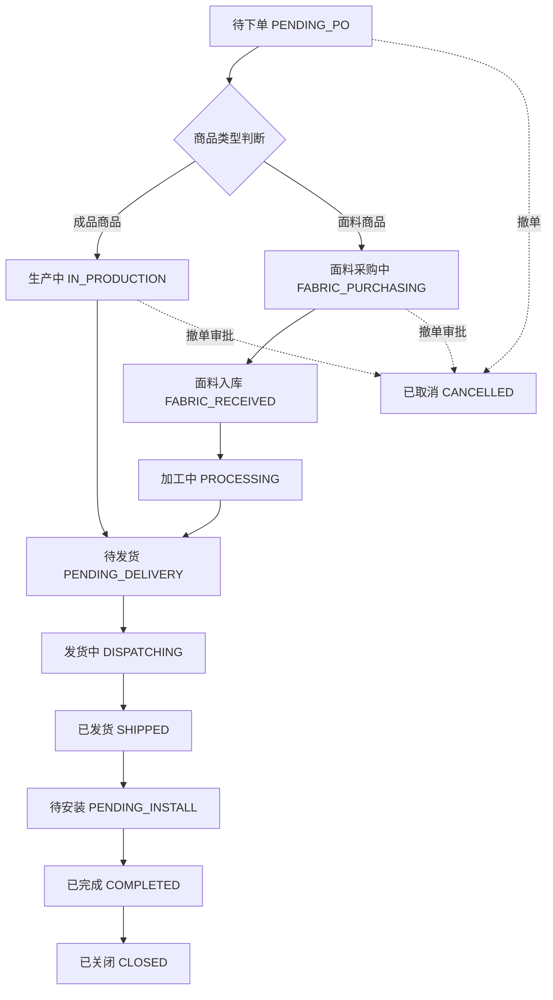

# 订单模块需求 (Order)

## 1. 模块概述 (Module Overview)

| 属性 | 说明 |
|:---|:---|
| **模块名称** | 订单 (Order) |
| **核心价值** | 交易达成的最终凭证，驱动采购、发货、安装、收款全流程 |
| **目标用户** | 销售人员、客服、采购员、店长 |
| **上游模块** | 报价单 |
| **下游模块** | 采购单、安装单、对账单 |

## 2. 业务场景 (Business Scenario)

### 2.1 典型场景
1. **报价转订单**: 客户确认报价后，销售上传确认凭证生成订单
2. **采购跟进**: 订单自动拆分采购单，采购员对接供应商
3. **面料加工**: 面料商品采购入库后，生成加工单送加工厂加工
4. **发货调度**: 货物备齐后，销售申请发货
5. **安装交付**: 货物到达后，派单安装并验收
6. **订单闭环**: 安装完成且收款完成，订单关闭

### 2.1.1 采购路线分类

根据商品类型，系统支持两种采购路线：

**路线1：成品采买**（现有流程）
- 适用商品：标品、电机、轨道、配件等成品商品
- 流程：订单 → 成品采购单 → 成品供应商 → 成品 → 发货 → 安装

**路线2：面料+加工**（新增流程）
- 适用商品：窗帘布料、窗帘纱、墙布等面料商品
- 流程：订单 → 面料采购单 → 面料供应商 → 面料入库 → 加工单 → 加工厂 → 成品 → 发货 → 安装

### 2.2 创建规则
*   **禁止直接创建**: 订单模块不提供"新建"按钮
*   **唯一来源**: 仅能从 `Active` 状态的报价单转化而来
*   **凭证要求**: 根据客户结算方式，必须上传相应凭证

#### 2.2.1 转化凭证要求

**月结客户转化流程：**
*   **凭证类型**: 客户下单凭证（如：微信聊天记录截图、邮件确认、签字确认单等）
*   **操作步骤**:
  1. 上传客户下单凭证图片
  2. 填写凭证说明（可选）
  3. 系统生成订单，状态为 `PENDING_PO`
  4. 自动创建 AR 对账单，状态为 `PENDING_RECON`

**现结客户转化流程：**
*   **凭证类型**: 收款凭证（如：转账截图、收款码截图、银行回单等）
*   **操作步骤**:
  1. 上传收款凭证图片（必填）
  2. 填写收款金额（必填，必须等于订单总金额）
  3. 选择支付方式（现金/微信/支付宝/银行转账）
  4. 填写收款时间（默认当前时间）
  5. 系统生成订单，状态为 `PENDING_PO`
  6. 自动创建 AR 对账单，状态为 `INVOICED`
  7. 自动创建收款记录，关联到对账单

**预收款客户转化流程：**
*   **适用场景**: 客户已支付定金或全款，但未生成订单
*   **操作步骤**:
  1. 选择已存在的收款单号（从预收款列表中选择）
  2. 系统验证收款单金额是否足够支付订单
  3. 生成订单，状态为 `PENDING_PO`
  4. 自动创建 AR 对账单，关联预收款记录
  5. 更新收款单关联的订单ID

#### 2.2.2 凭证验证规则
*   **凭证图片**: 必须上传清晰可识别的图片
*   **金额验证**: 现结客户的收款金额必须等于订单总金额
*   **预收款验证**: 预收款金额必须 ≥ 订单总金额
*   **凭证唯一性**: 同一凭证不能重复使用
*   **凭证审核**: 店长可对凭证进行审核，审核不通过需重新上传

## 3. 状态流转 (State Machine)



| 状态 | 状态码 | 说明 | 触发条件 |
|:---|:---|:---|:---|
| **待下单** | `PENDING_PO` | 等待采购拆单 | 订单创建成功 |
| **面料采购中** | `FABRIC_PURCHASING` | 面料采购中 | 存在面料商品，面料采购单已创建 |
| **面料入库** | `FABRIC_RECEIVED` | 面料已入库 | 所有面料采购单已到货并入库 |
| **加工中** | `PROCESSING` | 加工厂加工中 | 所有加工单已下达给加工厂 |
| **生产中** | `IN_PRODUCTION` | 成品采购中 | 所有成品采购单已下达给成品供应商 |
| **待发货** | `PENDING_DELIVERY` | 备货完成 | 所有采购单和加工单都已完成 |
| **发货中** | `DISPATCHING` | 销售申请发货 | 销售点击"申请发货" |
| **已发货** | `SHIPPED` | 物流运输中 | 所有采购单填入物流单号 |
| **待安装** | `PENDING_INSTALL` | 货物已到 | 物流签收/销售确认到货 |
| **已完成** | `COMPLETED` | 交付完成 | 所有安装单 COMPLETED |
| **已关闭** | `CLOSED` | 财务结清 | AR 对账单 COMPLETED |
| **已取消** | `CANCELLED` | 订单作废 | 撤单审批通过 |

### 3.1 状态联动规则 (木桶效应)
*   订单状态由**子单据状态聚合**驱动，禁止手动切换
*   只有当**所有**关联采购单/加工单/安装单都达到目标状态时，订单才能流转
*   任一子单据阻塞，整个订单阻塞

### 3.1.1 状态联动详解

**面料商品路线联动**:
1. 订单创建 → `PENDING_PO`
2. 拆单生成面料采购单 → `FABRIC_PURCHASING`
3. 所有面料采购单到货并入库 → `FABRIC_RECEIVED`
4. 生成加工单并下达给加工厂 → `PROCESSING`
5. 所有加工单完成 → 进入 `PENDING_DELIVERY`（等待成品采购单也完成）

**成品商品路线联动**:
1. 订单创建 → `PENDING_PO`
2. 拆单生成成品采购单 → `IN_PRODUCTION`
3. 所有成品采购单备货完成 → 进入 `PENDING_DELIVERY`（等待面料加工单也完成）

**混合路线联动**:
1. 订单同时包含面料商品和成品商品
2. 拆单生成面料采购单 + 成品采购单 → `FABRIC_PURCHASING` + `IN_PRODUCTION`
3. 面料入库 → `FABRIC_RECEIVED`
4. 生成加工单 → `PROCESSING`
5. 所有加工单和成品采购单都完成 → `PENDING_DELIVERY`

### 3.2 撤单规则
| 当前状态 | 可否撤单 | 审批要求 | 说明 |
|:---|:---|:---|:---|
| 待下单 | ✓ | 无需审批 | 直接撤单 |
| 生产中 | ✓ | 需店长审批 | 需与供应商协商 |
| 待发货及以后 | ✗ | 不可撤单 | 需走售后退货流程 |

## 4. 核心字段定义 (Field Definitions)

### 4.1 订单主表 (orders)

| 字段名 | 类型 | 必填 | 说明 |
|:---|:---|:---|:---|
| id | UUID | ✓ | 主键 |
| order_no | String | ✓ | 订单号 (OD20260101001) |
| quote_id | UUID | ✓ | 关联报价单 |
| quote_version_id | UUID | ✓ | 关联报价单版本 |
| lead_id | UUID | - | 关联线索 |
| customer_id | UUID | ✓ | 关联客户 |
| customer_name | String | ✓ | 客户姓名 (冗余) |
| customer_phone | String | ✓ | 客户电话 (冗余) |
| delivery_address | String | ✓ | 配送地址 |
| status | Enum | ✓ | 订单状态 |
| total_amount | Decimal | ✓ | 订单总金额 |
| paid_amount | Decimal | ✓ | 已收金额 |
| settlement_type | Enum | ✓ | 结算方式 (PREPAID/CREDIT/CASH) |
| confirmation_img | String | - | 客户确认凭证 (月结客户) |
| payment_proof_img | String | - | 收款凭证 (现结客户) |
| payment_amount | Decimal | - | 收款金额 (现结客户) |
| payment_method | Enum | - | 支付方式 (CASH/WECHAT/ALIPAY/BANK) |
| payment_time | DateTime | - | 收款时间 |
| prepaid_payment_id | UUID | - | 关联预收款记录 (预收款客户) |
| sales_id | UUID | ✓ | 归属销售 |
| remark | Text | - | 备注 |
| created_at | DateTime | ✓ | 创建时间 |
| completed_at | DateTime | - | 完成时间 |
| closed_at | DateTime | - | 关闭时间 |

### 4.2 订单明细表 (order_items)

| 字段名 | 类型 | 必填 | 说明 |
|:---|:---|:---|:---|
| id | UUID | ✓ | 主键 |
| order_id | UUID | ✓ | 关联订单 |
| quote_item_id | UUID | ✓ | 关联报价明细 |
| room_name | String | ✓ | 空间名称 |
| product_id | UUID | ✓ | 关联商品 |
| product_name | String | ✓ | 商品名称 |
| category | Enum | ✓ | 品类 |
| unit_price | Decimal | ✓ | 单价 |
| quantity | Decimal | ✓ | 数量 |
| width | Decimal | - | 宽度 |
| height | Decimal | - | 高度 |
| subtotal | Decimal | ✓ | 小计 |
| po_id | UUID | - | 关联采购单 (拆单后填入) |
| supplier_id | UUID | - | 供应商ID (拆单后填入) |
| status | Enum | ✓ | 明细状态 |

### 4.3 收款计划表 (payment_schedules)

| 字段名 | 类型 | 必填 | 说明 |
|:---|:---|:---|:---|
| id | UUID | ✓ | 主键 |
| order_id | UUID | ✓ | 关联订单 |
| name | String | ✓ | 节点名称 (定金/尾款) |
| amount | Decimal | ✓ | 应收金额 |
| expected_date | Date | - | 预计收款日 |
| actual_date | Date | - | 实际收款日 |
| status | Enum | ✓ | 状态 (PENDING/PAID) |
| proof_img | String | - | 收款凭证 |

## 5. 界面设计 (UI Design)

### 5.1 列表页 (Order List)

#### 展示字段
| 字段 | 宽度 | 说明 |
|:---|:---|:---|
| 订单号 | 150px | 可点击跳转详情 |
| 客户名称 | 100px | - |
| 订单金额 | 100px | 右对齐 |
| 已收金额 | 100px | 右对齐 |
| 状态 | 80px | 状态标签 (多色) |
| 归属销售 | 80px | - |
| 创建时间 | 130px | - |
| 操作 | 150px | 操作按钮 |

#### 状态标签颜色
| 状态 | 颜色 | 说明 |
|:---|:---|:---|
| 待下单 | 灰色 | - |
| 生产中 | 蓝色 | - |
| 待发货 | 橙色 | - |
| 发货中/已发货 | 紫色 | - |
| 待安装 | 青色 | - |
| 已完成 | 绿色 | - |
| 已关闭 | 深灰 | - |
| 已取消 | 红色 | - |

#### 筛选条件
| 筛选项 | 组件 | 说明 |
|:---|:---|:---|
| 时间范围 | `DateRangePicker` | 默认近 30 天 |
| 状态 | `Select` (多选) | 全部状态 |
| 归属销售 | `Select` | 店长可见全部 |
| 客户/电话/订单号 | `Input.Search` | 模糊搜索 |
| 供应商 | `Select` | 按采购单供应商筛选 |

#### 操作按钮
| 按钮 | 条件 | 说明 |
|:---|:---|:---|
| **拆单** | 状态=待下单 | 进入采购拆单页面 |
| **申请发货** | 状态=待发货 | 触发发货流程 |
| **确认到货** | 状态=已发货 | 手动确认到货 |
| **撤单** | 状态=待下单/生产中 | 触发撤单流程 |

### 5.2 详情页 (Order Detail)

#### 页面布局
```
┌─────────────────────────────────────────────────────────┐
│ 订单详情 #OD20260101001              [申请发货] [撤单] │
├──────────────────────┬──────────────────────────────────┤
│ 基础信息             │ 状态进度条                       │
│ 客户/地址/销售       │ [待下单→生产→发货→安装→完成]    │
├──────────────────────┴──────────────────────────────────┤
│ Tab: [订单明细] [采购单] [加工单] [安装单] [收款] [日志]  │
├─────────────────────────────────────────────────────────┤
│                                                         │
│                   当前 Tab 内容                          │
│                                                         │
└─────────────────────────────────────────────────────────┘
```

#### 状态进度条
使用 `Steps` 组件 (Ant Design)，展示订单全生命周期进度。

#### Tab 页签

**Tab 1: 订单明细**
| 列 | 说明 |
|:---|:---|
| 空间 | 空间名称 |
| 商品 | 商品名称 + SKU |
| 规格 | 尺寸/颜色 |
| 单价 | - |
| 数量 | - |
| 小计 | - |
| 商品类型 | 成品/面料 |
| 供应商 | 拆单后显示 |
| 采购单号 | 可点击跳转 |

**Tab 2: 采购单**
关联采购单列表，使用 `Collapse` 分组展示：
*   每个采购单为一个折叠项
*   显示供应商类型（面料/成品）、金额、状态、物流单号
*   面料采购单显示"入库"按钮
*   成品采购单显示"备货完成"按钮

**Tab 3: 加工单**
关联加工单列表，使用 `Table` 组件展示：
| 列 | 说明 |
|:---|:---|
| 加工单号 | 可点击跳转 |
| 面料名称 | - |
| 面料用量 | 米/卷 |
| 加工厂 | - |
| 加工规格 | 尺寸、工艺等 |
| 状态 | 待加工/加工中/已完成 |
| 预计完成日期 | - |
| 操作 | 查看详情/确认完成 |

**Tab 4: 安装单**
关联安装单列表，显示安装师傅、预约时间、状态。

**Tab 5: 收款**
收款计划表格，使用 `Table` 组件：
| 列 | 组件 | 说明 |
|:---|:---|:---|
| 节点名称 | Text | 定金/发货前/验收后 |
| 应收金额 | Text | - |
| 预计日期 | Text | - |
| 状态 | Tag | 待收/已收 |
| 操作 | Button | 确认收款 (上传凭证) |

**Tab 6: 操作日志**
时间线组件 (`Timeline`)，展示订单全生命周期操作记录。

### 5.3 拆单页面 (PO Splitting)

#### 场景
订单创建后，系统自动根据商品类型和默认供应商预拆采购单，客服可调整。

#### 拆单逻辑
*   **成品商品**: 根据商品 `default_supplier_id` 自动拆分为成品采购单
*   **面料商品**: 根据商品 `default_supplier_id` 自动拆分为面料采购单
*   **标品**: 拆分为内部备货单（从自有仓库领料）
*   **混合订单**: 同时包含面料商品和成品商品，拆分为面料采购单 + 成品采购单

#### 页面布局
```
┌─────────────────────────────────────────────────────┐
│ 采购单拆分                           [确认拆单]     │
├─────────────────────────────────────────────────────┤
│ 【面料采购单】                                        │
│ 面料供应商A (3件面料商品)                            │
│   ├─ 面料1    ¥1000  50米                       │
│   ├─ 面料2    ¥2000  80米                       │
│   └─ 面料3    ¥1500  60米   [移动至其他供应商 ▼]   │
├─────────────────────────────────────────────────────┤
│ 【成品采购单】                                        │
│ 成品供应商B (2件成品商品)                            │
│   ├─ 电机      ¥800   2台                        │
│   └─ 轨道      ¥1200  10米                       │
├─────────────────────────────────────────────────────┤
│ 【内部备货】 (1件标品)                               │
│   └─ 抱枕     ¥300                                │
└─────────────────────────────────────────────────────┘
```

#### 交互
*   使用 `Collapse` 组件按供应商类型分组（面料供应商/成品供应商/内部备货）
*   每个商品行有"移动至"下拉框，可调整归属
*   "确认拆单"后生成采购单：
    *   面料采购单 → 状态为 `DRAFT`
    *   成品采购单 → 状态为 `DRAFT`
    *   订单状态根据商品类型进入相应状态（`FABRIC_PURCHASING` / `IN_PRODUCTION`）

## 6. 业务规则 (Business Rules)

### 6.1 创建规则
*   仅从 Active 报价单转化
*   必须上传客户确认凭证
*   转化成功后报价单锁定

### 6.2 拆单规则
*   系统根据 `product.default_supplier_id` 自动预拆
*   `is_stockable = true` 的商品拆至"内部备货"
*   客服可手动调整商品归属

### 6.3 状态联动 (Proof of Work)
*   禁止手动切换状态，必须由数据驱动
*   木桶效应：所有子单据达标才流转

### 6.4 收款规则
*   支持多笔分期收款
*   每笔收款需上传凭证
*   可选：未收齐款禁止发货/安装

### 6.5 发货规则
*   待发货状态下销售可"申请发货"
*   可选择"立即发货"或"预约发货日期"
*   采购员收到通知后填写物流单号

## 7. 权限控制 (Permission Matrix)

### 7.1 页面级权限

| 页面 | 销售 | 客服 | 采购员 | 财务 | 店长 |
|:---|:---|:---|:---|:---|:---|
| 订单列表 | ✓ (本人) | ✓ (全部) | ✓ (全部) | ✓ (全部) | ✓ (全部) |
| 订单详情 | ✓ (本人) | ✓ | ✓ | ✓ | ✓ |
| 拆单页面 | ✗ | ✓ | ✗ | ✗ | ✓ |

### 7.2 按钮级权限

| 操作 | 销售 | 客服 | 采购员 | 财务 | 店长 |
|:---|:---|:---|:---|:---|:---|
| 拆单 | ✗ | ✓ | ✗ | ✗ | ✓ |
| 申请发货 | ✓ | ✓ | ✗ | ✗ | ✓ |
| 确认到货 | ✓ | ✓ | ✗ | ✗ | ✓ |
| 确认收款 | ✓ | ✗ | ✗ | ✓ | ✓ |
| 撤单 | ✓ (待下单) | ✗ | ✗ | ✗ | ✓ |
| 审批撤单 | ✗ | ✗ | ✗ | ✗ | ✓ |

### 7.3 数据范围权限

| 角色 | 可见范围 |
|:---|:---|
| 销售 | 自己负责的订单 |
| 客服/采购员/财务 | 全部订单 |
| 店长 | 本店所有订单 |

## 8. 通知与提醒 (Notifications)

| 触发事件 | 通知对象 | 渠道 | 内容 |
|:---|:---|:---|:---|
| 订单创建 | 客服 | 系统+飞书 | 有新订单待拆单 |
| 拆单完成 | 采购员 | 系统+飞书 | 有新采购单待处理 |
| 所有PO备货完成 | 销售 | 系统 | 订单可发货 |
| 申请发货 | 采购员 | 系统 | 请填写物流单号 |
| 物流签收 | 销售 | 系统 | 货物已到，请安排安装 |
| 收款到期提醒 | 销售 | 系统 | 收款节点即将到期 |
| 收款逾期 | 销售+店长 | 系统 | 收款已逾期 |
| 撤单审批待处理 | 店长 | 系统+飞书 | 有订单撤单待审批 |

## 9. 与其他模块的关联 (Module Relations)

| 模块 | 关联方式 | 数据流向 |
|:---|:---|:---|
| **报价单** | Order.quote_id → Quote.id | 报价 → 订单 |
| **客户** | Order.customer_id → Customer.id | - |
| **采购单** | PO.order_id → Order.id | 订单 → 采购单 |
| **安装单** | Install.order_id → Order.id | 订单 → 安装单 |
| **对账单-AR** | Statement.order_id → Order.id | 订单 → 收款对账 |
| **审批流** | 撤单审批 | 订单 → 审批 |
