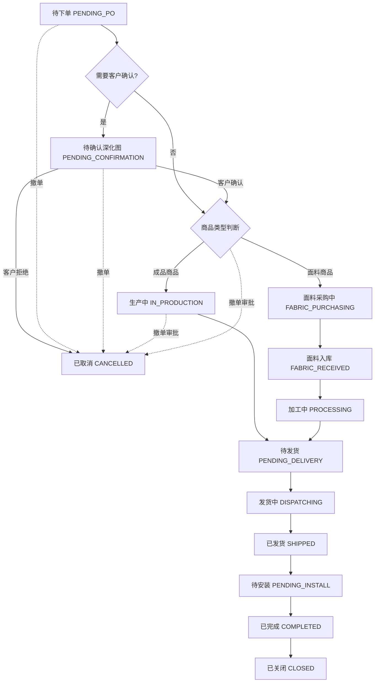
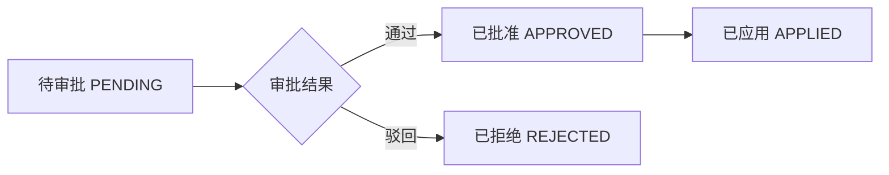

# 订单模块需求 (Order)

## 1. 模块概述 (Module Overview)

| 属性         | 说明                                                 |
| :----------- | :--------------------------------------------------- |
| **模块名称** | 订单 (Order)                                         |
| **核心价值** | 交易达成的最终凭证，驱动采购、发货、安装、收款全流程 |
| **目标用户** | 销售人员、客服、采购员、店长                         |
| **上游模块** | 报价单                                               |
| **下游模块** | 采购单、安装单、对账单                               |

## 2. 业务场景 (Business Scenario)

### 2.1 典型场景

1. **报价转订单**: 客户确认报价后，销售上传确认凭证生成订单
2. **采购跟进**: 订单自动拆分采购单，采购员对接供应商
3. **面料加工**: 面料商品采购入库后，生成加工单送加工厂加工
4. **发货调度**: 货物备齐后，销售申请发货
5. **安装交付**: 货物到达后，派单安装并验收
6. **订单闭环**: 安装完成且收款完成，订单关闭

### 2.1.1 采购路线分类

根据商品类型，系统支持两种采购路线：

**路线1：成品采买**（现有流程）

- 适用商品：标品、电机、轨道、配件等成品商品
- 流程：订单 → 成品采购单 → 成品供应商 → 成品 → 发货 → 安装

**路线2：面料+加工**（新增流程）

- 适用商品：窗帘布料、窗帘纱、墙布等面料商品
- 流程：订单 → 面料采购单 → 面料供应商 → 面料入库 → 加工单 → 加工厂 → 成品 → 发货 → 安装

### 2.2 创建规则

- **禁止直接创建**: 订单模块不提供"新建"按钮
- **唯一来源**: 仅能从 `Active` 状态的报价单转化而来
- **凭证要求**: 根据客户结算方式，必须上传相应凭证

#### 2.2.1 转化凭证要求

**月结客户转化流程：**

- **凭证类型**: 客户下单凭证（如：微信聊天记录截图、邮件确认、签字确认单等）
- **操作步骤**:

1. 上传客户下单凭证图片
2. 填写凭证说明（可选）
3. 系统生成订单，状态为 `PENDING_PO`
4. 自动创建 AR 对账单，状态为 `PENDING_RECON`

**现结客户转化流程：**

- **凭证类型**: 收款凭证（如：转账截图、收款码截图、银行回单等）
- **操作步骤**:

1. 上传收款凭证图片（必填）
2. 填写收款金额（必填，必须等于订单总金额）
3. 选择支付方式（现金/微信/支付宝/银行转账）
4. 填写收款时间（默认当前时间）
5. 系统生成订单，状态为 `PENDING_PO`
6. 自动创建 AR 对账单，状态为 `INVOICED`
7. 自动创建收款记录，关联到对账单

**预收款客户转化流程：**

- **适用场景**: 客户已支付定金或全款，但未生成订单
- **操作步骤**:

1. 选择已存在的收款单号（从预收款列表中选择）
2. 系统验证收款单金额是否足够支付订单
3. 生成订单，状态为 `PENDING_PO`
4. 自动创建 AR 对账单，关联预收款记录
5. 更新收款单关联的订单ID

#### 2.2.2 凭证验证规则

- **凭证图片**: 必须上传清晰可识别的图片
- **金额验证**: 现结客户的收款金额必须等于订单总金额
- **预收款验证**: 预收款金额必须 ≥ 订单总金额
- **凭证唯一性**: 同一凭证不能重复使用
- **凭证审核**: 店长可对凭证进行审核，审核不通过需重新上传

## 3. 状态流转 (State Machine)



| 状态             | 状态码                 | 说明               | 触发条件                         |
| :--------------- | :--------------------- | :----------------- | :------------------------------- |
| **待下单**       | `PENDING_PO`           | 等待采购拆单       | 订单创建成功                     |
| **待确认深化图** | `PENDING_CONFIRMATION` | 等待客户确认深化图 | 设计师上传深化图                 |
| **面料采购中**   | `FABRIC_PURCHASING`    | 面料采购中         | 存在面料商品，面料采购单已创建   |
| **面料入库**     | `FABRIC_RECEIVED`      | 面料已入库         | 所有面料采购单已到货并入库       |
| **加工中**       | `PROCESSING`           | 加工厂加工中       | 所有加工单已下达给加工厂         |
| **生产中**       | `IN_PRODUCTION`        | 成品采购中         | 所有成品采购单已下达给成品供应商 |
| **待发货**       | `PENDING_DELIVERY`     | 备货完成           | 所有采购单和加工单都已完成       |
| **发货中**       | `DISPATCHING`          | 销售申请发货       | 销售点击"申请发货"               |
| **已发货**       | `SHIPPED`              | 物流运输中         | 所有采购单填入物流单号           |
| **待安装**       | `PENDING_INSTALL`      | 货物已到           | 物流签收/销售确认到货            |
| **已完成**       | `COMPLETED`            | 交付完成           | 所有安装单 COMPLETED             |
| **已关闭**       | `CLOSED`               | 财务结清           | AR 对账单 COMPLETED              |
| **已叫停**       | `PAUSED`               | 订单暂停生产       | 叫停审批通过                     |
| **已取消**       | `CANCELLED`            | 订单作废           | 撤单审批通过                     |

### 3.1 状态联动规则 (木桶效应)

- 订单状态由**子单据状态聚合**驱动，禁止手动切换
- 只有当**所有**关联采购单/加工单/安装单都达到目标状态时，订单才能流转
- 任一子单据阻塞，整个订单阻塞

### 3.1.1 状态联动详解

**面料商品路线联动**:

1. 订单创建 → `PENDING_PO`
2. 设计师上传深化图 → `PENDING_CONFIRMATION`
3. 客户确认深化图 → `FABRIC_PURCHASING`
4. 拆单生成面料采购单 → `FABRIC_PURCHASING`
5. 所有面料采购单到货并入库 → `FABRIC_RECEIVED`
6. 生成加工单并下达给加工厂 → `PROCESSING`
7. 所有加工单完成 → 进入 `PENDING_DELIVERY`（等待成品采购单也完成）

**成品商品路线联动**:

1. 订单创建 → `PENDING_PO`
2. 设计师上传深化图 → `PENDING_CONFIRMATION`
3. 客户确认深化图 → `IN_PRODUCTION`
4. 拆单生成成品采购单 → `IN_PRODUCTION`
5. 所有成品采购单备货完成 → 进入 `PENDING_DELIVERY`（等待面料加工单也完成）

**混合路线联动**:

1. 订单同时包含面料商品和成品商品
2. 设计师上传深化图 → `PENDING_CONFIRMATION`
3. 客户确认深化图 → 拆单生成面料采购单 + 成品采购单 → `FABRIC_PURCHASING` + `IN_PRODUCTION`
4. 面料入库 → `FABRIC_RECEIVED`
5. 生成加工单 → `PROCESSING`
6. 所有加工单和成品采购单都完成 → `PENDING_DELIVERY`

### 3.2 撤单规则

| 当前状态     | 可否撤单 | 审批要求   | 说明                |
| :----------- | :------- | :--------- | :------------------ |
| 待下单       | ✓        | 无需审批   | 直接撤单            |
| 生产中       | ✓        | 需多级审批 | 店长→老板→采购→财务 |
| 待发货及以后 | ✗        | 不可撤单   | 需走售后退货流程    |

### 3.3 叫停规则

| 当前状态     | 可否叫停 | 审批要求   | 说明             |
| :----------- | :------- | :--------- | :--------------- |
| 待下单       | ✓        | 无需审批   | 直接叫停         |
| 待确认深化图 | ✓        | 无需审批   | 直接叫停         |
| 生产中       | ✓        | 需采购审批 | 整单或商品行叫停 |
| 待发货及以后 | ✗        | 不可叫停   | 需走售后退货流程 |

**叫停类型**：

- **整单叫停**：暂停整个订单的生产
- **商品行叫停**：只暂停某个商品行的生产

**叫停规则**：

- 一次叫停最多 **7天**
- 超过 **48小时** 自动恢复生产
- 如需继续叫停，需重新申请
- 叫停期间暂不产生额外费用

**叫停后处理**：

- 审批通过：通知生产部门暂停生产，订单状态变更为 `PAUSED`
- 审批驳回：继续生产
- 自动恢复：超过48小时自动恢复生产
- 手动恢复：销售可以手动恢复生产

### 3.4 变更单流程 (Change Order)

**业务场景**：订单创建后，客户可能需要修改商品、调整尺寸、增减数量等，但又不希望撤单重开。

**适用范围**：

- 仅限 `PENDING_PO` (待下单) 和 `PENDING_CONFIRMATION` (待确认深化图) 状态下允许变更
- 一旦进入生产流程 (`IN_PRODUCTION` / `FABRIC_PURCHASING`)，禁止变更，只能走"局部退货+新开单"

**变更单流程**：

1. **发起变更**
   - 销售或客服在订单详情页点击"申请变更"
   - 选择变更类型：商品变更 / 尺寸变更 / 数量变更 / 价格变更
   - 填写变更原因（必填）

2. **生成变更报价单**
   - 系统自动创建关联的"变更报价单" (Change Quote)
   - 变更报价单继承原订单的商品信息
   - 销售根据客户需求修改商品明细

3. **差价计算与审批**
   - 系统自动计算原订单金额 vs 变更后金额的差额
   - 补差价：变更金额 > 原金额，客户需补款
   - 退差价：变更金额 < 原金额，需退款给客户
   - 提交店长审批

4. **审批通过后更新**
   - 审批通过：更新原订单的商品明细和金额
   - 生成差价收款单或退款单
   - 订单状态保持不变，继续后续流程

5. **审批驳回**
   - 审批驳回：变更报价单作废，原订单保持不变

**变更限制**：

- 同一订单最多允许 **3次** 变更
- 变更必须在 `PENDING_PO` 或 `PENDING_CONFIRMATION` 状态下完成
- 变更后的商品类型不能改变（如从成品变更为面料）
- 变更后的总金额不能超过原订单金额的 **150%**

**变更单字段**：
| 字段名 | 类型 | 必填 | 说明 |
|:---|:---|:---|:---|
| id | UUID | ✓ | 主键 |
| order_id | UUID | ✓ | 关联原订单 |
| change_quote_id | UUID | ✓ | 关联变更报价单 |
| original_amount | Decimal | ✓ | 原订单金额 |
| new_amount | Decimal | ✓ | 变更后金额 |
| diff_amount | Decimal | ✓ | 差额（正数=补款，负数=退款） |
| change_type | Enum | ✓ | 变更类型 |
| change_reason | Text | ✓ | 变更原因 |
| status | Enum | ✓ | 状态 (PENDING/APPROVED/REJECTED) |
| approved_by | UUID | - | 审批人ID |
| approved_at | DateTime | - | 审批时间 |
| created_at | DateTime | ✓ | 创建时间 |

**变更类型**：

- `PRODUCT_CHANGE`: 商品变更（更换商品）
- `SIZE_CHANGE`: 尺寸变更（调整宽高）
- `QUANTITY_CHANGE`: 数量变更（增减数量）
- `PRICE_CHANGE`: 价格变更（调整单价）

## 4. 核心字段定义 (Field Definitions)

### 4.1 订单主表 (orders)

| 字段名                | 类型     | 必填 | 说明                                  |
| :-------------------- | :------- | :--- | :------------------------------------ |
| id                    | UUID     | ✓    | 主键                                  |
| order_no              | String   | ✓    | 订单号 (OD20260101001)                |
| quote_id              | UUID     | ✓    | 关联报价单                            |
| quote_version_id      | UUID     | ✓    | 关联报价单版本                        |
| lead_id               | UUID     | -    | 关联线索                              |
| customer_id           | UUID     | ✓    | 关联客户                              |
| customer_name         | String   | ✓    | 客户姓名 (冗余)                       |
| customer_phone        | String   | ✓    | 客户电话 (冗余)                       |
| delivery_address      | String   | ✓    | 配送地址                              |
| status                | Enum     | ✓    | 订单状态                              |
| total_amount          | Decimal  | ✓    | 订单总金额                            |
| paid_amount           | Decimal  | ✓    | 已收金额                              |
| settlement_type       | Enum     | ✓    | 结算方式 (PREPAID/CREDIT/CASH)        |
| confirmation_img      | String   | -    | 客户确认凭证 (月结客户)               |
| payment_proof_img     | String   | -    | 收款凭证 (现结客户)                   |
| payment_amount        | Decimal  | -    | 收款金额 (现结客户)                   |
| payment_method        | Enum     | -    | 支付方式 (CASH/WECHAT/ALIPAY/BANK)    |
| payment_time          | DateTime | -    | 收款时间                              |
| prepaid_payment_id    | UUID     | -    | 关联预收款记录 (预收款客户)           |
| sales_id              | UUID     | ✓    | 归属销售                              |
| remark                | Text     | -    | 备注                                  |
| snapshot_data         | JSONB    | ✓    | 订单快照数据 (Quote+Customer完整数据) |
| halted_reason         | Text     | -    | 叫停原因                              |
| halted_at             | DateTime | -    | 叫停时间                              |
| previous_status       | Enum     | -    | 叫停前的状态                          |
| cancel_reason         | Text     | -    | 撤单原因                              |
| cancelled_by          | UUID     | -    | 撤单人ID                              |
| cancelled_at          | DateTime | -    | 撤单时间                              |
| locked_by             | UUID     | -    | 锁定人ID                              |
| is_locked             | Boolean  | -    | 是否锁定                              |
| confirmation_deadline | DateTime | -    | 深化图确认截止时间                    |
| created_at            | DateTime | ✓    | 创建时间                              |
| completed_at          | DateTime | -    | 完成时间                              |
| closed_at             | DateTime | -    | 关闭时间                              |

#### 4.1.1 快照数据结构 (snapshot_data)

**快照目的**: 确保订单创建后,即使引用的 Quote 或 Customer 数据发生变更,历史订单数据不受影响。

**快照内容**:

```json
{
  "quote_snapshot": {
    "quote_no": "QT20260101001",
    "quote_date": "2026-01-15",
    "items": [
      {
        "quote_item_id": "uuid",
        "room_name": "客厅",
        "product_id": "uuid",
        "product_name": "罗马帘",
        "category": "CURTAIN",
        "unit_price": 150.0,
        "quantity": 2.0,
        "width": 2.5,
        "height": 2.8,
        "subtotal": 300.0
      }
    ],
    "total_amount": 300.0
  },
  "customer_snapshot": {
    "customer_id": "uuid",
    "customer_name": "张三",
    "customer_phone": "13800138000",
    "customer_address": "北京市朝阳区xxx"
  },
  "snapshot_time": "2026-01-15T10:30:00Z"
}
```

**使用规则**:

- 订单详情页应优先展示快照数据,而非通过 ID 关联查询最新数据
- 快照在订单创建时自动生成,不可修改
- 如需查看最新数据,提供"查看最新"按钮跳转至客户/报价详情页

### 4.2 订单明细表 (order_items)

| 字段名            | 类型     | 必填 | 说明                                 |
| :---------------- | :------- | :--- | :----------------------------------- |
| id                | UUID     | ✓    | 主键                                 |
| order_id          | UUID     | ✓    | 关联订单                             |
| quote_item_id     | UUID     | ✓    | 关联报价明细                         |
| room_name         | String   | ✓    | 空间名称                             |
| product_id        | UUID     | ✓    | 关联商品                             |
| product_name      | String   | ✓    | 商品名称                             |
| category          | Enum     | ✓    | 品类                                 |
| unit_price        | Decimal  | ✓    | 单价                                 |
| quantity          | Decimal  | ✓    | 数量                                 |
| width             | Decimal  | -    | 宽度                                 |
| height            | Decimal  | -    | 高度                                 |
| subtotal          | Decimal  | ✓    | 小计                                 |
| po_id             | UUID     | -    | 关联采购单 (拆单后填入)              |
| supplier_id       | UUID     | -    | 供应商ID (拆单后填入)                |
| purchase_order_id | UUID     | -    | 采购单ID (拆单后填入)                |
| delivery_status   | Enum     | -    | 交付状态 (PENDING/SHIPPED/DELIVERED) |
| delivered_at      | DateTime | -    | 送达时间                             |
| status            | Enum     | ✓    | 明细状态                             |

### 4.4 订单快照 (Order Snapshot)

| 字段名              | 类型     | 必填 | 说明                                                             |
| :------------------ | :------- | :--- | :--------------------------------------------------------------- |
| snapshot_data       | JSONB    | ✓    | 订单快照数据（存储下单时刻的 Quote 完整数据、Customer 基础信息） |
| snapshot_created_at | DateTime | ✓    | 快照创建时间                                                     |

**快照数据结构**：

```json
{
  "quote": {
    "id": "uuid",
    "quoteNo": "QT20260101001",
    "versionId": "uuid",
    "totalAmount": 15000.0,
    "items": [
      {
        "id": "uuid",
        "productName": "梦幻帘",
        "category": "CURTAIN",
        "unitPrice": 300.0,
        "quantity": 1,
        "subtotal": 300.0,
        "specifications": {
          "width": 2800,
          "height": 2500,
          "installType": "TOP",
          "openingStyle": "DOUBLE"
        }
      }
    ]
  },
  "customer": {
    "id": "uuid",
    "name": "张三",
    "phone": "13800138000",
    "address": "北京市朝阳区XXX小区"
  },
  "createdAt": "2026-01-15T10:00:00Z",
  "createdBy": "uuid"
}
```

**快照规则**：

- 订单创建成功后立即生成快照
- 快照包含报价单完整数据（含 Items）和客户基础信息
- 订单详情页应优先展示快照数据，而非通过 ID 关联查询最新数据
- 快照创建后不可修改，确保历史订单数据完整性

### 4.5 收款计划表 (payment_schedules)

| 字段名        | 类型    | 必填 | 说明                 |
| :------------ | :------ | :--- | :------------------- |
| id            | UUID    | ✓    | 主键                 |
| order_id      | UUID    | ✓    | 关联订单             |
| name          | String  | ✓    | 节点名称 (定金/尾款) |
| amount        | Decimal | ✓    | 应收金额             |
| expected_date | Date    | -    | 预计收款日           |
| actual_date   | Date    | -    | 实际收款日           |
| status        | Enum    | ✓    | 状态 (PENDING/PAID)  |
| proof_img     | String  | -    | 收款凭证             |

## 5. 界面设计 (UI Design)

### 5.1 列表页 (Order List)

#### 展示字段

| 字段     | 宽度  | 说明            |
| :------- | :---- | :-------------- |
| 订单号   | 150px | 可点击跳转详情  |
| 客户名称 | 100px | -               |
| 订单金额 | 100px | 右对齐          |
| 已收金额 | 100px | 右对齐          |
| 状态     | 80px  | 状态标签 (多色) |
| 归属销售 | 80px  | -               |
| 创建时间 | 130px | -               |
| 操作     | 150px | 操作按钮        |

#### 状态标签颜色

| 状态          | 颜色 | 说明 |
| :------------ | :--- | :--- |
| 待下单        | 灰色 | -    |
| 生产中        | 蓝色 | -    |
| 待发货        | 橙色 | -    |
| 发货中/已发货 | 紫色 | -    |
| 待安装        | 青色 | -    |
| 已完成        | 绿色 | -    |
| 已关闭        | 深灰 | -    |
| 已取消        | 红色 | -    |

#### 筛选条件

| 筛选项           | 组件              | 说明               |
| :--------------- | :---------------- | :----------------- |
| 时间范围         | `DateRangePicker` | 默认近 30 天       |
| 状态             | `Select` (多选)   | 全部状态           |
| 归属销售         | `Select`          | 店长可见全部       |
| 客户/电话/订单号 | `Input.Search`    | 模糊搜索           |
| 供应商           | `Select`          | 按采购单供应商筛选 |

#### 操作按钮

| 按钮         | 条件               | 说明             |
| :----------- | :----------------- | :--------------- |
| **拆单**     | 状态=待下单        | 进入采购拆单页面 |
| **申请发货** | 状态=待发货        | 触发发货流程     |
| **确认到货** | 状态=已发货        | 手动确认到货     |
| **撤单**     | 状态=待下单/生产中 | 触发撤单流程     |

### 5.2 详情页 (Order Detail)

#### 页面布局

```
┌─────────────────────────────────────────────────────────┐
│ 订单详情 #OD20260101001              [申请发货] [撤单] │
├──────────────────────┬──────────────────────────────────┤
│ 基础信息             │ 状态进度条                       │
│ 客户/地址/销售       │ [待下单→生产→发货→安装→完成]    │
│ (优先展示快照数据)   │                                  │
├──────────────────────┴──────────────────────────────────┤
│ Tab: [订单明细] [采购单] [加工单] [安装单] [收款] [日志]  │
├─────────────────────────────────────────────────────────┤
│                                                         │
│                   当前 Tab 内容                          │
│                                                         │
└─────────────────────────────────────────────────────────┘
```

#### 基础信息展示规则

**快照数据优先**：

- 订单详情页的基础信息（客户名称、电话、地址、商品明细等）应优先从 `snapshot_data` 字段读取
- 确保展示的是下单时刻的数据，不受后续客户信息或报价单变更影响

**快照数据标识**：

- 在基础信息区域顶部显示"快照数据"标签，提示用户当前展示的是下单时的数据
- 提供"查看最新"按钮，点击后跳转至客户详情页或报价单详情页查看最新数据

**快照数据内容**：
| 字段 | 数据来源 | 说明 |
|:---|:---|:---|
| 客户名称 | `snapshot_data.customer_snapshot.customer_name` | 下单时的客户名称 |
| 客户电话 | `snapshot_data.customer_snapshot.customer_phone` | 下单时的客户电话 |
| 配送地址 | `snapshot_data.customer_snapshot.customer_address` | 下单时的配送地址 |
| 商品明细 | `snapshot_data.quote_snapshot.items` | 下单时的商品明细 |
| 订单金额 | `snapshot_data.quote_snapshot.total_amount` | 下单时的订单金额 |
| 快照时间 | `snapshot_data.snapshot_time` | 快照生成时间 |

**最新数据查看**：

- 点击"查看最新"按钮后，跳转至客户详情页或报价单详情页
- 在跳转页面中，可以查看客户或报价单的最新信息
- 对比快照数据和最新数据，了解变更情况

#### 状态进度条

使用 `Steps` 组件 (Ant Design)，展示订单全生命周期进度。

#### Tab 页签

**Tab 1: 订单明细**
| 列 | 说明 |
|:---|:---|
| 空间 | 空间名称 |
| 商品 | 商品名称 + SKU |
| 规格 | 尺寸/颜色 |
| 单价 | - |
| 数量 | - |
| 小计 | - |
| 商品类型 | 成品/面料 |
| 供应商 | 拆单后显示 |
| 采购单号 | 可点击跳转 |

**Tab 2: 采购单**
关联采购单列表，使用 `Collapse` 分组展示：

- 每个采购单为一个折叠项
- 显示供应商类型（面料/成品）、金额、状态、物流单号
- 面料采购单显示"入库"按钮
- 成品采购单显示"备货完成"按钮

**Tab 3: 加工单**
关联加工单列表，使用 `Table` 组件展示：
| 列 | 说明 |
|:---|:---|
| 加工单号 | 可点击跳转 |
| 面料名称 | - |
| 面料用量 | 米/卷 |
| 加工厂 | - |
| 加工规格 | 尺寸、工艺等 |
| 状态 | 待加工/加工中/已完成 |
| 预计完成日期 | - |
| 操作 | 查看详情/确认完成 |

**Tab 4: 安装单**
关联安装单列表，显示安装师傅、预约时间、状态。

**Tab 5: 收款**
收款计划表格，使用 `Table` 组件：
| 列 | 组件 | 说明 |
|:---|:---|:---|
| 节点名称 | Text | 定金/发货前/验收后 |
| 应收金额 | Text | - |
| 预计日期 | Text | - |
| 状态 | Tag | 待收/已收 |
| 操作 | Button | 确认收款 (上传凭证) |

**Tab 6: 操作日志**
时间线组件 (`Timeline`)，展示订单全生命周期操作记录。

### 5.3 拆单页面 (PO Splitting)

#### 场景

订单创建后，系统自动根据商品类型和默认供应商预拆采购单，客服可调整。

#### 拆单逻辑

- **成品商品**: 根据商品 `default_supplier_id` 自动拆分为成品采购单
- **面料商品**: 根据商品 `default_supplier_id` 自动拆分为面料采购单
- **标品**: 拆分为内部备货单（从自有仓库领料）
- **混合订单**: 同时包含面料商品和成品商品，拆分为面料采购单 + 成品采购单

#### 页面布局

```
┌─────────────────────────────────────────────────────┐
│ 采购单拆分                           [确认拆单]     │
├─────────────────────────────────────────────────────┤
│ 【面料采购单】                                        │
│ 面料供应商A (3件面料商品)                            │
│   ├─ 面料1    ¥1000  50米                       │
│   ├─ 面料2    ¥2000  80米                       │
│   └─ 面料3    ¥1500  60米   [移动至其他供应商 ▼]   │
├─────────────────────────────────────────────────────┤
│ 【成品采购单】                                        │
│ 成品供应商B (2件成品商品)                            │
│   ├─ 电机      ¥800   2台                        │
│   └─ 轨道      ¥1200  10米                       │
├─────────────────────────────────────────────────────┤
│ 【内部备货】 (1件标品)                               │
│   └─ 抱枕     ¥300                                │
└─────────────────────────────────────────────────────┘
```

#### 交互

- 使用 `Collapse` 组件按供应商类型分组（面料供应商/成品供应商/内部备货）
- 每个商品行有"移动至"下拉框，可调整归属
- "确认拆单"后生成采购单：
  - 面料采购单 → 状态为 `DRAFT`
  - 成品采购单 → 状态为 `DRAFT`
  - 订单状态根据商品类型进入相应状态（`FABRIC_PURCHASING` / `IN_PRODUCTION`）

## 6. 业务规则 (Business Rules)

### 6.1 创建规则

- 仅从 Active 报价单转化
- 必须上传客户确认凭证
- 转化成功后报价单锁定

### 6.2 拆单规则

- 系统根据 `product.default_supplier_id` 自动预拆
- `is_stockable = true` 的商品拆至"内部备货"
- 客服可手动调整商品归属

### 6.3 状态联动 (Proof of Work)

- 禁止手动切换状态，必须由数据驱动
- 木桶效应：所有子单据达标才流转

### 6.4 收款规则

- 支持多笔分期收款
- 每笔收款需上传凭证
- 可选：未收齐款禁止发货/安装

### 6.5 发货规则

- 待发货状态下销售可"申请发货"
- 可选择"立即发货"或"预约发货日期"
- 采购员收到通知后填写物流单号

## 7. 权限控制 (Permission Matrix)

### 7.1 页面级权限

| 页面     | 销售     | 客服     | 采购员   | 财务     | 店长     |
| :------- | :------- | :------- | :------- | :------- | :------- |
| 订单列表 | ✓ (本人) | ✓ (全部) | ✓ (全部) | ✓ (全部) | ✓ (全部) |
| 订单详情 | ✓ (本人) | ✓        | ✓        | ✓        | ✓        |
| 拆单页面 | ✗        | ✓        | ✗        | ✗        | ✓        |

### 7.2 按钮级权限

| 操作     | 销售       | 客服 | 采购员 | 财务 | 店长 |
| :------- | :--------- | :--- | :----- | :--- | :--- |
| 拆单     | ✗          | ✓    | ✗      | ✗    | ✓    |
| 申请发货 | ✓          | ✓    | ✗      | ✗    | ✓    |
| 确认到货 | ✓          | ✓    | ✗      | ✗    | ✓    |
| 确认收款 | ✓          | ✗    | ✗      | ✓    | ✓    |
| 撤单     | ✓ (待下单) | ✗    | ✗      | ✗    | ✓    |
| 审批撤单 | ✗          | ✗    | ✗      | ✗    | ✓    |

### 7.3 数据范围权限

| 角色             | 可见范围       |
| :--------------- | :------------- |
| 销售             | 自己负责的订单 |
| 客服/采购员/财务 | 全部订单       |
| 店长             | 本店所有订单   |

## 8. 通知与提醒 (Notifications)

| 触发事件       | 通知对象  | 渠道      | 内容                 |
| :------------- | :-------- | :-------- | :------------------- |
| 订单创建       | 客服      | 系统+飞书 | 有新订单待拆单       |
| 拆单完成       | 采购员    | 系统+飞书 | 有新采购单待处理     |
| 所有PO备货完成 | 销售      | 系统      | 订单可发货           |
| 申请发货       | 采购员    | 系统      | 请填写物流单号       |
| 物流签收       | 销售      | 系统      | 货物已到，请安排安装 |
| 收款到期提醒   | 销售      | 系统      | 收款节点即将到期     |
| 收款逾期       | 销售+店长 | 系统      | 收款已逾期           |
| 撤单审批待处理 | 店长      | 系统+飞书 | 有订单撤单待审批     |

## 9. 物流轨迹查询 (Logistics Tracking)

### 9.1 物流服务设计

**LogisticsService 接口**：

```typescript
interface LogisticsService {
  // 查询物流轨迹
  queryTracking(trackingNumber: string, company: string): Promise<LogisticsTracking>;

  // 支持的物流公司列表
  getSupportedCompanies(): string[];
}

interface LogisticsTracking {
  trackingNumber: string;
  company: string;
  status: string;
  timeline: Array<{
    time: string;
    status: string;
    location: string;
    description: string;
  }>;
  estimatedDelivery: string | null;
}
```

### 9.2 支持的物流公司

| 物流公司 | 代码          | 说明             |
| :------- | :------------ | :--------------- |
| 顺丰速运 | `SF`          | 支持实时轨迹查询 |
| 德邦快递 | `DB`          | 支持实时轨迹查询 |
| 中通快递 | `ZTO`         | 支持实时轨迹查询 |
| 圆通速递 | `YTO`         | 支持实时轨迹查询 |
| 申通快递 | `STO`         | 支持实时轨迹查询 |
| 自提     | `SELF_PICKUP` | 无物流轨迹       |

### 9.3 物流轨迹展示

**在订单详情页新增物流时间轴组件**：

- 展示物流轨迹时间线
- 显示当前状态和预计送达时间
- 支持点击查看详情
- 自动刷新物流状态（每30分钟）

### 9.4 物流轨迹查询接口

**接口信息**：

- **URL**: `GET /api/v1/orders/{id}/logistics-tracking`
- **认证**: 需要
- **权限**: `orders.read`

**响应示例**：

```json
{
  "success": true,
  "data": {
    "trackingNumber": "SF1234567890",
    "company": "SF",
    "companyName": "顺丰速运",
    "status": "运输中",
    "timeline": [
      {
        "time": "2026-01-22T10:00:00Z",
        "status": "已揽收",
        "location": "北京市朝阳区",
        "description": "快递员已揽收"
      },
      {
        "time": "2026-01-22T18:00:00Z",
        "status": "运输中",
        "location": "北京市大兴区",
        "description": "快件到达北京大兴集散中心"
      },
      {
        "time": "2026-01-23T09:00:00Z",
        "status": "派送中",
        "location": "上海市浦东新区",
        "description": "快件到达上海浦东集散中心，准备派送"
      }
    ],
    "estimatedDelivery": "2026-01-23T18:00:00Z"
  }
}
```

### 9.5 物流轨迹自动更新

**自动查询规则**：

- 订单状态为 `SHIPPED` 时，系统每30分钟自动查询物流状态
- 物流签收后，自动更新订单状态为 `PENDING_INSTALL`
- 物流异常（如超时未签收）时，自动通知采购员和销售

## 10. 变更单机制 (Change Order)

### 10.1 变更单数据结构

**变更单表 (change_orders)**：

| 字段名              | 类型     | 必填 | 说明                                        |
| :------------------ | :------- | :--- | :------------------------------------------ |
| id                  | UUID     | ✓    | 主键                                        |
| tenant_id           | UUID     | ✓    | 租户 ID                                     |
| order_id            | UUID     | ✓    | 关联订单                                    |
| order_no            | String   | ✓    | 订单号                                      |
| change_type         | Enum     | ✓    | 变更类型 (ADD_ITEM/REMOVE_ITEM/MODIFY_ITEM) |
| change_reason       | Text     | ✓    | 变更原因                                    |
| original_items      | JSONB    | ✓    | 原始商品列表                                |
| new_items           | JSONB    | ✓    | 新商品列表                                  |
| price_difference    | Decimal  | -    | 差价（正数补差价，负数退差价）              |
| status              | Enum     | ✓    | 状态 (PENDING/APPROVED/REJECTED/APPLIED)    |
| approval_request_id | UUID     | -    | 关联审批记录                                |
| created_at          | DateTime | ✓    | 创建时间                                    |
| approved_at         | DateTime | -    | 审批时间                                    |
| applied_at          | DateTime | -    | 应用时间                                    |

### 10.2 变更单状态流转



| 状态       | 状态码     | 说明         | 触发条件         |
| :--------- | :--------- | :----------- | :--------------- |
| **待审批** | `PENDING`  | 等待审批     | 创建变更请求     |
| **已批准** | `APPROVED` | 审批通过     | 审批人审批通过   |
| **已拒绝** | `REJECTED` | 审批拒绝     | 审批人审批拒绝   |
| **已应用** | `APPLIED`  | 已应用到订单 | 系统自动应用变更 |

### 10.3 变更单业务规则

**Scope（变更范围）**：

- 仅限 `PENDING_PO` 和 `PENDING_CONFIRMATION` 状态下允许变更
- 一旦进入生产（`IN_PRODUCTION` / `FABRIC_PURCHASING`），禁止变更
- 进入生产后只能走"局部退货+新开单"流程

**变更类型**：

- `ADD_ITEM`：新增商品
- `REMOVE_ITEM`：移除商品
- `MODIFY_ITEM`：修改商品（尺寸、数量等）

**变更流程**：

1. 销售在订单详情页点击"申请变更"
2. 选择变更类型和变更内容
3. 填写变更原因（必填）
4. 系统自动计算差价
5. 提交审批
6. 审批通过后，系统自动应用变更
7. 更新原订单 Items 和订单金额

**差价处理**：

- 补差价（price_difference > 0）：客户需支付差价
- 退差价（price_difference < 0）：系统自动生成退款记录
- 无差价（price_difference = 0）：无需额外操作

### 10.4 变更单 API 接口

**创建变更请求**：

- **URL**: `POST /api/v1/orders/{id}/change-requests`
- **认证**: 需要
- **权限**: `orders.update`

**请求参数**：

```json
{
  "change_type": "MODIFY_ITEM",
  "change_reason": "客户要求修改尺寸",
  "original_items": [
    {
      "id": "uuid",
      "product_name": "梦幻帘",
      "quantity": 1,
      "width": 2800,
      "height": 2500,
      "subtotal": 300.0
    }
  ],
  "new_items": [
    {
      "product_id": "uuid",
      "product_name": "梦幻帘",
      "quantity": 1,
      "width": 3000,
      "height": 2500,
      "subtotal": 320.0
    }
  ]
}
```

**响应示例**：

```json
{
  "success": true,
  "data": {
    "id": "uuid",
    "order_no": "OD20260101001",
    "change_type": "MODIFY_ITEM",
    "price_difference": "20.00",
    "status": "PENDING",
    "created_at": "2026-01-15T10:00:00Z"
  }
}
```

**审批变更请求**：

- **URL**: `POST /api/v1/change-requests/{id}/approve`
- **认证**: 需要
- **权限**: `orders.approve`

**拒绝变更请求**：

- **URL**: `POST /api/v1/change-requests/{id}/reject`
- **认证**: 需要
- **权限**: `orders.approve`

### 10.5 变更单权限控制

| 操作         | 销售      | 客服 | 采购员 | 财务 | 店长 |
| :----------- | :-------- | :--- | :----- | :--- | :--- |
| 创建变更请求 | ✓         | ✓    | ✗      | ✗    | ✓    |
| 审批变更请求 | ✗         | ✗    | ✗      | ✗    | ✓    |
| 查看变更历史 | ✓（本人） | ✓    | ✓      | ✓    | ✓    |

## 11. 与其他模块的关联 (Module Relations)

| 模块          | 关联方式                        | 数据流向        |
| :------------ | :------------------------------ | :-------------- |
| **报价单**    | Order.quote_id → Quote.id       | 报价 → 订单     |
| **客户**      | Order.customer_id → Customer.id | -               |
| **采购单**    | PO.order_id → Order.id          | 订单 → 采购单   |
| **安装单**    | Install.order_id → Order.id     | 订单 → 安装单   |
| **对账单-AR** | Statement.order_id → Order.id   | 订单 → 收款对账 |
| **审批流**    | 撤单审批                        | 订单 → 审批     |
