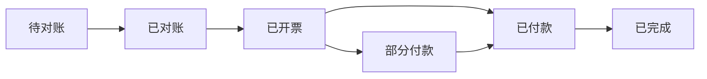
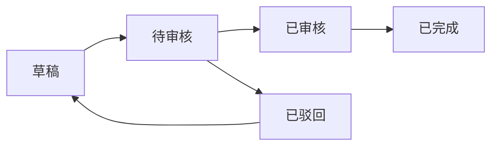
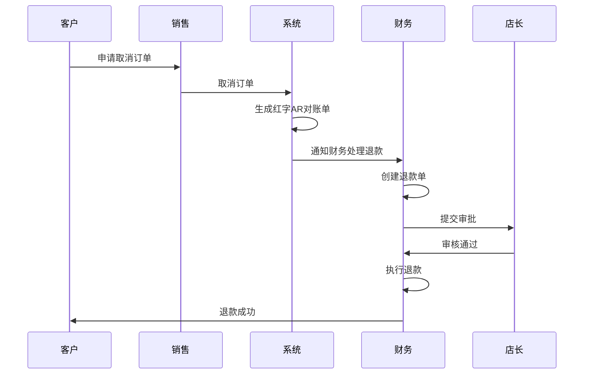
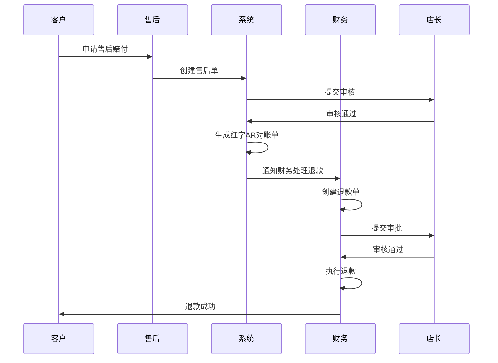

# 付款单模块 (Payment Bill)

## 1. 模块概述 (Module Overview)

| 属性         | 说明                                         |
| :----------- | :------------------------------------------- |
| **模块名称** | 付款单 (Payment Bill)                        |
| **核心价值** | 管理供应商付款和劳务结算，实现资金流出的闭环 |
| **目标用户** | 财务、采购员、店长                           |
| **上游模块** | 采购单、安装单                               |
| **下游模块** | 对账单、数据报表                             |

## 2. 采购对账单 (AP-Supplier)

### 2.1 状态流转



| 状态         | 状态码       | 说明                 | 触发动作             |
| :----------- | :----------- | :------------------- | :------------------- |
| **待对账**   | `PENDING`    | 等待核对金额         | 采购单完成时自动生成 |
| **已对账**   | `RECONCILED` | 金额核对通过，可开票 | 财务确认对账         |
| **已开票**   | `INVOICED`   | 发票已开，等待付款   | 财务录入发票信息     |
| **部分付款** | `PARTIAL`    | 已付部分款项         | 录入部分付款         |
| **已付款**   | `PAID`       | 全部付清             | 最后一笔付款确认     |
| **已完成**   | `COMPLETED`  | 付款完成             | 状态变为COMPLETED    |

### 2.2 核心字段 (ap_supplier_statements)

| 字段名            | 类型     | 必填 | 说明                              |
| :---------------- | :------- | :--- | :-------------------------------- |
| id                | UUID     | ✓    | 主键                              |
| statement_no      | String   | ✓    | 对账单号 (AP_SUPPLIER20260101001) |
| purchase_order_id | UUID     | ✓    | 关联采购单                        |
| supplier_id       | UUID     | ✓    | 关联供应商                        |
| supplier_name     | String   | ✓    | 供应商名称 (冗余)                 |
| total_amount      | Decimal  | ✓    | 应付总额                          |
| paid_amount       | Decimal  | ✓    | 已付金额                          |
| pending_amount    | Decimal  | ✓    | 待付金额                          |
| status            | Enum     | ✓    | 状态                              |
| invoice_no        | String   | -    | 发票号                            |
| invoiced_at       | DateTime | -    | 开票时间                          |
| invoice_amount    | Decimal  | -    | 发票金额（可能与采购金额不一致）  |
| tax_rate          | Decimal  | -    | 税率                              |
| tax_amount        | Decimal  | -    | 税额                              |
| is_tax_inclusive  | Boolean  | -    | 是否含税                          |
| completed_at      | DateTime | -    | 完成时间                          |
| purchaser_id      | UUID     | ✓    | 归属采购员                        |
| created_at        | DateTime | ✓    | 创建时间                          |

### 2.3 付款计划表 (payment_plans)

| 字段名            | 类型     | 必填 | 说明                 |
| :---------------- | :------- | :--- | :------------------- |
| id                | UUID     | ✓    | 主键                 |
| statement_id      | UUID     | ✓    | 关联对账单           |
| purchase_order_id | UUID     | ✓    | 关联采购单           |
| name              | String   | ✓    | 节点名称 (定金/尾款) |
| amount            | Decimal  | ✓    | 应付金额             |
| expected_date     | Date     | -    | 预计付款日           |
| actual_date       | Date     | -    | 实际付款日           |
| status            | Enum     | ✓    | PENDING/PAID         |
| proof_url         | String   | -    | 付款凭证             |
| remark            | String   | -    | 备注                 |
| created_at        | DateTime | ✓    | 创建时间             |

### 2.4 付款记录表 (payment_bills)

| 字段名            | 类型     | 必填 | 说明                               |
| :---------------- | :------- | :--- | :--------------------------------- |
| id                | UUID     | ✓    | 主键                               |
| statement_id      | UUID     | ✓    | 关联对账单                         |
| purchase_order_id | UUID     | ✓    | 关联采购单                         |
| plan_id           | UUID     | -    | 关联计划节点                       |
| amount            | Decimal  | ✓    | 付款金额                           |
| payment_method    | Enum     | ✓    | 支付方式 (CASH/WECHAT/ALIPAY/BANK) |
| account_id        | UUID     | ✓    | 关联付款账户                       |
| proof_url         | String   | ✓    | 付款凭证 (必填)                    |
| paid_at           | DateTime | ✓    | 付款时间                           |
| recorded_by       | UUID     | ✓    | 记录人                             |
| remark            | String   | -    | 备注                               |
| is_verified       | Boolean  | ✓    | 是否已审核 (默认false)             |
| verified_by       | UUID     | -    | 审核人                             |
| verified_at       | DateTime | -    | 审核时间                           |

## 3. 劳务结算单 (AP-Labor)

### 3.1 状态流转


| 状态         | 状态码       | 说明             | 触发动作           |
| :----------- | :----------- | :--------------- | :----------------- |
| **待结算**   | `PENDING`    | 等待计算劳务费   | 任务完成时自动生成 |
| **已计算**   | `CALCULATED` | 劳务费已计算     | 系统自动计算完成   |
| **已审核**   | `VERIFIED`   | 审核通过，可发放 | 店长审核通过       |
| **部分发放** | `PARTIAL`    | 已发部分款项     | 录入部分发放       |
| **已发放**   | `PAID`       | 全部发完         | 最后一笔发放确认   |
| **已完成**   | `COMPLETED`  | 发放完成         | 状态变为COMPLETED  |

### 3.2 核心字段 (ap_labor_statements)

| 字段名            | 类型     | 必填 | 说明                           |
| :---------------- | :------- | :--- | :----------------------------- |
| id                | UUID     | ✓    | 主键                           |
| statement_no      | String   | ✓    | 结算单号 (AP_LABOR20260101001) |
| worker_id         | UUID     | ✓    | 关联工人                       |
| worker_name       | String   | ✓    | 工人姓名 (冗余)                |
| settlement_period | String   | ✓    | 结算周期 (2026-01)             |
| total_amount      | Decimal  | ✓    | 应付总额                       |
| paid_amount       | Decimal  | ✓    | 已付金额                       |
| pending_amount    | Decimal  | ✓    | 待付金额                       |
| status            | Enum     | ✓    | 状态                           |
| completed_at      | DateTime | -    | 完成时间                       |
| verified_by       | UUID     | -    | 审核人                         |
| verified_at       | DateTime | -    | 审核时间                       |
| created_at        | DateTime | ✓    | 创建时间                       |

### 3.3 劳务工单明细表 (labor_work_items)

| 字段名       | 类型     | 必填 | 说明                       |
| :----------- | :------- | :--- | :------------------------- |
| id           | UUID     | ✓    | 主键                       |
| statement_id | UUID     | ✓    | 关联结算单                 |
| task_id      | UUID     | ✓    | 关联任务（测量/安装）      |
| task_type    | Enum     | ✓    | 任务类型 (MEASURE/INSTALL) |
| task_no      | String   | ✓    | 任务单号 (冗余)            |
| order_id     | UUID     | ✓    | 关联订单                   |
| order_no     | String   | ✓    | 订单号 (冗余)              |
| work_date    | Date     | ✓    | 工作日期                   |
| work_hours   | Decimal  | ✓    | 工作时长（小时）           |
| unit_price   | Decimal  | ✓    | 单价（元/小时）            |
| amount       | Decimal  | ✓    | 金额                       |
| status       | Enum     | ✓    | COMPLETED/CANCELLED        |
| remark       | String   | -    | 备注                       |
| created_at   | DateTime | ✓    | 创建时间                   |

### 3.4 劳务发放记录表 (labor_payment_records)

| 字段名         | 类型     | 必填 | 说明                               |
| :------------- | :------- | :--- | :--------------------------------- |
| id             | UUID     | ✓    | 主键                               |
| statement_id   | UUID     | ✓    | 关联结算单                         |
| amount         | Decimal  | ✓    | 发放金额                           |
| payment_method | Enum     | ✓    | 支付方式 (CASH/WECHAT/ALIPAY/BANK) |
| account_id     | UUID     | ✓    | 关联付款账户                       |
| proof_url      | String   | ✓    | 付款凭证 (必填)                    |
| paid_at        | DateTime | ✓    | 付款时间                           |
| recorded_by    | UUID     | ✓    | 记录人                             |
| remark         | String   | -    | 备注                               |
| is_verified    | Boolean  | ✓    | 是否已审核 (默认false)             |
| verified_by    | UUID     | -    | 审核人                             |
| verified_at    | DateTime | -    | 审核时间                           |

## 4. 客户退款 (Customer Refund)

### 4.1 业务场景

客户退款是指因订单取消、售后赔付等原因，需要向客户退还已收款项的业务场景。

| 场景             | 说明                           | 触发条件              |
| :--------------- | :----------------------------- | :-------------------- |
| **订单取消退款** | 订单取消后，退还客户已付的款项 | 订单状态变为CANCELLED |
| **售后赔付退款** | 产品质量问题，需要向客户赔付   | 售后单审核通过        |
| **多收退款**     | 客户多付了款项，需要退还       | 财务确认多收          |

### 4.2 退款类型

客户退款是**付款单 (Payment Bill)** 的一种特殊类型。

| 类型           | 代码                 | 说明             |
| :------------- | :------------------- | :--------------- |
| **供应商付款** | `SUPPLIER_PAYMENT`   | 向供应商付款     |
| **劳务发放**   | `LABOR_PAYMENT`      | 向工人发放劳务费 |
| **客户退款**   | `REFUND_TO_CUSTOMER` | 向客户退款       |

### 4.3 状态流转



| 状态       | 状态码      | 说明               | 触发动作                   |
| :--------- | :---------- | :----------------- | :------------------------- |
| **草稿**   | `DRAFT`     | 编辑中             | 创建时默认状态             |
| **待审核** | `PENDING`   | 提交待审核         | 提交退款单                 |
| **已审核** | `VERIFIED`  | 审核通过，执行退款 | 店长审核通过               |
| **已驳回** | `REJECTED`  | 审核不通过         | 店长驳回，需修改后重新提交 |
| **已完成** | `COMPLETED` | 退款完成           | 退款成功                   |

### 4.4 核心字段 (payment_bills)

在原有的 `payment_bills` 表中，新增以下字段：

| 字段名                  | 类型   | 必填 | 说明                                                         |
| :---------------------- | :----- | :--- | :----------------------------------------------------------- |
| payment_type            | Enum   | ✓    | 付款类型 (SUPPLIER_PAYMENT/LABOR_PAYMENT/REFUND_TO_CUSTOMER) |
| credit_note_id          | UUID   | -    | 关联红字AR对账单（退款必填）                                 |
| credit_note_no          | String | -    | 红字AR对账单号（冗余）                                       |
| refund_reason           | Enum   | ✓    | 退款原因 (ORDER_CANCEL/AFTER_SALES/OVERPAYMENT)              |
| original_payment_method | Enum   | -    | 原收款方式（用于原路退回）                                   |
| original_payment_id     | UUID   | -    | 原收款单ID（用于原路退回）                                   |

### 4.5 红字AR对账单 (Credit Note)

红字AR对账单是客户退款的前置单据，由订单取消或售后赔付生成。

| 字段名                | 类型     | 必填 | 说明                                            |
| :-------------------- | :------- | :--- | :---------------------------------------------- |
| id                    | UUID     | ✓    | 主键                                            |
| credit_note_no        | String   | ✓    | 红字对账单号 (CN20260101001)                    |
| original_statement_id | UUID     | ✓    | 原AR对账单ID                                    |
| original_statement_no | String   | ✓    | 原AR对账单号（冗余）                            |
| order_id              | UUID     | ✓    | 关联订单                                        |
| customer_id           | UUID     | ✓    | 关联客户                                        |
| customer_name         | String   | ✓    | 客户姓名（冗余）                                |
| refund_amount         | Decimal  | ✓    | 退款金额                                        |
| refund_reason         | Enum     | ✓    | 退款原因 (ORDER_CANCEL/AFTER_SALES/OVERPAYMENT) |
| status                | Enum     | ✓    | 状态 (PENDING/REFUNDED)                         |
| created_at            | DateTime | ✓    | 创建时间                                        |
| refunded_at           | DateTime | -    | 退款时间                                        |

### 4.6 退款规则

**规则1：原路退回**

- 退款必须通过原收款方式退回
- 如果原收款方式不可用（如微信账户已关闭），则通过默认账户退款
- 系统自动记录原收款方式和原收款单ID

**规则2：审批强校验**

- 客户退款必须经过店长审批
- 退款金额超过10000元需要财务总监审批
- 退款金额超过50000元需要总经理审批

**规则3：红字AR对账单关联**

- 退款必须关联红字AR对账单
- 红字AR对账单必须由订单取消或售后赔付生成
- 退款金额不能超过红字AR对账单的退款金额

**规则4：余额校验**

- 退款账户余额必须足够
- 如果余额不足，系统提示并拒绝保存

### 4.7 退款流程

**流程1：订单取消退款**



**流程2：售后赔付退款**



### 4.8 退款单创建流程

**创建入口：**

- 财务模块 > 付款单管理 > 新建付款单
- 选择类型：客户退款

**创建表单：**
| 字段 | 组件 | 必填 | 说明 |
|:---|:---|:---|:---|
| 红字AR对账单 | `Select` | ✓ | 选择红字AR对账单 |
| 退款金额 | `InputNumber` | ✓ | 输入退款金额（自动从红字AR对账单带出） |
| 退款原因 | `Select` | ✓ | 选择退款原因（自动从红字AR对账单带出） |
| 退款账户 | `Select` | ✓ | 选择退款账户（默认为原收款账户） |
| 退款方式 | `Select` | ✓ | 选择退款方式（默认为原收款方式） |
| 退款凭证 | `Upload` | ✓ | 上传退款凭证 |
| 退款时间 | `DatePicker` | ✓ | 默认当前时间 |
| 备注 | `TextArea` | - | 填写备注信息 |

**创建逻辑：**

1. 财务选择红字AR对账单
2. 系统自动带出退款金额和退款原因
3. 系统自动选择原收款账户和原收款方式
4. 财务确认退款信息，状态为 `DRAFT`
5. 提交后状态变为 `PENDING`，等待店长审批
6. 店长审批通过后：
   - 状态变为 `VERIFIED`
   - 系统执行退款：
     - 更新退款账户余额
     - 生成账户流水
     - 更新红字AR对账单状态为 `REFUNDED`
   - 状态变为 `COMPLETED`
7. 店长驳回后：
   - 状态变为 `REJECTED`
   - 财务需修改后重新提交

### 4.9 技术实施建议

#### 4.9.1 数据库层 (Drizzle Schema)

```typescript
// 红字AR对账单表
export const creditNotes = pgTable('credit_notes', {
  id: uuid('id').defaultRandom().primaryKey(),
  creditNoteNo: varchar('credit_note_no', { length: 50 }).notNull().unique(),
  originalStatementId: uuid('original_statement_id').notNull(),
  originalStatementNo: varchar('original_statement_no', { length: 50 }).notNull(),
  orderId: uuid('order_id').notNull(),
  customerId: uuid('customer_id').notNull(),
  customerName: varchar('customer_name', { length: 100 }).notNull(),
  refundAmount: decimal('refund_amount', { precision: 12, scale: 2 }).notNull(),
  refundReason: varchar('refund_reason', { length: 20 }).notNull(),
  status: varchar('status', { length: 20 }).notNull(),
  createdAt: timestamp('created_at').defaultNow(),
  refundedAt: timestamp('refunded_at'),
});

// 付款单表（新增字段）
export const paymentBills = pgTable('payment_bills', {
  id: uuid('id').defaultRandom().primaryKey(),
  billNo: varchar('bill_no', { length: 50 }).notNull().unique(),
  paymentType: varchar('payment_type', { length: 20 }).notNull(),
  creditNoteId: uuid('credit_note_id'),
  creditNoteNo: varchar('credit_note_no', { length: 50 }),
  refundReason: varchar('refund_reason', { length: 20 }),
  originalPaymentMethod: varchar('original_payment_method', { length: 20 }),
  originalPaymentId: uuid('original_payment_id'),
  // ... 其他原有字段
});
```

#### 4.9.2 业务逻辑层 (Server Actions)

```typescript
// 创建红字AR对账单
export async function createCreditNote(data: {
  originalStatementId: string;
  orderId: string;
  refundAmount: number;
  refundReason: 'ORDER_CANCEL' | 'AFTER_SALES' | 'OVERPAYMENT';
}): Promise<CreditNote> {
  const originalStatement = await getARStatement(data.originalStatementId);

  // 创建红字AR对账单
  const creditNote = await db
    .insert(creditNotes)
    .values({
      creditNoteNo: generateCreditNoteNo(),
      originalStatementId: data.originalStatementId,
      originalStatementNo: originalStatement.statementNo,
      orderId: data.orderId,
      customerId: originalStatement.customerId,
      customerName: originalStatement.customerName,
      refundAmount: data.refundAmount,
      refundReason: data.refundReason,
      status: 'PENDING',
    })
    .returning();

  return creditNote[0];
}

// 创建客户退款单
export async function createCustomerRefund(data: {
  creditNoteId: string;
  refundAccountId: string;
  refundMethod: string;
  proofUrl: string;
  refundTime: Date;
  remark?: string;
  createdBy: string;
}): Promise<PaymentBill> {
  const creditNote = await getCreditNote(data.creditNoteId);

  // 获取原收款单信息
  const originalPayment = await getOriginalPayment(creditNote.originalStatementId);

  // 创建退款单
  const refund = await db
    .insert(paymentBills)
    .values({
      billNo: generateBillNo(),
      paymentType: 'REFUND_TO_CUSTOMER',
      creditNoteId: data.creditNoteId,
      creditNoteNo: creditNote.creditNoteNo,
      refundReason: creditNote.refundReason,
      originalPaymentMethod: originalPayment.paymentMethod,
      originalPaymentId: originalPayment.id,
      amount: creditNote.refundAmount,
      paymentMethod: data.refundMethod,
      accountId: data.refundAccountId,
      proofUrl: data.proofUrl,
      paidAt: data.refundTime,
      remark: data.remark,
      createdBy: data.createdBy,
      status: 'DRAFT',
    })
    .returning();

  return refund[0];
}

// 审核客户退款单
export async function verifyCustomerRefund(refundId: string, verifiedBy: string): Promise<void> {
  const refund = await getPaymentBill(refundId);

  if (refund.paymentType !== 'REFUND_TO_CUSTOMER') {
    throw new Error('只能审核客户退款单');
  }

  if (refund.status !== 'PENDING') {
    throw new Error('只能审核待审核状态的退款单');
  }

  // 获取退款账户
  const account = await getFinancialAccount(refund.accountId);

  // 校验余额
  if (refund.amount > account.balance) {
    throw new Error('退款账户余额不足');
  }

  // 更新退款单状态
  await updatePaymentBill(refundId, {
    status: 'VERIFIED',
    verifiedBy,
    verifiedAt: new Date(),
  });

  // 执行退款
  await executeRefund(refund, account);

  // 更新红字AR对账单状态
  await updateCreditNoteStatus(refund.creditNoteId, 'REFUNDED', new Date());

  // 更新退款单状态为已完成
  await updatePaymentBill(refundId, {
    status: 'COMPLETED',
  });
}

// 执行退款
async function executeRefund(refund: PaymentBill, account: FinancialAccount): Promise<void> {
  // 更新账户余额
  const newBalance = account.balance.minus(refund.amount);
  await updateFinancialAccountBalance(refund.accountId, newBalance);

  // 生成账户流水
  await createAccountTransaction({
    accountId: refund.accountId,
    transactionType: 'EXPENSE',
    amount: refund.amount,
    balanceBefore: account.balance,
    balanceAfter: newBalance,
    relatedType: 'PAYMENT_BILL',
    relatedId: refund.id,
    remark: `客户退款 - ${refund.creditNoteNo}`,
  });
}
```

## 5. 财务账户管理 (Financial Account)

### 4.1 账户类型

| 类型           | 代码     | 说明           |
| :------------- | :------- | :------------- |
| **银行账户**   | `BANK`   | 公司银行账户   |
| **微信账户**   | `WECHAT` | 微信商户账户   |
| **支付宝账户** | `ALIPAY` | 支付宝商户账户 |
| **现金账户**   | `CASH`   | 现金账户       |

### 4.2 核心字段 (financial_accounts)

| 字段名         | 类型     | 必填 | 说明                               |
| :------------- | :------- | :--- | :--------------------------------- |
| id             | UUID     | ✓    | 主键                               |
| account_no     | String   | ✓    | 账户编号                           |
| account_name   | String   | ✓    | 账户名称                           |
| account_type   | Enum     | ✓    | 账户类型 (BANK/WECHAT/ALIPAY/CASH) |
| account_number | String   | -    | 账号/卡号                          |
| bank_name      | String   | -    | 开户银行（银行账户必填）           |
| branch_name    | String   | -    | 开户支行                           |
| holder_name    | String   | ✓    | 账户持有人                         |
| balance        | Decimal  | ✓    | 账户余额                           |
| is_active      | Boolean  | ✓    | 是否启用                           |
| is_default     | Boolean  | ✓    | 是否默认账户                       |
| remark         | String   | -    | 备注                               |
| created_at     | DateTime | ✓    | 创建时间                           |
| updated_at     | DateTime | ✓    | 更新时间                           |

### 4.3 账户流水表 (account_transactions)

| 字段名           | 类型     | 必填 | 说明                                                |
| :--------------- | :------- | :--- | :-------------------------------------------------- |
| id               | UUID     | ✓    | 主键                                                |
| transaction_no   | String   | ✓    | 流水号                                              |
| account_id       | UUID     | ✓    | 关联账户                                            |
| transaction_type | Enum     | ✓    | 交易类型 (INCOME/EXPENSE)                           |
| amount           | Decimal  | ✓    | 金额                                                |
| balance_before   | Decimal  | ✓    | 交易前余额                                          |
| balance_after    | Decimal  | ✓    | 交易后余额                                          |
| related_type     | Enum     | ✓    | 关联类型 (PAYMENT_ORDER/PAYMENT_BILL/LABOR_PAYMENT) |
| related_id       | UUID     | ✓    | 关联单据ID                                          |
| remark           | String   | -    | 备注                                                |
| created_at       | DateTime | ✓    | 创建时间                                            |

### 4.4 账户管理界面

**页面路径：** 财务模块 > 账户管理

**页面布局：**

```
┌─────────────────────────────────────────────────────┐
│ 财务账户管理                              [新建账户]  │
├─────────────────────────────────────────────────────┤
│ 账户列表                                             │
│ ┌───────────────────────────────────────────────┐  │
│ │ 账户名称   | 账户类型 | 余额     | 状态 | 操作  │  │
│ │ 工商银行   | 银行账户 | 100,000  | 启用 | [编辑]│  │
│ │ 微信商户   | 微信账户 | 50,000   | 启用 | [编辑]│  │
│ │ 支付宝     | 支付宝   | 30,000   | 启用 | [编辑]│  │
│ └───────────────────────────────────────────────┘  │
└─────────────────────────────────────────────────────┘
```

**新建/编辑账户表单：**
| 字段 | 组件 | 必填 | 说明 |
|:---|:---|:---|:---|
| 账户名称 | `Input` | ✓ | 输入账户名称 |
| 账户类型 | `Select` | ✓ | 选择账户类型 |
| 账号/卡号 | `Input` | - | 输入账号或卡号 |
| 开户银行 | `Input` | - | 银行账户必填 |
| 开户支行 | `Input` | - | 输入开户支行 |
| 账户持有人 | `Input` | ✓ | 输入账户持有人 |
| 是否默认 | `Switch` | - | 是否设为默认账户 |
| 备注 | `TextArea` | - | 填写备注信息 |

## 5. 日记账导出 (Journal Export)

### 5.1 导出功能

系统支持导出每日的流水对账，方便财务进行日常对账工作。

**导出入口：** 财务模块 > 日记账导出

**导出表单：**
| 字段 | 组件 | 必填 | 说明 |
|:---|:---|:---|:---|
| 开始日期 | `DatePicker` | ✓ | 选择开始日期 |
| 结束日期 | `DatePicker` | ✓ | 选择结束日期 |
| 账户 | `Select` | - | 选择账户（不选则导出所有账户） |
| 交易类型 | `Select` | - | 选择交易类型（不选则导出所有类型） |
| 导出格式 | `Select` | ✓ | 选择导出格式 (Excel/CSV) |

### 5.2 导出字段

| 字段名     | 说明                              |
| :--------- | :-------------------------------- |
| 流水号     | 交易流水编号                      |
| 交易日期   | 交易发生日期                      |
| 账户名称   | 关联的财务账户                    |
| 账户类型   | 账户类型（银行/微信/支付宝/现金） |
| 交易类型   | 收入/支出                         |
| 金额       | 交易金额                          |
| 交易前余额 | 交易前的账户余额                  |
| 交易后余额 | 交易后的账户余额                  |
| 关联单据   | 关联的单据类型和编号              |
| 备注       | 交易备注                          |

### 5.3 导出示例

```csv
流水号,交易日期,账户名称,账户类型,交易类型,金额,交易前余额,交易后余额,关联单据,备注
TXN20260101001,2026-01-01,工商银行,银行账户,收入,10000.00,90000.00,100000.00,PY20260101001,客户收款
TXN20260101002,2026-01-01,微信商户,微信账户,收入,5000.00,45000.00,50000.00,PY20260101002,客户收款
TXN20260101003,2026-01-02,工商银行,银行账户,支出,3000.00,100000.00,97000.00,PB20260101001,供应商付款
TXN20260101004,2026-01-02,支付宝,支付宝账户,支出,2000.00,30000.00,28000.00,LP20260101001,劳务发放
```

## 6. 技术实施建议

### 6.1 数据库层 (Drizzle Schema)

```typescript
// 采购对账单表
export const apSupplierStatements = pgTable('ap_supplier_statements', {
  id: uuid('id').defaultRandom().primaryKey(),
  statementNo: varchar('statement_no', { length: 50 }).notNull().unique(),
  purchaseOrderId: uuid('purchase_order_id').notNull(),
  supplierId: uuid('supplier_id').notNull(),
  supplierName: varchar('supplier_name', { length: 100 }).notNull(),
  totalAmount: decimal('total_amount', { precision: 12, scale: 2 }).notNull(),
  paidAmount: decimal('paid_amount', { precision: 12, scale: 2 }).notNull().default('0'),
  pendingAmount: decimal('pending_amount', { precision: 12, scale: 2 }).notNull(),
  status: varchar('status', { length: 20 }).notNull(),
  invoiceNo: varchar('invoice_no', { length: 100 }),
  invoicedAt: timestamp('invoiced_at'),
  invoiceAmount: decimal('invoice_amount', { precision: 12, scale: 2 }),
  taxRate: decimal('tax_rate', { precision: 5, scale: 4 }),
  taxAmount: decimal('tax_amount', { precision: 12, scale: 2 }),
  isTaxInclusive: boolean('is_tax_inclusive').default(false),
  completedAt: timestamp('completed_at'),
  purchaserId: uuid('purchaser_id').notNull(),
  createdAt: timestamp('created_at').defaultNow(),
});

// 劳务结算单表
export const apLaborStatements = pgTable('ap_labor_statements', {
  id: uuid('id').defaultRandom().primaryKey(),
  statementNo: varchar('statement_no', { length: 50 }).notNull().unique(),
  workerId: uuid('worker_id').notNull(),
  workerName: varchar('worker_name', { length: 100 }).notNull(),
  settlementPeriod: varchar('settlement_period', { length: 20 }).notNull(),
  totalAmount: decimal('total_amount', { precision: 12, scale: 2 }).notNull(),
  paidAmount: decimal('paid_amount', { precision: 12, scale: 2 }).notNull().default('0'),
  pendingAmount: decimal('pending_amount', { precision: 12, scale: 2 }).notNull(),
  status: varchar('status', { length: 20 }).notNull(),
  completedAt: timestamp('completed_at'),
  verifiedBy: uuid('verified_by'),
  verifiedAt: timestamp('verified_at'),
  createdAt: timestamp('created_at').defaultNow(),
});

// 劳务工费明细表
export const apLaborFeeDetails = pgTable('ap_labor_fee_details', {
  id: uuid('id').defaultRandom().primaryKey(),
  statementId: uuid('statement_id')
    .notNull()
    .references(() => apLaborStatements.id),
  installTaskId: uuid('install_task_id').notNull(),
  installTaskNo: varchar('install_task_no', { length: 50 }).notNull(),
  feeType: varchar('fee_type', { length: 20 }).notNull(), // BASE/HIGH_ALTITUDE/LONG_DISTANCE/SPECIAL_WALL
  description: varchar('description', { length: 200 }).notNull(),
  calculation: varchar('calculation', { length: 200 }).notNull(),
  amount: decimal('amount', { precision: 12, scale: 2 }).notNull(),
  createdAt: timestamp('created_at').defaultNow(),
});

// 财务账户表
export const financialAccounts = pgTable('financial_accounts', {
  id: uuid('id').defaultRandom().primaryKey(),
  accountNo: varchar('account_no', { length: 50 }).notNull().unique(),
  accountName: varchar('account_name', { length: 100 }).notNull(),
  accountType: varchar('account_type', { length: 20 }).notNull(),
  accountNumber: varchar('account_number', { length: 100 }),
  bankName: varchar('bank_name', { length: 100 }),
  branchName: varchar('branch_name', { length: 100 }),
  holderName: varchar('holder_name', { length: 100 }).notNull(),
  balance: decimal('balance', { precision: 12, scale: 2 }).notNull().default('0'),
  isActive: boolean('is_active').default(true),
  isDefault: boolean('is_default').default(false),
  remark: text('remark'),
  createdAt: timestamp('created_at').defaultNow(),
  updatedAt: timestamp('updated_at').defaultNow(),
});

// 账户流水表
export const accountTransactions = pgTable('account_transactions', {
  id: uuid('id').defaultRandom().primaryKey(),
  transactionNo: varchar('transaction_no', { length: 50 }).notNull().unique(),
  accountId: uuid('account_id').notNull(),
  transactionType: varchar('transaction_type', { length: 20 }).notNull(),
  amount: decimal('amount', { precision: 12, scale: 2 }).notNull(),
  balanceBefore: decimal('balance_before', { precision: 12, scale: 2 }).notNull(),
  balanceAfter: decimal('balance_after', { precision: 12, scale: 2 }).notNull(),
  relatedType: varchar('related_type', { length: 50 }).notNull(),
  relatedId: uuid('related_id').notNull(),
  remark: text('remark'),
  createdAt: timestamp('created_at').defaultNow(),
});
```

### 6.2 业务逻辑层 (Server Actions)

```typescript
// 付款审核逻辑
export async function verifyPaymentBill(paymentBillId: string, verifiedBy: string): Promise<void> {
  const paymentBill = await getPaymentBill(paymentBillId);

  if (paymentBill.status !== 'PENDING') {
    throw new Error('只能审核待审核状态的付款单');
  }

  // 更新付款单状态
  await updatePaymentBill(paymentBillId, {
    status: 'VERIFIED',
    verifiedBy,
    verifiedAt: new Date(),
  });

  // 更新账户余额
  await updateAccountBalance(paymentBill.accountId, paymentBill.amount, 'EXPENSE');

  // 创建账户流水
  await createAccountTransaction({
    accountId: paymentBill.accountId,
    transactionType: 'EXPENSE',
    amount: paymentBill.amount,
    relatedType: 'PAYMENT_BILL',
    relatedId: paymentBillId,
    remark: `供应商付款 - ${paymentBill.supplierName}`,
  });

  // 更新采购对账单付款记录
  await updateAPSupplierStatementPaidAmount(paymentBill.statementId, paymentBill.amount);

  // 检查是否已全额付款
  const statement = await getAPSupplierStatement(paymentBill.statementId);
  if (statement.paidAmount >= statement.totalAmount) {
    await updateAPSupplierStatementStatus(paymentBill.statementId, 'PAID');
  }
}

// 劳务结算计算 - 与安装单联动
export async function calculateLaborSettlement(workerId: string, period: string): Promise<void> {
  // 获取该工人在该周期内完成的安装任务
  const completedInstallTasks = await getCompletedInstallTasksByWorkerAndPeriod(workerId, period);

  if (completedInstallTasks.length === 0) {
    return;
  }

  let totalAmount = 0;
  const laborFeeDetails: any[] = [];

  for (const task of completedInstallTasks) {
    // 从安装单获取工费明细
    const feeBreakdown = task.feeBreakdown;
    if (!feeBreakdown) continue;

    // 基础费
    totalAmount += feeBreakdown.base_fee.amount;
    laborFeeDetails.push({
      installTaskId: task.id,
      installTaskNo: task.taskNo,
      feeType: 'BASE',
      description: feeBreakdown.base_fee.description,
      calculation: feeBreakdown.base_fee.calculation,
      amount: feeBreakdown.base_fee.amount,
    });

    // 加项费
    for (const additionalFee of feeBreakdown.additional_fees) {
      totalAmount += additionalFee.amount;
      laborFeeDetails.push({
        installTaskId: task.id,
        installTaskNo: task.taskNo,
        feeType: additionalFee.type,
        description: additionalFee.description,
        calculation: `${additionalFee.quantity || 1} × ${additionalFee.unit || '单位'}`,
        amount: additionalFee.amount,
      });
    }
  }

  // 创建劳务结算单
  const statement = await createLaborStatement({
    workerId,
    workerName: completedInstallTasks[0].installerName,
    settlementPeriod: period,
    totalAmount,
    paidAmount: 0,
    pendingAmount: totalAmount,
    status: 'CALCULATED',
  });

  // 创建工费明细
  for (const detail of laborFeeDetails) {
    await createLaborFeeDetail({
      statementId: statement.id,
      ...detail,
    });
  }

  // 更新安装单的结算状态
  for (const task of completedInstallTasks) {
    await updateInstallTaskSettlementStatus(task.id, 'SETTLED', statement.id);
  }
}

// 安装单完成后自动触发劳务结算
export async function createLaborSettlementFromInstallTask(installTaskId: string): Promise<void> {
  const installTask = await getInstallTask(installTaskId);
  if (!installTask || installTask.status !== 'COMPLETED') {
    throw new Error('只能为已完成的安装单生成结算');
  }

  // 获取当前月份作为结算周期
  const currentMonth = new Date().toISOString().slice(0, 7);

  // 检查是否已存在未结算的结算单
  const existingStatement = await getPendingLaborStatementByWorkerAndPeriod(
    installTask.installerId,
    currentMonth
  );

  if (existingStatement) {
    // 追加到现有结算单
    await appendLaborSettlementDetail(existingStatement.id, installTask);
  } else {
    // 创建新结算单
    await calculateLaborSettlement(installTask.installerId, currentMonth);
  }
}

// 追加劳务结算明细
export async function appendLaborSettlementDetail(
  statementId: string,
  installTask: any
): Promise<void> {
  const feeBreakdown = installTask.feeBreakdown;
  if (!feeBreakdown) return;

  // 获取当前结算单
  const statement = await getLaborStatement(statementId);

  // 更新总金额
  const additionalAmount = feeBreakdown.total_amount;
  const newTotalAmount = statement.totalAmount + additionalAmount;
  const newPendingAmount = statement.pendingAmount + additionalAmount;

  // 更新结算单
  await updateLaborStatement(statementId, {
    totalAmount: newTotalAmount,
    pendingAmount: newPendingAmount,
  });

  // 添加基础费明细
  await createLaborFeeDetail({
    statementId,
    installTaskId: installTask.id,
    installTaskNo: installTask.taskNo,
    feeType: 'BASE',
    description: feeBreakdown.base_fee.description,
    calculation: feeBreakdown.base_fee.calculation,
    amount: feeBreakdown.base_fee.amount,
  });

  // 添加加项费明细
  for (const additionalFee of feeBreakdown.additional_fees) {
    await createLaborFeeDetail({
      statementId,
      installTaskId: installTask.id,
      installTaskNo: installTask.taskNo,
      feeType: additionalFee.type,
      description: additionalFee.description,
      calculation: `${additionalFee.quantity || 1} × ${additionalFee.unit || '单位'}`,
      amount: additionalFee.amount,
    });
  }

  // 更新安装单的结算状态
  await updateInstallTaskSettlementStatus(installTask.id, 'SETTLED', statementId);
}

// 账户余额更新
export async function updateAccountBalance(
  accountId: string,
  amount: number,
  transactionType: 'INCOME' | 'EXPENSE'
): Promise<{ balanceBefore: number; balanceAfter: number }> {
  const account = await getFinancialAccount(accountId);

  const balanceBefore = account.balance;
  let balanceAfter: number;

  if (transactionType === 'INCOME') {
    balanceAfter = balanceBefore + amount;
  } else {
    balanceAfter = balanceBefore - amount;
  }

  await updateFinancialAccount(accountId, {
    balance: balanceAfter,
  });

  return { balanceBefore, balanceAfter };
}

// 创建账户流水
export async function createAccountTransaction(data: {
  accountId: string;
  transactionType: 'INCOME' | 'EXPENSE';
  amount: number;
  relatedType: string;
  relatedId: string;
  remark?: string;
}): Promise<void> {
  const { balanceBefore, balanceAfter } = await updateAccountBalance(
    data.accountId,
    data.amount,
    data.transactionType
  );

  await db.insert(accountTransactions).values({
    transactionNo: generateTransactionNo(),
    accountId: data.accountId,
    transactionType: data.transactionType,
    amount: data.amount,
    balanceBefore,
    balanceAfter,
    relatedType: data.relatedType,
    relatedId: data.relatedId,
    remark: data.remark,
  });
}

// 日记账导出
export async function exportJournal(data: {
  startDate: Date;
  endDate: Date;
  accountId?: string;
  transactionType?: 'INCOME' | 'EXPENSE';
  format: 'EXCEL' | 'CSV';
}): Promise<Buffer> {
  const transactions = await getAccountTransactions(data);

  if (data.format === 'CSV') {
    return exportToCSV(transactions);
  } else {
    return exportToExcel(transactions);
  }
}
```

### 6.3 UI 组件层

```typescript
// 财务账户管理页面
export function FinancialAccountsPage() {
  const [accounts, setAccounts] = useState<FinancialAccount[]>([]);
  const [isDialogOpen, setIsDialogOpen] = useState(false);
  const [editingAccount, setEditingAccount] = useState<FinancialAccount | null>(null);

  return (
    <div className="space-y-6">
      <div className="flex justify-between items-center">
        <h1 className="text-2xl font-bold">财务账户管理</h1>
        <Button onClick={() => setIsDialogOpen(true)}>新建账户</Button>
      </div>

      <Card>
        <Table>
          <TableHeader>
            <TableRow>
              <TableHead>账户名称</TableHead>
              <TableHead>账户类型</TableHead>
              <TableHead>余额</TableHead>
              <TableHead>状态</TableHead>
              <TableHead>操作</TableHead>
            </TableRow>
          </TableHeader>
          <TableBody>
            {accounts.map((account) => (
              <TableRow key={account.id}>
                <TableCell>{account.accountName}</TableCell>
                <TableCell>{getAccountTypeLabel(account.accountType)}</TableCell>
                <TableCell>{formatCurrency(account.balance)}</TableCell>
                <TableCell>
                  <Badge variant={account.isActive ? 'default' : 'secondary'}>
                    {account.isActive ? '启用' : '禁用'}
                  </Badge>
                </TableCell>
                <TableCell>
                  <Button
                    variant="ghost"
                    size="sm"
                    onClick={() => {
                      setEditingAccount(account);
                      setIsDialogOpen(true);
                    }}
                  >
                    编辑
                  </Button>
                </TableCell>
              </TableRow>
            ))}
          </TableBody>
        </Table>
      </Card>

      <FinancialAccountDialog
        open={isDialogOpen}
        onOpenChange={setIsDialogOpen}
        account={editingAccount}
        onSave={() => {
          setIsDialogOpen(false);
          setEditingAccount(null);
          // 刷新列表
        }}
      />
    </div>
  );
}

// 日记账导出页面
export function JournalExportPage() {
  const [formData, setFormData] = useState({
    startDate: new Date(),
    endDate: new Date(),
    accountId: '',
    transactionType: '',
    format: 'EXCEL',
  });

  const handleExport = async () => {
    const buffer = await exportJournal(formData);

    // 下载文件
    const blob = new Blob([buffer], {
      type: formData.format === 'CSV' ? 'text/csv' : 'application/vnd.ms-excel',
    });
    const url = URL.createObjectURL(blob);
    const a = document.createElement('a');
    a.href = url;
    a.download = `日记账_${formData.startDate}_${formData.endDate}.${formData.format.toLowerCase()}`;
    a.click();
    URL.revokeObjectURL(url);
  };

  return (
    <div className="space-y-6">
      <h1 className="text-2xl font-bold">日记账导出</h1>

      <Card>
        <CardContent className="pt-6">
          <div className="grid grid-cols-2 gap-4">
            <div className="space-y-2">
              <Label>开始日期</Label>
              <DatePicker
                value={formData.startDate}
                onChange={(value) =>
                  setFormData({ ...formData, startDate: value })
                }
              />
            </div>
            <div className="space-y-2">
              <Label>结束日期</Label>
              <DatePicker
                value={formData.endDate}
                onChange={(value) =>
                  setFormData({ ...formData, endDate: value })
                }
              />
            </div>
            <div className="space-y-2">
              <Label>账户</Label>
              <Select
                value={formData.accountId}
                onValueChange={(value) =>
                  setFormData({ ...formData, accountId: value })
                }
              >
                <SelectTrigger>
                  <SelectValue placeholder="全部账户" />
                </SelectTrigger>
                <SelectContent>
                  <SelectItem value="">全部账户</SelectItem>
                  {/* 账户列表 */}
                </SelectContent>
              </Select>
            </div>
            <div className="space-y-2">
              <Label>交易类型</Label>
              <Select
                value={formData.transactionType}
                onValueChange={(value) =>
                  setFormData({ ...formData, transactionType: value })
                }
              >
                <SelectTrigger>
                  <SelectValue placeholder="全部类型" />
                </SelectTrigger>
                <SelectContent>
                  <SelectItem value="">全部类型</SelectItem>
                  <SelectItem value="INCOME">收入</SelectItem>
                  <SelectItem value="EXPENSE">支出</SelectItem>
                </SelectContent>
              </Select>
            </div>
            <div className="space-y-2">
              <Label>导出格式</Label>
              <Select
                value={formData.format}
                onValueChange={(value) =>
                  setFormData({ ...formData, format: value as 'EXCEL' | 'CSV' })
                }
              >
                <SelectTrigger>
                  <SelectValue />
                </SelectTrigger>
                <SelectContent>
                  <SelectItem value="EXCEL">Excel</SelectItem>
                  <SelectItem value="CSV">CSV</SelectItem>
                </SelectContent>
              </Select>
            </div>
          </div>

          <div className="mt-6">
            <Button onClick={handleExport}>导出</Button>
          </div>
        </CardContent>
      </Card>
    </div>
  );
}
```
