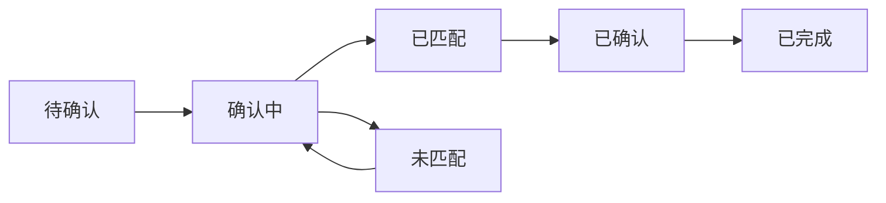
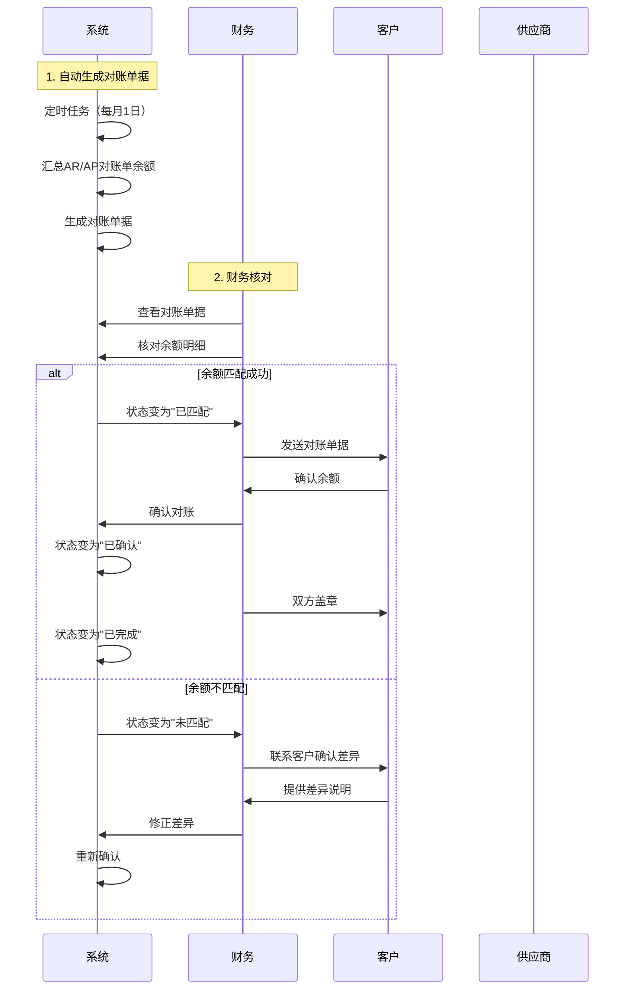

# 对账单模块 (Statement Confirmation)

## 1. 模块概述 (Module Overview)

| 属性 | 说明 |
|:---|:---|
| **模块名称** | 对账单 (Statement Confirmation) |
| **核心价值** | 实现周期性账单确认，与客户/供应商确认往来余额，生成对账单据供双方盖章 |
| **目标用户** | 财务、店长 |
| **上游模块** | AR对账单、AP对账单、渠道结算单 |
| **下游模块** | 数据报表 |

## 1.1 对账逻辑分层

本系统将对账逻辑分为两个层次：

### L1 业务核销 (Transaction Match)
* **定义**：在AR/AP中通过 `PaymentItem` 关联，实时更新余额
* **目的**：用于控制订单流程（如：款到发货）
* **特点**：
  - 实时性：每次收款/付款立即更新余额
  - 自动化：系统自动匹配单据
  - 流程控制：直接影响订单状态流转
* **示例**：
  - 客户支付1000元，AR对账单的 `received_amount` 立即增加1000元
  - 供应商付款5000元，AP对账单的 `paid_amount` 立即增加5000元

### L2 账单确认 (Statement Confirmation)
* **定义**：周期性（月结）与客户/供应商确认往来余额，生成"对账单据"供双方盖章
* **目的**：财务合规要求，定期与外部合作伙伴确认往来余额
* **特点**：
  - 周期性：按月/季度生成对账单
  - 人工确认：需要财务和对方确认
  - 审计追溯：生成盖章的对账单据作为审计凭证
* **示例**：
  - 每月1日生成上月客户对账单，汇总所有AR对账单的余额
  - 每月1日生成上月供应商对账单，汇总所有AP对账单的余额

### L1 vs L2 对比

| 维度 | L1 业务核销 | L2 账单确认 |
|:---|:---|:---|
| **触发时机** | 实时（每次收款/付款） | 周期性（月结） |
| **更新方式** | 自动更新 | 人工确认 |
| **主要目的** | 控制订单流程 | 财务合规审计 |
| **涉及单据** | 收款单/付款单 | 对账单据 |
| **余额来源** | 实时计算 | 汇总L1余额 |
| **是否需要盖章** | 否 | 是 |

## 1.2 业务场景

| 场景 | 说明 | 对账类型 | 周期 |
|:---|:---|:---|:---|
| **客户月结对账** | 每月与客户确认应收账款余额 | 客户对账 | 每月 |
| **供应商月结对账** | 每月与供应商确认应付账款余额 | 供应商对账 | 每月 |
| **渠道月结对账** | 每月与渠道确认佣金结算余额 | 渠道对账 | 每月 |
| **季度对账** | 每季度与重要客户/供应商对账 | 客户/供应商对账 | 每季度 |

## 1.3 对账单据 vs AR/AP对账单

| 维度 | 对账单据 (Statement Confirmation) | AR/AP对账单 (Statement) |
|:---|:---|:---|
| **用途** | 周期性确认往来余额 | 记录单笔订单的应收/应付 |
| **生成时机** | 月结时批量生成 | 订单完成时自动生成 |
| **包含内容** | 汇总多个AR/AP对账单 | 单个订单的明细 |
| **状态** | 待确认/已确认/已完成 | 待对账/已对账/已开票/已付款 |
| **是否需要盖章** | 是 | 否 |
| **归档要求** | 需要归档保存 | 不需要单独归档 |

## 2. 对账流程 (Statement Confirmation Process)

### 2.1 对账类型

| 类型 | 代码 | 说明 | 对账对象 |
|:---|:---|:---|:---|
| **客户对账** | `CUSTOMER` | 与客户进行周期性对账 | 客户AR对账单汇总 |
| **供应商对账** | `SUPPLIER` | 与供应商进行周期性对账 | 供应商AP对账单汇总 |
| **渠道对账** | `CHANNEL` | 与渠道进行周期性对账 | 渠道结算单汇总 |

### 2.2 对账状态流转



| 状态 | 状态码 | 说明 | 触发动作 |
|:---|:---|:---|:---|
| **待确认** | `PENDING` | 等待确认 | 系统自动生成对账单据 |
| **确认中** | `CONFIRMING` | 正在进行确认 | 财务开始确认 |
| **已匹配** | `MATCHED` | 余额匹配成功 | 双方余额一致 |
| **未匹配** | `UNMATCHED` | 余额不匹配 | 双方余额不一致 |
| **已确认** | `CONFIRMED` | 双方确认通过 | 财务和对方确认 |
| **已完成** | `COMPLETED` | 对账流程完成 | 双方盖章归档 |

### 2.3 对账流程图



## 3. 对账规则 (Statement Confirmation Rules)

### 3.1 客户对账规则

**对账依据：** 汇总客户AR对账单的余额

**对账逻辑：**
1. **自动生成**：系统每月1日自动生成上月客户对账单据
2. **汇总范围**：
   - 汇总该客户所有AR对账单
   - 只包含未完成的AR对账单（状态 ≠ COMPLETED）
   - 计算应收余额 = Σ(AR对账单.total_amount - AR对账单.received_amount)
3. **对账确认**：
   - 财务核对对账单据的余额明细
   - 与客户确认余额是否一致
   - 双方确认后盖章归档

**差异处理：**
| 差异类型 | 处理方式 | 说明 |
|:---|:---|:---|
| **余额差异** | 人工确认 | 联系客户确认差异原因，调整AR对账单 |
| **时间差异** | 自动忽略 | 对账周期内的时间差异不影响余额 |
| **汇率差异** | 按汇率规则处理 | 根据汇率配置处理差异 |

### 3.2 供应商对账规则

**对账依据：** 汇总供应商AP对账单的余额

**对账逻辑：**
1. **自动生成**：系统每月1日自动生成上月供应商对账单据
2. **汇总范围**：
   - 汇总该供应商所有AP对账单
   - 只包含未完成的AP对账单（状态 ≠ COMPLETED）
   - 计算应付余额 = Σ(AP对账单.total_amount - AP对账单.paid_amount)
3. **对账确认**：
   - 财务核对对账单据的余额明细
   - 与供应商确认余额是否一致
   - 双方确认后盖章归档

**差异处理：**
| 差异类型 | 处理方式 | 说明 |
|:---|:---|:---|
| **余额差异** | 人工确认 | 联系供应商确认差异原因，调整AP对账单 |
| **发票差异** | 按发票规则处理 | 根据发票配置处理差异 |
| **税费差异** | 按税费规则处理 | 根据税费配置处理差异 |

### 3.3 渠道对账规则

**对账依据：** 汇总渠道结算单的余额

**对账逻辑：**
1. **自动生成**：系统每月1日自动生成上月渠道对账单据
2. **汇总范围**：
   - 汇总该渠道所有结算单
   - 只包含未完成的结算单（状态 ≠ COMPLETED）
   - 计算应付佣金 = Σ(结算单.commission_amount - 结算单.paid_amount)
3. **对账确认**：
   - 财务核对对账单据的余额明细
   - 与渠道确认余额是否一致
   - 双方确认后盖章归档

**差异处理：**
| 差异类型 | 处理方式 | 说明 |
|:---|:---|:---|
| **余额差异** | 人工确认 | 联系渠道确认差异原因，调整结算单 |
| **佣金差异** | 按佣金规则处理 | 根据佣金配置处理差异 |
| **返利差异** | 按返利规则处理 | 根据返利配置处理差异 |

## 4. 对账单管理 (Statement Confirmation Management)

### 4.1 对账单列表页面

**页面路径：** 财务模块 > 对账单

**页面布局：**
```
┌─────────────────────────────────────────────────────────────────┐
│ 对账单管理                                              [新建对账]  │
├─────────────────────────────────────────────────────────────────┤
│ 筛选条件                                                         │
│ 对账类型: [全部▼]  状态: [全部▼]  日期: [2026-01-01] ~ [2026-01-31]  [查询] │
├─────────────────────────────────────────────────────────────────┤
│ 对账单列表                                                       │
│ ┌─────────────────────────────────────────────────────────────┐ │
│ │ 对账单号 | 对账类型 | 对账对象 | 对账金额 | 状态 | 操作      │ │
│ │ REC001   | 客户对账 | 张三     | 10000    | 已匹配 | [查看]   │ │
│ │ REC002   | 供应商   | 供应商A  | 5000     | 未匹配 | [查看]   │ │
│ └─────────────────────────────────────────────────────────────┘ │
└─────────────────────────────────────────────────────────────────┘
```

### 4.2 对账单详情页面

**页面路径：** 财务模块 > 对账单 > 查看详情

**页面布局：**
```
┌─────────────────────────────────────────────────────────────────┐
│ 对账单详情 - REC001                                    [返回]     │
├─────────────────────────────────────────────────────────────────┤
│ 基本信息                                                         │
│ 对账单号: REC001                                                 │
│ 对账类型: 客户对账                                               │
│ 对账对象: 张三                                                   │
│ 对账周期: 2026-01-01 ~ 2026-01-31                              │
│ 对账金额: 10000元                                               │
│ 状态: 已匹配                                                     │
│ 生成时间: 2026-02-01 10:00:00                                   │
├─────────────────────────────────────────────────────────────────┤
│ 余额明细                                                         │
│ ┌─────────────────────────────────────────────────────────────┐ │
│ │ AR对账单号 | 订单号   | 应收金额 | 已收金额 | 待收金额  │ │
│ │ AR001      | ORD001   | 10000    | 8000     | 2000     │ │
│ │ AR002      | ORD002   | 5000     | 5000     | 0        │ │
│ │ AR003      | ORD003   | 8000     | 0        | 8000     │ │
│ └─────────────────────────────────────────────────────────────┘ │
│ 合计: 应收23000元，已收13000元，待收10000元                     │
├─────────────────────────────────────────────────────────────────┤
│ 操作                                                             │
│ [确认对账] [导出对账单] [上传盖章文件]                           │
└─────────────────────────────────────────────────────────────────┘
```

### 4.3 对账操作流程

**1. 财务核对**
- 查看对账单据的余额明细
- 核对AR/AP对账单的汇总余额是否正确
- 确认对账周期是否正确

**2. 发送对账单据**
- 对账单据确认无误后，点击"导出对账单"
- 将对账单据发送给客户/供应商
- 等待对方确认

**3. 对方确认**
- 客户/供应商确认余额是否一致
- 如果一致，双方在对账单据上盖章
- 如果不一致，联系财务确认差异原因

**4. 上传盖章文件**
- 双方确认后，上传盖章的对账单据
- 系统更新对账单状态为"已确认"
- 系统自动更新对账单状态为"已完成"

**5. 归档保存**
- 对账单据自动归档
- 可随时查看历史对账单据

## 5. 技术实施建议

### 5.1 数据库层 (Drizzle Schema)

```typescript
// 对账单据表
export const statementConfirmations = pgTable('statement_confirmations', {
  id: uuid('id').defaultRandom().primaryKey(),
  confirmationNo: varchar('confirmation_no', { length: 50 }).notNull().unique(),
  confirmationType: varchar('confirmation_type', { length: 20 }).notNull(),
  targetType: varchar('target_type', { length: 20 }).notNull(),
  targetId: uuid('target_id').notNull(),
  targetName: varchar('target_name', { length: 100 }).notNull(),
  periodStart: timestamp('period_start').notNull(),
  periodEnd: timestamp('period_end').notNull(),
  totalAmount: decimal('total_amount', { precision: 12, scale: 2 }).notNull(),
  confirmedAmount: decimal('confirmed_amount', { precision: 12, scale: 2 }).notNull().default('0'),
  pendingAmount: decimal('pending_amount', { precision: 12, scale: 2 }).notNull(),
  status: varchar('status', { length: 20 }).notNull(),
  confirmedBy: uuid('confirmed_by'),
  confirmedAt: timestamp('confirmed_at'),
  completedAt: timestamp('completed_at'),
  stampFileUrl: text('stamp_file_url'),
  remark: text('remark'),
  createdAt: timestamp('created_at').defaultNow(),
});

// 对账单据明细表
export const statementConfirmationDetails = pgTable('statement_confirmation_details', {
  id: uuid('id').defaultRandom().primaryKey(),
  confirmationId: uuid('confirmation_id').notNull(),
  statementType: varchar('statement_type', { length: 50 }).notNull(),
  statementId: uuid('statement_id').notNull(),
  statementNo: varchar('statement_no', { length: 50 }).notNull(),
  totalAmount: decimal('total_amount', { precision: 12, scale: 2 }).notNull(),
  paidAmount: decimal('paid_amount', { precision: 12, scale: 2 }).notNull().default('0'),
  pendingAmount: decimal('pending_amount', { precision: 12, scale: 2 }).notNull(),
  createdAt: timestamp('created_at').defaultNow(),
});
```

### 5.2 业务逻辑层 (Server Actions)

```typescript
// 自动生成对账单据（定时任务，每月1日执行）
export async function generateStatementConfirmations(
  period: { start: Date; end: Date }
): Promise<void> {
  // 1. 生成客户对账单据
  const customers = await getActiveCustomers();
  for (const customer of customers) {
    await generateCustomerStatementConfirmation(customer.id, period);
  }

  // 2. 生成供应商对账单据
  const suppliers = await getActiveSuppliers();
  for (const supplier of suppliers) {
    await generateSupplierStatementConfirmation(supplier.id, period);
  }

  // 3. 生成渠道对账单据
  const channels = await getActiveChannels();
  for (const channel of channels) {
    await generateChannelStatementConfirmation(channel.id, period);
  }
}

// 生成客户对账单据
export async function generateCustomerStatementConfirmation(
  customerId: string,
  period: { start: Date; end: Date }
): Promise<StatementConfirmation> {
  // 获取该客户在周期内的AR对账单
  const arStatements = await getARStatementsByCustomerAndPeriod(
    customerId,
    period
  );

  // 只包含未完成的AR对账单
  const pendingStatements = arStatements.filter(
    s => s.status !== 'COMPLETED'
  );

  // 计算应收余额
  let totalAmount = 0;
  let confirmedAmount = 0;
  const details: any[] = [];

  for (const arStatement of pendingStatements) {
    const pendingAmount = arStatement.totalAmount.minus(arStatement.receivedAmount);
    totalAmount = totalAmount.plus(arStatement.totalAmount);
    confirmedAmount = confirmedAmount.plus(arStatement.receivedAmount);
    
    details.push({
      statementType: 'AR_STATEMENT',
      statementId: arStatement.id,
      statementNo: arStatement.statementNo,
      totalAmount: arStatement.totalAmount,
      paidAmount: arStatement.receivedAmount,
      pendingAmount,
    });
  }

  // 创建对账单据
  const confirmation = await db.insert(statementConfirmations).values({
    confirmationNo: generateConfirmationNo('CUST'),
    confirmationType: 'CUSTOMER',
    targetType: 'CUSTOMER',
    targetId: customerId,
    targetName: pendingStatements[0]?.customerName || '',
    periodStart: period.start,
    periodEnd: period.end,
    totalAmount,
    confirmedAmount,
    pendingAmount: totalAmount.minus(confirmedAmount),
    status: 'PENDING',
  }).returning();

  // 创建对账单据明细
  for (const detail of details) {
    await db.insert(statementConfirmationDetails).values({
      confirmationId: confirmation[0].id,
      ...detail,
    });
  }

  return confirmation[0];
}

// 生成供应商对账单据
export async function generateSupplierStatementConfirmation(
  supplierId: string,
  period: { start: Date; end: Date }
): Promise<StatementConfirmation> {
  // 获取该供应商在周期内的AP对账单
  const apStatements = await getAPStatementsBySupplierAndPeriod(
    supplierId,
    period
  );

  // 只包含未完成的AP对账单
  const pendingStatements = apStatements.filter(
    s => s.status !== 'COMPLETED'
  );

  // 计算应付余额
  let totalAmount = 0;
  let confirmedAmount = 0;
  const details: any[] = [];

  for (const apStatement of pendingStatements) {
    const pendingAmount = apStatement.totalAmount.minus(apStatement.paidAmount);
    totalAmount = totalAmount.plus(apStatement.totalAmount);
    confirmedAmount = confirmedAmount.plus(apStatement.paidAmount);
    
    details.push({
      statementType: 'AP_STATEMENT',
      statementId: apStatement.id,
      statementNo: apStatement.statementNo,
      totalAmount: apStatement.totalAmount,
      paidAmount: apStatement.paidAmount,
      pendingAmount,
    });
  }

  // 创建对账单据
  const confirmation = await db.insert(statementConfirmations).values({
    confirmationNo: generateConfirmationNo('SUPP'),
    confirmationType: 'SUPPLIER',
    targetType: 'SUPPLIER',
    targetId: supplierId,
    targetName: pendingStatements[0]?.supplierName || '',
    periodStart: period.start,
    periodEnd: period.end,
    totalAmount,
    confirmedAmount,
    pendingAmount: totalAmount.minus(confirmedAmount),
    status: 'PENDING',
  }).returning();

  // 创建对账单据明细
  for (const detail of details) {
    await db.insert(statementConfirmationDetails).values({
      confirmationId: confirmation[0].id,
      ...detail,
    });
  }

  return confirmation[0];
}

// 确认对账单据
export async function confirmStatementConfirmation(
  confirmationId: string,
  confirmedBy: string,
  stampFileUrl: string
): Promise<void> {
  const confirmation = await getStatementConfirmation(confirmationId);

  if (confirmation.status !== 'MATCHED') {
    throw new Error('只能确认余额匹配的对账单据');
  }

  // 更新对账单据状态
  await updateStatementConfirmation(confirmationId, {
    status: 'CONFIRMED',
    confirmedBy,
    confirmedAt: new Date(),
    stampFileUrl,
  });

  // 自动完成对账单据
  await completeStatementConfirmation(confirmationId);
}

// 完成对账单据
export async function completeStatementConfirmation(
  confirmationId: string
): Promise<void> {
  await updateStatementConfirmation(confirmationId, {
    status: 'COMPLETED',
    completedAt: new Date(),
  });
}

// 导出对账单据
export async function exportStatementConfirmation(
  confirmationId: string,
  format: 'PDF' | 'EXCEL'
): Promise<Buffer> {
  const confirmation = await getStatementConfirmation(confirmationId);
  const details = await getStatementConfirmationDetails(confirmationId);

  if (format === 'PDF') {
    return exportToPDF(confirmation, details);
  } else {
    return exportToExcel(confirmation, details);
  }
}
```
  reconciliationId: string
): Promise<{ matched: boolean; details: any[] }> {
  const reconciliation = await getReconciliation(reconciliationId);
  const details = await getReconciliationDetails(reconciliationId);
  
  // 更新对账单状态
  await updateReconciliationStatus(reconciliationId, 'RECONCILING');
  
  let matchedAmount = 0;
  let unmatchedAmount = 0;
  const resultDetails: any[] = [];
  
  // 根据对账类型执行对账逻辑
  switch (reconciliation.reconciliationType) {
    case 'CUSTOMER':
      const customerResult = await reconcileCustomer(details);
      matchedAmount = customerResult.matchedAmount;
      unmatchedAmount = customerResult.unmatchedAmount;
      resultDetails = customerResult.details;
      break;
    case 'SUPPLIER':
      const supplierResult = await reconcileSupplier(details);
      matchedAmount = supplierResult.matchedAmount;
      unmatchedAmount = supplierResult.unmatchedAmount;
      resultDetails = supplierResult.details;
      break;
    case 'CHANNEL':
      const channelResult = await reconcileChannel(details);
      matchedAmount = channelResult.matchedAmount;
      unmatchedAmount = channelResult.unmatchedAmount;
      resultDetails = channelResult.details;
      break;
    case 'INTERNAL':
      const internalResult = await reconcileInternal(details);
      matchedAmount = internalResult.matchedAmount;
      unmatchedAmount = internalResult.unmatchedAmount;
      resultDetails = internalResult.details;
      break;
  }
  
  // 更新对账单
  await updateReconciliation(reconciliationId, {
    matchedAmount,
    unmatchedAmount,
    status: unmatchedAmount === 0 ? 'MATCHED' : 'UNMATCHED',
    reconciledAt: new Date(),
  });
  
  // 更新对账明细
  for (const detail of resultDetails) {
    await updateReconciliationDetail(detail.id, {
      reconciliationAmount: detail.reconciliationAmount,
      difference: detail.difference,
      status: detail.status,
    });
  }
  
  return {
    matched: unmatchedAmount === 0,
    details: resultDetails,
  };
}

// 客户对账逻辑
async function reconcileCustomer(
  details: ReconciliationDetail[]
): Promise<{ matchedAmount: number; unmatchedAmount: number; details: any[] }> {
  let matchedAmount = 0;
  let unmatchedAmount = 0;
  const resultDetails: any[] = [];
  
  // 获取AR对账单和收款单
  const arStatements = details.filter(d => d.documentType === 'AR_STATEMENT');
  const paymentOrders = details.filter(d => d.documentType === 'PAYMENT_ORDER');
  
  // 匹配AR对账单和收款单
  for (const arStatement of arStatements) {
    const paymentOrder = paymentOrders.find(
      p => p.documentId === arStatement.relatedId
    );
    
    if (paymentOrder) {
      const difference = Math.abs(
        arStatement.documentAmount - paymentOrder.documentAmount
      );
      
      if (difference <= 0.01) {
        // 匹配成功
        matchedAmount += arStatement.documentAmount;
        resultDetails.push({
          id: arStatement.id,
          reconciliationAmount: arStatement.documentAmount,
          difference: 0,
          status: 'MATCHED',
        });
        resultDetails.push({
          id: paymentOrder.id,
          reconciliationAmount: paymentOrder.documentAmount,
          difference: 0,
          status: 'MATCHED',
        });
      } else {
        // 匹配失败
        unmatchedAmount += difference;
        resultDetails.push({
          id: arStatement.id,
          reconciliationAmount: paymentOrder.documentAmount,
          difference,
          status: 'UNMATCHED',
        });
        resultDetails.push({
          id: paymentOrder.id,
          reconciliationAmount: paymentOrder.documentAmount,
          difference,
          status: 'UNMATCHED',
        });
      }
    } else {
      // 没有匹配的收款单
      unmatchedAmount += arStatement.documentAmount;
      resultDetails.push({
        id: arStatement.id,
        reconciliationAmount: 0,
        difference: arStatement.documentAmount,
        status: 'UNMATCHED',
      });
    }
  }
  
  return { matchedAmount, unmatchedAmount, details: resultDetails };
}

// 确认对账
export async function confirmReconciliation(
  reconciliationId: string,
  confirmedBy: string
): Promise<void> {
  const reconciliation = await getReconciliation(reconciliationId);
  
  if (reconciliation.status !== 'MATCHED') {
    throw new Error('只能确认匹配成功的对账单');
  }
  
  // 更新对账单状态
  await updateReconciliation(reconciliationId, {
    status: 'CONFIRMED',
    confirmedBy,
    confirmedAt: new Date(),
  });
  
  // 自动完成对账
  await completeReconciliation(reconciliationId);
}

// 完成对账
export async function completeReconciliation(
  reconciliationId: string
): Promise<void> {
  await updateReconciliation(reconciliationId, {
    status: 'COMPLETED',
    completedAt: new Date(),
  });
}

// 导出对账单
export async function exportReconciliation(
  reconciliationId: string,
  format: 'PDF' | 'EXCEL'
): Promise<Buffer> {
  const reconciliation = await getReconciliation(reconciliationId);
  const details = await getReconciliationDetails(reconciliationId);
  
  if (format === 'PDF') {
    return exportToPDF(reconciliation, details);
  } else {
    return exportToExcel(reconciliation, details);
  }
}
```

### 5.3 UI 组件层

```typescript
// 对账单列表页面
export function ReconciliationListPage() {
  const [filters, setFilters] = useState({
    type: '',
    status: '',
    startDate: new Date(),
    endDate: new Date(),
  });
  const [reconciliations, setReconciliations] = useState<Reconciliation[]>([]);

  return (
    <div className="space-y-6">
      <div className="flex justify-between items-center">
        <h1 className="text-2xl font-bold">对账单管理</h1>
        <Button onClick={() => {}}>新建对账</Button>
      </div>

      <Card>
        <CardContent className="pt-6">
          <div className="grid grid-cols-4 gap-4">
            <div className="space-y-2">
              <Label>对账类型</Label>
              <Select
                value={filters.type}
                onValueChange={(value) =>
                  setFilters({ ...filters, type: value })
                }
              >
                <SelectTrigger>
                  <SelectValue placeholder="全部类型" />
                </SelectTrigger>
                <SelectContent>
                  <SelectItem value="">全部类型</SelectItem>
                  <SelectItem value="CUSTOMER">客户对账</SelectItem>
                  <SelectItem value="SUPPLIER">供应商对账</SelectItem>
                  <SelectItem value="CHANNEL">渠道对账</SelectItem>
                  <SelectItem value="INTERNAL">内部对账</SelectItem>
                </SelectContent>
              </Select>
            </div>
            <div className="space-y-2">
              <Label>状态</Label>
              <Select
                value={filters.status}
                onValueChange={(value) =>
                  setFilters({ ...filters, status: value })
                }
              >
                <SelectTrigger>
                  <SelectValue placeholder="全部状态" />
                </SelectTrigger>
                <SelectContent>
                  <SelectItem value="">全部状态</SelectItem>
                  <SelectItem value="PENDING">待对账</SelectItem>
                  <SelectItem value="RECONCILING">对账中</SelectItem>
                  <SelectItem value="MATCHED">已匹配</SelectItem>
                  <SelectItem value="UNMATCHED">未匹配</SelectItem>
                  <SelectItem value="CONFIRMED">已确认</SelectItem>
                  <SelectItem value="COMPLETED">已完成</SelectItem>
                </SelectContent>
              </Select>
            </div>
            <div className="space-y-2">
              <Label>开始日期</Label>
              <DatePicker
                value={filters.startDate}
                onChange={(value) =>
                  setFilters({ ...filters, startDate: value })
                }
              />
            </div>
            <div className="space-y-2">
              <Label>结束日期</Label>
              <DatePicker
                value={filters.endDate}
                onChange={(value) =>
                  setFilters({ ...filters, endDate: value })
                }
              />
            </div>
          </div>

          <div className="mt-4">
            <Button onClick={() => {}}>查询</Button>
          </div>
        </CardContent>
      </Card>

      <Card>
        <Table>
          <TableHeader>
            <TableRow>
              <TableHead>对账单号</TableHead>
              <TableHead>对账类型</TableHead>
              <TableHead>对账对象</TableHead>
              <TableHead>对账金额</TableHead>
              <TableHead>状态</TableHead>
              <TableHead>操作</TableHead>
            </TableRow>
          </TableHeader>
          <TableBody>
            {reconciliations.map((reconciliation) => (
              <TableRow key={reconciliation.id}>
                <TableCell>{reconciliation.reconciliationNo}</TableCell>
                <TableCell>{getReconciliationTypeLabel(reconciliation.reconciliationType)}</TableCell>
                <TableCell>{reconciliation.targetName}</TableCell>
                <TableCell>{formatCurrency(reconciliation.totalAmount)}</TableCell>
                <TableCell>
                  <Badge variant={getStatusVariant(reconciliation.status)}>
                    {getStatusLabel(reconciliation.status)}
                  </Badge>
                </TableCell>
                <TableCell>
                  <Button
                    variant="ghost"
                    size="sm"
                    onClick={() => {
                      // 查看详情
                    }}
                  >
                    查看
                  </Button>
                </TableCell>
              </TableRow>
            ))}
          </TableBody>
        </Table>
      </Card>
    </div>
  );
}

// 对账单详情页面
export function ReconciliationDetailPage({ reconciliationId }: { reconciliationId: string }) {
  const [reconciliation, setReconciliation] = useState<Reconciliation | null>(null);
  const [details, setDetails] = useState<ReconciliationDetail[]>([]);

  const handleExecuteReconciliation = async () => {
    const result = await executeReconciliation(reconciliationId);
    // 刷新页面
  };

  const handleConfirmReconciliation = async () => {
    await confirmReconciliation(reconciliationId, 'user_id');
    // 刷新页面
  };

  const handleExport = async (format: 'PDF' | 'EXCEL') => {
    const buffer = await exportReconciliation(reconciliationId, format);
    // 下载文件
  };

  return (
    <div className="space-y-6">
      <div className="flex justify-between items-center">
        <h1 className="text-2xl font-bold">
          对账单详情 - {reconciliation?.reconciliationNo}
        </h1>
        <Button variant="outline" onClick={() => {}}>
          返回
        </Button>
      </div>

      <Card>
        <CardHeader>
          <CardTitle>基本信息</CardTitle>
        </CardHeader>
        <CardContent>
          <div className="grid grid-cols-2 gap-4">
            <div>
              <Label>对账单号</Label>
              <p>{reconciliation?.reconciliationNo}</p>
            </div>
            <div>
              <Label>对账类型</Label>
              <p>{getReconciliationTypeLabel(reconciliation?.reconciliationType)}</p>
            </div>
            <div>
              <Label>对账对象</Label>
              <p>{reconciliation?.targetName}</p>
            </div>
            <div>
              <Label>对账金额</Label>
              <p>{formatCurrency(reconciliation?.totalAmount)}</p>
            </div>
            <div>
              <Label>状态</Label>
              <Badge variant={getStatusVariant(reconciliation?.status)}>
                {getStatusLabel(reconciliation?.status)}
              </Badge>
            </div>
            <div>
              <Label>对账时间</Label>
              <p>{formatDateTime(reconciliation?.reconciledAt)}</p>
            </div>
          </div>
        </CardContent>
      </Card>

      <Card>
        <CardHeader>
          <CardTitle>对账明细</CardTitle>
        </CardHeader>
        <CardContent>
          <Table>
            <TableHeader>
              <TableRow>
                <TableHead>单据类型</TableHead>
                <TableHead>单据编号</TableHead>
                <TableHead>单据金额</TableHead>
                <TableHead>对账金额</TableHead>
                <TableHead>差异</TableHead>
                <TableHead>状态</TableHead>
              </TableRow>
            </TableHeader>
            <TableBody>
              {details.map((detail) => (
                <TableRow key={detail.id}>
                  <TableCell>{getDocumentTypeLabel(detail.documentType)}</TableCell>
                  <TableCell>{detail.documentNo}</TableCell>
                  <TableCell>{formatCurrency(detail.documentAmount)}</TableCell>
                  <TableCell>{formatCurrency(detail.reconciliationAmount)}</TableCell>
                  <TableCell>{formatCurrency(detail.difference)}</TableCell>
                  <TableCell>
                    <Badge variant={getStatusVariant(detail.status)}>
                      {getStatusLabel(detail.status)}
                    </Badge>
                  </TableCell>
                </TableRow>
              ))}
            </TableBody>
          </Table>
        </CardContent>
      </Card>

      <div className="flex gap-4">
        {reconciliation?.status === 'PENDING' && (
          <Button onClick={handleExecuteReconciliation}>开始对账</Button>
        )}
        {reconciliation?.status === 'MATCHED' && (
          <Button onClick={handleConfirmReconciliation}>确认对账</Button>
        )}
        <Button
          variant="outline"
          onClick={() => handleExport('EXCEL')}
        >
          导出Excel
        </Button>
        <Button
          variant="outline"
          onClick={() => handleExport('PDF')}
        >
          导出PDF
        </Button>
      </div>
    </div>
  );
}
```
