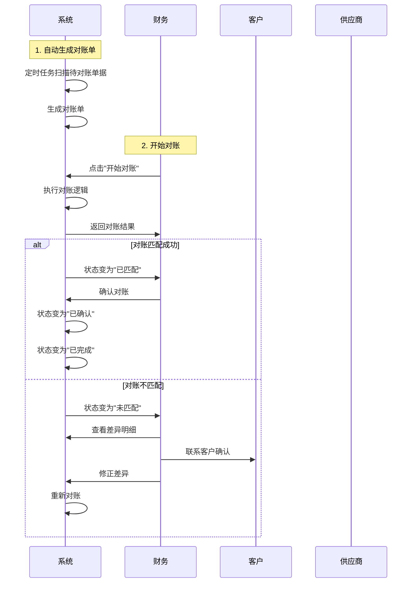

# 对账单模块 (Reconciliation)

## 1. 模块概述 (Module Overview)

| 属性 | 说明 |
|:---|:---|
| **模块名称** | 对账单 (Reconciliation) |
| **核心价值** | 实现财务对账的自动化和规范化，确保账实相符 |
| **目标用户** | 财务、店长 |
| **上游模块** | 收款单、付款单、订单 |
| **下游模块** | 数据报表 |

## 2. 对账流程 (Reconciliation Process)

### 2.1 对账类型

| 类型 | 代码 | 说明 | 对账对象 |
|:---|:---|:---|:---|
| **客户对账** | `CUSTOMER` | 与客户进行对账 | 客户AR对账单 |
| **供应商对账** | `SUPPLIER` | 与供应商进行对账 | 供应商AP对账单 |
| **渠道对账** | `CHANNEL` | 与渠道进行对账 | 渠道结算单 |
| **内部对账** | `INTERNAL` | 内部账户对账 | 财务账户流水 |

### 2.2 对账状态流转


| 状态 | 状态码 | 说明 | 触发动作 |
|:---|:---|:---|:---|
| **待对账** | `PENDING` | 等待对账 | 系统自动生成对账单 |
| **对账中** | `RECONCILING` | 正在进行对账 | 开始对账操作 |
| **已匹配** | `MATCHED` | 对账匹配成功 | 对账完成，金额一致 |
| **未匹配** | `UNMATCHED` | 对账不匹配 | 对账完成，金额不一致 |
| **已确认** | `CONFIRMED` | 对账确认通过 | 财务确认对账结果 |
| **已完成** | `COMPLETED` | 对账流程完成 | 对账确认后自动完成 |

### 2.3 对账流程图



## 3. 对账规则 (Reconciliation Rules)

### 3.1 客户对账规则

**对账依据：** AR对账单（应收账款）

**对账逻辑：**
1. **自动对账**：系统自动匹配AR对账单与收款单
2. **对账条件**：
   - AR对账单状态为"已对账"
   - 收款单状态为"已审核"
   - AR对账单的订单号与收款单的订单号一致
3. **对账结果**：
   - **匹配成功**：AR对账单的总金额 = 收款单的实收金额
   - **匹配失败**：AR对账单的总金额 ≠ 收款单的实收金额

**差异处理：**
| 差异类型 | 处理方式 | 说明 |
|:---|:---|:---|
| **金额差异** | 人工确认 | 联系客户确认差异原因 |
| **时间差异** | 自动忽略 | 收款时间与对账时间差异在允许范围内 |
| **汇率差异** | 按汇率规则处理 | 根据汇率配置处理差异 |

### 3.2 供应商对账规则

**对账依据：** AP对账单（应付账款）

**对账逻辑：**
1. **自动对账**：系统自动匹配AP对账单与付款单
2. **对账条件**：
   - AP对账单状态为"已对账"
   - 付款单状态为"已审核"
   - AP对账单的采购单号与付款单的采购单号一致
3. **对账结果**：
   - **匹配成功**：AP对账单的总金额 = 付款单的付款金额
   - **匹配失败**：AP对账单的总金额 ≠ 付款单的付款金额

**差异处理：**
| 差异类型 | 处理方式 | 说明 |
|:---|:---|:---|
| **金额差异** | 人工确认 | 联系供应商确认差异原因 |
| **发票差异** | 按发票规则处理 | 根据发票配置处理差异 |
| **税费差异** | 按税费规则处理 | 根据税费配置处理差异 |

### 3.3 渠道对账规则

**对账依据：** 渠道结算单

**对账逻辑：**
1. **自动对账**：系统自动匹配渠道结算单与订单
2. **对账条件**：
   - 订单状态为"已完成"
   - 订单关联了渠道
   - 订单的结算周期已到
3. **对账结果**：
   - **匹配成功**：渠道结算单的总金额 = 订单的总金额 × 佣金比例
   - **匹配失败**：渠道结算单的总金额 ≠ 订单的总金额 × 佣金比例

**差异处理：**
| 差异类型 | 处理方式 | 说明 |
|:---|:---|:---|
| **金额差异** | 人工确认 | 联系渠道确认差异原因 |
| **佣金差异** | 按佣金规则处理 | 根据佣金配置处理差异 |
| **返利差异** | 按返利规则处理 | 根据返利配置处理差异 |

### 3.4 内部对账规则

**对账依据：** 财务账户流水

**对账逻辑：**
1. **自动对账**：系统自动匹配账户流水与业务单据
2. **对账条件**：
   - 账户流水已生成
   - 业务单据已审核
   - 账户流水的关联单据ID与业务单据ID一致
3. **对账结果**：
   - **匹配成功**：账户流水的金额 = 业务单据的金额
   - **匹配失败**：账户流水的金额 ≠ 业务单据的金额

**差异处理：**
| 差异类型 | 处理方式 | 说明 |
|:---|:---|:---|
| **金额差异** | 人工确认 | 检查账户流水是否正确 |
| **时间差异** | 自动忽略 | 流水时间与单据时间差异在允许范围内 |
| **账户差异** | 人工确认 | 检查账户是否正确 |

## 4. 对账单管理 (Reconciliation Management)

### 4.1 对账单列表页面

**页面路径：** 财务模块 > 对账单

**页面布局：**
```
┌─────────────────────────────────────────────────────────────────┐
│ 对账单管理                                              [新建对账]  │
├─────────────────────────────────────────────────────────────────┤
│ 筛选条件                                                         │
│ 对账类型: [全部▼]  状态: [全部▼]  日期: [2026-01-01] ~ [2026-01-31]  [查询] │
├─────────────────────────────────────────────────────────────────┤
│ 对账单列表                                                       │
│ ┌─────────────────────────────────────────────────────────────┐ │
│ │ 对账单号 | 对账类型 | 对账对象 | 对账金额 | 状态 | 操作      │ │
│ │ REC001   | 客户对账 | 张三     | 10000    | 已匹配 | [查看]   │ │
│ │ REC002   | 供应商   | 供应商A  | 5000     | 未匹配 | [查看]   │ │
│ └─────────────────────────────────────────────────────────────┘ │
└─────────────────────────────────────────────────────────────────┘
```

### 4.2 对账单详情页面

**页面路径：** 财务模块 > 对账单 > 查看详情

**页面布局：**
```
┌─────────────────────────────────────────────────────────────────┐
│ 对账单详情 - REC001                                    [返回]     │
├─────────────────────────────────────────────────────────────────┤
│ 基本信息                                                         │
│ 对账单号: REC001                                                 │
│ 对账类型: 客户对账                                               │
│ 对账对象: 张三                                                   │
│ 对账金额: 10000元                                               │
│ 状态: 已匹配                                                     │
│ 对账时间: 2026-01-15 10:00:00                                   │
├─────────────────────────────────────────────────────────────────┤
│ 对账明细                                                         │
│ ┌─────────────────────────────────────────────────────────────┐ │
│ │ 单据类型 | 单据编号   | 单据金额 | 对账金额 | 差异   | 状态  │ │
│ │ AR对账单 | AR001      | 10000    | 10000    | 0      | 匹配  │ │
│ │ 收款单   | PY001      | 10000    | 10000    | 0      | 匹配  │ │
│ └─────────────────────────────────────────────────────────────┘ │
├─────────────────────────────────────────────────────────────────┤
│ 操作                                                             │
│ [重新对账] [确认对账] [导出对账单]                               │
└─────────────────────────────────────────────────────────────────┘
```

### 4.3 对账操作流程

**1. 开始对账**
- 点击"开始对账"按钮
- 系统执行对账逻辑
- 返回对账结果

**2. 查看差异明细**
- 如果对账不匹配，点击"查看差异明细"
- 查看具体的差异项
- 分析差异原因

**3. 修正差异**
- 根据差异原因，修正相关单据
- 重新执行对账

**4. 确认对账**
- 对账匹配成功后，点击"确认对账"
- 系统更新对账单状态为"已确认"
- 系统自动更新对账单状态为"已完成"

## 5. 技术实施建议

### 5.1 数据库层 (Drizzle Schema)

```typescript
// 对账单表
export const reconciliations = pgTable('reconciliations', {
  id: uuid('id').defaultRandom().primaryKey(),
  reconciliationNo: varchar('reconciliation_no', { length: 50 }).notNull().unique(),
  reconciliationType: varchar('reconciliation_type', { length: 20 }).notNull(),
  targetType: varchar('target_type', { length: 20 }).notNull(),
  targetId: uuid('target_id').notNull(),
  targetName: varchar('target_name', { length: 100 }).notNull(),
  totalAmount: decimal('total_amount', { precision: 12, scale: 2 }).notNull(),
  matchedAmount: decimal('matched_amount', { precision: 12, scale: 2 }).notNull().default('0'),
  unmatchedAmount: decimal('unmatched_amount', { precision: 12, scale: 2 }).notNull().default('0'),
  status: varchar('status', { length: 20 }).notNull(),
  reconciledAt: timestamp('reconciled_at'),
  confirmedBy: uuid('confirmed_by'),
  confirmedAt: timestamp('confirmed_at'),
  completedAt: timestamp('completed_at'),
  remark: text('remark'),
  createdAt: timestamp('created_at').defaultNow(),
});

// 对账明细表
export const reconciliationDetails = pgTable('reconciliation_details', {
  id: uuid('id').defaultRandom().primaryKey(),
  reconciliationId: uuid('reconciliation_id').notNull(),
  documentType: varchar('document_type', { length: 50 }).notNull(),
  documentId: uuid('document_id').notNull(),
  documentNo: varchar('document_no', { length: 50 }).notNull(),
  documentAmount: decimal('document_amount', { precision: 12, scale: 2 }).notNull(),
  reconciliationAmount: decimal('reconciliation_amount', { precision: 12, scale: 2 }).notNull(),
  difference: decimal('difference', { precision: 12, scale: 2 }).notNull(),
  status: varchar('status', { length: 20 }).notNull(),
  remark: text('remark'),
  createdAt: timestamp('created_at').defaultNow(),
});
```

### 5.2 业务逻辑层 (Server Actions)

```typescript
// 自动生成对账单
export async function generateReconciliation(
  type: 'CUSTOMER' | 'SUPPLIER' | 'CHANNEL' | 'INTERNAL',
  targetId: string
): Promise<void> {
  let documents: any[] = [];
  
  // 根据对账类型获取相关单据
  switch (type) {
    case 'CUSTOMER':
      documents = await getCustomerReconciliationDocuments(targetId);
      break;
    case 'SUPPLIER':
      documents = await getSupplierReconciliationDocuments(targetId);
      break;
    case 'CHANNEL':
      documents = await getChannelReconciliationDocuments(targetId);
      break;
    case 'INTERNAL':
      documents = await getInternalReconciliationDocuments(targetId);
      break;
  }
  
  // 计算对账金额
  const totalAmount = documents.reduce((sum, doc) => sum + doc.amount, 0);
  
  // 创建对账单
  const reconciliation = await createReconciliation({
    reconciliationNo: generateReconciliationNo(),
    reconciliationType: type,
    targetType: getTargetType(type),
    targetId,
    targetName: getTargetName(type, targetId),
    totalAmount,
    matchedAmount: 0,
    unmatchedAmount: totalAmount,
    status: 'PENDING',
  });
  
  // 创建对账明细
  for (const doc of documents) {
    await createReconciliationDetail({
      reconciliationId: reconciliation.id,
      documentType: doc.type,
      documentId: doc.id,
      documentNo: doc.no,
      documentAmount: doc.amount,
      reconciliationAmount: 0,
      difference: doc.amount,
      status: 'PENDING',
    });
  }
}

// 执行对账
export async function executeReconciliation(
  reconciliationId: string
): Promise<{ matched: boolean; details: any[] }> {
  const reconciliation = await getReconciliation(reconciliationId);
  const details = await getReconciliationDetails(reconciliationId);
  
  // 更新对账单状态
  await updateReconciliationStatus(reconciliationId, 'RECONCILING');
  
  let matchedAmount = 0;
  let unmatchedAmount = 0;
  const resultDetails: any[] = [];
  
  // 根据对账类型执行对账逻辑
  switch (reconciliation.reconciliationType) {
    case 'CUSTOMER':
      const customerResult = await reconcileCustomer(details);
      matchedAmount = customerResult.matchedAmount;
      unmatchedAmount = customerResult.unmatchedAmount;
      resultDetails = customerResult.details;
      break;
    case 'SUPPLIER':
      const supplierResult = await reconcileSupplier(details);
      matchedAmount = supplierResult.matchedAmount;
      unmatchedAmount = supplierResult.unmatchedAmount;
      resultDetails = supplierResult.details;
      break;
    case 'CHANNEL':
      const channelResult = await reconcileChannel(details);
      matchedAmount = channelResult.matchedAmount;
      unmatchedAmount = channelResult.unmatchedAmount;
      resultDetails = channelResult.details;
      break;
    case 'INTERNAL':
      const internalResult = await reconcileInternal(details);
      matchedAmount = internalResult.matchedAmount;
      unmatchedAmount = internalResult.unmatchedAmount;
      resultDetails = internalResult.details;
      break;
  }
  
  // 更新对账单
  await updateReconciliation(reconciliationId, {
    matchedAmount,
    unmatchedAmount,
    status: unmatchedAmount === 0 ? 'MATCHED' : 'UNMATCHED',
    reconciledAt: new Date(),
  });
  
  // 更新对账明细
  for (const detail of resultDetails) {
    await updateReconciliationDetail(detail.id, {
      reconciliationAmount: detail.reconciliationAmount,
      difference: detail.difference,
      status: detail.status,
    });
  }
  
  return {
    matched: unmatchedAmount === 0,
    details: resultDetails,
  };
}

// 客户对账逻辑
async function reconcileCustomer(
  details: ReconciliationDetail[]
): Promise<{ matchedAmount: number; unmatchedAmount: number; details: any[] }> {
  let matchedAmount = 0;
  let unmatchedAmount = 0;
  const resultDetails: any[] = [];
  
  // 获取AR对账单和收款单
  const arStatements = details.filter(d => d.documentType === 'AR_STATEMENT');
  const paymentOrders = details.filter(d => d.documentType === 'PAYMENT_ORDER');
  
  // 匹配AR对账单和收款单
  for (const arStatement of arStatements) {
    const paymentOrder = paymentOrders.find(
      p => p.documentId === arStatement.relatedId
    );
    
    if (paymentOrder) {
      const difference = Math.abs(
        arStatement.documentAmount - paymentOrder.documentAmount
      );
      
      if (difference <= 0.01) {
        // 匹配成功
        matchedAmount += arStatement.documentAmount;
        resultDetails.push({
          id: arStatement.id,
          reconciliationAmount: arStatement.documentAmount,
          difference: 0,
          status: 'MATCHED',
        });
        resultDetails.push({
          id: paymentOrder.id,
          reconciliationAmount: paymentOrder.documentAmount,
          difference: 0,
          status: 'MATCHED',
        });
      } else {
        // 匹配失败
        unmatchedAmount += difference;
        resultDetails.push({
          id: arStatement.id,
          reconciliationAmount: paymentOrder.documentAmount,
          difference,
          status: 'UNMATCHED',
        });
        resultDetails.push({
          id: paymentOrder.id,
          reconciliationAmount: paymentOrder.documentAmount,
          difference,
          status: 'UNMATCHED',
        });
      }
    } else {
      // 没有匹配的收款单
      unmatchedAmount += arStatement.documentAmount;
      resultDetails.push({
        id: arStatement.id,
        reconciliationAmount: 0,
        difference: arStatement.documentAmount,
        status: 'UNMATCHED',
      });
    }
  }
  
  return { matchedAmount, unmatchedAmount, details: resultDetails };
}

// 确认对账
export async function confirmReconciliation(
  reconciliationId: string,
  confirmedBy: string
): Promise<void> {
  const reconciliation = await getReconciliation(reconciliationId);
  
  if (reconciliation.status !== 'MATCHED') {
    throw new Error('只能确认匹配成功的对账单');
  }
  
  // 更新对账单状态
  await updateReconciliation(reconciliationId, {
    status: 'CONFIRMED',
    confirmedBy,
    confirmedAt: new Date(),
  });
  
  // 自动完成对账
  await completeReconciliation(reconciliationId);
}

// 完成对账
export async function completeReconciliation(
  reconciliationId: string
): Promise<void> {
  await updateReconciliation(reconciliationId, {
    status: 'COMPLETED',
    completedAt: new Date(),
  });
}

// 导出对账单
export async function exportReconciliation(
  reconciliationId: string,
  format: 'PDF' | 'EXCEL'
): Promise<Buffer> {
  const reconciliation = await getReconciliation(reconciliationId);
  const details = await getReconciliationDetails(reconciliationId);
  
  if (format === 'PDF') {
    return exportToPDF(reconciliation, details);
  } else {
    return exportToExcel(reconciliation, details);
  }
}
```

### 5.3 UI 组件层

```typescript
// 对账单列表页面
export function ReconciliationListPage() {
  const [filters, setFilters] = useState({
    type: '',
    status: '',
    startDate: new Date(),
    endDate: new Date(),
  });
  const [reconciliations, setReconciliations] = useState<Reconciliation[]>([]);

  return (
    <div className="space-y-6">
      <div className="flex justify-between items-center">
        <h1 className="text-2xl font-bold">对账单管理</h1>
        <Button onClick={() => {}}>新建对账</Button>
      </div>

      <Card>
        <CardContent className="pt-6">
          <div className="grid grid-cols-4 gap-4">
            <div className="space-y-2">
              <Label>对账类型</Label>
              <Select
                value={filters.type}
                onValueChange={(value) =>
                  setFilters({ ...filters, type: value })
                }
              >
                <SelectTrigger>
                  <SelectValue placeholder="全部类型" />
                </SelectTrigger>
                <SelectContent>
                  <SelectItem value="">全部类型</SelectItem>
                  <SelectItem value="CUSTOMER">客户对账</SelectItem>
                  <SelectItem value="SUPPLIER">供应商对账</SelectItem>
                  <SelectItem value="CHANNEL">渠道对账</SelectItem>
                  <SelectItem value="INTERNAL">内部对账</SelectItem>
                </SelectContent>
              </Select>
            </div>
            <div className="space-y-2">
              <Label>状态</Label>
              <Select
                value={filters.status}
                onValueChange={(value) =>
                  setFilters({ ...filters, status: value })
                }
              >
                <SelectTrigger>
                  <SelectValue placeholder="全部状态" />
                </SelectTrigger>
                <SelectContent>
                  <SelectItem value="">全部状态</SelectItem>
                  <SelectItem value="PENDING">待对账</SelectItem>
                  <SelectItem value="RECONCILING">对账中</SelectItem>
                  <SelectItem value="MATCHED">已匹配</SelectItem>
                  <SelectItem value="UNMATCHED">未匹配</SelectItem>
                  <SelectItem value="CONFIRMED">已确认</SelectItem>
                  <SelectItem value="COMPLETED">已完成</SelectItem>
                </SelectContent>
              </Select>
            </div>
            <div className="space-y-2">
              <Label>开始日期</Label>
              <DatePicker
                value={filters.startDate}
                onChange={(value) =>
                  setFilters({ ...filters, startDate: value })
                }
              />
            </div>
            <div className="space-y-2">
              <Label>结束日期</Label>
              <DatePicker
                value={filters.endDate}
                onChange={(value) =>
                  setFilters({ ...filters, endDate: value })
                }
              />
            </div>
          </div>

          <div className="mt-4">
            <Button onClick={() => {}}>查询</Button>
          </div>
        </CardContent>
      </Card>

      <Card>
        <Table>
          <TableHeader>
            <TableRow>
              <TableHead>对账单号</TableHead>
              <TableHead>对账类型</TableHead>
              <TableHead>对账对象</TableHead>
              <TableHead>对账金额</TableHead>
              <TableHead>状态</TableHead>
              <TableHead>操作</TableHead>
            </TableRow>
          </TableHeader>
          <TableBody>
            {reconciliations.map((reconciliation) => (
              <TableRow key={reconciliation.id}>
                <TableCell>{reconciliation.reconciliationNo}</TableCell>
                <TableCell>{getReconciliationTypeLabel(reconciliation.reconciliationType)}</TableCell>
                <TableCell>{reconciliation.targetName}</TableCell>
                <TableCell>{formatCurrency(reconciliation.totalAmount)}</TableCell>
                <TableCell>
                  <Badge variant={getStatusVariant(reconciliation.status)}>
                    {getStatusLabel(reconciliation.status)}
                  </Badge>
                </TableCell>
                <TableCell>
                  <Button
                    variant="ghost"
                    size="sm"
                    onClick={() => {
                      // 查看详情
                    }}
                  >
                    查看
                  </Button>
                </TableCell>
              </TableRow>
            ))}
          </TableBody>
        </Table>
      </Card>
    </div>
  );
}

// 对账单详情页面
export function ReconciliationDetailPage({ reconciliationId }: { reconciliationId: string }) {
  const [reconciliation, setReconciliation] = useState<Reconciliation | null>(null);
  const [details, setDetails] = useState<ReconciliationDetail[]>([]);

  const handleExecuteReconciliation = async () => {
    const result = await executeReconciliation(reconciliationId);
    // 刷新页面
  };

  const handleConfirmReconciliation = async () => {
    await confirmReconciliation(reconciliationId, 'user_id');
    // 刷新页面
  };

  const handleExport = async (format: 'PDF' | 'EXCEL') => {
    const buffer = await exportReconciliation(reconciliationId, format);
    // 下载文件
  };

  return (
    <div className="space-y-6">
      <div className="flex justify-between items-center">
        <h1 className="text-2xl font-bold">
          对账单详情 - {reconciliation?.reconciliationNo}
        </h1>
        <Button variant="outline" onClick={() => {}}>
          返回
        </Button>
      </div>

      <Card>
        <CardHeader>
          <CardTitle>基本信息</CardTitle>
        </CardHeader>
        <CardContent>
          <div className="grid grid-cols-2 gap-4">
            <div>
              <Label>对账单号</Label>
              <p>{reconciliation?.reconciliationNo}</p>
            </div>
            <div>
              <Label>对账类型</Label>
              <p>{getReconciliationTypeLabel(reconciliation?.reconciliationType)}</p>
            </div>
            <div>
              <Label>对账对象</Label>
              <p>{reconciliation?.targetName}</p>
            </div>
            <div>
              <Label>对账金额</Label>
              <p>{formatCurrency(reconciliation?.totalAmount)}</p>
            </div>
            <div>
              <Label>状态</Label>
              <Badge variant={getStatusVariant(reconciliation?.status)}>
                {getStatusLabel(reconciliation?.status)}
              </Badge>
            </div>
            <div>
              <Label>对账时间</Label>
              <p>{formatDateTime(reconciliation?.reconciledAt)}</p>
            </div>
          </div>
        </CardContent>
      </Card>

      <Card>
        <CardHeader>
          <CardTitle>对账明细</CardTitle>
        </CardHeader>
        <CardContent>
          <Table>
            <TableHeader>
              <TableRow>
                <TableHead>单据类型</TableHead>
                <TableHead>单据编号</TableHead>
                <TableHead>单据金额</TableHead>
                <TableHead>对账金额</TableHead>
                <TableHead>差异</TableHead>
                <TableHead>状态</TableHead>
              </TableRow>
            </TableHeader>
            <TableBody>
              {details.map((detail) => (
                <TableRow key={detail.id}>
                  <TableCell>{getDocumentTypeLabel(detail.documentType)}</TableCell>
                  <TableCell>{detail.documentNo}</TableCell>
                  <TableCell>{formatCurrency(detail.documentAmount)}</TableCell>
                  <TableCell>{formatCurrency(detail.reconciliationAmount)}</TableCell>
                  <TableCell>{formatCurrency(detail.difference)}</TableCell>
                  <TableCell>
                    <Badge variant={getStatusVariant(detail.status)}>
                      {getStatusLabel(detail.status)}
                    </Badge>
                  </TableCell>
                </TableRow>
              ))}
            </TableBody>
          </Table>
        </CardContent>
      </Card>

      <div className="flex gap-4">
        {reconciliation?.status === 'PENDING' && (
          <Button onClick={handleExecuteReconciliation}>开始对账</Button>
        )}
        {reconciliation?.status === 'MATCHED' && (
          <Button onClick={handleConfirmReconciliation}>确认对账</Button>
        )}
        <Button
          variant="outline"
          onClick={() => handleExport('EXCEL')}
        >
          导出Excel
        </Button>
        <Button
          variant="outline"
          onClick={() => handleExport('PDF')}
        >
          导出PDF
        </Button>
      </div>
    </div>
  );
}
```
