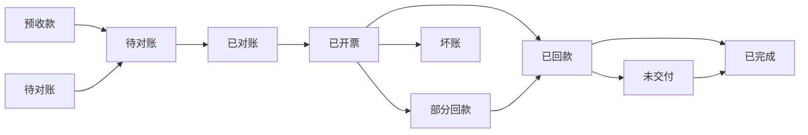
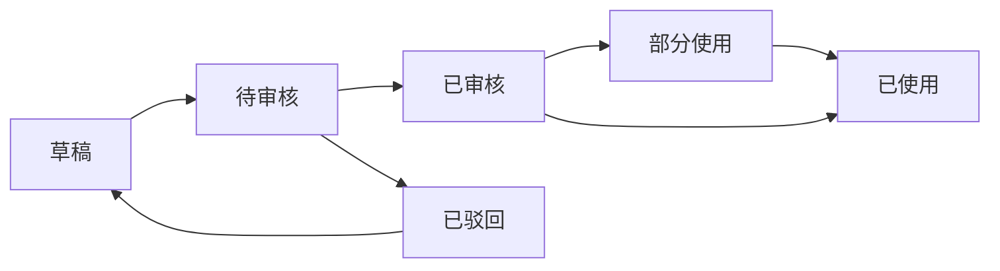
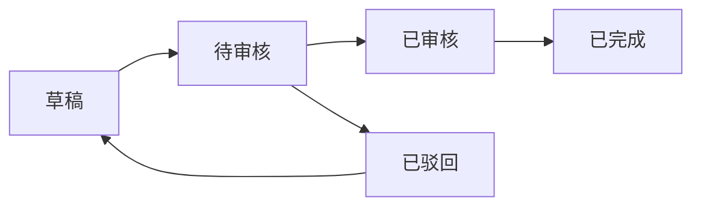
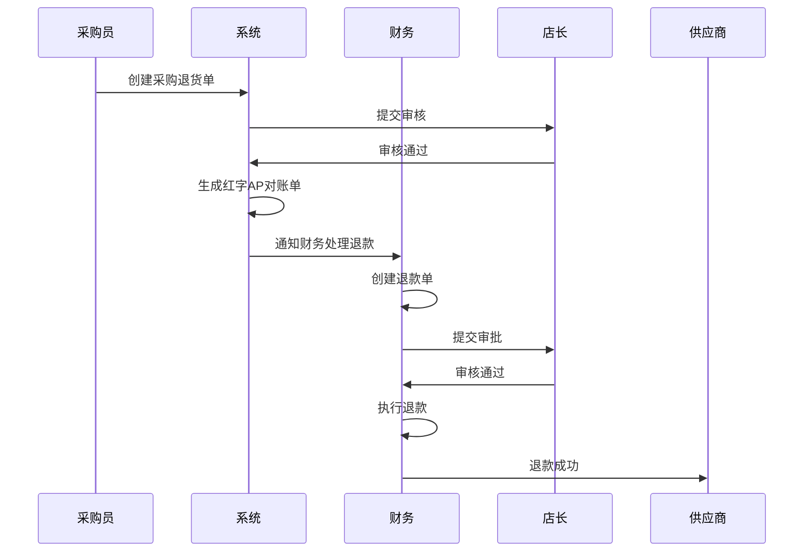

# 收款单模块 (Payment Order)

## 1. 模块概述 (Module Overview)

| 属性         | 说明                                 |
| :----------- | :----------------------------------- |
| **模块名称** | 收款单 (Payment Order)               |
| **核心价值** | 管理客户收款流程，实现资金流入的闭环 |
| **目标用户** | 财务、销售、店长                     |
| **上游模块** | 订单、渠道                           |
| **下游模块** | 对账单、佣金结算                     |

## 2. 销售对账单 (AR Statement)

### 2.1 状态流转



| 状态         | 状态码            | 说明                   | 触发动作                  |
| :----------- | :---------------- | :--------------------- | :------------------------ |
| **预收款**   | `PREPAID`         | 先收款后下单场景       | 财务手动创建，无订单关联  |
| **待对账**   | `PENDING_RECON`   | 等待核对金额           | 订单完成时自动生成        |
| **已对账**   | `RECONCILED`      | 金额核对通过，可开票   | 财务确认对账              |
| **已开票**   | `INVOICED`        | 发票已开，等待收款     | 财务录入发票信息          |
| **部分回款** | `PARTIAL`         | 已收部分款项           | 录入部分到账              |
| **已回款**   | `PAID`            | 全部收齐，待交付验收   | 最后一笔到账确认          |
| **未交付**   | `PENDING_DELIVER` | 已收款但未完成安装交付 | 收款完成但订单未COMPLETED |
| **已完成**   | `COMPLETED`       | 回款+交付均完成        | 订单状态变为COMPLETED     |
| **坏账**     | `BAD_DEBT`        | 无法回收               | 店长审批核销              |

### 2.2 核心字段 (ar_statements)

| 字段名            | 类型     | 必填 | 说明                                  |
| :---------------- | :------- | :--- | :------------------------------------ |
| id                | UUID     | ✓    | 主键                                  |
| statement_no      | String   | ✓    | 对账单号 (AR20260101001)              |
| order_id          | UUID     | ✓    | 关联订单                              |
| customer_id       | UUID     | ✓    | 关联客户                              |
| customer_name     | String   | ✓    | 客户姓名 (冗余)                       |
| settlement_type   | Enum     | ✓    | 结算方式 (PREPAID/CREDIT/CASH)        |
| total_amount      | Decimal  | ✓    | 应收总额                              |
| received_amount   | Decimal  | ✓    | 已收金额                              |
| pending_amount    | Decimal  | ✓    | 待收金额                              |
| status            | Enum     | ✓    | 状态                                  |
| invoice_no        | String   | -    | 发票号                                |
| invoiced_at       | DateTime | -    | 开票时间                              |
| tax_rate          | Decimal  | -    | 税率（如 0.13 表示13%）               |
| tax_amount        | Decimal  | -    | 税额                                  |
| is_tax_inclusive  | Boolean  | -    | 是否含税（true=含税价，false=未税价） |
| completed_at      | DateTime | -    | 完成时间                              |
| sales_id          | UUID     | ✓    | 归属销售                              |
| channel_id        | UUID     | -    | 关联渠道（设计师/装修公司）           |
| commission_rate   | Decimal  | -    | 佣金比例                              |
| commission_amount | Decimal  | -    | 佣金金额                              |
| commission_status | Enum     | -    | 佣金状态 (PENDING/CALCULATED/PAID)    |
| created_at        | DateTime | ✓    | 创建时间                              |

### 2.3 收款计划表 (payment_schedules)

| 字段名        | 类型     | 必填 | 说明                 |
| :------------ | :------- | :--- | :------------------- |
| id            | UUID     | ✓    | 主键                 |
| statement_id  | UUID     | ✓    | 关联对账单           |
| order_id      | UUID     | ✓    | 关联订单             |
| name          | String   | ✓    | 节点名称 (定金/尾款) |
| amount        | Decimal  | ✓    | 应收金额             |
| expected_date | Date     | -    | 预计收款日           |
| actual_date   | Date     | -    | 实际收款日           |
| status        | Enum     | ✓    | PENDING/PAID         |
| proof_url     | String   | -    | 收款凭证             |
| remark        | String   | -    | 备注                 |
| created_at    | DateTime | ✓    | 创建时间             |

### 2.4 收款记录表 (payment_records)

| 字段名         | 类型     | 必填 | 说明                                      |
| :------------- | :------- | :--- | :---------------------------------------- |
| id             | UUID     | ✓    | 主键                                      |
| statement_id   | UUID     | ✓    | 关联对账单                                |
| order_id       | UUID     | ✓    | 关联订单                                  |
| schedule_id    | UUID     | -    | 关联计划节点                              |
| amount         | Decimal  | ✓    | 收款金额                                  |
| payment_method | Enum     | ✓    | 支付方式 (CASH/WECHAT/ALIPAY/BANK)        |
| proof_url      | String   | ✓    | 收款凭证 (必填)                           |
| received_at    | DateTime | ✓    | 到账时间                                  |
| recorded_by    | UUID     | ✓    | 记录人                                    |
| remark         | String   | -    | 备注                                      |
| source_type    | Enum     | ✓    | 收款来源 (ORDER_CONVERSION/MANUAL/REFUND) |
| source_id      | UUID     | -    | 来源单据ID (订单转化时关联订单ID)         |
| is_verified    | Boolean  | ✓    | 是否已审核 (默认false)                    |
| verified_by    | UUID     | -    | 审核人                                    |
| verified_at    | DateTime | -    | 审核时间                                  |

### 2.5 提醒规则

| 提醒类型     | 触发条件               | 通知对象  | 渠道      |
| :----------- | :--------------------- | :-------- | :-------- |
| **到期提醒** | 距预计日 ≤ 3天 且 未收 | 销售      | 系统      |
| **逾期提醒** | 超预计日 1天           | 销售      | 系统+飞书 |
| **逾期升级** | 超预计日 7天           | 销售+店长 | 系统+飞书 |
| **周汇总**   | 每周一 9:00            | 财务+店长 | 飞书      |

## 3. 收款单 (Payment Order)

### 3.1 业务场景

收款单是管理客户收款的核心单据，支持两种类型：

| 类型         | 代码      | 说明                             |
| :----------- | :-------- | :------------------------------- |
| **预收款**   | `PREPAID` | 先收款后下单，相当于定金         |
| **普通收款** | `NORMAL`  | 订单收款，支持部分收款、多次收款 |

**典型场景：**

1. **预收款场景：**
   - 客户先支付定金，但尚未确定具体订单
   - 财务创建预收款单，录入客户信息和收款金额
   - 确认后自动创建客户档案（如果客户不存在）
   - 后续订单转化时自动关联此预收款

2. **普通收款场景：**
   - 客户下单后，分阶段支付款项（定金+尾款）
   - 客户未付款或只付了部分款，需要后续收款
   - 支持一个收款单关联一个或多个订单
   - 支持多次收款，每次收款可关联不同订单

### 3.2 状态流转



| 状态         | 状态码         | 说明             | 触发动作                   |
| :----------- | :------------- | :--------------- | :------------------------- |
| **草稿**     | `DRAFT`        | 编辑中           | 创建时默认状态             |
| **待审核**   | `PENDING`      | 提交待审核       | 销售提交收款单             |
| **已审核**   | `VERIFIED`     | 审核通过，可使用 | 店长审核通过               |
| **已驳回**   | `REJECTED`     | 审核不通过       | 店长驳回，需修改后重新提交 |
| **部分使用** | `PARTIAL_USED` | 已部分关联订单   | 关联订单但金额未用完       |
| **已使用**   | `FULLY_USED`   | 金额已全部使用   | 收款金额已全部关联到订单   |

### 3.3 核心字段 (payment_orders)

| 字段名           | 类型     | 必填 | 说明                               |
| :--------------- | :------- | :--- | :--------------------------------- |
| id               | UUID     | ✓    | 主键                               |
| payment_no       | String   | ✓    | 收款单号 (PY20260101001)           |
| type             | Enum     | ✓    | 类型 (PREPAID/NORMAL)              |
| customer_id      | UUID     | -    | 关联客户（预收款必填）             |
| customer_name    | String   | ✓    | 客户姓名（冗余）                   |
| customer_phone   | String   | ✓    | 客户电话（冗余）                   |
| total_amount     | Decimal  | ✓    | 收款总额                           |
| used_amount      | Decimal  | ✓    | 已使用金额                         |
| remaining_amount | Decimal  | ✓    | 剩余可用金额                       |
| status           | Enum     | ✓    | 状态                               |
| payment_method   | Enum     | ✓    | 支付方式 (CASH/WECHAT/ALIPAY/BANK) |
| account_id       | UUID     | -    | 关联收款账户（财务账户表）         |
| proof_url        | String   | ✓    | 收款凭证（必填）                   |
| received_at      | DateTime | ✓    | 到账时间                           |
| remark           | String   | -    | 备注                               |
| created_by       | UUID     | ✓    | 创建人                             |
| verified_by      | UUID     | -    | 审核人                             |
| verified_at      | DateTime | -    | 审核时间                           |
| created_at       | DateTime | ✓    | 创建时间                           |
| updated_at       | DateTime | ✓    | 更新时间                           |

### 3.4 收款单-订单关联表 (payment_order_items)

| 字段名     | 类型     | 必填 | 说明           |
| :--------- | :------- | :--- | :------------- |
| id         | UUID     | ✓    | 主键           |
| payment_id | UUID     | ✓    | 关联收款单     |
| order_id   | UUID     | ✓    | 关联订单       |
| order_no   | String   | ✓    | 订单号（冗余） |
| amount     | Decimal  | ✓    | 关联金额       |
| created_at | DateTime | ✓    | 创建时间       |

### 3.5 收款单创建规则

#### 3.5.1 预收款创建流程

**创建入口：**

- 财务模块 > 收款单管理 > 新建收款单
- 选择类型：预收款

**创建表单：**
| 字段 | 组件 | 必填 | 说明 |
|:---|:---|:---|:---|
| 客户姓名 | `Input` | ✓ | 输入客户姓名 |
| 客户电话 | `Input` | ✓ | 输入客户电话 |
| 收款金额 | `InputNumber` | ✓ | 输入收款金额 |
| 支付方式 | `Select` | ✓ | 现金/微信/支付宝/银行转账 |
| 收款账户 | `Select` | - | 选择收款账户（多账户支持） |
| 收款凭证 | `Upload` | ✓ | 上传收款凭证图片 |
| 到账时间 | `DatePicker` | ✓ | 默认当前时间 |
| 备注 | `TextArea` | - | 填写备注信息 |

**创建逻辑：**

1. 销售填写收款单信息，状态为 `DRAFT`
2. 提交后状态变为 `PENDING`，等待店长审核
3. 店长审核通过后：
   - 状态变为 `VERIFIED`
   - 系统自动检查客户是否存在
   - 如果客户不存在，自动创建客户档案
   - 如果客户存在，关联已有客户
4. 店长驳回后：
   - 状态变为 `REJECTED`
   - 销售需修改后重新提交

#### 3.5.2 普通收款创建流程

**创建入口：**

- 财务模块 > 收款单管理 > 新建收款单
- 选择类型：普通收款

**创建表单：**
| 字段 | 组件 | 必填 | 说明 |
|:---|:---|:---|:---|
| 客户 | `Select` | ✓ | 选择已有客户 |
| 关联订单 | `MultiSelect` | ✓ | 选择一个或多个订单 |
| 收款金额 | `InputNumber` | ✓ | 输入收款金额 |
| 支付方式 | `Select` | ✓ | 现金/微信/支付宝/银行转账 |
| 收款账户 | `Select` | - | 选择收款账户（多账户支持） |
| 收款凭证 | `Upload` | ✓ | 上传收款凭证图片 |
| 到账时间 | `DatePicker` | ✓ | 默认当前时间 |
| 备注 | `TextArea` | - | 填写备注信息 |

**创建逻辑：**

1. 销售选择客户和订单
2. 系统自动计算订单的待收金额
3. 销售输入收款金额，不能超过订单待收金额总和
4. 提交后状态变为 `PENDING`，等待店长审核
5. 店长审核通过后：
   - 状态变为 `VERIFIED`
   - 自动创建 `payment_order_items` 记录，关联到选择的订单
   - 更新 AR 对账单的收款记录
   - 更新订单的已收金额
6. 如果收款金额小于订单待收金额总和：
   - 状态变为 `PARTIAL_USED`
   - 剩余金额可后续继续收款

### 3.6 收款单与订单关联规则

**一个收款单关联一个订单：**

- 直接在创建收款单时选择订单
- 收款金额自动关联到该订单
- 更新订单的 `paid_amount` 字段

**一个收款单关联多个订单：**

- 创建收款单时选择多个订单
- 需要手动分配每个订单的关联金额
- 关联金额总和不能超过收款总额
- 更新每个订单的 `paid_amount` 字段

**多次收款关联同一个订单：**

- 可以创建多个收款单，都关联到同一个订单
- 每次收款都创建独立的收款单

## 4. 供应商退款 (Supplier Refund)

### 4.1 业务场景

供应商退款是指因采购退货、供应商多收等原因，供应商需要向公司退还已付款项的业务场景。

| 场景               | 说明                             | 触发条件       |
| :----------------- | :------------------------------- | :------------- |
| **采购退货退款**   | 采购退货后，供应商退还已付的款项 | 采购单退货完成 |
| **供应商多收退款** | 供应商多收了款项，需要退还       | 财务确认多收   |

### 4.2 退款类型

供应商退款是**收款单 (Payment Order)** 的一种特殊类型。

| 类型           | 代码                   | 说明         |
| :------------- | :--------------------- | :----------- |
| **预收款**     | `PREPAID`              | 先收款后下单 |
| **普通收款**   | `NORMAL`               | 订单收款     |
| **供应商退款** | `REFUND_FROM_SUPPLIER` | 供应商退款   |

### 4.3 状态流转



| 状态       | 状态码      | 说明               | 触发动作                   |
| :--------- | :---------- | :----------------- | :------------------------- |
| **草稿**   | `DRAFT`     | 编辑中             | 创建时默认状态             |
| **待审核** | `PENDING`   | 提交待审核         | 提交退款单                 |
| **已审核** | `VERIFIED`  | 审核通过，执行退款 | 店长审核通过               |
| **已驳回** | `REJECTED`  | 审核不通过         | 店长驳回，需修改后重新提交 |
| **已完成** | `COMPLETED` | 退款完成           | 退款成功                   |

### 4.4 核心字段 (payment_orders)

在原有的 `payment_orders` 表中，新增以下字段：

| 字段名                  | 类型   | 必填 | 说明                                       |
| :---------------------- | :----- | :--- | :----------------------------------------- |
| type                    | Enum   | ✓    | 类型 (PREPAID/NORMAL/REFUND_FROM_SUPPLIER) |
| debit_note_id           | UUID   | -    | 关联红字AP对账单（退款必填）               |
| debit_note_no           | String | -    | 红字AP对账单号（冗余）                     |
| refund_reason           | Enum   | ✓    | 退款原因 (PURCHASE_RETURN/OVERPAYMENT)     |
| original_payment_method | Enum   | -    | 原付款方式（用于原路退回）                 |
| original_payment_id     | UUID   | -    | 原付款单ID（用于原路退回）                 |

### 4.5 红字AP对账单 (Debit Note)

红字AP对账单是供应商退款的前置单据，由采购退货生成。

| 字段名                | 类型     | 必填 | 说明                                   |
| :-------------------- | :------- | :--- | :------------------------------------- |
| id                    | UUID     | ✓    | 主键                                   |
| debit_note_no         | String   | ✓    | 红字对账单号 (DN20260101001)           |
| original_statement_id | UUID     | ✓    | 原AP对账单ID                           |
| original_statement_no | String   | ✓    | 原AP对账单号（冗余）                   |
| purchase_order_id     | UUID     | ✓    | 关联采购单                             |
| supplier_id           | UUID     | ✓    | 关联供应商                             |
| supplier_name         | String   | ✓    | 供应商名称（冗余）                     |
| refund_amount         | Decimal  | ✓    | 退款金额                               |
| refund_reason         | Enum     | ✓    | 退款原因 (PURCHASE_RETURN/OVERPAYMENT) |
| status                | Enum     | ✓    | 状态 (PENDING/REFUNDED)                |
| created_at            | DateTime | ✓    | 创建时间                               |
| refunded_at           | DateTime | -    | 退款时间                               |

### 4.6 退款规则

**规则1：原路退回**

- 退款必须通过原付款方式退回
- 如果原付款方式不可用（如供应商账户已关闭），则通过默认账户退款
- 系统自动记录原付款方式和原付款单ID

**规则2：审批强校验**

- 供应商退款必须经过店长审批
- 退款金额超过10000元需要财务总监审批
- 退款金额超过50000元需要总经理审批

**规则3：红字AP对账单关联**

- 退款必须关联红字AP对账单
- 红字AP对账单必须由采购退货生成
- 退款金额不能超过红字AP对账单的退款金额

**规则4：余额校验**

- 退款账户余额必须足够（如果需要先垫付）
- 如果余额不足，系统提示并拒绝保存

### 4.7 退款流程

**流程：采购退货退款**



### 4.8 退款单创建流程

**创建入口：**

- 财务模块 > 收款单管理 > 新建收款单
- 选择类型：供应商退款

**创建表单：**
| 字段 | 组件 | 必填 | 说明 |
|:---|:---|:---|:---|
| 红字AP对账单 | `Select` | ✓ | 选择红字AP对账单 |
| 退款金额 | `InputNumber` | ✓ | 输入退款金额（自动从红字AP对账单带出） |
| 退款原因 | `Select` | ✓ | 选择退款原因（自动从红字AP对账单带出） |
| 退款账户 | `Select` | ✓ | 选择退款账户（默认为原付款账户） |
| 退款方式 | `Select` | ✓ | 选择退款方式（默认为原付款方式） |
| 退款凭证 | `Upload` | ✓ | 上传退款凭证 |
| 退款时间 | `DatePicker` | ✓ | 默认当前时间 |
| 备注 | `TextArea` | - | 填写备注信息 |

**创建逻辑：**

1. 财务选择红字AP对账单
2. 系统自动带出退款金额和退款原因
3. 系统自动选择原付款账户和原付款方式
4. 财务确认退款信息，状态为 `DRAFT`
5. 提交后状态变为 `PENDING`，等待店长审批
6. 店长审批通过后：
   - 状态变为 `VERIFIED`
   - 系统执行退款：
     - 更新退款账户余额
     - 生成账户流水
     - 更新红字AP对账单状态为 `REFUNDED`
   - 状态变为 `COMPLETED`
7. 店长驳回后：
   - 状态变为 `REJECTED`
   - 财务需修改后重新提交

### 4.9 技术实施建议

#### 4.9.1 数据库层 (Drizzle Schema)

```typescript
// 红字AP对账单表
export const debitNotes = pgTable('debit_notes', {
  id: uuid('id').defaultRandom().primaryKey(),
  debitNoteNo: varchar('debit_note_no', { length: 50 }).notNull().unique(),
  originalStatementId: uuid('original_statement_id').notNull(),
  originalStatementNo: varchar('original_statement_no', { length: 50 }).notNull(),
  purchaseOrderId: uuid('purchase_order_id').notNull(),
  supplierId: uuid('supplier_id').notNull(),
  supplierName: varchar('supplier_name', { length: 100 }).notNull(),
  refundAmount: decimal('refund_amount', { precision: 12, scale: 2 }).notNull(),
  refundReason: varchar('refund_reason', { length: 20 }).notNull(),
  status: varchar('status', { length: 20 }).notNull(),
  createdAt: timestamp('created_at').defaultNow(),
  refundedAt: timestamp('refunded_at'),
});

// 收款单表（新增字段）
export const paymentOrders = pgTable('payment_orders', {
  id: uuid('id').defaultRandom().primaryKey(),
  paymentNo: varchar('payment_no', { length: 50 }).notNull().unique(),
  type: varchar('type', { length: 20 }).notNull(),
  debitNoteId: uuid('debit_note_id'),
  debitNoteNo: varchar('debit_note_no', { length: 50 }),
  refundReason: varchar('refund_reason', { length: 20 }),
  originalPaymentMethod: varchar('original_payment_method', { length: 20 }),
  originalPaymentId: uuid('original_payment_id'),
  // ... 其他原有字段
});
```

#### 4.9.2 业务逻辑层 (Server Actions)

```typescript
// 创建红字AP对账单
export async function createDebitNote(data: {
  originalStatementId: string;
  purchaseOrderId: string;
  refundAmount: number;
  refundReason: 'PURCHASE_RETURN' | 'OVERPAYMENT';
}): Promise<DebitNote> {
  const originalStatement = await getAPSupplierStatement(data.originalStatementId);

  // 创建红字AP对账单
  const debitNote = await db
    .insert(debitNotes)
    .values({
      debitNoteNo: generateDebitNoteNo(),
      originalStatementId: data.originalStatementId,
      originalStatementNo: originalStatement.statementNo,
      purchaseOrderId: data.purchaseOrderId,
      supplierId: originalStatement.supplierId,
      supplierName: originalStatement.supplierName,
      refundAmount: data.refundAmount,
      refundReason: data.refundReason,
      status: 'PENDING',
    })
    .returning();

  return debitNote[0];
}

// 创建供应商退款单
export async function createSupplierRefund(data: {
  debitNoteId: string;
  refundAccountId: string;
  refundMethod: string;
  proofUrl: string;
  refundTime: Date;
  remark?: string;
  createdBy: string;
}): Promise<PaymentOrder> {
  const debitNote = await getDebitNote(data.debitNoteId);

  // 获取原付款单信息
  const originalPayment = await getOriginalPayment(debitNote.originalStatementId);

  // 创建退款单
  const refund = await db
    .insert(paymentOrders)
    .values({
      paymentNo: generatePaymentNo(),
      type: 'REFUND_FROM_SUPPLIER',
      debitNoteId: data.debitNoteId,
      debitNoteNo: debitNote.debitNoteNo,
      refundReason: debitNote.refundReason,
      originalPaymentMethod: originalPayment.paymentMethod,
      originalPaymentId: originalPayment.id,
      totalAmount: debitNote.refundAmount,
      usedAmount: 0,
      remainingAmount: debitNote.refundAmount,
      paymentMethod: data.refundMethod,
      accountId: data.refundAccountId,
      proofUrl: data.proofUrl,
      receivedAt: data.refundTime,
      remark: data.remark,
      createdBy: data.createdBy,
      status: 'DRAFT',
    })
    .returning();

  return refund[0];
}

// 审核供应商退款单
export async function verifySupplierRefund(refundId: string, verifiedBy: string): Promise<void> {
  const refund = await getPaymentOrder(refundId);

  if (refund.type !== 'REFUND_FROM_SUPPLIER') {
    throw new Error('只能审核供应商退款单');
  }

  if (refund.status !== 'PENDING') {
    throw new Error('只能审核待审核状态的退款单');
  }

  // 获取退款账户
  const account = await getFinancialAccount(refund.accountId);

  // 更新退款单状态
  await updatePaymentOrder(refundId, {
    status: 'VERIFIED',
    verifiedBy,
    verifiedAt: new Date(),
  });

  // 执行退款
  await executeSupplierRefund(refund, account);

  // 更新红字AP对账单状态
  await updateDebitNoteStatus(refund.debitNoteId, 'REFUNDED', new Date());

  // 更新退款单状态为已完成
  await updatePaymentOrder(refundId, {
    status: 'COMPLETED',
  });
}

// 执行供应商退款
async function executeSupplierRefund(
  refund: PaymentOrder,
  account: FinancialAccount
): Promise<void> {
  // 更新账户余额
  const newBalance = account.balance.plus(refund.totalAmount);
  await updateFinancialAccountBalance(refund.accountId, newBalance);

  // 生成账户流水
  await createAccountTransaction({
    accountId: refund.accountId,
    transactionType: 'INCOME',
    amount: refund.totalAmount,
    balanceBefore: account.balance,
    balanceAfter: newBalance,
    relatedType: 'PAYMENT_ORDER',
    relatedId: refund.id,
    remark: `供应商退款 - ${refund.debitNoteNo}`,
  });
}
```

## 5. 佣金结算 (Commission Settlement)

### 4.1 业务场景

当销售对账单（AR）状态变为 `PAID`（已回款）时，系统应自动在佣金模块中生成一条针对该渠道的待支付佣金记录。

### 4.2 佣金计算逻辑

```typescript
function calculateCommission(arStatement: ARStatement): Decimal {
  const order = getOrder(arStatement.order_id);

  // 1. 判断是否需要计算佣金
  if (!order.channel_id) {
    return 0; // 没有渠道关联，不计算佣金
  }

  // 2. 获取渠道配置
  const channel = getChannel(order.channel_id);

  // 3. 根据渠道合作模式计算佣金
  if (channel.cooperation_mode === 'BASE_PRICE') {
    // 底价供货模式：佣金 = (渠道结算价 - 真实成本) * 佣金比例
    const channelPrice = calculateProductPrice(order.product_id, channel.id);
    const realCost = calculateRealCost(order.product_id);
    const commission = (channelPrice - realCost) * channel.commission_rate;
    return commission;
  } else if (channel.cooperation_mode === 'REBATE') {
    // 返佣模式：佣金 = 对客价 * 返佣比例
    const retailPrice = order.product.retail_price;
    const commission = retailPrice * channel.rebate_rate;
    return commission;
  }

  return 0;
}
```

### 4.3 佣金状态流转

| 状态       | 状态码            | 说明                 | 触发动作                 |
| :--------- | :---------------- | :------------------- | :----------------------- |
| **待计算** | `PENDING`         | AR已回款，待计算佣金 | AR状态变为PAID时自动触发 |
| **已计算** | `CALCULATED`      | 佣金金额已计算       | 系统自动计算完成         |
| **待支付** | `PENDING_PAYMENT` | 待财务审核支付       | 财务审核通过             |
| **已支付** | `PAID`            | 佣金已支付           | 财务确认支付             |

### 4.4 佣金记录表 (commission_records)

| 字段名            | 类型     | 必填 | 说明                         |
| :---------------- | :------- | :--- | :--------------------------- |
| id                | UUID     | ✓    | 主键                         |
| commission_no     | String   | ✓    | 佣金单号 (CM20260101001)     |
| ar_statement_id   | UUID     | ✓    | 关联AR对账单                 |
| order_id          | UUID     | ✓    | 关联订单                     |
| channel_id        | UUID     | ✓    | 关联渠道                     |
| channel_name      | String   | ✓    | 渠道名称（冗余）             |
| cooperation_mode  | Enum     | ✓    | 合作模式 (BASE_PRICE/REBATE) |
| order_amount      | Decimal  | ✓    | 订单金额                     |
| commission_rate   | Decimal  | ✓    | 佣金比例                     |
| commission_amount | Decimal  | ✓    | 佣金金额                     |
| status            | Enum     | ✓    | 状态                         |
| calculated_at     | DateTime | -    | 计算时间                     |
| paid_at           | DateTime | -    | 支付时间                     |
| remark            | String   | -    | 备注                         |
| created_at        | DateTime | ✓    | 创建时间                     |

## 5. 税务与发票 (Tax & Invoicing)

### 5.1 含税/不含税切换

系统支持含税价和未税价两种模式：

| 模式       | 说明               | 计算公式                         |
| :--------- | :----------------- | :------------------------------- |
| **含税价** | 商品单价已包含税费 | 未税金额 = 含税金额 / (1 + 税率) |
| **未税价** | 商品单价不包含税费 | 含税金额 = 未税金额 × (1 + 税率) |

### 5.2 税务字段说明

在 `ar_statements` 表中新增以下字段：

| 字段名           | 类型    | 说明                                  |
| :--------------- | :------ | :------------------------------------ |
| tax_rate         | Decimal | 税率（如 0.13 表示13%）               |
| tax_amount       | Decimal | 税额                                  |
| is_tax_inclusive | Boolean | 是否含税（true=含税价，false=未税价） |

### 5.3 税额计算逻辑

```typescript
function calculateTaxAmount(
  totalAmount: Decimal,
  taxRate: Decimal,
  isTaxInclusive: boolean
): { taxAmount: Decimal; netAmount: Decimal } {
  if (isTaxInclusive) {
    // 含税价：从总额中提取税额
    const taxAmount = totalAmount - totalAmount / (1 + taxRate);
    const netAmount = totalAmount / (1 + taxRate);
    return { taxAmount, netAmount };
  } else {
    // 未税价：在总额基础上加上税额
    const taxAmount = totalAmount * taxRate;
    const netAmount = totalAmount;
    return { taxAmount, netAmount };
  }
}
```

## 6. 技术实施建议

### 6.1 数据库层 (Drizzle Schema)

```typescript
// AR对账单表
export const arStatements = pgTable('ar_statements', {
  id: uuid('id').defaultRandom().primaryKey(),
  statementNo: varchar('statement_no', { length: 50 }).notNull().unique(),
  orderId: uuid('order_id').notNull(),
  customerId: uuid('customer_id').notNull(),
  customerName: varchar('customer_name', { length: 100 }).notNull(),
  settlementType: varchar('settlement_type', { length: 20 }).notNull(),
  totalAmount: decimal('total_amount', { precision: 12, scale: 2 }).notNull(),
  receivedAmount: decimal('received_amount', { precision: 12, scale: 2 }).notNull().default('0'),
  pendingAmount: decimal('pending_amount', { precision: 12, scale: 2 }).notNull(),
  status: varchar('status', { length: 20 }).notNull(),
  invoiceNo: varchar('invoice_no', { length: 100 }),
  invoicedAt: timestamp('invoiced_at'),
  taxRate: decimal('tax_rate', { precision: 5, scale: 4 }),
  taxAmount: decimal('tax_amount', { precision: 12, scale: 2 }),
  isTaxInclusive: boolean('is_tax_inclusive').default(false),
  completedAt: timestamp('completed_at'),
  salesId: uuid('sales_id').notNull(),
  channelId: uuid('channel_id'),
  commissionRate: decimal('commission_rate', { precision: 5, scale: 4 }),
  commissionAmount: decimal('commission_amount', { precision: 12, scale: 2 }),
  commissionStatus: varchar('commission_status', { length: 20 }),
  createdAt: timestamp('created_at').defaultNow(),
});

// 收款单表
export const paymentOrders = pgTable('payment_orders', {
  id: uuid('id').defaultRandom().primaryKey(),
  paymentNo: varchar('payment_no', { length: 50 }).notNull().unique(),
  type: varchar('type', { length: 20 }).notNull(),
  customerId: uuid('customer_id'),
  customerName: varchar('customer_name', { length: 100 }).notNull(),
  customerPhone: varchar('customer_phone', { length: 20 }).notNull(),
  totalAmount: decimal('total_amount', { precision: 12, scale: 2 }).notNull(),
  usedAmount: decimal('used_amount', { precision: 12, scale: 2 }).notNull().default('0'),
  remainingAmount: decimal('remaining_amount', { precision: 12, scale: 2 }).notNull(),
  status: varchar('status', { length: 20 }).notNull(),
  paymentMethod: varchar('payment_method', { length: 20 }).notNull(),
  accountId: uuid('account_id'),
  proofUrl: text('proof_url').notNull(),
  receivedAt: timestamp('received_at').notNull(),
  remark: text('remark'),
  createdBy: uuid('created_by').notNull(),
  verifiedBy: uuid('verified_by'),
  verifiedAt: timestamp('verified_at'),
  createdAt: timestamp('created_at').defaultNow(),
  updatedAt: timestamp('updated_at').defaultNow(),
});

// 佣金记录表
export const commissionRecords = pgTable('commission_records', {
  id: uuid('id').defaultRandom().primaryKey(),
  commissionNo: varchar('commission_no', { length: 50 }).notNull().unique(),
  arStatementId: uuid('ar_statement_id').notNull(),
  orderId: uuid('order_id').notNull(),
  channelId: uuid('channel_id').notNull(),
  channelName: varchar('channel_name', { length: 100 }).notNull(),
  cooperationMode: varchar('cooperation_mode', { length: 20 }).notNull(),
  orderAmount: decimal('order_amount', { precision: 12, scale: 2 }).notNull(),
  commissionRate: decimal('commission_rate', { precision: 5, scale: 4 }).notNull(),
  commissionAmount: decimal('commission_amount', { precision: 12, scale: 2 }).notNull(),
  status: varchar('status', { length: 20 }).notNull(),
  calculatedAt: timestamp('calculated_at'),
  paidAt: timestamp('paid_at'),
  remark: text('remark'),
  createdAt: timestamp('created_at').defaultNow(),
});
```

### 6.2 业务逻辑层 (Server Actions)

```typescript
// 收款审核逻辑
export async function verifyPaymentOrder(
  paymentOrderId: string,
  verifiedBy: string
): Promise<void> {
  const paymentOrder = await getPaymentOrder(paymentOrderId);

  if (paymentOrder.status !== 'PENDING') {
    throw new Error('只能审核待审核状态的收款单');
  }

  // 更新收款单状态
  await updatePaymentOrder(paymentOrderId, {
    status: 'VERIFIED',
    verifiedBy,
    verifiedAt: new Date(),
  });

  // 如果是普通收款，关联订单
  if (paymentOrder.type === 'NORMAL') {
    const items = await getPaymentOrderItems(paymentOrderId);

    for (const item of items) {
      // 更新订单已收金额
      await updateOrderPaidAmount(item.orderId, item.amount);

      // 更新AR对账单收款记录
      await createPaymentRecord({
        statementId: item.orderId,
        orderId: item.orderId,
        amount: item.amount,
        paymentMethod: paymentOrder.paymentMethod,
        proofUrl: paymentOrder.proofUrl,
        receivedAt: paymentOrder.receivedAt,
        recordedBy: verifiedBy,
        sourceType: 'ORDER_CONVERSION',
        sourceId: paymentOrderId,
      });

      // 检查订单是否已全额收款
      const order = await getOrder(item.orderId);
      if (order.paidAmount >= order.totalAmount) {
        // 更新AR对账单状态为PAID
        await updateARStatementStatus(item.orderId, 'PAID');

        // 触发佣金计算
        await triggerCommissionCalculation(item.orderId);
      }
    }
  }

  // 如果是预收款，检查并创建客户
  if (paymentOrder.type === 'PREPAID') {
    const existingCustomer = await getCustomerByPhone(paymentOrder.customerPhone);
    if (!existingCustomer) {
      await createCustomer({
        name: paymentOrder.customerName,
        phone: paymentOrder.customerPhone,
      });
    }
  }
}

// 佣金计算触发
export async function triggerCommissionCalculation(orderId: string): Promise<void> {
  const arStatement = await getARStatementByOrderId(orderId);

  if (arStatement.status !== 'PAID') {
    throw new Error('只有已回款的订单才能计算佣金');
  }

  const commissionAmount = calculateCommission(arStatement);

  if (commissionAmount > 0) {
    await createCommissionRecord({
      arStatementId: arStatement.id,
      orderId: arStatement.orderId,
      channelId: arStatement.channelId,
      channelName: arStatement.channelName,
      cooperationMode: arStatement.cooperationMode,
      orderAmount: arStatement.totalAmount,
      commissionRate: arStatement.commissionRate,
      commissionAmount,
      status: 'CALCULATED',
      calculatedAt: new Date(),
    });

    // 更新AR对账单的佣金状态
    await updateARStatement(arStatement.id, {
      commissionStatus: 'CALCULATED',
      commissionAmount,
    });
  }
}

// 税额计算
export async function calculateTax(
  totalAmount: number,
  taxRate: number,
  isTaxInclusive: boolean
): Promise<{ taxAmount: number; netAmount: number }> {
  if (isTaxInclusive) {
    const taxAmount = totalAmount - totalAmount / (1 + taxRate);
    const netAmount = totalAmount / (1 + taxRate);
    return { taxAmount, netAmount };
  } else {
    const taxAmount = totalAmount * taxRate;
    const netAmount = totalAmount;
    return { taxAmount, netAmount };
  }
}
```

### 6.3 UI 组件层

```typescript
// 收款单创建弹窗
export function PaymentOrderDialog() {
  const [type, setType] = useState<'PREPAID' | 'NORMAL'>('PREPAID');
  const [formData, setFormData] = useState({
    customerName: '',
    customerPhone: '',
    customerId: '',
    orderIds: [] as string[],
    amount: 0,
    paymentMethod: 'WECHAT',
    accountId: '',
    proofUrl: '',
    receivedAt: new Date(),
    remark: '',
  });

  return (
    <Dialog>
      <DialogContent className="max-w-2xl">
        <DialogHeader>
          <DialogTitle>新建收款单</DialogTitle>
        </DialogHeader>

        <div className="space-y-4">
          <div className="flex space-x-4">
            <Button
              variant={type === 'PREPAID' ? 'default' : 'outline'}
              onClick={() => setType('PREPAID')}
            >
              预收款
            </Button>
            <Button
              variant={type === 'NORMAL' ? 'default' : 'outline'}
              onClick={() => setType('NORMAL')}
            >
              普通收款
            </Button>
          </div>

          {type === 'PREPAID' ? (
            <div className="space-y-4">
              <div className="space-y-2">
                <Label>客户姓名</Label>
                <Input
                  value={formData.customerName}
                  onChange={(e) =>
                    setFormData({ ...formData, customerName: e.target.value })
                  }
                />
              </div>
              <div className="space-y-2">
                <Label>客户电话</Label>
                <Input
                  value={formData.customerPhone}
                  onChange={(e) =>
                    setFormData({ ...formData, customerPhone: e.target.value })
                  }
                />
              </div>
            </div>
          ) : (
            <div className="space-y-4">
              <div className="space-y-2">
                <Label>客户</Label>
                <Select
                  value={formData.customerId}
                  onValueChange={(value) =>
                    setFormData({ ...formData, customerId: value })
                  }
                >
                  <SelectTrigger>
                    <SelectValue placeholder="选择客户" />
                  </SelectTrigger>
                  <SelectContent>
                    {/* 客户列表 */}
                  </SelectContent>
                </Select>
              </div>
              <div className="space-y-2">
                <Label>关联订单</Label>
                <MultiSelect
                  value={formData.orderIds}
                  onChange={(values) =>
                    setFormData({ ...formData, orderIds: values })
                  }
                >
                  {/* 订单列表 */}
                </MultiSelect>
              </div>
            </div>
          )}

          <div className="space-y-2">
            <Label>收款金额</Label>
            <InputNumber
              value={formData.amount}
              onChange={(value) =>
                setFormData({ ...formData, amount: value })
              }
            />
          </div>

          <div className="space-y-2">
            <Label>支付方式</Label>
            <Select
              value={formData.paymentMethod}
              onValueChange={(value) =>
                setFormData({ ...formData, paymentMethod: value })
              }
            >
              <SelectTrigger>
                <SelectValue />
              </SelectTrigger>
              <SelectContent>
                <SelectItem value="CASH">现金</SelectItem>
                <SelectItem value="WECHAT">微信</SelectItem>
                <SelectItem value="ALIPAY">支付宝</SelectItem>
                <SelectItem value="BANK">银行转账</SelectItem>
              </SelectContent>
            </Select>
          </div>

          <div className="space-y-2">
            <Label>收款账户</Label>
            <Select
              value={formData.accountId}
              onValueChange={(value) =>
                setFormData({ ...formData, accountId: value })
              }
            >
              <SelectTrigger>
                <SelectValue placeholder="选择收款账户" />
              </SelectTrigger>
              <SelectContent>
                {/* 账户列表 */}
              </SelectContent>
            </Select>
          </div>

          <div className="space-y-2">
            <Label>收款凭证</Label>
            <Upload
              value={formData.proofUrl}
              onChange={(value) =>
                setFormData({ ...formData, proofUrl: value })
              }
            />
          </div>

          <div className="space-y-2">
            <Label>到账时间</Label>
            <DatePicker
              value={formData.receivedAt}
              onChange={(value) =>
                setFormData({ ...formData, receivedAt: value })
              }
            />
          </div>

          <div className="space-y-2">
            <Label>备注</Label>
            <TextArea
              value={formData.remark}
              onChange={(e) =>
                setFormData({ ...formData, remark: e.target.value })
              }
            />
          </div>
        </div>

        <DialogFooter>
          <Button variant="outline" onClick={() => {}}>
            取消
          </Button>
          <Button onClick={handleSubmit}>提交</Button>
        </DialogFooter>
      </DialogContent>
    </Dialog>
  );
}
```
