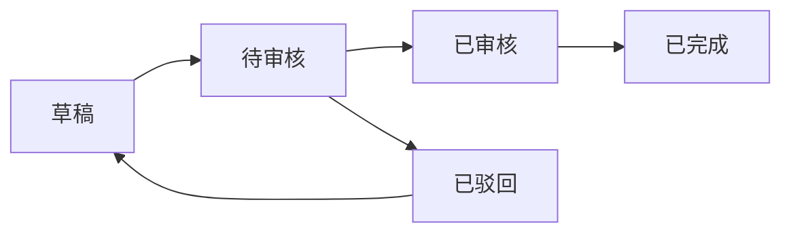

# 财务基础配置 (Finance Base)

## 1. 模块概述 (Module Overview)

| 属性 | 说明 |
|:---|:---|
| **模块名称** | 财务基础配置 (Finance Base) |
| **核心价值** | 提供财务系统的通用配置和基础规则 |
| **目标用户** | 财务、管理员、店长 |
| **关联模块** | 收款单、付款单、对账单 |

## 2. 系统设置 (System Settings)

### 2.1 租户级别配置

系统支持在租户级别配置财务相关规则，不同租户可以根据自身业务需求灵活设置。

#### 2.1.1 差额处理设置

| 配置项 | 配置键 | 类型 | 默认值 | 说明 |
|:---|:---|:---|:---|:---|
| **允许差额** | `allow_difference` | Boolean | `true` | 是否允许收款金额与应收金额存在差额 |
| **最大差额金额** | `max_difference_amount` | Decimal | `100` | 允许的最大差额金额（单位：元） |
| **差额处理方式** | `difference_handling` | Enum | `AUTO_ADJUST` | 差额处理方式（自动调整/手工记录/禁止） |

**差额处理方式说明：**

| 方式 | 代码 | 说明 |
|:---|:---|:---|
| **自动调整** | `AUTO_ADJUST` | 自动调整应收金额，使应收金额等于收款金额 |
| **手工记录** | `MANUAL_RECORD` | 记录差额，不调整应收金额，差额计入"差额科目" |
| **禁止** | `FORBIDDEN` | 不允许存在差额，必须严格匹配 |

**业务规则：**

1. **允许差额 + 自动调整：**
   * 收款金额与应收金额存在差额时，系统自动调整应收金额
   * 调整后的应收金额 = 收款金额
   * 系统记录调整日志，包含调整原因和调整金额

2. **允许差额 + 手工记录：**
   * 收款金额与应收金额存在差额时，系统记录差额
   * 应收金额保持不变
   * 差额计入财务的"差额科目"
   * 差额金额 = 收款金额 - 应收金额（正数为多收，负数为少收）

3. **允许差额 + 禁止：**
   * 收款金额与应收金额必须严格相等
   * 如果存在差额，系统拒绝保存并提示错误
   * 要求用户重新核对金额

4. **不允许差额：**
   * 收款金额与应收金额必须严格相等
   * 如果存在差额，系统拒绝保存并提示错误

#### 2.1.2 抹零设置

| 配置项 | 配置键 | 类型 | 默认值 | 说明 |
|:---|:---|:---|:---|:---|
| **允许抹零** | `allow_rounding` | Boolean | `true` | 是否允许对金额进行抹零处理 |
| **抹零方式** | `rounding_mode` | Enum | `ROUND_DOWN` | 抹零方式（向下取整/四舍五入/向上取整） |
| **抹零单位** | `rounding_unit` | Enum | `YUAN` | 抹零单位（元/角/分） |

**抹零方式说明：**

| 方式 | 代码 | 说明 | 示例（抹零到元） |
|:---|:---|:---|:---|
| **向下取整** | `ROUND_DOWN` | 直接舍弃小数部分 | 123.99 → 123.00 |
| **四舍五入** | `ROUND_HALF_UP` | 按四舍五入规则 | 123.99 → 124.00 |
| **向上取整** | `ROUND_UP` | 小数部分进位 | 123.01 → 124.00 |

**抹零单位说明：**

| 单位 | 代码 | 说明 | 示例 |
|:---|:---|:---|:---|
| **元** | `YUAN` | 抹零到整数元 | 123.99 → 124.00 |
| **角** | `JIAO` | 抹零到角（保留1位小数） | 123.99 → 123.90 |
| **分** | `FEN` | 抹零到分（保留2位小数） | 123.999 → 123.99 |

**业务规则：**

1. **允许抹零：**
   * 在收款时，系统根据抹零方式和抹零单位自动计算抹零后的金额
   * 抹零差额计入财务的"抹零科目"
   * 抹零差额 = 原始金额 - 抹零后金额
   * 系统记录抹零日志，包含抹零原因和抹零金额

2. **不允许抹零：**
   * 收款金额必须精确到分，不能进行抹零处理
   * 系统不提供抹零功能

#### 2.1.3 配置示例

**场景1：允许小额差额和抹零（推荐）**
```json
{
  "allow_difference": true,
  "max_difference_amount": 100,
  "difference_handling": "MANUAL_RECORD",
  "allow_rounding": true,
  "rounding_mode": "ROUND_DOWN",
  "rounding_unit": "YUAN"
}
```

**场景2：严格模式（不允许差额和抹零）**
```json
{
  "allow_difference": false,
  "max_difference_amount": 0,
  "difference_handling": "FORBIDDEN",
  "allow_rounding": false,
  "rounding_mode": null,
  "rounding_unit": null
}
```

**场景3：宽松模式（允许自动调整）**
```json
{
  "allow_difference": true,
  "max_difference_amount": 500,
  "difference_handling": "AUTO_ADJUST",
  "allow_rounding": true,
  "rounding_mode": "ROUND_HALF_UP",
  "rounding_unit": "JIAO"
}
```

### 2.2 配置界面

#### 2.2.1 系统设置页面

**页面路径：** 系统设置 > 财务设置

**页面布局：**
```
┌─────────────────────────────────────────────────────┐
│ 财务系统设置                              [保存]     │
├─────────────────────────────────────────────────────┤
│ 差额处理设置                                         │
│ ┌───────────────────────────────────────────────┐  │
│ │ ☑ 允许差额                                     │  │
│ │ 最大差额金额: [100] 元                         │  │
│ │ 差额处理方式: [手工记录 ▼]                     │  │
│ └───────────────────────────────────────────────┘  │
│                                                     │
│ 抹零设置                                             │
│ ┌───────────────────────────────────────────────┐  │
│ │ ☑ 允许抹零                                     │  │
│ │ 抹零方式: [向下取整 ▼]                         │  │
│ │ 抹零单位: [元 ▼]                               │  │
│ └───────────────────────────────────────────────┘  │
└─────────────────────────────────────────────────────┘
```

**表单字段：**

| 字段 | 组件 | 必填 | 说明 |
|:---|:---|:---|:---|
| 允许差额 | `Switch` | - | 开关控制是否允许差额 |
| 最大差额金额 | `InputNumber` | - | 允许的最大差额金额，仅当允许差额时显示 |
| 差额处理方式 | `Select` | - | 选择差额处理方式，仅当允许差额时显示 |
| 允许抹零 | `Switch` | - | 开关控制是否允许抹零 |
| 抹零方式 | `Select` | - | 选择抹零方式，仅当允许抹零时显示 |
| 抹零单位 | `Select` | - | 选择抹零单位，仅当允许抹零时显示 |

**操作权限：**
* 仅管理员和店长可以修改系统设置
* 修改设置需要二次确认
* 系统记录设置修改日志，包含修改人、修改时间、修改内容

### 2.3 差额和抹零的应用场景

#### 2.3.1 收款场景

**场景1：客户多付小额款项**
* 订单金额：1000.00 元
* 客户实际支付：1000.50 元
* 差额：+0.50 元
* 处理方式：
  - **自动调整**：应收金额调整为 1000.50 元
  - **手工记录**：应收金额保持 1000.00 元，差额 0.50 元计入"差额科目"
  - **禁止**：系统拒绝保存，提示金额不匹配

**场景2：抹零处理**
* 订单金额：1234.99 元
* 客户实际支付：1234.00 元（要求抹零）
* 抹零差额：-0.99 元
* 处理方式：
  - **向下取整到元**：应收金额调整为 1234.00 元，抹零差额 0.99 元计入"抹零科目"
  - **四舍五入到元**：应收金额调整为 1235.00 元，抹零差额 -0.01 元计入"抹零科目"

#### 2.3.2 付款场景

**场景1：供应商发票金额与采购金额不一致**
* 采购金额：5000.00 元
* 供应商发票金额：5000.50 元
* 差额：+0.50 元
* 处理方式：
  - **自动调整**：应付金额调整为 5000.50 元
  - **手工记录**：应付金额保持 5000.00 元，差额 0.50 元计入"差额科目"
  - **禁止**：系统拒绝保存，提示金额不匹配

**场景2：抹零处理**
* 采购金额：6789.99 元
* 实际付款：6789.00 元（要求抹零）
* 抹零差额：-0.99 元
* 处理方式：
  - **向下取整到元**：应付金额调整为 6789.00 元，抹零差额 0.99 元计入"抹零科目"

### 2.4 财务科目说明

系统自动创建以下财务科目，用于记录差额和抹零：

| 科目代码 | 科目名称 | 科目类型 | 说明 |
|:---|:---|:---|:---|
| `DIFFERENCE_INCOME` | 差额收入 | 收入 | 记录收款差额（多收） |
| `DIFFERENCE_EXPENSE` | 差额支出 | 支出 | 记录付款差额（多付） |
| `ROUNDING_INCOME` | 抹零收入 | 收入 | 记录抹零差额（少收） |
| `ROUNDING_EXPENSE` | 抹零支出 | 支出 | 记录抹零差额（少付） |

**科目使用规则：**

1. **收款场景：**
   * 收款金额 > 应收金额：差额计入 `DIFFERENCE_INCOME`
   * 收款金额 < 应收金额：差额计入 `DIFFERENCE_EXPENSE`
   * 抹零处理：抹零差额计入 `ROUNDING_INCOME`（少收）或 `ROUNDING_EXPENSE`（多收）

2. **付款场景：**
   * 付款金额 > 应付金额：差额计入 `DIFFERENCE_EXPENSE`
   * 付款金额 < 应付金额：差额计入 `DIFFERENCE_INCOME`
   * 抹零处理：抹零差额计入 `ROUNDING_EXPENSE`（少付）或 `ROUNDING_INCOME`（多付）

## 3. 技术实施建议

### 3.1 数据库层 (Drizzle Schema)

```typescript
// 财务配置表
export const financeConfigs = pgTable('finance_configs', {
  id: uuid('id').defaultRandom().primaryKey(),
  tenantId: uuid('tenant_id').notNull(),
  configKey: varchar('config_key', { length: 100 }).notNull(),
  configValue: text('config_value').notNull(),
  createdAt: timestamp('created_at').defaultNow(),
  updatedAt: timestamp('updated_at').defaultNow(),
});

// 财务科目表
export const financeAccounts = pgTable('finance_accounts', {
  id: uuid('id').defaultRandom().primaryKey(),
  accountCode: varchar('account_code', { length: 50 }).notNull().unique(),
  accountName: varchar('account_name', { length: 100 }).notNull(),
  accountType: varchar('account_type', { length: 20 }).notNull(), // INCOME/EXPENSE
  description: text('description'),
  isActive: boolean('is_active').default(true),
  createdAt: timestamp('created_at').defaultNow(),
});
```

### 3.2 业务逻辑层 (Server Actions)

```typescript
// 抹零处理函数
export async function processRounding(
  amount: number,
  config: {
    allowRounding: boolean;
    roundingMode: 'ROUND_DOWN' | 'ROUND_HALF_UP' | 'ROUND_UP';
    roundingUnit: 'YUAN' | 'JIAO' | 'FEN';
  }
): Promise<{ roundedAmount: number; roundingDiff: number }> {
  if (!config.allowRounding) {
    return { roundedAmount: amount, roundingDiff: 0 };
  }

  let multiplier = 1;
  switch (config.roundingUnit) {
    case 'YUAN':
      multiplier = 1;
      break;
    case 'JIAO':
      multiplier = 10;
      break;
    case 'FEN':
      multiplier = 100;
      break;
  }

  const scaledAmount = amount * multiplier;
  let roundedScaled: number;

  switch (config.roundingMode) {
    case 'ROUND_DOWN':
      roundedScaled = Math.floor(scaledAmount);
      break;
    case 'ROUND_HALF_UP':
      roundedScaled = Math.round(scaledAmount);
      break;
    case 'ROUND_UP':
      roundedScaled = Math.ceil(scaledAmount);
      break;
  }

  const roundedAmount = roundedScaled / multiplier;
  const roundingDiff = amount - roundedAmount;

  return { roundedAmount, roundingDiff };
}

// 获取租户财务配置
export async function getTenantFinanceConfig(tenantId: string) {
  const configs = await db
    .select()
    .from(financeConfigs)
    .where(eq(financeConfigs.tenantId, tenantId));

  return configs.reduce((acc, config) => {
    acc[config.configKey] = config.configValue;
    return acc;
  }, {} as Record<string, string>);
}
```

### 3.3 UI 组件层

```typescript
// 财务设置表单组件
export function FinanceSettingsForm() {
  const [config, setConfig] = useState({
    allowDifference: true,
    maxDifferenceAmount: 100,
    differenceHandling: 'MANUAL_RECORD',
    allowRounding: true,
    roundingMode: 'ROUND_DOWN',
    roundingUnit: 'YUAN',
  });

  return (
    <Card>
      <CardHeader>
        <CardTitle>财务系统设置</CardTitle>
      </CardHeader>
      <CardContent className="space-y-6">
        <div className="space-y-4">
          <h3 className="font-semibold">差额处理设置</h3>
          <div className="flex items-center space-x-2">
            <Switch
              checked={config.allowDifference}
              onCheckedChange={(checked) =>
                setConfig({ ...config, allowDifference: checked })
              }
            />
            <span>允许差额</span>
          </div>
          {config.allowDifference && (
            <>
              <div className="space-y-2">
                <Label>最大差额金额（元）</Label>
                <InputNumber
                  value={config.maxDifferenceAmount}
                  onChange={(value) =>
                    setConfig({ ...config, maxDifferenceAmount: value })
                  }
                />
              </div>
              <div className="space-y-2">
                <Label>差额处理方式</Label>
                <Select
                  value={config.differenceHandling}
                  onValueChange={(value) =>
                    setConfig({ ...config, differenceHandling: value })
                  }
                >
                  <SelectTrigger>
                    <SelectValue />
                  </SelectTrigger>
                  <SelectContent>
                    <SelectItem value="AUTO_ADJUST">自动调整</SelectItem>
                    <SelectItem value="MANUAL_RECORD">手工记录</SelectItem>
                    <SelectItem value="FORBIDDEN">禁止</SelectItem>
                  </SelectContent>
                </Select>
              </div>
            </>
          )}
        </div>

        <div className="space-y-4">
          <h3 className="font-semibold">抹零设置</h3>
          <div className="flex items-center space-x-2">
            <Switch
              checked={config.allowRounding}
              onCheckedChange={(checked) =>
                setConfig({ ...config, allowRounding: checked })
              }
            />
            <span>允许抹零</span>
          </div>
          {config.allowRounding && (
            <>
              <div className="space-y-2">
                <Label>抹零方式</Label>
                <Select
                  value={config.roundingMode}
                  onValueChange={(value) =>
                    setConfig({ ...config, roundingMode: value })
                  }
                >
                  <SelectTrigger>
                    <SelectValue />
                  </SelectTrigger>
                  <SelectContent>
                    <SelectItem value="ROUND_DOWN">向下取整</SelectItem>
                    <SelectItem value="ROUND_HALF_UP">四舍五入</SelectItem>
                    <SelectItem value="ROUND_UP">向上取整</SelectItem>
                  </SelectContent>
                </Select>
              </div>
              <div className="space-y-2">
                <Label>抹零单位</Label>
                <Select
                  value={config.roundingUnit}
                  onValueChange={(value) =>
                    setConfig({ ...config, roundingUnit: value })
                  }
                >
                  <SelectTrigger>
                    <SelectValue />
                  </SelectTrigger>
                  <SelectContent>
                    <SelectItem value="YUAN">元</SelectItem>
                    <SelectItem value="JIAO">角</SelectItem>
                    <SelectItem value="FEN">分</SelectItem>
                  </SelectContent>
                </Select>
              </div>
            </>
          )}
        </div>

        <Button onClick={handleSave}>保存</Button>
      </CardContent>
    </Card>
  );
}
```

## 4. 资金账户管理 (Financial Account)

### 4.1 账户类型

| 类型 | 代码 | 说明 |
|:---|:---|:---|
| **银行账户** | `BANK` | 公司银行账户 |
| **微信账户** | `WECHAT` | 微信商户账户 |
| **支付宝账户** | `ALIPAY` | 支付宝商户账户 |
| **现金账户** | `CASH` | 现金账户 |
| **虚拟账户** | `VIRTUAL` | 虚拟账户，用于处理平台代扣、积分抵扣等非实体资金流动 |

### 4.2 核心字段 (financial_accounts)

| 字段名 | 类型 | 必填 | 说明 |
|:---|:---|:---|:---|
| id | UUID | ✓ | 主键 |
| account_no | String | ✓ | 账户编号 |
| account_name | String | ✓ | 账户名称 |
| account_type | Enum | ✓ | 账户类型 (BANK/WECHAT/ALIPAY/CASH/VIRTUAL) |
| account_number | String | - | 账号/卡号 |
| bank_name | String | - | 开户银行（银行账户必填） |
| branch_name | String | - | 开户支行 |
| holder_name | String | ✓ | 账户持有人 |
| balance | Decimal | ✓ | 账户余额 |
| is_active | Boolean | ✓ | 是否启用 |
| is_default | Boolean | ✓ | 是否默认账户 |
| remark | String | - | 备注 |
| created_at | DateTime | ✓ | 创建时间 |
| updated_at | DateTime | ✓ | 更新时间 |

### 4.3 账户流水表 (account_transactions)

| 字段名 | 类型 | 必填 | 说明 |
|:---|:---|:---|:---|
| id | UUID | ✓ | 主键 |
| transaction_no | String | ✓ | 流水号 |
| account_id | UUID | ✓ | 关联账户 |
| transaction_type | Enum | ✓ | 交易类型 (INCOME/EXPENSE/TRANSFER_IN/TRANSFER_OUT) |
| amount | Decimal | ✓ | 金额 |
| balance_before | Decimal | ✓ | 交易前余额 |
| balance_after | Decimal | ✓ | 交易后余额 |
| related_type | Enum | ✓ | 关联类型 (PAYMENT_ORDER/PAYMENT_BILL/LABOR_PAYMENT/INTERNAL_TRANSFER) |
| related_id | UUID | ✓ | 关联单据ID |
| remark | String | - | 备注 |
| created_at | DateTime | ✓ | 创建时间 |

### 4.4 账户管理界面

**页面路径：** 财务模块 > 账户管理

**页面布局：**
```
┌─────────────────────────────────────────────────────┐
│ 财务账户管理                              [新建账户]  │
├─────────────────────────────────────────────────────┤
│ 账户列表                                             │
│ ┌───────────────────────────────────────────────┐  │
│ │ 账户名称   | 账户类型 | 余额     | 状态 | 操作  │  │
│ │ 工商银行   | 银行账户 | 100,000  | 启用 | [编辑]│  │
│ │ 微信商户   | 微信账户 | 50,000   | 启用 | [编辑]│  │
│ │ 支付宝     | 支付宝   | 30,000   | 启用 | [编辑]│  │
│ │ 虚拟账户   | 虚拟账户 | 0        | 启用 | [编辑]│  │
│ └───────────────────────────────────────────────┘  │
└─────────────────────────────────────────────────────┘
```

**新建/编辑账户表单：**
| 字段 | 组件 | 必填 | 说明 |
|:---|:---|:---|:---|
| 账户名称 | `Input` | ✓ | 输入账户名称 |
| 账户类型 | `Select` | ✓ | 选择账户类型 |
| 账号/卡号 | `Input` | - | 输入账号或卡号 |
| 开户银行 | `Input` | - | 银行账户必填 |
| 开户支行 | `Input` | - | 输入开户支行 |
| 账户持有人 | `Input` | ✓ | 输入账户持有人 |
| 是否默认 | `Switch` | - | 是否设为默认账户 |
| 备注 | `TextArea` | - | 填写备注信息 |

### 4.5 虚拟账户使用场景

虚拟账户用于处理非实体资金流动，典型场景包括：

| 场景 | 说明 | 处理方式 |
|:---|:---|:---|
| **平台代扣** | 平台从客户账户自动扣款 | 虚拟账户记录扣款，不涉及实际资金流动 |
| **积分抵扣** | 客户使用积分抵扣部分金额 | 虚拟账户记录积分抵扣金额 |
| **优惠券抵扣** | 客户使用优惠券抵扣部分金额 | 虚拟账户记录优惠券抵扣金额 |
| **内部结算** | 部门间内部结算 | 虚拟账户记录内部结算金额 |

## 5. 资金调拨 (Internal Transfer)

### 5.1 业务场景

资金调拨用于处理内部账户之间的资金转移，包括：

| 场景 | 说明 | 示例 |
|:---|:---|:---|
| **提现** | 从第三方支付账户提现到银行账户 | 微信账户 → 银行账户 |
| **充值** | 从银行账户充值到第三方支付账户 | 银行账户 → 微信账户 |
| **备用金划转** | 从主账户划转资金到备用金账户 | 主银行账户 → 备用金账户 |
| **现金存取** | 现金与银行账户之间的资金转移 | 现金账户 ↔ 银行账户 |

### 5.2 状态流转



| 状态 | 状态码 | 说明 | 触发动作 |
|:---|:---|:---|:---|
| **草稿** | `DRAFT` | 编辑中 | 创建时默认状态 |
| **待审核** | `PENDING` | 提交待审核 | 提交调拨单 |
| **已审核** | `VERIFIED` | 审核通过，执行调拨 | 店长审核通过 |
| **已驳回** | `REJECTED` | 审核不通过 | 店长驳回，需修改后重新提交 |
| **已完成** | `COMPLETED` | 调拨完成 | 资金调拨成功 |

### 5.3 核心字段 (internal_transfers)

| 字段名 | 类型 | 必填 | 说明 |
|:---|:---|:---|:---|
| id | UUID | ✓ | 主键 |
| transfer_no | String | ✓ | 调拨单号 (IT20260101001) |
| source_account_id | UUID | ✓ | 源账户ID |
| source_account_name | String | ✓ | 源账户名称（冗余） |
| target_account_id | UUID | ✓ | 目标账户ID |
| target_account_name | String | ✓ | 目标账户名称（冗余） |
| amount | Decimal | ✓ | 调拨金额 |
| fee | Decimal | ✓ | 手续费 |
| total_amount | Decimal | ✓ | 总金额（调拨金额 + 手续费） |
| status | Enum | ✓ | 状态 |
| transfer_type | Enum | ✓ | 调拨类型 (WITHDRAW/RECHARGE/RESERVE/CASH) |
| proof_url | String | - | 调拨凭证 |
| remark | String | - | 备注 |
| created_by | UUID | ✓ | 创建人 |
| verified_by | UUID | - | 审核人 |
| verified_at | DateTime | - | 审核时间 |
| completed_at | DateTime | - | 完成时间 |
| created_at | DateTime | ✓ | 创建时间 |
| updated_at | DateTime | ✓ | 更新时间 |

### 5.4 资金调拨规则

**规则1：账户限制**
* 源账户和目标账户不能是同一个账户
* 虚拟账户只能作为目标账户，不能作为源账户
* 现金账户的调拨需要上传凭证

**规则2：金额限制**
* 调拨金额必须大于0
* 调拨金额不能超过源账户余额
* 手续费不能为负数

**规则3：流水处理**
* 一笔调拨生成两条流水：
  - 源账户：支出流水（TRANSFER_OUT）
  - 目标账户：收入流水（TRANSFER_IN）
* 流水金额 = 调拨金额（不含手续费）
* 手续费单独记录在源账户的支出流水中

**规则4：余额更新**
* 源账户余额 = 原余额 - 调拨金额 - 手续费
* 目标账户余额 = 原余额 + 调拨金额

### 5.5 调拨类型说明

| 类型 | 代码 | 说明 | 典型场景 |
|:---|:---|:---|:---|
| **提现** | `WITHDRAW` | 从第三方支付账户提现到银行账户 | 微信账户 → 银行账户 |
| **充值** | `RECHARGE` | 从银行账户充值到第三方支付账户 | 银行账户 → 微信账户 |
| **备用金划转** | `RESERVE` | 从主账户划转资金到备用金账户 | 主银行账户 → 备用金账户 |
| **现金存取** | `CASH` | 现金与银行账户之间的资金转移 | 现金账户 ↔ 银行账户 |

### 5.6 调拨单创建流程

**创建入口：**
* 财务模块 > 资金调拨 > 新建调拨单

**创建表单：**
| 字段 | 组件 | 必填 | 说明 |
|:---|:---|:---|:---|
| 源账户 | `Select` | ✓ | 选择源账户 |
| 目标账户 | `Select` | ✓ | 选择目标账户 |
| 调拨金额 | `InputNumber` | ✓ | 输入调拨金额 |
| 手续费 | `InputNumber` | ✓ | 输入手续费 |
| 调拨类型 | `Select` | ✓ | 选择调拨类型 |
| 调拨凭证 | `Upload` | - | 上传调拨凭证（现金调拨必填） |
| 备注 | `TextArea` | - | 填写备注信息 |

**创建逻辑：**
1. 财务填写调拨单信息，状态为 `DRAFT`
2. 提交后状态变为 `PENDING`，等待店长审核
3. 店长审核通过后：
   * 状态变为 `VERIFIED`
   * 系统执行资金调拨：
     - 更新源账户余额
     - 更新目标账户余额
     - 生成源账户支出流水
     - 生成目标账户收入流水
   * 状态变为 `COMPLETED`
4. 店长驳回后：
   * 状态变为 `REJECTED`
   * 财务需修改后重新提交

### 5.7 技术实施建议

#### 5.7.1 数据库层 (Drizzle Schema)

```typescript
// 资金调拨表
export const internalTransfers = pgTable('internal_transfers', {
  id: uuid('id').defaultRandom().primaryKey(),
  transferNo: varchar('transfer_no', { length: 50 }).notNull().unique(),
  sourceAccountId: uuid('source_account_id').notNull(),
  sourceAccountName: varchar('source_account_name', { length: 100 }).notNull(),
  targetAccountId: uuid('target_account_id').notNull(),
  targetAccountName: varchar('target_account_name', { length: 100 }).notNull(),
  amount: decimal('amount', { precision: 12, scale: 2 }).notNull(),
  fee: decimal('fee', { precision: 12, scale: 2 }).notNull().default('0'),
  totalAmount: decimal('total_amount', { precision: 12, scale: 2 }).notNull(),
  status: varchar('status', { length: 20 }).notNull(),
  transferType: varchar('transfer_type', { length: 20 }).notNull(),
  proofUrl: text('proof_url'),
  remark: text('remark'),
  createdBy: uuid('created_by').notNull(),
  verifiedBy: uuid('verified_by'),
  verifiedAt: timestamp('verified_at'),
  completedAt: timestamp('completed_at'),
  createdAt: timestamp('created_at').defaultNow(),
  updatedAt: timestamp('updated_at').defaultNow(),
});

// 财务账户表
export const financialAccounts = pgTable('financial_accounts', {
  id: uuid('id').defaultRandom().primaryKey(),
  accountNo: varchar('account_no', { length: 50 }).notNull().unique(),
  accountName: varchar('account_name', { length: 100 }).notNull(),
  accountType: varchar('account_type', { length: 20 }).notNull(),
  accountNumber: varchar('account_number', { length: 100 }),
  bankName: varchar('bank_name', { length: 100 }),
  branchName: varchar('branch_name', { length: 100 }),
  holderName: varchar('holder_name', { length: 100 }).notNull(),
  balance: decimal('balance', { precision: 12, scale: 2 }).notNull().default('0'),
  isActive: boolean('is_active').default(true),
  isDefault: boolean('is_default').default(false),
  remark: text('remark'),
  createdAt: timestamp('created_at').defaultNow(),
  updatedAt: timestamp('updated_at').defaultNow(),
});

// 账户流水表
export const accountTransactions = pgTable('account_transactions', {
  id: uuid('id').defaultRandom().primaryKey(),
  transactionNo: varchar('transaction_no', { length: 50 }).notNull().unique(),
  accountId: uuid('account_id').notNull(),
  transactionType: varchar('transaction_type', { length: 20 }).notNull(),
  amount: decimal('amount', { precision: 12, scale: 2 }).notNull(),
  balanceBefore: decimal('balance_before', { precision: 12, scale: 2 }).notNull(),
  balanceAfter: decimal('balance_after', { precision: 12, scale: 2 }).notNull(),
  relatedType: varchar('related_type', { length: 50 }).notNull(),
  relatedId: uuid('related_id').notNull(),
  remark: text('remark'),
  createdAt: timestamp('created_at').defaultNow(),
});
```

#### 5.7.2 业务逻辑层 (Server Actions)

```typescript
// 创建资金调拨单
export async function createInternalTransfer(
  data: {
    sourceAccountId: string;
    targetAccountId: string;
    amount: number;
    fee: number;
    transferType: 'WITHDRAW' | 'RECHARGE' | 'RESERVE' | 'CASH';
    proofUrl?: string;
    remark?: string;
    createdBy: string;
  }
): Promise<InternalTransfer> {
  // 校验源账户和目标账户不能相同
  if (data.sourceAccountId === data.targetAccountId) {
    throw new Error('源账户和目标账户不能相同');
  }

  // 获取源账户和目标账户
  const sourceAccount = await getFinancialAccount(data.sourceAccountId);
  const targetAccount = await getFinancialAccount(data.targetAccountId);

  // 校验虚拟账户只能作为目标账户
  if (sourceAccount.accountType === 'VIRTUAL') {
    throw new Error('虚拟账户只能作为目标账户，不能作为源账户');
  }

  // 校验调拨金额不能超过源账户余额
  const totalAmount = data.amount + data.fee;
  if (totalAmount > sourceAccount.balance) {
    throw new Error('调拨金额超过源账户余额');
  }

  // 创建调拨单
  const transfer = await db.insert(internalTransfers).values({
    transferNo: generateTransferNo(),
    sourceAccountId: data.sourceAccountId,
    sourceAccountName: sourceAccount.accountName,
    targetAccountId: data.targetAccountId,
    targetAccountName: targetAccount.accountName,
    amount: data.amount,
    fee: data.fee,
    totalAmount,
    status: 'DRAFT',
    transferType: data.transferType,
    proofUrl: data.proofUrl,
    remark: data.remark,
    createdBy: data.createdBy,
  }).returning();

  return transfer[0];
}

// 审核资金调拨单
export async function verifyInternalTransfer(
  transferId: string,
  verifiedBy: string
): Promise<void> {
  const transfer = await getInternalTransfer(transferId);

  if (transfer.status !== 'PENDING') {
    throw new Error('只能审核待审核状态的调拨单');
  }

  // 获取源账户和目标账户
  const sourceAccount = await getFinancialAccount(transfer.sourceAccountId);
  const targetAccount = await getFinancialAccount(transfer.targetAccountId);

  // 再次校验余额
  if (transfer.totalAmount > sourceAccount.balance) {
    throw new Error('调拨金额超过源账户余额');
  }

  // 更新调拨单状态
  await updateInternalTransfer(transferId, {
    status: 'VERIFIED',
    verifiedBy,
    verifiedAt: new Date(),
  });

  // 执行资金调拨
  await executeTransfer(transfer, sourceAccount, targetAccount);

  // 更新调拨单状态为已完成
  await updateInternalTransfer(transferId, {
    status: 'COMPLETED',
    completedAt: new Date(),
  });
}

// 执行资金调拨
async function executeTransfer(
  transfer: InternalTransfer,
  sourceAccount: FinancialAccount,
  targetAccount: FinancialAccount
): Promise<void> {
  // 更新源账户余额
  const newSourceBalance = sourceAccount.balance.minus(transfer.totalAmount);
  await updateFinancialAccountBalance(transfer.sourceAccountId, newSourceBalance);

  // 更新目标账户余额
  const newTargetBalance = targetAccount.balance.plus(transfer.amount);
  await updateFinancialAccountBalance(transfer.targetAccountId, newTargetBalance);

  // 生成源账户支出流水
  await createAccountTransaction({
    accountId: transfer.sourceAccountId,
    transactionType: 'TRANSFER_OUT',
    amount: transfer.amount,
    balanceBefore: sourceAccount.balance,
    balanceAfter: newSourceBalance,
    relatedType: 'INTERNAL_TRANSFER',
    relatedId: transfer.id,
    remark: `资金调拨 - ${transfer.targetAccountName}`,
  });

  // 如果有手续费，生成手续费支出流水
  if (transfer.fee > 0) {
    await createAccountTransaction({
      accountId: transfer.sourceAccountId,
      transactionType: 'EXPENSE',
      amount: transfer.fee,
      balanceBefore: newSourceBalance,
      balanceAfter: newSourceBalance.minus(transfer.fee),
      relatedType: 'INTERNAL_TRANSFER_FEE',
      relatedId: transfer.id,
      remark: `资金调拨手续费`,
    });
  }

  // 生成目标账户收入流水
  await createAccountTransaction({
    accountId: transfer.targetAccountId,
    transactionType: 'TRANSFER_IN',
    amount: transfer.amount,
    balanceBefore: targetAccount.balance,
    balanceAfter: newTargetBalance,
    relatedType: 'INTERNAL_TRANSFER',
    relatedId: transfer.id,
    remark: `资金调拨 - ${transfer.sourceAccountName}`,
  });
}
```
