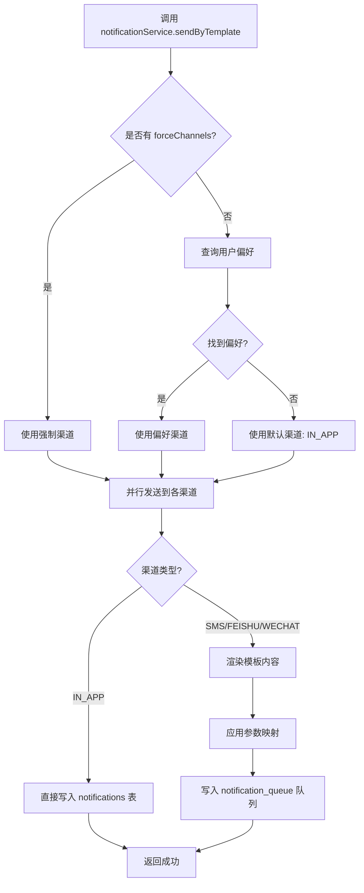
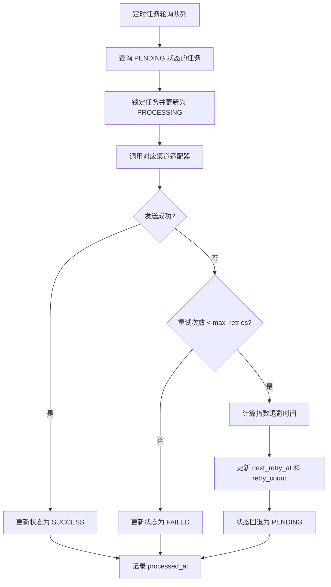

# 通知模块 (Notifications)

## 1. 模块概述 (Module Overview)

| 属性 | 说明 |
|:---|:---|
| **模块名称** | 通知模块 (Notifications) |
| **核心价值** | 为用户提供实时、多渠道的消息通知能力，确保关键业务信息及时触达 |
| **目标用户** | 所有系统用户 |
| **上游模块** | 所有业务模块（线索、订单、审批、测量等） |
| **下游模块** | 无（基础设施模块） |

## 2. 核心功能

### 2.1 多渠道通知分发

支持多种通知渠道，用户可根据偏好自主配置接收渠道。

| 渠道 | 说明 | 状态 |
|:---|:---|:---|
| **IN_APP** | 站内通知 | ✅ 已实现 |
| **SMS** | 短信通知 | ⚠️ Mock待集成 |
| **FEISHU/LARK** | 飞书通知 | ✅ 已实现 |
| **WECHAT** | 微信小程序订阅消息 | ⚠️ Mock待集成 |

### 2.2 通知类型分类

系统支持多种通知类型，每种类型可独立配置接收渠道。

| 通知类型 | 说明 | 典型场景 |
|:---|:---|:---|
| **SYSTEM** | 系统通知 | 系统公告、功能更新 |
| **ORDER_STATUS** | 订单状态变更 | 订单发货、安装完成 |
| **APPROVAL** | 审批通知 | 审批待处理、审批结果 |
| **ALERT** | 预警通知 | SLA超时、业务异常 |
| **MENTION** | @提及通知 | 被人@提醒 |
| **INFO** | 信息通知 | 一般信息提示 |
| **SUCCESS** | 成功通知 | 操作成功反馈 |
| **WARNING** | 警告通知 | 需要注意的事项 |
| **ERROR** | 错误通知 | 系统错误、操作失败 |

### 2.3 SLA时效监控

自动监控关键业务环节的时效性，超时自动预警。

| 监控场景 | 标准时长 | 触发条件 | 预警对象 |
|:---|:---|:---|:---|
| **线索跟进** | 24小时 | 状态=PENDING_FOLLOWUP 且超过24小时未跟进 | 归属销售 |
| **测量派单** | 24小时 | 状态=PENDING 且创建超过24小时未派单 | 店长/派单员 |

### 2.4 通知偏好管理

用户可自主配置各类通知的接收渠道。

- 支持按通知类型配置渠道
- 站内通知（IN_APP）默认开启
- 支持实时更新偏好设置

## 3. 数据库设计

### 3.1 枚举类型

```sql
-- 通知渠道枚举
CREATE TYPE notification_channel AS ENUM (
    'IN_APP',      -- 站内通知
    'SMS',         -- 短信
    'FEISHU',      -- 飞书
    'LARK',        -- 飞书（别名）
    'WECHAT'       -- 微信小程序
);

-- 通知类型枚举
CREATE TYPE notification_type AS ENUM (
    'SYSTEM',      -- 系统通知
    'ORDER_STATUS',-- 订单状态
    'APPROVAL',    -- 审批
    'ALERT',       -- 预警
    'MENTION',     -- @提及
    'INFO',        -- 信息
    'SUCCESS',     -- 成功
    'WARNING',     -- 警告
    'ERROR'        -- 错误
);
```

### 3.2 通知表 (notifications)

```sql
CREATE TABLE notifications (
    id UUID PRIMARY KEY DEFAULT gen_random_uuid(),
    tenant_id UUID REFERENCES tenants(id) NOT NULL,
    user_id UUID REFERENCES users(id) NOT NULL,

    -- 通知内容
    type notification_type NOT NULL,
    channel notification_channel NOT NULL,
    title VARCHAR(200) NOT NULL,
    content TEXT NOT NULL,

    -- 关联信息
    link TEXT,                          -- 跳转链接
    metadata JSONB DEFAULT '{}',        -- 扩展元数据

    -- 状态管理
    is_read BOOLEAN DEFAULT FALSE,
    read_at TIMESTAMPTZ,

    -- 时间戳
    created_at TIMESTAMPTZ DEFAULT NOW(),
    updated_at TIMESTAMPTZ DEFAULT NOW()
);

-- 索引
CREATE INDEX idx_notifications_tenant_user ON notifications(tenant_id, user_id);
CREATE INDEX idx_notifications_read ON notifications(user_id, is_read);
CREATE INDEX idx_notifications_created ON notifications(created_at DESC);
```

### 3.3 通知偏好表 (notification_preferences)

```sql
CREATE TABLE notification_preferences (
    id UUID PRIMARY KEY DEFAULT gen_random_uuid(),
    tenant_id UUID REFERENCES tenants(id) NOT NULL,
    user_id UUID REFERENCES users(id) NOT NULL,

    -- 偏好配置
    notification_type notification_type NOT NULL,
    channels TEXT[] NOT NULL,           -- ['IN_APP', 'SMS', 'FEISHU']

    -- 时间戳
    created_at TIMESTAMPTZ DEFAULT NOW(),
    updated_at TIMESTAMPTZ DEFAULT NOW(),

    -- 唯一约束：每个用户每种通知类型只能有一条记录
    UNIQUE(user_id, notification_type)
);

-- 索引
CREATE INDEX idx_notification_prefs_user ON notification_preferences(user_id);
```

### 3.4 模板表 (notification_templates)

```sql
CREATE TABLE notification_templates (
    id UUID PRIMARY KEY DEFAULT gen_random_uuid(),
    tenant_id UUID REFERENCES tenants(id) NOT NULL,

    -- 模板标识
    code VARCHAR(100) NOT NULL,           -- 业务编码 (如: ORDER_SHIPPED, APPROVAL_PENDING)
    channel notification_channel NOT NULL, -- 通知渠道

    -- 第三方模板信息
    external_template_id VARCHAR(200),    -- 第三方平台模板ID (如微信模板ID、短信模板Code)
    content_pattern TEXT NOT NULL,        -- 内容模板 (如: `您的验证码是 {{code}}`)

    -- 参数映射
    param_mapping JSONB DEFAULT '{}',     -- 参数映射关系 (如: `{"order_no": "thing1.value"}`)

    -- 状态管理
    is_active BOOLEAN DEFAULT TRUE,

    -- 时间戳
    created_at TIMESTAMPTZ DEFAULT NOW(),
    updated_at TIMESTAMPTZ DEFAULT NOW(),

    -- 唯一约束：每个租户每个业务编码每个渠道只能有一条模板
    UNIQUE(tenant_id, code, channel)
);

-- 索引
CREATE INDEX idx_notification_templates_code ON notification_templates(tenant_id, code);
CREATE INDEX idx_notification_templates_channel ON notification_templates(channel);
```

### 3.5 广播表 (system_announcements)

```sql
CREATE TABLE system_announcements (
    id UUID PRIMARY KEY DEFAULT gen_random_uuid(),
    tenant_id UUID REFERENCES tenants(id) NOT NULL,

    -- 公告内容
    title VARCHAR(200) NOT NULL,
    content TEXT NOT NULL,
    announcement_type VARCHAR(50) DEFAULT 'INFO', -- INFO, WARNING, ERROR, MAINTENANCE

    -- 关联信息
    link TEXT,                          -- 跳转链接
    metadata JSONB DEFAULT '{}',        -- 扩展元数据

    -- 状态管理
    is_published BOOLEAN DEFAULT FALSE,
    published_at TIMESTAMPTZ,
    expires_at TIMESTAMPTZ,             -- 过期时间 (可选)

    -- 时间戳
    created_at TIMESTAMPTZ DEFAULT NOW(),
    updated_at TIMESTAMPTZ DEFAULT NOW()
);

-- 索引
CREATE INDEX idx_system_announcements_tenant ON system_announcements(tenant_id);
CREATE INDEX idx_system_announcements_published ON system_announcements(is_published, published_at DESC);
CREATE INDEX idx_system_announcements_expires ON system_announcements(expires_at);
```

### 3.6 请求队列表 (notification_queue)

```sql
CREATE TABLE notification_queue (
    id UUID PRIMARY KEY DEFAULT gen_random_uuid(),
    tenant_id UUID REFERENCES tenants(id) NOT NULL,

    -- 请求信息
    channel notification_channel NOT NULL,
    recipient VARCHAR(500) NOT NULL,     -- 接收者 (如: 手机号、飞书用户ID、微信OpenID)

    -- 通知内容
    template_code VARCHAR(100) NOT NULL, -- 模板编码
    params JSONB NOT NULL,               -- 模板参数

    -- 重试策略
    retry_count INTEGER DEFAULT 0,
    max_retries INTEGER DEFAULT 3,
    next_retry_at TIMESTAMPTZ DEFAULT NOW(),

    -- 执行状态
    status VARCHAR(50) DEFAULT 'PENDING', -- PENDING, PROCESSING, SUCCESS, FAILED
    error_message TEXT,

    -- 时间戳
    created_at TIMESTAMPTZ DEFAULT NOW(),
    updated_at TIMESTAMPTZ DEFAULT NOW(),
    processed_at TIMESTAMPTZ
);

-- 索引
CREATE INDEX idx_notification_queue_status ON notification_queue(status, next_retry_at);
CREATE INDEX idx_notification_queue_channel ON notification_queue(channel);
CREATE INDEX idx_notification_queue_created ON notification_queue(created_at DESC);
```

## 4. 核心服务

### 4.1 NotificationService

通知服务的核心入口，负责统一调度多渠道通知发送。

```typescript
export const notificationService = {
    /**
     * 发送通知（直接指定内容）
     * @param payload - 通知载荷
     * @param payload.tenantId - 租户ID
     * @param payload.userId - 用户ID
     * @param payload.type - 通知类型
     * @param payload.title - 标题
     * @param payload.content - 内容
     * @param payload.link - 跳转链接（可选）
     * @param payload.metadata - 扩展元数据（可选）
     * @param payload.forceChannels - 强制指定渠道（可选，覆盖用户偏好）
     */
    async send(payload: NotificationPayload & { forceChannels?: string[] }): Promise<boolean>

    /**
     * 基于模板发送通知（推荐方式）
     * @param payload - 模板通知载荷
     * @param payload.tenantId - 租户ID
     * @param payload.userId - 用户ID
     * @param payload.templateCode - 模板编码（如: ORDER_SHIPPED）
     * @param payload.params - 模板参数（如: { order_no: 'ORD123', customer_name: '张三' }）
     * @param payload.forceChannels - 强制指定渠道（可选，覆盖用户偏好）
     */
    async sendByTemplate(payload: TemplateNotificationPayload & { forceChannels?: string[] }): Promise<boolean>

    /**
     * 发送系统广播
     * @param payload - 广播载荷
     * @param payload.tenantId - 租户ID
     * @param payload.title - 标题
     * @param payload.content - 内容
     * @param payload.announcementType - 公告类型
     * @param payload.link - 跳转链接（可选）
     * @param payload.expiresAt - 过期时间（可选）
     */
    async broadcast(payload: BroadcastPayload): Promise<string>

    /**
     * 标记单条通知已读
     */
    async markAsRead(notificationId: string): Promise<void>

    /**
     * 标记所有通知已读
     */
    async markAllAsRead(userId: string): Promise<void>

    /**
     * 标记广播已读
     */
    async markBroadcastAsRead(userId: string, announcementId: string): Promise<void>
}
```

### 4.2 模板渲染服务

```typescript
export const templateService = {
    /**
     * 渲染模板内容
     * @param templateCode - 模板编码
     * @param channel - 通知渠道
     * @param params - 模板参数
     * @returns 渲染后的内容和参数映射
     */
    async render(templateCode: string, channel: string, params: Record<string, any>): Promise<{
        content: string;
        mappedParams: Record<string, any>;
        externalTemplateId: string;
    }>

    /**
     * 应用参数映射
     * @param params - 原始参数
     * @param mapping - 参数映射规则
     * @returns 映射后的参数
     */
    applyParamMapping(params: Record<string, any>, mapping: Record<string, string>): Record<string, any>
}
```

### 4.3 通知发送流程

#### 4.3.1 基于模板发送流程（推荐）



#### 4.3.2 异步队列处理流程



#### 4.3.3 重试策略

- **指数退避算法**：`next_retry_at = NOW() + (2 ^ retry_count) * 60 秒`
- **最大重试次数**：默认 3 次
- **重试间隔**：
  - 第 1 次重试：1 分钟后
  - 第 2 次重试：2 分钟后
  - 第 3 次重试：4 分钟后

### 4.4 渠道适配器

采用适配器模式，统一不同渠道的发送接口。

```typescript
interface ChannelAdapter {
    send(payload: NotificationPayload): Promise<boolean>;
}

interface TemplateChannelAdapter {
    sendWithTemplate(
        recipient: string,
        externalTemplateId: string,
        mappedParams: Record<string, any>
    ): Promise<boolean>;
}
```

#### 4.4.1 短信适配器 (SmsAdapter)

```typescript
export class SmsAdapter implements ChannelAdapter, TemplateChannelAdapter {
    async send(payload: NotificationPayload): Promise<boolean> {
        const recipient = await this.getRecipientPhone(payload.userId);
        return this.sendWithTemplate(
            recipient,
            'DEFAULT_SMS_TEMPLATE',
            { content: payload.content }
        );
    }

    async sendWithTemplate(
        recipient: string,
        externalTemplateId: string,
        mappedParams: Record<string, any>
    ): Promise<boolean> {
        // TODO: 集成阿里云/腾讯云短信SDK
        console.log(`[SMS Mock] Sending to ${recipient}: Template=${externalTemplateId}, Params=${JSON.stringify(mappedParams)}`);
        return true;
    }

    private async getRecipientPhone(userId: string): Promise<string> {
        // TODO: 从用户表查询手机号
        return 'mock_phone_13800138000';
    }
}
```

#### 4.4.2 飞书适配器 (LarkAdapter)

```typescript
export class LarkAdapter implements ChannelAdapter, TemplateChannelAdapter {
    async send(payload: NotificationPayload): Promise<boolean> {
        const recipient = await this.getRecipientUserId(payload.userId);
        return this.sendWithTemplate(
            recipient,
            'DEFAULT_LARK_TEMPLATE',
            {
                title: payload.title,
                content: payload.content,
                link: payload.metadata?.link
            }
        );
    }

    async sendWithTemplate(
        recipient: string,
        externalTemplateId: string,
        mappedParams: Record<string, any>
    ): Promise<boolean> {
        const webhookUrl = process.env.FEISHU_WEBHOOK_URL;

        const response = await fetch(webhookUrl, {
            method: 'POST',
            headers: { 'Content-Type': 'application/json' },
            body: JSON.stringify({
                msg_type: 'post',
                content: {
                    post: {
                        zh_cn: {
                            title: `[L2C] ${mappedParams.title || '通知'}`,
                            content: [
                                [{ tag: 'text', text: mappedParams.content || '' }],
                                mappedParams.link ? 
                                    [{ tag: 'a', text: '点击查看详情', href: `${process.env.NEXTAUTH_URL}${mappedParams.link}` }] : 
                                    [],
                            ],
                        },
                    },
                },
            }),
        });

        return response.ok;
    }

    private async getRecipientUserId(userId: string): Promise<string> {
        // TODO: 从用户表查询飞书用户ID
        return 'mock_feishu_user_id';
    }
}
```

#### 4.4.3 微信适配器 (WeChatAdapter)

```typescript
export class WeChatAdapter implements ChannelAdapter, TemplateChannelAdapter {
    async send(payload: NotificationPayload): Promise<boolean> {
        const openId = await this.getRecipientOpenId(payload.userId);
        return this.sendWithTemplate(
            openId,
            payload.metadata?.wechatTemplateId || 'DEFAULT_WECHAT_TEMPLATE',
            {
                thing1: { value: payload.title.substring(0, 20) },
                thing2: { value: payload.content.substring(0, 20) },
                time3: { value: new Date().toISOString().split('T')[0] }
            }
        );
    }

    async sendWithTemplate(
        recipient: string,
        externalTemplateId: string,
        mappedParams: Record<string, any>
    ): Promise<boolean> {
        const page = mappedParams.page || 'pages/index/index';
        const data = { ...mappedParams };
        delete data.page;

        const templateMessage = {
            touser: recipient,
            template_id: externalTemplateId,
            page: page,
            data: data,
            miniprogram_state: 'formal'
        };

        // TODO: 调用微信SDK发送
        console.log(`[WeChat Mock] Sending to ${recipient}: Template=${externalTemplateId}, Data=${JSON.stringify(data)}`);
        return true;
    }

    private async getRecipientOpenId(userId: string): Promise<string> {
        // TODO: 从用户表查询微信OpenID
        return 'mock_openid_12345';
    }
}
```

## 5. SLA检查器

### 5.1 SLAChecker

自动运行SLA规则检查，超时触发预警通知。

```typescript
export const slaChecker = {
    /**
     * 运行所有SLA检查
     */
    async runAllChecks(): Promise<SLACheckResult[]>

    /**
     * 检查线索跟进SLA
     */
    async checkLeadFollowupSLA(): Promise<SLACheckResult>

    /**
     * 检查测量派单SLA
     */
    async checkMeasureTaskDispatchSLA(): Promise<SLACheckResult>
}
```

### 5.2 SLA检查规则

#### 规则1：线索跟进超时

- **触发条件**：`leads.status = 'PENDING_FOLLOWUP'` 且 `lastActivityAt < 24小时前`
- **通知对象**：归属销售（`assignedSalesId`）
- **通知类型**：ALERT
- **通知内容**：`线索 {leadNo} ({customerName}) 已超过 24 小时未跟进，请及时处理。`

#### 规则2：测量派单超时

- **触发条件**：`measure_tasks.status = 'PENDING'` 且 `createdAt < 24小时前`
- **通知对象**：所有店长/派单员（`role = 'MANAGER'`）
- **通知类型**：ALERT
- **通知内容**：`测量任务 {measureNo} 创建已超过 24 小时未派单，请立即处理。`

### 5.3 SLA检查执行

SLA检查可通过以下方式触发：

1. **定时任务**：每小时自动执行一次
2. **手动触发**：管理员可在工作台手动执行
3. **事件触发**：关键业务操作后触发检查

```typescript
// 手动触发SLA检查（仅管理员）
export const runSLACheckAction = createSafeAction(
    z.object({}),
    async (params, { session }) => {
        const role = session.user.role;
        if (role !== 'ADMIN' && role !== 'MANAGER') {
            throw new Error('Unauthorized: Only Admin or Manager can run SLA checks.');
        }

        const results = await slaChecker.runAllChecks();
        return { success: true, data: results };
    }
);
```

## 6. Server Actions

### 6.1 通知查询

```typescript
/**
 * 获取通知列表
 */
export const getNotificationsAction = createSafeAction(
    z.object({
        page: z.number().default(1),
        limit: z.number().default(20),
        onlyUnread: z.boolean().default(false),
    }),
    async (params, { session }) => {
        const result = await getNotificationsPure(session.user, params);
        return { success: true, ...result };
    }
);

/**
 * 获取未读数量
 */
export const getUnreadCountAction = createSafeAction(
    z.object({}),
    async (params, { session }) => {
        const [{ count }] = await db
            .select({ count: sql<number>`cast(count(*) as int)` })
            .from(notifications)
            .where(and(
                eq(notifications.tenantId, session.user.tenantId),
                eq(notifications.userId, session.user.id),
                eq(notifications.isRead, false)
            ));

        return { success: true, data: { count } };
    }
);
```

### 6.2 通知操作

```typescript
/**
 * 标记通知已读
 */
export const markAsReadAction = createSafeAction(
    z.object({
        ids: z.array(z.string()),
    }),
    async (params, { session }) => {
        const { ids } = params;
        const userId = session.user.id;

        if (ids.length === 0) return { success: true };

        await db.update(notifications)
            .set({ isRead: true, readAt: new Date() })
            .where(and(
                eq(notifications.userId, userId),
                inArray(notifications.id, ids)
            ));

        return { success: true };
    }
);

/**
 * 标记全部已读
 */
export const markAllAsReadAction = createSafeAction(
    z.object({}),
    async (params, { session }) => {
        const userId = session.user.id;

        await db.update(notifications)
            .set({ isRead: true, readAt: new Date() })
            .where(and(
                eq(notifications.userId, userId),
                eq(notifications.isRead, false)
            ));

        return { success: true };
    }
);
```

### 6.3 通知偏好管理

```typescript
/**
 * 获取通知偏好
 */
export async function getNotificationPreferences(userId: string) {
    const prefs = await db.query.notificationPreferences.findMany({
        where: eq(notificationPreferences.userId, userId)
    });
    return { success: true, data: prefs };
}

/**
 * 更新通知偏好
 */
export const updateNotificationPreference = createSafeAction(
    z.object({
        notificationType: z.enum(['SYSTEM', 'ORDER_STATUS', 'APPROVAL', 'ALERT', 'MENTION']),
        channels: z.array(z.string()),
    }),
    async (data, { session }) => {
        const existing = await db.query.notificationPreferences.findFirst({
            where: and(
                eq(notificationPreferences.userId, session.user.id),
                eq(notificationPreferences.notificationType, data.notificationType as any)
            )
        });

        if (existing) {
            await db.update(notificationPreferences)
                .set({
                    channels: data.channels,
                    updatedAt: new Date()
                })
                .where(eq(notificationPreferences.id, existing.id));
        } else {
            await db.insert(notificationPreferences).values({
                tenantId: session.user.tenantId!,
                userId: session.user.id,
                notificationType: data.notificationType as any,
                channels: data.channels,
            });
        }

        return { success: true };
    }
);
```

## 7. 站内信功能详解 (In-App Notification Requirements)

### 7.1 功能概述

站内信是用户获取系统反馈、业务提醒最直接的渠道。要求具备实时性、易用性和交互友好性。

### 7.2 顶部通知铃铛 (Notification Bell)

位于顶部导航栏右侧，作为通知中心的入口。

- **外观设计**：
  - 图标：使用 `Bell` 图标。
  - 徽标 (Badge)：
    - 当有未读通知时，显示红色圆点或数字徽标。
    - 数字超过 99 时显示 `99+`。
    - 无未读通知时隐藏徽标。
    - 徽标应具有 "呼吸" 或 "跳动" 动画效果（当新消息到达时）。

- **交互逻辑**：
  - **点击**：
    - 打开下拉浮层 (Popover) 展示通知简报。
    - 再次点击或点击外部区域关闭浮层。
  - **实时更新**：
    - 页面加载时获取未读数量。
    - 建议使用 SWR/React Query 轮询或 WebSocket 保持未读数量实时同步（当前阶段优先轮询，间隔 30-60秒）。

### 7.3 通知中心浮层 (Notification Popover)

点击铃铛后展示的轻量级列表。

- **布局结构**：
  - **头部**：标题 "通知"，右侧 "全部已读" 按钮，"查看全部" 链接。
  - **内容区**：
    - 高度固定（如 `400px`），内部滚动。
    - 展示最近的 10-20 条通知。
    - **分页/加载更多**：滚动到底部自动加载更多（Infinite Scroll）或点击 "加载更多"。
  - **空状态**：无通知时显示插画和提示文案 "暂无新通知"。

- **列表项设计**：
  - **状态标识**：未读消息背景色微亮或左侧显示小蓝点；已读消息置灰。
  - **图标**：根据 `type` 显示不同颜色/图标（如 Alert 为红/警示，Success 为绿/对钩，System 为蓝/信息）。
  - **内容**：
    - 第一行：标题（加粗）。
    - 第二行：内容摘要（最多显示 2 行，溢出省略）。
    - 第三行：业务标签（如 "订单"、"审批"） + 时间（相对时间，如 "5分钟前"）。
  - **操作**：
    - 悬停浮现 "标为已读" 勾选按钮。
    - 点击列表项：
      1. 自动标记为已读。
      2. 跳转到 `link` 指定的业务页面（如有）。

### 7.4 通知中心完整页 (Full Page)

页面路径：`/notifications` 或 个人中心下的通知分页。

- **功能区**：
  - **筛选**：
    - 状态筛选：全部 / 未读 / 已读。
    - 类型筛选：系统 / 订单 / 审批 / 预警 / 其他。
  - **批量操作**：
    - "一键已读"：将当前筛选结果下的所有未读消息标记为已读。
  - **分页组件**：
    - 标准页码分页（1, 2, 3...）。
    - 每页默认 20 条。

- **交互体验**：
  - 列表项支持展开查看完整详情（如果内容过长）。
  - 响应式设计，适配移动端展示。

### 7.5 全局 Toast 提示

- 当用户在线且接收到高优先级通知（如 `ALERT`, `APPROVAL`）时，除了更新铃铛徽标，还应触发右上角 Toast 弹窗。
- Toast 需包含标题和简短内容，点击可跳转。
- Toast 自动消失时间：系统消息 3s，预警消息 5-10s 或不自动消失。

## 8. 通知场景

### 8.1 系统通知 (SYSTEM)

| 场景 | 触发条件 | 通知对象 | 渠道 | 存储方式 |
|:---|:---|:---|:---|:---|
| 系统公告 | 管理员发布公告 | 所有用户 | IN_APP | system_announcements 表 |
| 功能更新 | 系统功能更新 | 所有用户 | IN_APP | system_announcements 表 |
| 维护通知 | 系统维护计划 | 所有用户 | IN_APP | system_announcements 表 |

**系统广播实现说明**：
- 系统公告通过 `notificationService.broadcast()` 创建，存储在 `system_announcements` 表中
- 用户拉取通知时，混合查询 `notifications` 表和 `system_announcements` 表
- 用户阅读广播后，通过 `notificationService.markBroadcastAsRead()` 记录已读状态
- 支持公告过期时间设置，过期后不再展示

### 8.2 订单状态通知 (ORDER_STATUS)

| 场景 | 触发条件 | 通知对象 | 渠道 |
|:---|:---|:---|:---|
| 订单发货 | 订单状态变更为SHIPPED | 销售、客户 | IN_APP, WECHAT |
| 安装完成 | 安装任务完成 | 销售、客户 | IN_APP, WECHAT |
| 订单完成 | 订单状态变更为COMPLETED | 销售、客户 | IN_APP, WECHAT |

### 8.3 审批通知 (APPROVAL)

| 场景 | 触发条件 | 通知对象 | 渠道 |
|:---|:---|:---|:---|
| 审批待处理 | 审批实例创建 | 审批人 | IN_APP, FEISHU |
| 审批通过 | 审批通过 | 发起人 | IN_APP, FEISHU |
| 审批驳回 | 审批驳回 | 发起人 | IN_APP, FEISHU |
| 审批超时 | 审批超时 | 审批人+上级 | IN_APP, FEISHU, SMS |

### 8.4 预警通知 (ALERT)

| 场景 | 触发条件 | 通知对象 | 渠道 |
|:---|:---|:---|:---|
| 线索跟进超时 | 线索超过24小时未跟进 | 归属销售 | IN_APP, FEISHU |
| 测量派单超时 | 测量任务超过24小时未派单 | 店长/派单员 | IN_APP, FEISHU |
| 采购发货超时 | 采购订单超过7天未发货 | 采购员+供应链主管 | IN_APP, FEISHU, SMS |

### 8.5 @提及通知 (MENTION)

| 场景 | 触发条件 | 通知对象 | 渠道 |
|:---|:---|:---|:---|
| 被@提及 | 在评论/备注中被@ | 被@用户 | IN_APP |

## 9. 技术实现

### 9.1 技术栈

| 技术 | 用途 |
|:---|:---|
| **Drizzle ORM** | 数据库操作 |
| **PostgreSQL** | 数据存储 |
| **Next.js Server Actions** | 服务端逻辑 |
| **React** | 前端组件 |
| **Tailwind CSS** | 样式 |
| **date-fns** | 日期格式化 |
| **Lucide React** | 图标 |

### 9.2 目录结构

```
src/features/notifications/
├── actions.ts              # Server Actions
├── service.ts              # 通知服务
├── sla-checker.ts          # SLA检查器
├── types.ts                # 类型定义
├── adapters/               # 渠道适配器
│   ├── sms-adapter.ts      # 短信适配器
│   ├── lark-adapter.ts     # 飞书适配器
│   └── wechat-adapter.ts   # 微信适配器
└── components/             # 前端组件
    └── notification-list.tsx # 通知列表
```

### 9.3 依赖关系

```
notifications/
├── 依赖: shared/api/schema (数据库表)
├── 依赖: shared/api/db (数据库连接)
├── 依赖: shared/lib/auth (认证)
└── 被依赖: 所有业务模块
```

## 10. 待办事项

### 10.0 需求整改完成项

以下整改项已在需求文档中完成设计：

#### 模板管理与变量映射 ✅
- [x] 新增 3.4 模板表 (notification_templates)
- [x] 新增模板渲染服务 (templateService)
- [x] 新增 sendByTemplate 接口，支持基于模板发送通知
- [x] 新增 param_mapping 字段，支持参数映射

#### 稳定性增强 ✅
- [x] 新增 3.6 请求队列表 (notification_queue)
- [x] 新增异步队列处理流程
- [x] 定义重试策略（指数退避算法）
- [x] 新增 3.5 广播表 (system_announcements)
- [x] 新增 broadcast 接口，支持系统广播
- [x] 新增 markBroadcastAsRead 接口，支持广播已读状态管理

### 10.1 短信适配器集成

- [ ] 集成阿里云短信SDK
- [ ] 配置短信签名和模板
- [ ] 实现短信发送限流
- [ ] 添加短信发送日志

### 10.2 微信适配器集成

- [ ] 集成微信小程序订阅消息SDK
- [ ] 配置Access Token管理
- [ ] 实现模板消息映射
- [ ] 处理订阅消息授权

### 10.3 SLA规则扩展

- [ ] 采购发货超时检查
- [ ] 安装派单超时检查
- [ ] 审批超时自动升级
- [ ] SLA规则可视化配置

### 10.4 通知增强

- [ ] 通知分组（按类型/时间）
- [ ] 通知搜索功能
- [ ] 通知统计报表
- [ ] 通知历史归档
- [ ] 批量操作（批量删除、批量标记）

### 10.5 性能优化

- [x] 通知发送队列（需求设计完成）
- [ ] 实现队列处理定时任务
- [ ] 批量发送优化
- [ ] 通知缓存机制
- [ ] 数据库索引优化

## 11. 配置说明

### 11.1 环境变量

```bash
# 飞书Webhook URL
FEISHU_WEBHOOK_URL=https://open.feishu.cn/open-apis/bot/v2/hook/xxx

# 微信小程序配置
WECHAT_APP_ID=your_app_id
WECHAT_APP_SECRET=your_app_secret

# 短信配置（待集成）
ALIYUN_SMS_ACCESS_KEY_ID=your_access_key_id
ALIYUN_SMS_ACCESS_KEY_SECRET=your_access_key_secret
ALIYUN_SMS_SIGN_NAME=your_sign_name

# 应用URL（用于构建跳转链接）
NEXTAUTH_URL=https://your-domain.com
```

### 11.2 默认偏好设置

如果用户没有配置通知偏好，系统默认使用以下设置：

| 通知类型 | 默认渠道 |
|:---|:---|
| SYSTEM | IN_APP |
| ORDER_STATUS | IN_APP |
| APPROVAL | IN_APP, FEISHU |
| ALERT | IN_APP, FEISHU |
| MENTION | IN_APP |
| INFO | IN_APP |
| SUCCESS | IN_APP |
| WARNING | IN_APP |
| ERROR | IN_APP |

## 12. 注意事项

### 12.1 通知去重

- 同一事件在短时间内不应重复发送通知
- 需要记录最近通知时间，避免通知轰炸

### 12.2 通知限流

- 短信发送需要限流，避免费用过高
- 飞书/微信推送也需要限流，避免被封禁

### 12.3 通知可靠性

- 外部渠道发送失败不应影响站内通知
- 需要记录发送失败日志，便于排查问题

### 12.4 隐私保护

- 通知内容不应包含敏感信息
- 外部渠道发送前需要进行内容脱敏

## 13. 相关文档

- [系统基础模块](./系统基础.md)
- [审批流程模块](./审批流程.md)
- [数据库Schema设计](../03-database/schema.md)
- [API接口定义](../04-api/api_specification.md)
