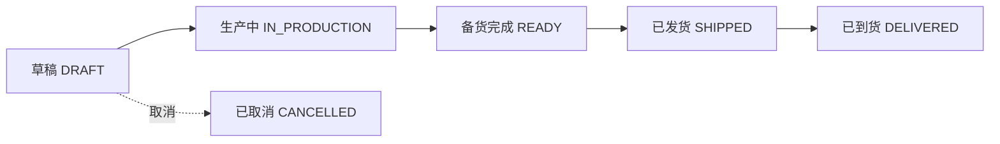
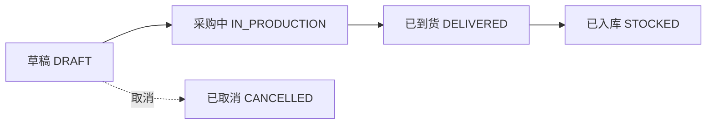

# 采购单模块需求 (Purchase Order)

## 1. 模块概述 (Module Overview)

| 属性         | 说明                                           |
| :----------- | :--------------------------------------------- |
| **模块名称** | 采购单 (Purchase Order / PO)                   |
| **核心价值** | 连接销售订单与供应链，管理供应商对接和生产跟进 |
| **目标用户** | 采购员、客服、供应链主管                       |
| **上游模块** | 订单                                           |
| **下游模块** | 对账单 (AP)                                    |

## 2. 业务场景 (Business Scenario)

### 2.1 典型场景

1. **订单拆单**: 订单创建后自动按供应商和商品类型拆分生成采购单
2. **面料采购**: 面料采购单发送给面料供应商，采购面料原材料
3. **面料入库**: 面料到货后，采购员确认入库，增加面料库存
4. **成品采购**: 成品采购单发送给成品供应商，采购成品商品
5. **供应商下单**: 采购员与供应商确认价格后正式下单
6. **生产跟进**: 跟踪工厂生产进度，确认备货完成
7. **物流回填**: 货物发出后填写物流信息
8. **采购对账**: 定期与供应商核对账款
9. **售后补件**: 售后问题需要重新采购配件 (关联售后工单)

### 2.2 创建规则

- **禁止直接创建**: 采购单模块不提供"新建"按钮
- **唯一来源**: 由订单拆分自动生成
- **售后补件创建**: 售后工单定责为"补件"时，系统自动生成售后补件采购单，并关联售后工单ID
- **类型区分**:
  - 面料采购单 (FABRIC): 供应商为面料供应商，采购面料原材料
  - 成品采购单 (FINISHED): 供应商为成品供应商，采购成品商品
  - 内部备货单 (STOCK): 供应商为"自有仓库" (标品)

## 3. 状态流转 (State Machine)

### 3.1 成品采购单状态流转



| 状态         | 状态码          | 说明         | 触发条件 (Proof of Work)             |
| :----------- | :-------------- | :----------- | :----------------------------------- |
| **草稿**     | `DRAFT`         | 待采购员处理 | 订单拆单时自动生成                   |
| **生产中**   | `IN_PRODUCTION` | 已向工厂下单 | 上传供应商确认截图 或 点击"确认下单" |
| **备货完成** | `READY`         | 工厂生产完毕 | 采购员点击"备货完成"                 |
| **已发货**   | `SHIPPED`       | 物流运输中   | 填入物流公司 + 快递单号              |
| **已到货**   | `DELIVERED`     | 货物签收     | 物流 API 签收 / 人工确认             |
| **已取消**   | `CANCELLED`     | 采购取消     | 关联订单撤单                         |

### 3.2 面料采购单状态流转



| 状态       | 状态码          | 说明               | 触发条件 (Proof of Work)             |
| :--------- | :-------------- | :----------------- | :----------------------------------- |
| **草稿**   | `DRAFT`         | 待采购员处理       | 订单拆单时自动生成                   |
| **采购中** | `IN_PRODUCTION` | 已向面料供应商下单 | 上传供应商确认截图 或 点击"确认下单" |
| **已到货** | `DELIVERED`     | 面料已到货         | 物流签收 / 人工确认                  |
| **已入库** | `STOCKED`       | 面料已入库         | 采购员点击"确认入库"                 |
| **已取消** | `CANCELLED`     | 采购取消           | 关联订单撤单                         |

### 3.3 状态联动 (向上驱动订单)

| 采购单类型 | 采购单状态                   | 订单状态变化条件              |
| :--------- | :--------------------------- | :---------------------------- |
| 成品采购单 | 任一 PO → `IN_PRODUCTION`    | 订单保持/进入 `IN_PRODUCTION` |
| 成品采购单 | **所有** 成品 PO → `READY`   | 订单等待面料加工完成          |
| 面料采购单 | 任一 PO → `IN_PRODUCTION`    | 订单进入 `FABRIC_PURCHASING`  |
| 面料采购单 | **所有** 面料 PO → `STOCKED` | 订单进入 `FABRIC_RECEIVED`    |
| 所有采购单 | **所有** PO 完成             | 订单 → `PENDING_DELIVERY`     |
| 所有采购单 | **所有** PO → `SHIPPED`      | 订单 → `SHIPPED`              |
| 所有采购单 | **所有** PO → `DELIVERED`    | 订单 → `PENDING_INSTALL`      |

## 4. 核心字段定义 (Field Definitions)

### 4.1 采购单主表 (purchase_orders)

| 字段名             | 类型     | 必填 | 说明                                  |
| :----------------- | :------- | :--- | :------------------------------------ |
| id                 | UUID     | ✓    | 主键                                  |
| po_no              | String   | ✓    | 采购单号 (PO20260101001)              |
| order_id           | UUID     | ✓    | 关联订单                              |
| after_sales_id     | UUID     | -    | 关联售后工单 (溯源字段，用于售后补件) |
| supplier_id        | UUID     | ✓    | 关联供应商                            |
| supplier_name      | String   | ✓    | 供应商名称 (冗余)                     |
| type               | Enum     | ✓    | 类型 (EXTERNAL/INTERNAL)              |
| status             | Enum     | ✓    | 状态                                  |
| total_cost         | Decimal  | ✓    | 采购成本总额                          |
| external_po_no     | String   | -    | 外部单号 (工厂方)                     |
| supplier_quote_img | String   | -    | 供应商报价截图 (OSS URL)              |
| sent_method        | Enum     | -    | 发送方式 (WECHAT/EMAIL/SYSTEM)        |
| sent_at            | DateTime | -    | 发送时间                              |
| produced_at        | DateTime | -    | 生产完成时间                          |
| logistics_company  | String   | -    | 物流公司                              |
| logistics_no       | String   | -    | 物流单号                              |
| shipped_at         | DateTime | -    | 发货时间                              |
| delivered_at       | DateTime | -    | 到货时间                              |
| payment_status     | Enum     | ✓    | 付款状态 (PENDING/PARTIAL/PAID)       |
| remark             | Text     | -    | 备注                                  |
| created_by         | UUID     | ✓    | 创建人                                |
| created_at         | DateTime | ✓    | 创建时间                              |

### 4.2 采购单明细表 (po_items)

| 字段名        | 类型    | 必填 | 说明         |
| :------------ | :------ | :--- | :----------- |
| id            | UUID    | ✓    | 主键         |
| po_id         | UUID    | ✓    | 关联采购单   |
| order_item_id | UUID    | ✓    | 关联订单明细 |
| product_id    | UUID    | ✓    | 关联商品     |
| product_name  | String  | ✓    | 商品名称     |
| product_sku   | String  | ✓    | SKU          |
| category      | Enum    | ✓    | 品类         |
| unit_cost     | Decimal | ✓    | 成本单价     |
| quantity      | Decimal | ✓    | 数量         |
| width         | Decimal | -    | 宽度         |
| height        | Decimal | -    | 高度         |
| subtotal      | Decimal | ✓    | 小计 (成本)  |
| remark        | String  | -    | 行备注       |

## 5. 界面设计 (UI Design)

### 5.1 列表页 (PO List)

#### 展示字段

| 字段     | 宽度  | 说明       |
| :------- | :---- | :--------- |
| 采购单号 | 150px | 可点击跳转 |
| 关联订单 | 130px | 可点击跳转 |
| 供应商   | 120px | -          |
| 类型     | 80px  | 外部/内部  |
| 采购金额 | 100px | 右对齐     |
| 状态     | 80px  | 状态标签   |
| 付款状态 | 80px  | 状态标签   |
| 采购员   | 80px  | -          |
| 创建时间 | 130px | -          |
| 操作     | 150px | -          |

#### 状态标签颜色

| 状态     | 颜色 |
| :------- | :--- |
| 草稿     | 灰色 |
| 生产中   | 蓝色 |
| 备货完成 | 橙色 |
| 已发货   | 紫色 |
| 已到货   | 绿色 |
| 已取消   | 红色 |

#### 筛选条件

| 筛选项          | 组件                | 说明                   |
| :-------------- | :------------------ | :--------------------- |
| 时间范围        | `DateRangePicker`   | 默认近 30 天           |
| 状态            | `Select` (多选)     | 全部状态               |
| 供应商          | `Select` (支持搜索) | 供应商列表             |
| 付款状态        | `Select`            | 待付款/部分付款/已付款 |
| 订单号/采购单号 | `Input.Search`      | 模糊搜索               |

#### 操作按钮

| 按钮         | 条件          | 说明             |
| :----------- | :------------ | :--------------- |
| **确认下单** | 状态=草稿     | 进入生产中       |
| **备货完成** | 状态=生产中   | 进入备货完成     |
| **填物流**   | 状态=备货完成 | 弹窗填写物流信息 |
| **确认到货** | 状态=已发货   | 人工确认到货     |

### 5.2 详情页 (PO Detail)

#### 页面布局

```
┌─────────────────────────────────────────────────────┐
│ 采购单详情 #PO20260101001    [确认下单] [填物流]    │
├──────────────────────┬──────────────────────────────┤
│ 基础信息             │ 状态进度条                   │
│ 供应商/订单/成本     │ [草稿→生产→备货→发货→到货]  │
├──────────────────────┴──────────────────────────────┤
│ 商品明细表格                                        │
├─────────────────────────────────────────────────────┤
│ 物流信息 (已发货后显示)                             │
├─────────────────────────────────────────────────────┤
│ 操作日志                                            │
└─────────────────────────────────────────────────────┘
```

#### 基础信息字段

| 字段           | 组件       | 说明                |
| :------------- | :--------- | :------------------ |
| 采购单号       | `Text`     | 只读                |
| 关联订单       | `Link`     | 可点击跳转          |
| 供应商         | `Text`     | 只读                |
| 类型           | `Tag`      | 外部采购/内部备货   |
| 采购成本       | `Text`     | 汇总金额            |
| 外部单号       | `Input`    | 可编辑 (工厂方单号) |
| 供应商确认截图 | `Upload`   | 图片上传            |
| 备注           | `TextArea` | 可编辑              |

#### 商品明细表格

| 列       | 宽度  | 说明      |
| :------- | :---- | :-------- |
| 商品名称 | 200px | -         |
| SKU      | 100px | -         |
| 规格     | 150px | 尺寸/颜色 |
| 成本单价 | 80px  | -         |
| 数量     | 60px  | -         |
| 成本小计 | 100px | -         |

#### 物流信息卡片

| 字段     | 组件         | 说明              |
| :------- | :----------- | :---------------- |
| 物流公司 | `Select`     | 顺丰/德邦/自提... |
| 物流单号 | `Input`      | -                 |
| 发货时间 | `DatePicker` | 默认当前          |

### 5.3 物流填写弹窗

使用 `Modal` 组件：

| 字段     | 组件       | 必填 | 说明             |
| :------- | :--------- | :--- | :--------------- |
| 物流公司 | `Select`   | ✓    | 预置常用物流公司 |
| 物流单号 | `Input`    | ✓    | -                |
| 备注     | `TextArea` | -    | -                |

确认后采购单状态变为"已发货"。

## 6. 业务规则 (Business Rules)

### 6.1 创建规则

- 仅由订单拆单生成
- 标品自动归入"内部备货单"

### 6.2 下单规则

- 从草稿到生产中，需满足以下条件之一：
  - 上传供应商确认截图
  - 或点击"确认下单"按钮
- 下单后商品明细不可修改

### 6.3 备货规则

- 采购员需与工厂确认后点击"备货完成"
- 支持部分备货 (未来扩展)

### 6.4 发货规则

- 必须填写物流公司和物流单号
- 发货后可修改物流信息 (物流变更)
- 支持物流 API 自动查询签收状态

### 6.5 付款联动

- 采购单进入"生产中"后，自动生成 AP 对账记录
- 付款状态由财务模块更新

## 7. 权限控制 (Permission Matrix)

### 7.1 页面级权限

| 页面       | 销售 | 客服 | 采购员 | 财务 | 店长 |
| :--------- | :--- | :--- | :----- | :--- | :--- |
| 采购单列表 | ✗    | ✓    | ✓      | ✓    | ✓    |
| 采购单详情 | ✗    | ✓    | ✓      | ✓    | ✓    |

### 7.2 按钮级权限

| 操作       | 客服 | 采购员     | 财务 | 店长 |
| :--------- | :--- | :--------- | :--- | :--- |
| 确认下单   | ✓    | ✓          | ✗    | ✓    |
| 备货完成   | ✗    | ✓          | ✗    | ✓    |
| 填物流     | ✗    | ✓          | ✗    | ✓    |
| 确认到货   | ✓    | ✓          | ✗    | ✓    |
| 修改成本价 | ✗    | ✓ (需审批) | ✗    | ✓    |

### 7.3 数据范围权限

| 角色             | 可见范围       |
| :--------------- | :------------- |
| 采购员/客服/财务 | 全部采购单     |
| 店长             | 本店所有采购单 |

## 8. 通知与提醒 (Notifications)

| 触发事件        | 通知对象    | 渠道      | 内容               |
| :-------------- | :---------- | :-------- | :----------------- |
| 采购单生成      | 采购员      | 系统+飞书 | 有新采购单待处理   |
| 下单成功        | 采购员      | 系统      | 采购单已下单       |
| 备货完成        | 销售+客服   | 系统      | XXX订单备货完成    |
| 已发货          | 销售        | 系统      | 货物已发出 (单号)  |
| 到货            | 销售        | 系统      | 货物已签收         |
| 生产超时 (>7天) | 采购员+店长 | 系统      | 采购单生产超时预警 |

## 9. 与其他模块的关联 (Module Relations)

| 模块          | 关联方式                            | 数据流向      |
| :------------ | :---------------------------------- | :------------ |
| **订单**      | PO.order_id → Order.id              | 订单 → 采购单 |
| **订单明细**  | POItem.order_item_id → OrderItem.id | -             |
| **供应商**    | PO.supplier_id → Supplier.id        | -             |
| **商品**      | POItem.product_id → Product.id      | -             |
| **对账单-AP** | 生产中时生成 AP 记录                | 采购单 → 对账 |
| **库存**      | 内部备货单扣减库存                  | 采购单 → 库存 |
