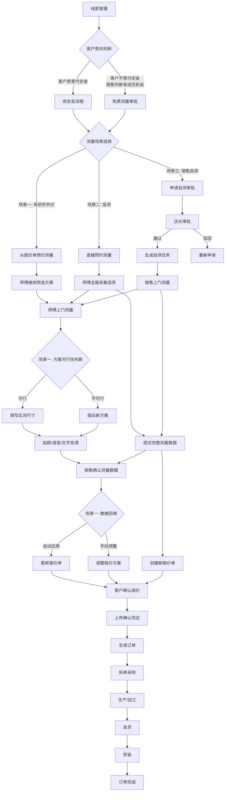
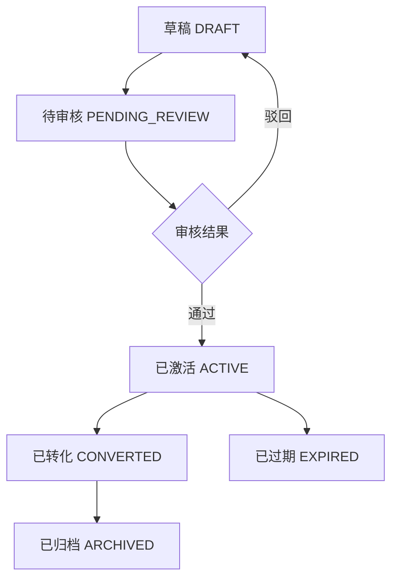
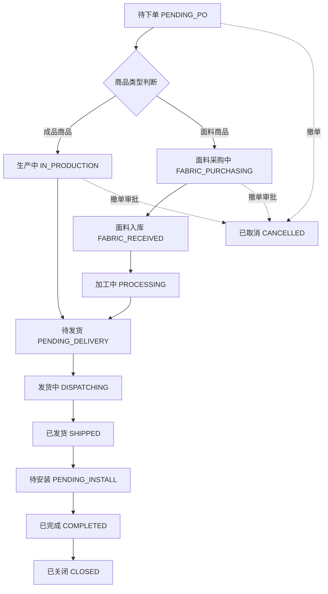
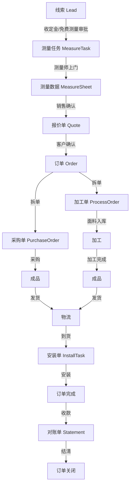

# L2C 全流程详解: 测量 → 报价 → 订单

## 1. 流程总览

本文档详细描述从测量开始,经过报价,最终转化为订单的完整业务流程,确保 L2C 链路的顺畅运作。

### 1.1 三种测量场景流程图



### 1.2 场景对比表

| 维度 | 场景一: 有初步共识 | 场景二: 盲测 | 场景三: 销售自测 |
|:---|:---|:---|:---|
| **业务背景** | 客户和销售已有共识,已有报价单 | 销售对现场一无所知 | 销售自己上门测量 |
| **创建方式** | 从报价单点击"预约测量" | 在线索页点击"预约测量" | 在线索页点击"申请自测" |
| **是否关联报价单** | ✓ 是 | ✗ 否 | 可选 |
| **传递给师傅的信息** | 空间、商品、安装要求、特殊叮嘱 | 仅客户基本信息 | 不适用 |
| **师傅职责** | 验证方案可行性,填写实测尺寸 | 全面采集现场信息 | 不适用 |
| **反馈方式** | 拍照、语音、文字 | 测量数据、照片、建议 | 不适用 |
| **数据回传** | 自动应用到报价单或手动调整 | 销售创建新报价单 | 销售直接创建报价单 |
| **费用** | 测量费 | 测量费 | 车费 (需审批) |
| **审批要求** | 无 | 无 | 店长审批 |

---

## 2. 测量流程

### 2.1 测量准入机制

测量需要满足以下条件之一:

1. **已支付定金**
   - 存在已审核通过的定金收款单
   - 收款单类型为 `PREPAID`,状态为 `VERIFIED`
   - 收款单关联到当前线索

2. **免费测量审批通过**
   - 存在已审批通过的免费测量申请
   - 审批记录类型为 `FREE_MEASURE`,状态为 `APPROVED`
   - 审批记录关联到当前线索

3. **销售自测审批通过**
   - 存在已审批通过的销售自测申请
   - 审批记录类型为 `SALES_SELF_MEASURE`,状态为 `APPROVED`
   - 审批记录关联到当前线索

4. **豁免机制**
   - 租户可配置 `ENABLE_MEASURE_FEE_CHECK = false`
   - 跳过费用检查

### 2.2 测量场景分类

系统支持三种不同的测量场景,每种场景的创建方式、数据流转、师傅权限都有所不同:

#### 场景一: 有初步共识的测量 (Quote-Based Measurement)

**业务背景**
- 客户已经和销售有了初步共识
- 销售已经创建了报价单,包含预选的商品和方案
- 从报价单发起测量,让师傅验证方案可行性

**创建流程**
1. 销售在报价单详情页点击"预约测量"
2. 系统自动提取报价单中的关键信息传递给师傅
3. 派单员确认拆单方案后生成测量任务

**传递给师傅的信息**
- **空间信息**: 房间名称 (客厅、主卧、次卧等)
- **商品信息**: 预选的商品型号、商品图片、幅宽、材质等
- **安装要求**: 安装方式 (顶装/侧装)、拉动形式 (对开/单开/多开)、是否电动
- **特殊叮嘱**: 备注文本 (如:"客户家有老人,确认为智能电动轨道")

**师傅的职责**
1. **方案可行性判断**
   - 到达现场后,检查预选商品是否适配现场环境
   - 例如: 梦幻帘需要更深的窗帘盒,检查现场是否满足
   - 检查是否预留了电机电源 (如果是电动方案)

2. **数据录入**
   - **方案可行**: 直接在对应商品下填写实测尺寸 (宽度、高度等)
   - **方案不可行**: 提出新的测量方案,填写新的尺寸和安装方式

3. **信息反馈**
   - **拍照反馈**: 现场拍摄照片,标注问题点 (如: 窗帘盒深度不足、未留电源)
   - **语音留言**: 录制语音说明现场情况和建议
   - **文字备注**: 填写详细的文字说明

**数据回传机制**
- 师傅提交后,系统自动通知销售
- 销售查看反馈,判断是否需要调整报价方案
- 如果方案可行,系统自动将实测数据应用到报价单
- 如果方案不可行,销售根据师傅反馈调整商品或方案

**核心字段**
- `quote_id`: 关联的报价单 ID
- `quote_version_id`: 关联的报价单版本 ID
- `preselected_products`: 预选商品列表 (JSON)
- `feasibility_feedback`: 方案可行性反馈 (JSON)
- `feedback_photos`: 反馈照片数组 (OSS URL)
- `feedback_audio`: 语音留言 (OSS URL)
- `feedback_text`: 文字备注

#### 场景二: 盲测 (Blind Measurement)

**业务背景**
- 销售对客户现场一无所知
- 需要师傅把现场信息全部带回来
- 师傅需要全面采集现场数据

**创建流程**
1. 销售在线索详情页点击"预约测量"
2. 填写预约时间、测量需求、特殊要求
3. 系统生成测量任务,不关联任何报价单

**师傅的职责**
1. **全面信息采集**
   - 测量所有窗户的尺寸 (宽度、高度)
   - 记录窗型 (直窗、L型、U型、弧形)
   - 记录安装环境 (墙体材质、窗帘盒、电源预留等)
   - 拍摄现场照片 (远景全貌 + 局部细节)

2. **方案建议**
   - 根据现场情况,提供安装建议
   - 例如: 建议顶装或侧装,建议是否需要加收特殊墙体安装费

3. **信息回传**
   - 提交完整的测量数据
   - 提交现场照片
   - 提交方案建议

**数据回传机制**
- 师傅提交后,系统自动通知销售
- 销售查看测量数据和照片
- 销售根据测量数据创建报价单
- 系统支持一键将测量数据导入报价单

**核心字段**
- `quote_id`: null (不关联报价单)
- `measurement_type`: 'BLIND' (盲测)
- `site_photos`: 现场照片数组 (必填)
- `installation_suggestions`: 安装建议 (JSON)

#### 场景三: 销售自测 (Sales Self-Measurement)

**业务背景**
- 销售自己上门测量
- 虽然不会产生测量费用,但是会有外出的车费等
- 需要审批流程控制成本

**创建流程**
1. 销售在线索详情页点击"申请自测"
2. 填写申请理由 (必填,至少20字)
3. 填写预计外出时间、预计车费等
4. 提交审批
5. 店长审批通过后,生成测量任务

**审批流程**
- **申请**: 销售提交自测申请,状态为 `PENDING`
- **审批**: 店长查看申请理由,点击"审批通过"或"审批驳回"
- **审批通过**: 状态变为 `APPROVED`,生成测量任务,测量师为销售本人
- **审批驳回**: 状态变为 `REJECTED`,填写驳回原因,通知销售

**销售的职责**
1. **上门测量**
   - 到达现场,点击"签到打卡"
   - 测量窗户尺寸
   - 拍摄现场照片
   - 记录安装环境

2. **数据录入**
   - 在测量单中填写测量数据
   - 可以直接创建报价单
   - 也可以先保存测量数据,后续再创建报价单

**费用管理**
- **车费报销**: 销售可上传车费凭证 (打车票、油费发票等)
- **审批**: 店长审核车费凭证
- **报销**: 审核通过后,进入财务报销流程

**核心字段**
- `quote_id`: null 或关联报价单 (可选)
- `measurement_type`: 'SALES_SELF' (销售自测)
- `measured_by`: 销售本人 ID
- `approval_request_id`: 关联的审批记录 ID
- `travel_expense`: 车费金额
- `travel_expense_proof`: 车费凭证 (OSS URL)

### 2.3 测量任务创建

#### 触发条件
- 线索状态为"跟踪中"(`FOLLOWING`)
- 满足测量准入条件

#### 创建方式

**方式一: 从报价单转化 (场景一)**
- 在报价单详情页点击"预约测量"
- 系统自动提取报价单信息传递给师傅
- 系统触发拆单方案推荐
- 派单员确认拆单后生成测量任务

**方式二: 直接创建 (场景二)**
- 销售在线索详情页点击"预约测量"
- 填写预约时间、测量需求、特殊要求
- 系统生成测量任务,不关联报价单

**方式三: 销售自测 (场景三)**
- 销售在线索详情页点击"申请自测"
- 填写申请理由、预计外出时间、预计车费
- 提交审批,店长审批通过后生成测量任务

#### 拆单机制
- **触发时机**: 派单员在报价单详情页点击"预约测量" (仅场景一)
- **拆单粒度**: 按品类拆单(窗帘、墙布、墙纸等)
- **系统推荐**: 根据品类和师傅技能自动推荐拆单方案
- **手动调整**: 派单员可添加/移除/替换师傅
- **唯一性**: 一个报价单只能拆单一次

### 2.4 测量任务状态流转


| 状态 | 说明 | 触发动作 | 操作人 |
|:---|:---|:---|:---|
| 待分配 | 初始状态,等待派单 | 线索转化/手动创建 | - |
| 分配中 | 已指派测量师,等待接单 | 派单员选择测量师并点击"指派" | 派单员 |
| 待上门 | 测量师已接单,等待上门 | 测量师点击"接单" | 测量师 |
| 待确认 | 测量完成,等待销售确认 | 测量师提交数据 | 测量师 |
| 已完成 | 销售确认数据无误 | 销售点击"确认" | 销售 |
| 已取消 | 任务终止 | 销售取消预约 | 销售 |

### 2.5 测量数据录入

#### 2.5.1 通用核心字段

**基础信息**
- `lead_id`: 关联线索 ID
- `measure_no`: 测量单号 (例: MS20260101001)
- `measurement_type`: 测量类型 ('QUOTE_BASED'/'BLIND'/'SALES_SELF')
- `measured_by`: 执行测量的师傅 ID (销售自测时为销售本人)
- `check_in_time`: 现场打卡时间
- `check_in_location`: 打卡位置坐标 (Lat/Long/Address)
- `round`: 测量轮次 (1=首次, 2=二次上门...)
- `variant`: 方案分支 (A, B, C...)
- `version_display`: 版本展示号 (例: V1.A, V2.A)

**窗户测量明细**
- `room_name`: 空间名称 (主卧、次卧、客厅)
- `window_type`: 窗型 (直窗、L型、U型、弧形)
- `width`: 窗洞宽度 (mm)
- `height`: 窗洞高度 (mm)
- `install_type`: 安装方式 (顶装、侧装)
- `bracket_dist`: 支架离地高度 (mm)
- `wall_material`: 墙体材质 (混凝土、木质、石膏)
- `has_box`: 是否有窗帘盒
- `box_depth`: 窗帘盒深度 (mm)
- `is_electric`: 是否预留电机电源

**附件与多媒体**
- `site_photos`: 现场照片数组 (OSS URL)
- `sketch_map`: 手绘草图 (可选)

#### 2.5.2 场景一专属字段 (有初步共识)

**预选方案信息**
- `quote_id`: 关联的报价单 ID
- `quote_version_id`: 关联的报价单版本 ID
- `preselected_products`: 预选商品列表 (JSON)
  ```json
  [
    {
      "room_name": "客厅",
      "product_id": "uuid",
      "product_name": "梦幻帘",
      "install_type": "TOP",
      "opening_style": "DOUBLE",
      "is_electric": true,
      "remarks": "客户家有老人,确认为智能电动轨道"
    }
  ]
  ```

**方案可行性反馈**
- `feasibility_feedback`: 方案可行性反馈 (JSON)
  ```json
  {
    "overall_feasible": true,
    "issues": [
      {
        "room_name": "客厅",
        "product_id": "uuid",
        "issue_type": "BOX_DEPTH_INSUFFICIENT",
        "description": "窗帘盒深度只有15cm,梦幻帘需要至少20cm",
        "suggestion": "建议改用香格里拉帘或加深窗帘盒"
      }
    ],
    "suggestions": [
      {
        "room_name": "主卧",
        "suggestion": "建议顶装,侧装会碰到暖气片"
      }
    ]
  }
  ```

**多媒体反馈**
- `feedback_photos`: 反馈照片数组 (OSS URL)
  - 每张照片可标注问题点
  - 支持在照片上画圈、添加文字说明
- `feedback_audio`: 语音留言 (OSS URL)
  - 师傅可录制语音说明现场情况
  - 支持最长60秒的语音留言
- `feedback_text`: 文字备注
  - 师傅可填写详细的文字说明
  - 支持富文本格式

#### 2.5.3 场景二专属字段 (盲测)

**全面采集信息**
- `site_photos`: 现场照片数组 (必填)
  - 远景全貌图: 展示整个空间布局
  - 局部细节图: 每个窗户的细节
  - 环境照片: 墙体材质、窗帘盒、电源等
- `installation_suggestions`: 安装建议 (JSON)
  ```json
  [
    {
      "room_name": "客厅",
      "suggestion_type": "INSTALL_POSITION",
      "description": "建议顶装,侧装会碰到暖气片",
      "reason": "暖气片距离窗户太近"
    },
    {
      "room_name": "主卧",
      "suggestion_type": "SPECIAL_FEE",
      "description": "墙体为空心砖,需要加收特殊墙体安装费",
      "reason": "空心砖墙体需要使用特殊膨胀螺丝"
    }
  ]
  ```

#### 2.5.4 场景三专属字段 (销售自测)

**审批信息**
- `approval_request_id`: 关联的审批记录 ID
- `approval_status`: 审批状态 ('PENDING'/'APPROVED'/'REJECTED')

**费用管理**
- `travel_expense`: 车费金额 (Decimal)
- `travel_expense_proof`: 车费凭证 (OSS URL)
  - 支持上传打车票、油费发票等
  - 支持多张凭证
- `travel_expense_status`: 车费报销状态 ('PENDING'/'APPROVED'/'REJECTED')
- `travel_expense_approved_by`: 车费审批人 ID
- `travel_expense_approved_at`: 车费审批时间

#### 2.5.5 数据完整性规则

**通用规则**
- 每个空间必须至少录入一组 width 和 height
- L型或U型窗必须录入转角分段尺寸
- 每个窗户明细必须关联至少一张现场实景照片

**场景一规则**
- 必须填写方案可行性反馈
- 如果方案不可行,必须提出新的测量方案
- 反馈照片至少包含问题点的标注

**场景二规则**
- 现场照片必须包含远景全貌图和局部细节图
- 必须填写安装建议

**场景三规则**
- 车费凭证必须清晰可识别
- 车费金额必须与申请时的预计金额基本一致 (误差不超过20%)

### 2.6 现场考核

- **签到打卡**: 测量师/销售到达现场必须点击"签到打卡"
- **GPS验证**: 打卡位置需在客户地址方圆 500m 内
- **准时率考核**: 系统自动校验 `check_in_time` 与 `appointment_time`,判定是否迟到
- **照片质量**: 现场照片必须清晰可识别,模糊照片需重新拍摄

### 2.7 多版本体系

系统支持 `Round (轮次)` + `Variant (方案)` 的双层版本控制:

1. **多方案 (Alternative Options)**
   - 同一个窗户,师傅可提交多种安装建议
   - 例如: V1.A 建议顶装, V1.B 建议侧装
   - 支持针对不同方案分别生成报价单
   - 一个测量任务可对应多个测量方案 (Variant A, B)
   - 针对同一个 Variant A,销售还可以创建多份报价单 (Quote A1-高配, Quote A2-低配)

2. **重测/迭代 (Re-measurement)**
   - 若方案不满意或需二次上门,生成新轮次 (V2.A)
   - 历史轮次 (V1.x) 自动归档,仅作查看

### 2.8 数据回传与确认机制

#### 2.8.1 场景一: 有初步共识

**数据回传流程**
1. 师傅提交测量数据和反馈信息
2. 系统自动通知销售
3. 销售查看反馈信息
4. 系统询问销售:"是否将实测数据应用到报价单?"

**数据回填机制**
- **自动匹配**: 根据 `room_name` 自动匹配报价单中的商品
- **手动关联**: 如果无法自动匹配,销售可手动关联
- **数据覆盖**: 实测数据覆盖报价单中的预估数据
- **方案调整**: 如果方案不可行,销售根据师傅反馈调整商品或方案

**确认流程**
- 销售确认数据无误,点击"确认"
- 测量任务状态变为"已完成"
- 报价单自动更新为"待审核"
- 如果需要调整,销售可先调整报价单,再确认测量数据

#### 2.8.2 场景二: 盲测

**数据回传流程**
1. 师傅提交完整的测量数据和照片
2. 系统自动通知销售
3. 销售查看测量数据和照片
4. 销售根据测量数据创建报价单

**数据导入机制**
- **一键导入**: 销售可一键将测量数据导入到新报价单
- **智能匹配**: 系统根据测量数据推荐合适的商品
- **手动调整**: 销售可手动调整商品和方案

**确认流程**
- 销售确认数据无误,点击"确认"
- 测量任务状态变为"已完成"
- 销售可继续创建报价单

#### 2.8.3 场景三: 销售自测

**数据回传流程**
1. 销售提交测量数据和照片
2. 系统自动保存测量数据
3. 销售可直接创建报价单

**数据导入机制**
- **自动导入**: 销售创建报价单时,系统自动导入测量数据
- **手动调整**: 销售可手动调整商品和方案

**确认流程**
- 销售确认数据无误,点击"确认"
- 测量任务状态变为"已完成"
- 销售可继续创建报价单

### 2.11 多次测量场景

#### 2.11.1 多次测量的业务背景

在实际业务中,经常出现需要多次测量的情况,主要原因包括:

1. **初测不精准**
   - 去得太早: 工地还在硬装阶段,窗户位置、尺寸可能还会变化
   - 工地变化: 后期装修过程中,窗户位置、尺寸发生变化
   - 测量误差: 第一次测量时数据记录不准确

2. **分批购买**
   - 第一次只买一部分 (如: 先买窗帘,后买墙布)
   - 第二次购买其余部分
   - 需要再次测量新购买的部分

3. **方案调整**
   - 客户对第一次方案不满意
   - 需要重新测量,提供新的方案
   - 可能涉及多次上门测量

#### 2.11.2 多次测量的版本管理

系统通过 `Round (轮次)` + `Variant (方案)` 的双层版本控制来管理多次测量:

**Round (轮次)**
- `Round 1`: 第一次测量
- `Round 2`: 第二次测量
- `Round 3`: 第三次测量
- 以此类推...

**Variant (方案)**
- `Variant A`: 方案A (如: 顶装方案)
- `Variant B`: 方案B (如: 侧装方案)
- `Variant C`: 方案C (如: 混合方案)
- 以此类推...

**版本标识**
- `V1.A`: 第一轮测量,方案A
- `V1.B`: 第一轮测量,方案B
- `V2.A`: 第二轮测量,方案A
- `V2.B`: 第二轮测量,方案B
- 以此类推...

#### 2.11.3 多次测量的触发条件

**场景一: 初测不精准**

**触发条件**
- 销售发现测量数据不准确
- 客户反馈现场情况发生变化
- 测量师发现数据有误

**处理流程**
1. 销售在测量单详情页点击"申请重测"
2. 填写重测原因 (必填)
  - 例如: "工地还在硬装阶段,窗户位置可能会变化"
  - 例如: "客户反馈墙体刚做了改动,需要重新测量"
3. 选择重测范围
  - 全部重测: 所有空间都重新测量
  - 部分重测: 选择需要重新测量的空间
4. 提交重测申请
5. 系统生成新的测量任务 (Round + 1)
6. 历史轮次自动归档,仅作查看
7. 测量师上门重新测量
8. 提交新的测量数据

**核心字段**
- `round`: 测量轮次 (自动递增)
- `parent_id`: 上一轮测量的 ID
- `remeasure_reason`: 重测原因
- `remeasure_scope`: 重测范围 ('ALL'/'PARTIAL')
- `remeasure_rooms`: 重测空间列表 (JSON)

**场景二: 分批购买**

**触发条件**
- 客户第一次只购买部分商品
- 后续需要购买其余部分
- 需要再次测量新购买的部分

**处理流程**
1. 第一次测量和购买
   - 测量师上门测量
   - 销售创建报价单 (包含第一次购买的商品)
   - 客户确认,生成订单
   - 订单完成后,测量任务归档

2. 第二次测量
   - 销售在线索详情页点击"预约测量"
   - 选择测量类型: "分批购买 - 第二次测量"
   - 选择需要测量的空间
   - 填写测量需求
   - 系统生成新的测量任务 (Round 2)
   - 测量师上门测量新购买的部分
   - 提交新的测量数据

3. 创建新的报价单
   - 销售基于第二次测量数据创建新的报价单
   - 包含第二次购买的商品
   - 客户确认,生成新的订单

**核心字段**
- `round`: 测量轮次 (自动递增)
- `parent_id`: 上一轮测量的 ID
- `measurement_type`: 'PARTIAL_PURCHASE'
- `partial_purchase_info`: 分批购买信息 (JSON)
  ```json
  {
    "purchase_round": 2,
    "previous_order_id": "uuid",
    "measured_rooms": ["客厅", "主卧"],
    "not_measured_rooms": ["次卧"]
  }
  ```

**场景三: 方案调整**

**触发条件**
- 客户对第一次方案不满意
- 需要重新测量,提供新的方案
- 可能涉及多次上门测量

**处理流程**
1. 第一次测量和方案
   - 测量师上门测量
   - 提交方案A (V1.A)
   - 销售创建报价单 (基于方案A)
   - 客户不满意

2. 第二次测量
   - 销售在测量单详情页点击"申请新方案"
   - 填写新方案需求 (必填)
   - 提交申请
   - 系统生成新的测量任务 (Round 2, Variant A)
   - 测量师上门重新测量
   - 提交新的方案A (V2.A)

3. 或者,在第一轮测量中提交多个方案
   - 测量师提交方案A (V1.A) 和方案B (V1.B)
   - 销售创建两份报价单 (基于方案A和方案B)
   - 客户选择方案B
   - 基于方案B生成订单

**核心字段**
- `round`: 测量轮次
- `variant`: 方案分支
- `parent_id`: 上一轮测量的 ID
- `new_scheme_request`: 新方案需求 (JSON)

#### 2.11.4 多次测量的数据管理

**历史数据归档**
- 历史轮次自动归档,仅作查看
- 归档的数据不能修改
- 可以查看历史测量数据和照片
- 可以查看历史报价单

**数据对比**
- 支持对比不同轮次的测量数据
- 支持对比不同方案的测量数据
- 高亮显示差异部分
- 方便销售和测量师分析变化

**数据继承**
- 新一轮测量可以继承上一轮的数据
- 销售可以选择需要继承的数据
- 未继承的数据需要重新测量
- 继承的数据可以修改

**数据版本控制**
- 每次测量生成新版本
- 保留所有历史版本
- 转化订单时锁定版本
- 订单关联的测量版本不能修改

#### 2.11.5 多次测量的费用管理

**初测不精准**
- 如果是初测不精准导致需要重测,不额外收费
- 费用由公司承担
- 记录重测原因,用于分析改进

**分批购买**
- 每次测量单独收费
- 第一次测量收费
- 第二次测量收费
- 以此类推...

**方案调整**
- 如果是方案调整导致需要重测,不额外收费
- 费用由公司承担
- 记录调整原因,用于分析改进

### 2.12 销售与测量之间的信息交流

#### 2.12.1 信息交流的重要性

销售与测量之间的信息交流是整个流程的关键环节,直接影响:
- 测量的准确性
- 报价的准确性
- 客户满意度
- 订单转化率

#### 2.12.2 信息交流的内容

**销售 → 测量的信息**

1. **客户基本信息**
   - 姓名、电话、地址
   - 预约时间
   - 特殊要求

2. **预选方案信息** (场景一)
   - 空间名称
   - 商品信息 (型号、图片、规格)
   - 安装要求 (安装方式、拉动形式、是否电动)
   - 特殊叮嘱

3. **测量需求**
   - 测量范围 (全部空间/部分空间)
   - 测量重点
   - 客户关注点

4. **历史信息**
   - 是否有历史测量记录
   - 历史测量数据
   - 历史报价单

**测量 → 销售的信息**

1. **测量数据**
   - 空间名称
   - 窗型、尺寸
   - 安装环境

2. **方案可行性反馈** (场景一)
   - 方案是否可行
   - 问题类型
   - 详细说明
   - 建议

3. **现场照片**
   - 远景全貌图
   - 局部细节图
   - 问题点标注

4. **安装建议** (场景二)
   - 安装位置建议
   - 特殊费用建议
   - 商品推荐建议

5. **多媒体反馈**
   - 语音留言
   - 文字备注
   - 手绘草图

#### 2.12.3 信息交流的机制

**下行信息传递 (销售 → 测量)**

1. **自动传递**
   - 从报价单创建测量任务时,系统自动提取报价单信息
   - 包括: 空间、商品、安装要求、特殊叮嘱
   - 传递给测量师

2. **手动补充**
   - 销售可以手动补充测量需求
   - 填写测量重点、客户关注点
   - 上传参考图片

3. **实时更新**
   - 销售修改报价单后,系统自动通知测量师
   - 测量师可以查看最新的报价单信息

**上行信息传递 (测量 → 销售)**

1. **自动通知**
   - 测量师提交数据后,系统自动通知销售
   - 包括: 测量数据、照片、反馈信息

2. **实时查看**
   - 销售可以实时查看测量师的工作进度
   - 包括: 是否签到、是否提交数据

3. **多渠道反馈**
   - 拍照反馈: 现场拍摄照片,标注问题点
   - 语音留言: 录制语音说明现场情况
   - 文字备注: 填写详细的文字说明

**双向交流**

1. **在线沟通**
   - 支持销售和测量师在线聊天
   - 支持发送文字、图片、语音
   - 聊天记录保存在测量单中

2. **电话沟通**
   - 支持一键拨打测量师电话
   - 通话记录保存在测量单中

3. **现场沟通**
   - 测量师上门时,销售可以陪同
   - 现场沟通测量需求
   - 现场确认测量数据

#### 2.12.4 信息准确性保障

**数据验证**

1. **测量数据验证**
   - 尺寸极端值检查 (宽度 > 10,000mm 或高度 > 6,000mm)
   - 数据完整性检查 (每个空间必须至少录入一组 width 和 height)
   - 照片完整性检查 (每个窗户明细必须关联至少一张现场实景照片)

2. **方案可行性验证**
   - 检查方案是否与现场环境匹配
   - 检查是否满足商品安装要求
   - 检查是否预留了必要的条件 (如: 电源、窗帘盒深度)

3. **信息一致性验证**
   - 检查测量数据与预选方案是否一致
   - 检查测量数据与历史数据是否一致
   - 高亮显示差异部分

**信息确认**

1. **销售确认**
   - 测量师提交数据后,销售必须确认
   - 确认前可以查看所有测量数据和照片
   - 确认后测量任务状态变为"已完成"

2. **客户确认**
   - 销售可以将测量数据展示给客户
   - 客户确认后,销售再创建报价单
   - 避免因客户不满意导致重新测量

3. **测量师确认**
   - 测量师提交数据前,可以预览
   - 确认无误后再提交
   - 避免因数据错误导致驳回

**信息追溯**

1. **操作日志**
   - 记录所有操作日志
   - 包括: 创建、修改、确认、驳回
   - 记录操作人、操作时间、操作内容

2. **版本历史**
   - 保留所有测量版本
   - 可以查看历史测量数据
   - 可以对比不同版本的数据

3. **沟通记录**
   - 保留所有沟通记录
   - 包括: 在线聊天、电话通话、现场沟通
   - 方便追溯问题原因

#### 2.12.5 信息交流的最佳实践

**销售端**

1. **提供详细的需求**
   - 清楚说明测量范围和重点
   - 提供客户的特殊要求
   - 上传参考图片

2. **及时反馈**
   - 收到测量数据后,及时确认
   - 发现问题及时反馈给测量师
   - 避免因延误导致需要重测

3. **保持沟通**
   - 测量师上门前,提前沟通
   - 测量过程中,保持联系
   - 测量完成后,及时确认

**测量师端**

1. **仔细阅读需求**
   - 上门前,仔细阅读销售提供的测量需求
   - 理解预选方案的安装要求
   - 确认测量范围和重点

2. **准确记录数据**
   - 使用专业的测量工具
   - 准确记录所有尺寸
   - 拍摄清晰的照片

3. **及时反馈**
   - 发现问题及时反馈给销售
   - 提供专业的建议
   - 避免因延误导致客户不满意

### 2.13 测量异常处理

| 当前状态 | 可驳回至 | 触发场景 | 操作人 |
|:---|:---|:---|:---|
| 待确认 | 待上门 | 销售发现数据有误,要求重测 | 销售 |
| 待上门 | 分配中 | 工人临时有事无法上门 | 工人/派单员 |
| 分配中 | 待分配 | 工人拒绝接单 / 派单员取消指派 | 工人/派单员 |

**驳回规则**:
- 必填驳回原因,记录到操作日志
- 从"待确认"驳回到"待上门"时,关联的 Measure Sheet 状态重置为 `DRAFT`
- 驳回后自动通知相关人员
- 同一任务累计驳回次数 ≥ 3 次时,自动升级预警给店长

### 2.10 测量界面设计

#### 2.10.1 场景一: 有初步共识 - 师傅端界面

**任务列表页**
```
┌─────────────────────────────────────────────────────┐
│ 测量任务列表                                      │
├─────────────────────────────────────────────────────┤
│ [任务1] 客户: 张三 - 阳光小区1栋2单元301         │
│   类型: 有初步共识 (基于报价单)                    │
│   预选商品: 梦幻帘、香格里拉帘                   │
│   预约时间: 2026-01-15 14:00                    │
│   状态: 待上门                                   │
│   [接单] [查看详情]                               │
├─────────────────────────────────────────────────────┤
│ [任务2] 客户: 李四 - 花园小区3栋1单元501         │
│   类型: 有初步共识 (基于报价单)                    │
│   预选商品: 窗帘布、窗帘纱                       │
│   预约时间: 2026-01-15 16:00                    │
│   状态: 待上门                                   │
│   [接单] [查看详情]                               │
└─────────────────────────────────────────────────────┘
```

**任务详情页**
```
┌─────────────────────────────────────────────────────┐
│ 测量任务详情 #MS20260101001                      │
├─────────────────────────────────────────────────────┤
│ 客户信息                                         │
│ 姓名: 张三  电话: 13800138000                     │
│ 地址: 阳光小区1栋2单元301                        │
├─────────────────────────────────────────────────────┤
│ 预选方案 (来自报价单)                            │
│ ┌───────────────────────────────────────────────┐  │
│ │ 客厅 - 梦幻帘                               │  │
│ │ 商品图片: [图片]                             │  │
│ │ 安装方式: 顶装  拉动形式: 对开              │  │
│ │ 是否电动: ✓ 是                               │  │
│ │ 备注: 客户家有老人,确认为智能电动轨道         │  │
│ │ [查看商品详情]                               │  │
│ └───────────────────────────────────────────────┘  │
│ ┌───────────────────────────────────────────────┐  │
│ │ 主卧 - 香格里拉帘                            │  │
│ │ 商品图片: [图片]                             │  │
│ │ 安装方式: 顶装  拉动形式: 对开              │  │
│ │ 是否电动: ✗ 否                               │  │
│ │ [查看商品详情]                               │  │
│ └───────────────────────────────────────────────┘  │
├─────────────────────────────────────────────────────┤
│ 现场测量                                         │
│ ┌───────────────────────────────────────────────┐  │
│ │ 客厅 - 梦幻帘                               │  │
│ │ 方案可行性: [○ 可行  ● 不可行]             │  │
│ │                                           │  │
│ │ 若不可行,请说明原因:                        │  │
│ │ [下拉选择: 窗帘盒深度不足]                  │  │
│ │ [详细说明: 窗帘盒深度只有15cm,梦幻帘需要...] │  │
│ │                                           │  │
│ │ 测量尺寸:                                  │  │
│ │ 宽度: [3000] mm  高度: [2500] mm          │  │
│ │                                           │  │
│ │ 现场照片:                                  │  │
│ │ [+] 添加照片 (至少1张)                      │  │
│ │                                           │  │
│ │ 反馈方式:                                  │  │
│ │ [拍照反馈] [语音留言] [文字备注]            │  │
│ └───────────────────────────────────────────────┘  │
├─────────────────────────────────────────────────────┤
│ [签到打卡] [保存草稿] [提交测量]                   │
└─────────────────────────────────────────────────────┘
```

**方案可行性反馈弹窗**
```
┌─────────────────────────────────────────────────────┐
│ 方案可行性反馈                                    │
├─────────────────────────────────────────────────────┤
│ 客厅 - 梦幻帘                                    │
│                                                   │
│ 问题类型:                                         │
│ [● 窗帘盒深度不足] [○ 未留电源] [○ 其他]         │
│                                                   │
│ 详细说明:                                         │
│ ┌─────────────────────────────────────────────┐    │
│ │ 窗帘盒深度只有15cm,梦幻帘需要至少20cm。    │    │
│ │ 建议改用香格里拉帘或加深窗帘盒。          │    │
│ └─────────────────────────────────────────────┘    │
│                                                   │
│ 现场照片:                                        │
│ [+] 添加照片 (标注问题点)                         │
│                                                   │
│ 语音留言:                                        │
│ [🎤 录制语音] (最长60秒)                          │
│                                                   │
│ 文字备注:                                        │
│ ┌─────────────────────────────────────────────┐    │
│ │                                           │    │
│ └─────────────────────────────────────────────┘    │
│                                                   │
│ [取消] [提交反馈]                                  │
└─────────────────────────────────────────────────────┘
```

#### 2.10.2 场景二: 盲测 - 师傅端界面

**任务列表页**
```
┌─────────────────────────────────────────────────────┐
│ 测量任务列表                                      │
├─────────────────────────────────────────────────────┤
│ [任务1] 客户: 王五 - 幸福小区5栋3单元602         │
│   类型: 盲测 (无预选方案)                         │
│   预约时间: 2026-01-15 10:00                     │
│   状态: 待上门                                   │
│   [接单] [查看详情]                               │
├─────────────────────────────────────────────────────┤
│ [任务2] 客户: 赵六 - 快乐小区2栋1单元301         │
│   类型: 盲测 (无预选方案)                         │
│   预约时间: 2026-01-15 14:00                     │
│   状态: 待上门                                   │
│   [接单] [查看详情]                               │
└─────────────────────────────────────────────────────┘
```

**任务详情页**
```
┌─────────────────────────────────────────────────────┐
│ 测量任务详情 #MS20260101002                      │
├─────────────────────────────────────────────────────┤
│ 客户信息                                         │
│ 姓名: 王五  电话: 13900139000                     │
│ 地址: 幸福小区5栋3单元602                        │
│ 特殊要求: 客户希望尽快安装,时间比较紧             │
├─────────────────────────────────────────────────────┤
│ 现场测量                                         │
│ ┌───────────────────────────────────────────────┐  │
│ │ 空间1: 客厅                                 │  │
│ │ 窗型: [直窗] [L型] [U型] [弧形]            │  │
│ │ 测量尺寸:                                  │  │
│ │ 宽度: [3000] mm  高度: [2500] mm          │  │
│ │                                           │  │
│ │ 安装环境:                                  │  │
│ │ 墙体材质: [混凝土] [木质] [石膏]           │  │
│ │ 是否有窗帘盒: [○ 是  ● 否]               │  │
│ │ 窗帘盒深度: [___] mm                      │  │
│ │ 是否预留电源: [○ 是  ● 否]               │  │
│ │                                           │  │
│ │ 现场照片:                                  │  │
│ │ [+] 添加照片 (远景全貌 + 局部细节)        │  │
│ │                                           │  │
│ │ 安装建议:                                  │  │
│ │ [+] 添加建议                               │  │
│ └───────────────────────────────────────────────┘  │
│ [+] 添加空间                                     │
├─────────────────────────────────────────────────────┤
│ [签到打卡] [保存草稿] [提交测量]                   │
└─────────────────────────────────────────────────────┘
```

**安装建议弹窗**
```
┌─────────────────────────────────────────────────────┐
│ 安装建议                                          │
├─────────────────────────────────────────────────────┤
│ 空间: 客厅                                        │
│                                                   │
│ 建议类型:                                         │
│ [● 安装位置] [○ 特殊费用] [○ 商品推荐] [○ 其他]   │
│                                                   │
│ 建议说明:                                         │
│ ┌─────────────────────────────────────────────┐    │
│ │ 建议顶装,侧装会碰到暖气片。                │    │
│ │ 暖气片距离窗户太近,只有10cm。            │    │
│ └─────────────────────────────────────────────┘    │
│                                                   │
│ 原因说明:                                         │
│ ┌─────────────────────────────────────────────┐    │
│ │ 暖气片位置固定,无法移动。                 │    │
│ └─────────────────────────────────────────────┘    │
│                                                   │
│ 现场照片:                                        │
│ [+] 添加照片 (标注暖气片位置)                      │
│                                                   │
│ [取消] [提交建议]                                  │
└─────────────────────────────────────────────────────┘
```

#### 2.10.3 场景三: 销售自测 - 销售端界面

**申请自测页面**
```
┌─────────────────────────────────────────────────────┐
│ 申请自测                                          │
├─────────────────────────────────────────────────────┤
│ 线索信息                                         │
│ 客户: 孙七  电话: 13700137000                     │
│ 地址: 美丽小区8栋2单元401                        │
├─────────────────────────────────────────────────────┤
│ 申请信息                                         │
│ 申请理由: * (至少20字)                            │
│ ┌─────────────────────────────────────────────┐    │
│ │ 客户时间比较紧,希望尽快上门测量。         │    │
│ │ 客户距离门店较近,我可以自己过去。         │    │
│ └─────────────────────────────────────────────┘    │
│                                                   │
│ 预计外出时间:                                     │
│ [2026-01-15] [10:00]                             │
│                                                   │
│ 预计车费:                                         │
│ [50] 元                                          │
│                                                   │
│ 车费说明:                                         │
│ ┌─────────────────────────────────────────────┐    │
│ │ 打车往返,预计50元。                       │    │
│ └─────────────────────────────────────────────┘    │
├─────────────────────────────────────────────────────┤
│ [取消] [提交申请]                                  │
└─────────────────────────────────────────────────────┘
```

**测量任务页面 (销售端)**
```
┌─────────────────────────────────────────────────────┐
│ 测量任务详情 #MS20260101003                      │
├─────────────────────────────────────────────────────┤
│ 客户信息                                         │
│ 姓名: 孙七  电话: 13700137000                     │
│ 地址: 美丽小区8栋2单元401                        │
│ 测量人: 本人 (销售A)                             │
├─────────────────────────────────────────────────────┤
│ 现场测量                                         │
│ ┌───────────────────────────────────────────────┐  │
│ │ 空间1: 客厅                                 │  │
│ │ 窗型: [直窗] [L型] [U型] [弧形]            │  │
│ │ 测量尺寸:                                  │  │
│ │ 宽度: [3000] mm  高度: [2500] mm          │  │
│ │                                           │  │
│ │ 安装环境:                                  │  │
│ │ 墙体材质: [混凝土] [木质] [石膏]           │  │
│ │ 是否有窗帘盒: [○ 是  ● 否]               │  │
│ │ 窗帘盒深度: [___] mm                      │  │
│ │ 是否预留电源: [○ 是  ● 否]               │  │
│ │                                           │  │
│ │ 现场照片:                                  │  │
│ │ [+] 添加照片                               │  │
│ └───────────────────────────────────────────────┘  │
│ [+] 添加空间                                     │
├─────────────────────────────────────────────────────┤
│ 车费报销                                         │
│ 车费金额: [50] 元                                │
│ 车费凭证:                                         │
│ [+] 上传凭证 (打车票、油费发票等)                 │
├─────────────────────────────────────────────────────┤
│ [签到打卡] [保存草稿] [提交测量] [创建报价单]      │
└─────────────────────────────────────────────────────┘
```

#### 2.10.4 销售端 - 测量数据确认页面

**场景一: 有初步共识**
```
┌─────────────────────────────────────────────────────┐
│ 测量数据确认 #MS20260101001                      │
├─────────────────────────────────────────────────────┤
│ 师傅反馈                                         │
│ ┌───────────────────────────────────────────────┐  │
│ │ 客厅 - 梦幻帘                               │  │
│ │ 方案可行性: ✗ 不可行                        │  │
│ │ 问题类型: 窗帘盒深度不足                    │  │
│ │ 详细说明: 窗帘盒深度只有15cm,梦幻帘需要...  │  │
│ │                                           │  │
│ │ 现场照片:                                  │  │
│ │ [照片1] [照片2] [照片3]                    │  │
│ │                                           │  │
│ │ 语音留言: [▶ 播放] (30秒)                 │  │
│ │                                           │  │
│ │ 文字备注: 建议改用香格里拉帘或加深窗帘盒。  │  │
│ └───────────────────────────────────────────────┘  │
├─────────────────────────────────────────────────────┤
│ 测量数据                                         │
│ ┌───────────────────────────────────────────────┐  │
│ │ 客厅 - 梦幻帘                               │  │
│ │ 宽度: 3000 mm  高度: 2500 mm              │  │
│ └───────────────────────────────────────────────┘  │
├─────────────────────────────────────────────────────┤
│ 报价单关联                                       │
│ 关联报价单: #QT20260101001                       │
│                                                   │
│ 是否将实测数据应用到报价单?                        │
│ [● 自动应用] [○ 手动调整]                        │
│                                                   │
│ 如果方案不可行,是否需要调整报价单?                 │
│ [● 是,根据师傅反馈调整] [○ 否,保持原方案]       │
├─────────────────────────────────────────────────────┤
│ [驳回重测] [确认测量] [查看报价单]                 │
└─────────────────────────────────────────────────────┘
```

**场景二: 盲测**
```
┌─────────────────────────────────────────────────────┐
│ 测量数据确认 #MS20260101002                      │
├─────────────────────────────────────────────────────┤
│ 测量数据                                         │
│ ┌───────────────────────────────────────────────┐  │
│ │ 空间1: 客厅                                 │  │
│ │ 窗型: 直窗                                   │  │
│ │ 宽度: 3000 mm  高度: 2500 mm              │  │
│ │ 墙体材质: 混凝土                            │  │
│ │ 是否有窗帘盒: 否                             │  │
│ │ 是否预留电源: 是                             │  │
│ │                                           │  │
│ │ 现场照片:                                  │  │
│ │ [照片1] [照片2] [照片3]                    │  │
│ └───────────────────────────────────────────────┘  │
├─────────────────────────────────────────────────────┤
│ 安装建议                                         │
│ ┌───────────────────────────────────────────────┐  │
│ │ 客厅 - 安装位置                            │  │
│ │ 建议: 建议顶装,侧装会碰到暖气片。          │  │
│ │ 原因: 暖气片距离窗户太近,只有10cm。        │  │
│ └───────────────────────────────────────────────┘  │
├─────────────────────────────────────────────────────┤
│ 报价单创建                                       │
│ 是否基于此测量数据创建报价单?                      │
│ [● 是,一键导入测量数据] [○ 否,稍后创建]        │
├─────────────────────────────────────────────────────┤
│ [驳回重测] [确认测量] [创建报价单]               │
└─────────────────────────────────────────────────────┘
```

**场景三: 销售自测**
```
┌─────────────────────────────────────────────────────┐
│ 测量数据确认 #MS20260101003                      │
├─────────────────────────────────────────────────────┤
│ 测量数据                                         │
│ ┌───────────────────────────────────────────────┐  │
│ │ 空间1: 客厅                                 │  │
│ │ 窗型: 直窗                                   │  │
│ │ 宽度: 3000 mm  高度: 2500 mm              │  │
│ │ 墙体材质: 混凝土                            │  │
│ │ 是否有窗帘盒: 否                             │  │
│ │ 是否预留电源: 是                             │  │
│ │                                           │  │
│ │ 现场照片:                                  │  │
│ │ [照片1] [照片2]                            │  │
│ └───────────────────────────────────────────────┘  │
├─────────────────────────────────────────────────────┤
│ 车费报销                                         │
│ 车费金额: 50 元                                  │
│ 车费凭证: [凭证1] [凭证2]                        │
│ 报销状态: 待审核                                  │
├─────────────────────────────────────────────────────┤
│ 报价单创建                                       │
│ 是否基于此测量数据创建报价单?                      │
│ [● 是,自动导入测量数据] [○ 否,稍后创建]         │
├─────────────────────────────────────────────────────┤
│ [修改测量] [确认测量] [创建报价单]                │
└─────────────────────────────────────────────────────┘
```

---

## 3. 报价流程

### 3.1 报价单创建

#### 触发条件
- 测量任务状态为"已完成"(`COMPLETED`)
- 销售确认测量数据无误

#### 创建方式

**方式一: 从测量单转化 (适用于所有场景)**
- 在测量单详情页点击"转报价"
- 系统自动带入测量数据
- 支持选择不同测量方案 (Variant A/B)

**方式二: 直接创建 (适用于场景二和场景三)**
- 销售手动创建报价单
- 手动录入或导入测量数据

**方式三: 从报价单更新 (适用于场景一)**
- 在测量单详情页点击"应用到报价单"
- 系统自动将实测数据应用到关联的报价单
- 实测数据覆盖报价单中的预估数据

#### 不同场景的报价创建特点

**场景一: 有初步共识**
- 报价单已存在,只需更新测量数据
- 系统自动匹配房间和商品
- 支持方案可行性反馈的查看和处理
- 如果方案不可行,销售可根据师傅反馈调整商品或方案

**场景二: 盲测**
- 需要创建新的报价单
- 系统提供"一键导入"功能,将测量数据导入报价单
- 系统根据测量数据智能推荐合适的商品
- 销售可手动调整商品和方案

**场景三: 销售自测**
- 销售可直接创建报价单
- 系统自动导入测量数据
- 销售可手动调整商品和方案

### 3.2 报价单模式

系统支持两种报价模式:

#### 快速报价模式 (默认)
- **目标**: 追求快速报价,减少录入步骤
- **适用场景**: 初次沟通、快速预算、简单户型、价格敏感型客户
- **特点**: 仅展示核心必填字段,隐藏非关键专业信息
- **默认字段**: 空间、商品型号、商品图片、测量宽度、测量高度、拉动形式、数量、单价、金额

#### 高级报价模式
- **目标**: 提供完整的专业报价方案
- **适用场景**: 正式报价、复杂户型、设计师合作、高端客户
- **特点**: 展示所有字段,包含完整的专业参数和计算细节
- **包含字段**: 快速模式字段 + 幅宽、材质、克重、花距、安装位置、离地高度、褶皱倍数、附件录入、备注

#### 模式切换
- 同一租户下的不同客户可设置不同的报价模式
- 在客户档案中配置默认报价模式
- 报价单创建时默认使用简单模式
- 支持在报价单页面手动切换模式
- 模式切换时保留已录入数据,仅动态显示/隐藏非必填字段

### 3.3 报价单页面架构

采用"总表 + 多品类分表 (Tabs)"的 Master-Detail 结构:

#### Tab 0: 报价总表 (Master Summary)
- **客户信息**: 姓名、电话、项目地址 (只读)
- **安全规则**: 严禁展示客户来源、介绍人、设计师、佣金等 CRM 敏感隐私字段
- **汇总信息**: 自动聚合各品类分表的小计金额,展示总金额、优惠、定金金额

#### Tab 1-N: 品类分表 (Category Tabs)
- **包含品类**: 窗帘、墙布&墙纸、墙咔、飘窗垫、标品等
- **录入偏好**: 支持"先品类后空间"和"先空间后品类"两种录入路径

### 3.4 窗帘品类报价表

#### 用户输入组
- **字段1: 空间**: 下拉选择已有空间或手动输入新空间
- **字段2: 商品型号**: 智能联想,输入即检索商品库,选中后自动填充字段3-7及15

#### 商品信息组
- **字段3: 商品图片**: 引用商品库"细节图1"
- **字段4: 幅宽**: 引用商品库数据
- **字段5: 材质**: 自动引用
- **字段6: 克重**: 自动引用 (单位: g/㎡)
- **字段7: 花距**: 自动引用

#### 尺寸与安装要求组
- **字段8: 测量宽度**: 数字,单位厘米
- **字段9: 测量高度**: 数字,单位厘米
- **字段10: 拉动形式**: 下拉选择 (对开、单开左、单开右、多开)
- **字段11: 安装位置**: 下拉选择 (窗帘盒、口内、口外)
- **字段12: 离地高度**: 数字输入,默认2cm

#### 金额与计算组
- **字段13: 褶皱倍数**: 步进器控制 (1.5-3.5),步长0.1,默认2
- **字段14: 数量**: 由计算引擎自动生成的面料米数
- **字段15: 单价**: 自动引用型号单价
- **字段16: 折扣**: 隐藏字段
- **字段17: 金额**: 数量 × 单价,会计格式展示

#### 嵌套附件逻辑
- **字段18: 附件录入**: 点击主行"+ 附件"按钮,在下方插入子行
  - 本布绑带: 面料数量固定为 0.15m
  - 抱枕: 单价自动锁定主行面料价格,尺寸自由定义
  - 成品绑带/花边/自定义: 手动录入数量与单价
- **字段19: 行内小计**: 主行金额 + 所有嵌套附件行金额

#### 备注信息组
- **字段20: 备注**: 多行文本输入框,用于记录特殊要求、注意事项等

### 3.5 墙纸/墙布品类报价表

#### 品类区分

**墙纸 (Wallpaper) —— 定宽、计卷**
- **销售单位**: 卷
- **默认规格**: 0.53m (宽) × 10m (长)
- **计算逻辑**:
  1. 计算条数: 墙面宽度 ÷ 墙纸宽度 = 需要的条数 (向上取整)
  2. 每卷可裁条数: 一卷总长度 ÷ (墙面高度 + 裁剪损耗高度) = 每卷条数 (向下取整)
  3. 计算卷数: 总条数 ÷ 每卷可裁条数 = 总卷数 (向上取整)
- **计算公式**: 总价 = 总卷数 × 单卷价格

**墙布 (Wallcloth) —— 定高、计平米**
- **销售单位**: 平方米 (m²)
- **默认规格**: 幅宽 (定高) 通常为 2.8m - 3.2m
- **计算逻辑**:
  - 前提条件: 如果墙面实际高度 < 墙布幅宽,则整面墙可以无缝铺贴
  - 计算面积: 墙面宽度 (米) × 墙布幅宽 (定高值) = 消耗面积
- **计算公式**: 总价 = (墙面宽度 × 墙布幅宽) × 每平米单价

#### 字段定义
- **字段1: 空间**: 下拉选择已有空间或手动输入新空间
- **字段2: 商品型号**: 智能联想,输入即检索商品库
- **字段3: 商品图片**: 引用商品库"细节图1"
- **字段4: 幅宽**: 引用商品库数据
- **字段5: 材质**: 自动引用
- **字段7: 花距**: 自动引用
- **字段8: 测量宽度**: 数字,单位厘米
- **字段9: 测量高度**: 数字,单位厘米
- **字段14: 数量**: 由计算引擎自动生成的数量 (墙纸: 卷数,墙布: 平方米)
- **字段15: 单价**: 自动引用型号单价
- **字段16: 折扣**: 隐藏字段
- **字段17: 金额**: 数量 × 单价,会计格式展示
- **字段18: 附件录入**: 嵌套子行 (胶水、基膜、自定义等)
- **字段19: 行内小计**: 主行金额 + 所有嵌套附件行金额
- **字段20: 备注**: 多行文本输入框

### 3.6 报价单状态流转



| 状态 | 说明 | 触发动作 |
|:---|:---|:---|
| 草稿 | 报价单创建中 | 销售创建报价单 |
| 待审核 | 等待审核 | 销售提交报价单 |
| 已激活 | 报价单生效,可转化订单 | 审核通过 |
| 已转化 | 已转化为订单 | 报价单转订单 |
| 已过期 | 报价单过期 | 超过有效期 |
| 已归档 | 报价单归档 | 订单完成或手动归档 |

### 3.7 报价单版本管理

- 支持报价单版本控制
- 每次修改生成新版本
- 保留历史版本记录
- 转化订单时锁定报价单版本

### 3.8 苹果风方案对比

- 支持针对同一测量方案创建多份报价单
- 例如: 针对 Variant A 创建 Quote A1 (高配) 和 Quote A2 (低配)
- 销售可将多份报价发送给客户比选
- 客户确认最终方案后,锁定关联报价单

---

## 4. 订单流程

### 4.1 订单创建

#### 创建规则
- **禁止直接创建**: 订单模块不提供"新建"按钮
- **唯一来源**: 仅能从 `Active` 状态的报价单转化而来
- **凭证要求**: 根据客户结算方式,必须上传相应凭证

#### 转化凭证要求

**月结客户转化流程**
1. 上传客户下单凭证图片 (微信聊天记录截图、邮件确认、签字确认单等)
2. 填写凭证说明 (可选)
3. 系统生成订单,状态为 `PENDING_PO`
4. 自动创建 AR 对账单,状态为 `PENDING_RECON`

**现结客户转化流程**
1. 上传收款凭证图片 (必填)
2. 填写收款金额 (必填,必须等于订单总金额)
3. 选择支付方式 (现金/微信/支付宝/银行转账)
4. 填写收款时间 (默认当前时间)
5. 系统生成订单,状态为 `PENDING_PO`
6. 自动创建 AR 对账单,状态为 `INVOICED`
7. 自动创建收款记录,关联到对账单

**预收款客户转化流程**
1. 选择已存在的收款单号 (从预收款列表中选择)
2. 系统验证收款单金额是否足够支付订单
3. 生成订单,状态为 `PENDING_PO`
4. 自动创建 AR 对账单,关联预收款记录
5. 更新收款单关联的订单ID

### 4.2 订单状态流转



| 状态 | 说明 | 触发条件 |
|:---|:---|:---|
| 待下单 | 等待采购拆单 | 订单创建成功 |
| 面料采购中 | 面料采购中 | 存在面料商品,面料采购单已创建 |
| 面料入库 | 面料已入库 | 所有面料采购单已到货并入库 |
| 加工中 | 加工厂加工中 | 所有加工单已下达给加工厂 |
| 生产中 | 成品采购中 | 所有成品采购单已下达给成品供应商 |
| 待发货 | 备货完成 | 所有采购单和加工单都已完成 |
| 发货中 | 销售申请发货 | 销售点击"申请发货" |
| 已发货 | 物流运输中 | 所有采购单填入物流单号 |
| 待安装 | 货物已到 | 物流签收/销售确认到货 |
| 已完成 | 交付完成 | 所有安装单 COMPLETED |
| 已关闭 | 财务结清 | AR 对账单 COMPLETED |
| 已取消 | 订单作废 | 撤单审批通过 |

### 4.3 状态联动规则 (木桶效应)

- 订单状态由**子单据状态聚合**驱动,禁止手动切换
- 只有当**所有**关联采购单/加工单/安装单都达到目标状态时,订单才能流转
- 任一子单据阻塞,整个订单阻塞

#### 面料商品路线联动
1. 订单创建 → `PENDING_PO`
2. 拆单生成面料采购单 → `FABRIC_PURCHASING`
3. 所有面料采购单到货并入库 → `FABRIC_RECEIVED`
4. 生成加工单并下达给加工厂 → `PROCESSING`
5. 所有加工单完成 → 进入 `PENDING_DELIVERY` (等待成品采购单也完成)

#### 成品商品路线联动
1. 订单创建 → `PENDING_PO`
2. 拆单生成成品采购单 → `IN_PRODUCTION`
3. 所有成品采购单备货完成 → 进入 `PENDING_DELIVERY` (等待面料加工单也完成)

#### 混合路线联动
1. 订单同时包含面料商品和成品商品
2. 拆单生成面料采购单 + 成品采购单 → `FABRIC_PURCHASING` + `IN_PRODUCTION`
3. 面料入库 → `FABRIC_RECEIVED`
4. 生成加工单 → `PROCESSING`
5. 所有加工单和成品采购单都完成 → `PENDING_DELIVERY`

### 4.4 智能拆单

#### 拆单逻辑
- **成品商品**: 根据商品 `default_supplier_id` 自动拆分为成品采购单
- **面料商品**: 根据商品 `default_supplier_id` 自动拆分为面料采购单
- **标品**: 拆分为内部备货单 (从自有仓库领料)
- **混合订单**: 同时包含面料商品和成品商品,拆分为面料采购单 + 成品采购单

#### 拆单流程
1. 订单创建后立即触发拆单
2. 系统遍历 `order_items`
   - 若 `product.is_stockable = true` → 归入内部领料单
   - 否则 → 按 `product.default_supplier_id` 归入对应采购单
3. 客服在"待下单"状态下可手动调整 Item 的归属 PO

### 4.5 采购路线分类

**路线1: 成品采买**
- 适用商品: 标品、电机、轨道、配件等成品商品
- 流程: 订单 → 成品采购单 → 成品供应商 → 成品 → 发货 → 安装

**路线2: 面料+加工**
- 适用商品: 窗帘布料、窗帘纱、墙布等面料商品
- 流程: 订单 → 面料采购单 → 面料供应商 → 面料入库 → 加工单 → 加工厂 → 成品 → 发货 → 安装

### 4.6 发货流程

#### 发货申请
- **场景**: 货物虽已备好,但客户可能家里还在硬装,不方便收货
- **动作**: 销售与客户确认后,点击"申请发货" (可选择"立即"或"预约日期")
- **状态**: 订单变更为 `DISPATCHING` (待发货)

#### 物流回填
- **角色**: 采购员 / 库管
- **动作**: 实际发出货物后,在 PO 中填入 `物流公司` 和 `单号`
- **变迁**: PO → `SHIPPED`
- **联动**: 当所有 PO 发货 → 订单 `SHIPPED`

### 4.7 安装流程

#### 安装启动
- **触发**:
  1. **自动**: 快递100 API 推送"已签收"
  2. **人工**: 销售点击"确认到货" (针对自提或无物流场景)
- **动作**: 订单 → `PENDING_INSTALL`,并**自动创建**初始安装任务

#### 派单与执行
- **拆单**: 派单员可根据工种 (窗帘/墙布) 将任务拆分为多个子任务
- **执行**: 工人接单 → 上门打卡 → 上传前后对比图 → 提交验收

#### 交付闭环
- **验收**: 销售在系统查看完工图,点击"确认验收"
- **联动**: 所有安装任务 `COMPLETED` → 订单 `COMPLETED`

### 4.8 撤单规则

| 当前状态 | 可否撤单 | 审批要求 | 说明 |
|:---|:---|:---|:---|
| 待下单 | ✓ | 无需审批 | 直接撤单 |
| 生产中 | ✓ | 需店长审批 | 需与供应商协商 |
| 待发货及以后 | ✗ | 不可撤单 | 需走售后退货流程 |

---

## 5. 关键业务规则

### 5.1 数据完整性
- 测量数据必须完整,每个空间必须至少录入一组 width 和 height
- 报价单必须包含客户信息、商品明细、金额明细
- 订单必须上传确认凭证或收款凭证

### 5.2 状态联动
- 禁止手动切换状态,必须由数据驱动
- 木桶效应: 所有子单据达标才流转
- 任一子单据阻塞,整个订单阻塞

### 5.3 权限控制

| 操作 | 销售 | 客服 | 采购员 | 财务 | 店长 |
|:---|:---|:---|:---|:---|:---|
| 预约测量 | ✓ | ✗ | ✗ | ✗ | ✓ |
| 创建报价单 | ✓ | ✗ | ✗ | ✗ | ✓ |
| 转化订单 | ✓ | ✗ | ✗ | ✗ | ✓ |
| 拆单 | ✗ | ✓ | ✗ | ✗ | ✓ |
| 申请发货 | ✓ | ✓ | ✗ | ✗ | ✓ |
| 确认到货 | ✓ | ✓ | ✗ | ✗ | ✓ |
| 确认收款 | ✓ | ✗ | ✗ | ✓ | ✓ |
| 撤单 | ✓ (待下单) | ✗ | ✗ | ✗ | ✓ |
| 审批撤单 | ✗ | ✗ | ✗ | ✗ | ✓ |

### 5.4 通知机制

| 触发事件 | 通知对象 | 渠道 | 内容 |
|:---|:---|:---|:---|
| 测量任务创建 | 派单员 | 系统+飞书 | 有新测量任务待派单 |
| 指派成功 | 测量师 | 小程序+短信 | 有新测量任务 |
| 测量师接单 | 销售 | 系统 | 测量师已接单 |
| 测量师签到 | 销售 | 系统 | 测量师已到达现场 |
| 数据提交 | 销售 | 系统+飞书 | 测量完成待确认 |
| 确认/驳回 | 测量师 | 系统 | 数据已确认/需重测 |
| 订单创建 | 客服 | 系统+飞书 | 有新订单待拆单 |
| 拆单完成 | 采购员 | 系统+飞书 | 有新采购单待处理 |
| 所有PO备货完成 | 销售 | 系统 | 订单可发货 |
| 申请发货 | 采购员 | 系统 | 请填写物流单号 |
| 物流签收 | 销售 | 系统 | 货物已到,请安排安装 |
| 收款到期提醒 | 销售 | 系统 | 收款节点即将到期 |
| 收款逾期 | 销售+店长 | 系统 | 收款已逾期 |
| 撤单审批待处理 | 店长 | 系统+飞书 | 有订单撤单待审批 |

---

## 6. 异常场景处理

### 6.1 测量异常

| 场景 | 处理方式 |
|:---|:---|
| 尺寸极端值 | 输入宽度 > 10,000mm 或高度 > 6,000mm,系统弹出强提示 |
| 上传失败 | 图片上传 OSS 失败时,显示红色警告,提供"重试"按钮 |
| GPS位置异常 | 打卡位置超过客户地址 500m,提示异常 |
| 数据有误 | 销售驳回重测,填写驳回原因 |

### 6.2 报价异常

| 场景 | 处理方式 |
|:---|:---|
| 商品不存在 | 提示商品不存在,选择其他商品 |
| 计算错误 | 系统自动校验计算逻辑,提示错误 |
| 价格异常 | 单价或金额异常时,提示确认 |

### 6.3 订单异常

| 场景 | 处理方式 |
|:---|:---|
| 凭证无效 | 提示凭证无效,重新上传 |
| 金额不符 | 收款金额与订单金额不符,提示确认 |
| 采购失败 | 采购单创建失败,提示原因,重新拆单 |
| 发货失败 | 物流单号填写错误,提示重新填写 |
| 安装失败 | 安装单创建失败,提示原因,重新派单 |

---

## 7. 数据流转图



---

## 8. 总结

从测量到订单的完整流程包含以下关键环节:

1. **测量准入**: 通过定金或免费测量审批获得测量资格
2. **测量执行**: 测量师上门采集数据,支持多方案和多版本
3. **报价生成**: 基于测量数据生成报价单,支持快速和高级两种模式
4. **订单转化**: 客户确认报价后,上传凭证生成订单
5. **采购拆单**: 根据商品类型自动拆分为成品采购单和面料采购单
6. **生产加工**: 面料入库后生成加工单,送加工厂加工
7. **发货安装**: 备货完成后发货,到货后安排安装
8. **订单完成**: 安装完成且收款完成,订单关闭

整个流程通过状态联动机制确保数据一致性,通过木桶效应确保所有子单据完成后才能流转到下一阶段,通过通知机制确保各角色及时获取任务信息。
