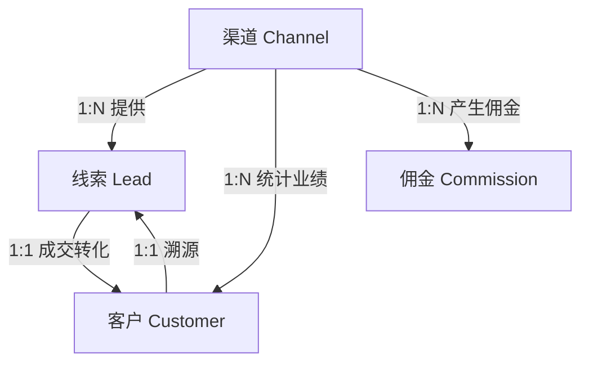

# L2C 全局联动蓝图：线索、客户、渠道

## 1. 概述

本蓝图定义了线索、客户、渠道三大核心模块之间的协同逻辑，旨在确保数据一致性、业绩可追溯性与佣金自动触发，从而建立以网格为核心的销售与渠道管理体系。

---

## 2. 核心联动逻辑

### 2.1 核心实体关系图 (ER Summary)



### 2.2 线索 (Lead) ➔ 客户 (Customer) 联动逻辑

- **触发时机**：当 `Lead.status` 更新为 **WON（已成交）** 时。
- **核心动作**：
  1. **自动建档**：检查 `leads.customer_phone` 是否已存在于 `customers` 表中。
  2. **数据继承**：若不存在，创建新客户，继承 Lead 中的姓名、电话、微信、地址、楼盘等关键信息。
  3. **溯源锁定**：在 `customers` 表中永久记录 `source_lead_id` 和 `source_channel_id`。即使线索结案，客户档案也永远知道自己是从哪个渠道、哪个设计师（线索创建人）来的。
- **技术指令**：
  ```
  实现 Lead 转化逻辑时，必须通过 Postgres 事务 (Transaction)
  确保线索状态更新、客户档案创建、首个订单生成这三个动作
  要么全部成功，要么全部失败。
  ```

### 2.3 渠道 (Channel) ➔ 线索 (Lead) ➔ 客户 (Customer) 联动逻辑

- **归属校验**：创建线索时，系统必须强制校验并绑定 `channel_id`。
- **唯一性保护**：**30天保护期规则**——如果 A 渠道报备了客户 X，B 渠道在 30 天内无法为同一客户 X（基于手机号）创建新线索。
- **业绩回传**：当客户档案产生订单并回款后，系统必须通过 `Customer.source_channel_id` 自动更新 `Channel.total_deal_amount`（累计成交额）。
- **带单人追踪**：
  - 对于装企渠道，线索必须记录具体的 `referrer_name`（带单设计师）。
  - 客户详情页需展示“来源：圣都组 - 设计师 XXX”。

### 2.4 财务佣金触发逻辑

- **联动链路**：**订单已回款** ➔ **AR 对账单完成** ➔ **触发佣金计算**。
- **自动计算**：系统根据 `Customer.source_channel_id` 找到对应渠道的 `commission_rate`（返点比例），在 `channel_commissions` 表中自动生成一笔**待审核**的佣金记录。

---

## 4. 补充：全局唯一标识 (Identity) 建议

在窗帘生意中，客户可能会多次进店、在不同平台咨询，需要建立一个统一的身份识别机制。

- **核心识别键**：以 **`phone`（手机号）** 作为最高权重的全局唯一标识。
- **第二识别键**：以 **`address`（详细地址）** 作为辅助识别键，当无法获取手机号时使用。
- **联动操作**：
  - 当新线索录入时，系统会自动检查该手机号是否已存在于 **"客户档案"** 中。
  - 如果存在，系统应向销售提示："该客户已是老客户，系统将为您关联老客户档案，并将此线索标记为 **'复购线索'**。"
  - 如果手机号为空或不存在，系统会进一步检查详细地址是否已存在于客户档案中，若匹配则提示可能为同一客户。**‘复购线索’**。”

---
