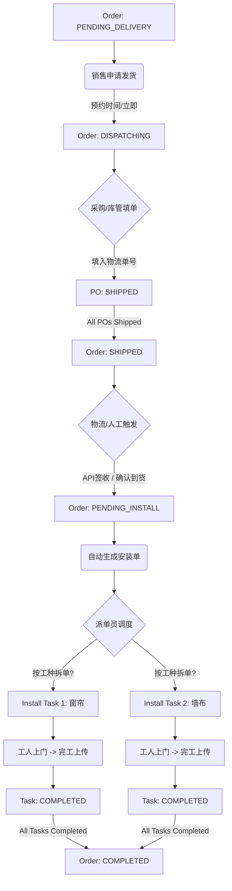

# 订单-发货-安装流程 (Delivery & Installation)

## 1. 概述
本流程描述从“备货完成”开始，经过“物流发货”、“安装任务调度”，直到“最终交付”的过程。核心在于**分批处理**与**安装联动**。

## 2. 流程图 (Flowchart)

## 3. 关键节点说明

### 3.1 发货申请 (Dispatch Request)
*   **场景**: 货物虽已备好，但客户可能家里还在硬装，不方便收货。
*   **动作**: 销售与客户确认后，点击“申请发货”（可选择“立即”或“预约日期”）。
*   **状态**: 订单变更为 `DISPATCHING` (待发货)。

### 3.2 物流回填 (Logistics)
*   **角色**: 采购员 / 库管。
*   **动作**: 实际发出货物后，在 PO 中填入 `物流公司` 和 `单号`。
*   **变迁**: PO -> `SHIPPED`。当所有 PO 发货 -> 订单 `SHIPPED`。

### 3.3 安装启动 (Install Start)
*   **触发**: 
    1.  **自动**: 快递100 API 推送“已签收”。
    2.  **人工**: 销售点击“确认到货”（针对自提或无物流场景）。
*   **动作**: 订单 -> `PENDING_INSTALL`，并**自动创建**初始安装任务。

### 3.4 派单与执行 (Dispatch & Execute)
*   **拆单**: 派单员可根据工种（窗帘/墙布）将任务拆分为多个子任务。
*   **执行**: 工人接单 -> 上门打卡 -> 上传前后对比图 -> 提交验收。

### 3.5 交付闭环 (Closure)
*   **验收**: 销售在系统查看完工图，点击“确认验收”。
*   **联动**: 所有安装任务 `COMPLETED` -> 订单 `COMPLETED`。交易正式结束，转入售后/质保期。
