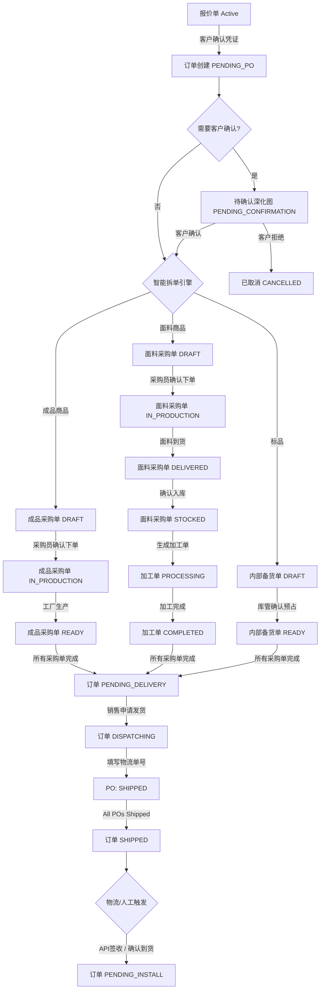
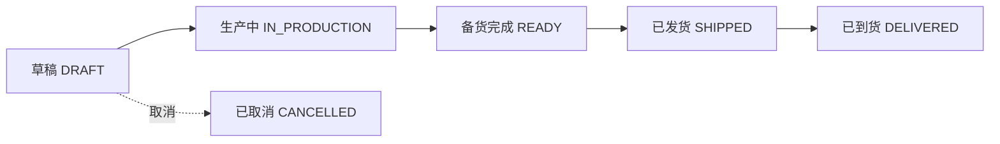
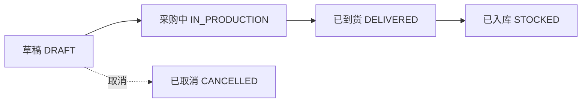
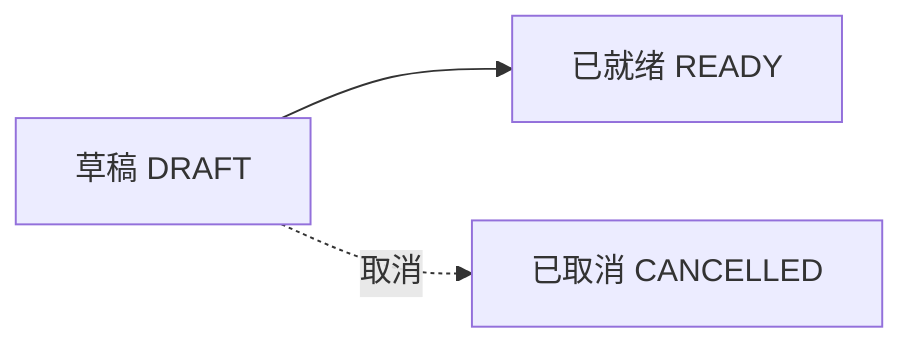

# 订单-采购全流程详解

## 1. 流程总览

本文档详细描述从订单创建开始，经过智能拆单、采购跟进、生产履约，直到货物到货的完整业务流程，确保订单到采购链路的顺畅运作。

### 1.1 流程图



### 1.2 核心概念

| 概念 | 说明 |
|:---|:---|
| **智能拆单** | 根据商品类型和默认供应商自动将订单拆分为多个采购单 |
| **木桶效应** | 订单状态由所有子单据状态聚合驱动，只有所有子单据都达标才能流转 |
| **状态联动** | 子单据状态变化自动触发订单状态变化，禁止手动切换 |
| **采购路线** | 成品采购路线和面料+加工路线两种不同的履约方式 |

### 1.3 采购路线对比

| 维度 | 成品采购路线 | 面料+加工路线 |
|:---|:---|:---|
| **适用商品** | 电机、轨道、配件、成品窗帘等 | 窗帘布料、窗帘纱、墙布等面料 |
| **采购对象** | 成品供应商 | 面料供应商 |
| **履约流程** | 订单 → 成品采购单 → 成品供应商 → 成品 → 发货 | 订单 → 面料采购单 → 面料入库 → 加工单 → 加工厂 → 成品 → 发货 |
| **采购单类型** | 成品采购单 (FINISHED) | 面料采购单 (FABRIC) |
| **中间环节** | 无 | 需要加工环节 |
| **库存影响** | 不涉及面料库存 | 增加面料库存 |
| **加工单** | 无 | 需要生成加工单 |

---

## 2. 订单创建流程

### 2.1 创建前置条件

**报价单状态要求**
- 报价单状态必须为 `Active`
- 报价单已通过审核（如需）
- 报价单未锁定

**客户确认要求**
- 客户已确认报价方案
- 客户已支付定金（如需）
- 客户已确认下单

### 2.2 订单创建流程

#### 2.2.1 月结客户转化流程

**业务场景**
- 客户为月结客户，先消费后结算
- 无需立即收款，只需客户确认下单

**操作步骤**
1. 销售在报价单详情页点击"生成订单"
2. 上传客户下单凭证（必填）
   - 支持格式：微信聊天记录截图、邮件确认、签字确认单等
   - 要求：清晰可识别，包含客户确认信息
3. 填写凭证说明（可选）
   - 例如：客户微信确认下单，约定月结
4. 系统验证凭证
   - 检查凭证图片是否上传
   - 检查报价单状态是否为 Active
5. 生成订单
   - 订单状态：`PENDING_PO`
   - 自动创建 AR 对账单，状态：`PENDING_RECON`
   - 报价单锁定，不可再编辑

**核心字段**
```json
{
  "order_no": "OD20260101001",
  "quote_id": "uuid",
  "quote_version_id": "uuid",
  "customer_id": "uuid",
  "customer_name": "张三",
  "customer_phone": "13800138000",
  "delivery_address": "北京市朝阳区XXX小区",
  "status": "PENDING_PO",
  "total_amount": 15000.00,
  "paid_amount": 0.00,
  "settlement_type": "CREDIT",
  "confirmation_img": "oss_url",
  "sales_id": "uuid",
  "created_at": "2026-01-15 10:00:00"
}
```

#### 2.2.2 现结客户转化流程

**业务场景**
- 客户为现结客户，需立即收款
- 必须上传收款凭证

**操作步骤**
1. 销售在报价单详情页点击"生成订单"
2. 上传收款凭证图片（必填）
   - 支持格式：转账截图、收款码截图、银行回单等
   - 要求：清晰可识别，包含收款金额和收款时间
3. 填写收款金额（必填）
   - 必须等于订单总金额
   - 系统自动校验金额是否匹配
4. 选择支付方式（必填）
   - 选项：现金 / 微信 / 支付宝 / 银行转账
5. 填写收款时间（默认当前时间）
6. 系统验证凭证
   - 检查凭证图片是否上传
   - 检查收款金额是否等于订单总金额
   - 检查支付方式是否选择
7. 生成订单
   - 订单状态：`PENDING_PO`
   - 自动创建 AR 对账单，状态：`INVOICED`
   - 自动创建收款记录，关联到对账单
   - 报价单锁定，不可再编辑

**核心字段**
```json
{
  "order_no": "OD20260101001",
  "quote_id": "uuid",
  "status": "PENDING_PO",
  "total_amount": 15000.00,
  "paid_amount": 15000.00,
  "settlement_type": "CASH",
  "payment_proof_img": "oss_url",
  "payment_amount": 15000.00,
  "payment_method": "WECHAT",
  "payment_time": "2026-01-15 10:00:00",
  "sales_id": "uuid"
}
```

#### 2.2.3 预收款客户转化流程

**业务场景**
- 客户已支付定金或全款，但未生成订单
- 从预收款列表中选择已存在的收款单

**操作步骤**
1. 销售在报价单详情页点击"生成订单"
2. 选择已存在的收款单号（必填）
   - 系统显示该客户的预收款列表
   - 仅显示状态为 `VERIFIED` 的收款单
3. 系统验证预收款
   - 检查收款单金额是否 ≥ 订单总金额
   - 检查收款单状态是否为 `VERIFIED`
   - 检查收款单是否已关联其他订单
4. 生成订单
   - 订单状态：`PENDING_PO`
   - 自动创建 AR 对账单，关联预收款记录
   - 更新收款单关联的订单 ID
   - 报价单锁定，不可再编辑

**核心字段**
```json
{
  "order_no": "OD20260101001",
  "quote_id": "uuid",
  "status": "PENDING_PO",
  "total_amount": 15000.00,
  "paid_amount": 15000.00,
  "settlement_type": "PREPAID",
  "prepaid_payment_id": "uuid",
  "sales_id": "uuid"
}
```

### 2.3 凭证验证规则

**通用规则**
- 凭证图片必须清晰可识别
- 凭证必须包含必要的确认信息
- 同一凭证不能重复使用

**月结客户凭证验证**
- 必须上传客户下单凭证
- 凭证必须包含客户确认信息
- 店长可对凭证进行审核

**现结客户凭证验证**
- 必须上传收款凭证
- 收款金额必须等于订单总金额
- 支付方式必须选择
- 收款时间必须填写

**预收款客户凭证验证**
- 预收款金额必须 ≥ 订单总金额
- 收款单状态必须为 `VERIFIED`
- 收款单不能已关联其他订单

### 2.4 订单明细生成

**自动复制报价单明细**
- 系统自动将报价单明细复制到订单明细
- 包括：空间名称、商品信息、规格、数量、单价、小计等
- 保留报价单版本 ID，用于溯源

**订单明细示例**
```json
{
  "order_items": [
    {
      "id": "uuid",
      "order_id": "uuid",
      "quote_item_id": "uuid",
      "room_name": "客厅",
      "product_id": "uuid",
      "product_name": "梦幻帘",
      "category": "CURTAIN",
      "unit_price": 300.00,
      "quantity": 1,
      "width": 2800,
      "height": 2500,
      "subtotal": 300.00,
      "po_id": null,
      "supplier_id": null,
      "status": "PENDING"
    },
    {
      "id": "uuid",
      "order_id": "uuid",
      "quote_item_id": "uuid",
      "room_name": "客厅",
      "product_id": "uuid",
      "product_name": "电机",
      "category": "MOTOR",
      "unit_price": 400.00,
      "quantity": 2,
      "subtotal": 800.00,
      "po_id": null,
      "supplier_id": null,
      "status": "PENDING"
    }
  ]
}
```

---

## 3. 智能拆单流程

### 3.1 拆单触发时机

**自动触发**
- 订单创建成功后立即自动触发
- 无需人工干预

**拆单前置条件**
- 订单状态为 `PENDING_PO`
- 订单明细已生成
- 商品信息完整（包含 `default_supplier_id`）

### 3.2 拆单逻辑

#### 3.2.1 成品商品拆单

**判断条件**
- `product.is_stockable = false`（非标品）
- 商品品类不属于面料品类（窗帘布料、窗帘纱、墙布等）

**拆单规则**
- 按 `product.default_supplier_id` 归组
- 同一供应商的商品归入同一个成品采购单
- 采购单类型：`FINISHED`

**拆单示例**
```
订单包含以下成品商品：
- 电机（供应商A）2台
- 轨道（供应商A）10米
- 配件（供应商B）5套

拆单结果：
- 成品采购单1：供应商A，包含电机、轨道
- 成品采购单2：供应商B，包含配件
```

#### 3.2.2 面料商品拆单

**判断条件**
- 商品品类属于面料品类
- 面料品类包括：窗帘布料、窗帘纱、墙布等

**拆单规则**
- 按 `product.default_supplier_id` 归组
- 同一供应商的面料归入同一个面料采购单
- 采购单类型：`FABRIC`

**拆单示例**
```
订单包含以下面料商品：
- 窗帘布料（面料供应商A）50米
- 窗帘纱（面料供应商A）30米
- 墙布（面料供应商B）80米

拆单结果：
- 面料采购单1：面料供应商A，包含窗帘布料、窗帘纱
- 面料采购单2：面料供应商B，包含墙布
```

#### 3.2.3 标品拆单

**判断条件**
- `product.is_stockable = true`（标品）
- 标品包括：抱枕、靠垫、成品窗帘等

**拆单规则**
- 所有标品归入同一个内部备货单
- 供应商为"自有仓库"
- 采购单类型：`STOCK`

**拆单示例**
```
订单包含以下标品：
- 抱枕（自有仓库）1个
- 靠垫（自有仓库）2个

拆单结果：
- 内部备货单：自有仓库，包含抱枕、靠垫
```

### 3.3 拆单数据结构

**成品采购单数据结构**
```json
{
  "po_no": "PO20260101001",
  "order_id": "uuid",
  "supplier_id": "uuid",
  "supplier_name": "成品供应商A",
  "type": "FINISHED",
  "status": "DRAFT",
  "total_cost": 8000.00,
  "items": [
    {
      "id": "uuid",
      "po_id": "uuid",
      "order_item_id": "uuid",
      "product_id": "uuid",
      "product_name": "电机",
      "product_sku": "MOTOR-001",
      "category": "MOTOR",
      "unit_cost": 400.00,
      "quantity": 2,
      "subtotal": 800.00
    },
    {
      "id": "uuid",
      "po_id": "uuid",
      "order_item_id": "uuid",
      "product_id": "uuid",
      "product_name": "轨道",
      "product_sku": "TRACK-001",
      "category": "TRACK",
      "unit_cost": 120.00,
      "quantity": 10,
      "subtotal": 1200.00
    }
  ]
}
```

**面料采购单数据结构**
```json
{
  "po_no": "PO20260101002",
  "order_id": "uuid",
  "supplier_id": "uuid",
  "supplier_name": "面料供应商A",
  "type": "FABRIC",
  "status": "DRAFT",
  "total_cost": 5000.00,
  "items": [
    {
      "id": "uuid",
      "po_id": "uuid",
      "order_item_id": "uuid",
      "product_id": "uuid",
      "product_name": "窗帘布料",
      "product_sku": "FABRIC-001",
      "category": "FABRIC",
      "unit_cost": 80.00,
      "quantity": 50,
      "subtotal": 4000.00
    },
    {
      "id": "uuid",
      "po_id": "uuid",
      "order_item_id": "uuid",
      "product_id": "uuid",
      "product_name": "窗帘纱",
      "product_sku": "SHEER-001",
      "category": "SHEER",
      "unit_cost": 50.00,
      "quantity": 30,
      "subtotal": 1500.00
    }
  ]
}
```

**内部备货单数据结构**
```json
{
  "po_no": "PO20260101003",
  "order_id": "uuid",
  "supplier_id": "自有仓库",
  "supplier_name": "自有仓库",
  "type": "STOCK",
  "status": "DRAFT",
  "total_cost": 300.00,
  "items": [
    {
      "id": "uuid",
      "po_id": "uuid",
      "order_item_id": "uuid",
      "product_id": "uuid",
      "product_name": "抱枕",
      "product_sku": "PILLOW-001",
      "category": "PILLOW",
      "unit_cost": 300.00,
      "quantity": 1,
      "subtotal": 300.00
    }
  ]
}
```

### 3.4 订单明细更新

**更新采购单关联**
- 拆单完成后，系统自动更新订单明细的 `po_id` 和 `supplier_id`
- 用于后续跟踪每个商品的采购状态

**更新示例**
```json
{
  "order_items": [
    {
      "id": "uuid",
      "product_name": "梦幻帘",
      "po_id": "PO20260101002",
      "supplier_id": "面料供应商A",
      "status": "PENDING"
    },
    {
      "id": "uuid",
      "product_name": "电机",
      "po_id": "PO20260101001",
      "supplier_id": "成品供应商A",
      "status": "PENDING"
    }
  ]
}
```

### 3.5 订单状态联动

**根据拆单结果，订单状态自动更新**

| 订单商品类型 | 订单状态 |
|:---|:---|
| 仅包含成品商品 | `IN_PRODUCTION` |
| 仅包含面料商品 | `FABRIC_PURCHASING` |
| 混合商品（面料+成品） | `FABRIC_PURCHASING` + `IN_PRODUCTION` |
| 仅包含标品 | `PENDING_DELIVERY` |

**状态说明**
- `IN_PRODUCTION`：成品采购中
- `FABRIC_PURCHASING`：面料采购中
- `PENDING_DELIVERY`：待发货（仅标品，无需采购）

### 3.6 人工干预

**拆单调整**
- 客服在订单详情页的"拆单"页面可调整商品归属
- 可将商品移动到其他供应商的采购单
- 可添加新的采购单

**拆单页面布局**
```
┌─────────────────────────────────────────────────────┐
│ 采购单拆分                           [确认拆单]     │
├─────────────────────────────────────────────────────┤
│ 【面料采购单】                                        │
│ 面料供应商A (3件面料商品)                            │
│   ├─ 窗帘布料  ¥80  50米                       │
│   ├─ 窗帘纱    ¥50  30米                       │
│   └─ 墙布      ¥60  80米   [移动至其他供应商 ▼]   │
├─────────────────────────────────────────────────────┤
│ 【成品采购单】                                        │
│ 成品供应商B (2件成品商品)                            │
│   ├─ 电机      ¥400  2台                        │
│   └─ 轨道      ¥120  10米                       │
├─────────────────────────────────────────────────────┤
│ 【内部备货】 (1件标品)                               │
│   └─ 抱枕     ¥300                                │
└─────────────────────────────────────────────────────┘
```

**确认拆单**
- 客服调整完成后，点击"确认拆单"
- 系统生成正式采购单
- 订单状态根据商品类型进入相应状态

---

## 4. 采购单处理流程

### 4.1 采购单状态流转

#### 4.1.1 成品采购单状态流转



| 状态 | 状态码 | 说明 | 触发条件 |
|:---|:---|:---|:---|
| **草稿** | `DRAFT` | 待采购员处理 | 订单拆单时自动生成 |
| **生产中** | `IN_PRODUCTION` | 已向工厂下单 | 上传供应商确认截图 或 点击"确认下单" |
| **备货完成** | `READY` | 工厂生产完毕 | 采购员点击"备货完成" |
| **已发货** | `SHIPPED` | 物流运输中 | 填入物流公司 + 快递单号 |
| **已到货** | `DELIVERED` | 货物签收 | 物流 API 签收 / 人工确认 |
| **已取消** | `CANCELLED` | 采购取消 | 关联订单撤单 |

#### 4.1.2 面料采购单状态流转



| 状态 | 状态码 | 说明 | 触发条件 |
|:---|:---|:---|:---|
| **草稿** | `DRAFT` | 待采购员处理 | 订单拆单时自动生成 |
| **采购中** | `IN_PRODUCTION` | 已向面料供应商下单 | 上传供应商确认截图 或 点击"确认下单" |
| **已到货** | `DELIVERED` | 面料已到货 | 物流签收 / 人工确认 |
| **已入库** | `STOCKED` | 面料已入库 | 采购员点击"确认入库" |
| **已取消** | `CANCELLED` | 采购取消 | 关联订单撤单 |

#### 4.1.3 内部备货单状态流转



| 状态 | 状态码 | 说明 | 触发条件 |
|:---|:---|:---|:---|
| **草稿** | `DRAFT` | 待库管处理 | 订单拆单时自动生成 |
| **已就绪** | `READY` | 库存已预占 | 库管点击"确认预占" |
| **已取消** | `CANCELLED` | 备货取消 | 关联订单撤单 |

### 4.2 采购员处理流程

#### 4.2.1 成品采购单处理

**步骤1：接收通知**
- 系统通知：有新采购单待处理
- 飞书通知：采购单详情
- 通知内容：采购单号、供应商、金额、截止时间

**步骤2：查看采购单**
- 进入采购单详情页
- 查看基础信息：采购单号、关联订单、供应商、采购成本
- 查看商品明细：商品名称、SKU、规格、成本单价、数量、小计
- 查看供应商信息：联系人、电话、地址

**步骤3：与供应商确认**
- 联系供应商确认价格
- 确认交货时间
- 确认付款方式
- 确认物流方式

**步骤4：确认下单**
- 方式一：上传供应商确认截图
  - 支持格式：微信聊天记录、邮件、确认单等
  - 要求：清晰可识别，包含价格、交货时间等信息
- 方式二：点击"确认下单"按钮
  - 填写外部单号（工厂方单号）
  - 填写备注信息

**步骤5：系统处理**
- 采购单状态从 `DRAFT` 变为 `IN_PRODUCTION`
- 自动生成 AP 对账记录
- 订单状态保持/进入 `IN_PRODUCTION`
- 通知销售：采购单已下单

**核心字段更新**
```json
{
  "status": "IN_PRODUCTION",
  "external_po_no": "FACTORY-PO-20260115-001",
  "supplier_quote_img": "oss_url",
  "sent_method": "WECHAT",
  "sent_at": "2026-01-15 14:00:00"
}
```

#### 4.2.2 面料采购单处理

**步骤1：接收通知**
- 系统通知：有新面料采购单待处理
- 飞书通知：采购单详情

**步骤2：查看采购单**
- 进入采购单详情页
- 查看面料明细：面料名称、SKU、用量、成本单价、小计
- 查看供应商信息：联系人、电话、地址

**步骤3：与供应商确认**
- 联系面料供应商确认价格
- 确认交货时间
- 确认付款方式
- 确认物流方式

**步骤4：确认下单**
- 上传供应商确认截图
- 填写外部单号
- 填写备注信息

**步骤5：系统处理**
- 采购单状态从 `DRAFT` 变为 `IN_PRODUCTION`
- 订单状态保持 `FABRIC_PURCHASING`
- 通知销售：面料采购单已下单

#### 4.2.3 内部备货单处理

**步骤1：接收通知**
- 系统通知：有新内部备货单待处理
- 通知库管

**步骤2：查看备货单**
- 进入备货单详情页
- 查看标品明细：商品名称、SKU、数量、成本单价、小计

**步骤3：检查库存**
- 检查标品库存是否充足
- 如库存不足，及时补货

**步骤4：确认预占**
- 库管点击"确认预占"按钮
- 系统预占库存

**步骤5：系统处理**
- 备货单状态从 `DRAFT` 变为 `READY`
- 库存预占，不可再被其他订单使用

### 4.3 生产跟进流程

#### 4.3.1 成品采购单生产跟进

**跟踪生产进度**
- 采购员定期与工厂沟通
- 确认生产进度
- 确认预计完成时间

**备货完成**
- 工厂通知备货完成
- 采购员点击"备货完成"按钮
- 采购单状态从 `IN_PRODUCTION` 变为 `READY`
- 系统记录生产完成时间

**核心字段更新**
```json
{
  "status": "READY",
  "produced_at": "2026-01-20 16:00:00"
}
```

**通知机制**
- 通知销售和客服：XXX订单备货完成
- 检查所有采购单状态
- 如果所有采购单都为 `READY`，订单状态变为 `PENDING_DELIVERY`

#### 4.3.2 面料采购单生产跟进

**面料到货**
- 物流签收或人工确认
- 采购员点击"确认到货"按钮
- 采购单状态从 `IN_PRODUCTION` 变为 `DELIVERED`
- 系统记录到货时间

**核心字段更新**
```json
{
  "status": "DELIVERED",
  "delivered_at": "2026-01-18 10:00:00"
}
```

**面料入库**
- 采购员检查面料质量
- 确认面料数量和规格
- 点击"确认入库"按钮
- 采购单状态从 `DELIVERED` 变为 `STOCKED`
- 增加面料库存

**核心字段更新**
```json
{
  "status": "STOCKED"
}
```

**生成加工单**
- 系统自动生成加工单
- 加工单关联面料采购单
- 加工单关联订单
- 订单状态从 `FABRIC_PURCHASING` 变为 `PROCESSING`

**加工单数据结构**
```json
{
  "wo_no": "WO20260101001",
  "order_id": "uuid",
  "po_id": "uuid",
  "supplier_id": "加工厂ID",
  "supplier_name": "加工厂A",
  "status": "PROCESSING",
  "items": [
    {
      "id": "uuid",
      "wo_id": "uuid",
      "fabric_name": "窗帘布料",
      "fabric_sku": "FABRIC-001",
      "quantity": 50,
      "specifications": "宽度2.8米，高度2.5米",
      "subtotal": 4000.00
    }
  ],
  "created_at": "2026-01-18 14:00:00"
}
```

### 4.4 加工流程

#### 4.4.1 加工单状态流转


| 状态 | 状态码 | 说明 | 触发条件 |
|:---|:---|:---|:---|
| **加工中** | `PROCESSING` | 加工厂加工中 | 生成加工单时自动设置 |
| **已完成** | `COMPLETED` | 加工完成 | 采购员确认加工完成 |

#### 4.4.2 加工流程

**步骤1：加工厂接收加工单**
- 系统通知加工厂
- 加工厂查看加工单详情
- 确认加工规格和数量

**步骤2：加工厂进行生产**
- 按照加工规格进行生产
- 采购员跟踪加工进度

**步骤3：加工完成**
- 加工厂通知加工完成
- 采购员确认加工质量
- 点击"确认完成"按钮

**步骤4：系统处理**
- 加工单状态从 `PROCESSING` 变为 `COMPLETED`
- 检查所有加工单状态
- 如果所有加工单都为 `COMPLETED`，等待成品采购单完成

### 4.5 物流发货流程

#### 4.5.1 销售申请发货

**触发条件**
- 订单状态为 `PENDING_DELIVERY`
- 所有采购单和加工单都已完成

**操作步骤**
1. 销售在订单详情页点击"申请发货"
2. 选择发货方式
   - 立即发货：立即安排发货
   - 预约发货：选择预约发货日期
3. 填写发货备注（可选）
4. 提交申请

**系统处理**
- 订单状态从 `PENDING_DELIVERY` 变为 `DISPATCHING`
- 通知采购员：请填写物流信息

#### 4.5.2 采购员填写物流

**触发条件**
- 订单状态为 `DISPATCHING`
- 采购单状态为 `READY`

**操作步骤**
1. 采购员进入采购单详情页
2. 点击"填物流"按钮
3. 填写物流信息
   - 物流公司（必填）：顺丰、德邦、自提等
   - 物流单号（必填）：快递单号
   - 备注（可选）：特殊说明
4. 提交物流信息

**物流填写弹窗**
```
┌─────────────────────────────────────────────────────┐
│ 填写物流信息                                          │
├─────────────────────────────────────────────────────┤
│ 物流公司：[顺丰 ▼]                                   │
│ 物流单号：[SF1234567890                             ] │
│ 备注：    [                                         ] │
│                                                       │
│                    [取消] [确认]                      │
└─────────────────────────────────────────────────────┘
```

**系统处理**
- 采购单状态从 `READY` 变为 `SHIPPED`
- 记录发货时间
- 通知销售：货物已发出（单号）

**核心字段更新**
```json
{
  "status": "SHIPPED",
  "logistics_company": "顺丰",
  "logistics_no": "SF1234567890",
  "shipped_at": "2026-01-22 10:00:00"
}
```

#### 4.5.3 物流跟踪

**自动查询**
- 系统定期调用物流 API 查询物流状态
- 更新物流信息到采购单

**物流信息**
```json
{
  "logistics_info": [
    {
      "time": "2026-01-22 10:00:00",
      "status": "已揽收",
      "location": "北京市朝阳区"
    },
    {
      "time": "2026-01-22 18:00:00",
      "status": "运输中",
      "location": "北京市大兴区"
    },
    {
      "time": "2026-01-23 09:00:00",
      "status": "派送中",
      "location": "上海市浦东新区"
    }
  ]
}
```

#### 4.5.4 到货确认

**自动签收**
- 物流 API 自动查询签收状态
- 如果签收，采购单状态从 `SHIPPED` 变为 `DELIVERED`

**人工确认**
- 如果物流 API 无法获取签收状态
- 采购员可手动确认到货
- 点击"确认到货"按钮

**系统处理**
- 采购单状态从 `SHIPPED` 变为 `DELIVERED`
- 记录到货时间
- 检查所有采购单状态
- 如果所有采购单都为 `DELIVERED`，订单状态变为 `PENDING_INSTALL`

**核心字段更新**
```json
{
  "status": "DELIVERED",
  "delivered_at": "2026-01-23 15:00:00"
}
```

---

## 5. 状态联动规则（木桶效应）

### 5.1 状态联动机制

**订单状态由子单据状态聚合驱动**
- 禁止手动切换订单状态
- 必须由子单据状态驱动
- 木桶效应：所有子单据达标才流转

### 5.2 成品采购单状态联动

| 采购单状态 | 订单状态变化条件 |
|:---|:---|
| 任一 PO → `IN_PRODUCTION` | 订单保持/进入 `IN_PRODUCTION` |
| **所有** 成品 PO → `READY` | 订单等待面料加工完成 |
| **所有** 成品 PO → `SHIPPED` | 等待所有 PO 都发货 |
| **所有** 成品 PO → `DELIVERED` | 等待所有 PO 都到货 |

### 5.3 面料采购单状态联动

| 采购单状态 | 订单状态变化条件 |
|:---|:---|
| 任一 PO → `IN_PRODUCTION` | 订单进入 `FABRIC_PURCHASING` |
| **所有** 面料 PO → `STOCKED` | 订单进入 `FABRIC_RECEIVED` |
| **所有** 面料 PO → `DELIVERED` | 等待所有 PO 都到货 |

### 5.4 加工单状态联动

| 加工单状态 | 订单状态变化条件 |
|:---|:---|
| 任一加工单 → `PROCESSING` | 订单进入 `PROCESSING` |
| **所有** 加工单 → `COMPLETED` | 等待成品 PO 完成 |

### 5.5 混合路线状态联动

**场景：订单同时包含面料商品和成品商品**

| 阶段 | 面料采购单 | 成品采购单 | 加工单 | 订单状态 |
|:---|:---|:---|:---|:---|
| 初始 | `DRAFT` | `DRAFT` | - | `PENDING_PO` |
| 下单 | `IN_PRODUCTION` | `IN_PRODUCTION` | - | `FABRIC_PURCHASING` + `IN_PRODUCTION` |
| 面料到货 | `DELIVERED` | `IN_PRODUCTION` | - | `FABRIC_RECEIVED` + `IN_PRODUCTION` |
| 面料入库 | `STOCKED` | `IN_PRODUCTION` | `PROCESSING` | `PROCESSING` + `IN_PRODUCTION` |
| 加工完成 | `STOCKED` | `IN_PRODUCTION` | `COMPLETED` | `IN_PRODUCTION` |
| 成品备货 | `STOCKED` | `READY` | `COMPLETED` | `PENDING_DELIVERY` |
| 发货 | `STOCKED` | `SHIPPED` | `COMPLETED` | `DISPATCHING` |
| 到货 | `STOCKED` | `DELIVERED` | `COMPLETED` | `PENDING_INSTALL` |

### 5.6 最终状态联动

| 子单据状态 | 订单状态 |
|:---|:---|
| **所有** 采购单和加工单 → `READY` | 订单 → `PENDING_DELIVERY` |
| **所有** 采购单 → `SHIPPED` | 订单 → `DISPATCHING` |
| **所有** 采购单 → `DELIVERED` | 订单 → `PENDING_INSTALL` |

---

## 6. 关键业务规则

### 6.1 创建规则

**订单创建规则**
- 仅能从 `Active` 状态的报价单转化
- 必须上传客户确认凭证
- 转化成功后报价单锁定

**采购单创建规则**
- 仅由订单拆单生成
- 标品自动归入"内部备货单"
- 禁止直接创建采购单

### 6.2 拆单规则

**自动拆单规则**
- 成品商品按 `default_supplier_id` 拆分为成品采购单
- 面料商品按 `default_supplier_id` 拆分为面料采购单
- 标品拆分为内部备货单

**人工干预规则**
- 客服可手动调整商品归属
- 可将商品移动到其他供应商的采购单
- 可添加新的采购单

### 6.3 下单规则

**成品采购单下单规则**
- 从草稿到生产中，需满足以下条件之一：
  - 上传供应商确认截图
  - 或点击"确认下单"按钮
- 下单后商品明细不可修改

**面料采购单下单规则**
- 从草稿到生产中，需满足以下条件之一：
  - 上传供应商确认截图
  - 或点击"确认下单"按钮
- 下单后面料明细不可修改

### 6.4 备货规则

**成品采购单备货规则**
- 采购员需与工厂确认后点击"备货完成"
- 支持部分备货（未来扩展）

**面料采购单备货规则**
- 面料到货后，采购员确认面料质量
- 点击"确认入库"，增加面料库存

**内部备货单备货规则**
- 库管检查标品库存是否充足
- 点击"确认预占"，预占库存

### 6.5 发货规则

**发货规则**
- 必须填写物流公司和物流单号
- 发货后可修改物流信息（物流变更）
- 支持物流 API 自动查询签收状态

**发货申请规则**
- 订单状态为 `PENDING_DELIVERY` 时，销售可"申请发货"
- 可选择"立即发货"或"预约发货日期"

### 6.6 付款联动规则

**采购单付款规则**
- 采购单进入"生产中"后，自动生成 AP 对账记录
- 付款状态由财务模块更新

**付款状态**
- `PENDING`：待付款
- `PARTIAL`：部分付款
- `PAID`：已付款

### 6.7 撤单规则

| 当前状态 | 可否撤单 | 审批要求 | 说明 |
|:---|:---|:---|:---|
| 待下单 | ✓ | 无需审批 | 直接撤单 |
| 生产中 | ✓ | 需店长审批 | 需与供应商协商 |
| 待发货及以后 | ✗ | 不可撤单 | 需走售后退货流程 |

---

## 7. 通知与提醒

### 7.1 通知机制

**通知渠道**
- 系统内通知：站内消息
- 飞书通知：飞书机器人推送

**通知对象**
- 销售：订单相关通知
- 客服：拆单相关通知
- 采购员：采购单相关通知
- 库管：备货相关通知
- 店长：审批相关通知

### 7.2 通知事件

| 触发事件 | 通知对象 | 渠道 | 内容 |
|:---|:---|:---|:---|
| 订单创建 | 客服 | 系统+飞书 | 有新订单待拆单 |
| 拆单完成 | 采购员 | 系统+飞书 | 有新采购单待处理 |
| 下单成功 | 采购员 | 系统 | 采购单已下单 |
| 备货完成 | 销售+客服 | 系统 | XXX订单备货完成 |
| 面料到货 | 采购员 | 系统 | 面料已到货，请确认入库 |
| 面料入库 | 采购员 | 系统 | 面料已入库，已生成加工单 |
| 加工完成 | 销售+客服 | 系统 | XXX订单加工完成 |
| 申请发货 | 采购员 | 系统 | 请填写物流单号 |
| 已发货 | 销售 | 系统 | 货物已发出（单号） |
| 到货 | 销售 | 系统 | 货物已签收 |
| 生产超时（>7天） | 采购员+店长 | 系统 | 采购单生产超时预警 |
| 撤单审批待处理 | 店长 | 系统+飞书 | 有订单撤单待审批 |

### 7.3 提醒规则

**生产超时提醒**
- 采购单生产超过7天未完成
- 系统自动预警
- 通知采购员和店长

**发货提醒**
- 订单状态为 `PENDING_DELIVERY` 超过3天未申请发货
- 通知销售

**到货提醒**
- 采购单状态为 `SHIPPED` 超过7天未到货
- 通知采购员

---

## 8. 权限控制

### 8.1 页面级权限

| 页面 | 销售 | 客服 | 采购员 | 财务 | 店长 |
|:---|:---|:---|:---|:---|:---|
| 订单列表 | ✓（本人） | ✓（全部） | ✓（全部） | ✓（全部） | ✓（全部） |
| 订单详情 | ✓（本人） | ✓ | ✓ | ✓ | ✓ |
| 拆单页面 | ✗ | ✓ | ✗ | ✗ | ✓ |
| 采购单列表 | ✗ | ✓ | ✓ | ✓ | ✓ |
| 采购单详情 | ✗ | ✓ | ✓ | ✓ | ✓ |

### 8.2 按钮级权限

| 操作 | 销售 | 客服 | 采购员 | 财务 | 店长 |
|:---|:---|:---|:---|:---|:---|
| 生成订单 | ✓ | ✗ | ✗ | ✗ | ✓ |
| 拆单 | ✗ | ✓ | ✗ | ✗ | ✓ |
| 确认下单 | ✗ | ✓ | ✓ | ✗ | ✓ |
| 备货完成 | ✗ | ✗ | ✓ | ✗ | ✓ |
| 填物流 | ✗ | ✗ | ✓ | ✗ | ✓ |
| 确认到货 | ✓ | ✓ | ✓ | ✗ | ✓ |
| 申请发货 | ✓ | ✓ | ✗ | ✗ | ✓ |
| 确认入库 | ✗ | ✗ | ✓ | ✗ | ✓ |
| 撤单 | ✓（待下单） | ✗ | ✗ | ✗ | ✓ |
| 审批撤单 | ✗ | ✗ | ✗ | ✗ | ✓ |
| 修改成本价 | ✗ | ✗ | ✓（需审批） | ✗ | ✓ |

### 8.3 数据范围权限

| 角色 | 可见范围 |
|:---|:---|
| 销售 | 自己负责的订单 |
| 客服/采购员/财务 | 全部订单和采购单 |
| 店长 | 本店所有订单和采购单 |

---

## 9. 异常处理

### 9.1 撤单流程

**待下单状态撤单**
- 订单状态为 `PENDING_PO`
- 销售可直接撤单
- 无需审批
- 系统取消所有关联采购单

**生产中状态撤单**
- 订单状态为 `IN_PRODUCTION`
- 需店长审批
- 需与供应商协商
- 审批通过后，系统取消所有关联采购单

**撤单审批流程**
1. 销售提交撤单申请
2. 填写撤单原因（必填）
3. 提交审批
4. 店长查看申请
5. 点击"审批通过"或"审批驳回"
6. 审批通过后，订单状态变为 `CANCELLED`
7. 所有关联采购单状态变为 `CANCELLED`

### 9.2 生产超时处理

**生产超时预警**
- 采购单生产超过7天未完成
- 系统自动预警
- 通知采购员和店长

**处理流程**
1. 采购员联系工厂确认生产进度
2. 了解延迟原因
3. 评估影响
4. 与销售沟通，调整客户预期
5. 如需催单，及时跟进

### 9.3 物流异常处理

**物流签收失败**
- 物流 API 无法获取签收状态
- 采购员可手动确认到货
- 点击"确认到货"按钮

**物流变更**
- 发货后物流信息变更
- 采购员可修改物流信息
- 更新物流公司和物流单号

**物流丢失**
- 货物在运输过程中丢失
- 采购员联系物流公司处理
- 与销售沟通，重新发货或退款

### 9.4 面料质量问题

**面料到货检查**
- 采购员检查面料质量
- 如发现质量问题
- 拍照留存证据
- 联系供应商处理
- 重新采购或退款

**加工质量问题**
- 加工完成后发现质量问题
- 采购员与加工厂沟通
- 重新加工或退款

---

## 10. 与其他模块的关联

### 10.1 订单模块关联

| 模块 | 关联方式 | 数据流向 |
|:---|:---|:---|
| **报价单** | Order.quote_id → Quote.id | 报价 → 订单 |
| **客户** | Order.customer_id → Customer.id | - |
| **采购单** | PO.order_id → Order.id | 订单 → 采购单 |
| **安装单** | Install.order_id → Order.id | 订单 → 安装单 |
| **对账单-AR** | Statement.order_id → Order.id | 订单 → 收款对账 |
| **审批流** | 撤单审批 | 订单 → 审批 |

### 10.2 采购单模块关联

| 模块 | 关联方式 | 数据流向 |
|:---|:---|:---|
| **订单** | PO.order_id → Order.id | 订单 → 采购单 |
| **订单明细** | POItem.order_item_id → OrderItem.id | - |
| **供应商** | PO.supplier_id → Supplier.id | - |
| **商品** | POItem.product_id → Product.id | - |
| **对账单-AP** | 生产中时生成 AP 记录 | 采购单 → 对账 |
| **库存** | 内部备货单扣减库存 | 采购单 → 库存 |
| **加工单** | 面料入库后生成加工单 | 采购单 → 加工单 |

### 10.3 加工单模块关联

| 模块 | 关联方式 | 数据流向 |
|:---|:---|:---|
| **订单** | WO.order_id → Order.id | 订单 → 加工单 |
| **采购单** | WO.po_id → PO.id | 采购单 → 加工单 |
| **供应商** | WO.supplier_id → Supplier.id | - |
| **面料** | WOItem.fabric_id → Product.id | - |

---

## 11. 数据统计与报表

### 11.1 订单统计

**订单数量统计**
- 按时间范围统计订单数量
- 按状态统计订单数量
- 按销售统计订单数量

**订单金额统计**
- 按时间范围统计订单金额
- 按状态统计订单金额
- 按销售统计订单金额

**订单转化率**
- 报价单到订单的转化率
- 按时间范围统计
- 按销售统计

### 11.2 采购单统计

**采购单数量统计**
- 按时间范围统计采购单数量
- 按状态统计采购单数量
- 按供应商统计采购单数量

**采购金额统计**
- 按时间范围统计采购金额
- 按状态统计采购金额
- 按供应商统计采购金额

**采购周期统计**
- 从下单到备货完成的平均周期
- 按供应商统计
- 按商品品类统计

### 11.3 供应商统计

**供应商采购金额排名**
- 按采购金额排名
- 按时间范围统计

**供应商采购数量排名**
- 按采购单数量排名
- 按时间范围统计

**供应商交付周期**
- 从下单到到货的平均周期
- 按供应商统计

**供应商质量统计**
- 质量问题次数
- 按供应商统计

---

## 12. 附录

### 12.1 状态码定义

**订单状态码**
```json
{
  "PENDING_PO": "待下单",
  "FABRIC_PURCHASING": "面料采购中",
  "FABRIC_RECEIVED": "面料入库",
  "PROCESSING": "加工中",
  "IN_PRODUCTION": "生产中",
  "PENDING_DELIVERY": "待发货",
  "DISPATCHING": "发货中",
  "SHIPPED": "已发货",
  "PENDING_INSTALL": "待安装",
  "COMPLETED": "已完成",
  "CLOSED": "已关闭",
  "CANCELLED": "已取消"
}
```

**采购单状态码**
```json
{
  "DRAFT": "草稿",
  "IN_PRODUCTION": "生产中",
  "READY": "备货完成",
  "SHIPPED": "已发货",
  "DELIVERED": "已到货",
  "STOCKED": "已入库",
  "CANCELLED": "已取消"
}
```

**加工单状态码**
```json
{
  "PROCESSING": "加工中",
  "COMPLETED": "已完成"
}
```

### 12.2 采购单类型定义

```json
{
  "FINISHED": "成品采购单",
  "FABRIC": "面料采购单",
  "STOCK": "内部备货单"
}
```

### 12.3 结算方式定义

```json
{
  "PREPAID": "预收款",
  "CREDIT": "月结",
  "CASH": "现结"
}
```

### 12.4 支付方式定义

```json
{
  "CASH": "现金",
  "WECHAT": "微信",
  "ALIPAY": "支付宝",
  "BANK": "银行转账"
}
```

### 12.5 付款状态定义

```json
{
  "PENDING": "待付款",
  "PARTIAL": "部分付款",
  "PAID": "已付款"
}
```

---

整个流程通过智能拆单、状态联动、木桶效应、通知机制等设计，确保订单能够高效、准确地转化为采购单，并跟踪整个采购履约过程。系统通过自动化减少人工操作，通过状态联动确保数据一致性，通过通知机制确保各角色及时获取任务信息。
