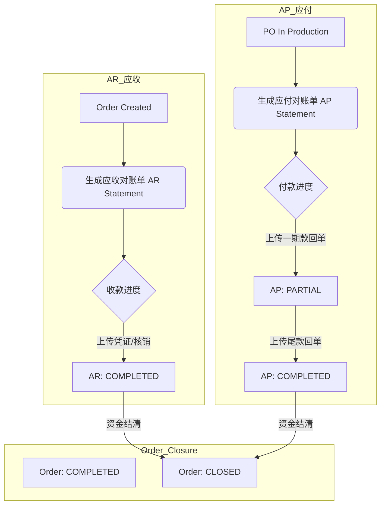

# 财务-对账-闭环流程 (Finance Closure)

## 1. 概述
本流程描述伴随业务发生的资金流向，包括 **AR (应收)** 和 **AP (应付)** 两条线。财务模块不直接参与业务操作，而是作为“观察者”和“守门员”存在。

## 2. 流程图 (Flowchart)

## 3. 关键节点说明

### 3.1 应收对账 (AR)
*   **生成**: 订单创建时自动生成 `PENDING` 状态的 AR 单。
*   **收款**:
    *   支持 **分笔收款** (如：定金 50%, 尾款 50%)。
    *   销售财务上传银行回单/截图。
*   **控制**: 系统可配置“必须收齐尾款”才能触发“发货”或“安装”动作 (可选强控)。

### 3.2 应付对账 (AP)
*   **生成**: 采购单进入 `IN_PRODUCTION` 后自动生成 AP 单。
*   **对账**: 
    *   月底生成“供应商对账单”，聚合该供应商本月所有 PO。
    *   财务审核入库单/物流单后，统一打款。

### 3.3 最终关闭 (Order Closed)
*   **区别**: 
    *   `COMPLETED`: 业务交付完成（客户用上了）。
    *   `CLOSED`: 财务结算完成（钱货两清）。
*   **规则**: 只有当 Order 状态为 `COMPLETED` **且** 关联的 AR/AP 全部 `COMPLETED` 时，订单才归档为 `CLOSED`。
