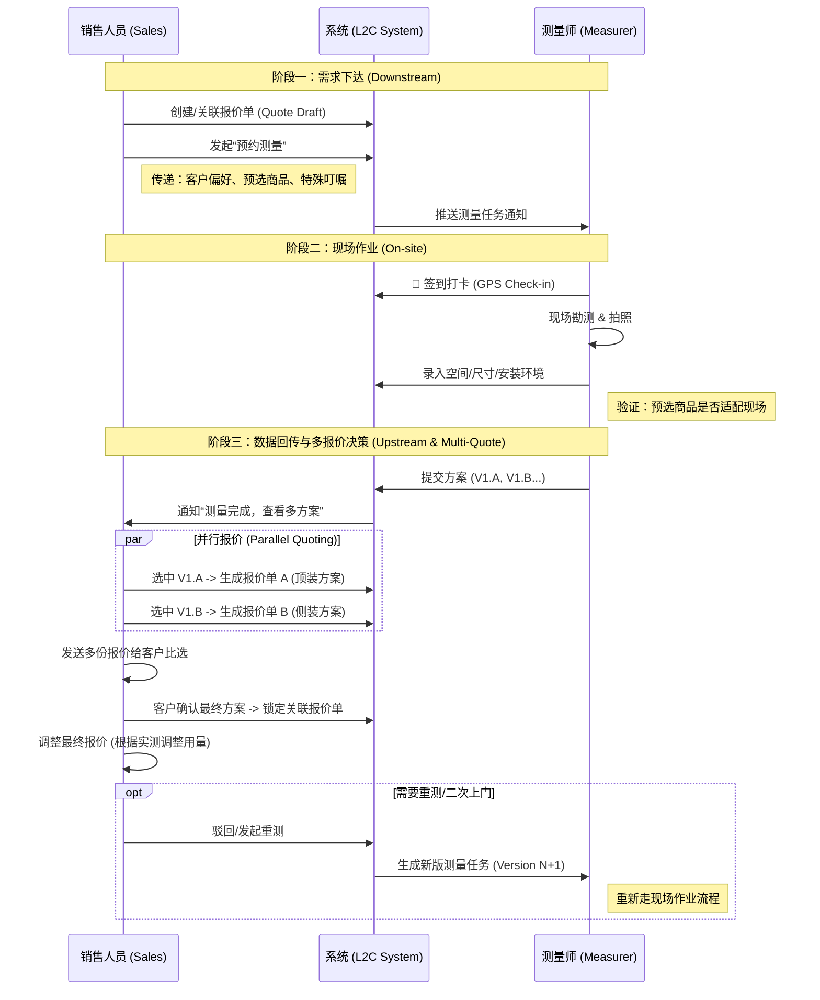

# 销售与测量协同流程 (Sales-Measurer Collaboration)

本文档梳理了销售人员与测量师之间的信息流转闭环，重点解决“需求下达”与“数据回传”的协同问题。

## 1. 核心流程图 (Flowchart)

## 2. 信息流结构 (Information Flow)

### 2.1 下行：销售 -> 测量 (What Sales sends)

当销售发起测量任务时，不仅仅是给一个地址，更需要传递**业务上下文**，以便测量师在现场有的放矢。

| 信息类别 | 具体内容 | 目的/作用 |
| :--- | :--- | :--- |
| **基础信息** | 客户姓名、电话、地址、期望上门时间 | 联系与导航 |
| **空间/商品预设** | *（可选）* 预选的空间（如：客厅、主卧）及对应的商品（如：梦幻帘、香格里拉帘） | 让测量师重点检查安装环境是否满足特定窗帘的工艺要求（例如：梦幻帘需要更深的窗帘盒）。 |
| **特殊叮嘱** | 备注文本（例：“客户家有老人，确认为智能电动轨道”） | 提醒测量师重点排查电源预留情况。 |
| **参考报价单** | 关联的 `QuoteID` | 若已出初版报价，测量师可看到销售推荐的产品，现场直接复核可行性。 |

### 2.2 上行：测量 -> 销售 (What Measurer returns)

测量不仅仅是回传“宽x高”，更包括环境评估和风险预警。

| 信息类别 | 具体内容 | 针对销售的价值 |
| :--- | :--- | :--- |
| **核心数据** | 每个空间的 `Width`, `Height` | **自动更新报价**：系统自动用实测数据替换预估数据，重新计算布料倍率和总价。 |
| **环境特征** | 墙体材质 (空心砖/混凝土)、有无窗帘盒、是否顶装 | **指导辅料下单**：决定是否需要加收“特殊墙体安装费”或更换膨胀螺丝规格。 |
| **现场照片** | 远景全貌图 + 局部细节图 (如空调管、暖气片) | **远程复核**：销售在做最终方案时，对着照片看，避免设计方案与现场冲突（如：窗帘碰暖气）。 |
| **可行性反馈** | 针对预选商品的反馈（例：“客厅做不了电动，没留线”） | **及时止损**：销售无需等下单才发现问题，立即调整方案推荐手动款或改电方案。 |

## 3. 协同关键点 (Key Collaboration Points)

1.  **数据回填机制 (Backfill Logic)**:
    *   若测量单是基于某张报价单创建的，测量确认后，系统应询问销售：“是否将实测数据应用到报价单？”
    *   **智能匹配**：根据 `room_name` (空间名) 自动匹配，若无法匹配则由销售手动关联。
2.  **变更通知**:
    *   如果测量师发现现场情况非常复杂（如需要搭脚手架），需在备注中高亮，系统向销售发送强提示，避免报价过低导致亏损。

## 4. 派单员的介入 (Dispatcher Role)
*(在此流程中，若涉及派单员，则上述信息流经由派单员中转，或由派单员审核后再分发。)*
