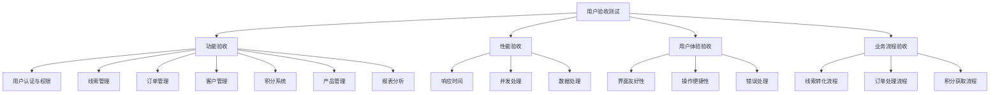
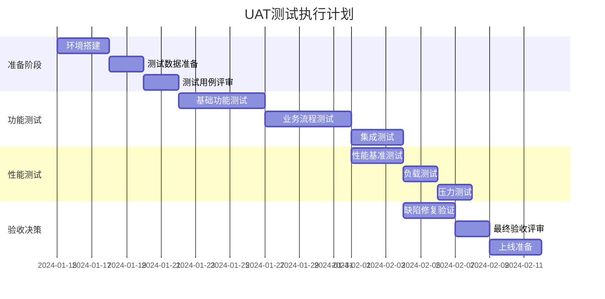
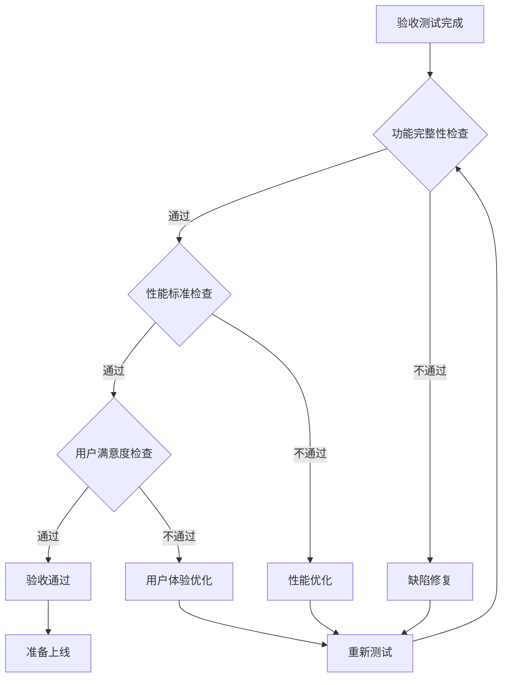

# 罗莱L2C销售管理系统 - 用户验收测试计划与成功标准

## 📋 文档概述

### 文档目标
- 建立完整的用户验收测试（UAT）框架
- 定义明确的成功标准和验收条件
- 确保第一期MVP满足业务需求和用户期望
- 建立质量保证和风险控制机制

### 适用范围
- 第一期MVP所有核心模块
- 业务用户验收测试
- 系统集成测试验收
- 性能和安全验收测试

---

## 🎯 第一期MVP验收范围

### 核心业务模块验收


---

## 📊 验收测试计划

### 第1周：基础功能验收
#### 用户认证与权限模块
**测试场景**：
- ✅ 用户登录/登出功能
- ✅ 角色权限控制
- ✅ 密码安全策略
- ✅ 会话管理

**验收标准**：
```typescript
interface AuthAcceptanceCriteria {
  loginSuccess: {
    responseTime: "< 2秒";
    successRate: "> 99%";
    securityCompliance: "符合企业安全标准";
  };
  
  rolePermission: {
    accessControl: "精确到功能级别";
    unauthorizedAccess: "完全阻止";
    permissionInheritance: "正确继承";
  };
  
  sessionManagement: {
    timeout: "30分钟无操作自动登出";
    concurrentSessions: "支持多设备登录";
    secureLogout: "完全清除会话信息";
  };
}
```

#### 线索管理模块
**测试场景**：
- ✅ 线索录入和编辑
- ✅ 线索分配和转移
- ✅ 线索状态流转
- ✅ 线索转化为订单

**验收标准**：
```typescript
interface LeadAcceptanceCriteria {
  leadCreation: {
    mandatoryFields: "客户姓名、联系方式、产品需求";
    dataValidation: "手机号、邮箱格式验证";
    duplicateCheck: "重复线索提醒";
  };
  
  leadAssignment: {
    autoAssignment: "基于区域和负载均衡";
    manualAssignment: "支持管理员手动分配";
    notificationSent: "分配通知及时发送";
  };
  
  statusTransition: {
    validTransitions: "只允许合法状态转换";
    reasonRequired: "状态变更需要填写原因";
    historyTracking: "完整记录状态变更历史";
  };
}
```

### 第2周：核心业务流程验收
#### 订单管理模块
**测试场景**：
- ✅ 订单创建和编辑
- ✅ 订单状态管理
- ✅ 订单审批流程
- ✅ 订单取消和退款

**验收标准**：
```typescript
interface OrderAcceptanceCriteria {
  orderCreation: {
    fromLead: "线索一键转订单";
    productSelection: "支持多产品组合";
    priceCalculation: "自动计算总价和优惠";
    customerInfo: "自动关联客户信息";
  };
  
  orderWorkflow: {
    statusFlow: "12个核心状态正确流转";
    approvalProcess: "超限额订单自动进入审批";
    notificationSystem: "状态变更及时通知相关人员";
  };
  
  orderModification: {
    editableFields: "订单确认前可编辑产品和数量";
    changeHistory: "记录所有修改历史";
    impactAnalysis: "修改影响分析和提醒";
  };
}
```

#### 客户管理模块
**测试场景**：
- ✅ 客户信息管理
- ✅ 客户标签和分类
- ✅ 客户沟通记录
- ✅ 客户价值分析

**验收标准**：
```typescript
interface CustomerAcceptanceCriteria {
  customerProfile: {
    basicInfo: "姓名、联系方式、地址等基础信息";
    preferences: "产品偏好、价格敏感度";
    history: "历史订单和沟通记录";
  };
  
  customerSegmentation: {
    autoTagging: "基于行为自动打标签";
    manualTagging: "支持手动添加标签";
    valueCalculation: "客户生命周期价值计算";
  };
  
  communicationTracking: {
    multiChannel: "电话、微信、邮件等多渠道记录";
    timeline: "时间线展示沟通历史";
    followUpReminder: "自动提醒跟进时间";
  };
}
```

### 第3周：增值功能验收
#### 积分系统模块
**测试场景**：
- ✅ 积分获取规则
- ✅ 积分消费功能
- ✅ 积分商城操作
- ✅ 积分历史查询

**验收标准**：
```typescript
interface PointsAcceptanceCriteria {
  pointsEarning: {
    orderCompletion: "订单完成自动获得积分";
    referralBonus: "推荐奖励积分";
    activityBonus: "活动期间额外积分";
  };
  
  pointsRedemption: {
    mallProducts: "积分商城商品兑换";
    orderDiscount: "订单抵扣功能";
    giftExchange: "礼品兑换功能";
  };
  
  pointsManagement: {
    balanceTracking: "实时积分余额";
    historyQuery: "积分获取和消费历史";
    expirationAlert: "积分过期提醒";
  };
}
```

### 第4周：系统集成验收
#### 产品管理模块
**测试场景**：
- ✅ 产品信息管理
- ✅ 产品分类体系
- ✅ 价格管理
- ✅ 产品推荐

**验收标准**：
```typescript
interface ProductAcceptanceCriteria {
  productCatalog: {
    categoryStructure: "3级分类体系";
    productAttributes: "完整的产品属性信息";
    imageManagement: "支持多图片上传和管理";
  };
  
  priceManagement: {
    tieredPricing: "阶梯价格支持";
    promotionalPricing: "促销价格管理";
    customerSpecificPricing: "客户专属价格";
  };
  
  productRecommendation: {
    relatedProducts: "相关产品推荐";
    crossSelling: "交叉销售推荐";
    upselling: "升级销售推荐";
  };
}
```

#### 报表分析模块
**测试场景**：
- ✅ 销售报表生成
- ✅ 客户分析报表
- ✅ 积分使用报表
- ✅ 自定义报表

**验收标准**：
```typescript
interface ReportAcceptanceCriteria {
  salesReports: {
    dailySales: "日销售额统计";
    monthlySales: "月度销售趋势";
    productSales: "产品销售排行";
    salesPersonPerformance: "销售人员业绩";
  };
  
  customerAnalytics: {
    customerAcquisition: "客户获取分析";
    customerRetention: "客户留存分析";
    customerValue: "客户价值分析";
  };
  
  reportGeneration: {
    realTimeData: "实时数据更新";
    exportFormats: "支持Excel、PDF导出";
    scheduledReports: "定时报表生成";
  };
}
```

---

## 🎯 成功标准定义

### 功能完整性标准
```typescript
interface FunctionalCompleteness {
  coreFeatures: {
    implementation: "100%";
    testCoverage: "> 90%";
    bugSeverity: "无P0/P1级别缺陷";
  };
  
  userInterface: {
    responsiveDesign: "支持PC和移动端";
    accessibility: "符合WCAG 2.1 AA标准";
    browserCompatibility: "支持主流浏览器";
  };
  
  dataIntegrity: {
    dataConsistency: "数据一致性100%";
    dataValidation: "输入验证覆盖率100%";
    dataBackup: "自动备份机制";
  };
}
```

### 性能标准
```typescript
interface PerformanceStandards {
  responseTime: {
    pageLoad: "< 3秒";
    apiResponse: "< 1秒";
    reportGeneration: "< 10秒";
  };
  
  concurrency: {
    simultaneousUsers: "> 100";
    peakLoad: "支持200%日常负载";
    resourceUtilization: "CPU < 70%, 内存 < 80%";
  };
  
  availability: {
    uptime: "> 99.5%";
    plannedDowntime: "< 4小时/月";
    recoveryTime: "< 15分钟";
  };
}
```

### 用户体验标准
```typescript
interface UserExperienceStandards {
  usability: {
    learningCurve: "新用户30分钟内掌握基本操作";
    taskCompletion: "核心任务完成率 > 95%";
    errorRate: "用户操作错误率 < 5%";
  };
  
  satisfaction: {
    userSatisfactionScore: "> 4.0/5.0";
    netPromoterScore: "> 50";
    supportTickets: "< 10个/月";
  };
  
  efficiency: {
    taskTime: "比现有流程节省30%时间";
    clickReduction: "减少50%不必要点击";
    automationRate: "自动化处理率 > 80%";
  };
}
```

---

## 🧪 测试执行计划

### 测试团队组织
```typescript
interface TestTeam {
  businessUsers: {
    salesManager: "销售经理 - 线索和订单流程测试";
    customerService: "客服代表 - 客户管理和积分系统测试";
    productManager: "产品经理 - 产品管理和报表测试";
  };
  
  technicalTeam: {
    qaEngineer: "QA工程师 - 功能和集成测试";
    performanceEngineer: "性能工程师 - 性能和负载测试";
    securityEngineer: "安全工程师 - 安全测试";
  };
  
  managementTeam: {
    projectManager: "项目经理 - 整体验收协调";
    businessOwner: "业务负责人 - 最终验收决策";
  };
}
```

### 测试环境准备
```typescript
interface TestEnvironment {
  infrastructure: {
    servers: "独立的UAT环境";
    database: "生产数据脱敏副本";
    network: "模拟生产网络环境";
  };
  
  testData: {
    customers: "1000个测试客户";
    products: "200个测试产品";
    orders: "500个历史订单";
    users: "50个测试用户账号";
  };
  
  tools: {
    testManagement: "TestRail测试用例管理";
    bugTracking: "Jira缺陷跟踪";
    performanceTesting: "JMeter性能测试";
  };
}
```

### 测试执行时间表


---

## 📋 验收检查清单

### 功能验收检查清单
- [ ] **用户认证与权限**
  - [ ] 登录/登出功能正常
  - [ ] 角色权限控制准确
  - [ ] 密码策略符合安全要求
  - [ ] 会话管理机制完善

- [ ] **线索管理**
  - [ ] 线索录入功能完整
  - [ ] 线索分配机制有效
  - [ ] 状态流转逻辑正确
  - [ ] 线索转化功能正常

- [ ] **订单管理**
  - [ ] 订单创建流程顺畅
  - [ ] 订单状态管理准确
  - [ ] 审批流程运行正常
  - [ ] 订单修改功能完善

- [ ] **客户管理**
  - [ ] 客户信息管理完整
  - [ ] 客户分类功能有效
  - [ ] 沟通记录功能正常
  - [ ] 客户分析功能准确

- [ ] **积分系统**
  - [ ] 积分获取规则正确
  - [ ] 积分消费功能正常
  - [ ] 积分商城运行顺畅
  - [ ] 积分历史查询准确

- [ ] **产品管理**
  - [ ] 产品信息管理完整
  - [ ] 产品分类体系清晰
  - [ ] 价格管理功能正常
  - [ ] 产品推荐算法有效

- [ ] **报表分析**
  - [ ] 销售报表数据准确
  - [ ] 客户分析报表有效
  - [ ] 积分报表功能正常
  - [ ] 自定义报表功能完善

### 性能验收检查清单
- [ ] **响应时间**
  - [ ] 页面加载时间 < 3秒
  - [ ] API响应时间 < 1秒
  - [ ] 报表生成时间 < 10秒
  - [ ] 数据库查询优化

- [ ] **并发处理**
  - [ ] 支持100个并发用户
  - [ ] 峰值负载处理能力
  - [ ] 资源利用率合理
  - [ ] 系统稳定性良好

- [ ] **可用性**
  - [ ] 系统可用性 > 99.5%
  - [ ] 故障恢复时间 < 15分钟
  - [ ] 数据备份机制完善
  - [ ] 监控告警机制有效

### 用户体验验收检查清单
- [ ] **界面设计**
  - [ ] 界面布局合理美观
  - [ ] 操作流程简洁明了
  - [ ] 错误提示友好清晰
  - [ ] 响应式设计适配

- [ ] **操作便捷性**
  - [ ] 核心功能易于发现
  - [ ] 操作步骤简化优化
  - [ ] 快捷键支持完善
  - [ ] 批量操作功能有效

- [ ] **用户满意度**
  - [ ] 用户培训效果良好
  - [ ] 用户反馈积极正面
  - [ ] 业务效率显著提升
  - [ ] 用户采用率达标

---

## 🚨 风险控制与应急预案

### 验收风险识别
```typescript
interface AcceptanceRisks {
  functionalRisks: {
    incompleteFeatures: {
      probability: "中等";
      impact: "高";
      mitigation: "功能优先级调整，核心功能优先";
    };
    
    integrationIssues: {
      probability: "中等";
      impact: "高";
      mitigation: "提前集成测试，接口契约测试";
    };
  };
  
  performanceRisks: {
    slowResponse: {
      probability: "低";
      impact: "中等";
      mitigation: "性能优化，缓存策略";
    };
    
    scalabilityIssues: {
      probability: "低";
      impact: "高";
      mitigation: "架构优化，负载均衡";
    };
  };
  
  userAcceptanceRisks: {
    userResistance: {
      probability: "中等";
      impact: "高";
      mitigation: "用户培训，变更管理";
    };
    
    usabilityIssues: {
      probability: "低";
      impact: "中等";
      mitigation: "用户体验优化，界面改进";
    };
  };
}
```

### 应急预案
```typescript
interface ContingencyPlans {
  criticalDefects: {
    action: "立即停止验收，进入缺陷修复模式";
    timeline: "48小时内修复P0缺陷";
    escalation: "技术总监和项目总监介入";
  };
  
  performanceIssues: {
    action: "性能优化专项小组成立";
    timeline: "72小时内提供优化方案";
    fallback: "功能降级，保证核心功能";
  };
  
  userRejection: {
    action: "用户需求重新梳理";
    timeline: "1周内完成需求确认";
    adjustment: "功能调整和用户培训加强";
  };
}
```

---

## 📈 验收成功标准总结

### 最终验收条件
1. **功能完整性**：所有P0功能100%实现，P1功能90%实现
2. **质量标准**：无P0/P1缺陷，P2缺陷 < 10个
3. **性能达标**：所有性能指标达到预定标准
4. **用户满意度**：用户满意度评分 > 4.0/5.0
5. **业务价值**：核心业务流程效率提升 > 30%

### 验收决策流程


### 项目成功指标
- ✅ **按时交付**：8周开发计划按期完成
- ✅ **质量达标**：验收测试通过率 > 95%
- ✅ **用户认可**：业务用户签字确认
- ✅ **技术稳定**：系统运行稳定无重大故障
- ✅ **业务价值**：实现预期的业务目标

---

## 📝 总结

本用户验收测试计划为罗莱L2C销售管理系统第一期MVP提供了：

1. **完整的验收框架**：覆盖功能、性能、用户体验三个维度
2. **明确的成功标准**：量化的验收条件和质量指标
3. **详细的执行计划**：4周验收时间表和责任分工
4. **有效的风险控制**：风险识别和应急预案
5. **科学的决策流程**：验收决策和上线准备流程

通过严格执行本验收计划，确保第一期MVP能够满足业务需求，为后续功能扩展奠定坚实基础。
