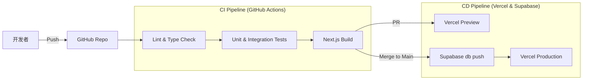

# 部署与运维方案

## 1. 部署架构设计

本系统采用 "SaaS First" 的策略，充分利用 Serverless 和 BaaS 优势，同时保留私有化部署能力以满足特定客户需求。

### 1.1 SaaS 交付架构（标准版）
基于 **Vercel + Supabase** 的全托管 Serverless 架构，实现零运维成本、弹性伸缩和全球加速。

| 组件 | 技术选型 | 托管平台 | 职责 |
| :--- | :--- | :--- | :--- |
| **前端/BFF** | Next.js 15+ (App Router) | **Vercel** | 静态资源 CDN、Server Components 渲染、Server Actions 接口 |
| **数据库/后端** | PostgreSQL, Auth, Realtime | **Supabase Cloud** | 关系型数据存储、身份认证、实时推送、对象存储 |
| **边缘计算** | Edge Functions | **Supabase** | 异步任务、Webhooks 处理、定时任务 (pg_cron) |
| **加速层** | Vercel Edge Network | **Vercel** | 全球 CDN 加速、Edge Middleware (限流/重定向) |

### 1.2 私有化交付架构（企业版）
基于 **Docker Compose** 的容器化方案，支持在客户私有云或 IDC 环境部署。

```yaml
# docker-compose.yml 架构示意
services:
  # 1. 应用服务 (Next.js)
  web-app:
    image: registry.l2c.com/web:latest
    environment:
      - NEXT_PUBLIC_SUPABASE_URL=http://kong:8000
      - NEXT_PUBLIC_SUPABASE_ANON_KEY=...
  
  # 2. Supabase 核心服务 (基于官方 Self-hosted 镜像)
  studio:    # 管理后台
  kong:      # API 网关
  auth:      # GoTrue 认证服务
  rest:      # PostgREST (自动 API)
  realtime:  # WebSocket 服务
  storage:   # S3 兼容对象存储
  meta:      # 数据库管理 API
  
  # 3. 数据存储
  db:
    image: supabase/postgres:15.1
    volumes:
      - ./pgdata:/var/lib/postgresql/data
```

---

## 2. CI/CD 流水线

基于 GitHub Actions 实现自动化构建、测试和部署，遵循 "提交即上线" 的敏捷原则。

### 2.1 流水线工作流



### 2.2 自动化配置

#### 代码检查 (Pull Request)
```yaml
# .github/workflows/ci.yml
name: CI
on: [pull_request]
jobs:
  check:
    runs-on: ubuntu-latest
    steps:
      - uses: actions/checkout@v4
      - run: pnpm install
      - run: pnpm lint
      - run: pnpm type-check
      - run: pnpm test:unit
```

#### 数据库部署 (Merge to Main)
```yaml
# .github/workflows/deploy-db.yml
name: Deploy DB
on:
  push:
    branches: [main]
jobs:
  deploy-migrations:
    runs-on: ubuntu-latest
    steps:
      - uses: supabase/setup-cli@v1
      - run: supabase db push
        env:
          SUPABASE_ACCESS_TOKEN: ${{ secrets.SUPABASE_ACCESS_TOKEN }}
          SUPABASE_DB_PASSWORD: ${{ secrets.SUPABASE_DB_PASSWORD }}
          SUPABASE_PROJECT_ID: ${{ secrets.SUPABASE_PROJECT_ID }}
```

---

## 3. 测试验证体系

建立适应 Next.js + Supabase 的敏捷测试金字塔，重点在于利用 Supabase 本地环境进行高保真集成测试。

### 3.1 测试分层
- **E2E 测试 (10%)**: Playwright。模拟真实用户路径（登录 -> 下单 -> 支付）。
- **集成测试 (30%)**: Jest + Supabase Local。验证 Server Actions 与数据库交互，覆盖 RLS 策略。
- **单元测试 (60%)**: Jest + React Testing Library。验证纯函数、UI 组件状态。

### 3.2 本地集成测试环境
利用 `supabase start` 启动完整的本地后端栈，确保测试环境与生产环境一致。

```bash
# 启动本地环境
supabase start

# 运行集成测试
pnpm test:integration
```

**集成测试示例 (Server Action)**:
```typescript
// actions/createOrder.test.ts
import { createClient } from '@/utils/supabase/server';
import { createOrder } from './createOrder';

// 每个测试前重置数据
beforeEach(async () => {
  const supabase = createClient();
  await supabase.rpc('reset_test_data'); 
});

test('creates order successfully', async () => {
  const result = await createOrder({ userId: 'user_123', amount: 100 });
  expect(result.success).toBe(true);
});
```

---

## 4. 监控与运维

### 4.1 监控体系
- **应用监控**: Vercel Analytics (PV/UV, Web Vitals), Vercel Logs (运行时错误)。
- **数据库监控**: Supabase Database Health (CPU, RAM, Disk IO), Slow Query Logs。
- **异常追踪**: Sentry (前端 + 后端异常聚合)。

### 4.2 运维策略
- **数据库备份**: Supabase 每日自动备份 + PITR (Point-in-Time Recovery) 支持。
- **日志归档**: 审计日志定期归档至冷存储 (Object Storage)。
- **灰度发布**: 利用 Vercel 的 Deployment Protection 和 Feature Flags 进行渐进式发布。

---

## 5. 持续演进计划

遵循 "数据驱动" 和 "以用户为中心" 的原则进行系统迭代。

### 5.1 优化方向
- **性能**: 持续关注 Core Web Vitals，优化 LCP 和 CLS 指标。
- **成本**: 定期分析 Supabase 资源使用量，优化索引和查询。
- **体验**: 基于用户行为数据 (Vercel Analytics) 优化交互流程。

### 5.2 风险控制
- **回滚机制**: Vercel Instant Rollback (秒级回滚前端)，Supabase Database Restore (分钟级回滚数据)。
- **应急预案**: 制定关键故障（如 Auth 服务不可用、数据库连接耗尽）的 SOP。
