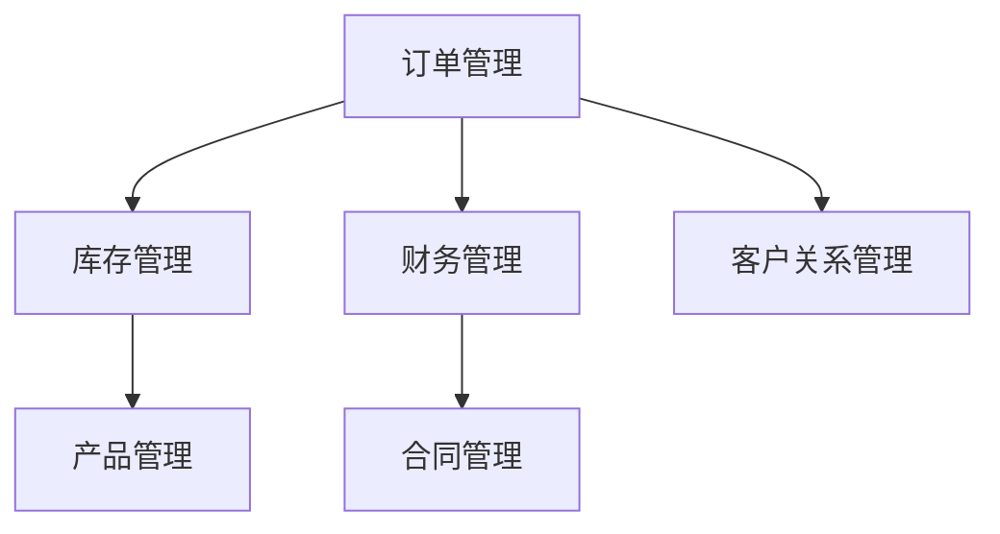

# 业务集成与搜索设计

## 1. 业务模块集成

基于 **Modular Monolith (模块化单体)** 架构，实现核心业务模块（订单、库存、财务、CRM）的高效集成。

### 1.1 集成原则
- **逻辑隔离**：模块间通过 Server Actions 或数据库外键交互，禁止跨模块直接修改数据。
- **物理统一**：所有数据存储于同一 PostgreSQL 实例，利用 ACID 特性保证一致性。
- **异步解耦**：非关键路径业务（如通知、统计）通过 Supabase Webhooks 或 pg_cron 异步处理。

### 1.2 模块依赖关系


### 1.3 核心集成场景：订单与库存
采用 **数据库事务 (RPC)** 保证 "下单锁库" 的原子性。

```sql
-- 事务函数：创建订单并扣减库存
create or replace function create_order_transaction(p_user_id uuid, p_items jsonb)
returns uuid
language plpgsql
as $$
declare
  v_order_id uuid;
  v_item jsonb;
begin
  -- 1. 创建订单
  insert into orders (user_id, status) values (p_user_id, 'pending') returning id into v_order_id;
  
  -- 2. 遍历商品扣减库存
  for v_item in select * from jsonb_array_elements(p_items) loop
    update inventory
    set quantity = quantity - (v_item->>'quantity')::int
    where sku_id = (v_item->>'sku_id')::uuid
      and quantity >= (v_item->>'quantity')::int;
      
    if not found then
      raise exception '库存不足: %', v_item->>'sku_id';
    end if;
    
    insert into order_items (order_id, sku_id, quantity)
    values (v_order_id, (v_item->>'sku_id')::uuid, (v_item->>'quantity')::int);
  end loop;
  
  return v_order_id;
end;
$$;
```

---

## 2. 搜索引擎设计

摒弃 Elasticsearch 等重型中间件，充分利用 PostgreSQL 的 **Full Text Search (FTS)** 和 **Trigram** 扩展，构建轻量级高性能搜索。

### 2.1 技术选型
| 功能 | 技术方案 | 说明 |
| :--- | :--- | :--- |
| **全文检索** | PostgreSQL FTS (`tsvector`) | 支持复杂的布尔查询、权重排序 |
| **模糊匹配** | `pg_trgm` 扩展 | 解决拼写错误和前缀/后缀匹配 |
| **中文支持** | `jieba` (若支持) / `simple` + N-gram | 实现中文分词检索 |
| **实时更新** | Generated Columns | 数据变更自动更新索引，零延迟 |

### 2.2 数据库设计

```sql
-- 启用扩展
create extension if not exists "pg_trgm";

-- 商品表：自动维护搜索向量
alter table products
add column search_vector tsvector
generated always as (
  setweight(to_tsvector('simple', coalesce(name, '')), 'A') ||
  setweight(to_tsvector('simple', coalesce(description, '')), 'B') ||
  setweight(to_tsvector('simple', coalesce(category_name, '')), 'C')
) stored;

-- 索引加速
create index idx_products_search on products using gin(search_vector);
create index idx_products_name_trgm on products using gin(name gin_trgm_ops);
```

### 2.3 搜索接口实现

```sql
create or replace function search_products(
  keyword text,
  min_price numeric default null,
  page_no int default 1,
  page_size int default 20
)
returns table (
  id uuid,
  name text,
  price numeric,
  similarity float
)
language plpgsql
as $$
begin
  return query
  select
    p.id,
    p.name,
    p.price,
    similarity(p.name, keyword) as similarity
  from products p
  where
    (
      keyword is null or keyword = '' or
      p.search_vector @@ plainto_tsquery('simple', keyword) or -- 全文检索
      p.name % keyword -- 模糊匹配
    )
    and (min_price is null or p.price >= min_price)
  order by
    similarity desc,
    ts_rank(p.search_vector, plainto_tsquery('simple', keyword)) desc
  limit page_size
  offset (page_no - 1) * page_size;
end;
$$;
```
