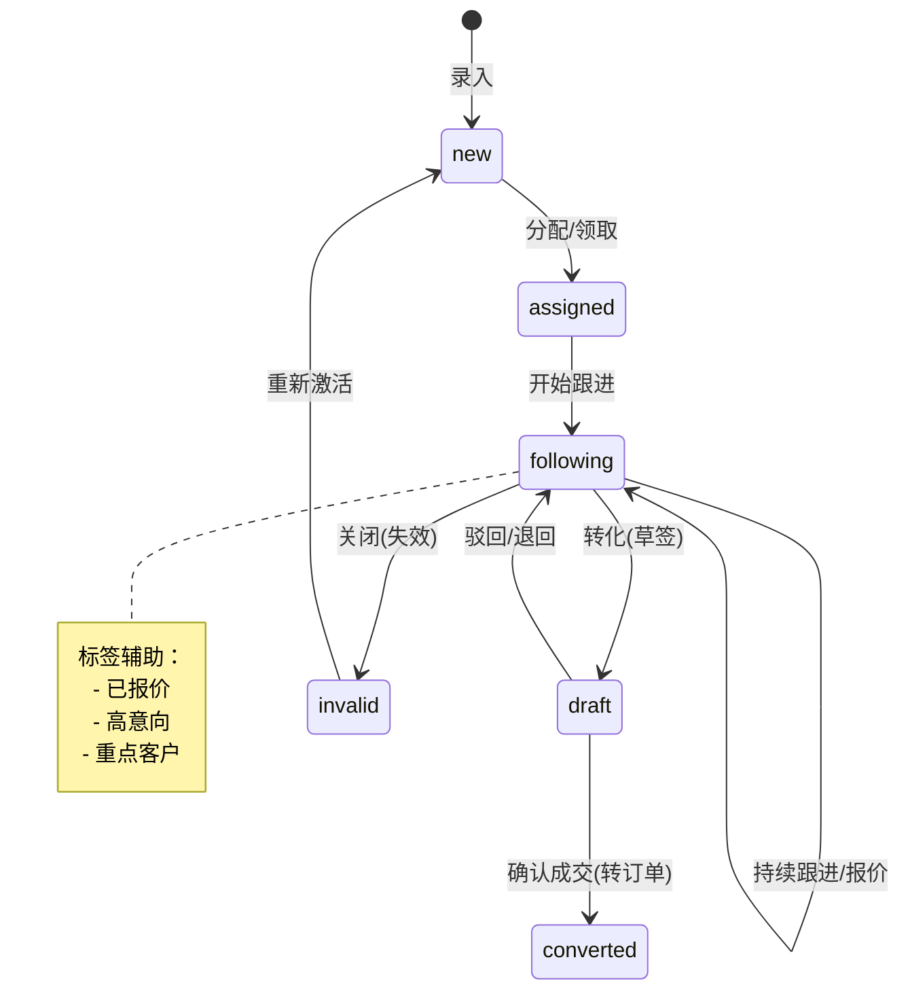

# 营销与客户管理设计

## 1. 模块概述

营销与客户管理模块 (CRM) 是 L2C 系统的核心入口，负责从多渠道获取线索，经过精细化跟进和培育，最终转化为成交客户。该模块实现了“线索 -> 商机 -> 客户 -> 合同”的全链路闭环管理。

### 1.1 核心目标
- **全渠道获客**：统一管理线上（小程序、官网）和线下（门店、展会）线索来源。
- **360°客户视图**：聚合客户的基本信息、跟进记录、交易历史和服务记录。
- **销售自动化 (SFA)**：通过公海池规则、智能分配和自动提醒提升销售效率。
- **精细化运营**：基于 RFM 模型和标签体系进行客户分层和精准营销。

### 1.2 业务范围
- **线索管理 (Leads)**：录入、分配、跟进、转化。
- **客户管理 (Customers)**：档案、联系人、公海池。
- **商机与报价 (Opportunities & Quotes)**：需求分析、报价单版本管理。
- **合同管理 (Contracts)**：合同生成、电子签章、归档。

---

## 2. 业务流程

### 2.1 线索状态流转 (State Machine)
基于 Supabase Database Enum 和 Check Constraints 严格控制状态流转。



### 2.2 公海池流转规则
1.  **自动回收**：
    *   新分配线索 **24小时** 未跟进 -> 回收至公海。
    *   私海客户 **30天** 无有效跟进记录 -> 回收至公海。
    *   私海客户 **90天** 未成交 -> 回收至公海。
2.  **领取规则**：
    *   每人每日最多领取 **10条** 公海线索。
    *   私海客户上限 **200人** (超出需释放)。

---

## 3. 核心功能设计

### 3.1 线索管理
- **多渠道接入**：支持 Server Actions 接收 Webhook (广告投放) 和手动录入。
- **智能分配**：
    *   **轮播 (Round Robin)**：按顺序平均分配给在线销售。
    *   **基于规则**：按区域 (City/District) 或产品偏好分配。
- **跟进记录**：支持文本、语音转文字、图片上传，自动记录地理位置 (GPS)。

### 3.2 客户管理
- **客户查重**：基于 `phone` 和 `name` 的模糊匹配，防止撞单。
- **客户分级**：
    *   **A级 (高价值)**：年消费 > 10w 或 活跃度高。
    *   **B级 (潜力)**：有报价未成交。
    *   **C级 (普通)**：仅咨询。
- **合并客户**：支持将重复的客户档案合并，关联数据自动迁移。

### 3.3 报价管理
- **多版本报价**：支持对同一商机创建多个报价版本 (V1, V2...)。
- **审批流程**：折扣低于 **9折** 自动触发主管审批。
- **分享报价**：生成一次性访问链接 (Signed URL) 分享给客户查看。

---

## 4. 数据库设计

### 4.1 核心表结构

#### 线索表 (leads)
```sql
create type lead_status as enum ('new', 'assigned', 'following', 'draft', 'converted', 'invalid');

create table leads (
  id uuid primary key default gen_random_uuid(),
  lead_no varchar(32) unique not null,
  name varchar(100) not null,
  phone varchar(20) not null,
  source varchar(50) not null, -- 来源: wechat, store, ad, referral
  status lead_status default 'new',
  
  -- 需求画像
  product_category varchar(50), -- 意向品类
  budget_range varchar(50),     -- 预算范围
  decoration_stage varchar(50), -- 装修阶段
  
  -- 分配信息
  owner_id uuid references auth.users(id),
  store_id uuid,
  assigned_at timestamptz,
  
  -- 系统字段
  created_at timestamptz default now(),
  updated_at timestamptz default now(),
  tenant_id uuid not null
);

-- 索引
create index idx_leads_phone on leads(phone);
create index idx_leads_owner on leads(owner_id);
create index idx_leads_status on leads(status);
```

#### 客户表 (customers)
```sql
create table customers (
  id uuid primary key default gen_random_uuid(),
  name varchar(100) not null,
  type varchar(20) default 'personal', -- personal, enterprise
  level varchar(20) default 'C',       -- A, B, C
  pool_status varchar(20) default 'private', -- private, public
  
  owner_id uuid references auth.users(id),
  last_followup_at timestamptz,
  
  credit_score int default 0,
  tenant_id uuid not null
);
```

#### 跟进记录表 (follow_ups)
```sql
create table follow_ups (
  id uuid primary key default gen_random_uuid(),
  target_type varchar(20) not null, -- lead, customer, opportunity
  target_id uuid not null,
  
  way varchar(20) not null, -- phone, visit, wechat
  content text,
  attachments text[], -- 图片/音频 URL
  
  location point, -- GPS坐标
  created_by uuid references auth.users(id),
  created_at timestamptz default now()
);
```

---

## 5. 前端界面规范

### 5.1 线索管理页面
- **布局**：左侧筛选栏 (状态、来源、时间)，右侧数据表格。
- **交互**：
    *   **快速跟进**：列表页直接点击“写跟进”弹出抽屉。
    *   **状态变更**：拖拽看板 (Kanban) 或 下拉菜单修改状态。
    *   **批量操作**：批量分配、批量转移公海。
- **关键字段展示**：姓名、电话 (脱敏)、意向度 (星级)、最后跟进时间 (高亮逾期)。

### 5.2 客户详情页 (360视图)
- **头部**：客户基本卡片 (头像、等级、标签、快捷拨号)。
- **主体 Tabs**：
    *   **动态**：时间轴展示所有跟进、操作记录。
    *   **商机**：关联的报价单、合同。
    *   **订单**：历史交易记录。
    *   **资料**：附件、户型图。
