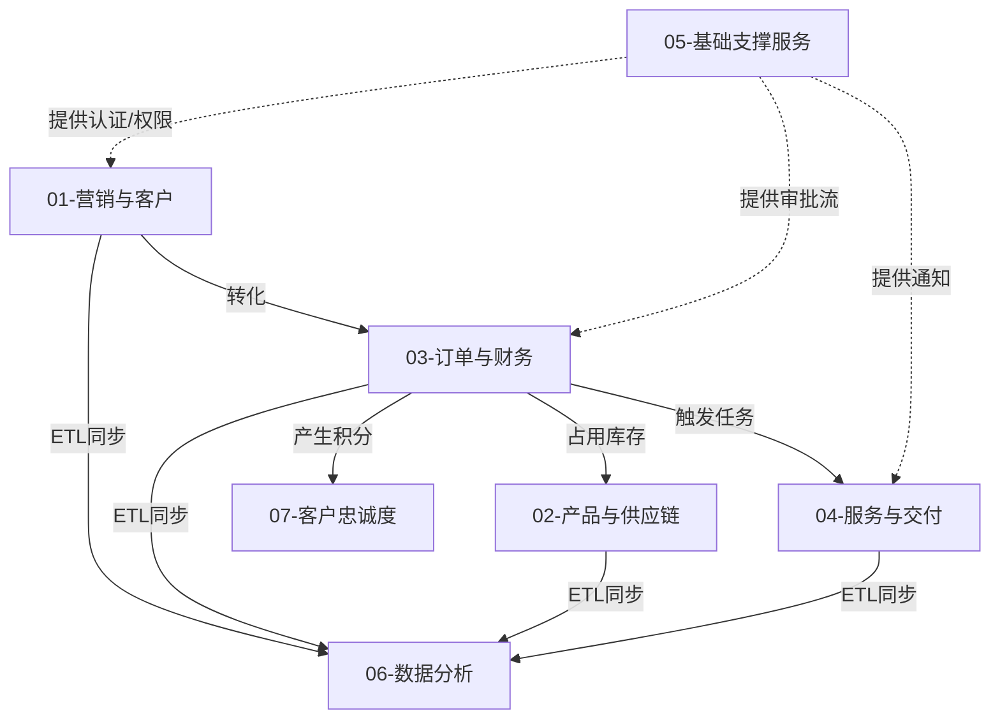

# 模块设计文档索引

本目录包含 **7个核心业务模块设计文档**。经过重构与合并，新的文档结构按业务领域划分，全面涵盖了从营销获客、订单交易、供应链交付到售后忠诚度管理的完整业务闭环。

## 🏢 核心业务域 (Core Business Domains)

| 文档名称 | 核心内容 | 包含原模块 (已归档/合并) |
| :--- | :--- | :--- |
| **[01-营销与客户管理设计.md](./01-营销与客户管理设计.md)** | 线索获取(Leads)、客户360视图、公海池规则、报价与合同 | 线索, 客户, 报价, 合同, 分享 |
| **[02-产品与供应链管理设计.md](./02-产品与供应链管理设计.md)** | 产品定义(SKU)、5级价格体系、多仓库存(WMS)、采购与物流 | 产品, 库存, 物流, 供应商 |
| **[03-订单与财务管理设计.md](./03-订单与财务管理设计.md)** | 订单全生命周期、支付集成、财务对账、发票管理 | 订单, 财务 |
| **[04-服务与交付管理设计.md](./04-服务与交付管理设计.md)** | 测量/安装服务流程、技师智能调度、现场验收、服务商管理 | 测量, 安装, 服务商 |

## 🧩 支撑与增长域 (Support & Growth Domains)

| 文档名称 | 核心内容 | 包含原模块 (已归档/合并) |
| :--- | :--- | :--- |
| **[05-基础支撑服务设计.md](./05-基础支撑服务设计.md)** | 统一认证(Auth)、RBAC权限、系统配置、审批流引擎、消息通知 | 认证, 权限, 配置, 审批, 通知 |
| **[06-数据分析与报表设计.md](./06-数据分析与报表设计.md)** | 经营驾驶舱、销售漏斗、自定义报表、数据仓库模型 | 报表, 数据分析 |
| **[07-客户忠诚度管理设计.md](./07-客户忠诚度管理设计.md)** | 会员等级体系、积分规则(Earn/Burn)、积分商城 | 积分, 商城 |

---

## 🔄 模块间依赖关系

## 🛠️ 设计原则

1.  **高内聚低耦合**：各模块通过定义的接口 (Server Actions / Database Functions) 交互，避免直接操作对方数据库表。
2.  **闭环管理**：每个模块都实现了从"发起"到"结束"的完整状态流转。
3.  **可配置化**：业务规则（如公海回收时间、积分比例）支持后台配置，无需改代码。
4.  **移动优先**：充分考虑了一线销售和技师的移动端操作体验。

---

**文档总数**: 7个模块设计文档  
**维护团队**: 罗莱L2C项目组  
**最后更新**: 2025-12-07
